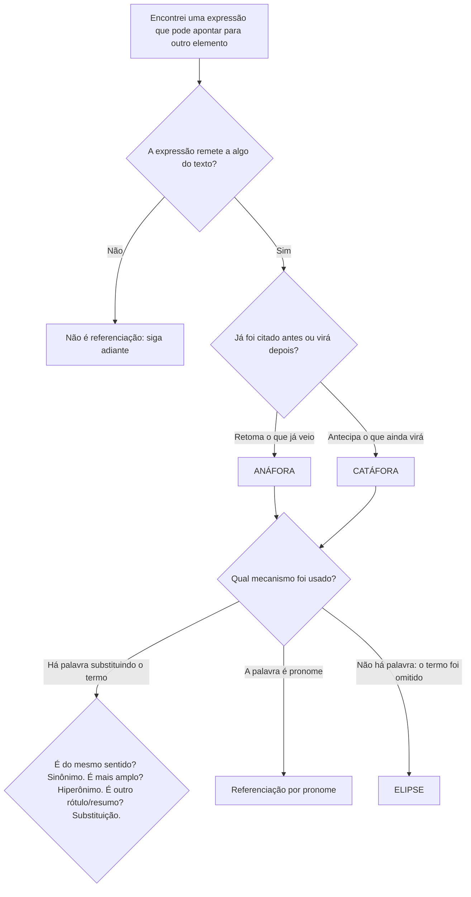

# Coesão Textual

> [!info] Metadados
> **Disciplina:** Língua Portuguesa
> **Bloco:** 1.1 — Língua Portuguesa (FASE 1 — Fundamentos)
> **Tópico:** 4. Coesão textual
> **Subtópicos:** Referenciação (pronomes, sinonímia, hiperonímia, substituição, elipse) · Conectores lógicos e temporais · Tempos verbais e coerência narrativa
> **Pré-requisitos:** [[Compreensao-e-Interpretacao-de-Textos|Compreensão e interpretação de textos]]; [[Tipos-e-Generos-Textuais|Tipos e gêneros textuais]]; [[Ortografia-Oficial|Ortografia oficial]]
> **Cargo:** Analista de TI — Perfil 3 (Desenvolvimento de Software) · DATAPREV 2026
> **Data:** 2026-08-27

---

## 1. O cimento do texto: por que começar por aqui

Nas notas anteriores, você aprendeu três coisas que parecem diferentes, mas que se somam: **compreender** o que um texto diz — e o que ele permite concluir ([[Compreensao-e-Interpretacao-de-Textos|Compreensão e interpretação de textos]]); **reconhecer** as formas que os textos assumem e as funções que cumprem ([[Tipos-e-Generos-Textuais|Tipos e gêneros textuais]]); e **escrever corretamente** as palavras que compõem esses textos ([[Ortografia-Oficial|Ortografia oficial]]). Agora falta uma pergunta que une tudo: **o que faz um texto ser um texto — e não apenas um amontoado de frases?**

Pense numa parede de tijolos. Cada tijolo pode ser excelente, do melhor material, perfeitamente moldado. Sem o cimento entre eles, porém, não existe parede — existe uma pilha de tijolos. Com os textos acontece o mesmo: cada frase pode estar gramaticalmente correta e perfeitamente escrita, mas, se não houver uma ligação entre ela e a seguinte, o leitor não percebe ali uma unidade de sentido. Essa ligação é o que chamamos de **coesão textual**.

> [!important] A observação da ementa que justifica esta nota
> "Dominar coesão e conectores é essencial para a compreensão de textos longos de outras disciplinas."
>
> Isso não é retórica. Em um texto técnico de **segurança da informação**, em um artigo da **LGPD** ou em um **relatório** (gênero que você já conhece), palavras como **entretanto**, **portanto**, **ademais** e **além disso** funcionam como placas de trânsito: elas dizem se o que vem em seguida é uma ressalva, uma conclusão ou um acréscimo. Quem não domina esses sinais lê o texto errado — e responde errado a questão, mesmo conhecendo o conteúdo técnico de trás para frente. Para o **Analista de TI — Perfil 3**, que lê manuais, documentações e especificações todos os dias, essa habilidade é tão profissional quanto técnica.

Faça uma experiência. Leia estas três frases:

> "O servidor caiu às 14h. A equipe foi acionada às 14h05. O backup foi restaurado às 14h20."

Você percebe que elas *andam juntas*: há uma sequência, uma história sendo contada. Agora leia esta versão:

> "O servidor caiu às 14h. O backup foi restaurado às 14h20. A equipe foi acionada às 14h05."

Aqui está o ponto de partida desta nota: as mesmas palavras, a mesma informação, mas a ordem, os elementos de ligação e a relação temporal mudaram — e o leitor precisa operar para reconstruir o sentido. Imagine um texto de dez páginas com essas ligações mal feitas. É por isso que a coesão é estudada: ela decide se a leitura flui ou se trava.

Uma pergunta para guiar tudo o que vem pela frente: **o que separa uma sequência coesa de uma sequência solta de frases?** Ao final desta nota, você responderá essa pergunta com três conjuntos de ferramentas: a **referenciação** (como o texto retoma e antecipa os elementos de que fala), os **conectores** (como o texto articula ideias) e os **tempos verbais** (como o texto organiza os acontecimentos no tempo).

---

## 2. Coesão e coerência: duas faces, uma pergunta

Antes de estudar os mecanismos, é preciso desarmar a pegadinha mais clássica do tópico: a diferença entre **coesão** e **coerência**. As duas palavras parecem quase a mesma coisa, e as bancas adoram explorar exatamente essa aparência.

> [!note] Definições que valem pontos
> **Coesão** é a **conexão entre as partes do texto**: os mecanismos linguísticos (pronomes, sinônimos, conectores, elipse) que amarram palavras, frases e parágrafos. É a "costura" visível do texto.
>
> **Coerência** é o **sentido global**: a lógica interna, a unidade de significado que faz o texto todo funcionar como um conjunto compatível. Não está numa palavra específica; está no resultado da leitura.

Voltemos à parede de tijolos. A **coesão** é o **cimento** — o material que liga tijolo a tijolo. A **coerência** é a **planta da casa** — o projeto que garante que todos aqueles tijolos, juntos, formem uma edificação com sentido. Um texto pode ter o melhor cimento do mundo e nenhuma planta: ele fica "bem amarrado" no detalhe, mas não quer dizer nada como um todo. E, do outro lado, um texto pode ter coerência sem precisar de cimento — basta que as ideias sejam logicamente compatíveis.

Veja um exemplo de texto **coeso**, mas **incoerente**:

> "Maria comprou um carro. O carro era azul. Azul é uma cor. Cores influenciam o humor. O humor de João estava péssimo."

Cada frase se liga à anterior: "o carro" retoma o carro de Maria, "azul" retoma a cor, "cores" retoma azul, "o humor" retoma a influência. Há coesão de sobra. Mas o texto, como um todo, não faz sentido: por que estamos falando do carro de Maria e terminamos no humor de João? Falta coerência — falta unidade de propósito.

| Aspecto | Coesão | Coerência |
|---|---|---|
| **O que é** | Conexão entre as partes do texto | Sentido global do texto |
| **Onde está** | Na superfície: palavras e recursos que se amarram | Na organização profunda: compatibilidade e lógica das ideias |
| **Pergunta que responde** | "Como as partes estão ligadas?" | "O texto faz sentido como um todo?" |
| **Como se observa** | Diretamente: pronomes, conectores, repetições, elipse | Por inferência: pela leitura global, pela compatibilidade das ideias |
| **Pode faltar?** | Sim: frases soltas, ainda assim plenas de sentido | Sim: texto "costurado" mas sem lógica interna |

> [!warning] Pegadinha 1 — coesão × coerência
> **A armadilha:** a questão pergunta se um trecho é "coeso" ou "coerente", e o candidato trata os dois como sinônimos.
> **O raciocínio errado:** "se o texto se conecta bem, ele é coerente".
> **Como se proteger:** pergunte-se *em que nível está a pergunta*. Se a alternativa fala de pronomes, conectores, retomadas e ligações entre frases → **coesão**. Se fala de sentido global, lógica, compatibilidade de ideias → **coerência**. E lembre: coesão não garante coerência — e um texto pode ser coerente mesmo com coesão escassa (pense em frases curtas de um manual de emergência: "Saia. Feche a porta. Chame os bombeiros." — pouquíssima coesão explícita, total coerência).

Na sequência, vamos estudar os mecanismos de coesão. Em cada um, faça a pergunta de prova: **"este recurso liga o quê a quê?"** É essa pergunta que revela se você está diante de referenciação, de conectivo ou de organização temporal.

---

## 3. Referenciação: retomar e antecipar para o texto caminhar

### 3.1 O que é um referente

Todo texto fala de alguma coisa: uma pessoa, um objeto, um lugar, uma ideia, um fato. Esse "algo de que se fala" chama-se **referente**. Quando um texto diz "a equipe de desenvolvimento entregou a nova versão", o referente é a equipe de desenvolvimento. Até aqui, nenhuma novidade.

O problema surge quando o texto precisa **voltar a falar** do mesmo referente. Se a cada retomada repetíssemos a expressão inteira, a leitura se tornaria insuportável:

> "**A analista Ana** abriu o chamado. **A analista Ana** verificou o erro. **A analista Ana** solicitou a correção. **A analista Ana** registrou o relatório."

Ninguém escreve assim — e a prova espera que você perceba por quê. A língua dispõe de mecanismos para **referenciar** (retomar e antecipar) os elementos do texto sem repetição cansativa, e o conjunto desses mecanismos é a **referenciação**. Repare: a palavra carrega "referência" dentro de si. Referenciar é fazer o leitor identificar, a cada momento, **de quem ou de que o texto está falando**.

> [!tip] A pergunta que guia a referenciação
> Ao encontrar um pronome ("ele", "isso", "seu"), um sinônimo ou uma expressão que "substitui" outra, pergunte: **"isto aponta para quê — ou para quem — neste texto?"** A resposta é o referente. É essa operação mental que as questões de referenciação testam.

### 3.2 Anáfora e catáfora: a direção da seta

A referenciação tem uma **direção**: o elemento que aponta pode **retomar** algo já mencionado ou **antecipar** algo que ainda virá. Guarde esses dois nomes, porque eles são as palavras-chave mais cobradas do tópico.

**Anáfora (retoma):** quando o termo remete a um elemento **já citado** no texto. O prefixo grego *ana-* tem ideia de "para trás". Observe:

> "O **sistema** apresentou falhas na madrugada. **Ele** foi reiniciado às 3h."

Quem é "Ele"? O sistema — que já tinha sido citado na frase anterior. "Ele" é um termo **anafórico**: ele **retoma** o referente "sistema". Funciona como uma seta apontando para trás.

**Catáfora (antecipa):** quando o termo remete a um elemento que **ainda virá** no texto (que será apresentado logo adiante). O prefixo *cata-* tem ideia de "para frente". Observe:

> "**Isto** é o que mais importa no projeto: prazos claros e comunicação diária."

A que se refere "Isto"? À expressão que vem depois: "prazos claros e comunicação diária". "Isto" é um termo **catafórico**: ele **antecipa** o referente que será revelado em seguida. A seta aponta para frente.

| Aspecto | Anáfora | Catáfora |
|---|---|---|
| **Direção** | Retoma o que **já foi dito** | Antecipa o que **ainda será dito** |
| **Prefixo** | *ana-* (para trás) | *cata-* (para frente) |
| **Pergunta** | "Retoma qual termo já citado?" | "Antecipa qual termo que virá?" |
| **Exemplo** | "O **sistema** caiu. **Ele** foi reiniciado." | "**Isto** é essencial: **prazos claros**." |

> [!important] Como a banca cobra a direção
> Frases-tipo de enunciado: *"O pronome 'ele' retoma..."*, *"O termo 'isto' antecipa..."*. A palavra-chave já entrega a resposta:
> - **"retoma", "remete", "refere-se a algo já citado"** → **anáfora**;
> - **"antecipa", "prepara", "remete a algo que virá"** → **catáfora**.
>
> Não há mistério gramatical aqui: é só ler o texto e localizar se o referente já apareceu antes (anáfora) ou aparece depois (catáfora).

### 3.3 Os mecanismos de referenciação

Sabemos agora para onde a seta aponta. Falta saber **qual instrumento** o texto usou. A ementa lista cinco mecanismos, que vamos construir um a um.

**1. Pronomes.** Certas palavras têm como função **representar ou apontar referentes**: "ele", "ela", "eles" (são os pronomes pessoais), "seu", "sua" (possessivos), "este", "esse", "isto", "aquilo" (demonstrativos), "que", "o qual" (relativos). Não vamos estudar agora a classificação detalhada dessas palavras — isso pertence ao tópico de estrutura morfossintática. Aqui, o que interessa é o **papel textual**: o pronome substitui ou acompanha o referente e permite retomá-lo (anáfora) ou antecipá-lo (catáfora) sem repetição.

> "A **API** foi atualizada, e **ela** passou a aceitar requisições mais rápidas."
>
> "**Estes** são os requisitos do sprint: login, auditoria e relatórios."

No primeiro caso, "ela" retoma "a API" (anáfora). No segundo, "estes" antecipa a lista (catáfora). Observe como o texto ganha fluidez: o pronome evita a repetição de "a API foi atualizada, e a API passou...".

**2. Sinonímia.** Quando o texto retoma um referente usando outra palavra **de sentido equivalente**, ele usa um sinônimo. O referente continua o mesmo; muda apenas a palavra.

> "A **plataforma** ficou indisponível por duas horas. A **plataforma** foi reiniciada." → com sinonímia: "A **plataforma** ficou indisponível por duas horas. O **sistema** foi reiniciado."

"Plataforma" e "sistema", no contexto, apontam para o mesmo referente. A sinonímia é uma forma de **coesão lexical**: a ligação acontece pela **escolha das palavras**, não por um pronome. E ela tem um efeito extra: o texto pode **revelar uma avaliação** do autor pelo sinônimo escolhido. O referente é o mesmo, mas "o sistema", "a ferramenta" e "a solução" não soam exatamente iguais — o último, por exemplo, já carrega um juízo positivo.

**3. Hiperonímia.** Aqui a relação não é de igualdade, e sim de **abrangência**. Um **hiperônimo** é um termo **mais geral** que serve de "guarda-chuva" para outro mais específico (o **hipônimo**). Por exemplo: "computador" é hiperônimo de "notebook" e "desktop"; "ferramenta" é hiperônimo de "compilador"; "documento" é hiperônimo de "relatório" e "manual".

> "Após a atualização, o **banco de dados** apresentou lentidão. O **recurso** foi monitorado pela madrugada."

"Recurso" é um termo mais abrangente que "banco de dados": cabe em "recurso" todo tipo de coisa (recursos humanos, recursos materiais, recursos de TI). Ao usar o hiperônimo, o texto retoma o referente específico (anáfora) por meio de um rótulo mais geral.

> [!tip] Sinônimo × hiperônimo — o teste da troca
> Pergunte: *"esta palavra pode ser trocada pela outra mantendo o mesmo significado básico?"*
> - Sim → **sinonímia** (casa ↔ residência).
> - Não, mas uma **engloba** a outra, e o termo usado é o mais amplo → **hiperonímia** (gato → animal; relatório → documento).
> A prova costuma trabalhar exatamente com esse par, oferecendo um hiperônimo como se fosse sinônimo (ou vice-versa).

**4. Substituição.** O texto também pode retomar um referente trocando o termo anterior por **outra palavra ou expressão equivalente** — sem ser, necessariamente, um sinônimo puro nem um hiperônimo. A substituição costuma **reformular** o referente, dando-lhe um novo nome, uma nova "roupagem". Pense no exemplo:

> "O **governo** anunciou novas medidas econômicas. **As mudanças** foram bem recebidas pelo mercado."

"O governo" anunciou "novas medidas"; o texto retoma esse fato chamando-o de "as mudanças". Não há equivalência perfeita nem relação de abrangência — há uma **substituição** que resume e renomeia o referente. A substituição é, na prática, o mecanismo mais amplo: quando você lê num texto "esses fatores", "tais medidas", "esse cenário", está diante de substituições que **condensam** trechos inteiros num único rótulo. É por isso que ela é tão cobrada em textos longos: identificar *o que* a substituição retoma exige que o leitor tenha entendido o trecho anterior.

**5. Elipse.** O último mecanismo é o único que não deixa **palavra nenhuma** pousada na frase: a **elipse** é a **omissão** de um termo que pode ser facilmente recuperado pelo contexto. O vazio só "funciona" porque o leitor preenche com o referente já conhecido — e é justamente essa recuperação que garante a ligação coesiva.

> "A **equipe de suporte** recebeu o chamado e [a equipe de suporte] abriu o procedimento."

A segunda oração suprime "a equipe de suporte"; ninguém precisa que ela seja repetida, porque o leitor entende que quem abriu o procedimento foi a mesma equipe. A elipse é anafórica por natureza: ela retoma pela ausência. Em prova, o termo técnico usado para esse fenômeno costuma ser **"elipse"** ou **"zeugma"** quando a omissão ocorre de um termo já expresso anteriormente.

> [!example] Todos os mecanismos em um único trecho
> Leia o parágrafo e identifique cada mecanismo depois:
>
> "**A equipe de desenvolvimento** recebeu a solicitação. **Ela** (1) analisou os requisitos e apontou **o problema**: o envio de e-mails falhava. **A falha** (2) atingia apenas novos usuários, e **o mesmo impacto** (3) se repetia em testes internos. [A equipe] (4) corrigiu o código e, ao final, [a equipe] (5) registrou o relatório."
>
> - (1) **Ela** → pronome que retoma "a equipe de desenvolvimento" (anáfora por pronome).
> - (2) **A falha** → sinônimo de "o problema" (sinonímia anafórica).
> - (3) **O mesmo impacto** → substituição que resume o efeito descrito (substituição).
> - (4) e (5) **elipse** → o sujeito "a equipe" foi omitido, mas é recuperável.

Perceba a rede: cada mecanismo aponta para o mesmo universo de referentes, e é essa rede que dá ao parágrafo a sensação de "texto costurado".

### 3.4 Fluxograma: como identificar o mecanismo

Diante de qualquer questão de referenciação, execute este percurso mental — ele desmonta quase todos os enunciados:

> [!note] O caso mais cobrado do fluxograma
> Quando a questão pergunta **"que elemento o termo X retoma?"**, ela está testando o primeiro passo do fluxo: voltar ao texto e localizar o referente. Quando pergunta **"o termo X é anafórico ou catafórico?"**, testa o segundo passo: a direção. Quando pergunta **"que recurso coesivo foi empregado?"**, testa o terceiro: o mecanismo. Leia o enunciado e saiba **qual passo** está sendo cobrado.

---

## 4. Conectores: as dobradiças do raciocínio

### 4.1 O que os conectores fazem

Passamos da referenciação — que liga palavras a referentes — para uma segunda família de recursos: os **conectores** (também chamados de **articuladores** ou **operadores argumentativos**). Se a referenciação é o cimento entre tijolos, os conectores são as **dobradiças**: eles articulam **ideias e blocos de texto**, sinalizando a relação lógica entre eles.

Pense no leitor de um texto longo. Cada vez que ele encontra um conector, recebe uma **instrução de leitura**: "o que vem agora é para somar", "é para contrapor", "é a causa", "é a consequência". Por isso a ementa insiste na observação pedagógica: dominar conectores é essencial para ler textos longos de qualquer disciplina. Um parágrafo de lei que usa "entretanto" está avisando que haverá uma **ressalva**; um que usa "portanto" está anunciando uma **conclusão**. O candidato que não lê essas placas lê o texto como uma fila de palavras — e erra questões que dependiam só da relação entre duas partes.

> [!example] O conector como placa de trânsito
> Leia as duas versões de um mesmo par de ideias:
>
> "O sistema é seguro. **Portanto,** os dados podem ser compartilhados." → o conector diz: o que vem depois é **consequência/conclusão** do que veio antes.
>
> "O sistema é seguro. **Entretanto,** os dados não podem ser compartilhados." → o conector diz: o que vem depois é uma **ressalva**, uma contraposição — e quebra a expectativa criada pela primeira frase.
>
> Mesma primeira frase, mesma segunda informação aproximada, sentidos radicalmente diferentes. A diferença está inteira no conector.

### 4.2 Os valores semânticos dos conectores

A prova não pede para você decorar listas intermináveis, mas pede que reconheça o **valor semântico** — a função lógica — de cada conector. Organizemos em torno das funções mais cobradas:

| Valor semântico | Função que sinaliza | Conectores típicos | Exemplo de uso |
|---|---|---|---|
| **Adição** | Somar ideias, acrescentar informação | e, também, ainda, além disso, ademais, outrossim, não só... mas também | "O sistema ganhou segurança; **além disso**, ficou mais rápido." |
| **Oposição / contraposição** | Contrapor ideias, apresentar ressalva | mas, porém, todavia, contudo, entretanto, no entanto | "A solução é simples, **entretanto** exige treinamento." |
| **Concessão** | Admitir um fato que não impede a conclusão | embora, ainda que, mesmo que, apesar de, conquanto, se bem que | "**Embora** simples, a solução exige cuidado." |
| **Causa** | Indicar o motivo, a razão | porque, pois, já que, uma vez que, visto que, como | "**Como** o prazo era curto, a equipe trabalhou em turnos." |
| **Consequência** | Indicar o efeito, o resultado | portanto, logo, assim, por isso, por conseguinte, de modo que | "A base estava inconsistente; **por isso**, o relatório falhou." |
| **Condição** | Estabelecer hipótese, condição | se, caso, desde que, contanto que, a menos que | "**Se** o backup falhar, os dados estarão em risco." |
| **Conclusão** | Encerrar, fechar o raciocínio | portanto, enfim, em suma, em síntese, concluindo, assim, logo | "**Em síntese**, a manutenção foi eficaz." |
| **Tempo** | Situar fatos no tempo, marcar ordem | quando, enquanto, depois que, antes que, assim que, logo que, até que | "**Assim que** o deploy terminou, os testes começaram." |
| **Finalidade** | Indicar intenção, objetivo | para que, a fim de que, com o intuito de | "Salve o script **para que** possamos auditar." |
| **Comparação** | Estabelecer semelhança | como, tal qual, assim como, que nem | "O novo módulo funciona **como** o anterior." |

> [!important] Como usar a tabela na prova
> Não tente decorar a tabela linha por linha; decore as **funções** e associe a cada função um "conector-âncora". Por exemplo: *somou → "além disso"*; *contrapôs → "entretanto"*; *explicou motivo → "já que"*; *fechou → "portanto"*. Quando a questão pedir o valor de um conector específico, **substitua mentalmente** o conector da frase por outro da tabela: se a frase continuar fazendo o mesmo sentido, o valor está confirmado.

Apliquemos a tabela a um texto longo, do tipo que outras disciplinas do edital exigirão. Leia o parágrafo e repare em como os conectores estruturaram o raciocínio:

> "A contratação de serviços em nuvem reduz custos de infraestrutura. **Ademais**, amplia a capacidade de processamento sob demanda. **Entretanto**, exige controles rigorosos de segurança da informação. **Portanto**, a adoção deve ser planejada com governança e monitoramento contínuos."

Sem os conectores, teríamos quatro afirmações soltas. Com eles, o leitor sabe que "ademais" **soma** uma vantagem, "entretanto" **introduz a ressalva** que equilibra o argumento e "portanto" **fecha** o raciocínio com a conclusão. Esse é o padrão de leitura que a prova de conhecimentos gerais — e a interpretação de LGPD, segurança e legislação — vai cobrar constantemente.

> [!tip] O leitor que lê conectores decodifica o texto em blocos
> Ao ler um parágrafo longo de outra disciplina, sublinhe os conectores **antes** de tentar entender cada detalhe. Você imediatamente vê a estrutura: o que é soma, o que é ressalva, o que é causa, o que é conclusão. Depois, preencha os blocos com o conteúdo. Quem lê assim não se perde em textos de vinte linhas.

### 4.3 A pegadinha-mãe: o mesmo conector em contextos diferentes

O erro mais grave que um candidato pode cometer é tratar o valor do conector como **fixo**. Não é. O mesmo conector pode cumprir funções distintas conforme o contexto — e a prova explora isso sem dó. Vamos a três casos clássicos.

**"Como" pode ser causa ou comparação.**

> "**Como** a rede caiu, a equipe foi acionada." → valor de **causa** (a queda foi o motivo do acionamento). Substitua por "já que": "Já que a rede caiu..." — o sentido se mantém.
>
> "O analista trabalha **como** um veterano." → valor de **comparação** ("à maneira de", "tal qual"). Substitua por "tal qual": "trabalha tal qual um veterano" — o sentido se mantém.

**"Pois" pode explicar ou concluir.**

> "A reunião terminou cedo, **pois** o gerente estava doente." → **explicação** do motivo (ele estava doente, e isso explica o término).
>
> "As ruas estão molhadas; choveu, **pois**." → cuidado: aqui "pois" não explica por que choveu; ele **conclui** que choveu a partir da evidência (ruas molhadas). É o valor **conclusivo** — caso clássico de prova: o "pois" deslocado depois do verbo sinaliza conclusão, não causa.

**"Quando" pode ser tempo ou condição.**

> "**Quando** o servidor cai, a equipe é acionada." → valor de **tempo** (no momento da queda).
>
> "**Quando** você estuda, você passa." → na linguagem cotidiana, valor próximo de **condição** ("se você estudar, passa"). O contexto é que decide.

> [!warning] A regra de ouro dos conectores
> Nunca responda "qual é o valor de X?" sem **ler o contexto**. O conector não tem valor absoluto; ele tem valor **naquele texto**. Antes de marcar a alternativa, faça o teste da substituição: troque o conector polêmico por outro típico do valor que você suspeita. Se o sentido não mudar, sua suspeita está correta. Esse teste vale para "como", "pois", "quando", "assim" ("assim" tanto conclui quanto indica modo) e vários outros — e é o que separa quem decora de quem entende.

---

## 5. Tempos verbais: o relógio do texto

### 5.1 Os verbos como organizadores do tempo

O terceiro subtópico é diferente dos anteriores: não se trata de ligar palavras nem ideias, e sim de **ligar fatos à linha do tempo**. Todo texto que narra (relembre o tipo narrativo da nota de [[Tipos-e-Generos-Textuais|Tipos e gêneros textuais]]) organiza acontecimentos numa ordem, e os **tempos verbais** são os principais recursos dessa organização.

Atenção ao limite pedagógico: estudaremos os tempos verbais **em nível de texto** — como ferramentas de localização temporal. O estudo completo do sistema verbal (conjugações, modos, flexões) fica para o tópico de estrutura morfossintática. Aqui, o que importa é saber *que tempo verbal coloca o fato em que posição da linha do tempo*.

> [!tip] A pergunta que orienta este tópico
> Ao ler um trecho narrativo, pergunte: **"em que ordem os fatos aconteceram — e qual palavra me diz isso?"** A resposta quase sempre está nos verbos e nos conectores temporais ("quando", "antes de", "depois que", "assim que").

Cada tempo verbal tem um papel característico na organização do relato. Observe a tabela — ela não exige conjugação alguma, apenas a função de organizar o tempo:

| Tempo verbal | Papel na organização do texto | Exemplo contextualizado |
|---|---|---|
| **Presente** | Situa fatos na atualidade, verdades, descrição do momento da fala | "O sistema **processa** as requisições em tempo real." |
| **Pretérito perfeito** | Marca fatos **concluídos**; é o "carro-chefe" do relato de eventos | "A equipe **corrigiu** o erro às 3h." |
| **Pretérito imperfeito** | Descreve o **cenário de fundo**: estados contínuos, hábitos, ações em andamento | "O monitor **registrava** picos de memória desde as 2h." |
| **Pretérito mais-que-perfeito** | Marca **anterioridade**: um fato ocorrido **antes de** outro fato passado | "O administrador **havia verificado** o log antes do reinício." |
| **Futuro do pretérito** | Indica possibilidade ou condição em relação ao passado | "Sem backup, a recuperação **levaria** dias." |

Repare no jogo de papéis: o **perfeito** é o **marco** do relato (os fatos que avançam), o **imperfeito** é o **pano de fundo** (o estado que permanecia), o **mais-que-perfeito** é a **memória** (o que aconteceu antes) e o **futuro do pretérito** é a **especulação** (o que aconteceria). Quem domina esses quatro papéis consegue reconstruir a ordem dos acontecimentos de qualquer narrativa.

Há ainda um caso especial que a prova gosta: quando o texto **conta um fato fora da ordem cronológica** — o clássico "flashback", em que o autor volta ao passado para explicar algo. Isso é perfeitamente válido, desde que a **volta seja marcada**. Compare:

> "A equipe corrigiu o erro. **Antes disso**, o administrador **havia aplicado** uma atualização que provocou o conflito."
>
> "A equipe corrigiu o erro. O administrador aplicou uma atualização que provocou o conflito."

Na primeira versão, a expressão "antes disso" e o verbo no mais-que-perfeito ("havia aplicado") sinalizam ao leitor que ele deve **recuar no tempo**. Na segunda, sem essa marcação, o leitor naturalmente entende que a atualização veio **depois** da correção — e o texto passa a contar um fato que não faz sentido (corrigiu antes da causa). Pequena diferença, consequência enorme: daí a importância de enxergar o tempo verbal e os marcadores temporais como **organizadores da leitura**, e nunca como detalhe decorativo.

### 5.2 A sequência temporal e a quebra de coerência

Agora o ponto central do subtópico: a **coerência narrativa** depende da **manutenção da sequência temporal**. Quando o autor escolhe um tempo verbal, ele está dizendo ao leitor *onde* aquele fato se encaixa no tempo. Se o texto muda de tempo sem motivo e sem marcação, o leitor perde a referência — e o texto fica incoerente.

Observe uma narrativa **bem construída** do ponto de vista temporal:

> "Às 9h, a equipe **percebeu** (pretérito perfeito — o marco do relato) que o sistema **estava** (imperfeito — estado de fundo) lento. Na madrugada, o administrador **havia aplicado** (mais-que-perfeito — fato anterior) uma atualização. **Assim que** o reinício **ocorreu** (perfeito), o desempenho **voltou** (perfeito) ao normal."

Reconstrua a linha do tempo: (1) a atualização foi aplicada na madrugada; (2) às 9h a equipe percebeu a lentidão; (3) após o reinício, tudo voltou ao normal. Os verbos e o conector temporal "assim que" operaram juntos para deixar essa ordem **clara mesmo quando o texto conta os fatos fora da ordem cronológica** — a atualização (1) não aparece em primeiro lugar, mas o leitor a localiza graças ao "havia aplicado", que indica anterioridade.

Agora, uma narrativa **quebrada**:

> "O sistema foi atualizado na madrugada. Ontem a equipe percebeu a lentidão. Amanhã o desempenho voltará ao normal. Na terça-feira o suporte encerrará o chamado."

Percebe o estrago? O texto salta entre passado ("foi", "percebeu"), futuro ("voltará", "encerrará") e ainda traz um "na terça-feira" sem explicar em relação a quê. O leitor não consegue montar a sequência dos fatos: a coerência temporal se rompeu. Não é um problema de concordância nem de regência (isso é assunto do tópico de estrutura morfossintática) — é um problema de **organização do tempo no texto**: o autor mudou de eixo temporal sem **sinalizar** a mudança.

> [!warning] A quebra de coerência não precisa ser "gramatical"
> Quando a alternativa disser que um trecho é incoerente, verifique se a causa é **temporal**: fim do relato no passado seguido de fato no futuro sem conectivo nem expressão que marque a mudança ("mais tarde", "no dia seguinte", "atualmente"). Também é quebra de coerência narrativa **contar o desfecho antes do fato que o explica** sem marcar a anterioridade com verbo ou conector — caso em que o mais-que-perfeito (ou "antes disso") cumpriria exatamente o papel de organizador.

O que mantém a narrativa coerente, portanto, é a **combinação controlada** de três recursos: o **tempo verbal** escolhido (cada fato no seu lugar), o **conector temporal** que marca a passagem ("quando", "depois que", "antes que", "assim que") e a **marcação explícita** sempre que o texto sair da ordem cronológica (flashbacks, previsões). Mexa num dos três, e a linha do tempo — e com ela a coerência — se rompe.

---

## 6. Estratégia de prova

### 6.1 Palavras-chave que dizem o que a questão pede

Como nas notas anteriores, o enunciado costuma entregar o jogo — se você souber decodificar as palavras-chave:

| Expressão no enunciado | O que ela sinaliza |
|---|---|
| "elemento coesivo" / "recurso de coesão" | Qualquer mecanismo que ligue partes: pronome, sinônimo, hiperônimo, substituição, elipse, conector |
| "retoma" / "remete a um termo já citado" | **Anáfora** (direção para trás) |
| "antecipa" / "prepara o leitor para" | **Catáfora** (direção para frente) |
| "anafórico" / "catafórico" | A pergunta é sobre a **direção** da referenciação |
| "valor semântico do conector" / "relação estabelecida pelo conectivo" | Identificar a **função lógica**: adição, oposição, causa, consequência, condição, tempo... |
| "coerência" / "sentido global" | A pergunta sai da superfície e vai para a **lógica do texto como um todo** |
| "progressão temporal" / "sequência temporal" / "ordem dos acontecimentos" | Organização do **tempo**: tempos verbais e conectores temporais |
| "elipse" / "omissão" | Mecanismo em que o referente é **recuperado pela ausência** |

### 6.2 As pegadinhas no padrão "armadilha → raciocínio errado → proteção"

> [!warning] Pegadinha 1 — coesão vestida de coerência (e vice-versa)
> **A armadilha:** a questão pergunta sobre "coerência" e oferece uma alternativa que descreve um pronome retomando um termo (coesão); ou pergunta sobre "coesão" e traz uma alternativa sobre a lógica global do texto.
> **O raciocínio errado:** tratar coesão e coerência como sinônimos, respondendo "o que o texto significa" quando a pergunta era "como as partes se ligam".
> **Como se proteger:** decore o par de perguntas: coesão responde "**como as partes se ligam?**"; coerência responde "**o texto faz sentido como um todo?**". Antes de marcar, pergunte qual nível a alternativa descreve.

> [!warning] Pegadinha 2 — trocar anáfora e catáfora
> **A armadilha:** a alternativa diz que um termo "antecipa" quando, no texto, ele retoma algo já dito (ou o contrário). Como os dois nomes são parecidos, o candidato marca "catafórico" achando que soa mais técnico.
> **O raciocínio errado:** memorizar os nomes sem verificar a **direção** no texto.
> **Como se proteger:** não dependa de memória; **olhe o texto**. Retoma algo que já apareceu? Anáfora. Antecipa algo que ainda vai ser revelado? Catáfora. Se o enunciado diz "retoma", a resposta é anafórico; se diz "antecipa", catafórico.

> [!warning] Pegadinha 3 — conector com valor trocado
> **A armadilha:** um texto com "mas" (oposição) e a alternativa diz "adição"; um "porque" (causa) rotulado como "consequência"; um "portanto" (conclusão/consequência) chamado de "premissa".
> **O raciocínio errado:** decorar "mas = oposição" e aplicar sem conferir o contexto — inclusive quando a frase usa "mas também" (que, ao lado de "não só", funciona como **adição**, não como oposição).
> **Como se proteger:** aplique o **teste da substituição**: troque o conector por outro do valor que você suspeita. "O sistema é seguro, **mas** exige atualização" — substitua por "entretanto" (continua), depois por "além disso" (muda o sentido). O valor correto é o que **preserva o sentido** original.

> [!warning] Pegadinha 4 — sinonímia × hiperonímia e a elipse esquecida
> **A armadilha:** a questão fala que um termo "substitui" outro e a alternativa classifica como "sinônimo" quando na verdade a relação é de abrangência (hiperônimo) — ou indica que houve elipse quando havia um pronome e, no caso inverso mais sutil, não percebe a elipse porque **não há palavra no lugar**.
> **O raciocínio errado:** confundir "qualquer substituição" com "sinonímia", e esquecer que a elipse é a única referenciação que funciona **pela omissão**.
> **Como se proteger:** pergunte sobre a **natureza da relação**: igualdade de sentido → sinônimo; abrangência → hiperônimo; reformulação/resumo → substituição. E, para a elipse, lembre: "o mecanismo não deixou palavra, deixou **um vazio que o leitor preenche**."

> [!warning] Pegadinha 5 — pronome com referente ambíguo
> **A armadilha:** o texto usa "seu"/"ele" e há **dois referentes possíveis**: "João disse a Pedro que **seu** carro quebrou." De quem é o carro? O pronome permite as duas leituras. A alternativa correta explora essa ambiguidade.
> **O raciocínio errado:** assumir o referente "óbvio" sem confirmar se o texto permite outra leitura.
> **Como se proteger:** quando a questão falar de pronome, **conte os referentes possíveis** antes de responder. Se houver dois e o texto não desfizer a ambiguidade, a alternativa que admite a dupla possibilidade (ou que aponta a imprecisão da retomada) é a mais fiel ao texto.

> [!warning] Pegadinha 6 — o salto temporal disfarçado
> **A armadilha:** a narrativa conta fatos fora da ordem cronológica **sem marcação** — o desfecho aparece antes da causa, ou um fato presente surge no meio de um relato passado sem nenhum "hoje", "atualmente" etc. — e a alternativa afirma que o texto é coerente.
> **O raciocínio errado:** ler as frases isoladamente (cada uma faz sentido) e não reconstruir a **linha do tempo**.
> **Como se proteger:** sublinhe os verbos e os conectores temporais e **monte a cronologia**: o que veio primeiro? Se a resposta for "não dá para saber", há quebra de coerência temporal — e a banca espera que você aponte exatamente o termo que deveria ter marcado a passagem ("antes disso", "no dia seguinte", o verbo no mais-que-perfeito).

> [!note] Método de eliminação em três passos
> Para qualquer questão do tópico: **(1)** localize exatamente o termo apontado no enunciado (pronome, conector, tempo verbal); **(2)** pergunte-se o que ele faz **naquele trecho** — retoma ou antecipa? liga que ideias? marca que posição no tempo? **(3)** teste cada alternativa contra essa resposta, eliminando as que descrevem o mecanismo certo com o valor trocado ou o valor certo com o mecanismo trocado. A alternativa vencedora é sempre a que **descreve com precisão** o que o recurso faz no texto — não a que usa a terminologia mais bonita.

---

## 7. Revisão rápida

Antes de encerrar, o resumo do essencial:

| Subtópico | O que você precisa saber | A pegadinha que mais derruba |
|---|---|---|
| **Referenciação** | Referente é o elemento de que se fala; anáfora retoma, catáfora antecipa; os mecanismos são pronome, sinônimo, hiperônimo, substituição e elipse | Trocar anáfora/catáfora; confundir sinonímia com hiperonímia; esquecer que a elipse é omissão recuperável |
| **Conectores** | Enunciam a relação entre ideias: adição, oposição, concessão, causa, consequência, condição, conclusão, tempo, finalidade, comparação | Decorar valores fixos; esquecer que o mesmo conector ("como", "pois", "quando") muda de valor com o contexto |
| **Tempos verbais e coerência narrativa** | Perfeito marca os fatos, imperfeito o cenário, mais-que-perfeito a anterioridade, futuro do pretérito a possibilidade; a sequência temporal precisa ser mantida | Ler frases isoladas sem reconstruir a linha do tempo; não perceber o salto temporal sem marcação |

> [!tip] As três ideias que resumem a nota
> **1.** **Coesão ≠ coerência:** a primeira liga as partes; a segunda dá sentido ao todo. Cimento e planta — não confunda os dois níveis.
> **2.** **Direção e mecanismo na referenciação:** primeiro pergunte *retoma ou antecipa?* (anáfora ou catáfora); depois *qual recurso?* (pronome, sinônimo, hiperônimo, substituição ou elipse).
> **3.** **Conector e tempo verbal só ganham valor no contexto:** o mesmo "como" é causa ou comparação; o mesmo passado é marco ou pano de fundo. Quem lê o contexto entende textos longos — e é exatamente isso que a prova de **Analista de TI** (e a leitura de manuais, especificações e documentos técnicos) vai exigir de você daqui em diante.