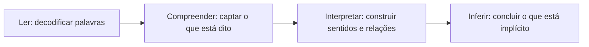

# Compreensão e Interpretação de Textos

> [!info] Metadados
> **Disciplina:** Língua Portuguesa
> **Bloco:** 1.1 — Língua Portuguesa (FASE 1 — Fundamentos)
> **Tópico:** 1. Compreensão e interpretação de textos
> **Subtópicos:** Interpretação literal e inferencial · Identificação de ideia central e ideias secundárias · Reconhecimento de intenção comunicativa do autor
> **Pré-requisitos:** Nenhum
> **Cargo:** Analista de TI — Perfil 3 (Desenvolvimento de Software) · DATAPREV 2026
> **Data:** 2026-08-27

---

## 1. Por que todo estudo começa aqui?

Antes de qualquer fórmula de lógica, de qualquer artigo de lei ou de qualquer conceito técnico, o concurso exige uma habilidade anterior: **ler bem**. Pense comigo: uma prova de múltipla escolha é, primeiro, um conjunto de textos. Cada enunciado é um texto. Cada alternativa é um texto. O candidato pode dominar perfeitamente um assunto e ainda assim errar a questão porque entendeu mal o que estava escrito — ou porque marcou uma alternativa que "parecia" correta, mas dizia mais do que o texto permitia.

Para o cargo de **Analista de TI — Perfil 3 (Desenvolvimento de Software)**, essa habilidade não é apenas estratégia de prova. O profissional lê especificações de requisitos, documentação de sistemas, e-mails de equipe, relatórios de erro e manuais de ferramentas. Interpretar mal um requisito é desenvolver a função errada. Interpretar mal um e-mail é tomar a decisão errada. A interpretação de texto, portanto, não é um "enfeite" de concurso: é a base de tudo o que você estudará neste vault e da sua atuação profissional.

> [!important] A pergunta que define esta nota
> De que adianta **saber** a resposta se você **entendeu errado** a pergunta? Em concurso, errar por má interpretação dói mais do que errar por desconhecimento — porque a segunda é corrigível com estudo, e a primeira cobra uma habilidade que muitos subestimam.

Este primeiro tópico ensina três capacidades que andam juntas: ler o que **está dito** (interpretação literal), extrair o que **está sugerido** (interpretação inferencial), reconhecer o **núcleo** do texto (ideia central e ideias secundárias) e perceber **o que o autor pretende** (intenção comunicativa). Vamos construir cada uma do zero.

---

## 2. Afinal, o que é um texto?

Pode parecer uma pergunta boba, mas ela é o alicerce de tudo. **Texto** é uma unidade de comunicação formada por palavras organizadas com um propósito, produzida por alguém (o **autor**) e dirigida a alguém (o **destinatário** — ou leitor). Note que o texto não precisa ser longo nem "literário". Uma mensagem de WhatsApp, um aviso fixado na porta do elevador, um e-mail profissional, uma notícia, uma placa de trânsito — todos são textos.

O que faz uma sequência de palavras virar texto é a **organização com sentido**. "Café servir da quente xícara" são palavras soltas; "Sirva o café quente na xícara" é uma frase que comunica uma instrução. Há um produtor, um leitor e um efeito pretendido.

> [!example] Exemplos de texto no dia a dia
> - "Estacionamento exclusivo para funcionários." → informa uma regra.
> - "A reunião de sexta-feira foi remarcada para as 14h." → informa uma mudança.
> - "Após análise, seu pedido de férias foi aprovado." → comunica uma decisão.
> - "ATENÇÃO: sistema fora do ar para manutenção." → alerta.

Perceba que todos esses textos fazem mais do que "existir": eles **pedem algo do leitor** — obedecer, comparecer, comemorar, aguardar. Essa relação entre o que o texto diz e o que ele quer provocar no leitor será explorada na seção sobre intenção comunicativa.

---

## 3. Ler, compreender e interpretar: três degraus de uma mesma escada

Na linguagem do dia a dia, usamos "ler", "compreender" e "interpretar" como sinônimos. Para a prova, é útil separá-los, porque cada degrau exige uma operação mental diferente.

**Ler (decodificar)** é reconhecer as palavras e as frases — transformar sinais gráficos em linguagem. É o nível mecânico. Se você consegue pronunciar uma frase e sabe o significado básico das palavras que a compõem, você a "leu".

**Compreender** é captar o que está **dito** — o conteúdo explícito, a informação direta que a frase carrega. É o degrau em que você responde: "o que este texto afirma?"

**Interpretar** é ir além: relacionar as informações, perceber o que está **implícito**, avaliar o sentido global, reconhecer a intenção de quem escreveu. É o degrau em que você responde: "o que este texto significa — e o que ele me permite concluir?"

> [!example] Os três degraus na prática
> Considere a frase: "A reunião foi adiada para as 15h."
>
> | Degrau | Pergunta que responde | Resultado |
> |--------|------------------------|-----------|
> | Ler | Que palavras estão aqui? | Reconhece "reunião", "adiada", "15h" |
> | Compreender | O que está dito? | A reunião não acontece no horário anterior; passa a ser às 15h |
> | Interpretar | O que isso significa? | Provavelmente houve um conflito de agenda; você deve reorganizar seu dia em torno das 15h; talvez valha confirmar o motivo |
>
> Cuidado: o texto **não diz** o motivo do adiamento. Você pode **suspeitar** ou **concluir** com base no contexto, mas não pode afirmar o motivo como se estivesse escrito. Essa linha — entre o que está dito e o que pode ser concluído — é exatamente o que este tópico treina.

A imagem da escada ajuda: **ler → compreender → interpretar**. Em prova, quase toda questão de interpretação está no segundo e no terceiro degrau. As questões que pedem "segundo o texto" querem o segundo degrau; as que pedem "infere-se do texto" querem o terceiro. Vamos detalhar os dois.

---

## 4. Interpretação literal: o que está escrito

A leitura **literal** (também chamada de leitura **explícita**) é aquela que se limita ao que está diretamente escrito. Nada de dedução, nada de imaginação: a resposta está na superfície do texto. O **explícito** é o que aparece de forma clara e direta, sem exigir nenhuma operação de raciocínio além da compreensão básica da frase.

Pense numa placa: "Proibido fumar neste ambiente." A leitura literal é simples: não se pode fumar ali. Não é preciso inferir nada — a informação está declarada.

> [!example] Exercício de leitura literal
> Texto: "O servidor de banco de dados será reiniciado amanhã às 2h, durante a janela de manutenção."
>
> Afirmações **literalmente** suportadas pelo texto:
> - O servidor de banco de dados será reiniciado. ✅ (está escrito)
> - O reinício ocorrerá amanhã às 2h. ✅ (está escrito)
> - O reinício acontece durante a janela de manutenção. ✅ (está escrito)
>
> Afirmações **não** suportadas literalmente:
> - O servidor está com defeito. ❌ (o texto não diz isso)
> - A equipe espera que o sistema fique fora do ar por horas. ❌ (não está escrito)

Em prova, quando o enunciado diz **"segundo o texto"** ou **"de acordo com o texto"**, ele está pedindo, em geral, essa leitura literal: a alternativa correta deve ser **diretamente sustentada pelas palavras do texto**. A armadilha surge quando o candidato mistura o que o texto diz com o que ele mesmo acha — e é disso que tratamos na próxima seção.

---

## 5. Interpretação inferencial: o que está nas entrelinhas

Agora o degrau mais cobrado — e o que mais elimina candidatos. A leitura **inferencial** busca o que está **implícito**: não escrito diretamente, mas sugerido, pressuposto ou permitido pelo texto.

**Inferir** é concluir algo a partir de pistas, usando raciocínio. Em outras palavras: o texto me dá algumas informações (as pistas) e, com elas, eu chego a uma conclusão que o autor não escreveu literalmente, mas que o texto **sustenta**.

> [!example] A inferência no dia a dia
> Sua colega chega à sala e diz: "Nossa, está um frio aqui dentro."
>
> O que ela **disse** (literal): há frio no ambiente.
> O que ela provavelmente **pretende** (inferência razoável): que alguém aumente a temperatura ou desligue o ar-condicionado.
>
> Por que essa inferência é razoável? Porque juntamos a frase com o contexto (estamos numa sala climatizada, ela é uma pessoa, expressões de desconforto costumam vir acompanhadas de um pedido implícito). Mas atenção: ela **não pediu** nada explicitamente. Se você concluir "ela quer que eu aumente a temperatura", você inferiu; se alguém perguntar "ela pediu isso?", a resposta honesta é "não pediu, mas deu a entender".

### Como se faz uma inferência, passo a passo

1. **Observe uma informação do texto** — um fato, uma palavra, uma repetição, uma omissão curiosa.
2. **Relacione com o contexto** — quem escreveu, para quem, em que situação.
3. **Combine com seu conhecimento razoável de mundo** — não conhecimento técnico específico, mas o senso comum que qualquer leitor adulto possui.
4. **Conclua com moderação** — a conclusão deve ser **sustentada pelas pistas**, nunca um salto para fora do texto.

> [!example] Inferência em um texto profissional
> Texto: "Prezados, informamos que o acesso ao portal será suspenso na próxima segunda-feira, das 22h às 23h, para atualização do certificado de segurança. Pedimos que concluam os trabalhos pendentes até as 21h45."
>
> O que está **explícito**:
> - O acesso ao portal será suspenso na segunda, das 22h às 23h. ✅
> - O motivo é a atualização do certificado de segurança. ✅
> - Os usuários devem concluir trabalhos pendentes até 21h45. ✅
>
> O que se pode **inferir** (com base em pistas):
> - A suspensão é **curta e planejada** — o texto diz que dura uma hora e informa o motivo com antecedência. 🟡
> - A organização espera que os usuários **evitem iniciar tarefas longas perto das 22h** — afinal, pede-se para concluir pendências antes. 🟡
> - A suspensão **não é um acidente** — o tom e o aviso prévio indicam manutenção programada, não falha emergencial. 🟡
>
> O que **não** dá para inferir:
> - "O portal ficará fora do ar por vários dias." ❌ (o texto diz o contrário: uma hora)
> - "A atualização vai falhar." ❌ (nem o texto nem pistas razoáveis sustentam isso)

Repare nas três afirmativas do meio: elas usam expressões cautelosas ("é curta e planejada", "espera-se", "indica"). Uma inferência sólida nunca tem cara de certeza absoluta — ela tem cara de **conclusão razoável a partir das pistas**.

### As pistas textuais

Como reconhecer onde há algo para inferir? Alguns sinais recorrentes:

- **Palavras repetidas** — se o texto insiste num termo, ele provavelmente é importante para a mensagem.
- **Escolha das palavras** — um autor que escreve "felizmente" ou "infelizmente", "lamentamos" ou "celebramos" está revelando emoção e julgamento (voltaremos a isso na seção de intenção comunicativa).
- **O que o texto NÃO diz** — a omissão também comunica. Um e-mail que informa um problema e não pede desculpas sugere que a empresa não considera aquilo um erro, por exemplo.
- **A ordem das informações** — o que vem primeiro costuma ter mais peso.
- **Exageros e atenções especiais** — um "ATENÇÃO" ou "URGENTE" muda completamente a leitura.

> [!tip] A pergunta mágica da inferência
> Depois de ler um trecho, pergunte: **"O que o texto quer que eu entenda sem me dizer diretamente?"** Se você consegue responder com base em pistas do próprio texto (e não em opinião pessoal), você fez uma inferência legítima.

### O percurso completo da leitura

O fluxo abaixo resume a escada que viemos subindo. Guarde-o: ele é a espinha dorsal de quase toda questão de interpretação.

---

## 6. Literal × inferencial: o contraste lado a lado

Para fixar, observe a mesma frase tratada pelas duas leituras:

> Frase: "O prazo para envio das propostas termina na sexta-feira."

| Leitura literal (explícita) | Leitura inferencial (implícita) |
|---|---|
| A data-limite é sexta-feira. | Quem deixar para depois de sexta estará fora do processo. |
| O envio deve ocorrer até sexta. | Provavelmente não haverá prorrogação (nada no texto sugere uma). |
| O assunto é o prazo de propostas. | A pressa do leitor é intencional: o autor quer evitar atrasos. |

A coluna da esquerda apenas **lê o que está dito**. A coluna da direita **conclui algo que o texto sustenta sem afirmar**. Ambas são legítimas — desde que a da direita tenha âncora no texto.

Agora a regra de ouro para prova:

> [!important] O que está ESCRITO × o que pode ser INFERIDO
> - **Escrito** = a informação está na superfície; qualquer leitor atento a encontra.
> - **Inferível** = a informação não está escrita, mas é uma conclusão razoável que as pistas do texto permitem (e, em geral, encorajam).
> - **Extrapolação** = a conclusão **não** é suportada pelas pistas; o candidato "inventou" algo que o texto não sustenta. É o erro mais comum — e o mais cobrado.

Na hora de marcar, lembre: a alternativa correta — seja ela literal ou inferencial — **nunca contradiz o texto** e **nunca usa informações de fora** (conhecimento pessoal, notícia que você leu, opinião) para preencher lacunas que o texto deixou em aberto.

---

## 7. As pegadinhas clássicas da interpretação

Bancas de concurso, de modo geral, repetem um pequeno conjunto de armadilhas na interpretação de textos. Conhecê-las pelo nome é meio caminho andado.

### 7.1 A verdade do mundo contra a verdade do texto

> [!warning] Pegadinha 1 — "É verdade, mas o texto não diz isso"
> **A armadilha:** uma alternativa afirma algo **verdadeiro na vida real**, mas que **não está no texto**. O candidato marca porque "é fato".
>
> **Exemplo:** o texto diz apenas que "o portal ficará indisponível na segunda-feira à noite". Uma alternativa diz: "o portal é acessado por milhões de usuários". Isso pode ser verdade no mundo real, mas **o texto não afirma** — e a questão pede "segundo o texto".
>
> **O raciocínio errado:** usar o conhecimento externo para validar a alternativa.
> **Como se proteger:** quando o enunciado diz "segundo o texto", cada alternativa deve ser testada contra o texto: *"esta informação está aqui?"* Se a resposta for "não está, mas eu sei que é verdade", a alternativa está errada.

### 7.2 A extrapolação

> [!warning] Pegadinha 2 — ir além do que as pistas permitem
> **A armadilha:** a alternativa começa apoiada no texto, mas **estica** a conclusão um passo além do razoável.
>
> **Exemplo:** o texto diz "a empresa reduziu seus custos após adotar o trabalho remoto". A alternativa diz: "a empresa reduziu custos **porque** adotou o trabalho remoto". O texto mostra os dois fatos juntos (redução e adoção), mas **não afirma a relação de causa** (quem adotou poderia ter reduzido custos por outros motivos). A alternativa extrapola: transforma coincidência temporal em causalidade.
>
> **O raciocínio errado:** confundir "aconteceu junto" com "aconteceu por causa de".
> **Como se proteger:** desconfie de alternativas que inserem relações (causa, conclusão, obrigação) que o texto não declara explicitamente. Palavras como "porque", "logo", "portanto" e "obrigatoriamente" são o "cheiro" dessa pegadinha — confira se a relação anunciada está realmente no texto.

### 7.3 A opinião do candidato

> [!warning] Pegadinha 3 — ler com a opinião pronta
> **A armadilha:** o tema toca uma crença do candidato (política, tecnologia, gestão pública) e a alternativa correta *segundo o texto* contraria o que ele pensa. O candidato rejeita a alternativa "porque não concorda".
>
> **O raciocínio errado:** julgar o texto pelo que o candidato acha que *deveria* ser dito, em vez do que *foi* dito.
> **Como se proteger:** em prova, o texto é a única realidade. Você não está respondendo "o que eu penso sobre o assunto", e sim "o que este texto sustenta". Se o texto é favorável a algo que você detesta, a alternativa favorável continua sendo a certa.

### 7.4 A paráfrase que inverte o sentido

> [!warning] Pegadinha 4 — palavras parecidas, sentido oposto
> **A armadilha:** a alternativa repete palavras do texto ("remoto", "custos", "produtividade"), dando a impressão de fidelidade, mas **inverte** uma relação: troca "redução" por "aumento", "antes" por "depois", "alguns" por "todos".
>
> **O raciocínio errado:** reconhecer as palavras conhecidas e "relaxar" antes de conferir a lógica da frase.
> **Como se proteger:** leia a alternativa **inteira**, com atenção redobrada a palavras de quantidade e direção: "todos/nenhum/alguns", "aumentou/reduziu", "antes/depois", "sempre/nunca". Uma única palavra inverte uma alternativa inteira.

> [!note] Estratégia de eliminação
> Na dúvida entre duas alternativas, volte ao texto e pergunte, para cada uma: **"Que parte do texto sustenta exatamente esta frase?"** Se você não consegue apontar a passagem — nem literal nem por inferência sólida — a alternativa está desqualificada. A alternativa vencedora é sempre a mais **fiel** ao texto, não a mais "bonita" ou a mais "inteligente".

---

## 8. Ideia central e ideias secundárias

Subimos um degrau: agora não interessa apenas uma frase — interessa o **texto inteiro**. Todo texto, por mais cheio de detalhes, foi escrito em torno de **uma** ideia principal. Saber identificá-la é o que a prova chama de "ideia central".

### Tema, ideia central e ideias secundárias: três coisas diferentes

- **Tema (ou assunto)** é o campo do texto: *sobre o que* ele fala. É a resposta para "qual é o assunto?" — geralmente expressa em poucas palavras.
- **Ideia central (ou tese, quando há defesa de um ponto de vista)** é a **mensagem principal**: o que o autor afirma **a respeito** do tema. É a resposta para "qual é a posição/afirmação central do texto?"
- **Ideias secundárias** são as informações que **sustentam** a ideia central: argumentos, exemplos, dados, detalhes, explicações. Elas existem para dar base e desenvolvimento à mensagem principal.

> [!example] Tema ≠ ideia central — o contraste que mais cai em prova
> Texto: "O aumento do trabalho remoto no setor público trouxe ganhos de produtividade e redução de custos de infraestrutura. Pesquisas indicam que equipes híbridas relatam maior satisfação. Há, porém, desafios novos: a necessidade de investir em segurança da informação e em ferramentas de colaboração. O equilíbrio entre benefícios e riscos depende de políticas claras e de uma gestão preparada."
>
> - **Tema:** trabalho remoto no setor público.
> - **Ideia central:** o trabalho remoto traz benefícios reais, mas só se consolida com políticas claras e gestão preparada para enfrentar os desafios.
> - **Ideias secundárias:** os ganhos de produtividade; a redução de custos; a maior satisfação relatada; a necessidade de investir em segurança e ferramentas; a exigência de gestão preparada.
>
> Perceba: "trabalho remoto" sozinho **não é** a ideia central — é o assunto. A ideia central é a **afirmação sobre** o assunto (benefícios + condições para dar certo). Essa distinção é uma das mais cobradas em questões do tipo "a ideia central do texto é".

### Como localizar a ideia central

Existem alguns pontos "quentes" no texto onde a ideia central costuma morar:

1. **O título**, quando há. O autor raramente batiza o próprio texto com um título que não tenha relação com a mensagem principal.
2. **O primeiro parágrafo**, onde se costuma apresentar o assunto e a posição.
3. **O último parágrafo**, onde se costuma **concluir** — muitas vezes o autor guarda a afirmação principal para o fechamento.
4. **As repetições**: se uma palavra ou ideia volta várias vezes, é porque o autor a considera central.
5. **As palavras de ênfase**, como "é importante", "o fundamental", "vale destacar" — sinalizam o que o autor considera essencial.

> [!tip] A técnica do resumo em uma frase
> A pergunta que desmonta qualquer texto: **"Se eu tivesse que resumir este texto em uma única frase para um amigo, qual seria?"**
>
> A frase que você disser — desde que não seja um mero assunto ("é sobre trabalho remoto") e não seja um detalhe ("tem uma pesquisa sobre satisfação") — é a ideia central. O que sobrar na sua lembrança (exemplos, números, citações) são as ideias secundárias.

Complemento prático: **apagar para testar**. Imagine o texto sem um trecho. Se o sentido geral permanece quase intacto, aquele trecho era secundário (exemplo, detalhe, repetição). Se o texto "desmorona", aquele trecho era essencial — provavelmente parte da ideia central. É o princípio de distinguir o **essencial** do **acessório**.

### O contraste em tabela

| Aspecto | Tema / assunto | Ideia central | Ideias secundárias |
|---|---|---|---|
| Pergunta que responde | "Sobre o que fala?" | "O que o autor afirma sobre isso?" | "O que sustenta essa afirmação?" |
| Extensão | Poucas palavras | Frase completa | Várias frases |
| Papel no texto | Rótulo do conteúdo | Mensagem principal | Argumentos, exemplos, dados, detalhes |
| Se removida... | — | O texto perde o sentido | O texto fica mais enxuto, mas mantém o sentido |

### As pegadinhas da ideia central

> [!warning] Três pegadinhas frequentes
> **1. Confundir tema com tese:** alternativa que diz apenas o assunto ("o texto trata do trabalho remoto") quando a questão pede a ideia central (a afirmação sobre o assunto). O tema é resposta para "o quê?"; a ideia central, para "o que se diz sobre o quê?".
>
> **2. Confundir exemplo com ideia central:** alternativa que resume apenas um detalhe — "o texto mostra que equipes híbridas relatam maior satisfação" — quando esse dado é só uma ideia secundária a serviço da mensagem maior.
>
> **3. Marcar um detalhe como resumo:** alternativa fiel a uma parte pequena do texto, mas que não abrange o conjunto. Quando o enunciado pede "a ideia central", a alternativa certa precisa **cobrir o texto inteiro**, não um trecho — e as alternativas erradas costumam ser fiéis a trechos isolados justamente para atrair quem leu só uma parte.

Regra de bolso: a ideia central **abrange** o texto todo; a ideia secundária **serve** a ela. Se a alternativa serve de argumento para outra afirmação maior, ela é secundária — e a outra afirmação é, provavelmente, a central.

---

## 9. Intenção comunicativa do autor

Chegamos ao terceiro subtópico — e talvez o mais sutil. **Intenção comunicativa** é o **objetivo** que o autor quer alcançar ao escrever: o efeito que ele espera produzir no leitor. Informar, convencer, criticar, elogiar, alertar, instruir, emocionar, pedir, agradecer — são exemplos de intenções.

> [!important] A pergunta que abre a porta
> **"Por que o autor escreveu isto? O que ele espera que o leitor faça ou pense depois de ler?"**
>
> Se a resposta for "que eu saiba de algo" → intenção de informar.
> Se for "que eu mude de ideia" → intenção de convencer.
> Se for "que eu tome cuidado" → intenção de alertar.
> Se for "que eu siga uma instrução" → intenção de instruir.
> Se for "que eu concorde que algo está errado" → intenção de criticar.

### O que o texto diz × o que o autor quer alcançar

Essa distinção é o coração do subtópico. Um texto que **informa** um fato pode, na verdade, **pretender** convencer o leitor. Veja:

> [!example] A notícia que parece neutra
> Texto: "A nova política de horário flexível reduziu em 30% o número de pedidos de demissão na empresa nos últimos seis meses."
>
> O texto **diz** (literalmente): houve redução de 30% nos pedidos de demissão.
> O autor pode **pretender**: demonstrar que a política deu certo (e, indiretamente, defendê-la), ou simplesmente informar o resultado.
>
> Como decidir? Pelas pistas: se o texto segue com elogios à medida, com palavras positivas e conclusões favoráveis, a intenção é convencer/defender. Se segue com dados neutros e não emite juízo, a intenção é predominantemente informar. A intenção **não está na superfície**; ela se revela no conjunto.

### Pistas para reconhecer a intenção

1. **A escolha das palavras (o tom):** palavras positivas ("vantajoso", "acolhedor") apontam para elogio ou defesa; negativas ("preocupante", "inaceitável") apontam para crítica ou alerta. Note que a **mesma informação** pode ser dada com tons opostos — a escolha do autor é uma pista deliberada.
2. **O que o texto pede do leitor:** frases que orientam ("conclua", "evite", "registre") revelam intenção de instruir. Frases que apenas constatam revelam intenção de informar.
3. **O título:** um título que já contém um juízo ("os riscos ocultos da tecnologia") entrega a intenção antes mesmo do primeiro parágrafo.
4. **A quem se dirige:** o texto endereçado a um grupo específico ("aos usuários do sistema", "aos gestores") revela o que o autor espera daquele grupo.
5. **Como termina:** a conclusão costuma concentrar a intenção — é onde o autor "fecha o argumento" e deixa claro o que queria.

> [!example] Um aviso com múltiplas camadas
> Texto: "Atenção, equipe: o ambiente de produção passará por atualização no domingo, das 0h às 4h. Evite publicar alterações nesse período e confira o e-mail de confirmação após a conclusão."
>
> Intenções presentes:
> - **Informar:** a atualização ocorrerá no domingo, em tal horário. 🟡
> - **Alertar:** o período exige atenção; nada de publicações nesse intervalo. 🟡
> - **Instruir:** confira o e-mail de confirmação depois. 🟡
>
> O texto **diz** três coisas e **pretende** três efeitos: que o leitor saiba, se previna e execute uma ação. Repare como "evite" e "confira" são pistas das intenções de alertar e instruir — reveladas pelos verbos de orientação, sem precisar de nenhuma explicação gramatical.

### As pegadinhas da intenção comunicativa

> [!warning] Pegadinha 1 — atribuir intenção que o texto não sustenta
> A alternativa diz "o autor escreveu o texto para criticar a gestão da empresa", mas o texto apenas **informa** os resultados do trabalho remoto sem nenhuma palavra de reprovação. O candidato confundiu o **efeito** no leitor (pode ser que o leitor passe a criticar) com a **intenção** do autor (que foi apenas relatar).
>
> **Regra:** intenção é do **autor**, efeito é do **leitor**. O texto pode provocar em você uma reação — raiva, alegria, concordância — sem que o autor tenha **pretendido** aquilo. Só afirme uma intenção se houver pistas **no texto** (palavras, tom, conclusão) apontando para ela.

> [!warning] Pegadinha 2 — o texto informa, a alternativa diz que convence (ou vice-versa)
> Alternativas que trocam a intenção: o texto é claramente argumentativo (defende uma posição), e a alternativa o chama de "meramente informativo" — ou o contrário. A banca testa se você lê o **conjunto** (tom + conclusão) e não apenas o **primeiro parágrafo**.
>
> **Como se proteger:** antes de marcar a intenção, faça o teste do **leitor imaginário**. Termine de ler o texto e pergunte: *"que ação, opinião ou sentimento este texto mais provavelmente quer provocar em mim?"* A resposta mais direta é a intenção dominante.

---

## 10. Estratégia geral de prova: decifrando o enunciado

Toda questão de interpretação tem uma **palavra-chave** que diz que tipo de leitura ela exige. Reconhecer a palavra-chave antes de ler as alternativas é a estratégia mais eficiente.

| Expressão típica no enunciado | O que ela pede |
|---|---|
| "Segundo o texto" / "De acordo com o texto" | Leitura **literal**: a alternativa deve estar escrita (ou diretamente apoiada) no texto |
| "Infere-se do texto" / "Depreende-se do texto" / "O texto permite concluir que" | Leitura **inferencial**: a alternativa é uma conclusão razoável sustentada por pistas — não está escrita, mas o texto a encoraja |
| "A ideia central do texto é" / "O objetivo principal do texto é" | Visão **global**: tema e tese, abrangendo o texto inteiro |
| "A intenção do autor ao escrever o texto é" / "Com esse texto, o autor pretende" | **Intenção comunicativa**: o que o autor quer alcançar, revelado por tom e escolhas |
| "Sobre o texto é correto afirmar" | Teste **geral**: cada alternativa deve ser conferida — literal, inferencial ou global, conforme o caso |
| "Assinale a opção incorreta" | Atenção invertida: agora a **errada** é a resposta; as certas são todas fiéis ao texto |

### Um método em quatro passos

1. **Leia o texto com atenção** — não "passe os olhos". Sublinhe mentalmente o que parece central: repetições, conclusões, palavras carregadas de emoção.
2. **Identifique o tipo de pergunta** — localize a palavra-chave do enunciado (tabela acima) antes de ler as alternativas. Você já sabe se procura o **escrito**, o **inferível** ou o **global**.
3. **Teste cada alternativa contra o texto** — para cada uma, pergunte: "que passagem sustenta exatamente isto?" Se não houver passagem — nem direta nem inferencial sólida — elimine.
4. **Cuidado com as palavras de excesso** — "todo", "nenhum", "sempre", "nunca", "obrigatoriamente" costumam transformar uma alternativa plausível em falsa, porque o texto raramente sustenta generalizações absolutas. Confira sempre.

> [!note] Por que isso vale para qualquer banca?
> Essas expressões ("segundo o texto", "infere-se do texto", "a ideia central é") e essas armadilhas (extrapolação, verdade externa, opinião pessoal, paráfrase invertida) são fenômenos **gerais** de concursos de múltipla escolha — aparecem em provas de praticamente todas as bancas do país. Dominar o método de leitura, e não decorar "o estilo de uma banca específica", é o que protege o candidato em qualquer prova.

---

## 11. Revisão rápida

Antes de encerrar, o resumo do essencial — em forma de conferência, não de decoreba:

| Subtópico | O que você precisa saber | A pegadinha que mais derruba |
|---|---|---|
| Interpretação literal e inferencial | Escrito = está na superfície; inferível = conclusão razoável com base em pistas; inferência nunca contradiz o texto | Confundir "verdade no mundo real" com "verdade segundo o texto"; extrapolar relação de causa |
| Ideia central e ideias secundárias | Tema é o assunto; ideia central é a afirmação sobre o assunto; secundárias sustentam a central | Confundir tema com tese; tratar um exemplo ou detalhe como ideia central |
| Intenção comunicativa do autor | Intenção é o objetivo do autor (informar, convencer, alertar, instruir, criticar...); revela-se por tom, palavras e conclusão | Atribuir intenção que o texto não sustenta; confundir efeito no leitor com intenção do autor |

> [!tip] As três perguntas que resumem a nota
> **1.** "O que este texto está **dizendo**?" → leitura literal.
> **2.** "O que este texto me **permite concluir**?" → leitura inferencial (com moderação e âncora no texto).
> **3.** "Por que o autor **escreveu** isto, e qual é a **mensagem principal**?" → ideia central + intenção comunicativa.
>
> Quem responde a essas três perguntas com disciplina está preparado para a grande maioria das questões de interpretação — e, mais importante, para ler com precisão tudo o que vem pela frente no edital.