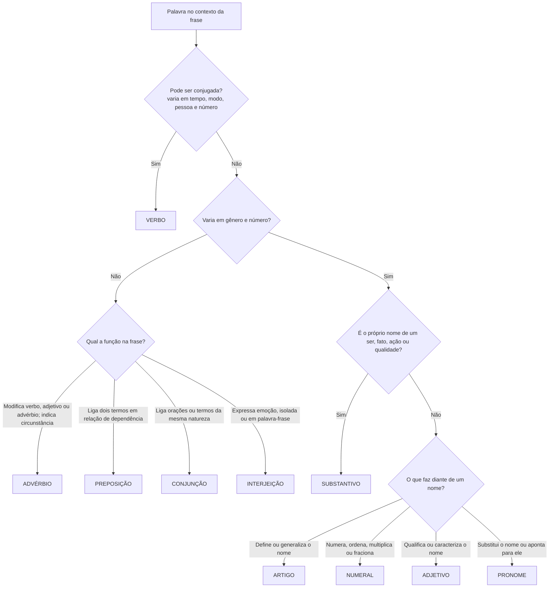

# Classes de Palavras

> [!info] Metadados
> **Disciplina:** Língua Portuguesa
> **Bloco:** 1.1 — Língua Portuguesa (FASE 1 — Fundamentos)
> **Tópico:** 5. Estrutura morfossintática — Classes de palavras
> **Subtópicos:** Substantivo · Adjetivo · Artigo · Numeral · Verbo · Advérbio · Preposição · Conjunção · Pronome · Interjeição
> **Pré-requisitos:** [[Compreensao-e-Interpretacao-de-Textos|Compreensão e interpretação de textos]]; [[Tipos-e-Generos-Textuais|Tipos e gêneros textuais]]; [[Ortografia-Oficial|Ortografia oficial]]; [[Coesao-Textual|Coesão textual]]
> **Cargo:** Analista de TI — Perfil 3 (Desenvolvimento de Software) · DATAPREV 2026
> **Data:** 2026-08-27

---

## 1. O ponto de partida: o que é uma classe de palavras

Na nota de [[Coesao-Textual|Coesão textual]], você viu que pronomes, conectores e tempos verbais são mecanismos que amarram o texto — e ficou registrado ali que "a classificação detalhada dessas palavras" pertenceria a este tópico. Chegou a hora. Este é o tópico de **estrutura morfossintática**, e a primeira peça desse estudo é a **morfologia**: a análise da palavra em si mesma, sua forma, sua estrutura e sua classe.

Faça uma experiência mental antes de qualquer definição. Compare estas duas frases:

> "O **sistema** respondeu **rápido** a requisição."
>
> "O **sistema** **rápido** respondeu a requisição."

Você sente a diferença? Na primeira, "rápido" diz *como* o sistema respondeu — modifica o verbo. Na segunda, "rápido" diz *qual* sistema é — modifica o substantivo. A mesma palavra, grafada do mesmo jeito, desempenhou dois papéis distintos. Então, uma pergunta que guia toda esta nota: **a classe de uma palavra é um rótulo fixo do dicionário ou uma função que ela exerce no contexto?**

A resposta correta é a segunda. A classe gramatical (também chamada de classe morfológica ou classe de palavras) é determinada pela **função** que a palavra exerce na frase e pelo **tipo de significação** que ela carrega. Por isso, a mesma palavra pode pertencer a classes diferentes em contextos diferentes — e é exatamente aí que as bancas plantam suas pegadinhas, como veremos ao final.

Há **dez classes de palavras** na tradição gramatical brasileira, e todas elas serão estudadas nesta nota em sequência: substantivo, adjetivo, artigo, numeral, verbo, advérbio, preposição, conjunção, pronome e interjeição. Para não se perder nessa lista, a gramática oferece um critério organizador muito poderoso: a distinção entre **palavras variáveis** e **palavras invariáveis**.

> [!note] O conceito que organiza o estudo
> **Palavras variáveis** são as que sofrem flexão — mudam de forma para expressar gênero, número, pessoa, tempo, modo ou grau: **substantivo, adjetivo, artigo, numeral, pronome e verbo**.
>
> **Palavras invariáveis** são as que não se flexionam — permanecem com a mesma forma em qualquer contexto: **advérbio, preposição, conjunção e interjeição**.

Esse par é mais do que um critério de classificação: ele é uma ferramenta de prova. Se a questão perguntar "qual destas palavras é invariável?", você já sabe que a resposta está entre advérbio, preposição, conjunção e interjeição. Se a banca pedir uma palavra que "não varia em gênero e número", a resposta jamais será um substantivo ou adjetivo. Guarde essa chave binária — ela abre todas as portas desta nota e antecipa as pegadinhas.

---

## 2. Substantivo: a palavra que nomeia

Comecemos pela classe mais intuitiva. Pergunte a qualquer pessoa o que um programador faz e ouvirá respostas como "o analista analisa", "o desenvolvedor desenvolve", "o sistema processa". Repare: essas respostas usam **verbos**. Mas repare também que, para falar dessas ações, precisamos antes nomear quem as pratica e sobre o quê elas incidem: analista, código, sistema, requisito. Esses nomes são **substantivos**.

O substantivo é a palavra que nomeia **seres, objetos, lugares, sentimentos, ações, estados e qualidades**. Ele é o "anfitrião" da frase: adjetivos o qualificam, artigos o determinam, pronomes o substituem, verbos relatam o que ele faz ou sofre. Em termos técnicos: é em torno do substantivo que boa parte da sintaxe se organiza — por isso, entender bem essa classe é meio caminho andado para a análise sintática que virá nas próximas notas.

### 2.1 Substantivo concreto × abstrato

A distinção mais cobrada é entre **concreto** e **abstrato**. O substantivo **concreto** nomeia seres de existência própria — real ou imaginada. Repare: imaginação não torna o substantivo abstrato. "Unicórnio", "fada" e "fantasma" nomeiam seres imaginários, mas têm existência própria no mundo das ideias — são **concretos**. O substantivo **abstrato**, por sua vez, nomeia noções que **dependem de outro ser para existir**: ações ("corrida", "análise", "desenvolvimento"), estados ("saudade", "alegria", "disponibilidade") e qualidades ("beleza", "agilidade", "segurança").

O teste clássico: pergunte se a palavra nomeia algo que *existe por si* ou se nomeia uma **ação, estado ou qualidade** de alguém. "A **implementação** foi concluída" — implementação é abstrato, pois é uma ação (nomeia o ato de implementar). "O **desenvolvedor** concluiu a implementação" — desenvolvedor é concreto, pois nomeia um ser. Outra dica poderosa: substantivos abstratos costumam ser **derivados de verbos e adjetivos** (implementar → implementação; ágil → agilidade). Na prova, a banca adora oferecer "correção", "atualização" ou "performance" como substantivos concretos — todos são abstratos.

### 2.2 Coletivos

Um substantivo **comum** no singular que designa um **conjunto de seres da mesma espécie** é um **coletivo**. A pegadinha aqui é dupla: a forma é singular, mas o sentido é plural. "A **equipe** avaliou o relatório" — equipe é coletivo (conjunto de pessoas), e o verbo concorda no singular com a forma, embora o sentido seja de vários. Alguns coletivos clássicos que a prova cobra: **cardume** (peixes), **enxame** (abelhas), **esquadrilha** (aviões), **frota** (veículos), **arquipélago** (ilhas), **constelação** (estrelas), **biblioteca** (livros), **resma** (papéis), **código** (em "código de leis", conjunto de leis) — cuidado: "código-fonte" não é coletivo, é substantivo composto.

### 2.3 Flexões: gênero, número e grau

O substantivo se flexiona em:

- **Gênero** (masculino/feminino): "o sistema", "a aplicação". Atenção aos casos de mudança de gênero com mudança de sentido ("o cabeça = o líder; a cabeça = a parte do corpo") — a banca explora essas duplas.
- **Número** (singular/plural): "o requisito", "os requisitos". O plural é tema da nota de [[Ortografia-Oficial|Ortografia oficial]] (acentuação, hífen); aqui, basta entender que o número é uma flexão do substantivo.
- **Grau** (aumentativo/diminutivo): "sistema", "sistemão", "sisteminha". O grau pode expressar tamanho ou valor afetivo — "sisteminha" pode significar carinho ou depreciação, conforme o contexto.

### 2.4 Demais classificações

A gramática cruza dois outros eixos: quanto à **origem**, o substantivo pode ser **primitivo** (não deriva de outro: "pedra") ou **derivado** (deriva de outro: "pedreiro"); quanto à **estrutura**, pode ser **simples** (um só radical: "software") ou **composto** (mais de um radical: "software livre", "código-fonte", "backup diário" — cuidado: "backup" é estrangeirismo comum em TI; "código-fonte" com hífen é composto). E quanto à **extensão do sentido**, comum (generaliza: "sistema") ou **próprio** (particulariza, individualiza: "DATAPREV", "Sistema Único de Saúde"). Substantivos próprios iniciam com maiúscula — ponte com a nota de [[Ortografia-Oficial|Ortografia oficial]].

> [!tip] Substantivo em prova de TI
> Termos técnicos como "deploy", "backup", "bug", "release" entram na língua como substantivos comuns e, em português, tendem a permanecer invariáveis ou a ganhar plural pela regra geral da língua de chegada. A banca pode cobrar o plural ("os backups", "os deploys") — e a regra é a da língua portuguesa, não a da língua de origem.

---

## 3. Adjetivo: a palavra que qualifica

Se o substantivo é o anfitrião, o adjetivo é a palavra que **acompanha o substantivo para caracterizá-lo**: atribui qualidades, estados, relações ou origens. "O sistema é **ágil** e **seguro**"; "a **documentação técnica** foi atualizada" — "técnica" caracteriza a documentação, indicando o tipo.

O adjetivo concorda com o substantivo em **gênero e número** ("sistema ágil", "aplicações ágeis") — essa concordância será estudada a fundo na nota de concordância do bloco; aqui, basta perceber que, por causa dessa flexão, o adjetivo é uma palavra **variável**. Ele também se flexiona em **grau**: comparativo (de igualdade — "tão rápido quanto"; de superioridade — "mais rápido que"; de inferioridade — "menos rápido que") e superlativo (absoluto — "muito rápido" ou "rapidíssimo"; relativo — "o mais rápido do time").

### 3.1 Locução adjetiva

Uma locução é a união de **duas ou mais palavras** com valor de uma só classe. A **locução adjetiva** é quase sempre formada por **preposição + substantivo** e equivale a um adjetivo. "A análise **de desempenho**" equivale à "análise **comportamental**" (desempenho → comportamental? cuidado: "de desempenho" equivale a "de performance", que não tem adjetivo correspondente bem fixado; use exemplos consagrados). Veja os clássicos que a banca cobra:

| Locução adjetiva | Adjetivo equivalente |
|---|---|
| de armas / de guerra | bélico |
| de chuva | pluvial |
| de rio | fluvial |
| da boca | bucal |
| de ouro | áureo |
| de terra | terrestre |
| de dedo | digital |
| de cidade | urbano |

O caminho inverso também aparece: a prova pede o **adjetivo** correspondente a uma locução, ou a locução correspondente a um adjetivo. "A política **de segurança**" = "a política **securitária**"? Não — cuidado: "de segurança" não tem adjetivo único fixado no uso corrente; a prova trabalha com os consagrados. Na dúvida, memorize os pares da tabela e os pátrios.

### 3.2 Adjetivo pátrio

O **adjetivo pátrio** (também chamado gentílico) indica **naturalidade ou procedência**: "brasileiro", "manauense", "amazonense", "carioca", "tocantinense". Em provas com contexto regional (a DATAPREV tem forte presença no Rio de Janeiro e em Manaus), a banca pode cobrar "fluminense" (do Rio de Janeiro, estado) e "carioca" (do Rio de Janeiro, cidade) — o par clássico. Palavras como "catarinense", "gaúcho", "mineiro" também figuram em questões de classificação: a pegadinha é reconhecer que elas são **adjetivos** mesmo quando o texto as usa com aparência de substantivo ("os mineiros votaram" — aqui "mineiros" é substantivo, pois nomeia pessoas; "a culinária mineira" — adjetivo, pois caracteriza).

---

## 4. Artigo: o determinante do nome

O **artigo** é a palavra variável que **acompanha o substantivo** para defini-lo ou indefini-lo. Os **definidos** — o, a, os, as — particularizam, apontam um ser já conhecido ou específico: "O sistema entrou em manutenção" (um sistema determinado). Os **indefinidos** — um, uma, uns, umas — generalizam, apresentam um ser qualquer da espécie: "Um sistema entrou em manutenção" (não se sabe qual, é apenas um entre muitos).

A função mais cobrada do artigo é a **substantivadora**: qualquer palavra, diante de artigo, passa a funcionar como substantivo. "O **jantar** estava pronto" — "jantar" era verbo; com o artigo "o", virou substantivo. "O **porquê** da falha" — "porquê" era conjunção; agora é substantivo. "A **bela** entrou" — "bela" era adjetivo; com artigo, tornou-se substantivo. Sempre que a questão perguntar "qual palavra foi substantivada?", procure o artigo antes dela.

> [!warning] Pegadinha clássica — "um" artigo ou numeral?
> "Um" é artigo **indefinido** quando apenas indetermina: "Chegou **um** analista." "Um" é **numeral** quando quantifica exatamente um: "Chegou **um** analista, e não dois." O teste é simples: se a troca por "algum" preserva o sentido, é artigo; se a troca por "um só / um único" preserva o sentido, é numeral.

---

## 5. Numeral: a palavra que conta, ordena e fraciona

O **numeral** é a palavra que indica quantidade exata, posição em uma sequência, múltiplo ou fração. Ela se divide em quatro tipos:

- **Cardinal**: "um", "dois", "dez", "cem" — indica quantidade: "A equipe resolveu **três** incidentes."
- **Ordinal**: "primeiro", "segundo", "décimo" — indica ordem: "O **primeiro** deploy da semana falhou."
- **Multiplicativo**: "dobro", "triplo", "quádruplo" — indica multiplicação: "O novo servidor tem o **dobro** de memória."
- **Fracionário**: "metade", "terço", "quarto" — indica fração: "Aprovei **um terço** das alterações."

Existe ainda um grupo chamado de **coletivos numerais**: palavras que designam conjuntos com número fixo — "dezena" (10), "dúzia" (12), "centena" (100), "milhar" (1.000), "século" (100 anos), "lustro" (5 anos), "biênio" (2 anos), "trimestre" (3 meses). Elas têm forma de substantivo, mas o valor é numeral — a banca explora exatamente essa fronteira. Quando o numeral aparecer substantivado ("Os **milhões** investidos em TI"), a palavra funciona como substantivo: a classificação gramatical depende sempre do contexto.

---

## 6. Verbo: a palavra do tempo, da ação e do estado

Agora a classe que você viu operando na nota de [[Coesao-Textual|Coesão textual]] como "relógio do texto". O **verbo** é a palavra que exprime **ação** ("processar"), **estado** ("permanecer", "ficar") ou **processo/mudança de estado** ("tornar-se", "transformar-se"), localizando esses fatos **no tempo**. É a classe mais flexível da língua: o verbo varia em número, pessoa, tempo, modo e voz — por isso, é a palavra **variável** por excelência, mas segundo um eixo próprio (conjugação), diferente do eixo do substantivo e do adjetivo (gênero e número).

### 6.1 Fechando a pendência deixada pela coesão

Na nota de coesão, os tempos verbais apareceram como organizadores da narrativa: o **pretérito perfeito** marca os fatos concluídos, o **imperfeito** o cenário de fundo, o **mais-que-perfeito** a anterioridade, o **futuro do pretérito** a possibilidade. Ficou prometido que o sistema completo viria aqui. Vamos montá-lo de forma estruturada.

Os verbos se organizam em **três modos**, que expressam a atitude do falante:

- **Indicativo** — expressa **certeza, fato**: "O sistema **processa** as requisições."
- **Subjuntivo** — expressa **dúvida, hipótese, desejo**: "Espero que o sistema **processe** as requisições."
- **Imperativo** — expressa **ordem, pedido, conselho**: "**Processe** as requisições imediatamente."

Dentro do **indicativo**, há seis tempos, cada um com seu lugar na linha do tempo:

| Tempo | Papel | Exemplo |
|---|---|---|
| **Presente** | Fato atual, verdade, hábito | "O serviço **responde** em 200 ms." |
| **Pretérito perfeito** | Fato concluído no passado (o marco do relato) | "A equipe **corrigiu** o erro às 3h." |
| **Pretérito imperfeito** | Passado contínuo, cenário de fundo, hábito no passado | "O monitor **registrava** picos desde as 2h." |
| **Pretérito mais-que-perfeito** | Fato anterior a outro fato passado | "O admin **havia verificado** o log antes do reinício." |
| **Futuro do presente** | Fato que virá, certeza em relação ao futuro | "O deploy **ocorrerá** à meia-noite." |
| **Futuro do pretérito** | Possibilidade, condição; refere-se ao futuro a partir do passado | "Sem backup, a recuperação **levaria** dias." |

O **subjuntivo** tem três tempos — presente ("que eu **processe**"), pretérito imperfeito ("se eu **processasse**") e futuro ("quando eu **processar**"). O **imperativo** é usado para ordenar, no presente ("**processe**", "**processem**"). Você não precisa decorar conjugações completas nesta etapa; precisa saber reconhecer o modo pelo contexto — se a frase expressa fato, é indicativo; se expressa dúvida/hipótese/desejo, é subjuntivo; se expressa ordem, é imperativo.

Há ainda as **formas nominais**, que não localizam o fato no tempo sozinhas: o **infinitivo** ("processar"), o **gerúndio** ("processando") e o **particípio** ("processado"). Elas são a base das **locuções verbais**.

### 6.2 Verbos regulares e irregulares

Um verbo é **regular** quando segue, sem desvios, o paradigma de sua conjugação: "falar" (falo, falas, fala, falamos...), "vender", "partir" — todos os tempos derivam dos mesmos radicais. É **irregular** quando foge ao paradigma: "ser" (sou, és, é, somos, são), "ir" (vou, vais, vai), "fazer" (faço, fez, fiz), "dizer", "trazer", "ver", "vir". A prova cobra principalmente o reconhecimento: diante de "vou", "sou", "faço", a pegadinha é chamar de regular um verbo claramente irregular — e o teste é sempre conjugar mentalmente no presente ou no pretérito perfeito e verificar se o radical se mantém.

### 6.3 Locução verbal

A **locução verbal** é a combinação de um **verbo auxiliar** (conjugado) com o **verbo principal** em forma nominal (infinitivo, gerúndio ou particípio). O auxiliar carrega as flexões de tempo, modo e pessoa; o principal carrega o conteúdo: "A equipe **vai implantar** a versão" (auxiliar "vai" + infinitivo), "O servidor **estava processando** os relatórios" (auxiliar + gerúndio), "A falha **foi corrigida**" (auxiliar + particípio — aqui, a voz passiva, tema da nota de reescrita). Reconhecer a locução é essencial: o verbo principal não se flexiona, e é o auxiliar que "recebe" a conjugação.

> [!important] O que fica para as próximas notas deste bloco
> A **classificação dos verbos quanto à predicação** (transitivos, intransitivos, de ligação) pertence à **sintaxe**; a **concordância** entre verbo e sujeito é tema de nota própria; e as **vozes verbais** em profundidade aparecem na reescrita de frases. Aqui, o essencial era montar o sistema de modos e tempos — a pendência que a coesão deixou — e apresentar regularidade, irregularidade e locução.

---

## 7. Advérbio: a palavra da circunstância

O **advérbio** é a palavra **invariável** que modifica o **verbo**, o **adjetivo** ou outro **advérbio** — e, em alguns casos, a frase inteira. Ele não qualifica o substantivo; ele acrescenta uma **circunstância**: tempo, lugar, modo, intensidade, negação, afirmação, dúvida, etc.

> "O servidor respondeu **rapidamente**." (modo — modifica o verbo "respondeu")
>
> "O sistema está **muito** estável." (intensidade — modifica o adjetivo "estável")
>
> "O backup foi feito **ontem**." (tempo)
>
> "A equipe trabalha **aqui**." (lugar)

Repare no princípio que atravessa todos os exemplos: o advérbio modifica **algo que não é nome**. Essa é a chave para desmontar a pegadinha mais famosa da morfologia — a confusão entre advérbio e adjetivo.

> [!warning] Pegadinha clássica — advérbio × adjetivo
> **A armadilha:** a mesma palavra "rápido" em duas frases: "O analista trabalha **rápido**." e "O analista fez um trabalho **rápido**."
> **O raciocínio errado:** "rápido é adjetivo nos dois casos, pois eu o conheço como adjetivo do dicionário."
> **Como se proteger:** identifique **o que a palavra modifica** e **se ela varia**. Na primeira frase, "rápido" modifica o verbo "trabalha" e não varia ("a analista trabalha rápido" — permanece "rápido"); é **advérbio**. Na segunda, "rápido" modifica o substantivo "trabalho" e concorda ("trabalhos rápidos"); é **adjetivo**. O teste da invariância resolve: se não acompanha o gênero e o número de um nome, é advérbio.

As palavras "muito", "bastante", "meio", "certo", "pouco" são minas de ouro para a banca: **advérbios** quando invariáveis ("Muito obrigado" — invariável; "a equipe está **meio** cansada" — invariável, modifica "cansada"), **adjetivos/pronomes indefinidos** quando variam ("Leu **muitos** livros"; "comprei **bastantes** ferramentas"). Na prova, o plural ou o feminino da palavra é o sinal de que ela deixou de ser advérbio.

A **locução adverbial** é o conjunto de duas ou mais palavras com valor de advérbio, geralmente preposição + substantivo: "à noite" (tempo), "de repente" (modo), "em breve" (tempo), "às vezes" (tempo), "em silêncio" (modo). A questão pergunta "qual palavra é advérbio?" e o texto traz "de repente" — o candidato que procura uma única palavra erra; a resposta é a locução inteira.

---

## 8. Preposição: a palavra que conecta termos

A **preposição** é a palavra **invariável** que **liga dois termos**, estabelecendo entre eles uma relação de **subordinação** — o segundo termo completa ou especifica o primeiro. "A equipe **de** suporte atendeu ao chamado" — "de" liga "equipe" a "suporte", e "suporte" especifica de que equipe se fala. Sem a preposição, a relação se perde ou muda.

As principais preposições são chamadas de **essenciais**, porque sempre funcionam como preposição: a, ante, após, até, com, contra, de, desde, em, entre, para, por, sem, sob, sobre, trás. Há também as **acidentais**: palavras de outras classes que, em certo contexto, passam a funcionar como preposição — conforme, consoante, segundo, durante, mediante, salvo, exceto, fora, visto. "**Segundo** o manual, o procedimento é seguro" — "segundo" aqui é preposição acidental (equivale a "de acordo com"). Quando "segundo" vier seguido de **oração** ("segundo relatou o analista"), alguns manuais a tratam como conjunção — a fronteira depende do que ela introduz, e isso será detalhado na nota de período composto.

A **locução prepositiva** é o conjunto de duas ou mais palavras com valor de preposição: "a fim de", "apesar de", "de acordo com", "por causa de", "em vez de", "diante de", "em relação a". "O incidente ocorreu **por causa de** uma falha de configuração" — "por causa de" liga "ocorreu" a "falha", como uma única preposição.

> [!note] O valor semântico da preposição — ponte para a regência
> A preposição pode carregar diferentes **valores** conforme o contexto: posse ("os dados **do** usuário"), origem ("informação **de** Manaus"), instrumento ("acessar **com** certificado digital"), companhia ("trabalhar **com** a equipe"), finalidade ("fazer backup **para** proteger os dados"), causa ("cancelar **por** falta de recursos"), meio ("enviar **por** e-mail"), lugar ("instalar **em** produção"). Na nota de **regência** deste bloco, você verá que a escolha da preposição é comandada pelo verbo ou pelo nome — este valor semântico que você aprende agora é exatamente a base daquele estudo.

---

## 9. Conjunção: a palavra que liga orações

A **conjunção** é a palavra **invariável** que **liga orações** ou termos da mesma natureza. A distinção central — que a prova cobra sem parar — é entre **coordenação** e **subordinação**:

- **Conjunções coordenativas** ligam orações **independentes** entre si (cada uma mantém seu sentido isoladamente): **aditivas** ("e", "nem"), **adversativas** ("mas", "porém", "todavia", "contudo"), **alternativas** ("ou", "ora... ora"), **conclusivas** ("logo", "portanto", "assim") e **explicativas** ("que", "porque", "pois").
- **Conjunções subordinativas** ligam uma oração **dependente** de outra: **condicionais** ("se", "caso"), **causais** ("porque", "já que", "visto que"), **concessivas** ("embora", "ainda que"), **temporais** ("quando", "enquanto", "assim que"), **finais** ("para que"), **conformativas** ("conforme", "como"), **comparativas** ("como", "qual"), **consecutivas** ("de modo que", "tanto... que"), **proporcionais** ("à medida que") e **integrantes** ("que", "se" — introduzem orações que completam o sentido do verbo).

Você reconhece essas palavras: elas são os **conectores** estudados na nota de [[Coesao-Textual|Coesão textual]]. Naquele momento, o foco era o **valor semântico** delas no texto (adição, oposição, causa, consequência...). Aqui, o foco é o **vínculo gramatical** que elas criam: se a oração é independente (coordenação) ou dependente (subordinação). O detalhamento — classificação completa, valores de cada conjunção em contexto, análise das orações — pertence às notas de **período composto** deste bloco; o que você precisa fixar agora é a existência dos dois grandes grupos e de suas subdivisões principais.

A **locução conjuntiva** é o conjunto de palavras com valor de conjunção: "desde que", "ainda que", "à medida que", "de modo que", "logo que", "antes que", "à proporção que". "**À medida que** os testes avançavam, mais falhas apareciam" — "à medida que" é locução conjuntiva proporcional.

> [!tip] Coordenação × subordinação em um teste rápido
> Cubra a segunda oração e pergunte: o que restou faz sentido **sozinho**?
> - "O sistema caiu, **mas** o backup foi restaurado" → a primeira oração sobrevive sozinha: **coordenação**.
> - "**Se** o backup falhar, os dados estarão em risco" → a primeira parte não faz sentido sozinha ("Se o backup falhar..." — e daí?): **subordinação**.

---

## 10. Pronome: a palavra que substitui e aponta

O **pronome** é a palavra **variável** que **substitui** o nome ou **acompanha** o nome, referindo-se a ele. Ele é a estrela da **referenciação** que você estudou na coesão: era o pronome que fazia "ela" retomar "a API", "estes" antecipar a lista, "seu" apontar o dono. Agora você vai ver a classificação completa — e entender, enfim, a frase daquela nota: "não vamos estudar agora a classificação detalhada dessas palavras — isso pertence ao tópico de estrutura morfossintática".

### 10.1 Pronomes pessoais

Os **pessoais** indicam as pessoas do discurso: quem fala (1ª pessoa), com quem se fala (2ª pessoa) e de quem se fala (3ª pessoa). Dividem-se em **retos** (função de sujeito) e **oblíquos** (função de complemento):

| Pessoa | Reto | Oblíquo átono | Oblíquo tônico |
|---|---|---|---|
| 1ª singular | eu | me | mim, comigo |
| 2ª singular | tu | te | ti, contigo |
| 3ª singular | ele, ela | o, a, lhe, se | si, consigo |
| 1ª plural | nós | nos | conosco |
| 2ª plural | vós | vos | convosco |
| 3ª plural | eles, elas | os, as, lhes, se | si, consigo |

> "**Eu** implantei a correção." (reto, sujeito)
>
> "A gerência **me** chamou." (oblíquo átono, complemento)
>
> "O analista falou **de mim**." (oblíquo tônico, após preposição)

A distinção reto/oblíquo é o alicerce da nota de **colocação pronominal** (próclise, mesóclise, ênclise) que virá neste bloco — lá, o foco será onde colocar os oblíquos átonos ("me", "te", "se", "o", "a", "lhe", "nos", "vos"). Aqui, basta saber diferenciar os dois grupos.

### 10.2 As demais famílias

- **Possessivos** — indicam posse e concordam com a coisa possuída: "meu, teu, seu, nosso, vosso" (e flexões). "A equipe enviou **seu** relatório" — "seu" pode gerar ambiguidade (de quem?), exatamente a pegadinha de referência estudada na coesão.
- **Demonstrativos** — situam no espaço, no tempo e no próprio texto: "este(s)", "esse(s)", "aquele(s)", "isto", "isso", "aquilo". No texto, "**este**" retoma o elemento **mais próximo** (o último citado) e "**aquele**" o **mais distante** (o primeiro citado): "João e Pedro chegaram; **este** é alto, **aquele** é baixo" — este = Pedro (último citado), aquele = João (primeiro citado). Essa correlação é cobrada com frequência.
- **Indefinidos** — referem-se à 3ª pessoa de modo vago: "alguém, ninguém, tudo, nada, algo, cada, algum, nenhum, todo, outro, certo, vários". "**Alguns** usuários relataram lentidão."
- **Relativos** — retomam um **antecedente** e introduzem oração subordinada: "que, quem, o qual, cujo, onde, quanto". "O sistema **que** foi atualizado voltou a operar" — "que" retoma "sistema". A conexão com a coesão é direta: o relativo é, por natureza, um termo **anafórico**.
- **Interrogativos** — "que, quem, qual, quanto" usados em perguntas diretas ou indiretas: "**Que** recurso você precisa?"

> [!warning] A pegadinha do "que" — pronome ou conjunção?
> **A armadilha:** a questão pergunta a classe de "que" em "O sistema **que** foi atualizado" e em "Espero **que** o sistema responda".
> **O raciocínio errado:** "que é pronome relativo em qualquer lugar; aprendi assim na escola."
> **Como se proteger:** o **pronome relativo** tem antecedente e pode ser trocado por "o qual/a qual": "O sistema **que** (= o qual) foi atualizado". A **conjunção integrante** não tem antecedente e introduz uma oração que completa o verbo: "Espero **que** (= que isso aconteça: o sistema responder) o sistema responda". Na dúvida, faça a troca: se encaixar "o qual", é relativo; se não encaixar, é conjunção.

---

## 11. Interjeição: a palavra-emoção

A **interjeição** é a palavra **invariável** que exprime **emoções, sensações e apelos** de forma abrupta, funcionando como uma **palavra-frase** — um enunciado completo em si mesmo, sem estrutura de oração: "Ah!", "Ufa!", "Puxa!", "Oba!", "Opa!", "Socorro!", "Atenção!", "Silêncio!". Ela não estabelece relação sintática com outras palavras: sua função é emocional, e o contexto é que define o sentimento ("Ah!" pode exprimir surpresa, decepção ou compreensão, conforme a entonação e a situação).

A **locução interjetiva** é o conjunto de palavras com valor de interjeição: "Meu Deus!", "Ora bolas!", "Ai de mim!", "Puxa vida!", "Quem me dera!". Na prova, a interjeição costuma aparecer em questões de classificação simples ou de reconhecimento do valor expressivo — a pegadinha é confundir interjeição com exclamação: a **exclamação** é a pontuação (sinal "!"), e a **interjeição** é a palavra. "**Que saudade** desse sistema!" — a interjeição, se houver, é uma palavra do enunciado; a exclamação é apenas o ponto final.

---

## 12. Tabela-resumo das dez classes

| Classe | Variável? | O que expressa | Exemplo |
|---|---|---|---|
| **Substantivo** | Sim | Nomes de seres, ações, estados, qualidades | sistema, código, análise |
| **Adjetivo** | Sim | Qualidades, características | ágil, seguro, técnico |
| **Artigo** | Sim | Determinação ou indeterminação do nome | o, a, um, uma |
| **Numeral** | Sim | Quantidade, ordem, múltiplo, fração | três, segundo, dobro, terço |
| **Verbo** | Sim | Ação, estado, processo no tempo | processar, permanecer |
| **Advérbio** | Não | Circunstância (tempo, lugar, modo, intensidade...) | rapidamente, muito, ontem |
| **Preposição** | Não | Relação de subordinação entre termos | de, para, com, em |
| **Conjunção** | Não | Relação entre orações ou termos equivalentes | e, mas, se, quando |
| **Pronome** | Sim | Substitui ou acompanha o nome | eu, este, que, meu |
| **Interjeição** | Não | Emoções, sensações, apelos | Ah!, Ufa!, Oba! |

---

## 13. Fluxograma: como classificar a palavra no contexto

Diante de qualquer questão de classe gramatical, execute este percurso mental — ele desmonta a maioria dos enunciados:

> [!note] Como usar o fluxograma na prova
> Primeiro teste **a conjugação** (é verbo?). Depois teste **a invariância** (advérbio, preposição, conjunção, interjeição — e aqui a pergunta decisiva é *o que a palavra faz*: modifica? liga termos? liga orações? emociona?). Por fim, apenas entre as variáveis, pergunte se a palavra *é o nome* (substantivo) ou *faz algo diante do nome* (artigo, numeral, adjetivo, pronome). Esse caminho elimina a tentação de responder pela aparência da palavra solta.

---

## 14. Estratégia de prova

### 14.1 Palavras-chave que dizem o que a questão pede

| Expressão no enunciado | O que ela sinaliza |
|---|---|
| "classe gramatical" / "classe morfológica" / "classe de palavra" | Classificar a palavra pela **função no contexto** |
| "palavra variável" / "palavra invariável" | Verificar se a palavra **flexiona** (gênero, número, pessoa, tempo) |
| "substantivo abstrato" | Ação, estado ou qualidade — **depende de outro ser** para existir |
| "coletivo" | Substantivo comum no singular com **sentido de conjunto** |
| "locução (adjetiva/adverbial/prepositiva/conjuntiva/interjetiva)" | **Duas ou mais palavras** com valor de uma classe |
| "advérbio" | Circunstância; modifica verbo, adjetivo ou advérbio |
| "preposição" | Relação de **subordinação entre termos** |
| "conjunção coordenativa" / "subordinativa" | Liga orações **independentes** / **dependentes** |
| "pronome relativo" | Retoma um **antecedente**; trocável por "o qual" |
| "conjugação" / "modo" / "tempo verbal" | Sistema do **verbo**: indicativo, subjuntivo, imperativo |

### 14.2 As pegadinhas no padrão "armadilha → raciocínio errado → proteção"

> [!warning] Pegadinha 1 — advérbio vestido de adjetivo (e vice-versa)
> **A armadilha:** "O time trabalha **rápido**" e a alternativa diz que "rápido" é adjetivo porque "rápido" é adjetivo no dicionário.
> **O raciocínio errado:** classificar a palavra isolada, sem olhar o que ela modifica.
> **Como se proteger:** aplique o **teste da invariância** e da **direção**: modifica o verbo e não varia → **advérbio**; modifica o nome e concorda com ele → **adjetivo**. Palavras como "muito", "bastante", "meio", "pouco", "certo" são as campeãs dessa pegadinha: invariáveis = advérbios; flexionadas = adjetivos/pronomes indefinidos.

> [!warning] Pegadinha 2 — a palavra troca de classe no contexto
> **A armadilha:** "O **jantar** foi servido" — a alternativa diz que "jantar" é verbo porque "jantar" é ação.
> **O raciocínio errado:** fixar a classe conhecida da palavra sem perceber a **substantivação**.
> **Como se proteger:** quando houver **artigo antes** de uma palavra que normalmente é de outra classe, ela foi substantivada. "O jantar" (substantivo) × "vamos jantar" (verbo); "o porquê" (substantivo) × "porque" (conjunção); "o belo" (substantivo) × "belo" (adjetivo). Pergunte sempre: **a palavra está exercendo que função na frase?**

> [!warning] Pegadinha 3 — "um": artigo indefinido × numeral
> **A armadilha:** "Comprei **um** servidor" — a alternativa marca "numeral", raciocinando que "um" é a quantidade 1.
> **O raciocínio errado:** todo "um" seria quantidade exata.
> **Como se proteger:** troque por "algum" (preserva o sentido → **artigo**) ou por "um único" (preserva o sentido → **numeral**). "Comprei **um** servidor" = "comprei **algum** servidor" → artigo indefinido. "Ficou **um** servidor ativo, e não dois" → numeral.

> [!warning] Pegadinha 4 — o "que" relativo × conjunção integrante
> **A armadilha:** "O relatório **que** li" e "Peço **que** revise o relatório" — a alternativa classifica os dois "que" como pronome relativo.
> **O raciocínio errado:** memorizar "que é pronome relativo" sem conferir o antecedente.
> **Como se proteger:** o **relativo** tem antecedente e aceita a troca por "o qual/a qual" ("O relatório **o qual** li"). A **conjunção integrante** não tem antecedente e introduz a oração que completa o verbo ("Peço **que** você revise" = "Peço **isso**"). O teste da troca resolve quase todos os casos.

> [!warning] Pegadinha 5 — concreto × abstrato: o imaginário não é abstrato
> **A armadilha:** "O **fantasma** da falha assombra o sistema" — a alternativa afirma que "fantasma" é substantivo abstrato por ser irreal.
> **O raciocínio errado:** confundir **irrealidade** com **abstração**.
> **Como se proteger:** o que define o abstrato é **depender de outro ser para existir** (ação, estado, qualidade): "correção", "saudade", "agilidade". O imaginário ("fantasma", "unicórnio", "fada") tem existência própria no universo criado — é **concreto**. A pegadinha inversa também ocorre: chamar "análise" (ação → abstrato) de concreto.

> [!warning] Pegadinha 6 — preposição, advérbio e conjunção na mesma palavra
> **A armadilha:** "**Como** o servidor caiu, o time agiu" — a alternativa diz que "como" é preposição, porque "como" compara coisas.
> **O raciocínio errado:** decorar um único valor para "como", "conforme", "segundo".
> **Como se proteger:** pergunte **o que a palavra introduz e que relação cria**. "Como" pode ser **conjunção causal** ("como o servidor caiu..." — substituível por "já que"), **conjunção comparativa** ("agiu como eu agiria"), **advérbio interrogativo** ("como você resolveu?") e **preposição acidental** ("trabalha como analista" = na função de). Sempre o contexto decide — vale o mesmo princípio dos conectores da [[Coesao-Textual|Coesão textual]].

> [!note] Método de eliminação em três passos
> **(1)** Isole a palavra apontada e leia a frase inteira — nunca classifique palavra solta. **(2)** Aplique os testes: conjuga? varia? modifica o quê? liga o quê? tem antecedente? **(3)** Teste cada alternativa com a troca adequada ("o qual" para relativo, "algum" para artigo indefinido, "já que" para causal...). A alternativa vencedora é a que **descreve a função real da palavra naquele texto** — a classe é consequência da função.

---

## 15. Revisão rápida

| Classe | O que você precisa saber | A pegadinha que mais derruba |
|---|---|---|
| **Substantivo** | Nomeia; concreto tem existência própria, abstrato nomeia ação/estado/qualidade; coletivo é singular com sentido de conjunto | Chamar "fantasma" de abstrato; chamar "análise" de concreto; esquecer os coletivos |
| **Adjetivo** | Qualifica e concorda com o nome; locução adjetiva e adjetivo pátrio | Confundir "rápido" (modifica verbo) com adjetivo |
| **Artigo** | Define ou indefine; substantiva qualquer palavra | Não perceber a substantivação ("o jantar") |
| **Numeral** | Cardinal, ordinal, multiplicativo, fracionário; coletivos numerais | Confundir "um" artigo com "um" numeral |
| **Verbo** | Ação, estado, processo; modos (indicativo, subjuntivo, imperativo); seis tempos do indicativo; regular × irregular; locução verbal | Não reconhecer o modo pelo contexto; chamar "ser"/"ir" de regulares |
| **Advérbio** | Circunstância; modifica verbo, adjetivo ou advérbio; invariável | Advérbio × adjetivo pelo teste de invariância |
| **Preposição** | Liga termos subordinados; essenciais e acidentais; locução prepositiva | Confundir preposição e conjunção quando a palavra introduz oração |
| **Conjunção** | Coordena (orações independentes) ou subordina (dependentes); locução conjuntiva | Coordenação × subordinação; "que" conjunção × "que" relativo |
| **Pronome** | Substitui ou acompanha o nome; pessoais retos/oblíquos; demais famílias; "este... aquele" | Trocar reto e oblíquo; inverter "este" e "aquele" na retomada |
| **Interjeição** | Palavra-frase de emoção; locução interjetiva | Confundir interjeição com exclamação (a pontuação) |

> [!tip] As três ideias que resumem a nota
> **1.** **Classe é função, não rótulo:** a mesma palavra muda de classe conforme o papel que exerce na frase — e a prova explora isso sem dó.
> **2.** **Variáveis × invariáveis como bússola:** substantivo, adjetivo, artigo, numeral, pronome e verbo flexionam; advérbio, preposição, conjunção e interjeição não. O teste de invariância resolve metade das questões.
> **3.** **Verbo e pronome fecham pontas da coesão:** o sistema de modos e tempos explica o "relógio do texto" que você viu na [[Coesao-Textual|Coesão textual]], e os pronomes explicam a referenciação. O que vem agora — sintaxe, concordância, regência, crase, colocação pronominal — constrói-se sobre estas classes, nas próximas notas deste bloco.