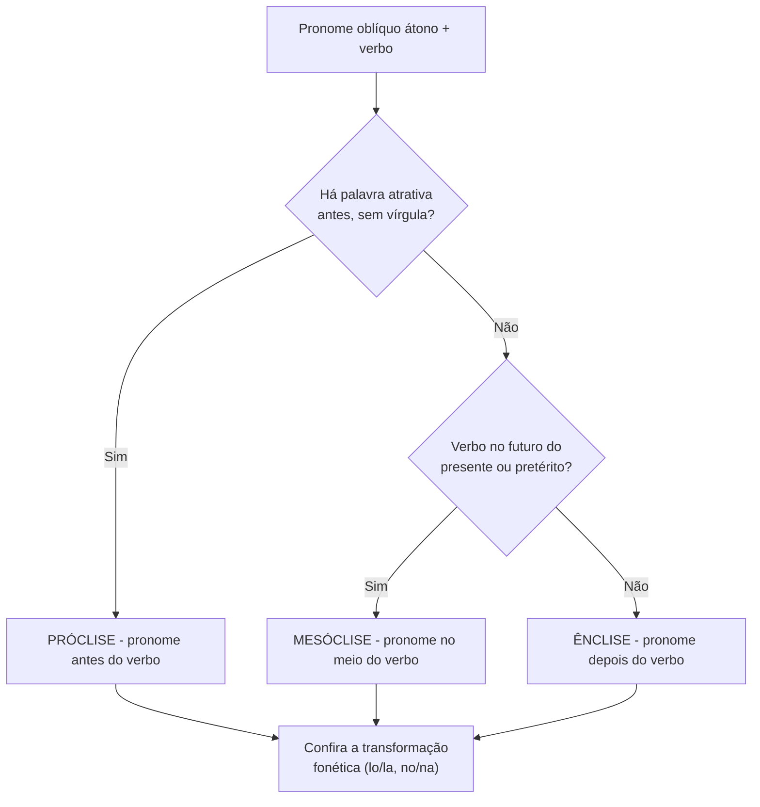

# Colocação Pronominal

> [!info] Metadados
> **Disciplina:** Língua Portuguesa
> **Bloco:** 1.1 — Língua Portuguesa (FASE 1 — Fundamentos)
> **Tópico:** 5. Estrutura morfossintática — Colocação pronominal
> **Subtópicos:** Pronomes oblíquos átonos · Próclise · Mesóclise · Ênclise
> **Pré-requisitos:** [[Compreensao-e-Interpretacao-de-Textos|Compreensão e interpretação de textos]]; [[Tipos-e-Generos-Textuais|Tipos e gêneros textuais]]; [[Ortografia-Oficial|Ortografia oficial]]; [[Coesao-Textual|Coesão textual]]; [[Classes-de-Palavras|Classes de Palavras]]; [[Sintaxe-da-Oracao|Sintaxe da Oração]]; [[Periodo-Composto|Período Composto]]; [[Pontuacao|Pontuação]]; [[Concordancia|Concordância]]; [[Regencia-e-Crase|Regência e Crase]]
> **Cargo:** Analista de TI — Perfil 3 (Desenvolvimento de Software) · DATAPREV 2026
> **Data:** 2026-08-27

---

## 1. O que são pronomes oblíquos átonos: o pequeno termo que muda de lugar

Você já viu, em [[Classes-de-Palavras|Classes de Palavras]], que os pronomes pessoais se dividem em **retos** (eu, tu, ele, nós, vós, eles) e **oblíquos** (me, te, se, lhe, nos, vos, o, a, os, as e suas variações). O pronome reto costuma exercer função de sujeito; o oblíquo, de complemento ou adjunto. Relembre a diferença com um par técnico: "**Eu** valido o dado" (eu = sujeito, pronome reto) e "o sistema **me** notifica" (me = objeto, pronome oblíquo). A pergunta deste tópico é bem mais simples do que parece: **onde esse pronome oblíquo átono fica em relação ao verbo?**

A palavra "átono" é a chave de tudo. Átono significa *sem acento próprio*, fraco, que "gruda" no verbo — não tem força para se sustentar sozinho na frase. Daí o comportamento peculiar: ele **não pode iniciar período**, porque começaria uma frase sem apoios. É exatamente essa fragilidade que gera as três posições possíveis: antes do verbo, no meio do verbo e depois do verbo. O nome técnico de cada posição pode assustar, mas é só etimologia: **próclise** (pró = antes, à frente), **mesóclise** (meso = no meio), **ênclise** (en = depois, atrás).

Vamos definir cada uma antes de ver as regras, para você ter o mapa na cabeça:

- **Próclise:** o pronome vem **antes** do verbo. "**Me** avise quando o deploy terminar."
- **Mesóclise:** o pronome fica **no meio** do verbo (com hífens), apenas em futuros. "Avise-**me**-ão na próxima sprint." (na verdade, "avisar-me-ão")
- **Ênclise:** o pronome vem **depois** do verbo, unido por hífen. "Avise-**me** quando terminar."

A regra de ouro que organiza tudo: **na norma culta, frase não começa com pronome átono.** Como toda frase começa com o primeiro termo vazio de atração, o "padrão" geral de início de oração é a **ênclise**. É por isso que dizemos "Entregaram-**me** o relatório", e não "Me entregaram o relatório" — embora esta segunda forma seja comum na fala coloquial, a banca cobra a norma culta. Perceba o paralelo com a programação: assim como uma variável precisa estar "inicializada" para ser usada, o pronome átono precisa de um "contexto" antes de si para ganhar uma posição legítima. Sem esse contexto, ele "crasha" — daí a proibição.

Aproveite para distinguir dois termos que a banca adora confundir: pronome átono e pronome tônico. Os **átonos** (me, te, se, lhe, nos, vos, o, a, os, as) são fracos e se grudam ao verbo; os **tônicos** (mim, ti, si, comigo, contigo, ele/ela) têm acento próprio e sempre vêm **depois de preposição**. "Este dado é para **mim**" (tônico, após "para") e "avise-**me**" (átono, ligado ao verbo). Se você trocar um pelo outro — "avise **mim**" ou "para **me**" — a frase estoura. Essa distinção fundamenta tudo o que vem a seguir, porque a colocação pronominal trata exclusivamente dos **átonos**.

Antes de avançar, responda mentalmente: por que "Me chamei ele" soa errado aos ouvidos de qualquer falante? Porque reúne duas regras violadas — iniciou-se período com átono ("me") e usou-se pronome reto "ele" como objeto. A banca explora justamente esses "ruídos" que todo mundo sente, mas só os que estudam conseguem **explicar e nomear**.

> [!tip] A pergunta que abre toda questão de colocação
> Antes de analisar qualquer alternativa, pergunte: **há uma palavra que atrai o pronome para antes do verbo?** Se sim, é próclise. Se não houver atrator e o verbo estiver no futuro, é mesóclise. Se não houver atrator e não for futuro, é ênclise. Esse roteiro de três passos resolve a esmagadora maioria das questões.

---

## 2. As três posições e o verbo no centro

Para fixar o esquema, imagine uma linha do tempo verbal. O pronome pode ficar **à esquerda** do verbo (próclise), **dentro** dele (mesóclise) ou **à direita** dele (ênclise). O que decide a posição é uma combinação de dois fatores: **a presença de uma palavra atrativa** e **o tempo verbal**.

Você já sabe, de [[Sintaxe-da-Oracao|Sintaxe da Oração]] e de [[Periodo-Composto|Período Composto]], que orações podem ser trazidas por conectivos (conjunções) e que certas palavras "abrem" períodos. Pois bem: algumas dessas palavras têm o poder de "puxar" o pronome para antes do verbo. Chamamos essas palavras de **palavras atrativas**. Quando uma delas aparece, a regra geral é **próclise**. Quando nenhuma atrai e o verbo está no futuro do presente ou no futuro do pretérito, o pronome "se encaixa" no meio — **mesóclise**. Em qualquer outro caso sem atração, o pronome vai para depois do verbo — **ênclise**.

O quadro abaixo resume, mas vamos destrinchar cada caso nas próximas seções:

| Posição | Palavra atrativa | Tempo verbal | Exemplo |
|---------|------------------|--------------|---------|
| **Próclise** | Presente | Qualquer | "**Te** aviso do resultado." |
| **Mesóclise** | Ausente | Futuro do presente / pretérito | "Avisar-**te**-ei." / "Far-**te**-ia." |
| **Ênclise** | Ausente | Demais tempos | "Aviso-**te**." / "Avisei-**te**." |

Não se prenda ainda aos exemplos formais — eles voltarão com calma. O essencial é perceber a hierarquia: **a palavra atrativa manda mais que o tempo verbal.** Se houver atração, próclise mesmo que o verbo seja futuro; a mesóclise só entra quando *não há* atração. Vamos explorar primeiro a próclise, que é o caso mais cobrado.

O diagrama abaixo traduz o roteiro de decisão em fluxo — use-o como "debug" para qualquer frase que a banca apresentar. Você entra no fluxo pelo verbo (e seu pronome) e segue as perguntas de decisão:

Repare que o fluxo termina sempre na mesma checagem: a **transformação fonética**. De nada adianta acertar a posição e errar a forma do pronome — "vender + o" não é "vender-o", é "vendê-lo". Guarde esse encadeamento: posição primeiro, forma fonética depois.

---

## 3. Próclise: quando a palavra atrativa puxa o pronome para antes do verbo

A **próclise** é a colocação do pronome **antes** do verbo, usada quando existe uma **palavra atrativa** — um termo que "chama" o pronome para a posição proclítica. O raciocínio da banca é direto: você precisa (1) saber quais palavras atraem e (2) reconhecer quando a atração é *bloqueada* (não se aplica). Vamos à primeira tarefa.

As palavras atrativas formam uma lista que vale memorizar, pois é alvo direto de questão:

- **Palavras negativas:** não, nunca, jamais, nada, ninguém, nenhum, nem. "**Não** me avisaram do erro." / "**Ninguém** se opôs à mudança."
- **Advérbios** (não seguidos de vírgula): hoje, sempre, já, agora, aqui, certamente, talvez, só. "Hoje **se** faz backup diário." / "Talvez **lhe** envie o relatório amanhã."
- **Pronomes relativos** (que, qual, cujo, onde): "O sistema **que** me notifica falhou." / "A equipe a quem **se** reportou o erro."
- **Pronomes indefinidos:** alguém, algo, tudo, nada, ninguém, outros, alguns. "Tudo **se** resolve com um rollback."
- **Pronomes demonstrativos neutros** (isto, isso, aquilo): "Isso **me** parece inadequado." / "Aquilo **se** explica pelo requisito."
- **Conjunções subordinativas** (que, se, quando, porque, embora, caso, como): "Quando **se** detectar a falha, avise." / "Se **me** perguntar, responderei."
- **"Em" + gerúndio:** "Em se tratando de dados sensíveis, cuidado." / "Em me dirigindo ao cliente..."

Há ainda dois atratores que valem destaque por sua frequência em prova: **"só"** e **"talvez"**. Eles atraem o pronome, então "**Talvez** ele se lembre" está correto; já "talvez *se ele* lembre" seria erro de outra natureza (a ordem do sujeito). E a forma "só" atrai: "**Só** me resta agradecer." Trate-os como advérbios que também atraem.

> [!warning] O detalhe do advérbio com vírgula
> O advérbio atrai o pronome quando está **sem vírgula** logo antes do verbo. Quando há vírgula (pausa), a atração é **bloqueada** — e o pronome pode ir para depois. Compare: "**Provavelmente** se tratava de um erro." (sem vírgula → próclise) e "Provavelmente, **tratava-se** de um erro." (com vírgula → ênclise, porque a pausa "quebra" a atração). Esse par é uma das pegadinhas mais finas da banca.

O ponto mais cobrado, porém, é o comportamento diante da palavra **"que"**. Ela é um atrator fortíssimo quando funciona como **conjunção subordinativa** ou **pronome relativo**. "O erro **que** se propagou pelo banco" (relativo → próclise). "É preciso que **se** revise a query" (conjunção → próclise). Mas a atração do "que" é **bloqueada** quando há pausa (vírgula) entre ele e o verbo, ou quando ele atua como **interjeição** ou **partícula expletiva/enfática**. Em "Que Deus **te** abençoe" a próclise se mantém; mas com pausa, como "ele disse que, **resolvido** o problema, ..." — veja que a pausa muda a dinâmica.

> [!important] A atração e seus bloqueios
> Atração ≠ próclise garantida. A atração é bloqueada quando: (1) há **pausa (vírgula)** entre a palavra atrativa e o verbo; (2) o verbo está no **particípio** (nesse caso o pronome não fica com ele — vai com o auxiliar); (3) com certos atratores em contextos específicos. Antes de marcar próclise, pergunte: o atrator está *colado* ao verbo? Se há vírgula, a atração caiu.

Deixe-me reforçar com um exemplo de frase técnica que une vários atratores: "Quando **se** inicia o processo, **não se** deve interromper." O primeiro "quando" (conjunção subordinativa) atrai "se"; o "não" (negação) atrai o segundo "se". Frases assim são exatamente o que a banca faz: empilhar atratores para testar se você os reconhece um a um.

Repare também num detalhe que separa quem decora de quem entende: a mesma palavra pode atrair ou não, conforme a função. O advérbio "só" atrai — "Só **me** resta validar." — mas o adjetivo "só" (no sentido de sozinho) não tem essa força. E o "como" atrai quando é **conjunção subordinativa** ("Como **se** sabe..."), mas se for parte de uma interjeição ou de aposto, o comportamento muda. Antes de aplicar a regra, pergunte: **essa palavra está funcionando como atrator aqui, nesta oração?** Função sintática decide atração — não a forma da palavra isolada. Esse refinamento é o que evita o erro de marcar próclise onde o "atrator" é, na verdade, outra classe.

---

## 4. Mesóclise: o pronome "dentro" do verbo no futuro

A **mesóclise** é a colocação do pronome **no meio** do verbo, separado por hífens de ambas as partes. Ela só ocorre com dois tempos: **futuro do presente** (cantarei, direi) e **futuro do pretérito** (cantaria, diria) — e **somente quando não há palavra atrativa**. Como vimos, se houver atrator, a próclise vence; sem atrator nesses futuros, o pronome entra no miolo do verbo.

Observe a formação: o futuro em português é uma fusão do infinitivo com o auxiliar "haver" (cantar + hei → cantarei). O pronome se "injetou" no ponto de união. Na prática:

- "Devolver-**te**-**ei** os dados amanhã." (futuro do presente)
- "Far-**lhe**-ia um favor, se pudesse." (futuro do pretérito)
- "Lavar-**se**-á a solução." — a forma correta é "lavar-se-á", não "lava-se-á".

Repare que a mesóclise não vale para outros tempos. Dizer "vende-**se**-**ram**"? Não existe — o pretérito não admite mesóclise. A pegadinha típica é colocar mesóclise num tempo que não é futuro, como "vende-se-ão" (forma errada; o correto ao futuro seria "vender-se-ão", mas "vende-**ram**-se" no pretérito é ênclise). Portanto: **mesóclise exige futuro** — essa é a regra de ouro da mesóclise.

Os dois casos em que a mesóclise *não* se usa com futuro merecem atenção:

- **Com palavra atrativa:** "**Não** te devolverei os dados" (não "não devolver-te-ei"); "**Quando** se detectar" (não "detectar-se-á", pois "quando" atrai).
- **Com particípio em locução:** o pronome não vai no particípio; fica no auxiliar. "Devolver-**te**-ei os dados" → se usamos forma perifrástica, "**te** terei devolvido", jamais "*terei devolvido-te*" nem "*terei-te devolvido*" de forma rígida (na próclise ao auxiliar). Voltaremos às locuções na seção 6.

> [!tip] O caráter formal da mesóclise
> A mesóclise é a colocação de **maior tom formal e literário** da língua. Você dificilmente a ouvirá numa conversa — quase ninguém diz "dizer-te-ei" no dia a dia; prefere-se "vou te dizer" (locução) ou "te direi" (próclise com atrator implícito). Na prova, porém, ela é cobrada justamente porque é a forma **exigida pela norma culta** em início de oração com futuro e sem atrator. Quando uma alternativa traz "dizer-te-ei" no lugar certo, marque-a como correta; quando traz mesóclise num tempo que não é futuro, derrube-a.

Veja como a banca combina os dois requisitos numa mesma frase. Suponha que você precise escolher a forma correta de "eu, com certeza, (guardar este dado):". Há atrator? "Com certeza" é um advérbio — sem vírgula após o "que"? Veja: "com certeza" é adjunto adverbial e, isolado por vírgulas, funciona como **pausa**, o que **bloqueia a atração**. Sem atrator efetivo e com o futuro "guardarei", a resposta é a **mesóclise**: "Guardá-**lo**-ei." Repare ainda na transformação: guardar + o = **guardá-lo** (o "r" cai, o "e" vira "á"). Duas regras numa única palavra — e é exatamente assim que a banca constrói as alternativas, empilhando posição e forma.

> [!example] Aplicação técnica
> Num doc de planejamento: "Entregar-**me**-ão o banco de dados na sexta." Corretíssimo (futuro do presente, sem atrator). Mas "Quando entregar-**me**-ão o banco" está **errado**: o "quando" atrai, então deveria ser "Quando **me** entregarão o banco". A banca adora trocar a posição do pronome depois de um atrator exatamente assim. E se o verbo fosse "devolver" com objeto direto? "Devolver-**me**-**ão** o acesso" → devolver + o objeto... cuidado: "devolver-me-ão" refere-se ao objeto indireto (a mim), o que muda tudo — o "o/a" direto se transformaria em "lo". Quando o objeto for direto, "devolvê-**lo**-ão".

---

## 5. Ênclise: o pronome depois do verbo (o padrão de início de oração)

A **ênclise** é a colocação do pronome **depois** do verbo, ligada por hífen. Ela é o "padrão" geral quando não há atrator. Ocorre, principalmente:

- No **início de oração** (regra de ouro: não se inicia período com átono): "**Entregaram-me** o relatório."
- **Após pausa** (vírgula, ponto e vírgula) que quebra a atração: "Provavelmente, **tratava-se** de um erro."
- No **imperativo afirmativo**: "Escuta-**me** com atenção." / "Faça-**se** a atualização."
- No **gerúndio** (sem "em"): "Falou, corrigindo-**se** em seguida." (com "em" antes, a próclise manda: "em **se** corrigindo").
- No **infinitivo impessoal**: "É preciso avisar-**lhes** do risco." / "Para resolver-**se** o conflito..."

Além disso, o infinitivo em certas construções admite próclise ou ênclise, conforme os atratores. O que não se pode é a mesóclise fora dos futuros.

Pergunte a si mesmo: por que o início de oração pede ênclise e não mesóclise? Porque a mesóclise exige **futuro**; se a oração começa com um verbo no presente ou no pretérito ("Avisei-me", "Aviso-me"), não há futuro, logo sobra só a ênclise. E por que não próclise? Porque não há atrator antes da primeira palavra — não há "contexto" que puxe o pronome. A ênclise, portanto, é a colocação "de reserva": ela entra sempre que nenhuma outra regra prevaleça. É por isso que, nas frases mais simples de início de período, o pronome vai para depois do verbo.

Há ainda um caso que confunde muita gente: o **infinitivo na voz passiva sintética** ("o relatório pode-se/pode ser..."). Frases como "Pode-se fazer a consulta" usam "se" indeterminando a ação, primeiro verbo (auxiliar) — uma ênclise ao auxiliar. Já "Os dados processam-se automaticamente" usa ênclise no verbo único. O fio condutor é o mesmo: se não há atrator, o pronome fica depois do verbo (ou depois do primeiro verbo da locução, quando houver).

### 5.1 As transformações fonéticas: a pegadinha do "lo/la" e do "no/na"

Aqui está a parte que derruba mais candidato. Quando o pronome oblíquo o/a/os/as **vem depois de verbo terminado em -r, -s ou -z**, ele assume as formas **lo/la/los/las**, e a consoante final do verbo cai:

- "fazer + o" → "fazê-**lo**" (o "r" cai, e o "e" ganha acento para manter o som).
- "vender + os" → "vendê-**los**".
- "fez + o" → "fe**z**..." na verdade "fez" + o → "fe-lo" (o "z" cai: "fezê-lo" não; a forma é "fi-lo" para o verbo fazer... cuidado, verbo fazer no pretérito perfeito "fez" + o = "fê-lo"; já o infinitivo "fazer" + o = "fazê-lo").
- "pôs + o" → "pô-lo".

Já quando o verbo **termina em -m, -ão ou -õe** (nasal), o pronome assume as formas **no/na/nos/nas**, mantendo a nasalidade:

- "vendem + o" → "vendem-**no**".
- "entregaram + os" → "entregaram-**nos**" (cuidado com a indecifrabilidade: "entregaram-nos" = "'entregaram os'", e também "entregaram-nos" de "entregar-nos"; o contexto decide).
- "fazem + a" → "fazem-**na**".
- "põem + o" → "põem-**no**".

E os pronomes **me, te, se, nos, vos** não sofrem essas transformações, mas se adaptam quando o verbo termina em **-mos** (1ª pessoa do plural): a sílaba "mos" muda. Compare:

- "amamos + nos" → "ama**mo**-**nos**" (o "s" de "mos" cai para não duplicar): "Nós **amo-nos**" — na verdade "amamo-nos".
- "vamos + nos" → "vamo-**nos** embora".
- "vestimos + nos" → "vestimo-**nos**".

Aproveite para fixar uma distinção que confunde muita gente: o pronome **"lhe"** (e "lhes"), ao contrário do "o/a/os/as", **nunca sofre** transformação fonética, porque funciona como objeto indireto — ele não depende da terminação do verbo da mesma forma. "Avise-**lhe**" mantém o "lhe" intacto; já "avise + o" vira "avise-**o**" ou "avise-**lo**", conforme a terminação. A regra: as mudanças lo/la e no/na valem **apenas para os pronomes de objeto direto** o/a/os/as. Se o pronome é "lhe", não há transformação a aplicar.

> [!warning] Pegadinha clássica do lo/no
> A banca costuma oferecer frases como "*Entregaram-lo* o relatório" (ERRADO) em lugar de "Entregaram-**no** o relatório" — porque o verbo termina em -m (nasal), exigindo "no". E "*Vende-la-ão*" vs. "Vendê-**la**-ão" no futuro: o "r" do infinitivo cai e o "e" final se acentua (vender → vendê-la-ão). Memorize o par de gatilhos: terminação -r/-s/-z → lo/la; terminação nasal (-m/-ão/-õe) → no/na.

O quadro abaixo consolida as transformações:

| Terminação do verbo | Pronome o/a os/as | Exemplo | Forma final |
|---------------------|-------------------|---------|-------------|
| -r | lo/la | fazer + o | fazê-lo |
| -s | lo/la | pôs + o | pô-lo |
| -z | lo/la | fez + o | fê-lo |
| -m | no/na | vendem + o | vendem-no |
| -ão | no/na | darão + a | darão-na |
| -õe | no/na | põem + o | põem-no |

---

## 6. Colocação em locuções verbais: o auxiliar comanda

Quando há **locução verbal** (verbo auxiliar + verbo principal, como "vou fazer", "estava corrigindo", "pode enviar"), a colocação ganha mais camadas — e é um dos terrenos favoritos da banca. Você já estudou os verbos auxiliares em [[Classes-de-Palavras|Classes de Palavras]]. A regra central: **na norma culta, o pronome átono não fica preso sozinho; ele se vincula ao verbo auxiliar** ou ao infinitivo/gerúndio em posições que variam conforme a estrutura.

Veja os cenários mais cobrados:

- **Auxiliar + infinitivo/gerúndio/particípio:** o pronome pode estar **antes do auxiliar** (próclise) quando há atrator, ou **depois do auxiliar** (ênclise ao auxiliar) quando não há. "**Não** vou te incomodar" (próclise ao auxiliar, por causa do "não") vs. "Vou **te** incomodar?" (aqui o pronome fica **entre** o auxiliar e o infinitivo — posição comum e aceita em locução verbal, que as bancas costumam aceitar quando não há atrator).

Na prática normativa, o mais seguro é organizar a locução pelas três formas que o **verbo principal** pode assumir — infinitivo, gerúndio ou particípio — pois cada uma tem regra própria. Esse é o recorte exato que a banca usa.

**Auxiliar + infinitivo.** O pronome pode ir antes do auxiliar (próclise, com atrator) ou depois do infinitivo (ênclise ao infinitivo). "**Não** o posso ajudar" (próclise ao auxiliar, por causa do "não") ou "Posso **ajudá-lo**?" (ênclise ao infinitivo, porque a oração começa sem atrator e "ajudar + o" = "ajudá-lo"). Ambas são aceitas pela norma culta; o que não se aceita é misturar sem critério, como "*pode ajudar-o*" ou "*não pode-o ajudar*".

**Auxiliar + gerúndio.** "Estou corrigindo o bug" com o pronome "o" admite: "**o** estou corrigindo" (próclise) ou "estou corrigindo-**o**" (ênclise ao gerúndio). Porém, se houver a preposição "em" com gerúndio, a próclise é obrigatória: "em **o** corrigindo". O que se evita é o pronome "soltar" o gerúndio no particípio — não confunda com o caso seguinte.

**Auxiliar + particípio.** Esta é a pegadinha central. Quando o verbo principal está no **particípio**, o pronome **não pode** se ligar a ele: não existe "*tido feito-o*" nem "*sido entregado-lo*". O pronome fica **antes do auxiliar** (próclise) ou **depois do auxiliar** (ênclise ao auxiliar): "**o** tenho entregado" ou "tenho-**o** entregado". Com particípio sem auxiliar (voz passiva), o correto é "O processo foi encerrado" — não há onde colocar pronome átono livre.

Vou resumir em uma tabela os três cenários, para fixar o recorte que a banca cobra:

| Estrutura | Próclise | Ênclise | Proibido |
|-----------|----------|---------|----------|
| Auxiliar + infinitivo | "**Não** o posso ajudar." | "Posso **ajudá-lo**." | "poder ajudar-o" |
| Auxiliar + gerúndio | "**O** estou corrigindo." | "Estou corrigindo-**o**." | "estou-o corrigindo" (na maioria das provas, vedado) |
| Auxiliar + particípio | "**O** tenho entregado." | "Tenho-**o** entregado." | "tinha entregado-o" |

O que a banca realmente testa é a **regra do particípio**: o pronome jamais se liga a ele. Em mais de uma questão, a alternativa errada é justamente aquela que pendura o átono no particípio — "os dados foram inserido-os" em vez de "**os** dados foram inseridos" (aqui, na verdade, "os dados se..." — cuidado, o padrão passivo se resolve por outra via). Guarde a máxima: **particípio não recebe pronome átono preso a ele.**

> [!example] Aplicação técnica
> "Se este dado não **for** validado, **não** se deve processá-lo." Repare: "não" atrai "se" (próclise ao auxiliar "deve"), e "processá-lo" usa a transformação lo (processar + o → processá-lo). A frase estaria errada se disséssemos "*processar-o*" — porque o "r" exige "lo". Esse é o casamento clássico entre locução e transformação fonética.

Com **infinitivo**, há uma flexibilidade controlada: se houver preposição ou atrator antes, próclise ao infinitivo é aceita; se começar a oração, ênclise. "Para **lhe** entregar o dado" (próclise ao infinitivo após "para", aceita) ou "para entregar-**lhe** o dado" (ênclise ao infinitivo, também correta). A banca, então, marcará como errada a forma que mistura posições proibidas — como mesóclise sem futuro ou pronome no particípio.

---

## 7. Tabela-resumo das regras de colocação

Para revisar em um só golpe de vista:

| Fator decisivo | Resultado | Exemplo |
|----------------|-----------|---------|
| Palavra atrativa (não, já, que, quando...) | **Próclise** | "Não **te** avisei." |
| Advérbio sem vírgula antes do verbo | **Próclise** | "Sempre **se** conecta." |
| Advérbio com vírgula (pausa) | **Ênclise** (atração quebrada) | "Sempre, **faz-se** backup." |
| Início de oração (sem atrator) | **Ênclise** | "Entregou-**me** o dado." |
| Futuro do presente/pretérito, sem atrator | **Mesóclise** | "Far-**lhe**-ei um favor." |
| Futuro, com atrator | **Próclise** | "Não **lhe** farei favor." |
| Imperativo afirmativo | **Ênclise** | "Faça-**se** a regra." |
| Gerúndio (sem "em") | **Ênclise** | "Corrigindo-**se** o bug." |
| Gerúndio com "em" | **Próclise** | "Em **se** corrigindo o bug." |
| Verbo terminado em -r/-s/-z | o → **lo** | "fazê-lo" |
| Verbo terminado em -m/-ão/-õe | o → **no** | "vendem-no" |

---

## 8. Estratégia de prova: palavras-chave e pegadinhas

### Palavras-chave para reconhecer a questão

Quando a banca falar em "colocação pronominal", "próclise", "mesóclise", "ênclise", "pronome oblíquo átono", "palavra atrativa", "futuro do presente", "futuro do pretérito", "transformação fonética do pronome" ou "locução verbal", você sabe que está diante desta matéria. Essas palavras sinalizam o tema e o que será testado. Guarde também os termos atratores — eles costumam aparecer sublinhados ou em itálico exatamente para você identificá-los.

A forma de cobrança típica é: apresentar uma frase e perguntar se a colocação está correta ou incorreta; ou pedir para assinalar a alternativa em que o pronome está empregado **incorretamente** (ou corretamente). O seu "motor de decisão" é sempre o roteiro de três passos da seção 1: há atrator? → próclise. Sem atrator e futuro? → mesóclise. Sem atrator e demais tempos? → ênclise. Depois, confira as transformações fonéticas.

### As pegadinhas no padrão armadilha → raciocínio errado → proteção

Vamos percorrer as cinco armadilhas mais rentáveis para a banca — e a proteção contra cada uma.

**[1] Iniciar período com pronome átono**

- **Armadilha:** a alternativa escreve "Me entregaram o relatório ontem" como correta.
- **Raciocínio errado do candidato:** "Na conversa, todo mundo fala assim, então deve estar certo."
- **Proteção:** a norma culta **proíbe** iniciar oração com pronome átono. A forma correta é "Entregaram-**me** o relatório ontem" (ênclise). Na prova, a opção que começa o período com "me/te/se/o/lhe" sem atrator é quase sempre a errada.

**[2] A atração e seus bloqueios**

- **Armadilha:** frase "Provavelmente, **se** decidiu o caso" — o candidato vê o advérbio "provavelmente" e já marca próclise.
- **Raciocínio errado:** "Tinha advérbio, logo próclise."
- **Proteção:** o advérbio está **seguido de vírgula**, o que **quebra a atração**. Correto: "Provavelmente, **decidiu-se** o caso." Só há próclise quando o atrator está *colado* ao verbo. Sempre cheque se há vírgula entre o atrator e o verbo.

**[3] Mesóclise sem futuro**

- **Armadilha:** "O sistema vende-se-ão os dados" ou "ele lembrou-se-á" fora de tempo de futuro — erro.
- **Raciocínio errado:** "Mesóclise é a forma chique, então está correta."
- **Proteção:** mesóclise **só existe** com futuro do presente e futuro do pretérito, e ainda assim **sem atrator**. Se o tempo não é futuro, não pode haver mesóclise. E com atrator diante do futuro, a mesóclise cede lugar à próclise: "Quando **o** sistema venderá" (não "vender-**o**-á").

**[4] As transformações lo/no**

- **Armadilha:** "*Entregaram-lo*" em vez de "Entregaram-**no**"; "*Vender-o-ão*" em vez de "Vendê-**lo**-ão".
- **Raciocínio errado:** "O pronome é 'o', então escrevo 'o' do mesmo jeito."
- **Proteção:** olhe a **terminação do verbo**. -r/-s/-z → lo/la/los/las (com queda da consoante e acento no infinitivo: fazê-lo, vendê-los). -m/-ão/-õe → no/na/nos/nas (vendem-no, dão-na). Essa é a pegadinha mais objetiva da matéria.

**[5] Locução verbal**

- **Armadilha:** "*Tendo entregado-o* o relatório" (pronome no particípio) ou "*Posso fazer-o*" como se fosse ênclise normal.
- **Raciocínio errado:** "Emprego o pronome direto no principal, como faria com verbo único."
- **Proteção:** o pronome **não** vai no particípio. Ele fica **antes do auxiliar** (próclise, com atrator) ou **depois do auxiliar** (ênclise ao auxiliar): "**o** tenho entregado" / "tenho-**o** entregado". E "fazer + o" = "fazê-lo", nunca "*fazer-o*".

**[6] O "que" e a oração relativa**

- **Armadilha:** frase "O erro que **notificou-se** ao administrador" — o candidato coloca ênclise logo depois de "que".
- **Raciocínio errado:** "Não vejo palavra de negação nem advérbio; então o pronome vai depois do verbo."
- **Proteção:** o "que" (pronome relativo ou conjunção subordinativa) é justamente um dos **atratores mais fortes**. Logo depois dele, **sem vírgula**, a colocação é **próclise**: "O erro que **se** notificou ao administrador" — e também "quando **se** detecta", "embora **se** saiba", "porque **me** avisaram". Toda vez que o "que/qual/cujo/onde" introduzir uma oração, aponte para a próclise; somente a presença de uma pausa depois dele (caso raro) liberaria a ênclise.

Com essas seis armadilhas dominadas, a colocação pronominal deixa de ser um mistério e vira um algoritmo: identifique o atrator, cheque a vírgula, confira o tempo e a terminação do verbo, e aplique a transformação fonética. Cada passo reduz o campo de erro e — o mais importante — transforma a intuição em justificativa, que é o que a banca pontua.

---

## 9. Revisão rápida

- **Pronome oblíquo átono** é fraco (sem acento) e **não inicia período** na norma culta. Por isso o "padrão" de início de oração é a ênclise.
- **Próclise** = pronome antes do verbo, puxado por **palavra atrativa**: negações (não, nunca, nada, ninguém), advérbios sem vírgula (sempre, talvez, só), pronomes relativos e indefinidos, demonstrativos neutros, conjunções subordinativas e "em" + gerúndio.
- **Mesóclise** = pronome no meio do verbo, **só** com futuro do presente e futuro do pretérito, **sem atrator**: "far-lhe-ei", "avisar-te-ia".
- **Ênclise** = pronome depois do verbo: início de oração, após pausa, imperativo afirmativo, gerúndio sem "em", infinitivo impessoal.
- **Bloqueios da atração:** vírgula/pausa entre o atrator e o verbo elimina a próclise (vira ênclise).
- **Fonética:** verbo terminado em **-r/-s/-z** → **lo/la** (fazê-lo); terminado em **-m/-ão/-õe** → **no/na** (vendem-no); após **-mos** com me/te/se/nos/vos → cai o "s" (amamo-nos).
- **Locução verbal:** pronome não vai no particípio; vai **antes do auxiliar** (próclise) ou **depois do auxiliar** (ênclise ao auxiliar). No infinitivo, há flexibilidade de posição.
- **Roteiro de prova:** há atrator? → próclise. Sem atrator + futuro? → mesóclise. Sem atrator + demais tempos → ênclise. Depois, confira a transformação fonética na terminação do verbo.

Esta nota **fecha o bloco** de Estrutura morfossintática: após percorrer as classes e a sintaxe da oração, o período composto, a pontuação, a concordância e a colocação pronominal, você dispõe do mapa completo que sustenta a reescrita de frases (próximo tópico da ementa) — e das pegadinhas que a banca usa para testar rigor com a norma culta.

Pense em como esse mapa se conecta: a colocação pronominal é o ponto em que **classes** (o pronome), **sintaxe** (a função de objeto), **período composto** (a oração trazida pelos atratores) e **pontuação** (a vírgula que quebra a atração) convergem num único fenômeno. É por isso que ela vem por último no bloco: ela quase exige que você domine tudo o que veio antes. Ao reescrever frases — transformar voz ativa em passiva, reposicionar termos, desfazer períodos — a colocação pronominal entra de novo como critério de correção. Para o Analista de TI, dominá-la é mais que gramática: é a garantia de que documentos técnicos, manuais e mensagens de sistema sigam a norma exigida pelo edital, sem "ruído" que distraia o leitor.
