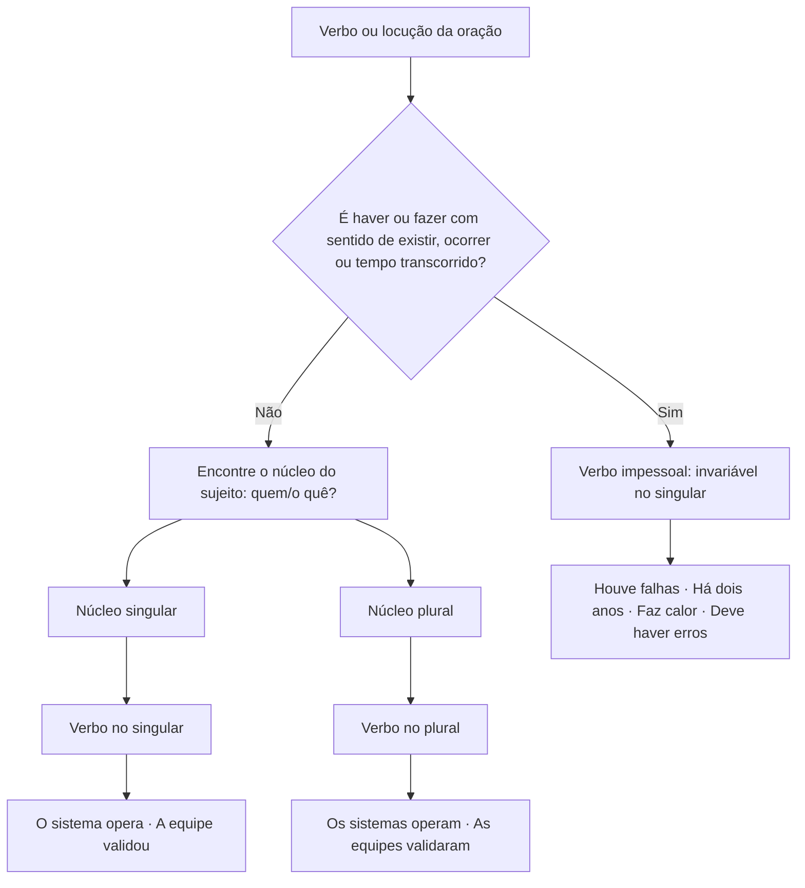

# Concordância

> [!info] Metadados
> **Disciplina:** Língua Portuguesa
> **Bloco:** 1.1 — Língua Portuguesa (FASE 1 — Fundamentos)
> **Tópico:** 5. Estrutura morfossintática — Concordância
> **Subtópicos:** Concordância nominal · Concordância verbal
> **Pré-requisitos:** [[Compreensao-e-Interpretacao-de-Textos|Compreensão e interpretação de textos]]; [[Tipos-e-Generos-Textuais|Tipos e gêneros textuais]]; [[Ortografia-Oficial|Ortografia oficial]]; [[Coesao-Textual|Coesão textual]]; [[Classes-de-Palavras|Classes de Palavras]]; [[Sintaxe-da-Oracao|Sintaxe da Oração]]; [[Periodo-Composto|Período Composto]]; [[Pontuacao|Pontuação]]
> **Cargo:** Analista de TI — Perfil 3 (Desenvolvimento de Software) · DATAPREV 2026
> **Data:** 2026-08-27

---

## 1. O que é concordância: o contrato de flexão entre as palavras

Você já sabe, de [[Classes-de-Palavras|Classes de Palavras]], que o substantivo é a palavra que nomeia os seres e que o adjetivo, o artigo e o pronome andam "na cola" dele, concordando em gênero e número. E sabe, de [[Sintaxe-da-Oracao|Sintaxe da Oração]], que o verbo se organiza em torno do sujeito e pede que o termo que o antecede responda "quem?/o quê?". A **concordância** é exatamente o ponto em que essas duas intuições viram regra: é o mecanismo pelo qual as palavras **flexionam-se umas conforme as outras** dentro da oração. Concordar é fazer um termo variável "conversar" com o termo a que se refere — não por estilo, mas por obrigação gramatical.

Pense numa frase corriqueira de relatório técnico: "Os servidores estão ativos." Por que **"os"**, **"ativos"** e **"estão"**? Porque "servidores" é masculino, plural, e está na 3ª pessoa do plural: o artigo copia o gênero e o número, o adjetivo copia o gênero e o número, e o verbo copia a pessoa e o número. Agora inverta a pergunta: se escrevêssemos "Os servidores está ativo", você sentiria o desconforto na hora — mas saberia explicar por quê? Este desconforto é o que a banca explora: quase todo mundo reconhece o erro quando ele é gritante; o problema das questões de concordância é quando o erro é **disfarçado** — o candidato precisa saber exatamente com qual termo cada palavra deve concordar.

A concordância se divide em dois grandes campos, e essa divisão segue a natureza das palavras envolvidas. Quando o ajuste envolve **gênero (masculino/feminino) e número (singular/plural) entre substantivo, artigo, adjetivo, pronome e numeral**, falamos em **concordância nominal** — o nome "nominal" remete a nome, isto é, a classe nominal. Quando o ajuste envolve **pessoa e número entre o verbo e o sujeito**, falamos em **concordância verbal** — o verbo "serve" o sujeito. A pergunta que guia cada caso é diferente: na nominal, "que termo é o substantivo de referência?"; na verbal, "qual é o núcleo do sujeito e em que pessoa e número ele está?".

> [!note] O mapa mental da concordância
> **Concordância nominal** = gênero + número (substantivo, adjetivo, artigo, pronome, numeral).
> **Concordância verbal** = pessoa + número (verbo × sujeito).
> A pergunta operacional da nominal: "com quem essa palavra concorda?"
> A pergunta operacional da verbal: "qual é o núcleo do sujeito e como ele flexiona?"

Há um detalhe que conecta tudo ao seu dia a dia de Analista de TI: a concordância é o que separa um texto técnico confiável de um texto que desvia a atenção do leitor. Um manual que diz "Segue anexo as documentações" faz o leitor duvidar da precisão do autor — e a precisão é o valor central da sua área. Vamos, então, estudar cada campo com as armadilhas reais das provas.

---

## 2. Concordância nominal: o maior celeiro de pegadinhas

A concordância nominal concentra a maior parte das "pegadinhas" da disciplina, porque envolve palavras curtas, aparentemente inofensivas, cujo comportamento muda conforme a classe em que foram empregadas. O ponto de partida é simples: o **adjetivo, o artigo, o pronome e o numeral concordam em gênero e número com o substantivo** a que se referem. O que complica é que existem substantivos **de um** lado e construções de **dois** substantivos, palavras que ora são adjetivos, ora advérbios, e expressões fixas que se comportam à margem da regra. Vamos por blocos.

### 2.1 O adjetivo com um e com dois substantivos

Com **um substantivo**, não há mistério: o adjetivo concorda com ele. "A solução estava completa." / "Os testes estão completos." O teste muda de figura quando aparecem **dois substantivos** (ou mais) qualificados por um mesmo adjetivo. Nesse caso, a posição do adjetivo decide tudo:

- **Adjetivo ANTEPOSTO** (antes dos substantivos): concorda com o **mais próximo**. "Eficiente metodologia e código" — o adjetivo "eficiente" concorda com "metodologia" (o substantivo mais próximo), porque veio antes dele. Note que "eficiente" é uniforme, então o exemplo não mostra a flexão — veja com adjetivo biforme: "aceitou-se **nova** arquitetura e linguagem" (concorda com "arquitetura", o mais próximo; se fosse "novo" antes, concordaria com o primeiro, ainda que o segundo fosse feminino).
- **Adjetivo POSPOSTO** (depois dos substantivos): há **duas possibilidades** — ele pode concordar com o **mais próximo** ou ir para o **plural masculino** (quando qualifica os dois núcleos, o masculino plural funciona como forma genérica). "O desenvolvedor revisou **código e documentação técnica**" (concorda com "documentação", o mais próximo) ou "revisou **documentação e código técnico**" (concorda com "código"). Para dizer que a revisão abrangeu os dois: "revisou **código e documentação técnicos**" — plural masculino, abrangendo ambos.

A pergunta que abre qualquer questão desse tipo: **o adjetivo vem antes ou depois dos substantivos?** Antes → mais próximo, obrigatoriamente. Depois → mais próximo ou plural masculino, conforme o sentido: se o adjetivo caracteriza os dois núcleos, o plural masculino é a forma natural; se caracteriza apenas o último, a concordância com o mais próximo é a escolha.

> [!example] Aplicação técnica
> "Foram apresentados o **backlog e a estimativa atualizados**" — plural masculino: os dois estão atualizados. "Foram apresentados o backlog e a **estimativa atualizada**" — só a estimativa está atualizada. A escolha entre as duas formas não é capricho: é sinalização de sentido.

Repare na consequência para a leitura: a mesma frase com concordâncias diferentes informa coisas diferentes. É por isso que a forma "o backlog e a estimativa **técnico**" (adjetivo no singular masculino) é sempre erro — essa forma não concorda com nenhum dos dois núcleos e não sinaliza nem plural nem proximidade. Se o adjetivo posposto não vai ao plural, deve ao menos acompanhar o núcleo mais próximo; se não acompanha nenhum, a frase fica suspensa, sem referência de flexão. Esse é o teste final que a banca aplica nas alternativas.

### 2.2 "É proibido", "é necessário", "é bom": o artigo é a chave

Uma família clássica de pegadinhas envolve adjetivos como "proibido", "necessário", "bom", "preciso" em construções com o verbo "ser". A regra é a famosa: **sem artigo (ou pronome), invariável; com artigo (ou pronome), variável**. Ou seja, tudo depende de o substantivo estar **determinado** ou não.

- "É **proibido** alterar dados sem autorização." — sem artigo, invariável (o sujeito é a oração "alterar dados").
- "É **proibida** **a** alteração de dados sem autorização." — com artigo "a", o adjetivo concorda: "proibida".
- "É **necessário** paciência." — sem artigo, invariável.
- "É **necessária** **a** paciência com usuários." — com artigo, variável.
- "Água é **bom** para a saúde." — sem artigo, invariável.
- "**Esta** água é **boa**." — com pronome/artigo, variável.

O raciocínio por trás da regra: sem artigo, o substantivo funciona como uma ideia geral, quase abstrata, e o adjetivo fica "solto" no masculino singular; com artigo, o substantivo fica determinado e o adjetivo passa a ter um termo concreto com que concordar. Na prova, o teste é automático: **existe "o/a" ou um pronome antes do substantivo?** Sim → o adjetivo varia. Não → invariável.

A mesma chave vale para "é preciso": "É **preciso** atenção com os requisitos." (sem artigo, invariável) × "É **precisa** **a** atenção com os dados sensíveis." (com artigo, variável). Se a banca colocar "É proibido a entrada" lado a lado com "É proibida a entrada", o segundo vence — e a justificativa é sempre a presença do artigo, nunca "o costume de dizer".

### 2.3 "Menos" × "bastante" × "muito" × "pouco": a classe decide

Aqui mora um dos erros mais feios que existem — e que serve de isca perfeita para a banca.

**"Menos" é sempre invariável.** Não existe "menas" em português, ponto final. "Havia **menos** pessoas na reunião." "Foram registradas **menos** falhas." Toda alternativa com "menas" está automaticamente errada.

**"Bastante" é camaleão**: quando é **advérbio** (intensifica verbo ou adjetivo), é invariável: "O sistema ficou **bastante** lento." / "A equipe trabalhou **bastante**." Quando é **adjetivo ou pronome indefinido** (equivale a "suficiente", "muitos"), concorda: "Foram levantados **bastantes** requisitos." / "Havia **bastantes** usuários online." O teste: troque por "muitos". "muitos requisitos" funciona → **bastantes** requisitos. Troque por "muito" (advérbio): "muito lento" funciona → **bastante** lento.

**"Muito" e "pouco"** seguem o mesmo raciocínio: invariáveis como advérbios ("muito estável", "pouco confiável"), variáveis como adjetivos/pronomes ("**muitos** testes", "**poucas** falhas"). A diferença é que ninguém erra "muitos testes", porque a forma é visível; o erro surge quando a palavra está sozinha, aparentemente neutra, e o candidato não pergunta se ela está modificando um verbo (advérbio) ou um substantivo (adjetivo).

> [!warning] A isca do "bastante"
> **A armadilha:** a alternativa diz que "A equipe executou bastante testes" está correta.
> **O raciocínio errado:** "bastante também fica invariável, como menos."
> **Como se proteger:** aqui "bastante" modifica "testes" (substantivo) e significa "muitos" — é **adjetivo**, logo **bastantes testes**. Se modificasse um verbo ("a equipe testou bastante"), seria advérbio invariável. Pergunte sempre: **estou falando de quantidade (adj.) ou de intensidade (adv.)?**

### 2.4 "Anexo", "incluso", "quite" × "em anexo"

"Anexo", "incluso" e "quite" são **adjetivos** e, portanto, **concordam** com o termo a que se referem: "Segue **anexo** o relatório." / "Seguem **anexas** as planilhas." / "Estão **inclusas** as observações." / "O contribuinte está **quite** com o Fisco; a contribuinte está **quita**; os contribuintes estão **quites**."

O contraponto é a **locução adverbial "em anexo"**, que é **invariável**, porque "anexo" ali virou substância de locução, não adjetivo: "As planilhas seguem **em anexo**." A pegadinha clássica está na frase "Segue anexo as planilhas" — o candidato acha que "anexo" está certo porque "segue" está no singular, mas o sujeito é "as planilhas" (plural, feminino) e o adjetivo "anexo" precisa concordar: "Seguem anexas as planilhas".

### 2.5 "Obrigado": concorda com quem agradece

Um caso de concordância que foge da relação normal: **"obrigado" concorda com o gênero de quem agradece**, não com o que se agradece nem com o interlocutor. Um homem diz "muito **obrigado**"; uma mulher diz "muito **obrigada**". Em um e-mail de uma analista: "Recebi o retorno da equipe. Muito **obrigada**." Para grupos mistos, usa-se a forma masculina plural. A banca explora esse caso em frases de contexto, pedindo que você identifique se "obrigado/obrigada" está coerente com o emissor.

### 2.6 "Só" e "sós": advérbio × adjetivo

"Só" também é camaleão. **Advérbio** (equivalente a "somente"), é invariável: "As auditorias **só** acontecem às sextas." / "Eles **só** revisam o código após o deploy." **Adjetivo** (equivalente a "sozinho"), concorda: "Eles ficaram **sós** no ambiente." / "Elas entraram **sós** no data center." O teste é a troca: "somente" mantém o sentido → invariável; "sozinho(s)" mantém → variável.

### 2.7 "Mesmo", "próprio", "possível"

"Mesmo" e "próprio" são adjetivos de reforço e **concordam**: "Eles **mesmos** validaram." / "Elas **mesmas** revisaram." / "Os **próprios** usuários reportaram." O erro aparece em frases como "eles mesmo fizeram" (sem o "s").

"Possível" tem um comportamento particular nas construções superlativas. Com **"o mais... possível"**, funcionando como intensificador, fica invariável: "Entregue o código **o mais rápido possível**." Já com o núcleo no plural, concorda: "São **os mais rápidos possíveis**." / "As soluções **mais completas possíveis**." A lógica: no primeiro caso, "possível" acompanha o conjunto "o mais rápido" (expressão adverbial); no segundo, "possíveis" qualifica o substantivo plural. O candidato precisa ler o substantivo de referência antes de flexionar.

### 2.8 "Meio": advérbio × adjetivo

Outro camaleão curto e traiçoeiro. **Advérbio**, "meio" significa "um pouco" e é invariável: "A analista estava **meio** cansada." / "O sistema ficou **meio** instável." **Adjetivo**, "meio" significa "metade" e concorda: "a reunião durou **meia** hora" (meia = metade de uma hora, feminino porque "hora" é feminino). A pegadinha é simétrica e cruel: "A equipe estava **meia** cansada" está errado (deveria ser "meio"), e "Faltam **meio** hora para o deploy" também está errado (deveria ser "meia"). O teste: troque por "um pouco" → invariável; troque por "metade de" → concorda.

### 2.9 Pronomes de tratamento: sempre na 3ª pessoa

Os **pronomes de tratamento** (Você, Vossa Senhoria, Vossa Excelência, Vossa Majestade) apresentam uma aparente contradição: referem-se à pessoa com quem se fala (2ª pessoa do discurso), mas **exigem verbos, pronomes e possessivos na 3ª pessoa** — porque o núcleo gramatical é o substantivo "Vossa X", não o interlocutor. Assim: "**Vossa Senhoria receberá** o certificado digital." (nunca "recebereis"); "**Vossa Excelência será informada** pelo e-mail corporativo." O gênero do adjetivo, porém, acompanha o **sexo real da pessoa** a quem se fala: "Vossa Excelência está **preocupado**" (homem) / "**preocupada**" (mulher), ainda que o núcleo "Excelência" seja feminino. A banca troca a forma pela 2ª pessoa ("Vossa Senhoria sois") ou erra o gênero do adjetivo — e a proteção é lembrar que o verbo é sempre 3ª pessoa e o adjetivo segue a pessoa real.

---

## 3. Concordância verbal: o verbo a serviço do sujeito

Se na concordância nominal o jogo é de gênero e número, na verbal o jogo é **de pessoa e número**: o verbo flexiona-se para combinar com o **sujeito** — mais precisamente, com o **núcleo do sujeito**. Toda a dificuldade está em descobrir quem é esse núcleo (ou se ele existe), porque a banca adora escondê-lo. A nota de [[Sintaxe-da-Oracao|Sintaxe da Oração]] já lhe deu a ferramenta: ache o verbo, pergunte "quem?/o quê?", veja a resposta. A concordância verbal é essa operação transformada em regra.

### 3.1 Sujeito simples: o verbo segue o núcleo

Com sujeito **simples** (um só núcleo), o verbo concorda com esse núcleo em pessoa e número. "A equipe **validou** os dados." O núcleo é "equipe" (singular, 3ª pessoa) — singular. Cuidado com o disfarce: adjuntos no plural não mudam o núcleo. "O grupo de desenvolvedores **foi** destacado." — o núcleo é "grupo", não "desenvolvedores". A pergunta socrática que resolve: **o verbo concorda com o núcleo ou com o adjunto?** Sempre com o núcleo — é o famoso caso em que o candidato se deixa hipnotizar pela palavra plural mais próxima do verbo.

Quando o sujeito vem **posposto** (depois do verbo), a concordância continua sendo com o núcleo: "**Foram processados** 3 mil arquivos." Quem foi processado? "3 mil arquivos" — núcleo plural, verbo plural. "**Foi publicado** o relatório de auditoria." Núcleo singular, verbo singular. A posição não muda a concordância; apenas dificulta a leitura.

### 3.2 Sujeito composto: anteposto, posposto, e as conjunções que decidem

Com **sujeito composto** (dois ou mais núcleos), a regra geral: verbo no **plural**. "O back-end e o front-end **foram** entregues." Se o sujeito composto vem **posposto**, o verbo pode ir ao plural **ou** concordar com o primeiro núcleo: "**Foram entregues** o back-end e o front-end" / "**Foi entregue** o back-end e o front-end" — ambas corretas. A pegadinha aparece quando a frase mistura essas possibilidades e a banca afirma que só uma é válida.

As conjunções mudam o jogo. Veja os casos de ouro:

- **"ou" com ideia de exclusão** (um OU outro, não ambos) → verbo no **singular**: "O gerente **ou** o diretor **assinará** o contrato." Com ideia de **soma** → plural: "O estudo **ou** a prática **enriquecem** o currículo."
- **"nem... nem..."** → admite singular ou plural: "Nem o analista **nem** o testador **revisou/revisaram** o script." De **"nem um nem outro"**, porém, a norma fixa o singular: "**Nem um nem outro** **compareceu**."
- **"um e outro"** → singular de preferência, plural também aceito: "**Um e outro** relatório **foi/foram** aprovado(s)."
- **"cada um"** → verbo no **singular**, mesmo seguido de plural: "**Cada um** dos desenvolvedores **entregou** sua tarefa."
- **Núcleos sinônimos** (ou quase sinônimos) → verbo no **singular**: "O **zelo** e o **cuidado** com os dados **é** admirável." A ideia é de uma coisa só, dita duas vezes — e o que é um só não pluraliza.

### 3.3 Expressões partitivas, "um dos que", porcentagens e frações: a família da concordância "atrativa"

Este é o território mais fértil de pegadinhas da concordância verbal — e o mais ligado ao seu universo de números e dados.

**Partitivas.** Com "a maioria de", "grande parte de", "a maior parte de", "metade de", "parte de" seguidos de plural, o verbo pode concordar com o partitivo (**singular**, concordância gramatical) ou com o termo plural (**plural**, concordância atrativa, porque o verbo "sente" o plural próximo): "**A maioria** dos usuários **acessou/acessaram** o portal." Ambas são corretas. Na dúvida, o singular é sempre seguro (concorda com o núcleo "maioria"); o plural é aceito quando o especificador plural está explícito.

**"Um dos que".** Com **"um dos que..."**, a concordância preferida é com o antecedente plural: "Ele **é um dos analistas que participaram** da auditoria." (participaram = os analistas participaram). Muitos gramáticos modernos admitem também o singular ("participou" — como se "um" fosse o antecedente), e a banca costuma respeitar essa dupla possibilidade — mas, se o enunciado for claro, o plural é a forma consagrada. O raciocínio: a oração "que participaram" refere-se a "os analistas", que é plural.

**Porcentagens e frações.** Aqui estão as regras de ouro:

- **Percentual sem especificador**: o verbo concorda com o numeral — "**1% desistiu**" (singular), "**10% desistiram**" (plural), "**25% apoiou/apoiaram a proposta**". Nesse último caso mora uma das perguntas mais repetidas das bancas: o numeral plural permite as duas formas, mas a preferencial em prova é a concordância com o numeral ("apoiaram"); o singular ("apoiou") é aceito quando o falante trata o percentual como um bloco único.
- **Percentual + especificador plural** ("dos alunos"): o verbo pode concordar com o especificador (plural) ou com o numeral — "**10% dos alunos aprovaram**" (plural natural) e "**1% dos alunos aprovou**" (singular por atração do numeral). A forma "1% dos alunos aprovaram" também é admitida pela concordância atrativa; a mais segura em prova é seguir a leitura: numeral plural → plural; numeral com "1"/"um" → singular.
- **Frações**: o verbo concorda com o **numerador** — "**um terço** dos candidatos **faltou**" (singular), "**dois terços** faltaram" (plural). Com fração e especificador, o mesmo jogo da porcentagem: "**Um décimo** dos chamados **foi** resolvido no prazo" (numerador singular) × "**Três quartos** dos chamados **foram** resolvidos" (numerador plural).
- **"Mais de um"**: singular — "**Mais de um** analista **apresentou** a solução." Exceção: com sentido recíproco, plural — "**Mais de um** técnico **se cumprimentaram**."

A proteção para o dia da prova: **separe o que é número do que é especificador**. O número diz singular ou plural; o especificador plural autoriza a concordância atrativa. Faça o verbo "olhar" para o numeral primeiro.

### 3.4 Coletivos

Os **coletivos** ("a equipe", "a tropa", "o rebanho", "a turma", "o time") têm núcleo singular — logo, verbo no **singular**: "A equipe **decidiu** parar o deploy." A novidade entra quando o coletivo vem **especificado** por um adjunto no plural: "A equipe de analistas **decidiu/decidiram** suspender a release." O singular é a concordância gramatical (núcleo "equipe") e sempre correto; o plural é admitido pela atração do especificador ("analistas"), sendo mais comum em registro informal. Em prova aberta, marque o singular como a forma neutra; em alternativa que legitime ambas, saiba reconhecer as duas.

Pergunte-se: por que "A equipe de analistas **apresentaram** os resultados" não é um erro brutal, enquanto "A equipe de analistas **apresentou** os resultados" nunca será? Porque o singular concorda com o núcleo do sujeito (gramatical) e o plural concorda com o termo expressivo mais próximo (atrativa) — as duas são legítimas quando o especificador plural está explícito. O que ninguém aceita é o plural sem especificador: "A equipe **decidiram**" jamais passaria, porque não há núcleo plural para atrair o verbo.

### 3.5 Verbos impessoais: o coração das pegadinhas "haver/fazer"

Chegamos à família que sustenta uma boa parte das questões de concordância: os **verbos impessoais** — aqueles que **não têm sujeito** e, por isso, ficam **invariáveis na 3ª pessoa do singular**. São impessoais:

- **"haver" com sentido de existir/ocorrer**: "**Houve** falhas no último deploy." (nunca "houveram falhas"); "**Havia** usuários conectados." Nas **locuções**, a impessoalidade contagia o auxiliar: "**Deve haver** erros no log." (nunca "devem haver").
- **"haver" indicando tempo transcorrido**: "**Há** dois anos trabalho na DATAPREV." (nunca "hão").
- **"fazer" indicando tempo ou fenômeno da natureza**: "**Faz** dois anos que o sistema foi migrado." / "**Faz** calor." Em locução: "**Vai fazer** dois anos." (o auxiliar também fica no singular).

O contraponto é o verbo **"existir"**, que é **pessoal** e concorda normalmente: "**Existem** falhas no sistema." / "**Existem** 3 mil arquivos." Compare a dupla que mais cai: "**Há** 3 mil arquivos" (impessoal, singular) × "**Existem** 3 mil arquivos" (pessoal, plural). As duas estão corretas — com verbos diferentes. O verbo "ter", no sentido existencial, é marca do registro coloquial ("tem muitos arquivos"); em texto formal de prova, prefira "haver" ou "existir".

Perto dessa família vive a expressão fixa **"haja vista"** ("considere-se, a saber, por exemplo"), que permanece **invariável**: "O sistema é confiável, **haja vista** os resultados obtidos." A forma "hajam vista" é desaconselhada pela norma de concurso.

Guarde também o corolário que a banca mais explora: em **locuções verbais** com haver impessoal, o auxiliar fica no singular — "deve haver", "pode haver", "vai haver" —, jamais "devem haver", "podem haver", "vão haver".

> [!warning] A tríade que derruba: haver × fazer × existir
> **A armadilha:** "Houveram problemas durante a migração" ou "Devem haver soluções alternativas" apresentadas como corretas.
> **O raciocínio errado:** "o plural 'problemas' arrasta o verbo para o plural, como acontece com existir."
> **Como se proteger:** "haver" no sentido de existir **não tem sujeito** → fica no singular em qualquer situação, inclusive dentro de locução ("deve haver"). "Existir" **tem sujeito** → concorda ("existem problemas"). O mapa abaixo fixa a decisão.

### 3.6 Verbo com sujeito oracional

Quando o sujeito é uma **oração** (o famoso caso que você estudou em [[Periodo-Composto|Período Composto]] como subordinada substantiva subjetiva), o verbo da oração principal fica na **3ª pessoa do singular**: "**É** fundamental **que os logs sejam preservados**." — o que é fundamental? A oração. "**Convém** que todos revisem." / "**Falta** que os dados sejam enviados." A pegadinha está em confundir com o sujeito simples: "Faltam os dados" (sujeito "os dados", plural — correto) × "Falta que os dados sejam enviados" (sujeito oracional — singular). A pergunta muda: **a resposta de "quem?/o quê?" é uma palavra ou uma oração?** Se for oração, singular.

### 3.7 "Se" apassivador × "se" indeterminador: a ponte com a sintaxe

Você viu em [[Sintaxe-da-Oracao|Sintaxe da Oração]] a diferença entre a **partícula apassivadora** e o **índice de indeterminação do sujeito**. Na concordância, essa distinção decide o número do verbo:

- **"Se" apassivador** + verbo **transitivo direto** (que aceita voz passiva) → o verbo concorda com o sujeito passivo: "**Executaram-se** os testes automatizados." (sujeito: "os testes automatizados", plural); "**Executou-se** o teste." (singular); "**Vendem-se** softwares licenciados." O teste: a frase admite passiva analítica? "Os testes foram executados" → sim, é apassivador.
- **"Se" indeterminador** + verbo **intransitivo ou transitivo indireto** (que não aceita voz passiva) → verbo invariável no singular: "**Precisa-se** de analistas." (de analistas é objeto indireto, não sujeito); "**Trata-se** de requisitos legais."; "**Vive-se** bem aqui."

A regra de ouro é a mesma da nota de sintaxe: **preposição ou verbo sem passiva → indeterminador (singular); verbo que concorda com termo plural e aceita passiva → apassivador (concorda)**. A frase "Precisa-se de analistas" é a campeã de pegadinhas, porque "analistas" está no plural e o candidato sente vontade de pluralizar o verbo.

### 3.8 Os relativos "quem" e "que"

Com o pronome relativo **"que"**, o verbo concorda com o **antecedente**: "**Sou eu que escrevo** o código." (antecedente "eu" → 1ª pessoa); "**Fomos nós que entregamos** o relatório."; "**São eles que decidem**." Com o relativo **"quem"**, a forma preferida é a **3ª pessoa do singular**: "**Sou eu quem escreve** o código." / "**Foi ela quem corrigiu** a falha." Muitos gramáticos admitem também a concordância com o antecedente ("sou eu quem escrevo"), mas a **3ª pessoa é a forma consagrada e a mais segura em prova**. O padrão de cobrança: a alternativa mistura "fui eu que fiz" (correta) com "fui eu quem fiz" (aceita, mas menos clássica) — a proteção é saber que "que" puxa a concordância para o antecedente e "quem" puxa para a 3ª pessoa.

---

## 4. Tabelas-resumo

### 4.1 Concordância nominal × verbal

| Campo | O que flexiona | Com o que concorda | Pergunta operacional |
|---|---|---|---|
| **Nominal** | Adjetivo, artigo, pronome, numeral | Substantivo (gênero e número) | "Com qual substantivo?" |
| **Verbal** | Verbo | Núcleo do sujeito (pessoa e número) | "Qual é o núcleo do sujeito?" |

### 4.2 Casos de verbo impessoal

| Verbo / expressão | Condição | Forma | Exemplo |
|---|---|---|---|
| **Haver** (existir/ocorrer) | Sempre impessoal | Singular | "Houve falhas" / "Deve haver erros" |
| **Haver** (tempo) | Sempre impessoal | Singular | "Há dois anos" |
| **Fazer** (tempo/clima) | Sempre impessoal | Singular | "Faz dois anos" / "Vai fazer calor" |
| **Existir** | Pessoal | Concorda | "Existem falhas" / "Existem 3 mil arquivos" |
| **Haja vista** | Locução fixa | Invariável | "haja vista os resultados" |

### 4.3 Casos de sujeito composto e afins

| Construção | Concordância | Exemplo |
|---|---|---|
| Sujeito composto anteposto | Plural | "O back-end e o front-end foram entregues." |
| Sujeito composto posposto | Plural ou com o 1º núcleo | "Foram/foi entregue(s) o back-end e o front-end." |
| "ou" exclusivo | Singular | "O gerente ou o diretor assinará." |
| "ou" de soma | Plural | "O estudo ou a prática enriquecem." |
| "nem um nem outro" | Singular | "Nem um nem outro compareceu." |
| "cada um" | Singular | "Cada um dos analistas entregou." |
| "um e outro" | Singular (ou plural) | "Um e outro relatório foi (foram) aprovado(s)." |
| Núcleos sinônimos | Singular | "O zelo e o cuidado é admirável." |
| Partitiva + plural | Singular ou plural atrativo | "A maioria dos usuários acessou/acessaram." |
| "um dos que" | Plural (forma consagrada) | "um dos analistas que participaram." |
| "1% (dos alunos)" | Singular (numeral) | "1% dos alunos aprovou." / "1% aprovou." |
| "10%, 25% (dos alunos)" | Plural | "10% dos alunos aprovaram." |
| Fração | Com o numerador | "Dois terços faltaram." |
| "Mais de um" | Singular (exceto recíproco) | "Mais de um analista apresentou." |
| Coletivo | Singular (plural atrativo com especificação) | "A equipe decidiu (decidiram) suspender." |

---

## 5. Estratégia de prova: palavras-chave e pegadinhas

**Palavras-chave para reconhecer a questão na hora:** "concordância nominal", "concordância verbal", "verbo impessoal", "a maioria de", "sujeito composto", "se apassivador", "se indeterminador", "partícula apassivadora", "índice de indeterminação", "possível/possíveis", "anexo/anexas", "bastante/bastantes", "menos", "meio/meia". Quando o enunciado traz uma dessas expressões, a banca está testando se você sabe **com qual termo** a palavra flexiona — não está pedindo interpretação de sentido.

A banca costuma usar três formatos de enunciado: **(1)** "Assinale a alternativa em que há erro de concordância"; **(2)** "Assinale a frase em que a concordância está adequada à norma culta"; **(3)** a reescrita — "a reescrita que mantém a correção gramatical é...". No formato (3), leia sempre a frase original e pergunte qual termo comanda a flexão antes de julgar a alternativa; a reescrita errada costuma manter o sentido e trocar apenas o número do verbo ou o gênero do adjetivo. Esse é o jogo: a banca não inventa palavras novas, só desloca a concordância.

As pegadinhas mais repetidas seguem o mesmo padrão: apresentam uma frase que parece certa (ou um par de frases) e forçam o candidato a tomar partido. Veja as sete que você não pode errar.

> [!warning] Pegadinha 1 — "haver/fazer" impessoais
> **A armadilha:** "Houveram problemas no deploy" e "Devem haver soluções alternativas" dadas como corretas, ou "Há dois anos" reescrito como "Hão dois anos".
> **O raciocínio errado:** "o termo plural perto do verbo puxa o plural, como em existem problemas."
> **Como se proteger:** "haver" com sentido de existir/ocorrer e "fazer" com sentido de tempo não têm sujeito → ficam no singular, até dentro de locução ("deve haver"). O verbo que concorda é "existir". Faça o teste: dá para pensar em quem pratica a ação? Não → impessoal → singular.

> [!warning] Pegadinha 2 — "menos" invariável
> **A armadilha:** uma alternativa escreve "Havia menas pessoas" ou "foram registradas menas falhas" e pede para marcar a correção.
> **O raciocínio errado:** "se 'poucas' concorda, 'menos' também deveria concordar com o feminino plural."
> **Como se proteger:** "menos" é advérbio, palavra invariável — não existe "menas". Sempre que a alternativa apresentar "menas", ela está errada, não importa o resto da frase.

> [!warning] Pegadinha 3 — "bastante"
> **A armadilha:** "A equipe executou bastante testes" é dada como correta; ou "Foram levantados bastante requisitos" — e a alternativa diz que está certo.
> **O raciocínio errado:** "bastante intensifica, igual a muito (advérbio), então não varia."
> **Como se proteger:** classifique a palavra antes de flexionar. Modifica verbo/adjetivo ("testou bastante", "bastante estável") → advérbio, invariável. Modifica substantivo ("bastantes testes", "bastantes requisitos") → adjetivo/pronome, concorda. Troque por "muitos": se funcionar, é adjetivo e varia.

> [!warning] Pegadinha 4 — porcentagem
> **A armadilha:** "1% dos alunos aprovaram" é marcada como único erro, ou "25% dos eleitores votou" é marcada como errada.
> **O raciocínio errado:** "porcentagem é sempre singular, porque por cento é um bloco."
> **Como se proteger:** sem especificador, concorde com o numeral (1% → singular; 10%, 25% → plural). Com especificador plural, a concordância atrativa é aceita ("10% dos alunos aprovaram"), e o numeral singular autoriza o singular ("1% dos alunos aprovou"). Separe número e especificador: o número manda no verbo; o especificador plural só oferece alternativa.

> [!warning] Pegadinha 5 — "um dos que"
> **A armadilha:** "Ele é um dos analistas que participou da auditoria" é apontada como erro gramatical em uma alternativa, e a banca pergunta qual frase está correta.
> **O raciocínio errado:** "o sujeito de 'participar' é 'ele', que é singular."
> **Como se proteger:** a oração "que participaram" refere-se ao antecedente plural "analistas" — a forma consagrada é o plural. O singular é admitido por gramáticos modernos, mas o plural nunca é erro. Em dúvida entre as duas, fique com o plural.

> [!warning] Pegadinha 6 — adjetivo com dois substantivos
> **A armadilha:** "O analista revisou código e documentação técnico" (adjetivo no singular masculino) é dada como correta, ou a alternativa afirma que só o plural é possível.
> **O raciocínio errado:** "adjetivo posposto a dois substantivos concorda sempre com o mais próximo."
> **Como se proteger:** adjetivo posposto admite **duas** formas: concorda com o mais próximo ("documentação técnica") ou vai ao plural masculino abrangendo os dois ("código e documentação técnicos"). Anteposto, porém, concorda **sempre** com o mais próximo. Leia a posição e o sentido: qualifica os dois → plural; qualifica só o último → concorde com ele.

> [!warning] Pegadinha 7 — "se" indeterminador × apassivador
> **A armadilha:** "Precisa-se de analistas" é reescrita como "Precisam-se de analistas" e dada como correta; ou "Alugam-se salas" aparece com verbo no singular.
> **O raciocínio errado:** "como há um termo plural na frase, o verbo deve ficar no plural."
> **Como se proteger:** com preposição ou verbo sem voz passiva, o "se" é indeterminador e o verbo fica no singular ("precisa-se de analistas" — "de analistas" é objeto indireto). Sem preposição e com verbo que aceita passiva, o "se" é apassivador e o verbo concorda com o sujeito ("alugam-se salas"). Teste: a frase vira passiva analítica? "Salas são alugadas" → sim → apassivador.

> [!note] Método de resolução em três passos
> **(1)** Identifique o campo: a palavra que varia é das classes nominais (gênero/número) ou é um verbo (pessoa/número)? **(2)** Ache o termo de referência: para a nominal, o substantivo; para a verbal, o núcleo do sujeito — pergunte "quem?/o quê?" e desconfie de adjuntos plurais disfarçados de sujeito. **(3)** Aplique as exceções do caso: impessoalidade, classe da palavra ("bastante", "meio", "só"), posição do adjetivo, presença de artigo nas construções com "ser", numeral nas porcentagens. A alternativa vencedora é a que **mostra o termo com o qual a palavra flexiona**, não a que repete o nome da regra.

### 5.1 Aplicação: corrija você mesmo

Pratique o percurso completo antes de ler a resposta.

> [!example] Exercício 1 — "Foram processados 3 mil arquivos durante a madrugada."
> O verbo "foram processados" está posposto ao sujeito "3 mil arquivos" (núcleo plural) → concordância correta. Se uma alternativa "reescrevesse" a frase como "Foi processado 3 mil arquivos", estaria errada: a posição não muda a concordância com o núcleo.

> [!example] Exercício 2 — "Segue anexo as planilhas de custo do projeto."
> "Anexo" é adjetivo e precisa concordar com "as planilhas" (feminino, plural): o correto é "**Seguem anexas** as planilhas". A alternativa que aceita "Segue anexo" está errada — aqui "anexo" não é locução invariável, é adjetivo com termo de referência claro.

> [!example] Exercício 3 — "Houveram dúvidas sobre a migração; por isso, foram adiados os testes."
> "Houveram dúvidas" está errado: "haver" com sentido de existir é impessoal → "**Houve** dúvidas". O segundo trecho está correto: "os testes" é o sujeito plural de "foram adiados".

> [!example] Exercício 4 — "A maioria dos usuários não percebeu a atualização, mas 25% dos acessos registraram lentidão."
> "A maioria dos usuários não percebeu" está correta (partitiva com concordância gramatical no singular; "perceberam" também seria admitida pela atrativa). "25% dos acessos registraram" está correta (numeral plural + especificador plural → plural natural). As duas formas convivem na mesma frase sem erro algum.

> [!example] Exercício 5 — "Vossa Senhoria poderá acessar o portal, haja vista as instruções enviadas." (trecho de e-mail formal)
> "Poderá" está na 3ª pessoa — correto para pronome de tratamento. "Haja vista" é expressão invariável — correto. As pegadinhas equivalentes seriam "Vossa Senhoria podeis" e "hajam vista as instruções".

---

## 6. Revisão rápida

| Caso | Regra | Exemplo que fixa |
|---|---|---|
| Concordância nominal | Gênero e número com o substantivo | "Os servidores ativos" |
| Concordância verbal | Pessoa e número com o núcleo do sujeito | "A equipe validou" |
| Adjetivo anteposto a dois substantivos | Concorda com o mais próximo | "nova arquitetura e linguagem" |
| Adjetivo posposto a dois substantivos | Mais próximo ou plural masculino | "código e documentação técnicos" |
| "é proibido/necessário/bom" | Sem artigo → invariável; com artigo → variável | "É proibida a alteração" × "É proibido alterar" |
| "menos" | Sempre invariável | "menos pessoas" (nunca "menas") |
| "bastante(s)" | Advérbio → invariável; adjetivo → variável | "bastante estável" × "bastantes requisitos" |
| "anexo/incluso/quite" | Concordam (adjetivos) | "Seguem anexas as planilhas" |
| "em anexo" | Invariável (locução) | "As planilhas seguem em anexo" |
| "obrigado" | Com o gênero de quem agradece | "Muito obrigada" (mulher) |
| "só/sós" | "somente" → invariável; "sozinho" → variável | "Elas ficaram sós" |
| "meio/meia" | "um pouco" → invariável; "metade" → variável | "meio cansada" × "meia hora" |
| "haver/fazer" impessoais | Sempre singular, até em locução | "Houve falhas" / "Deve haver" / "Faz dois anos" |
| "existir" | Pessoal, concorda | "Existem falhas" |
| Partitiva + plural | Singular (gramatical) ou plural (atrativo) | "A maioria acessou/acessaram" |
| "um dos que" | Plural consagrado | "um dos que participaram" |
| Porcentagem sem especificador | Com o numeral | "1% aprovou" / "10% aprovaram" |
| Porcentagem + especificador | Plural atrativo ou singular pelo numeral | "10% dos alunos aprovaram" / "1% aprovou" |
| Fração | Com o numerador | "dois terços faltaram" |
| Coletivo | Singular; plural atrativo com especificação | "A equipe decidiu (decidiram)" |
| Sujeito oracional | Verbo na 3ª pessoa do singular | "É fundamental que..." |
| "se" apassivador | Verbo concorda com o sujeito passivo | "Executaram-se os testes" |
| "se" indeterminador | Verbo invariável no singular | "Precisa-se de analistas" |
| "que" relativo | Concorda com o antecedente | "sou eu que escrevo" |
| "quem" relativo | 3ª pessoa do singular (forma consagrada) | "sou eu quem escreve" |

Antes de fechar, o teste de autoconfiança: você deve ser capaz de dizer, sem olhar as tabelas, por que cada frase abaixo está como está — "Houveram dúvidas" (errado: "houve dúvidas", impessoal), "Anexo as atas" (errado: "anexas"), "Precisam-se de profissionais" (errado: "precisa-se", indeterminador), "É necessário a revisão" (errado: "é necessária a revisão", com artigo), "1% dos usuários reclamou" (certo: numeral singular), "Fui eu quem validou" (certo: 3ª pessoa com "quem") e "Os sistemas, as APIs e os scripts foram testados" (certo: sujeito composto anteposto, plural). Se conseguiu explicar cada um, o domínio da concordância está pronto.

> [!tip] As três ideias que resumem a nota
> **1.** **Concordar é flexão dirigida, não gosto.** Na concordância nominal, gênero e número seguem o substantivo; na verbal, pessoa e número seguem o núcleo do sujeito. O erro típico é flexionar a palavra pelo termo "bonito" (próximo, plural) em vez do termo de referência real — por isso a pergunta "com quem essa palavra concorda?" abre toda análise.
> **2.** **A classe da palavra vale mais que o som dela.** "Bastante", "meio", "só", "menos", "anexo" mudam de comportamento conforme são advérbios ou adjetivos. Antes de flexionar, classifique; depois, aplique a regra da classe. "Menos" nunca varia; "bastante" varia quando é adjetivo; "meio" varia quando é metade.
> **3.** **Impessoalidade elimina sujeito; sujeito oculto puxa singular.** "Haver/fazer" impessoais ficam no singular; "existir" concorda; "se" indeterminador fica no singular; "se" apassivador concorda; sujeito oracional fica no singular. Essas quatro distinções resolvem quase todas as questões "duras" do assunto. Com isso, a trilha do tópico 5 continua com o que já foi visto em [[Pontuacao|Pontuação]] e avança para as próximas notas — regência e crase, e colocação pronominal —, que darão novos usos a tudo o que você construiu aqui sobre a oração.