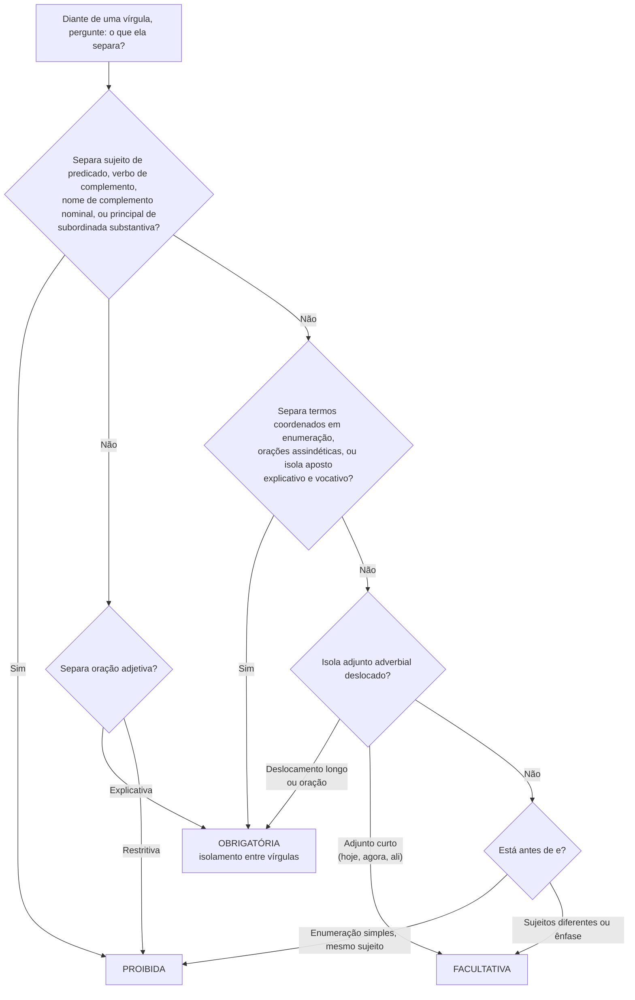

# Pontuação

> [!info] Metadados
> **Disciplina:** Língua Portuguesa
> **Bloco:** 1.1 — Língua Portuguesa (FASE 1 — Fundamentos)
> **Tópico:** 5. Estrutura morfossintática — Pontuação
> **Subtópicos:** Vírgula · Ponto e vírgula · Dois-pontos · Ponto final · Reticências (pontinhos suspensivos) · Aspas e outros sinais
> **Pré-requisitos:** [[Compreensao-e-Interpretacao-de-Textos|Compreensão e interpretação de textos]]; [[Tipos-e-Generos-Textuais|Tipos e gêneros textuais]]; [[Ortografia-Oficial|Ortografia oficial]]; [[Coesao-Textual|Coesão textual]]; [[Classes-de-Palavras|Classes de Palavras]]; [[Sintaxe-da-Oracao|Sintaxe da Oração]]; [[Periodo-Composto|Período Composto]]
> **Cargo:** Analista de TI — Perfil 3 (Desenvolvimento de Software) · DATAPREV 2026
> **Data:** 2026-08-27

---

## 1. A pontuação como organização da leitura

Em toda a sua trajetória até aqui, você aprendeu a analisar a frase por dentro: primeiro as classes de palavras em [[Classes-de-Palavras|Classes de Palavras]], depois os termos da oração em [[Sintaxe-da-Oracao|Sintaxe da Oração]] e, em seguida, o encaixe entre orações no [[Periodo-Composto|Período Composto]]. Chegou o momento de estudar o que regula a **superfície** do texto: os **sinais de pontuação**. A pergunta que abre esta nota é simples, mas decisiva: **se o período composto é a costura de várias orações, o que orienta o leitor sobre onde começa e onde termina cada bloco?**

A resposta é a pontuação. Ela funciona como a *interface* entre a estrutura sintática e a leitura: marca pausas, delimita blocos, separa o que precisa ser separado e junta o que deve permanecer junto. Em termos de engenharia de software, o sinal de pontuação é uma espécie de *contrato de parse*: sem ele, a mesma sequência de palavras pode ser interpretada de maneiras diferentes — e é exatamente isso que a banca explora. Compare: "O analista disse que o sistema está pronto." e "O analista, disse que o sistema está pronto." Na segunda, um par de vírgulas mal posto transformou o sujeito da oração em vocativo ou criou uma pausa incorreta; o leitor tropeça, e o sentido se embaralha. A pontuação errada não é um detalhe estético: é um defeito de comunicação — e, numa prova de concurso, uma alternativa errada inteira.

Há um ponto que liga esta nota às anteriores: quase toda pontuação tem **justificativa sintática**. A vírgula que separa orações coordenadas assindéticas, que isola a adjetiva explicativa ou que marca a elipse do verbo só faz sentido porque você já reconhece essas estruturas. Quando a banca pergunta "justifique a vírgula", ela está pedindo que você **nomeie a função sintática** que o sinal desempenha — o mesmo exercício de análise que você fez nas notas de sintaxe e de período composto, agora com os olhos no texto. Por isso esta nota fecha um ciclo: tudo o que você estudou até aqui será usado, na prova, pela porta da pontuação.

Os sinais previstos na ementa são: vírgula, ponto e vírgula, dois-pontos, ponto final e as **reticências** — os famosos "pontinhos suspensivos". Soma-se a eles um conjunto de sinais que a banca usa nas mesmas questões — **aspas, parênteses e travessão** —, que estudaremos de forma breve, mas com as pegadinhas que costumam derrubar. Comecemos pelo sinal mais cobrado de toda a prova de Língua Portuguesa: a vírgula.

---

## 2. A vírgula: o sinal mais cobrado

A vírgula concentra a maioria das questões de pontuação porque ela é o sinal com **mais funções** e, por consequência, com mais tentações de uso errado. A estratégia de estudo é dupla: saber **quando usar** e saber **quando não usar** — os dois lados da moeda são cobrados, e o segundo é o preferido das pegadinhas.

### 2.1 Quando usar a vírgula

**Primeira função: separar termos coordenados (enumeração).** Quando vários elementos exercem a mesma função sintática e vêm em sequência, a vírgula os separa, deixando claro que cada um é uma unidade: "O sistema **coleta, valida e armazena** os dados." Sem as vírgulas, a frase viraria uma sopa de palavras; com elas, o leitor vê três ações coordenadas — o mesmo encadeamento que você estudou como coordenação em [[Periodo-Composto|Período Composto]].

**Segunda função: isolar o aposto explicativo.** O **aposto explicativo** é o termo que explica ou desenvolve outro, sem restringi-lo — você o estudou em [[Sintaxe-da-Oracao|Sintaxe da Oração]]. Ele vem entre vírgulas (ou entre travessões, ou entre parênteses): "O servidor, **principal componente do ambiente**, caiu durante a madrugada." Retire o aposto e a frase continua íntegra: "O servidor caiu durante a madrugada." É esse teste da retirada que revela o aposto explicativo — e ele sempre pede vírgulas.

**Terceira função: isolar o vocativo.** O **vocativo** é a palavra usada para **chamar** o interlocutor — não faz parte da estrutura sintática da oração, como você viu na nota de sintaxe. Por isso, vem sempre isolado por vírgula (ou entre vírgulas): "**Confira o log, analista.**" / "**Analista, confira o log.**" / "**Confira, analista, o log.**" Nas três posições, o vocativo é marcado pela vírgula — nunca se escreve um vocativo sem ela.

**Quarta função: isolar o adjunto adverbial deslocado.** O **adjunto adverbial** é o termo que indica circunstância (tempo, lugar, causa, modo...). Quando ele aparece na **ordem direta**, no final da oração, normalmente não pede vírgula: "O sistema encerra as sessões **ao final do expediente**." Mas quando é **deslocado** para o início da frase ou aparece intercalado, a vírgula se torna **obrigatória** para marcar a inversão: "**Ao final do expediente,** o sistema encerra as sessões." / "O sistema, **ao final do expediente**, encerra as sessões." A exceção de bolso: adjuntos curtos deslocados — "**Hoje**, o sistema está estável" — admitem a vírgula como **facultativa**, porque são tão curtos que a pausa não muda a leitura.

**Quinta função: separar orações coordenadas assindéticas.** Lembre-se do que você estudou no [[Periodo-Composto|Período Composto]]: as coordenadas **assindéticas** são as que se encadeiam **sem conectivo**, apenas justapostas. Entre elas, a vírgula é o sinal padrão: "O servidor caiu às 14h, **a equipe de suporte foi acionada** às 14h05, **o backup foi restaurado** às 14h20." Três orações independentes, três vírgulas, zero conjunção — é a estrutura típica de registro de incidente.

**Sexta função: introduzir ou separar a oração adjetiva explicativa.** Na nota do período composto você aprendeu a distinção que mais aparece em prova: a **adjetiva restritiva** (sem vírgula) *seleciona* um subgrupo; a **adjetiva explicativa** (entre vírgulas) *comenta* o conjunto todo. A vírgula é o marcador dessa diferença: "Os analistas, **que concluíram o curso**, foram promovidos." (todos concluíram; a oração só informa) — obrigatoriamente com vírgulas. O mesmo par de vírgulas pode **introduzir** a explicativa quando ela vem logo após o núcleo do sujeito. Esse é um dos pontos em que pontuação e análise sintática se encontram: você só acerta a vírgula se souber qual adjetiva está diante de você.

**Sétima função: isolar elementos repetidos ou enumerados (ênfase e detalhamento).** Além da enumeração simples, a vírgula também isola elementos que se repetem para efeito de ênfase: "O sistema trabalhou, **trabalhou**, até que o processamento terminou." E serve para separar cada item de uma **enumeração mais detalhada**, em que cada termo vem expandido: "O contrato previa prazos claros, multas proporcionais, responsabilidades definidas." É a função da enumeração em sua versão mais completa.

**Oitava função: marcar a elipse do verbo (zeugma).** Quando um verbo já expresso na oração anterior **é omitido** na seguinte, a vírgula marca o lugar da omissão: "Os analistas revisaram o código; a gerente, **o relatório**." — entenda-se "a gerente **revisou** o relatório". Esse fenômeno é o **zeugma** (ou elipse do verbo): o verbo é um só, e a vírgula ocupa o seu posto nas ocorrências seguintes. A banca adora cobrar essa justificativa — não é "pausa para respirar", é **elipse verbal**.

> [!note] O teste que separa as funções
> Ao justificar qualquer vírgula, pergunte: ela **separa termos coordenados** (enumeração), **isola aposto/vocativo/adjunto deslocado**, **marca a elipse do verbo** ou **separa orações** (assindéticas e adjetivas explicativas)? Se nenhuma dessas funções explicar a vírgula, o mais provável é que ela seja **proibida** — e aí você está diante de uma pegadinha de "vírgula incorreta".

Antes de passar às proibições, delimite a **terceira zona** — a da vírgula **facultativa**. Ela é menor do que parece e costuma resumir-se a dois casos: o **adjunto adverbial curto deslocado** ("Hoje, o sistema atualizou os certificados." e "Hoje o sistema atualizou os certificados." — ambos corretos) e o **"e" com sujeitos diferentes** ("O sistema registrou o acesso, e o auditor acompanhou o movimento." e a versão sem vírgula — ambos corretos). Nesses casos, a banca considera **as duas leituras válidas** e costuma marcar como errada apenas a alternativa que afirma ser **obrigatória** a vírgula (ou obrigatória a ausência dela). Nas demais situações — enumeradas abaixo como proibições e, acima, como funções — não há zona cinzenta: ou é obrigatória, ou é proibida.

### 2.2 Quando NÃO usar a vírgula: as vírgulas proibidas

A face mais cobrada em provas é o **uso incorreto**: a banca escreve uma frase com vírgula mal colocada e pergunta onde está o erro ou se a pontuação está correta. As proibições clássicas formam um conjunto pequeno e memorizável.

**Proibição 1: não separar sujeito de predicado.** Entre quem pratica a ação e a ação em si, não há vírgula: "O sistema, processou os dados." — **errado**. O sujeito "o sistema" está sendo cortado do seu verbo por um par de vírgulas que não tem função nenhuma. Se a frase tem "sujeito + verbo" na ordem direta, vírgula nesse ponto é sempre erro — a menos que um termo intercalado (aposto, adjunto deslocado, oração explicativa) esteja corretamente isolado entre vírgulas, e aí as vírgulas pertencem a ele, não à fronteira sujeito-verbo.

**Proibição 2: não separar verbo de complemento.** O verbo e o seu objeto formam uma unidade; cortar essa ligação com vírgula é erro: "A equipe entregou, o relatório." — **errado**. O verbo "entregou" (transitivo direto) pede o objeto "o relatório" na mesma estrutura; a vírgula interrompe a transitividade que você estudou na sintaxe.

**Proibição 3: não separar nome de complemento nominal.** A mesma lógica vale para o nome e o seu complemento: "O analista tem certeza, da correção." — **errado**. O complemento nominal "da correção" completa o sentido do substantivo "certeza"; não há pausa entre eles na ordem direta.

**Proibição 4: não separar oração principal da subordinada substantiva.** No [[Periodo-Composto|Período Composto]], você viu que a oração substantiva exerce função sintática dentro da principal (sujeito, objeto, complemento...). Entre as duas, **não** se usa vírgula: "É necessário, que a equipe revise o código." — **errado**. "É necessário que a equipe revise o código." — correto. A pegadinha é tentadora porque a pausa "parece natural" depois de "necessário", mas a oração substantiva é **termo integrante** da principal, e termo integrante não se separa por vírgula.

**Proibição 5: não usar vírgula antes do "e" em enumeração simples.** Quando o "e" liga o último termo a uma sequência de termos coordenados no mesmo nível (mesmo sujeito), a vírgula é **proibida** antes dele: "O sistema coleta, valida **e** armazena os dados." — correto; "O sistema coleta, valida, **e** armazena os dados." — **errado**. A vírgula final antes do "e" quebra a enumeração justamente onde ela deveria se fechar.

A proibição n.º 5 tem exceções que a banca cobra com frequência:

- **Sujeitos diferentes**: quando o "e" liga orações com sujeitos distintos, a vírgula é **facultativa** (ou mesmo recomendada, para clareza): "O sistema registrou o acesso, e o auditor acompanhou o movimento." — correto. Como cada oração tem seu sujeito, a pausa não confunde a enumeração.
- **Efeito de ênfase ou repetição do "e"**: "O sistema falhou, e falhou feio." — a vírgula é aceita para reforçar.
- **Redundância enfática com repetição da própria conjunção**: "Choveu, e ventou, e o sistema caiu." — o "e" repetido admite vírgulas, porque cada oração é um bloco enfático.

> [!warning] O teste de eliminação das vírgulas proibidas
> Diante de uma vírgula suspeita, pergunte em cadeia: (1) ela separa **sujeito de predicado**? (2) separa **verbo de complemento** ou **nome de complemento nominal**? (3) separa **principal de subordinada substantiva**? (4) está **antes de "e"** numa enumeração com o mesmo sujeito? Se a resposta for sim a qualquer uma delas, a vírgula é **proibida** — e a alternativa que "corrige" essa vírgula é a certa.

---

## 3. Ponto e vírgula (;)

O **ponto e vírgula** é o sinal do meio-termo: ele separa **mais do que a vírgula** e **menos do que o ponto final**. É o que a tradição descreve como o sinal usado onde o ponto final "separaria demais" e a vírgula "separaria de menos". As três situações clássicas:

**1. Separar itens de enumerações longas, sobretudo quando os itens já contêm vírgulas internas.** Quando cada item da lista é complexo e já usa vírgula interna, o ponto e vírgula evita a confusão de "vírgula dentro de vírgula": "Os requisitos do sistema estabeleciam: prazos claros, com tolerância de um dia; multas proporcionais, limitadas a 10%; responsabilidades definidas, por faixa de severidade." Sem os pontos e vírgulas, os limites entre os itens sumiriam.

**2. Separar orações coordenadas sem conectivo (assindéticas), especialmente quando são longas.** Lembre-se das assindéticas da nota de período composto: entre elas, a vírgula é o padrão. Mas quando as orações são extensas, o ponto e vírgula dá o respiro que a vírgula não dá: "A equipe atualizou os certificados de segurança; o banco de dados passou por nova indexação; o ambiente foi submetido a testes de carga." Três orações independentes, com pausa forte entre elas — ponto final separaria demais (quebraria o bloco), vírgula separaria de menos (as frases ficariam compridas demais).

**3. Contrapor orações (oposição sem conectivo ou com adversativa).** O ponto e vírgula é a ponte preferida para marcar **contraste** entre duas orações: "Alguns analistas defendem a automação total; outros, apenas dos testes repetitivos." Observe que aqui, na segunda oração, a vírgula ainda aparece **marcando a elipse do verbo** ("defendem") — a combinação ponto e vírgula + vírgula é a assinatura clássica do zeugma em contraposições.

A banca quase nunca pergunta "o que é ponto e vírgula?" — ela pergunta **qual pontuação é adequada** para um trecho. Nesses casos, o raciocínio é: há hierarquia de pausas? Se a estrutura pede um bloco com pausa média (nem separação total, nem mera vírgula), o sinal é o ponto e vírgula. É o mesmo princípio de parser: você escolhe o delimitador pelo nível do bloco que precisa isolar.

Um uso que merece destaque é o **ponto e vírgula diante de conectivos conclusivos e adversativos**. Quando a conjunção vem depois de uma pausa média, mantém-se a vírgula **após** o conectivo, mas a pausa **anterior** a ele pode ser ponto e vírgula: "A base estava inconsistente; **portanto**, o relatório falhou." / "O sistema é robusto; **no entanto**, exige manutenção contínua." Repare que, aqui, o ponto e vírgula reforça a fronteira entre os dois enunciados coordenados que você estudou no [[Periodo-Composto|Período Composto]] — especialmente quando o primeiro é longo. A pegadinha inversa: usar **ponto final** nesse lugar quando as duas orações formam um bloco único de raciocínio — "A base estava inconsistente. Portanto, o relatório falhou." é aceitável, mas menos preciso; a banca, em questões de reescrita, costuma preferir a pausa média quando o texto apresenta as orações como um par.

---

## 4. Dois-pontos (:)

Os **dois-pontos** têm uma natureza diferente da vírgula e do ponto e vírgula: eles não separam pausas — eles **anunciam**. O que vem depois deles é o conteúdo anunciado. As quatro funções clássicas:

**1. Introduzir citação:** "O manual do sistema afirma: 'execute os testes antes de cada implante de versão.'" Os dois-pontos são a porta de entrada do discurso citado — a mesma estrutura que você verá, na fala, com o travessão.

**2. Introduzir enumeração:** "O sistema armazena três tipos de dados: numéricos, alfanuméricos e binários." Aqui os dois-pontos anunciam a lista — e a enumeração, depois deles, dispensa a vírgula final diante do "e" (lembra da regra da enumeração? ela vale para a lista completa, que agora vem anunciada).

**3. Introduzir explicação ou esclarecimento:** "O sistema apresentou lentidão por um motivo simples: o disco estava próximo da capacidade máxima." Depois dos dois-pontos vem a explicação, o detalhamento — a frase anterior fica suspensa esperando o esclarecimento.

**4. Introduzir fala (em discurso direto):** "O analista respondeu: 'já identifiquei a causa.'" Note o uso **combinado** com aspas (na citação direta) ou com travessão (na fala narrativa): "O analista respondeu: — Já identifiquei a causa." — a combinação dois-pontos + travessão também é consagrada pela norma.

Há uma ponte direta com o [[Periodo-Composto|Período Composto]]: na nota anterior, você viu a **apositiva** ("A equipe pediu uma coisa: que o prazo fosse prorrogado.") — o aposto e a oração apositiva, depois de um "termo-síntese", vêm introduzidos por dois-pontos. Quando a banca pergunta a função dos dois-pontos nesse caso, a resposta é "introduzir aposto" ou "introduzir oração subordinada substantiva apositiva".

A pegadinha mais comum com dois-pontos é o **uso indevido**: colocar dois-pontos onde não há anúncio ("O sistema caiu: porque o disco encheu." — o "porque" já conecta a causa; os dois-pontos sobram). Se o que segue já está conectado por conjunção, os dois-pontos são redundantes.

---

## 5. Ponto final (.)

O **ponto final** é o sinal de encerramento por excelência: delimita o **período**, indicando que a estrutura sintática terminou. Depois dele, a próxima palavra começa com maiúscula — o par *ponto final + maiúscula* é o que fecha um bloco completo de sentido. Na leitura, ele impõe a pausa máxima; na escrita, ele organiza o texto em unidades autônomas.

Traduzindo em linguagem de processamento: a vírgula separa *tokens* dentro de uma instrução, o ponto e vírgula separa instruções, e o ponto final fecha a *instrução completa* — uma nova estrutura sintática se inicia.

O ponto também cumpre a função auxiliar de **marcar abreviaturas**: "Sr.", "pág.", "art.", "etc.", "Dr.". Dois cuidados de prova:

- A abreviatura **dispensa o acréscimo de um segundo ponto** quando encerra a frase: "Os dados estão no arquivo anexo, etc." — um ponto só, porque o ponto da abreviatura já cumpre a função de ponto final.
- Em siglas e símbolos consagrados, o ponto de abreviatura costuma ser omitido: "SP", "km", "kg", "TI" — não se escreve "T.I." nem "P. I." no padrão atual dos manuais de redação.

> [!tip] Ponto final, ponto e vírgula e vírgula: a escala de pausas
> **Vírgula** < **ponto e vírgula** < **ponto final**. A prova cobra a escolha certa na escala: enumeração complexa com vírgulas internas pede ponto e vírgula; bloco independente completo pede ponto final; termos coordenados simples pedem vírgula. Antes de marcar, pergunte: qual é o nível de separação que a estrutura exige?

---

## 6. Reticências — os pontinhos suspensivos (...)

As **reticências** (três pontos seguidos), que a gramática escolar chama de "pontinhos suspensivos", marcam uma **interrupção** no fluxo do enunciado. Elas têm quatro valores principais:

**1. Suspensão do pensamento (deixar a frase em aberto):** "O sistema travou novamente; a equipe tentou reiniciar, tentou restaurar o último backup..." — a frase fica suspensa porque a sequência de tentativas não precisa ser completada.

**2. Hesitação:** "Eu, bem... acho que o deploy pode ser adiado." — as reticências registram a dúvida, a pausa de quem procura as palavras.

**3. Interrupção do enunciado:** "O analista começou a explicar o incidente, mas..." — a fala é cortada; o leitor fica com a interrupção.

**4. Subentendido (deixar o leitor completar):** "Garbage in, garbage out..." — as reticências convidam o leitor a completar o sentido implícito, criando o efeito de "o resto você já sabe".

O uso com **aspas** merece atenção: quando a citação é **suprimida parcialmente** — você corta um trecho do meio da citação — usa-se reticências **entre colchetes**: "[...]". Esse padrão é obrigatório em textos técnicos e jurídicos, porque indica que houve supressão *intencional* e *marcada*. Já as reticências **sem colchetes** ao fim de uma fala indicam simplesmente que o enunciado foi interrompido. A distinção é fina e a banca gosta dela: **colchetes = supressão; sem colchetes = interrupção**.

Há ainda a **combinação com outros sinais**: quando a suspensão coincide com uma pergunta ou uma exclamação, a norma consagra a junção — "Você verificou o log?..." e "Que falha inesperada!..." — formando os "quatro pontos" (reticências + interrogação ou exclamação). A banca testa isso em questões de **reescrita** e em versões modernizadas de texto: trocar "?..." por "..." muda o valor — perde-se a pergunta; trocar por "?." (interrogação + ponto final) é construção inexistente nesse contexto.

Uma pegadinha de valor: as reticências **não podem ser usadas como substitutas genéricas de pontuação correta**. "O sistema apresentou falhas, lentidão, perda de dados..." está certo; "O sistema, à noite..." como mera imitação de pausa, sem valor de suspensão, é erro de pontuação — a vírgula e o ponto têm funções próprias que as reticências não devem roubar.

---

## 7. Aspas, parênteses e travessão

### 7.1 Aspas (" ")

As aspas cumprem quatro funções que a prova pede:

- **Citação literal:** "O edital afirma: 'o candidato deverá comprovar experiência em desenvolvimento.'" — aqui entram em jogo os dois-pontos (anunciam) e as aspas (delimitam a citação).
- **Estrangeirismo ou neologismo:** "O termo 'deploy' se consolidou no vocabulário de TI." / "O sistema entrou em 'produção'."
- **Sentido figurado, irônico ou especial:** "O 'plano perfeito' do fornecedor falhou no primeiro teste." — as aspas sinalizam que a palavra deve ser lida com reserva.
- **Título de obra, capítulo, artigo:** "Leia o capítulo 'Segurança' antes de prosseguir."

Um caso adicional, muito comum em textos de TI: as aspas também **destacam uma palavra como termo** (uso metalinguístico) — "A palavra 'deploy' é um anglicismo incorporado." — e, quando a palavra entre aspas **encerra a frase**, a posição do ponto final depende da natureza da citação: se as aspas envolvem uma **citação completa**, o ponto fica **dentro** delas ("Terminei a análise. 'O sistema está estável.'"); se envolvem apenas **um trecho**, o ponto final da frase fica **fora** ("A análise terminou com a garantia de que 'o sistema está estável'.") O detalhe é sutil, e as bancas o cobram em questões de reescrita: no segundo caso, o ponto do trecho citado desaparece e permanece apenas o ponto da frase maior.

A regra de ouro do **encaixe**: se um trecho **já está entre aspas** e precisa conter outra citação, usa-se **aspas simples**: "O analista perguntou: 'O manual diz que devemos "sempre validar a origem do dado"?'" — aspas duplas por fora, aspas simples por dentro.

### 7.2 Parênteses ( )

Os **parênteses** isolam uma informação **acessória** — uma observação, uma data, um exemplo, uma nota explicativa — que pode ser retirada sem prejuízo do sentido: "O certificado digital (validado em 2026) foi renovado." Eles cumprem função semelhante à da vírgula e do travessão, mas com um grau maior de afastamento: a vírgula *integra* mais a intercalação ao fluxo; os parênteses *destacam* a informação como comentário à parte.

A pegadinha clássica dos parênteses: **não se usa vírgula antes do parêntese de abertura**. Compare: "A equipe, (responsável pelo deploy) atuou com agilidade." — **errado**, porque a vírgula e o parêntese disputam a mesma função de isolar o bloco. O correto é "A equipe (responsável pelo deploy) atuou com agilidade." — escolha **um** mecanismo de isolamento: vírgulas, travessões ou parênteses, nunca vírgula seguida de abre-parênteses.

### 7.3 Travessão (—)

O **travessão** tem dois usos centrais:

**1. Introduzir a fala (discurso direto):** "— O sistema caiu às 14h — informou o analista." No texto narrativo, o travessão substitui os dois-pontos e as aspas na marcação do diálogo.

**2. Isolar termos intercalados — com a mesma força da vírgula dupla, mas com mais destaque:** "O servidor — principal componente do ambiente — caiu durante a madrugada." Aqui o travessão ocupa o lugar das vírgulas do aposto explicativo. A ordem de "intensidade" de isolamento entre os sinais é: **vírgula < travessão < parênteses** — a vírgula integra, o travessão destaca, os parênteses afastam.

A distinção travessão × vírgula × dois-pontos aparece quando a banca pergunta **qual sinal substituir**: se o trecho **introduz** algo (citação, fala, explicação, enumeração), o sinal é **dois-pontos**; se o trecho **isola** uma intercalação, o sinal é **vírgula ou travessão** (a dupla de intercalação). Em "Ele afirmou que havia uma falha: o token expirava em minutos", os dois-pontos introduzem a explicação; em "Ele afirmou — e todos concordaram — que havia uma falha", os travessões isolam um comentário do narrador; em "Ele afirmou que havia uma falha, o token expirava em minutos", a vírgula apenas separa as duas orações assindéticas. O mesmo verbo "afirmou", três sinais, três funções diferentes.

No discurso direto, os **dois-pontos** e o **travessão** também se combinam: "O operador confirmou: — O backup foi concluído." Aqui os dois-pontos **anunciam** a fala e o travessão a **marca** — construção consagrada, sobretudo em textos jornalísticos e literários. A contra-regra que a banca martela: **não se coloca vírgula depois do travessão que abre a fala** — "—, O backup foi concluído" é erro; e, quando o travessão apenas isola (sem fala), ele vem **em par** (" — ... — "), nunca sozinho no meio da frase.

> [!warning] A pegadinha do isolamento duplo
> Não acumule sinais que exercem a mesma função: "A equipe, (responsável pelo deploy)" e "A equipe —, (responsável)" são erros do mesmo tipo. Cada bloco de isolamento é marcado por **um** mecanismo: duas vírgulas, dois travessões ou um par de parênteses. A banca coloca o par errado junto ("a vírgula do aposto + os travessões da intercalação") para ver se você identifica a redundância.

---

## 8. Tabelas-resumo

### 8.1 A vírgula: quando usar × quando não usar

| VÍRGULA — USAR (obrigatória) | Exemplo |
|---|---|
| Separar termos coordenados (enumeração) | O sistema coleta, valida e armazena os dados. |
| Isolar aposto explicativo | O servidor, principal componente do ambiente, caiu. |
| Isolar vocativo | Confira o log, analista. |
| Isolar adjunto adverbial deslocado | Ao final do expediente, o sistema encerra as sessões. |
| Separar orações coordenadas assindéticas | O servidor caiu, a equipe agiu, o backup foi restaurado. |
| Introduzir/separar adjetiva explicativa | Os analistas, que concluíram o curso, foram promovidos. |
| Isolar elementos repetidos/enumerados | O sistema trabalhou, trabalhou, até processar. |
| Marcar elipse do verbo (zeugma) | Os analistas revisaram o código; a gerente, o relatório. |
| Antes de "e" com sujeitos diferentes (facultativa) | O sistema registrou o acesso, e o auditor acompanhou. |

| VÍRGULA — PROIBIDA (não usar) | Exemplo incorreto |
|---|---|
| Entre sujeito e predicado | O sistema, processou os dados. |
| Entre verbo e objeto | A equipe entregou, o relatório. |
| Entre nome e complemento nominal | O analista tem certeza, da correção. |
| Entre principal e subordinada substantiva | É necessário, que a equipe revise o código. |
| Antes de "e" em enumeração simples (mesmo sujeito) | O sistema coleta, valida, e armazena os dados. |

### 8.2 Função de cada sinal

| Sinal | Função central | Exemplo de uso |
|---|---|---|
| **Vírgula ( , )** | Separar termos/orações; isolar apostos, vocativos, adjuntos deslocados, zeugma | O sistema coleta, valida e armazena os dados. |
| **Ponto e vírgula ( ; )** | Pausa média: enumerações com vírgulas internas, assindéticas longas, contraposição | Prazos claros, com tolerância; multas, limitadas; responsabilidades, definidas. |
| **Dois-pontos ( : )** | Anunciar: citação, enumeração, explicação, fala | O sistema armazena três tipos de dados: numéricos, alfanuméricos e binários. |
| **Ponto final ( . )** | Encerrar o período; marcar abreviaturas | O servidor reiniciou. (e: "Sr.", "pág.", "etc.") |
| **Reticências ( ... )** | Suspensão, hesitação, interrupção, subentendido | O analista começou a explicar, mas... |
| **Aspas ( " " )** | Citar; marcar estrangeirismo, ironia, sentido especial | O termo "deploy" virou rotina. |
| **Parênteses ( ( ) )** | Isolar informação acessória (comentário à parte) | O certificado (renovado em 2026) está válido. |
| **Travessão ( — )** | Introduzir fala; isolar com destaque | — O sistema caiu às 14h — informou o analista. |

---

## 9. Fluxograma: a vírgula é obrigatória, facultativa ou proibida?

Nem sempre a vírgula é obrigatória ou proibida — existe a zona **facultativa** (adjunto curto deslocado, "e" com sujeitos diferentes). O fluxograma abaixo organiza a decisão na ordem em que você deve aplicá-la na prova: primeiro as **proibições** absolutas, depois as **funções que obrigam**, e por fim os casos **facultativos**.

> [!note] Como usar o fluxograma na prova
> A **proibição** vem sempre primeiro: se a vírgula corta sujeito de predicado, verbo de complemento, nome de complemento, principal de substantiva ou o "e" de enumeração simples, não há discussão — o sinal está errado. Só depois de descartar as proibições você pergunta se a vírgula tem **função legítima** (enumeração, isolamento, elipse) — aí é obrigatória — ou se caiu na zona **facultativa** (adjunto curto, "e" com sujeitos diferentes). A alternativa que descreve o caso correto é a vencedora.

Os três resultados terminais do fluxograma correspondem às três cobranças típicas. Quando a resposta é **OBRIGATÓRIA**, a banca pergunta a **justificativa** ("por que a vírgula foi usada?") — exige-se o nome da função. Quando é **PROIBIDA**, a banca pergunta onde está o **erro** — e a alternativa descreve a estrutura cortada (sujeito × predicado, verbo × complemento...). Quando é **FACULTATIVA**, a banca testa se você sabe que **as duas formas são válidas** — a alternativa extremada ("é obrigatório usar" / "é obrigatório omitir") é a errada.

---

## 10. Estratégia de prova

A banca cobra pontuação de três formas típicas: (1) questão de **certo/errado** sobre uma frase com pontuação (às vezes integrada a um texto maior), em que o erro está em uma **vírgula proibida**; (2) questão de **reescrita** ou **substituição** de sinais, pedindo "mantém-se o sentido" — aqui o que importa é a **função do sinal**; (3) questão de **justificativa**, perguntando por que a vírgula foi usada — resposta sempre em termos **sintáticos** (aposto, vocativo, adjunto deslocado, enumeração, elipse, explicativa), nunca "para dar pausa" ou "porque o texto fica melhor".

### 10.1 Palavras-chave do enunciado

| Expressão no enunciado | O que ela sinaliza |
|---|---|
| "vírgula incorreta" / "erro de pontuação" | Procurar as **proibições**: sujeito × predicado, verbo × complemento, antes de "e", substantiva isolada |
| "justificativa da vírgula" | Nomear a **função sintática**: enumeração, aposto, vocativo, adjunto deslocado, elipse, explicativa |
| "aposto" | **Explicativo** (entre vírgulas) × **especificativo** (sem vírgula) |
| "vocativo" | Termo de chamamento — **sempre** isolado por vírgula |
| "adjunto adverbial deslocado" | Início/intercalado = vírgula; ordem direta no fim = sem vírgula; curto no início = facultativa |
| "elipse" / "zeugma" | Verbo omitido; a vírgula **marca o lugar** da omissão |
| "oração adjetiva explicativa" | Entre vírgulas; pode ser retirada sem mudança essencial |
| "reticências" / "pontinhos suspensivos" | Suspensão, hesitação, interrupção, subentendido; com colchetes = supressão de citação |
| "mantém-se o sentido" | Substituir sinal apenas se a **função** for equivalente (vírgula ⇄ travessão no isolamento) |
| "dois-pontos" | Função de **anunciar**: citação, enumeração, explicação, fala, aposto |

### 10.2 As pegadinhas no padrão "armadilha → raciocínio errado → proteção"

> [!warning] Pegadinha 1 — a vírgula que separa sujeito de predicado
> **A armadilha:** "O sistema, processou os dados." — a alternativa afirma que a vírgula está correta porque marca "uma pausa para respirar".
> **O raciocínio errado:** "vírgula é pausa; toda pausa merece vírgula."
> **Como se proteger:** a pausa de leitura não coincide com a regra gramatical. A vírgula entre **sujeito e predicado** na ordem direta é **proibida**, mesmo que a frase "peça" uma respirada. Aplique o teste: retire a vírgula e veja se a estrutura se completa sem ela — se sim, a vírgula não tinha função e é erro.

> [!warning] Pegadinha 2 — a vírgula proibida antes do "e"
> **A armadilha:** "O sistema coleta, valida, e armazena os dados." — a alternativa diz que a pontuação está correta porque "a vírgula antes do 'e' dá ênfase".
> **O raciocínio errado:** "vírgula antes de 'e' é sempre aceitável."
> **Como se proteger:** na **enumeração simples**, com o mesmo sujeito e termos da mesma função, o "e" é o **fechamento** da lista — vírgula antes dele é proibida. A vírgula só é permitida com **sujeitos diferentes** ("O sistema registrou o acesso, e o auditor acompanhou") ou em efeito enfático deliberado — e a banca marca essa distinção nas alternativas. Se houver "sujeito único + três verbos + e", a forma correta é "coleta, valida e armazena".

> [!warning] Pegadinha 3 — aposto explicativo × aposto especificativo
> **A armadilha:** "O analista João validou os dados." — a alternativa defende que "João" deveria vir entre vírgulas, porque "aposto sempre pede vírgula".
> **O raciocínio errado:** "todo aposto é explicativo e vem isolado."
> **Como se proteger:** o **aposto especificativo** — o nome próprio que **particulariza** o termo anterior sem explicá-lo — **não** recebe vírgula: "O analista João" identifica qual analista. Já o **explicativo** — que acrescenta uma informação sobre um termo já plenamente identificado — vem entre vírgulas: "O analista, o mais experiente da equipe, validou os dados." O teste: se a oração pode ser retirada sem perder a identificação, é explicativo (vírgulas); se a retirada deixa o termo vago, é especificativo (sem vírgula).

> [!warning] Pegadinha 4 — a dupla "não só... mas também"
> **A armadilha:** "O sistema ganhou segurança não só com o patch, mas também com os novos testes." — a alternativa coloca vírgula **depois de "não só"**: "O sistema ganhou segurança, não só com o patch, mas também com os novos testes."
> **O raciocínio errado:** "'não só' é um adjunto que merece isolamento, como qualquer termo deslocado."
> **Como se proteger:** no correlativo **"não só... mas também"**, a vírgula pertence ao **segundo polo** da dupla: usa-se (normalmente) antes de "mas também", e **não** se isola o "não só". Se você precisa retirar a vírgula ou mover o isolamento, leia em voz alta: a pausa natural está entre o primeiro polo ("não só com o patch") e o segundo ("mas também com os novos testes") — é ali que a vírgula fica, e repare que o valor é de **adição** (como você viu no [[Periodo-Composto|Período Composto]]), não de oposição.

> [!warning] Pegadinha 5 — a vírgula que muda o sentido
> **A armadilha:** "Não, quero café." e "Não quero café." — a alternativa afirma que as duas frases têm o mesmo sentido.
> **O raciocínio errado:** "a vírgula é só pausa; o conteúdo é o mesmo."
> **Como se proteger:** na primeira, a vírgula isola a palavra "Não" como **resposta independente a uma pergunta** — o sentido é "Sim, quero café" (a negação nega o convite anterior, mas o pedido é afirmativo). Na segunda, o "não" **nega o verbo** — o sentido é recusa total. A vírgula separa o advérbio de negação da oração e muda a leitura completa: *pausa de isolamento = valor diferente*. Esse é o padrão mais didático do assunto: **a pontuação constrói sentido**, não apenas organiza.

> [!warning] Pegadinha 6 — o isolamento indevido da subordinada substantiva
> **A armadilha:** "É necessário, que a equipe revise o código." — a alternativa trata a vírgula como correta porque "a oração adjetiva explicativa vem entre vírgulas".
> **O raciocínio errado:** "toda oração que vem depois de um verbo e começa com 'que' pode ser isolada."
> **Como se proteger:** a oração introduzida pelo "que" **integrante** ("é necessário **que** a equipe revise") é **substantiva subjetiva** — exerce função de termo integrante dentro da principal (retome a troca por "isso": "é necessário isso"). Termo integrante **não** se separa por vírgula: "É necessário que a equipe revise o código." Só a **adjetiva explicativa** — que caracteriza um substantivo e pode ser retirada — vem entre vírgulas ("A equipe, que revisou o código, confirmou"). Identifique a família da oração antes de decidir sobre a vírgula: substantiva = sem vírgula; adjetiva explicativa = com vírgulas.

> [!note] Método de resolução em três passos
> **(1)** Isole o trecho pontuado e identifique a **estrutura**: há um termo, uma oração, uma elipse? **(2)** Aplique o teste das **proibições** (sujeito × predicado, verbo × complemento, nome × complemento, principal × substantiva, "e" de enumeração) — se alguma bater, é erro. **(3)** Se não houver proibição, nomeie a **função** (enumeração, aposto explicativo, vocativo, adjunto deslocado, zeugma, explicativa) e confirme se a alternativa fala dessa função. Respostas que citam "pausa respiratória", "estilo do autor" ou "melhora o texto" sem função sintática são erradas por natureza.

---

## 11. Revisão rápida

| Sinal | Função | Como reconhecer | A pegadinha que mais derruba |
|---|---|---|---|
| **Vírgula** | Separar termos/orações; isolar apostos, vocativos, adjuntos deslocados; marcar elipse | Função sintática identificável | Separar sujeito de predicado; vírgula antes de "e" na enumeração |
| **Ponto e vírgula** | Pausa média: enumeração com vírgula interna, assindéticas longas, contraposição | Bloco que nem o ponto (separa demais) nem a vírgula (separa de menos) | Usar onde só a vírgula bastaria, ou vice-versa |
| **Dois-pontos** | Anunciar citação, enumeração, explicação, fala | O que vem depois é o conteúdo anunciado | Usar onde já há conjunção conectando ("caiu: porque...") |
| **Ponto final** | Encerrar período; abreviaturas | Novo período, maiúscula seguinte | Duplicar ponto em abreviatura no fim da frase ("etc..") |
| **Reticências** | Suspensão, hesitação, interrupção, subentendido | Três pontos; frase em aberto | Esquecer os colchetes na supressão de citação ("[...]") |
| **Aspas** | Citar; estrangeirismo; ironia | Delimita o trecho de exceção | Esquecer aspas simples dentro de aspas duplas |
| **Parênteses** | Isolar comentário à parte | Informação retirável | Vírgula antes do abre-parênteses |
| **Travessão** | Introduzir fala; isolar com destaque | Substitui vírgula dupla ou dois-pontos | Trocar isolamento (travessão) por introdução (dois-pontos) |

Antes de fechar, um teste de autoconfiança: explique por que cada vírgula das frases abaixo existe — "O sistema coleta, valida e armazena os dados" (**enumeração**, e a última vírgula não existe porque o "e" fecha a lista); "Ao final do expediente, o sistema encerra as sessões" (**adjunto adverbial deslocado**); "Os analistas, que concluíram o curso, foram promovidos" (**adjetiva explicativa**); "Os analistas revisaram o código; a gerente, o relatório" (**zeugma** — a vírgula marca a elipse do verbo). Se você nomeou essas quatro funções sem hesitar, o núcleo da pontuação está dominado.

> [!tip] As três ideias que resumem a nota
> **1.** **Pontuação é sintaxe na superfície.** Toda vírgula justa tem função: separar termos ou orações coordenados, isolar apostos/vocativos/adjuntos deslocados, isolar explicativas, marcar elipse, anunciar algo. A pausa de leitura sem função sintática é erro — e é o que a banca chama de "vírgula incorreta".
> **2.** **Existe uma escala de pausas e uma escala de isolamento.** Vírgula < ponto e vírgula < ponto final; e vírgula < travessão < parênteses no isolamento. Escolher o sinal certo é escolher o nível certo de separação — dois-pontos não separam pausas, eles anunciam.
> **3.** **A vírgula constrói sentido.** "Não, quero café" é afirmação; "Não quero café" é recusa. Restritiva sem vírgula seleciona; explicativa com vírgula comenta. As proibições (sujeito × predicado, verbo × complemento, antes do "e") são o primeiro filtro; as funções legítimas, o segundo. Esse domínio fecha o ciclo do tópico 5 e prepara o terreno para os próximos temas da estrutura morfossintática: concordância, regência e crase, e colocação pronominal — que reaproveitarão, o tempo todo, a análise sintática que você já domina.