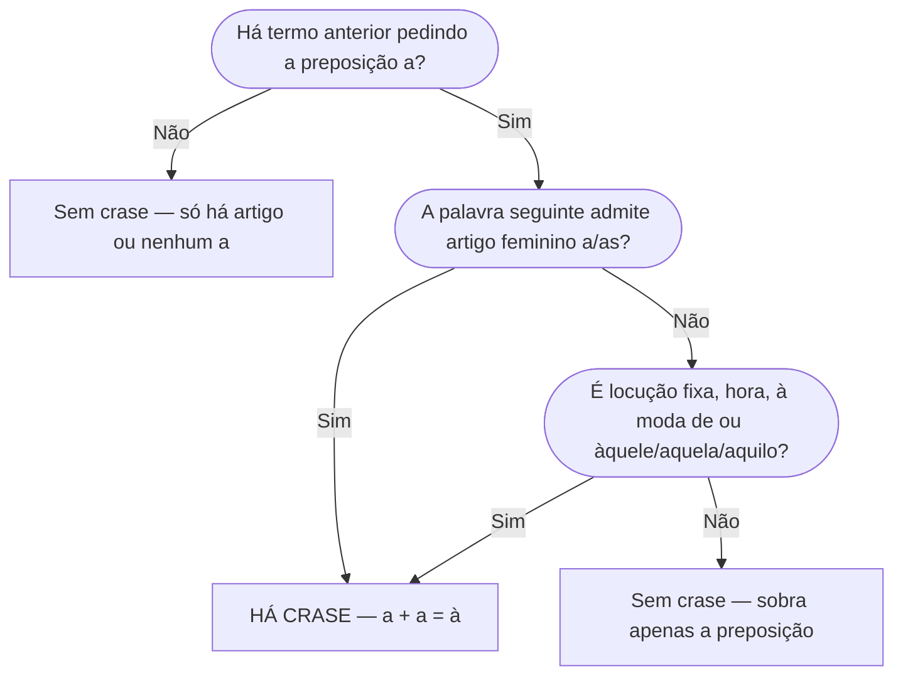

# Regência e Crase

> [!info] Metadados
> **Disciplina:** Língua Portuguesa
> **Bloco:** 1.1 — Língua Portuguesa (FASE 1 — Fundamentos)
> **Tópico:** 5. Estrutura morfossintática — Regência e crase
> **Subtópicos:** Regência verbal · Regência nominal · Crase: regras e exceções
> **Pré-requisitos:** [[Compreensao-e-Interpretacao-de-Textos|Compreensão e interpretação de textos]]; [[Tipos-e-Generos-Textuais|Tipos e gêneros textuais]]; [[Ortografia-Oficial|Ortografia oficial]]; [[Coesao-Textual|Coesão textual]]; [[Classes-de-Palavras|Classes de Palavras]]; [[Sintaxe-da-Oracao|Sintaxe da Oração]]
> **Cargo:** Analista de TI — Perfil 3 (Desenvolvimento de Software) · DATAPREV 2026
> **Data:** 2026-08-27

## 1. A promessa que esta nota cumpre

Na nota de [[Ortografia-Oficial|Ortografia oficial]], você conheceu o acento grave ( ` ) e a imagem da crase como **fusão de dois "a"** — "Vou à escola" seria, na origem, "Vou a a escola", com os dois "a" colados. Naquele momento, o estudo ficou no nível do sinal: reconhecer o acento, saber onde ele costuma aparecer (horas, locuções, "àquele", "à moda de") e usar o macete da troca pelo masculino. E a própria nota fez uma promessa: **as regras completas da crase — quando há e quando não há o segundo "a", as exceções diante de palavras masculinas, de verbos e de pronomes, e os casos ligados à regência — seriam estudadas neste tópico de estrutura morfossintática**. O mesmo fio ficou em aberto quando o bloco de coesão estudou os conectores: expressões como "à medida que" e "à procura de" atravessaram o texto sem aprofundamento.

Esta nota fecha essas duas pendências. E ela faz isso em duas metades que se completam: primeiro a **regência** — a lógica que decide qual preposição um verbo ou um nome exige; depois a **crase** — a marca da fusão dessa preposição "a" com o artigo "a" (ou com o "a" inicial de "aquele", "aquela", "aquilo"). Se a regência é a pergunta "qual preposição?", a crase é a pergunta "essa preposição, sendo 'a', funde-se com o artigo?". Vamos por partes — porque a banca de concurso trata exatamente assim: primeiro a preposição certa, depois o acento.

Por que este assunto merece atenção especial no seu edital? Porque a ementa do bloco de Língua Portuguesa aponta as duas frentes — "Regência verbal e nominal" e "Crase: regras e exceções" — como alvos frequentes de "pegadinhas" (a própria ementa diz isso na observação pedagógica do tópico), e porque a estrutura morfossintática, mais do que decorar regras, cobra a **análise da frase**: identificar o regente, escolher a preposição, aplicar o acento. Para o Analista de TI, essa habilidade aparece também na prática: escrever documentação, relatórios de incidente e e-mails normativos sem deslizes de regência é parte do perfil profissional.

---

# PARTE A — REGÊNCIA

## 2. O que é regência

**Regência** é a relação de **dependência** entre dois termos da frase: um termo **regente** (verbo ou nome) exige que o termo **regido** venha introduzido por determinada **preposição**. Pense num contrato de API: o endpoint "exige" certos parâmetros para funcionar. Na língua, o verbo "obedecer", por exemplo, "exige" que o seu complemento chegue pela preposição "a" — "O sistema **obedece às** regras de negócio". Já "executar" não exige preposição nenhuma: "A equipe **executou os** testes".

Para o seu cargo, essa abstração tem aplicação imediata: documentos técnicos, atas de reunião, relatórios de incidente e e-mails normativos são julgados (inclusive em processos seletivos e auditorias de escrita) pela correção da regência. "O procedimento visa o aperfeiçoamento do fluxo" sem a preposição "a" soa a um profissional descuidado; "o sistema implica em falhas" idem. Quem domina a regência escreve com segurança e ainda desarma as questões de múltipla escolha, que quase sempre oferecem a versão errada justamente para testar se você percebe a preposição faltante ou sobrando.

Essa distinção conecta diretamente com o que você já estudou nesta trilha. Em [[Classes-de-Palavras|Classes de Palavras]], viu-se que a **preposição** é a palavra invariável de ligação, capaz de carregar valores semânticos (posse, origem, instrumento, companhia). Aqui, a preposição deixa de ser uma escolha livre do sentido e passa a ser **comandada pelo regente**: o verbo ou o nome decide. Em [[Sintaxe-da-Oracao|Sintaxe da Oração]], você aprendeu que o **objeto direto** completa o verbo sem preposição, enquanto o **objeto indireto** chega com a preposição *exigida pelo verbo* — e o **complemento nominal** completa um nome também com a preposição exigida por ele. A nota de sintaxe já avisou: "a regência decide". Pois bem: esta é a nota em que ela decide.

Há dois tipos de regência, conforme a classe do regente:

- **Regência verbal** — o **verbo** é o regente: "A equipe **precisou de** mais dados" (o verbo "precisar" rege a preposição "de").
- **Regência nominal** — o **nome** (substantivo, adjetivo ou advérbio) é o regente: "O analista é **capaz de** resolver" (o adjetivo "capaz" rege "de"); "A solução é **acessível a** todos" (o adjetivo "acessível" rege "a").

> [!important] Regência não é concordância
> A **concordância** ajusta as **flexões** (gênero, número, pessoa) entre palavras — tema da nota de [[Concordancia|Concordância]]. A **regência** escolhe a **preposição** que liga os termos. "Os sistemas **obedecem às** regras" tem concordância (plural) e regência (preposição "a" exigida por "obedecer") funcionando juntas — mas são problemas diferentes. Na prova, a banca oferece frases com erro de um dos dois e o candidato precisa identificar qual está sendo testado.

Na prática, analisar a regência de uma frase é um processo de duas perguntas. Primeira: **quem é o regente?** — o verbo (regência verbal) ou o nome (regência nominal)? Segunda: **qual preposição esse regente exige?** "A equipe **depende de** dados confiáveis": o regente é o verbo "depender", e ele exige "de" — por isso "de dados confiáveis" é objeto indireto. "A equipe está **ciente de** que o prazo mudou": o regente é o adjetivo "ciente", que exige "de" — e o que segue é complemento nominal (oração subordinada substantiva completiva nominal, como você viu no [[Periodo-Composto|Período Composto]]). Essa diferença de função sintática — quem regencia é verbo ou nome — é o primeiro dado que a banca cobra: a mesma preposição "de" pode introduzir objeto indireto ou complemento nominal conforme a classe do regente.

## 3. Regência verbal: os "campeões de pegadinha"

Alguns verbos mudam inteiramente de regência conforme o **sentido** com que são empregados — e são exatamente esses os que as bancas repetem. O princípio de estudo é um só: para cada verbo, aprenda o par "sentido → preposição". Vamos aos grupos.

### 3.1 Verbos que mudam de regência conforme o sentido

**Assistir** tem três sentidos clássicos de prova. No sentido de **"ver, presenciar"**, é transitivo indireto e rege "a": "Assistimos **à** apresentação do novo sistema." No sentido de **"prestar assistência, ajudar"**, é transitivo direto, sem preposição: "O suporte **assistiu os** usuários durante a migração." E no sentido de **"ter direito, caber"**, também rege "a": "Assiste **ao** cidadão o direito de acesso aos seus dados."

**Aspirar** também se divide em dois. No sentido de **"desejar, almejar"**, rege "a": "O desenvolvedor **aspira a** uma vaga de arquiteto de software." No sentido de **"inalar, respirar"**, é direto: "O técnico **aspirou o** ar do data center." Repare como o mesmo verbo, com preposição ou sem, muda de sentido — a banca adora construir alternativas trocando justamente esse par.

**Visar** é o terceiro campeão. No sentido de **"ter em vista, almejar"**, rege "a": "O projeto **visa a** reduzir o tempo de resposta." No sentido de **"mirar, apontar"**, é direto: "O script **visou o** ponto exato de falha." E no sentido de **"pôr o visto, carimbar"**, também é direto: "O gestor **visou o** documento de homologação."

**Implicar** tem dois sentidos que não podem ser confundidos. No sentido de **"acarretar, envolver"**, é transitivo direto: "A falha de segurança **implica risco** aos dados." Muita gente escreve "implica **em** risco" — essa preposição é condenada pela norma culta. No sentido de **"ter implicância"**, rege "com": "O analista **implica com** mudanças feitas sem revisão."

**Proceder** divide-se entre **"realizar, executar"** — que rege "a": "A equipe **procedeu à** análise dos logs" — e **"ter fundamento, agir de certo modo"** — que é intransitivo, sem complemento preposicionado: "A reclamação **procede**" (tem fundamento); "O gerente **procedeu bem**" (agiu bem).

Repare num detalhe que liga esta parte à segunda metade da nota: quando o verbo rege "a" e o complemento é **outro verbo** (no infinitivo), a preposição permanece, mas **nunca há crase** — porque verbo não admite artigo. "O projeto **visa a** reduzir o tempo de resposta" tem o "a" da regência, mas "reduzir" é verbo: escreve-se "a reduzir", nunca "à reduzir". A mesma lógica vale para "passou **a** usar", "começou **a** trabalhar", "aprendeu **a** codificar". Guarde este padrão — ele reaparece na Parte B como uma das regras de ouro da crase.

### 3.2 Verbos de uso muito frequente que exigem "a"

**Obedecer** e **desobedecer** regem "a": "O programa **obedece às** especificações do edital." **Custar**, no sentido de "ter preço, ser custoso", rege "a" — daí a clássica "custou-lhe caro", em que "lhe" é objeto indireto: "A pressa **custou caro ao** time" (o preço foi pago por alguém). No sentido de "ser difícil", também rege "a": "**Custou-me a** aceitar a mudança de prazo."

**Chegar** e **ir** regem "a" quando indicam destino: "Cheguei **ao** escritório", "Vamos **à** reunião". O erro típico é o "chegar **em**/ir **em**", comum na fala coloquial e rejeitado pela norma culta — não escreva "cheguei **no** escritório" em prova, salvo se a questão aceitar registro informal (o que é raro em questão de regência).

Cuidado com uma pegadinha de vizinhança: **"morar", "estar", "ficar" regem "em"**, e isso é correto. "Moro **em** Brasília", "O servidor está **em** produção." O que é errado não é a preposição "em" em si — é trocá-la pela regência de movimento: "cheguei **em** Brasília" é que não se sustenta na norma culta; o certo é "cheguei **a** Brasília". A pergunta que separa os dois casos é **movimento × permanência**: verbo de movimento (chegar, ir, voltar) pede "a"; verbo de permanência (morar, estar, residir) pede "em". Essa distinção cai em prova com frequência — a alternativa errada costuma generalizar "em" para todos os verbos de lugar.

**Custar** guarda ainda um detalhe que resolve questão inteira: em "A mudança **custou-nos caro**", o "nos" é objeto indireto e equivale a "a nós" — quem fez a mudança pagou o preço. A banca explora esse "lhe/nos" oblíquo: "custou-lhe caro" significa que **a ele** (ou a ela) foi caro. Se você traduzir o pronome por uma locução com "a", a regência fica visível.

**Simpatizar** e **antipatizar** regem "com" — e não admitem o "se": "Simpatizei **com a** nova identidade visual", jamais "me simpatizei com". **Agradar**, no sentido de **"contentar, satisfazer"**, rege "a": "A nova interface **agrada aos** usuários"; no sentido de **"fazer agrados, acariciar"**, é direto: "**Agradou o** gato". E na forma pronominal, "agradar-se de" (deleitar-se): "**Agradou-se da** proposta".

### 3.3 O par "coisa direta, pessoa indireta"

Há verbos que tratam de forma diferente a **coisa** e a **pessoa** — e é essa distinção que a banca testa. **Perdoar** e **pagar** seguem o padrão: a coisa (o que se perdoa, o que se paga) vai **sem preposição**; a pessoa (a quem se perdoa, a quem se paga) vai **com "a"**. "Perdoei **o erro** (direto) **ao colega** (indireto)." "A empresa pagou **o bônus** (direto) **aos desenvolvedores** (indireto)." **Informar** também distribui os complementos: informa-se **alguém** (direto) **de/sobre algo** (indireto) — "Informei **o gestor** (direto) **do incidente** (indireto)". A ordem pode inverter ("Informei o incidente ao gestor"), mas a função de cada termo não muda.

**Responder** segue a mesma lógica com uma particularidade: responde-se **a** coisa e **a** pessoa, ambos indiretos, e o conteúdo do que se responde é direto. "O analista **respondeu às** questões (indireto) **que** o usuário levantou (direto, oracional)." Não esqueça: "responder ao e-mail", "responder à solicitação". Na prática, a banca testa dois pontos: a preposição diante da coisa ("responder **a** pesquisa — a + a pesquisa = **à** pesquisa") e a presença do objeto direto oracional ("respondeu **que** o erro seria corrigido" — o "que" aqui é conjunção integrante e a oração completa o verbo sem preposição, tema do [[Periodo-Composto|Período Composto]]).

### 3.4 Verbos que sempre viram pegadinha por si mesmos

**Preferir** merece atenção redobrada. Ele é **transitivo direto** (prefere-se algo) + **indireto** (a algo): "Prefiro **Java a** Python." A construção "Prefiro Java **do que** Python" é **errada** — e é uma das frases mais repetidas em alternativa falsa dos concursos. Não existe "preferir mais X do que Y": o "mais" e o "do que" são dispensáveis porque o verbo já carrega a comparação.

**Lembrar** e **esquecer** têm duas roupas. Na forma **não pronominal**, são diretos: "Lembrei **a senha**", "Esqueci **o backup**". Na forma **pronominal**, regem "de": "Lembrei-**me da** senha", "Esqueci-**me do** backup". O erro típico é usar a forma pronominal sem a preposição ("lembrei-me a senha") ou a forma simples com preposição ("lembrei da senha" — construção que, embora corrente na fala, a norma culta rejeita; o correto é "lembrei a senha" ou "lembrei-me da senha").

**Namorar** é direto, sem preposição: "**Namorava a** colega de equipe." A construção "namorar **com**" é condenada pela norma culta tradicional — e é pegadinha clássica.

Há ainda um caso oracional que a banca adora: **haver** com sentido de "existir" não tem sujeito, e o verbo fica no singular ("**Havia** duas falhas no log") — você já viu isso na [[Concordancia|Concordância]]. O que entra na regência é o vizinho **tratar-se de** ("**Trata-se de** uma falha crítica"), que rege "de" e fica sempre no singular por ter o "se" como índice de indeterminação.

> [!tip] A pergunta que abre toda questão de regência
> Antes de julgar a frase, pergunte: **qual é o sentido do verbo no contexto?** O mesmo "assistir" pede "a" se você assiste a algo, e dispensa preposição se você assiste alguém. A banca não testa decoreba de lista — testa se você percebeu que o sentido do verbo comandou a preposição.

## 4. Regência nominal: quando o nome escolhe a preposição

A regência nominal segue a mesma lógica, com o **nome** (substantivo, adjetivo ou advérbio) no papel de regente. O complemento do nome é chamado **complemento nominal** — e você já o localizou na [[Sintaxe-da-Oracao|Sintaxe da Oração]]. O que falta aqui é internalizar quais preposições os nomes mais cobrados exigem. Veja os grupos:

- **Nomes que regem "a":** acessível **a** ("sistema acessível **a** todos"), favorável **a** ("favorável **à** mudança"), leal **a**, preferível **a** ("X é preferível **a** Y"), posterior **a**, anterior **a**.
- **Nomes que regem "de":** capaz **de**, ciente **de** ("ciente **do** risco"), indigno **de**, ávido **de** ("ávido **de** resultados"), passível **de** ("passível **de** recurso"), suspeito **de**.
- **Nomes que regem "a" ou "para":** apto **a/para** ("apto **a** exercer", "apto **para** o cargo"), útil **a/para**, próprio **a/para**.
- **Nomes que regem "com":** compatível **com** ("compatível **com** a versão"), relacionado **com/a**, satisfeito **com**.
- **Nomes que regem "em":** residente **em** ("residente **em** Brasília"), hábil **em**.

Atenção ao grupo intermediário, o que mais assusta o candidato: os nomes que **admitem mais de uma preposição** sem mudança de significado — "apto **a** exercer" e "apto **para** o cargo" estão igualmente corretos; "útil **a** todos" e "útil **para** todos" também. Nessas construções, a banca não pergunta "qual é a única preposição certa?", e sim se você reconhece que **ambas são válidas**. O erro típico é marcar como errada uma construção aceitável apenas porque o candidato memorizou uma das opções. Já quando o nome muda de sentido conforme a preposição, a análise muda: "satisfeito **com** o resultado" (contentamento) é uma regência; "satisfeito **de** ter vencido" (razão) é outra possível em registro culto. Releia a frase com atenção ao sentido — o mesmo princípio dos verbos camaleões da seção 3 vale para os nomes.

> [!warning] Complemento nominal não é adjunto adnominal
> A pegadinha da [[Sintaxe-da-Oracao|Sintaxe da Oração]] volta aqui com força: em "a análise **do sistema**", "do sistema" é adjunto adnominal (o sistema é o agente, tem posse). Já em "a análise **da equipe**" pode ser complemento nominal se a equipe é o paciente — o que se analisa. A regência nominal se aplica ao **complemento** (o termo exigido pelo nome), não ao adjunto (o termo que apenas acompanha). Se a banca pergunta "qual nome rege 'de'?", ela quer o complemento nominal.

Veja como a banca desmonta esse conteúdo numa questão. Enunciado: "Assinale a alternativa em que a frase está adequada à norma culta." Alternativas: (a) "A equipe procedeu a análise dos logs"; (b) "O comitê visou a aprovação do orçamento"; (c) "O gestor implicou com a mudança de prazo". Análise: em (a), "proceder" no sentido de realizar exige "a" — e "análise" admite artigo: o correto é "procedeu **à** análise" (crase); a alternativa (a) está errada. Em (b), "visar" no sentido de almejar exige "a" — e o complemento é "a aprovação" (artigo + substantivo): "visou **à** aprovação" com crase; sem ela, está errada. Em (c), "implicar com" está correto: implica-se **com** algo (ter implicância). Resposta: (c). Repare que a questão só se resolve com os três conhecimentos juntos: o sentido do verbo (regência), a presença do artigo (crase) e a preposição que o verbo rege. É exatamente essa combinação que esta nota treina.

## 5. Tabela-resumo de regência

| Regente | Sentido/uso | Preposição | Exemplo |
|---|---|---|---|
| assistir | ver, presenciar | a | Assistimos **à** apresentação. |
| assistir | prestar assistência | — (direto) | O suporte **assistiu os** usuários. |
| aspirar | desejar | a | **Aspira a** uma vaga. |
| aspirar | inalar | — (direto) | **Aspirou o** ar. |
| visar | almejar | a | O projeto **visa a** reduzir falhas. |
| visar | mirar / carimbar | — (direto) | **Visou o** alvo / o documento. |
| implicar | acarretar | — (direto) | A falha **implica risco**. |
| implicar | ter implicância | com | **Implica com** mudanças. |
| proceder | realizar | a | **Procedeu à** análise. |
| proceder | ter fundamento / agir | — (intransitivo) | A reclamação **procede**. |
| obedecer / desobedecer | — | a | **Obedece às** regras. |
| desagradar | — | a | A lentidão **desagradou aos** usuários. |
| custar | ter custo / ser difícil | a | **Custou-lhe caro**. |
| perdoar / pagar | coisa / pessoa | — (coisa) / a (pessoa) | Perdoei **o erro** (direto) **ao** colega (indireto). |
| informar | alguém / de algo | — (alguém) / de (algo) | Informei **o gestor** (direto) **do** incidente (indireto). |
| lembrar / esquecer | forma simples | — (direto) | Lembrei **a senha**. |
| lembrar-se / esquecer-se | forma pronominal | de | Lembrei-**me da** senha. |
| preferir | X a Y | a (nunca "do que") | Prefiro **Java a** Python. |
| chegar / ir | destino (movimento) | a | Cheguei **ao** escritório. |
| morar / estar / ficar | permanência | em | Moro **em** Brasília. |
| namorar | — | — (direto) | **Namorava a** colega. |
| responder | coisa / pessoa | a | **Respondeu às** questões. |
| agradar | contentar | a | Agrada **aos** usuários. |
| agradar | acariciar | — (direto) | Agradou **o** gato. |
| simpatizar / antipatizar | — | com | **Simpatizei com** a ideia. |
| tratar-se de | — | de | **Trata-se de** falha crítica. |
| acessível / favorável / leal / preferível | — | a | Acessível **a** todos. |
| capaz / ciente / indigno / passível / ávido | — | de | Capaz **de** executar. |
| apto / útil / próprio | — | a / para | Apto **para** o cargo. |
| residente / hábil | — | em | Residente **em** Brasília. |
| compatível / satisfeito | — | com | Compatível **com** a versão. |

Esta tabela é o seu "decorável mínimo": se você conseguir reproduzir, de memória, a coluna da esquerda (o regente) e a da preposição (ou a ausência dela), você já desarma a maior parte das questões de regência. O detalhe que a coluna "Sentido/uso" carrega é o que separa o candidato que decora do que **entende**: cada linha existe porque o sentido do regente comanda a preposição — e é o sentido, não a lista, que a banca testa.

---

# PARTE B — CRASE

## 6. O conceito revisitado: dois "a" que se encontram

Chegou a hora de cumprir a promessa da [[Ortografia-Oficial|Ortografia oficial]]. **Crase** é a fusão de dois "a": a **preposição "a"**, exigida por um termo regente (o que você acabou de estudar na Parte A), e o **artigo definido feminino "a"** (ou "as"), ou ainda o "a" inicial dos demonstrativos "aquele", "aquela", "aquilo". Quando os dois se encontram, escreve-se um único "a" com **acento grave** ( ` ): **à**, **às**.

Veja a anatomia de uma crase completa: "O analista **referiu-se à** reunião." O verbo "referir-se" rege a preposição "a" (referir-se **a** algo) e a palavra "reunião" admite o artigo "a" (a reunião). Preposição + artigo = **a + a = à**. Agora leia a frase sem o segundo "a": "referiu-se **a** reunião" estaria incompleto — a palavra feminina precisa do artigo. E sem o primeiro: "referiu-se **a** reunião"? Também não. Os dois "a" são necessários — e é exatamente por isso que há crase.

Essa anatomia é a chave de **todas** as regras e de **todas** as exceções que vêm a seguir. Sempre que a banca perguntar "há crase?", você fará as mesmas duas perguntas (a "checklist da crase"):

1. O termo anterior exige a preposição "a"?
2. A palavra seguinte admite o artigo "a"/"as" (ou é "aquele/aquela/aquilo")?

Se **as duas** respostas forem "sim", há crase. Se **qualquer uma** for "não", não há. Este é o teste que você aplicará antes de responder — e todas as listas abaixo são apenas aplicações dele.

Veja como a checklist funciona nos dois sentidos. Frase com crase: "O sistema é acessível **à** equipe." Pergunta 1: "acessível" rege "a" (acessível **a**)? Sim. Pergunta 2: "equipe" admite artigo (a equipe)? Sim. Resultado: crase. Frase sem crase: "O sistema é acessível **a** todos." Pergunta 1: sim, o regente continua exigindo "a". Pergunta 2: "todos" é pronome indefinido e não admite artigo feminino "a"? Não. Resultado: sem crase — a preposição permanece sozinha. O mesmo "acessível", a mesma preposição, e a única diferença entre "à equipe" e "a todos" é a presença do artigo na palavra seguinte: é exatamente essa presença que a crase marca. Guarde esse par de frases; ele é o resumo de toda a Parte B.

## 7. Quando HÁ crase

Aplicando a checklist, os casos positivos formam famílias bem delimitadas.

**Primeira família: palavra feminina com artigo, após termo que exige "a".** "Compareci **à** cerimônia." (comparecer a + a cerimônia). "Entreguei o relatório **à** gerente." (entregar a + a gerente). "O acesso **às** informações foi liberado." (acesso a + as informações). Aqui entra o caso da **regência nominal** da Parte A: "O sistema é acessível **à** equipe" é crase porque "acessível" rege "a" e "equipe" admite artigo.

**Segunda família: "àquele", "àquela", "àquilo".** A preposição "a" funde-se com o "a" inicial do demonstrativo: "Refiro-me **àquele** relatório." "Entregue **àquela** equipe." "Não me oponho **àquilo** que foi decidido." Repare: "àquele" é crase mesmo o substantivo seguinte ("relatório") sendo masculino — porque a crase ocorre sobre o demonstrativo, não sobre o substantivo. Cuidado com o "a" puro diante de "este/esta/isto" e "esse/essa/isso": o demonstrativo que começa com "a" é só "aquele/aquela/aquilo".

**Terceira família: locuções femininas cristalizadas.** Expressões formadas por preposição + palavra feminina funcionam como bloco e levam crase por tradição. São as **locuções adverbiais** ("à noite", "à tarde", "à esquerda", "à direita", "às vezes", "à toa", "à vontade", "à distância", "às pressas"), as **locuções prepositivas** ("à procura de", "à espera de", "à frente de", "à custa de") e as **locuções conjuntivas** ("à medida que", "à proporção que" — que você já viu em [[Classes-de-Palavras|Classes de Palavras]] e no [[Periodo-Composto|Período Composto]]). Decore as mais frequentes, porque a banca não testa a "regra" numa locução fixa — testa a memória de que "à noite" se escreve assim, enquanto "de manhã" não tem crase alguma.

| Tipo de locução | Exemplos com crase | Observação |
|---|---|---|
| Adverbial (tempo) | **à** noite, **à** tarde, **às** vezes, **à** meia-noite | "de manhã", "de dia": sem crase |
| Adverbial (modo) | **à** toa, **à** vontade, **às** pressas, **à** direita, **à** esquerda | "a pé", "a cavalo": masculinas, sem crase |
| Prepositiva | **à** procura de, **à** espera de, **à** frente de, **à** custa de | Sempre com crase |
| Conjuntiva | **à** medida que, **à** proporção que | Proporcionais — tema do Período Composto |

**Quarta família: horas.** Indicação de hora marcada leva crase, porque subentende-se "horas" com artigo: "A reunião começa **às** 14h." "Cheguei **à** 1h." Nas construções de intervalo, o par completo aparece: "O expediente vai das 9h **às** 17h." E o masculino correspondente é "ao meio-dia" — sem crase, porque "meio-dia" é masculino (e aí está a simetria: "às 14h / ao meio-dia"). Pergunta socrática: se "ao meio-dia" é masculino e não leva "à", por que "à meia-noite" leva? Porque "meia-noite" é feminina e a fusão acontece: a + a meia-noite = à meia-noite. O par "meio-dia/meia-noite" é outra pegadinha clássica de hora.

**Quinta família: "à moda de" e afins — a exceção diante de masculino.** As locuções "à moda de", "à maneira de" podem aparecer com a palavra seguinte **masculina** sem perder a crase, porque o acento cai sobre o "a" da locução, não sobre o masculino: "Bife **à** milanesa" (= à moda milanesa), "Usou o sistema **à** Ronaldo" (= à moda de Ronaldo), "Estilo **à** javanês" (= à moda do povo javanês). Esse é o famoso caso em que "há crase antes de palavra masculina" — mas apenas porque a palavra "moda/ maneira", feminina, está subentendida. Sem essa subentendida, crase antes de masculino é erro puro.

Repare no fio que une as cinco famílias: em todas, há a preposição "a" **e** há um "a" adicional — o artigo da palavra feminina (famílias 1 e 4), o "a" inicial de "aquele/aquela/aquilo" (família 2), o "a" cristalizado da locução (família 3) ou o "a" de "moda" subentendida (família 5). Nada de novo: é sempre a checklist. O que diferencia uma família da outra é apenas **onde** o segundo "a" se esconde.

## 8. Quando NÃO há crase

A checklist manda: se faltar a preposição **ou** faltar o artigo, não há crase. Os casos negativos mais cobrados:

**1. Antes de palavra masculina.** "Iremos **a** pé." "Refiro-me **a** computadores." Não existe artigo "a" para substantivo masculino — logo, só há a preposição, sem fusão. A única exceção é a família "à moda de" da seção anterior, que não cai sobre o masculino.

**2. Antes de verbo.** "Começou **a** trabalhar." "Passou **a** usar o novo sistema." O verbo (no infinitivo, aqui) não admite artigo — só há a preposição. Nunca escreva "à trabalhar".

**3. Antes de pronomes que não admitem artigo.** Os **pronomes pessoais** ("Refiro-me **a** você", "Entregue **a** ela"), os **demonstrativos** "esta/este/isto" e "essa/esse/isso" ("Cheguei **a** esta conclusão") e os **indefinidos** ("**a** alguma pessoa", "**a** nenhuma equipe") dispensam o artigo — sem fusão, sem crase. Atenção à exceção dentro da exceção: diante do **pronome relativo "a qual/as quais"**, quando a preposição "a" está presente, há crase: "A empresa **à qual** me referi." E com os **demonstrativos "aquele/aquela/aquilo"**, como você viu, também há.

**4. Antes de pronomes de tratamento.** "Refiro-me **a** Vossa Senhoria." "Dirijo-me **a** Vossa Excelência." Os pronomes de tratamento não admitem artigo — então a preposição "a" fica sozinha. Não confunda com o substantivo comum "senhora", que admite artigo e pode receber crase: "Falei **à** senhora da recepção."

**5. Antes de "a" + palavra no plural sem artigo.** "Compareceu **a** reuniões." "Foi **a** festas." Se a palavra feminina está no plural **sem** o artigo "as", há só a preposição — sem crase. Compare a mesma frase com artigo: "Compareceu **às** reuniões" (a + as, com crase). Esta é a pegadinha mais repetida da crase com plural: a presença ou ausência do artigo muda tudo. Em frases técnicas: "O sistema está sujeito **a** alterações" (plural sem artigo, sem crase) versus "sujeito **às** alterações contratuais" (com artigo, com crase). A banca adora esse par — o mesmo verbo, a mesma preposição, e apenas o artigo decidindo o acento.

**6. Antes de "casa" e "terra" sem qualificador.** "Voltei **a** casa." (minha casa). "Os marítimos voltaram **a** terra." Mas com qualificador, o artigo volta e a crase aparece: "Voltei **à** casa dos meus pais." "Chegaram **à** terra natal." O princípio é o da checklist: sem qualificador, "casa" e "terra" funcionam como palavra que dispensa o artigo; com qualificador, passa a admiti-lo — e a fusão volta a ocorrer.

**7. Antes de nomes de lugares que não admitem artigo.** "Vou **a** Brasília." "Vou **a** Portugal." O substantivo próprio de lugar que não pede artigo ("Brasília", "Portugal") deixa a preposição sozinha. O que pede artigo recebe crase: "Vou **à** Bahia", "Vou **aos** Estados Unidos". Como decidir? O macete do verbo "voltar": quem **volta da** Bahia (crase) e **volta de** Brasília (sem crase). "Da" indica artigo presente → crase; "de" indica artigo ausente → sem crase. Teste com outras duplas: "vai a Roma / volta de Roma" (sem crase), "vai à França / volta da França" (com crase). Note que a regra não depende de o lugar ser feminino ou masculino — depende de o nome admitir artigo: "Vou **aos** Estados Unidos" é crase no plural masculino (a + os = aos), porque "Estados Unidos" pede artigo.

**8. "A partir de" e outras expressões fixas sem fusão.** "**A** partir de amanhã o ambiente será atualizado." Em "a partir de" há apenas a preposição — não existe "à partir". O mesmo vale para "a fim de", "a pedido de", "a convite de". E em **locuções com palavras repetidas** ("cara **a** cara", "dia **a** dia", "gota **a** gota", "face **a** face") a crase é proibida por tradição.

Duas expressões de lugar exigem atenção especial porque invertem a intuição. "Pagamento **a** vista" — como se escreve? Depende: "à vista" (com crase) é locução adverbial feminina cristalizada, como "à noite" e "às vezes": "pagamento **à** vista". Já "a prazo" é masculina ("o prazo"), por isso **sem** crase: "pagamento **a** prazo". O par "à vista / a prazo" cai com frequência em questões de crase porque o candidato aplica a mesma regra às duas — e elas pedem coisas opostas, pela simples razão de que uma é feminina (vista) e a outra masculina (prazo). E "**a** distância" versus "**à** distância de"? A tradição normativa fixa: locução indeterminada, sem medida, sem crase ("acompanhamos o deploy **a** distância"); com a medida expressa, com crase ("monitoramos **à** distância de um quilômetro"). A banca explora o primeiro caso como pegadinha — o candidato aplica crase a todo "distância" por lembrar da locução "à distância".

> [!warning] O trio proibido que a banca adora
> **Crase diante de palavra masculina, de verbo e de pronome (pessoal/demonstrativo "esta"/indefinido)**: esse é o trio de proibições mais cobrado. A alternativa falsa clássica escreve "fui **à** praça" (certo) e "fui **à** parque" (errado — masculino), "começou **à** trabalhar" (errado — verbo) e "refiro-me **à** você" (errado — pronome pessoal). Decore o trio e aplique a checklist: em cada um desses três falta o artigo.

E o fio que une os casos negativos, todos? Sem exceção, em cada um deles **falta o segundo "a"** — ou porque a palavra não admite artigo (masculino, verbo, pronome pessoal, pronome de tratamento), ou porque o artigo simplesmente não foi usado (plural sem artigo, "casa"/"terra" sem qualificador, lugar que dispensa artigo, expressões fixas). A checklist não é uma lista de decoreba: é a explicação de por que cada caso negativo é negativo. Se numa questão você não lembrar de qual lista o caso pertence, refaça as duas perguntas do zero — elas decidem sozinhas.

## 9. A crase facultativa: os casos em que as duas formas valem

Há três casos clássicos em que a norma culta aceita **as duas formas** — a banca cobra não a "resposta certa", mas o reconhecimento de que a crase é **facultativa** (e a alternativa que afirma "obrigatória" numa construção facultativa está errada).

1. **Antes de nome próprio feminino.** "Falei **a** Maria" ou "Falei **à** Maria" — ambas corretas, conforme o falante use ou não o artigo antes do nome.
2. **Antes de pronome possessivo feminino singular.** "Refiro-me **a** sua proposta" ou "**à** sua proposta" — ambas corretas, porque o artigo antes do possessivo pode ou não aparecer. (Diante de possessivo no plural, a crase permanece facultativa nas construções com artigo; o caso singular é o mais cobrado.)
3. **Antes de "até".** "Fui **até a** escola" ou "**até à** escola" — ambas corretas: a preposição "até" já chega ao termo, e o artigo pode ou não se somar.

Por que a banca cobra esses três casos separadamente? Porque a pegadinha é inversa à das seções anteriores: ali, a alternativa errada **acrescenta** crase onde não há; aqui, a alternativa errada **proíbe** uma das formas. Se a questão pergunta "há erro de crase?" e traz "Falei à Maria" ou "Falei a Maria", não há erro em nenhuma — e a alternativa que condena uma delas é a falsa. Reconhecer o caso **facultativo** e saber que a crase ali não é obrigatória é a habilidade testada.

## 10. O macete do "ao": o teste que nunca falha

Você já viu o macete na [[Ortografia-Oficial|Ortografia oficial]] e na coesão; agora ele ganha status de método. **Troque a palavra feminina por uma masculina equivalente e veja se aparece "ao".** Se o masculino pedir "ao", o feminino pede "à" — crase. Se o masculino pedir "a" puro, o feminino vai sem acento.

- "Vou **à** escola." → "Vou **ao** colégio." Apareceu "ao" → crase.
- "Refiro-me **ao** relatório." → "Refiro-me **à** reunião." Crase.
- "Compareci **a** reuniões." → "Compareci **a** seminários." Sem "ao" → sem crase.
- "Vou **a** Brasília." → "Vou **ao** Rio?" Depende do Rio admitir artigo; o teste honesto é trocar por outra cidade sem artigo: "Vou **a** Salvador." Sem "ao" → sem crase.

O macete funciona porque "ao" é exatamente o "à" do masculino: contração de preposição "a" + artigo masculino "o", do mesmo modo que "à" é a contração de "a" + "a". Quem pede "ao" no masculino pede "à" no feminino; quem dispensa o artigo no masculino ("a cavalo", "a prazo") dispensa no feminino também.

O teste do "ao" também funciona na regência nominal, que é onde ele parece mais distante: "O sistema é acessível **à** equipe" — troque "equipe" por um masculino: "acessível **ao** público". Apareceu "ao" → crase. "A proposta é contrária **a** alterações" — troque por masculino plural: "contrária **a** cortes". Sem "ao" → sem crase. E ele se estende às horas, com o mesmo par que você já viu: "das 9h **às** 17h" (feminino → "às") e "ao meio-dia" (masculino → "ao"). Quando o macete falha ou hesita — palavra sem equivalente masculino direto — volte à checklist; os dois métodos se reforçam e nunca se contradizem.

> [!tip] O fluxo de decisão da crase
> Em qualquer questão, antes de marcar: **(1)** existe termo regente pedindo a preposição "a"? **(2)** a palavra seguinte admite artigo feminino (ou é "aquele/aquela/aquilo" ou locução fixa)? **(3)** confirme com a troca pelo masculino ("ao"?). Duas respostas "sim" e o "ao" confirmando → crase. Qualquer "não" → sem crase. Se a palavra é masculina, verbo ou pronome pessoal, a resposta à pergunta (2) é sempre "não".

## 11. Fluxograma de decisão

Como usar o fluxograma na hora da prova: comece sempre pela **primeira pergunta** — se não há termo regente pedindo "a", o debate está encerrado (é o caso do simples artigo: "A equipe revisou **as** queries" — "as queries" tem artigo, mas nenhum regente pediu preposição; sem fusão, sem crase). Só passe à segunda pergunta se a resposta da primeira foi "sim". A terceira pergunta é a rede de segurança para as cristalizadas — são poucas e você já as tem na mini-tabela da seção 7, então a passagem por ela é rápida.

Guarde o caminho completo em uma frase: **preposição "a" + artigo feminino = crase; preposição "a" sem artigo = "a" puro; artigo sem preposição = "a" puro.** O fluxograma apenas desenha essa frase.

## 12. Tabela-resumo: HÁ × NÃO HÁ crase

| HÁ crase | NÃO há crase |
|---|---|
| Palavra feminina com artigo, após regência com "a": vou **à** escola | Palavra masculina: vou **a** pé (exceção: **à moda de**) |
| **àquele, àquela, àquilo**: refiro-me **àquele** relatório | Verbo: comecei **a** trabalhar |
| Locuções femininas: **à** noite, **às** vezes, **à** medida que, **à** procura de | Pronomes pessoais, esta/essa, indefinidos: refiro-me **a** você, **a** esta ideia |
| Horas: **às** 14h | Pronomes de tratamento: dirijo-me **a** Vossa Senhoria |
| **à moda de** (mesmo antes de masculino): bife **à** milanesa | "a" + plural sem artigo: foi **a** reuniões (mas "**às** reuniões") |
| Relativo "a qual": empresa **à** qual me refiro | "casa" e "terra" sem qualificador: voltei **a** casa |
| — | Nomes de lugar sem artigo: vou **a** Brasília (mas "**à** Bahia") |
| — | Expressões fixas: **a** partir de, **a** fim de; palavras repetidas: dia **a** dia |
| Facultativa: **a/à** Maria, **a/à** sua proposta, até **a/à** escola | — |

Leitura final da tabela: a coluna da esquerda reúne os casos em que os dois "a" se encontram; a da direita, os casos em que falta um deles. Os três casos facultativos ficam entre as duas — porque neles o segundo "a" pode ou não estar. Se você conseguir explicar, para cada linha, **por que** ela está na coluna em que está (qual é o "a" que falta ou se funde), você dominou a crase — não decorou.

---

## 13. Estratégia de prova: palavras-chave e pegadinhas

**Palavras-chave.** Quando a questão usar "regência", "regência verbal", "regência nominal", "crase", "crase facultativa", "à moda", "antes de palavra masculina", "a partir de", "às vezes", "preferir... a", "obedecer a", "assistir a", ela está avisando exatamente onde está o problema. "Crase facultativa" no enunciado significa: procure a alternativa que reconhece as duas formas válidas, não a que impõe uma forma. "Crase antes de palavra masculina" significa: só é correta via "à moda de". "Preferir" na frase-testada significa: confira se não veio "do que".

**Formatos de enunciado.** A banca cobra regência e crase em três roupas típicas: **(1)** "Assinale a alternativa em que a regência está correta" — cada alternativa é uma frase com verbo camaleão, e você aplica o teste do sentido; **(2)** "Assinale a alternativa em que há erro no uso da crase" — aqui as alternativas misturam casos positivos, negativos e facultativos, e a falsa é a que desrespeita um dos trios (proibições, facultativos, cristalizadas); **(3)** a reescrita — "a reescrita que mantém a correção gramatical é..." — em que o texto original traz "preferiu Java a Python" e a alternativa troca por "preferiu mais Java do que Python". No formato (3), leia a frase original, identifique a regência do verbo e só então julgue a reescrita: a alternativa errada costuma manter o sentido e trocar apenas a preposição ou o acento.

**Pegadinhas no padrão armadilha → raciocínio errado → proteção.**

> [!warning] Pegadinha 1 — assistir, aspirar e visar: o sentido muda a preposição
> **A armadilha:** "Assistimos a apresentação" sem crase, ou "Aspira a vaga", ou "Visa o cargo".
> **O raciocínio errado:** decorar um único comportamento para o verbo, ignorando o sentido.
> **Como se proteger:** pergunte "qual é o sentido?" — assistir (ver → a; ajudar → direto); aspirar (desejar → a; inalar → direto); visar (almejar → a; mirar/carimbar → direto).

> [!warning] Pegadinha 2 — implicar não rege "em"
> **A armadilha:** "A falha implica em risco."
> **O raciocínio errado:** sentir que "implicar" pede preposição porque o objeto direto parece incompleto.
> **Como se proteger:** "implicar" (acarretar) é direto: "implica risco". Reservar "com" para o sentido de ter implicância.

> [!warning] Pegadinha 3 — "preferir" não aceita "do que"
> **A armadilha:** "Prefiro Java do que Python."
> **O raciocínio errado:** tratar "preferir" como "gostar mais de", construindo comparação com "do que".
> **Como se proteger:** "preferir X a Y" — só "a". Qualquer "do que" ou "mais... do que" é erro.

> [!warning] Pegadinha 4 — crase antes de masculino
> **A armadilha:** "Vou à parque", "estilo à brasileiro" (sem a ideia de "moda").
> **O raciocínio errado:** crase é "enfeite" que se aplica a qualquer "a" de movimento.
> **Como se proteger:** antes de masculino só há crase em "à moda de/à maneira de" (subentendida). No mais, "a" puro: "vou a pé".

> [!warning] Pegadinha 5 — "a partir de" sem crase
> **A armadilha:** escrever "à partir de amanhã".
> **O raciocínio errado:** "a partir de" parece locução feminina e o candidato "corrige" o texto.
> **Como se proteger:** em "a partir de" há só a preposição. Mesmo raciocínio para "a fim de", "a pedido de".

> [!warning] Pegadinha 6 — crase com pronomes
> **A armadilha:** "Refiro-me à você", "cheguei à esta conclusão".
> **O raciocínio errado:** aplicar crase a todo "a" diante de pronome.
> **Como se proteger:** pronome pessoal, "esta/essa", indefinido e pronome de tratamento dispensam artigo → sem crase. As exceções que levam crase são "àquele/aquela/aquilo" e o relativo "à qual/às quais".

> [!warning] Pegadinha 7 — "às vezes" sempre com crase
> **A armadilha:** "as vezes o sistema falha".
> **O raciocínio errado:** tratar "às vezes" como combinação comum de artigo + substantivo.
> **Como se proteger:** "às vezes" é locução cristalizada → sempre com crase (retomando a [[Ortografia-Oficial|Ortografia oficial]]). "As vezes" sem crase só com "as" como artigo e "vezes" como núcleo do sujeito: "as vezes em que falhei".

> [!warning] Pegadinha 8 — crase facultativa
> **A armadilha:** afirmar que "Falei à Maria" é obrigatório (ou que "Falei a Maria" é erro).
> **O raciocínio errado:** tratar todos os casos como uma regra única e binária.
> **Como se proteger:** reconheça os três casos facultativos (nome próprio feminino, possessivo feminino singular, "até") e marque a alternativa que os descreve como facultativos.

> [!warning] Pegadinha 9 — "chegar em" e "namorar com"
> **A armadilha:** "Chegou no escritório às 9h" e "Namorava com a colega" apresentadas como corretas.
> **O raciocínio errado:** naturalizar a fala coloquial ("chegar em", "namorar com") como norma culta.
> **Como se proteger:** movimento pede "a" (chegou **ao** escritório); permanência pede "em" (mora **em** Brasília — que é correto). "Namorar" é direto, sem preposição: namorava **a** colega.

> [!warning] Pegadinha 10 — "à vista" e "a prazo"
> **A armadilha:** escrever "pagamento a vista" ou "pagamento à prazo".
> **O raciocínio errado:** aplicar a mesma lógica às duas expressões por virem sempre juntas.
> **Como se proteger:** "à vista" é locução feminina cristalizada → crase. "a prazo" é masculina ("o prazo") → sem crase. E não confunda "a distância" (indeterminada, sem crase) com "à distância de" (medida expressa, com crase).

---

## 14. Revisão rápida

Você deve sair desta nota capaz de explicar, sem consultar o texto, cada frase abaixo — e é esse o teste de autoconfiança: "Assistimos à apresentação" (assistir = ver → a + artigo → crase); "O suporte assistiu os usuários" (assistir = ajudar → direto); "O projeto visa a reduzir o tempo" (visar = almejar → a, e diante de verbo nunca há crase); "A falha implica risco" (implicar = acarretar → direto); "Prefiro Java a Python" (nunca "do que"); "Cheguei ao escritório" (chegar → a, não "em") e "Moro em Brasília" (permanência → em, correto); "Compareci a reuniões" (sem artigo → sem crase) versus "Compareci às reuniões" (com artigo → crase); "O sistema está sujeito a alterações" (plural sem artigo) versus "sujeito às alterações contratuais" (com artigo); "Vou a Brasília" (lugar sem artigo) versus "Vou à Bahia" (lugar com artigo), com o teste do "volta de/volta da"; "Começou a trabalhar" (verbo → sem crase); "Refiro-me àquela equipe" (a + aquela) e "Refiro-me a você" (pronome pessoal → sem crase); "Bife à milanesa" (à moda de, com masculino); "a partir de amanhã" (sem crase); "Às vezes" (sempre com crase); "Pagamento à vista" (locução feminina) e "pagamento a prazo" (masculino); "Falei a/à Maria" (facultativo); "Acompanhamos o deploy a distância" (indeterminada, sem crase) e "à distância de um quilômetro" (medida, com crase).

Um último mini-teste para fixar os campeões: explique por que cada frase abaixo está correta — "O técnico assistiu o usuário durante o atendimento" (assistir = ajudar → direto); "O comitê visou o documento de homologação" (visar = carimbar → direto); "A equipe aspirava a um ambiente mais estável" (aspirar = desejar → a, sem crase diante de "um" numeral); "A lentidão implicou a suspensão do deploy" (implicar = acarretar → direto). Se conseguiu, a regência dos campeões está internalizada — e a crase, que depende dela, ganhou o alicerce que precisava.

> [!tip] As três ideias que resumem a nota
> **1.** **Regência é a preposição que o regente exige; crase é a fusão dessa preposição "a" com o artigo (ou com "aquele/aquela/aquilo").** Primeiro decida a preposição (qual?), depois decida o acento (funde-se?). Por isso a nota começou pela regência: sem saber que "visar" pede "a", você não sabe se há crase em "visa a mudança".
> **2.** **A checklist de dois "sim" decide quase tudo.** Termo anterior exige "a"? A palavra seguinte admite artigo feminino? Sim + sim = crase. Masculino, verbo, pronome pessoal, "esta/essa", indefinido: falta o artigo → sem crase. O masculino confirma com "ao" (a troca que nunca falha).
> **3.** **As exceções têm nome e dono.** O trio dos sentidos (assistir/aspirar/visar), o trio das proibições (masculino, verbo, pronome), o trio facultativo (nome próprio, possessivo feminino singular, "até") e as cristalizadas ("às vezes", "à noite", "à moda de", "à medida que") — decorados pelo nome, desarmam as pegadinhas sem decoreba de lista infinita.

Com isso, o tópico 5 fecha mais uma frente da estrutura morfossintática. O próximo passo da trilha é a colocação dos pronomes oblíquos (próclise, mesóclise, ênclise) na [[Colocacao-Pronominal|Colocação pronominal]] — que vai usar a mesma base de análise sintática e dar o último acabamento ao período composto.

Para revisar este tópico em ciclos posteriores, siga esta ordem: (1) refaça o teste de autoconfiança acima — se alguma frase não sair na hora, volte à seção correspondente; (2) reproduza a tabela de regência de memória, prestando atenção apenas à coluna "Sentido/uso"; (3) aplique a checklist e o macete do "ao" em cinco frases suas, com vocabulário de TI. Três ciclos assim fixam o conteúdo mais do que reler a nota dez vezes.

> [!note] Ponte fechada
> A promessa feita na [[Ortografia-Oficial|Ortografia oficial]] ("as regras completas da crase — quando há e quando não há o segundo 'a', as exceções antes de palavras masculinas, de verbos, de pronomes, e os casos ligados à regência") está cumprida nesta nota: as exceções viraram as seções 7 e 8, os casos de regência são as seções 3 e 4, e os dois testes (checklist e "ao") são as seções 6 e 10. O fio deixado pela coesão — por que "à medida que" carrega acento — está explicado na família das locuções da seção 7.