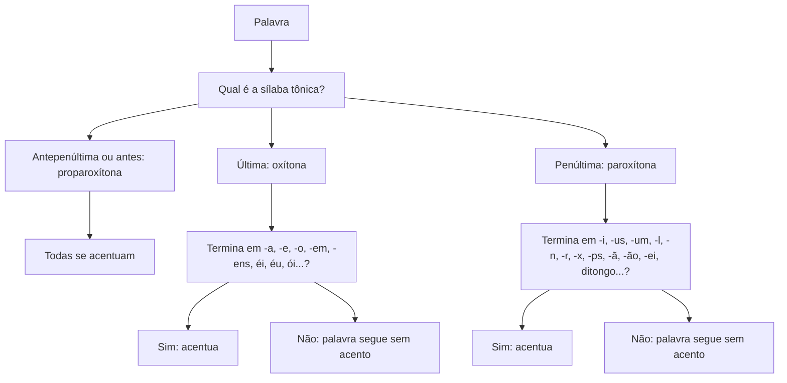

# Ortografia Oficial

> [!info] Metadados
> **Disciplina:** Língua Portuguesa
> **Bloco:** 1.1 — Língua Portuguesa (FASE 1 — Fundamentos)
> **Tópico:** 3. Ortografia oficial
> **Subtópicos:** Regras de acentuação (oxítona, paroxítona, proparoxítona) · Uso de hífen e crase · Letras maiúsculas e minúsculas · Divisão silábica
> **Pré-requisitos:** Nenhum — se beneficia de: [[Compreensao-e-Interpretacao-de-Textos|Compreensão e interpretação de textos]]; [[Tipos-e-Generos-Textuais|Tipos e gêneros textuais]]
> **Cargo:** Analista de TI — Perfil 3 (Desenvolvimento de Software) · DATAPREV 2026
> **Data:** 2026-08-27

---

## 1. Por que a escrita correta é a base de tudo

Nas duas notas anteriores, você aprendeu a ler textos com precisão ([[Compreensao-e-Interpretacao-de-Textos|Compreensão e interpretação de textos]]) e a reconhecer os formatos que eles assumem no dia a dia ([[Tipos-e-Generos-Textuais|Tipos e gêneros textuais]]). Agora vamos descer um nível: deixar de olhar para o texto como um todo e olhar para o seu **material de construção** — as palavras, os sinais, as letras. É o território da **ortografia**, a parte da língua que cuida da **escrita correta** das palavras ("orto" vem do grego e quer dizer *correto*; "grafia" quer dizer *escrita*).

Por que isso importa num concurso técnico? Em primeiro lugar, porque a ortografia é cobrada **diretamente**: questões pedem que você identifique a palavra grafada corretamente, a palavra que "não recebe acento", o emprego correto do hífen, a divisão silábica certa. Em segundo lugar, porque ela aparece **dentro** de toda prova: uma alternativa pode estar conceitualmente perfeita e ainda assim estar errada porque a palavra central dela foi grafada com acento errado. Um bom profissional de tecnologia também escreve o tempo todo — documentação, e-mails, relatórios (gêneros que você já conhece da nota anterior) — e erros de grafia derrubam a credibilidade técnica diante de quem lê.

Nesta nota, há ainda uma razão específica de concurso: a **acentuação gráfica** e o **hífen** mudaram com o **Acordo Ortográfico** em vigor desde 2009. Muitos candidatos decoraram as regras antigas na escola ("idéia", "vôo", "para-quedas") e marcam errado o que hoje é a forma correta. Vamos construir cada regra do zero, para que você não dependa de memória escolar, e sim de raciocínio.

---

## 2. Acentuação gráfica: o som da língua escrito

### 2.1 Sílaba e sílaba tônica

Comecemos pelo som. Quando falamos, não despejamos as palavras de uma vez: nós as dividimos naturalmente em "pedaços" que saem juntos na voz. Cada um desses pedaços é uma **sílaba**.

> [!note] Definição de sílaba
> **Sílaba** é o "bloquinho" sonoro em que uma palavra se divide quando é pronunciada. Basta falar devagar e bater palmas a cada pedaço para percebê-los: **ca** (palma) **sa** (palma). "Casa" tem duas sílabas: **ca-sa**. "Computador" tem quatro: **com-pu-ta-dor**.

Agora, uma experiência: pronuncie "casa" e preste atenção em qual pedaço sai com mais força. É o "**ca**", não é? Pronuncie "café": o pedaço forte é o "**fé**". Pronuncie "lâmpada": o forte é o "**lâm**". Essa sílaba pronunciada com mais intensidade chama-se **sílaba tônica** (tônica vem de *tom*, *tensão* — é a sílaba "mais tensa", mais forte). As demais são **átonas** (sem força, "soltas").

> [!tip] Como achar a sílaba tônica de qualquer palavra
> Fale a palavra em voz alta e exagere: "**JA**-ne-la", "com-pu-**TA**-dor", "**MÉ**-di-co". A sílaba que "grita" mais alto é a tônica. Se ainda houver dúvida, chame a palavra como quem chama alguém de longe — o pedaço que você mais estica é a tônica.

### 2.2 Acento tônico e acento gráfico: não confunda os dois

Chegamos a uma distinção que a prova adora: a palavra **acento** tem dois sentidos que às vezes se misturam.

O **acento tônico** é o da seção anterior: a **força de pronúncia**, que existe em toda palavra com duas ou mais sílabas, mesmo que não esteja escrita em lugar nenhum. "Casa" tem acento tônico no "ca" — e ninguém escreve sinal nenhum nela.

O **acento gráfico** é o **sinal escrito** que colocamos em algumas palavras para marcar, na maioria dos casos, onde está a sílaba tônica. Em português, os sinais são três:

- o **acento agudo** ( ´ ), que também costuma indicar som aberto: café, pá, herói;
- o **acento circunflexo** ( ^ ), que costuma indicar som fechado: você, mês, lâmpada;
- o **acento grave** ( ` ), que não marca a sílaba tônica: ele é o sinal da **crase**, que estudaremos na seção 4.

Guarde a frase-chave: **toda palavra tem sílaba tônica; poucas palavras recebem acento gráfico.** O acento gráfico é a exceção, não a regra — e as regras de acentuação servem exatamente para dizer *quando* a exceção acontece. Esse é o ponto: a banca não pergunta "qual é a tônica?" e pronto; ela pergunta "**esta palavra deve receber acento gráfico?**" Para responder, você usa o seguinte fluxo: identificar a sílaba tônica, classificar a palavra pela posição dela, e aplicar a regra da classe. Vamos montar esse fluxo agora.

### 2.3 Oxítonas, paroxítonas e proparoxítonas

Pela **posição da sílaba tônica**, toda palavra de duas ou mais sílabas cai em uma de três classes:

- **Oxítona**: a força está na **última** sílaba. "Café" → ca-**fé**. "Cipó" → ci-**pó**. "Jacaré" → ja-ca-**ré**.
- **Paroxítona**: a força está na **penúltima** sílaba. "Casa" → **ca**-sa. "Táxi" → **tá**-xi. "Fácil" → **fá**-cil.
- **Proparoxítona**: a força está na **antepenúltima** sílaba. "Lâmpada" → **lâm**-pa-da. "Médico" → **mé**-di-co. "Cântaro" → **cân**-ta-ro.

> [!important] A regra que não tem exceção
> **Toda proparoxítona recebe acento gráfico.** Não existe proparoxítona sem acento em português. Lâmpada, médico, cântaro, pássaro, rápido, último — todas acentuadas. Essa é a regra mais simples e mais cobrada do sistema: decore-a e nunca marque "lampada" como correta.

Mas cuidado com uma armadilha de raciocínio: ser oxítona ou paroxítona **não** significa, sozinho, que a palavra recebe acento. "Café" (oxítona) recebe; "caju" (oxítona também) não recebe. "Táxi" (paroxítona) recebe; "casa" (paroxítona também) não recebe. A classe só diz *onde* está a força; a **terminação** da palavra é que decide se o acento gráfico aparece.

### 2.4 As regras gerais de acentuação

Vejamos cada classe em detalhe.

**Oxítonas — acentuam-se as terminadas em -a, -e, -o (com ou sem -s), em -em e -ens, e as que terminam em ditongos abertos -éi, -éu, -ói.**

- Terminadas em -a: chá, sofá, maracujá.
- Terminadas em -e: café, jacaré, você.
- Terminadas em -o: cipó, avô, dominó.
- Terminadas em -em/-ens: alguém, ninguém, também, parabéns.
- Ditongos abertos: herói, chapéu, papéis, anéis.

Perceba o que **não** se acentua: "caju", "tatu", "abacaxi", "urubu" são oxítonas terminadas em -i ou -u e **não** recebem acento. A terminação decide.

**Paroxítonas — acentuam-se as terminadas em -i, -is, -us, -um, -uns, -l, -n, -r, -x, -ps, -ã, -ãs, -ão, -ãos, -ei, -eis, e as terminadas em ditongo.**

- Terminadas em -i/-is: táxi, lápis, júri.
- Terminadas em -us: vírus, bônus.
- Terminadas em -um/-uns: álbum, fórum.
- Terminadas em -l: fácil, útil, automóvel.
- Terminadas em -n: hífen, pólen.
- Terminadas em -r: caráter, açúcar, cadáver.
- Terminadas em -x: tórax, ônix.
- Terminadas em -ps: bíceps, fórceps.
- Terminadas em -ã/-ãs: irmã, órfã, imãs.
- Terminadas em -ão/-ãos: órgão, bênção, órfãos.
- Terminadas em -ei/-eis: jóquei, marquês? Não — "ei" não: vôlei, pastéis? Não, "pastéis" é oxítona. Paroxítona terminada em -ei: jóquei, hóquei. E em -eis: fáceis, úteis (plural de fácil/útil — mas veja: "fáceis" a sílaba tônica é "fá" — penúltima, terminação -eis → acentuada). Vamos citar: jóquei, vôlei (terminação -ei), fósseis, úteis (terminação -eis).
- Terminadas em **ditongo** (combinação vogal + semivogal numa só sílaba — veremos ditongo na seção de divisão silábica): história, cárie, ânsia, memória, água, mágoa, série, prêmio.

Há um jeito prático de lembrar esse "oceano" de terminações: a maior parte das palavras portuguesas é paroxítona, e a grande maioria **não** recebe acento — porque termina justamente em -a, -e, -o, -em, -ens ("casa", "mesa", "livro", "homem", "jovem", "item"). O acento só aparece quando a terminação foge desse padrão. Ou seja: para a classe das paroxítonas, **a regra é o contrário da oxítona** — o que se decora é a lista dos "fujões" (-i, -us, -um, -l, -n, -r, -x, -ps, -ã, -ão, -ei, ditongo). Se a palavra não está na lista, paroxítona sem acento.

**Proparoxítonas — todas recebem acento.** Já vimos: lâmpada, médico, cântaro, rápido, último, sábado, trôpego.

**Monossílabos — acentuam-se os tônicos terminados em -a, -e, -o (com ou sem -s) e em ditongos abertos -éi, -éu, -ói.**

Um **monossílabo** é uma palavra de uma só sílaba. O monossílabo **tônico** é pronunciado com força própria: "pá" (strumento), "pé", "pó", "dó", "já", "trás", "fé", "mês", "só". Esses recebem acento. Já os monossílabos **átonos** — pronunciados sem força, "colados" na palavra seguinte — não recebem: "de", "que", "se", "lhe", "no", "me". Compare: "Você **dá** (acentuado, tônico) o livro a **nós** (acentuado)?" e "**De** volta para casa" (átono, sem acento).

> [!tip] Os três degraus de qualquer questão de acentuação
> **1.** Onde está a sílaba tônica? → **2.** A palavra é oxítona, paroxítona ou proparoxítona? → **3.** A terminação dela está na lista da classe? Se sim, acentua; se não, não acentua.

### 2.5 O que mudou com o Acordo Ortográfico: a parte que mais rende ponto

Aqui está o território das pegadinhas. O **Acordo Ortográfico** (em vigor desde 2009) **aboliu acentos** em três situações — e o candidato que estudou pela ortografia antiga marca tudo errado.

**1. Não se acentuam mais os ditongos abertos -éi, -ói, -éu em palavras paroxítonas.**

Antes: idéia, assembléia, heróico, jibóia, platéia, paranóico.
Hoje: **ideia, assembleia, heroico, jiboia, plateia, paranoico**.

Repare que a palavra não "perdeu a tônica": ideia continua com a força em "dei" (paroxítona) — o que acabou foi o **sinal**. E atenção ao inverso: em palavras **oxítonas** com esses mesmos ditongos o acento **continua**: papéis, herói, chapéu, anéis, céu. O motivo é a regra da classe: oxítona com ditongo aberto acentua; paroxítona com ditongo aberto não acentua mais.

**2. Não se acentuam mais as vogais dobradas -oo e -ee.**

- **-oo**: voo, enjoo, perdoo, magoo, abençoo (antes: vôo, enjôo, perdôo).
- **-ee**: creem, leem, veem, deem, releem (antes: crêem, lêem, vêem, dêem, relêem).

**3. O "i" e o "u" tônicos continuam acentuados quando formam hiato.**

Entender essa regra exige um conceito que detalharemos na seção de divisão silábica, mas vamos adiantar a ideia: quando duas vogais que ficariam juntas são pronunciadas em sílabas separadas (**hiato**), e a segunda é "i" ou "u" tônico, ela recebe acento: saída (sa-í-da), baú (ba-ú), açaí (a-ça-í), Piauí (Pi-a-u-í), saúde (sa-ú-de), juízo (ju-í-zo), raízes (ra-í-zes), caído (ca-í-do). Esses acentos **não** foram abolidos pelo Acordo — continuam obrigatórios.

> [!warning] A exceção do hiato que derruba candidato
> O "i" e o "u" tônicos **não** recebem acento quando, na sílaba anterior, a vogal forma um **ditongo** com outra vogal (ou semivogal). É o caso de feiura (fei-u-ra), baiuca (bai-u-ca) e seara (se-a-ra): o "u" e o "i" tônicos não são acentuados porque "fei" e "bai" são ditongos. Regra de bolso: **depois de ditongo, hiato não recebe acento**.

**O acento diferencial: uma função que não é de posição.**

Além de marcar a sílaba tônica, o acento às vezes existe para **diferenciar palavras iguais**. O Acordo manteve alguns casos:

- **pôde** (passado: "ontem ele pôde sair") × **pode** (presente: "hoje ele pode sair");
- **pôr** (verbo: "vou pôr a mesa") × **por** (preposição: "passei por aqui");
- **têm** (plural: "eles têm") × **tem** (singular: "ele tem");
- **vêm** (plural de *vir*: "eles vêm") × **vem** (singular: "ele vem").

Aqui a função do acento não é indicar a tônica (as duas formas são pronunciadas da mesma forma em cada caso), e sim **separar sentidos**. Guarde o conceito: existe um "acento que diferencia", e as bancas de concurso, de modo geral, gostam de testá-lo em questões de interpretação ("o acento em 'pôde' indica..."). Nesta nota, basta reconhecer a existência dele; as variações completas cabem no estudo da estrutura morfossintática.

### 2.6 Tabela-resumo e o fluxo de decisão

Colocando tudo lado a lado:

| Classe | Posição da tônica | Quando acentuar | Exemplos |
|---|---|---|---|
| **Oxítona** | última sílaba | -a, -e, -o (+s), -em, -ens, ditongos abertos éi/éu/ói | chá, café, cipó, você, alguém, parabéns, herói, chapéu |
| **Paroxítona** | penúltima sílaba | -i, -is, -us, -um, -uns, -l, -n, -r, -x, -ps, -ã, -ãs, -ão, -ãos, -ei, -eis, ditongo | táxi, lápis, vírus, álbum, útil, hífen, caráter, tórax, bíceps, irmã, órgão, jóquei, história, cárie |
| **Proparoxítona** | antepenúltima sílaba | sempre | lâmpada, médico, cântaro, rápido, sábado |
| **Monossílabo tônico** | — | -a, -e, -o (+s), ditongos abertos éi/éu/ói | pá, pé, pó, dó, já, trás, fé, mês |
| **Hiato (i, u tônicos)** | sílaba separada pela vogal anterior | quando o i/u tônico forma hiato (exceto após ditongo) | saída, baú, açaí, saúde — mas feiura, baiuca |

E o fluxo mental que você deve seguir diante de qualquer palavra:

### 2.7 Pegadinhas da acentuação e exercícios

As armadilhas mais frequentes neste subtópico, resumidas:

> [!warning] Pegadinha 1 — "todas as proparoxítonas são acentuadas"
> **A armadilha:** a alternativa traz uma proparoxítona **sem** acento, esperando que você "deixe passar" ("lampada", "medico").
> **O raciocínio errado:** achar que o acento segue alguma terminação especial da palavra.
> **Como se proteger:** a classe das proparoxítonas **não tem lista** — é regra total. Se a tônica está na antepenúltima, o acento é obrigatório, ponto.

> [!warning] Pegadinha 2 — oxítona em -em × paroxítona em -em
> **A armadilha:** juntar na mesma sacola "alguém" (oxítona, acentuada) com "item" (paroxítona, sem acento).
> **O raciocínio errado:** "as duas terminam em -em, então as duas são iguais".
> **Como se proteger:** pronuncie! Al**guém** tem a força na última sílaba; **i**-tem tem a força na primeira sílaba (penúltima). Oxítona em -em → acentua (alguém, ninguém, também). Paroxítona em -em → não acentua (item, homem, jovem). Já a paroxítona terminada em -en, como "hífen", **é** acentuada — porque o -n está na lista das paroxítonas.

> [!warning] Pegadinha 3 — palavras que mudaram (e o candidato não percebeu)
> **A armadilha:** "idéia", "vôo", "crêem" aparecem como se estivessem corretas — e muita gente marca porque "aprendeu assim".
> **O raciocínio errado:** confiar na memória escolar em vez da regra **atual**.
> **Como se proteger:** decore os três grupos do Acordo: ditongo aberto em paroxítona (ideia, jiboia), -oo (voo, enjoo) e -ee (creem, leem, veem). E **não** os confunda com os acentos que ficaram: herói e papéis (oxítonas), açaí e baú (hiato).

> [!tip] Exercícios rápidos — verdadeiro ou falso?
> **1.** "Toda palavra proparoxítona recebe acento gráfico." → **Verdadeiro.** Lâmpada, médico, cântaro — regra sem exceção.
> **2.** "Em 'ideia', o acento foi mantido pelo Acordo Ortográfico." → **Falso.** Ideia é paroxítona com ditongo aberto -éi; o acento foi abolido.
> **3.** "'Parabéns' é acentuada por ser oxítona terminada em -ens." → **Verdadeiro.** Juntamente com alguém, ninguém, também.
> **4.** "'Item' é acentuada por ser oxítona terminada em -em." → **Falso.** Item é paroxítona (í-tem); paroxítona em -em não recebe acento.
> **5.** "No Acordo, 'voo' e 'creem' perderam o acento." → **Verdadeiro.** Ficaram sem acento o -oo e o -ee.
> **6.** "'Açaí' mantém o acento porque o 'i' tônico forma hiato." → **Verdadeiro.** Sa-í-da, ba-ú, a-ça-í: hiato com i/u tônico continua acentuado.

---

## 3. Uso do hífen

### 3.1 O que é o hífen

O **hífen** é o sinal de traço ( - ) que liga elementos de palavras compostas e de certas formações com prefixos. Ele aparece em dois grandes grupos: nas **palavras compostas** do tipo guarda-chuva, beija-flor, couve-flor, arco-íris, segunda-feira — em que dois elementos se unem para formar um só sentido — e na junção de um **prefixo** (anti-, super-, pré-, micro-...) com uma palavra.

A pergunta que a prova faz é sempre a mesma: *"esta palavra leva hífen ou não?"* Para responder, não há jeito de fugir das regras. Vamos às que as bancas de concurso, de modo geral, mais repetem.

### 3.2 Prefixo + palavra: as regras mais cobradas

**Regra 1 — Usa-se hífen quando a palavra seguinte começa com "h".**

O "h" é mudo em português; quando o prefixo encontra uma palavra iniciada por ele, o hífen serve para **separar visualmente** o prefixo: anti-higiênico, super-homem, pré-histórico, semi-humano, sub-humano, sobre-humano. Sem o hífen, o olho "engole" o h e a leitura fica confusa.

**Regra 2 — Usa-se hífen quando o prefixo termina com a MESMA vogal com que começa a palavra seguinte; não se usa quando as vogais são diferentes.**

- Mesma vogal → hífen: anti-inflamatório (anti + inflamatório), micro-ondas, auto-observação, contra-ataque, semi-interno.
- Vogais diferentes → sem hífen: autoescola (auto + escola), antiaéreo (anti + aéreo), extraescolar (extra + escolar), semiaberto (semi + aberto), infraestrutura, autoestima.

**Regra 3 (exceção clássica) — O prefixo "re" + palavra iniciada com "e" NÃO leva hífen.**

reescrever, reeleger, reencontrar, reestruturar. Note: essa é a famosa "exceção à exceção" — se a regra 2 manda usar hífen quando a vogal se repete, com o "re" a tradição manda **não** usar. Decore os três: reescrever, reeleger, reencontrar.

**Regra 4 — Prefixo terminado em consoante: usa-se hífen se a palavra seguinte começa com a MESMA consoante; não se usa, em geral, nos demais casos.**

- Mesma consoante → hífen: sub-base (sub + base), inter-racial (inter + racial), super-revista (super + revista), inter-regional, sub-região.
- Consoantes diferentes → sem hífen: subsecretário, intercontinental, supermercado, subtenente.

### 3.3 Casos especiais que as provas adoram

Além das regras, há um punhado de palavras que aparecem em prova com uma frequência desproporcional:

- Com hífen: **mal-humorado**, **bem-vindo**, **além-mar**, **recém-nascido**, **ex-presidente**, **vice-presidente**, **pós-graduação**, **pré-requisito**, **pão-de-mel**, **guarda-chuva**, **arco-íris**, **segunda-feira**, **beija-flor**, **couve-flor**.
- Sem hífen: **autoestima**, **antissocial**, **contrarregra**, **ultrassom**, **pseudônimo**, **extraordinário**, **subsecretário**.

Perceba o padrão das três últimas do segundo grupo: quando o prefixo termina em vogal **diferente** da que inicia a palavra, a consoante seguinte acaba **duplicada** por tradição: anti + social → antissocial (vogal "i" seguida de consoante "s", e o "s" dobra); contra + regra → contrarregra; ultra + som → ultrassom. E os prefixos **ex, vice, pós, pré, pró, recém, além, aquém, bem, mal, sem** formam sempre com hífen, por serem praticamente palavras independentes coladas à frente: ex-ministro, vice-presidente, pós-graduação, pré-requisito, recém-nascido, além-mar, bem-vindo, mal-humorado, sem-teto.

### 3.4 Tabela-resumo e pegadinhas do hífen

| Com hífen | Por quê | Sem hífen | Por quê |
|---|---|---|---|
| anti-inflamatório | vogal igual (i + i) | antiaéreo | vogais diferentes (i + a) |
| micro-ondas | vogal igual (o + o) | autoescola | vogais diferentes (o + e) |
| super-homem | palavra começa com h | extraescolar | vogais diferentes (a + e) |
| pré-histórico | palavra começa com h | semiaberto | vogais diferentes (i + a) |
| auto-observação | vogal igual (o + o) | reescrever | exceção do "re" |
| sub-base | consoante igual (b + b) | subsecretário | consoantes diferentes |
| inter-racial | consoante igual (r + r) | intercontinental | consoantes diferentes |
| mal-humorado | "mal" + palavra com h | antissocial | vogais diferentes (i + s) |
| ex-presidente | ex + qualquer palavra | contrarregra | vogais diferentes (a + r) |
| recém-nascido | recém + qualquer palavra | ultrassom | vogais diferentes (a + s) |

> [!warning] As três pegadinhas mais comuns do hífen
> **Pegadinha 1 — prefixo + h:** a alternativa grafa "anti-inflamatório" sem hífen, ou "super-homem" sem hífen, e o candidato marcado pela "memória visual" não percebe. **Proteção:** sempre que o prefixo for seguido de "h", o hífen é obrigatório.
>
> **Pegadinha 2 — "auto" + vogal diferente:** "autoescola", "autoestima", "autoavaliação" **não** levam hífen — muita gente ainda grafa "auto-escola" pela regra antiga. **Proteção:** confira as vogais: auto + escola = o + e → diferentes → sem hífen.
>
> **Pegadinha 3 — consoante repetida:** "inter-racial", "sub-base", "super-revista" levam hífen porque as consoantes se repetem; mas "contrarregra", "antissocial", "ultrassom" vão **sem** hífen porque a vogal do prefixo é diferente da palavra seguinte (e a consoante dobra). **Proteção:** distinga "prefixo terminado em vogal" (olha-se a vogal) de "prefixo terminado em consoante" (olha-se a consoante). São lógicas diferentes.

---

## 4. Crase em nível ortográfico: o acento grave

### 4.1 O que é o acento grave e por que se chama crase

Você já conhece o acento agudo ( ´ ) e o circunflexo ( ^ ). Falta o terceiro: o **acento grave** ( ` ), um sinalzinho inclinado para o lado contrário do agudo. Ele não marca a sílaba tônica — ele é o sinal da **crase**.

De onde vem a palavra "crase"? Do grego *krâsis*, que significa **fusão, mistura**. E é exatamente isso: a crase é a **fusão de dois "a"** que se encontram numa frase. Pense na frase "Vou à escola". Há ali, na linguagem natural, dois "a" que se encontram: um vem da ideia de "ir **a** algum lugar", e o outro acompanha a palavra feminina "escola". Os dois "a" se fundem em um só — e, para marcar que houve essa fusão, escrevemos o "a" fundido com o acento grave: **à**. (Não se preocupe agora em decorar o que é formalmente "preposição" ou "artigo": isso pertence ao tópico de estrutura morfossintática. Aqui, basta a imagem: dois "a" que se encontram e viram um só, com o sinal grave em cima.)

Repare na diferença **visual** que muda o sentido de uma frase:

- "Vou **a** Brasília." — só um "a" (o da ideia de ir). Sem fusão, sem acento.
- "Vou **à** Bahia." — dois "a" se encontraram (um + o que acompanha "Bahia"). Fundiram-se: acento grave.

### 4.2 Onde o sinal aparece com mais frequência em prova

Não é preciso dominar todas as regras para começar a **reconhecer** o sinal. Estes são os contextos em que o "à" aparece de forma mais constante:

**1. Horas.** "A reunião começa às 14h." "Cheguei à 1h da manhã." A fusão acontece porque se diz "às" tantas horas: "a" + "as" (horas) = às. Guarde: **hora marcada → crase**.

**2. Locuções adverbiais femininas.** Expressões feitas com palavras femininas que funcionam como um "bloco" de tempo, lugar ou modo: **à noite**, **à tarde**, **à esquerda**, **à direita**, **às vezes**, **à toa**, **à vontade**, **à distância**. Decore as mais frequentes — especialmente **às vezes** (que é **sempre** com crase) e **à noite/à tarde** (em oposição a "de manhã", sem crase).

**3. "àquele", "àquela", "àquilo".** A fusão também acontece com os pronomes demonstrativos "aquele", "aquela", "aquilo": o primeiro "a" (da preposição) + "aquele" = **àquele**. "Refiro-me **àquele** relatório." "Entregue **àquela** equipe." "Não obedeço **àquilo** que me parece errado."

**4. "à moda de" e famílias parecidas.** "Frango **à** milanesa", "Bife **à** cavalo", "à moda da casa". Este é um caso curioso que vira pegadinha: "moda" é palavra feminina, então a locução é "à moda (de) ...". E atenção: aqui o hífen não é usado, mas a crase permanece mesmo quando a palavra seguinte é masculina — porque a crase não está sobre a palavra masculina, e sim sobre o "a" de "à moda".

**5. Frases de movimento com destino.** Quando alguém **vai** ou **retorna** a algum lugar, surge a oportunidade da crase: "Vou **à** escola", "Voltei **à** agência", "Fui **à** reunião". Se o lugar for feminino e tiver o "a" acompanhando-o, há fusão.

### 4.3 Um macete introdutório

Como saber, na prática, se aquele "a" deve receber o acento grave? Existe um truque simples e poderoso: **troque a palavra feminina por uma masculina equivalente e veja se aparece "ao"**.

- "Vou **à** escola." → Troque escola por colégio: "Vou **ao** colégio." ✅ Apareceu "ao" → sobre a palavra feminina também caem os dois "a" → crase.
- "Vou **a** Brasília." → Troque por uma cidade masculina: "Vou **ao** Rio?" ❌ A frase não pede "ao" → só há um "a" (o da preposição) → **sem** crase.

Isso funciona porque "ao" é o "à" do masculino: se o masculino pede "ao", o feminino pede "à"; se o masculino pede "a" puro ("Vou a Roma" → "Vou a Lisboa"?), o feminino também vai sem acento. É um macete de **reconhecimento**, suficiente para o nível ortográfico deste tópico — as regras completas, as exceções e os casos de regência serão estudados adiante.

> [!important] Remissão ao tópico de estrutura morfossintática
> Nesta nota, a crase foi apresentada no nível da **ortografia**: o que é o sinal ( ` ), por que se chama crase (fusão de dois "a"), e onde ele aparece com mais frequência (horas, locuções como "à noite", "àquele", "à moda de", frases de destino). **As regras completas da crase — quando há e quando não há o segundo "a", as exceções (antes de palavras masculinas, de verbos, de pronomes), e os casos ligados à regência — serão estudadas no tópico de estrutura morfossintática.** Aqui, o que você precisa levar é: reconhecer o sinal, entender a imagem da fusão e nunca confundir "a" (sem acento) com "à" (com acento).

### 4.4 Pegadinhas da crase em nível ortográfico

> [!warning] Pegadinha 1 — o "a" sem acento não é erro
> **A armadilha:** a alternativa escreve "A reunião começa a partir das 14h" e o candidato "corrige" para "à partir" — **errado!** Em "a partir de", há só uma preposição e nenhuma fusão: é **a**, sem acento.
> **O raciocínio errado:** achar que crase é "enfeite" que se aplica sempre antes de palavras femininas.
> **Como se proteger:** antes de acentuar, pergunte: *"há dois 'a' aqui?"*. Se só há um, não há crase.

> [!warning] Pegadinha 2 — crase antes de palavra masculina
> **A armadilha:** "vou à praça" ✅ (feminino), mas o candidato escreve "vou à parque" ❌.
> **O raciocínio errado:** aplicar crase a todo "a" de movimento.
> **Como se proteger:** crase pressupõe a palavra feminina ("praça", "escola") acompanhada do segundo "a". Antes de palavra **masculina** não existe crase — a única exceção famosa é o "à moda", que não cai sobre a palavra masculina, e sim sobre a palavra "moda" ("à moda mineira").

> [!warning] Pegadinha 3 — "às vezes" sempre com crase
> **A armadilha:** "as vezes" (sem acento) aparece em prova como se fosse correto.
> **O raciocínio errado:** tratar "às vezes" como qualquer outra combinação.
> **Como se proteger:** "às vezes" é locução adverbial feminina **cristalizada**: vem do encontro de "a" + "as" (vezes) → sempre com crase. É uma das palavras mais cobradas do sistema todo: *às vezes* = crase obrigatória; *as vezes* (sem crase) só existe quando "as" é o artigo e "vezes" é o núcleo do sujeito ("as vezes em que errei").

---

## 5. Letras maiúsculas e minúsculas

### 5.1 Quando usar maiúscula

Este subtópico é simples de entender e ainda mais simples de errar na pressa. Comecemos pelos usos **obrigatórios** da letra maiúscula:

- **Início de frase ou período**: "O sistema está fora do ar. A equipe já foi acionada."
- **Nomes próprios** de pessoas, lugares, instituições: Ana, Brasil, São Paulo, Ministério da Saúde, Tribunal de Contas. Perceba que, num órgão público, as palavras que fazem parte do **nome próprio** começam com maiúscula.
- **Nomes de ruas, cidades, países, estados**: Avenida Paulista, Recife, Portugal, Minas Gerais.
- **Títulos de obras, filmes, livros**: "Dom Casmurro", "Guerra e Paz". (Nas provas, cobra-se em geral apenas a **primeira** palavra do título com maiúscula, além de nomes próprios internos.)
- **Siglas**: DATAPREV, IBGE, INSS — cada letra em maiúscula, sem pontos.
- **Nomes de eras e fatos históricos**: Idade Média, Renascimento, Revolução Industrial.
- **Nomes científicos** (o gênero em latim) e **marcas**: *Homo sapiens*, Coca-Cola, Petrobras.

### 5.2 A pegadinha clássica: quando NÃO usar maiúscula

Aqui mora a parte que mais elimina candidato — porque todo mundo "aprendeu" a usar maiúscula em coisas que a norma **não** exige:

- **Dias da semana**: segunda-feira, terça-feira (sem maiúscula!).
- **Meses**: janeiro, fevereiro, agosto (sem maiúscula!).
- **Estações do ano**: verão, inverno, outono, primavera (sem maiúscula!).
- **Pontos cardeais em sentido genérico** (direção): "o vento sopra do norte", "viajou para o sul". MAS: quando designam **regiões**, levam maiúscula: "mora no Nordeste", "o Norte do país".
- **Nomes de línguas e disciplinas em uso genérico**: português, matemática, inglês, história. As bancas de concurso, de modo geral, aceitam a minúscula no uso comum — embora, por tradição acadêmica, os nomes de **disciplinas escolares** apareçam frequentemente com maiúscula ("Matemática"), o que o edital costuma cobrar é o uso **genérico** com minúscula. Na dúvida entre as duas grafias numa questão, a regra segura é: uso genérico de língua → minúscula.
- **Cargos e funções**: presidente, diretor, ministro, gerente — em uso genérico, minúscula. ("O diretor convocou a reunião.") A maiúscula só aparece quando o cargo é tratado como parte do **nome próprio** de um órgão ou em contextos formais específicos ("Presidente da República" em documentos oficiais, por tradição).

E há ainda uma convenção dos **documentos oficiais**: os **pronomes de tratamento** dirigidos a autoridades são grafados com maiúscula — Vossa Excelência, Vossa Senhoria, Senhor Ministro. Como Analista de TI em órgão público (e a prova adora isso), saber que "Vossa Excelência" leva maiúscula é um detalhe que distingue quem leu o manual de redação oficial de quem não leu.

### 5.3 Tabela-resumo e pegadinhas

| Caso | Usa maiúscula? | Exemplo |
|---|---|---|
| Início de frase | Sim | "O servidor foi reiniciado." |
| Nome próprio de pessoa, lugar, instituição | Sim | Ana, Brasília, Ministério da Saúde |
| Rua, cidade, país, estado | Sim | Avenida Paulista, Recife, Portugal |
| Título de obra (primeira palavra) | Sim | "Dom Casmurro" |
| Siglas | Sim | DATAPREV, IBGE, INSS |
| Era, fato histórico | Sim | Idade Média, Renascimento |
| Marca | Sim | Petrobras |
| Dia da semana | **Não** | segunda-feira |
| Mês | **Não** | janeiro |
| Estação do ano | **Não** | verão |
| Ponto cardeal genérico | **Não** | "ventos do norte" |
| Ponto cardeal como região | Sim | "o Nordeste brasileiro" |
| Língua/disciplina em uso genérico | **Não** | português, matemática |
| Cargo em uso genérico | **Não** | "o presidente da empresa" |
| Pronome de tratamento em documento oficial | Sim | Vossa Excelência |

> [!warning] As pegadinhas das maiúsculas
> **Pegadinha 1 — mês e dia da semana com maiúscula:** "Fomos em **Janeiro**", "a reunião será na **Segunda-feira**" — as duas grafias estão erradas pela norma vigente. Meses e dias da semana são **nomes comuns**: janeiro, segunda-feira. Essa é a pegadinha número um do subtópico inteiro.
>
> **Pegadinha 2 — estação do ano:** "No **Verão**, o consumo de energia aumenta" → errado. Estações do ano são comuns: verão, inverno, outono, primavera. (Diferente de "Idade Média", que é nome de **era histórica** — aí sim, maiúsculas.)
>
> **Pegadinha 3 — maiúscula por ênfase:** escrever "O **Sistema** caiu", "é **Fundamental** atualizar" — nomes comuns grafados com maiúscula por "importância". A norma não aceita: ênfase se marca com itálico, negrito ou ordem das palavras, **não** com maiúscula. Em prova, a alternativa que dá maiúscula a um nome comum por destaque está errada.

---

## 6. Divisão silábica

### 6.1 O que é e para que serve

Você já sabe o que é uma **sílaba**: o "bloquinho" sonoro em que a palavra se divide. A **divisão silábica** é a separação dessas sílabas na **escrita** — e ela tem uma aplicação imediata e muito prática: a **translineação**, que é a quebra da palavra no fim da linha, quando ela não cabe inteira. ("Translineação" = "passar de uma linha a outra".)

Mas por que a divisão silábica cai em prova? Por duas razões. Primeiro, porque há questões diretas ("assinale a alternativa em que a divisão silábica está correta"). Segundo — e mais importante —, porque a **posição da sílaba tônica** (que estudamos na seção 2) só pode ser determinada depois que a palavra está corretamente dividida: sa-**ú**-de só revela que o "ú" é tônico porque sabemos que "sa-ú-de" tem três sílabas. Divisão silábica e acentuação são duas faces da mesma moeda.

### 6.2 O que NÃO se separa

Antes de listar o que se separa, vejamos o que **fica junto**:

**1. Dígrafos ch, lh, nh, qu, gu.** Um **dígrafo** é um grupo de duas letras que representa **um só som** (como "ch" em "chave" e "nh" em "ninho"). Como representam um som único, eles não podem ser separados:

- ch: **cha-ve**, **cha-vei-ro**
- lh: **fi-lho**, **tra-ba-lho**
- nh: **ni-nho**, **so-nho**
- qu: **quei-jo**, **qui-lo** (o "qu" fica junto e segue com a vogal seguinte)
- gu: **guer-ra**, **gui-sa-da** — cuidado: aqui o "gu" não se separa, mas o "rr" **se** separa. Por isso "guerra" é **guer-ra**, e não "gue-rra".

**2. Encontros consonantais perfeitos (consoante + L ou consoante + R).** Quando uma consoante vem seguida de L ou R e os dois sons saem juntos no começo de uma sílaba, não se separam: **pra-to**, **blo-co**, **cla-ros**, **a-tle-ta**, **bra-sil**, **a-pre-sen-tar**.

**3. Ditongos e tritongos.** Um **ditongo** é o encontro de uma vogal com uma semivogal (ou vice-versa) **na mesma sílaba**: "cai" (a + i), "frei", "ói", "éu". Como ficam juntos numa só sílaba, não se separam: **cai-xa**, **pai**, **foi**. Um **tritongo** é a combinação de semivogal + vogal + semivogal na mesma sílaba: **pa-ra-guai** (gua-i), **U-ru-guai**, **i-guais**.

> [!tip] A distinção que decide metade dos pontos
> **Dígrafo** (duas letras, um som) **não** se separa: ch, lh, nh, qu, gu. **Encontro consonantal** (duas consoantes com dois sons) depende: se for consoante + l/r, fica junto; nos demais casos, separa. **Ditongo/tritongo** (vogal + semivogal) fica junto. **Hiato** (duas vogais em sílabas separadas) **se** separa. Guarde esses quatro verbetes e você resolve a maioria das questões.

### 6.3 O que SE separa

**1. Os dígrafos "rr" e "ss".** Diferente de ch/lh/nh, o "rr" e o "ss" representam dois sons que se **repetem** e ficam em sílabas diferentes: **bar-ro**, **car-ro**, **ter-ra**, **pas-sar**, **os-so**, **às-sis-tir**. É o erro clássico: o candidato trata "rr"/"ss" como os outros dígrafos e **não** separa. Não é o caso — **rr e ss sempre se separam**.

**2. Encontros consonantais imperfeitos.** Quando duas consoantes vêm juntas e **não** formam consoante + l/r, a primeira consoante fica presa à sílaba anterior: **sub-lin-gual**, **ad-vo-ga-do**, **dig-no**, **ab-so-lu-to**, **tec-no-lo-gi-a**. Note "advogado": o "d" fica com a sílaba anterior — **ad**-vo-ga-do, não "a-dvo-ga-do".

**3. Hiatos.** O **hiato** é o encontro de duas vogais que **não** formam ditongo — isto é, que ficam em sílabas separadas: **sa-ú-de**, **ba-ú**, **ca-a-tin-ga**, **a-ça-í**, **sa-í-da**, **Pa-ra-í-ba**, **co-o-pe-rar**.

**4. Encontros consonantais iniciados por "s".** Quando uma sílaba começa com consoante + "s" (grupos como "bs", "ps", "ts"), o "s" costuma ficar com a sílaba anterior: **abs-tra-to**, **pers-pec-ti-va**, **obs-cur-o**, **in-cons-ti-tu-cio-nal**.

### 6.4 Divisão silábica e acentuação: as duas faces da mesma moeda

Agora a conexão que vale ouro. Para saber se uma palavra leva acento, primeiro você precisa dividi-la **corretamente** — porque a posição da tônica é contada sobre a divisão certa.

- **sa-ú-de**: três sílabas; o "ú" é tônico e forma **hiato** com o "a" anterior → acento obrigatório (regra do hiato).
- **i-dei-a**: três sílabas; a tônica é "dei" (paroxítona) e a terminação é um ditongo → mas, pelo Acordo, paroxítona com ditongo aberto **não** recebe mais acento → grafia "ideia".
- **ba-ú**: hiato com "u" tônico → acento em "baú". Já em **fei-u-ra**, o "u" tônico vem depois do ditongo "fei" → sem acento (a exceção que vimos na seção 2.5).

Perceba como tudo se conecta: quem erra a divisão silábica ("ideia" dividida como "i-de-ia") erra a acentuação. Por isso a prova pede as duas coisas juntas com frequência.

### 6.5 Translineação: o uso prático da divisão

Na hora de quebrar uma palavra no fim da linha, valem convenções simples:

1. **Quebre sempre na fronteira de sílabas** — respeitando todas as regras de cima. Nunca separe letras de uma mesma sílaba.
2. **Evite deixar uma vogal sozinha no fim ou no começo da linha.** Não há proibição gramatical de escrever "e-" e "escola" na linha seguinte? A rigor, separar "e-scola" é possível, mas as convenções de composição recomendam **evitar** deixar sílaba de uma letra só isolada (como "e-" no fim da linha). Na prática de prova, marque como errada a divisão que deixa uma letra sozinha.
3. **Quando a palavra já tem hífen e a quebra cai justamente sobre ele**, o hífen deve aparecer **duas vezes**: um no fim da linha, outro no começo da seguinte (guarda- / -chuva). Fica feio e pouco usado digitalmente, mas é a convenção.

### 6.6 Tabela-resumo e pegadinhas da divisão silábica

| Separa-se | Por quê | Não se separa | Por quê |
|---|---|---|---|
| bar-ro, car-ro | rr (dígrafo que se separa) | cha-ve | ch (dígrafo que não se separa) |
| pas-sar, os-so | ss | fi-lho, ni-nho | lh, nh |
| sa-ú-de, ba-ú | hiato | quei-jo, guer-ra | qu/gu (e "guer-ra" separa rr) |
| ad-vo-ga-do, dig-no | encontro consonantal imperfeito | pra-to, blo-co, cla-ros | consoante + l/r |
| abs-tra-to, pers-pec-ti-va | grupo com "s" | cai-xa, pa-ra-guai | ditongo/tritongo |

> [!warning] As pegadinhas da divisão silábica
> **Pegadinha 1 — separar ch/lh/nh:** "cha-ve" dividido como "c-ha-ve", "ni-nho" como "n-i-nho" — errado. **Proteção:** dígrafo de um só som não se parte; quem carrega a sílaba é a vogal, e o "ch/lh/nh" fica com ela.
>
> **Pegadinha 2 — NÃO separar rr/ss:** "car-ro" dividido como "ca-rro", "as-sar" como "a-ssar" — errado. **Proteção:** ao contrário dos outros dígrafos, "rr" e "ss" **sempre** se separam, porque na pronúncia há um som em cada sílada.
>
> **Pegadinha 3 — não separar hiato:** "saúde" dividido como "sau-de" (tratando "au" como ditongo) — errado. **Proteção:** "sa-ú-de" é hiato: o "a" e o "ú" ficam em sílabas distintas — e é justamente por isso que o "ú" é acentuado.
>
> **Pegadinha 4 — hiato × ditongo na acentuação (a armadilha-matriz):** "sa-í-da" é hiato → acento no "í". "cai-xa" é ditongo → nada de acento (e nada de separar "ca-i-xa"). A banca às vezes usa a mesma palavra nas duas regras: "ideia" (ditongo em paroxítona → sem acento) e "açaí" (hiato → com acento). **Proteção:** pronuncie devagar e decida se as duas vogais saem juntas (ditongo, mesma sílaba) ou separadas (hiato).

---

## 7. Estratégia de prova

Chegamos ao momento de transformar o conteúdo em pontos na prova. As bancas de concurso, de modo geral, repetem um pequeno conjunto de padrões neste tópico — e todos têm uma **palavra-chave** que denuncia o que está sendo pedido.

### 7.1 Palavras-chave dos enunciados

| Expressão no enunciado | O que ela pede |
|---|---|
| "A palavra que NÃO recebe acento" | Atenção **invertida**: entre várias palavras acentuadas, encontrar a exceção — a que não leva acento (geralmente uma paroxítona não acentuada ou uma palavra que perdeu acento no Acordo) |
| "A palavra está acentuada corretamente" / "é acentuada corretamente" | Verificar: posição da tônica + terminação da classe + regras do Acordo |
| "Grafia correta" / "está grafada corretamente" | Ortografia em geral: acento, hífen, letras — testa todas as regras da nota de uma vez |
| "Emprego do hífen" | Regras do hífen: prefixo + h, vogal igual, consoante repetida, casos especiais |
| "Emprego de maiúsculas e minúsculas" | Distinguir nomes próprios de comuns; conhecer as convenções (meses, dias, estações) |
| "Divisão silábica correta" | Aplicar dígrafos, encontros consonantais, hiatos e ditongos |

### 7.2 Pegadinhas no padrão "armadilha → raciocínio errado → proteção"

> [!warning] Pegadinha geral 1 — a palavra "escorregadia" dentro da alternativa
> **A armadilha:** a alternativa está conceitualmente certa, mas contém uma palavra com ortografia errada — "a idéia principal", "o sistema foi **vôo**"? Não — um exemplo real: "a análise dos dados é fundamental para a tomada de decisão" — correta, exceto se grafar "análise" sem acento ("analise dos dados").
> **O raciocínio errado:** julgar a alternativa pelo conteúdo e "pular" a palavra.
> **Como se proteger:** em toda questão de "grafia correta", leia **palavra por palavra**, com atenção redobrada a acentos, hífens e maiúsculas. A banca coloca o erro numa palavra "inocente" justamente para derrubar quem lê depressa.

> [!warning] Pegadinha geral 2 — a memória escolar contra a regra atual
> **A armadilha:** "idéia", "vôo", "crêem", "auto-escola" — formas da ortografia **antiga** — aparecem como corretas.
> **O raciocínio errado:** "eu aprendi assim na escola, então está certo".
> **Como se proteger:** o português oficial **de 2009 em diante** é o que vale: ditongo aberto em paroxítona sem acento (ideia), -oo e -ee sem acento (voo, creem), vogais diferentes sem hífen (autoescola). Na dúvida entre duas grafias, escolha sempre a **mais enxuta** das duas formas modernas — com exceção de herói/papéis (oxítonas) e açaí/baú (hiato), que **mantiveram** o acento.

> [!warning] Pegadinha geral 3 — o "a" e o "à" na pressa
> **A armadilha:** a alternativa troca "a" por "à" (ou vice-versa) numa palavra comum: "vou **à** Brasília" (errado) ou "refiro-me **a** isso e **as** vezes" (errado).
> **O raciocínio errado:** acentuar todo "a" que acompanha palavra feminina ou movimento.
> **Como se proteger:** no nível deste tópico, use os dois filtros: (1) existe **fusão de dois "a"**? (2) a troca pelo masculino pede "ao"? Se a resposta é não, vai sem acento. E memorize "às vezes" como exemplo fixo de crase obrigatória.

### 7.3 Um método em quatro passos para a questão de ortografia

1. **Leia o enunciado e identifique a palavra-chave** — é questão de acento, de hífen, de maiúscula ou de divisão? (Tabela da seção 7.1.)
2. **Isole a regra testada** e aplique o procedimento exato: achar a tônica → classificar (oxítona/paroxítona/proparoxítona) → conferir a terminação → aplicar as mudanças do Acordo.
3. **Teste cada alternativa uma a uma**, desconfiando de palavras de "efeito visual" (formas antigas gravadas na memória) e de palavras longas que escondem erros no meio.
4. **Desconfie do que "parece" certo**: em ortografia, a resposta certa é a que segue a **regra vigente**, não a que é mais bonita ou mais familiar.

---

## 8. Revisão rápida

Antes de encerrar, o essencial em modo de conferência — não decoreba, mas verificação:

| Subtópico | O que você precisa saber | A pegadinha que mais derruba |
|---|---|---|
| Acentuação gráfica | Toda palavra tem sílaba tônica; o acento gráfico é exceção. Oxítonas: -a, -e, -o, -em, -ens, éi/éu/ói. Paroxítonas: lista das terminações "fujonas" (-i, -us, -um, -l, -n, -r, -x, -ps, -ã, -ão, -ei, ditongo). Proparoxítonas: todas. Hiato com i/u tônico: acentua (exceto após ditongo) | Esquecer o Acordo: ideia, voo, creem sem acento; confundir alguém (oxítona) com item (paroxítona) |
| Uso do hífen | Prefixo + h → hífen; vogal repetida → hífen; vogais diferentes → sem; re + e → sem; consoante repetida → hífen; ex/vice/pós/pré/recém/bem/mal/além → sempre hífen | "Auto + vogal diferente" sem hífen (autoescola); consoante repetida com prefixo de vogal (contrarregra, antissocial) |
| Crase (nível ortográfico) | Acento grave ( ` ) marca a fusão de dois "a". Aparece em horas (às 14h), locuções (à noite, às vezes), àquele/àquela/àquilo, à moda de, frases de destino. Macete: troque por "ao" | Confundir "a" com "à"; crase antes de palavra masculina; "às vezes" sempre com crase. **Regras completas: tópico de estrutura morfossintática** |
| Maiúsculas e minúsculas | Maiúscula: início de frase, nomes próprios, órgãos, títulos, siglas, eras, marcas. Minúscula: meses, dias da semana, estações, pontos cardeais genéricos, línguas/disciplinas, cargos | Dar maiúscula a janeiro, segunda-feira, verão; maiúscula por ênfase |
| Divisão silábica | Não se separam: ch/lh/nh/qu/gu, consoante + l/r, ditongos e tritongos. Separam-se: rr, ss, hiatos, encontros consonantais imperfeitos, grupos com "s" | Separar ch/lh/nh; NÃO separar rr/ss; tratar hiato como ditongo (sa-ú-de) |

> [!tip] As três ideias que resumem a nota
> **1.** **Acento gráfico é exceção:** identifique a tônica, classifique a palavra e consulte a terminação — nunca decore palavra por palavra.
> **2.** **O Acordo Ortográfico é a diferença entre quem estuda e quem marca:** lembre-se de que ditongos abertos em paroxítonas, -oo e -ee perderam o acento; hífen e crase seguem lógicas próprias (vogal igual = hífen; fusão de dois "a" = crase).
> **3.** **Tudo se conecta:** a divisão silábica revela a tônica, a tônica decide o acento, o acento corrige a grafia — e a grafia correta é a base da leitura precisa que você treinou nas duas notas anteriores. Dominar esses três fios resolve a grande maioria das questões de ortografia de qualquer prova.