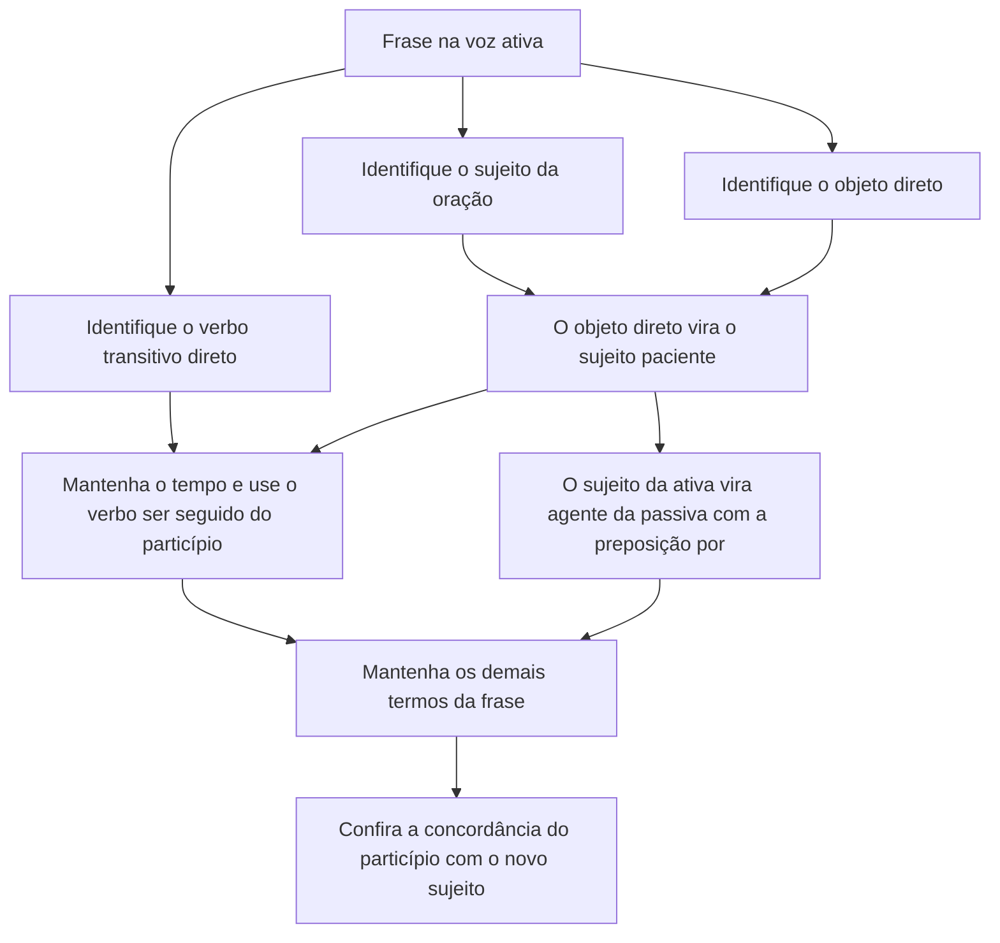

# Reescrita de Frases e Parágrafos

> [!info] Metadados
> **Disciplina:** Língua Portuguesa
> **Bloco:** 1.1 — Língua Portuguesa (FASE 1 — Fundamentos)
> **Tópico:** 6. Reescrita de frases e parágrafos
> **Subtópicos:** Transformação de voz (ativa/passiva) · Substituição de vocabulário (paráfrase) · Reorganização de períodos complexos · Correção de erros sintáticos e ortográficos
> **Pré-requisitos:** [[Compreensao-e-Interpretacao-de-Textos|Compreensão e interpretação de textos]]; [[Tipos-e-Generos-Textuais|Tipos e gêneros textuais]]; [[Ortografia-Oficial|Ortografia oficial]]; [[Coesao-Textual|Coesão textual]]; [[Classes-de-Palavras|Classes de Palavras]]; [[Sintaxe-da-Oracao|Sintaxe da Oração]]; [[Periodo-Composto|Período Composto]]; [[Pontuacao|Pontuação]]; [[Concordancia|Concordância]]; [[Regencia-e-Crase|Regência e Crase]]; [[Colocacao-Pronominal|Colocação Pronominal]]
> **Cargo:** Analista de TI — Perfil 3 (Desenvolvimento de Software) · DATAPREV 2026
> **Data:** 2026-08-27

---

## 1. Reescrever é dominar a estrutura

Nas notas anteriores, você construiu ferramentas de leitura e de escrita: passou a **compreender** o que um texto afirma e permite concluir ([[Compreensao-e-Interpretacao-de-Textos|Compreensão e interpretação de textos]]), a **reconhecer** os propósitos dos gêneros ([[Tipos-e-Generos-Textuais|Tipos e gêneros textuais]]), a **grafar** corretamente as palavras ([[Ortografia-Oficial|Ortografia oficial]]), a **coesionar** o texto ([[Coesao-Textual|Coesão textual]]) e a **estruturar** frases e orações com função, concordância, regência e pontuação corretas ([[Classes-de-Palavras|Classes de Palavras]], [[Sintaxe-da-Oracao|Sintaxe da Oração]], [[Periodo-Composto|Período Composto]], [[Pontuacao|Pontuação]], [[Concordancia|Concordância]], [[Regencia-e-Crase|Regência e Crase]], [[Colocacao-Pronominal|Colocação Pronominal]]). Faltava uma operação capaz de exigir tudo isso de uma só vez: você dominava o **reconhecimento**; agora precisa dominar a **produção**. É exatamente isso que a banca cobra neste último tópico do bloco.

O que é reescrita? É reformular um enunciado — uma frase, um período ou um parágrafo — trocando palavras, ordem, voz verbal ou estrutura das orações **sem alterar a informação essencial**. Quando a questão pede a "reescrita correta", a operação é a mesma, acrescida de um passo inicial: **detectar e corrigir** um desvio gramatical presente no original. No fundo, reescrever é **igualar o significado preservando — ou ajustando — a estrutura**. Guarde essa definição, porque ela explica por que a diferença entre a reescrita certa e a errada é quase sempre **estrutural**: um termo que muda de função sintática, um conectivo trocado, uma vírgula deslocada, uma voz verbal invertida.

Por que a banca cobra reescrita? Porque é a habilidade mais parecida com o trabalho real de um Analista de TI. O profissional que documenta um sistema, converte um requisito em linguagem clara, traduz um pedido do usuário para a equipe técnica ou corrige um manual está, o tempo todo, reformulando textos: precisa entender a informação, reorganizá-la e reescrevê-la sem perdas. A prova de reescrita simula exatamente esse processo — e testa, de quebra, se a gramática sustenta a operação.

Observe três versões de uma mesma informação:

> "A equipe de sustentação corrigiu a falha de segurança."
> "A falha de segurança foi corrigida pela equipe de sustentação."
> "A falha de segurança foi corrigida pelo sistema."

A primeira está na voz ativa; a segunda é a passiva correspondente; a terceira tem estrutura gramaticalmente perfeita, mas **inventou um agente** — "pelo sistema" — que o original jamais afirmou. Agora acrescente uma quarta versão: "A equipe de sustentação corrigiu, a falha de segurança." Aqui o defeito é de pontuação: a vírgula separou sujeito e predicado, o que é proibido. Faça a pergunta socrática: **em uma frase, o que separa a reescrita válida das duas inválidas?** A resposta é dupla: as inválidas ou mudaram a informação (inventaram o agente) ou introduziram um erro estrutural (a vírgula). Reescrita boa não é "outra frase bonita": é a frase que **preserva o sentido e respeita a gramática**.

> [!important] A observação da ementa que justifica esta nota
> "Praticar reescrita de frases do edital técnico ajuda a internalizar o conteúdo de outras disciplinas."
>
> Reescrever um trecho como "a DATAPREV desenvolve sistemas que apoiam a gestão previdenciária" treina língua portuguesa e fixa, ao mesmo tempo, o conteúdo técnico. Esse princípio vale para definições de bancos de dados, etapas de um ciclo de desenvolvimento, regras de segurança da informação. Por isso os exemplos desta nota usarão frases do universo de TI: cada exercício de reescrita será, também, uma revisão de conteúdo da área.

Vale notar que o título do tópico fala em reescrever "frases e parágrafos". Um parágrafo não é uma frase comprida: é uma sequência de frases organizadas em torno de uma ideia. Reescrever um parágrafo, portanto, é mais que trocar palavras em série — é garantir que cada frase continue exercendo o mesmo papel (a que introduz o tema, a que explica, a que conclui) e que os conectivos entre elas preservem os valores estudados em [[Coesao-Textual|Coesão textual]]. Se, em um parágrafo, você trocar a frase final de lugar e ela deixar de concluir, o parágrafo muda de sentido mesmo que cada frase isolada permaneça intacta. As técnicas desta nota funcionam nos dois níveis: a frase é a unidade de análise; o parágrafo é o teste real.

O caminho desta nota segue os quatro subtópicos da ementa. Primeiro, a **transformação de voz** — a operação mais mecânica e mais cobrada. Depois, a **paráfrase** — a substituição de vocabulário que exige sensibilidade semântica. Em terceiro, a **reorganização de períodos complexos** — a arte de deslocar orações sem deslocar o sentido. Em quarto, a **correção de erros sintáticos e ortográficos** — o uso da reescrita como exame final de tudo o que você estudou. Ao final, a estratégia de prova e o fechamento do bloco.

---

## 2. Voz ativa e passiva: quem pratica, quem recebe

Você já sabe, de [[Sintaxe-da-Oracao|Sintaxe da Oração]], que o verbo transitivo direto pede um **objeto direto** e que o **sujeito** é o termo com o qual o verbo concorda. Em [[Classes-de-Palavras|Classes de Palavras]], viu a classificação dos verbos. Falta agora uma pergunta que organiza essas informações de outro ângulo: **quem pratica a ação e quem a recebe?** A resposta é dada pela **voz verbal** — a relação que o verbo estabelece com o sujeito.

Na **voz ativa**, o sujeito pratica a ação verbal. Na frase "O sistema processa as transações bancárias", o sujeito "o sistema" é quem processa; o termo "as transações bancárias" é o objeto direto, que recebe a ação. Todo o resto — os adjuntos, os complementos, os tempos — permanece como está.

Na **voz passiva analítica**, o verbo passa a ser formado pelo auxiliar **ser** seguido do **particípio** do verbo principal, e o sujeito passa a **receber** a ação. "As transações bancárias são processadas pelo sistema." Repare o que aconteceu com os papéis: "as transações bancárias" saiu da função de objeto direto e virou **sujeito**; "o sistema" deixou de ser sujeito e virou **agente da passiva** — aquele termo que, na relação de voz, pratica a ação, introduzido pela preposição "por". Em [[Sintaxe-da-Oracao|Sintaxe da Oração]] o agente da passiva já apareceu como termo integrante da oração; aqui você o vê funcionando em uma transformação completa.

Existe ainda a **voz passiva sintética**, formada pelo verbo na terceira pessoa junto ao pronome "se" (o **se apassivador**): "Processam-se as transações bancárias." O sentido é o mesmo das duas versões anteriores; muda apenas a estrutura. Compare as três em uma tabela:

| Aspecto | Voz ativa | Voz passiva analítica | Voz passiva sintética |
|---|---|---|---|
| Quem pratica a ação | Sujeito (agente) | Agente da passiva ("por") | Não explícito |
| Quem recebe a ação | Objeto direto | Sujeito paciente | Sujeito paciente |
| Forma do verbo | Verbo ativo | Ser + particípio | Verbo na 3ª pessoa + "se" |
| Exemplo | O sistema processa as transações | As transações são processadas pelo sistema | Processam-se as transações |

> [!note] Definições que valem pontos
> **Voz ativa**: o sujeito pratica a ação ("a equipe executou o script").
> **Voz passiva analítica**: ser + particípio; o sujeito recebe a ação ("o script foi executado pela equipe").
> **Voz passiva sintética**: verbo na 3ª pessoa + "se" apassivador ("executou-se o script").

Antes de seguir, um cuidado de identificação: nem todo "é + particípio" é voz passiva. Compare "O relatório é robusto" e "O relatório é enviado". Na primeira, "é" é **verbo de ligação** ("robusto" é predicativo do sujeito — estado); na segunda, "é" é **auxiliar** e "enviado" é o particípio do verbo "enviar" — a estrutura expressa uma ação recebida pelo sujeito, logo é passiva. Como distinguir? Na passiva, o "é" pode ser flexionado no tempo sem perder o particípio ("o relatório será enviado", "o relatório foi enviado"); no estado, temos apenas a cópula. A pergunta-chave para reconhecer a voz é sempre: **o sujeito pratica ou recebe a ação?** Se recebe, passiva — e aí você decide se ela é analítica (com o auxiliar visível) ou sintética (com o "se").

Por fim, lembre que o auxiliar da passiva analítica não precisa ser "ser" em todos os tempos: "estar" e "ficar" também servem quando o particípio expressa o resultado de uma ação. "A versão está homologada" e "A versão foi homologada" são ambas passivas; a diferença é aspectual — "está homologada" destaca o estado resultante, "foi homologada" destaca o processo. Em qualquer das duas, o sujeito "a versão" recebe a ação de homologar. A reescrita que troca um auxiliar pelo outro preserva o sentido essencial, desde que não mude o tempo nem os papéis.

---

## 3. A mecânica da conversão: da ativa para a passiva

Converter a voz exige método. Pegue a frase "O técnico executou o script de manutenção" e siga, passo a passo, a operação que transforma a ativa na passiva analítica:

1. **Identifique o sujeito da ativa**: "o técnico" — é quem pratica a ação.
2. **Identifique o verbo e sua transitividade**: "executou" é transitivo direto; logo, há objeto direto disponível, e a passiva é possível.
3. **Identifique o objeto direto**: "o script de manutenção" — é quem recebe a ação.
4. **Transforme o objeto direto em sujeito paciente**: "o script de manutenção" ocupa agora a posição de sujeito.
5. **Mantenha o tempo verbal e troque a forma do verbo**: "executou" (pretérito perfeito) vira "foi executado" (auxiliar ser no mesmo tempo + particípio).
6. **Transforme o sujeito da ativa em agente da passiva**: "o técnico" vira "pelo técnico", com a preposição "por".
7. **Mantenha os demais termos e confira a concordância**: o particípio concorda em gênero e número com o novo sujeito.

O resultado é "O script de manutenção foi executado pelo técnico." O fluxograma abaixo resume a sequência para qualquer frase:

O ponto mais sensível da conversão é o tempo verbal: **quem muda é a forma; quem não muda é o tempo**. Se a ativa está no presente, a passiva fica no presente; se está no pretérito, fica no pretérito. O auxiliar "ser" carrega o tempo e o particípio carrega a ideia do verbo principal. Veja a tabela completa:

| Tempo | Forma ativa | Passiva analítica correspondente |
|---|---|---|
| Presente | A equipe processa os dados | Os dados são processados pela equipe |
| Pretérito perfeito | O técnico corrigiu o erro | O erro foi corrigido pelo técnico |
| Pretérito imperfeito | O suporte mantinha os logs | Os logs eram mantidos pelo suporte |
| Futuro do presente | O time entregará a versão | A versão será entregue pelo time |
| Futuro do pretérito | O sistema geraria o relatório | O relatório seria gerado pelo sistema |
| Mais-que-perfeito composto | A equipe tinha validado as regras | As regras tinham sido validadas pela equipe |
| Gerúndio composto | O sistema está executando a tarefa | A tarefa está sendo executada pelo sistema |

Dois detalhes que a banca adora explorar. Primeiro, o **particípio concorda** com o novo sujeito: "o script foi executado", "as regras foram validadas", "a versão será entregue". Segundo, alguns verbos têm mais de um **particípio** — um **regular** (terminado em "ado/ido") e um **curto** (de forma própria): "entregar → entregado/entregue", "aceitar → aceitado/aceito", "imprimir → imprimido/impresso". Eles não são intercambiáveis à vontade; a norma estabelece um critério de auxiliar: com **ser, estar e ficar** — que é o caso da voz passiva — usa-se o particípio **curto**: "a versão foi entregue", "o sistema ficou aceito"; com **ter e haver** usa-se, de preferência, o **regular**: "a equipe tinha entregado a versão", "havia imprimido o relatório". Na conversão de voz, portanto, use a forma curta, porque a passiva é construída com "ser" — e lembre-se de que a concordância acompanha o novo sujeito em gênero e número.

A conversão também funciona ao contrário, da passiva para a ativa — e é exatamente o que a banca pede quando pergunta "qual frase corresponde à voz ativa". Tome "O backup foi restaurado pelo administrador". O caminho inverso tem quatro passos: identifique o **sujeito paciente** ("o backup"); identifique o **agente da passiva** ("pelo administrador"); transforme o agente em **sujeito ativo** ("o administrador"); transforme "foi restaurado" no verbo ativo do mesmo tempo ("restaurou") e devolva o sujeito paciente à função de **objeto direto** ("o backup"). Resultado: "O administrador restaurou o backup." Percorra os dois sentidos até eles ficarem automáticos — o teste rápido abaixo ajuda.

> [!tip] O teste rápido da conversão
> Depois de converter, **volte a frase para a voz original** mentalmente. Se você conseguir reconstruir o enunciado inicial sem sobrar nem faltar informação, a conversão está correta. Esse teste também revela uma falsa alternativa comum: quando o original é "O relatório foi gerado automaticamente" (sem agente), a reescrita "O sistema gerou o relatório automaticamente" **acrescenta um agente** que não estava no texto — é uma paráfrase defeituosa. Sempre que a passiva não trouxer agente, não invente um na ativa.

---

## 4. A passiva sintética: o pronome "se" apassivador

A voz passiva não precisa do auxiliar "ser". Quando o verbo aparece na terceira pessoa acompanhado do pronome "se", e há um objeto direto disposto a virar sujeito, temos a **passiva sintética** (também chamada de pronominal): "Enviaram-se os relatórios", "Vendem-se casas", "Concedem-se benefícios previdenciários". No universo da DATAPREV: "Processam-se as solicitações de benefício."

A regência dessa construção é simples e é, justamente, o que a banca testa: na passiva sintética, o termo que recebe a ação é o **sujeito**, e o verbo **concorda com ele**. Por isso dizemos "Enviou-se o relatório" (singular) e "Enviaram-se os relatórios" (plural). A frase "Enviou-se os relatórios" — muito comum na fala — é um erro de concordância, e a reescrita que o corrige é "Enviaram-se os relatórios" ou "Os relatórios foram enviados." O mesmo raciocínio vale quando o verbo é transitivo direto **e** indireto: em "Enviaram-se os relatórios à diretoria", o objeto indireto "à diretoria" permanece intacto; só o objeto direto "os relatórios" é promovido a sujeito.

Uma última observação conecta a voz às regras da paráfrase, que virão adiante: a passiva sintética **omite o agente**. Se o original diz "A equipe processa as solicitações" (agente explícito), a reescrita "Processam-se as solicitações" **suprime** quem processa — a informação "a equipe" desapareceu. A passiva sintética só é reescrita válida quando o original não explicita o agente ("Processam-se as solicitações a cada dia" não afirma quem processa; nenhuma informação se perde ao mantê-la assim) ou quando o agente é genérico e irrelevante. Esse limite será o terceiro teste da paráfrase.

A confusão clássica é entre a passiva sintética e outro uso do "se": a **voz reflexiva**. Compare estas duas frases:

> "O sistema se reinicia após a atualização."
> "Reinicia-se o servidor toda madrugada."

Na primeira, o sistema é, ao mesmo tempo, quem pratica e quem recebe a ação: ele reinicia **a si mesmo**. Isso é voz reflexiva. Na segunda, o servidor **recebe** a ação de um agente externo (a equipe de operação): não é o servidor que se reinicia sozinho — é reiniciado. Isso é passiva sintética. O teste mnemônico: a reflexiva aceita a expressão "a si mesmo" ("o sistema se reinicia a si mesmo"); a passiva equivale a "ser + particípio" ("o servidor é reiniciado [pela equipe]"). O "se" das duas frases é o mesmo pronome; a diferença está na **relação de papéis** — e é exatamente essa diferença que a questão vai explorar.

---

## 5. Pegadinhas da transformação de voz

A transformação de voz é mecânica, e é por isso que a banca a cerca de armadilhas. Vamos desarmar as quatro principais.

**Primeira pegadinha — passiva sintética × sujeito indeterminado.** Compare "Vendem-se casas" e "Precisa-se de técnicos". Ambas têm "se"; o tratamento gramatical é oposto. A primeira pode ser transposta para a passiva analítica: "Casas são vendidas" — portanto o "se" é apassivador e "casas" é sujeito. A segunda **não** pode: "Técnicos são precisados" não existe; logo, "se" é índice de indeterminação do sujeito e "de técnicos" é objeto indireto. Os testes que distinguem as construções: (a) a transposição para a passiva analítica funciona? (b) a passiva aceita agente da passiva ("Vendem-se casas pelo proprietário"), enquanto a indeterminada não; (c) na passiva sintética o verbo concorda com o termo que seria objeto direto na ativa ("Enviaram-se os relatórios"), enquanto na indeterminada o verbo fica sempre no singular ("Precisa-se de técnicos"). Em resumo: **"se" apassivador vem com verbo transitivo direto e sujeito explícito; "se" indeterminador vem com verbo intransitivo ou transitivo indireto e sem sujeito.** Essa distinção já foi trabalhada em [[Sintaxe-da-Oracao|Sintaxe da Oração]] e em [[Concordancia|Concordância]]; aqui ela decide se a reescrita está certa ou errada.

> [!warning] Pegadinha 2 — o agente da passiva não é sujeito
> **A armadilha:** "O backup foi restaurado pelo administrador." A questão pergunta qual é o sujeito, e o candidato responde "o administrador", porque é ele quem faz a ação.
> **O raciocínio errado:** confundir "quem pratica a ação" com "sujeito". Na passiva, quem pratica é o **agente da passiva** — termo introduzido por "por" — e não o sujeito.
> **Como se proteger:** na voz passiva, o sujeito é sempre o termo **paciente**, aquele que recebe a ação. Na frase acima, o sujeito é "o backup". Sublinhe o sujeito antes de responder; em seguida, verifique se o termo vem precedido de "por" — se vier, é agente da passiva.

**Terceira pegadinha — nem todo verbo passiviza.** A passiva exige **objeto direto**. Verbos exclusivamente transitivos indiretos, que pedem objeto indireto com preposição, não formam voz passiva na norma tradicional: "gostar de música" não vira "música é gostada"; "confiar no sistema" não vira "o sistema é confiado". O caso clássico de concurso é "assistir ao filme" — e aqui mora uma sutileza. No sentido de **ver**, "assistir" é transitivo indireto, e a passiva "o filme foi assistido" é rejeitada pela norma culta tradicional, ainda que o uso corrente a esteja difundindo; em prova, a alternativa que apresenta essa passiva como equivalente de "assistiu ao filme" deve ser tratada com desconfiança. Já no sentido de **socorrer, tomar conta**, "assistir" é transitivo direto e a passiva é legítima: "o médico assiste o paciente" → "o paciente foi assistido pelo médico". Com os verbos transitivos diretos e indiretos, a regra se mantém: a passiva toma por sujeito o **objeto direto**. "O gerente comunicou o resultado aos diretores" → "O resultado foi comunicado aos diretores pelo gerente", e não "os diretores foram comunicados ao resultado".

**Quarta pegadinha — reflexiva com aparência de passiva.** Voltamos ao par da seção anterior: "O sistema se reinicia" (reflexiva) não equivale a "Reinicia-se o servidor" (passiva sintética). Na reescrita, trocar uma pela outra **muda o sentido**: numa, a ação parte do próprio sujeito; na outra, parte de um agente externo. Se a questão diz que as duas frases são equivalentes, está montada a armadilha.

Antes de sair da transformação de voz, monte o seu **checklist de prova**: (1) verifique se o verbo é transitivo direto — sem objeto direto não há passiva; (2) converta o objeto direto em sujeito paciente; (3) mantenha o tempo e troque a forma do verbo; (4) transforme o sujeito da ativa em agente da passiva com "por" — e ele precisa ser **o mesmo agente** do original; (5) confira a concordância do particípio e o número do verbo nas passivas sintéticas. Quem roda o checklist na ordem nunca troca a voz e o agente ao mesmo tempo.

> [!note] A regra que atravessa tudo
> Ao converter da ativa para a passiva — ou vice-versa — **mantenha o agente original**. Se o original diz "a equipe restaurou o backup", a passiva correta é "o backup foi restaurado pela equipe"; escrever "pelo sistema" é gramaticalmente possível, mas semanticamente falso. A banca costuma oferecer exatamente essa falsa alternativa. E não apenas o agente precisa ser preservado: os **complementos e os predicativos também**. Em "A equipe considerou a solução eficiente", a passiva correta é "A solução foi considerada eficiente pela equipe" — o predicativo "eficiente" continua onde está, porque ele caracteriza a solução em qualquer das duas vozes.

---

## 6. Paráfrase: dizer a mesma coisa de outro jeito

Você já encontrou a paráfrase na [[Compreensao-e-Interpretacao-de-Textos|Compreensão e interpretação de textos]], como um exercício de leitura: parafrasear é **reescrever com as próprias palavras mantendo o sentido**, distinguindo-se do plágio, que copia. Na reescrita técnica, a paráfrase opera em dois níveis: trocar **vocabulário** (sinônimos, hiperônimos, expressões equivalentes — mecanismos que você já conhece da [[Coesao-Textual|Coesão textual]]) e trocar **estruturas** (voz, ordem, tipo de oração), sempre sem alterar o **valor semântico**. O que importa não é a palavra usada, é a **informação preservada**.

Observe:

> "O comitê aprovou o plano de contingência após a análise dos riscos."
> "Depois de analisar os riscos, o comitê deu parecer favorável ao plano de contingência."

A paráfrase mudou a ordem (o "depois" foi para o início), substituiu "aprovou" por "deu parecer favorável" e transformou "após a análise" em "depois de analisar". Nada mudou de verdade: o mesmo comitê aprovou o mesmo plano, pelo mesmo motivo e na mesma sequência. Agora, imagine que a reescrita fosse: "Após a análise dos riscos, o comitê reprovou o plano de contingência." A palavra "reprovou" é um **antônimo** de "aprovou" — e a troca por antônimo é a forma mais grosseira de inversão de sentido. Existem formas mais sutis, e são elas que a banca usa.

O primeiro cuidado da paráfrase é **manter a relação semântica dos conectivos** — o tema central da [[Coesao-Textual|Coesão textual]], lembrando que o conector só ganha valor no contexto. A frase "O sistema é robusto, **mas** exige monitoramento constante" estabelece **oposição** entre ser robusto e exigir monitoramento. A paráfrase "O sistema é robusto, **portanto** exige monitoramento constante" muda a relação: "portanto" instaura **conclusão**, não oposição — e a informação deixou de ser a mesma. A paráfrase correta seria "O sistema é robusto, **todavia** exige monitoramento constante", porque "todavia" tem exatamente o valor de "mas". Guarde os paradigmas de conectivos com o mesmo valor: oposição ("mas, porém, todavia, contudo"), causa ("porque, já que, uma vez que"), condição ("se, caso"), finalidade ("para que, a fim de que"), conclusão ("portanto, logo, por conseguinte"), proporção ("à medida que, à proporção que"). Atenção ao par clássico de pegadinha: "**à medida que**" indica proporção, enquanto "**na medida em que**" é usado com valor de causa — não são intercambiáveis.

O segundo cuidado é **não trocar o ponto de vista**: a paráfrase pode mudar a voz ("a equipe executou o script" → "o script foi executado pela equipe"), mas o agente e o paciente precisam continuar os mesmos. O terceiro cuidado é evitar os **falsos sinônimos** — palavras parecidas que não significam a mesma coisa. No mundo técnico, dois pares merecem atenção especial: "**ratificar**" (confirmar, validar) e "**retificar**" (corrigir): dizer que "o auditor ratificou os dados" não é o mesmo que dizer que "os retificou". E "**eficiência**" (fazer certo com o mínimo de recursos) e "**eficácia**" (atingir o resultado): um sistema pode ser eficaz e ineficiente, ou eficiente e ineficaz. Reescrever trocando uma pela outra altera silenciosamente o conteúdo.

No contexto técnico, é comum a tentação de tratar **estrangeirismos** e suas traduções como sinônimos perfeitos: "backup" e "cópia de segurança", "deploy" e "publicação", "log" e "registro de eventos". Em muitos casos a troca é legítima — "a equipe realizou o backup" e "a equipe realizou a cópia de segurança" dizem o mesmo na maioria dos manuais. Mas o nível de precisão muda: "deploy" costuma designar o processo completo de publicação e ativação, enquanto "publicação" pode significar apenas a disponibilização de conteúdo. Reescrever "o deploy foi concluído" como "a publicação foi concluída" pode, em um texto técnico rigoroso, **encurtar** o que o original afirmava. A regra é a mesma dos falsos sinônimos: a equivalência não está na semelhança das palavras, está na igualdade do que elas afirmam no contexto.

A paráfrase também usa a **hiperonímia** — a relação de abrangência que você estudou na [[Coesao-Textual|Coesão textual]] — mas com limite: "O ambiente executa MySQL, PostgreSQL e Oracle" pode virar "O ambiente executa vários bancos de dados relacionais". Isso é paráfrase válida: o hiperônimo "bancos de dados relacionais" cobre os três itens, e nenhuma informação essencial se perde — as marcas em si eram exemplos. Mas "O sistema registra as tentativas de acesso de usuários não autorizados" não pode virar "O sistema registra os dados" — aqui o hiperônimo **suprime** informação decisiva (quais dados? de quem?). A fronteira é a mesma dos testes da próxima seção: a abrangência não pode engolir a informação que o texto considerava relevante.

> [!warning] Pegadinha clássica — o conector com valor trocado
> A reescrita "Os usuários não acessaram o portal **porque** o certificado expirou" é válida. A reescrita "Os usuários não acessaram o portal **embora** o certificado tenha expirado" **não** é: "porque" é causa, "embora" é concessão — uma diz que a expiração **explica** o bloqueio; a outra diz que o bloqueio ocorreu **apesar de** a expiração ter ocorrido. Antes de marcar uma alternativa, substitua mentalmente o conectivo por outro do valor que você suspeita: se o sentido mudar, o valor era outro.

---

## 7. Os três testes da paráfrase

Como saber, diante de duas frases, se uma é realmente paráfrase da outra? Aplique três testes, sempre nesta ordem:

| Teste | Pergunta | Falha típica |
|---|---|---|
| 1. Papéis | O agente e o paciente foram mantidos? | Trocar a voz e inverter os papéis ("o sistema testou a equipe" no lugar de "a equipe testou o sistema") |
| 2. Conectivo | O valor semântico do conectivo está igual? | Trocar "porque" (causa) por "embora" (concessão) ou "mas" (oposição) por "portanto" (conclusão) |
| 3. Informação | Nada foi acrescentado nem suprimido? | Introduzir "apenas", "sempre", um dado novo, ou omitir uma condição |

Aplique os testes a uma frase-base tecnológica:

> "Como o certificado digital expirou, os usuários não conseguiram acessar o portal."

A paráfrase "Os usuários não conseguiram acessar o portal porque o certificado digital expirou" passa nos três testes: os papéis são os mesmos (usuários + portal + certificado), o conectivo continua causal ("como" e "porque" têm o mesmo valor aqui), e nenhuma informação entrou ou saiu. Agora, a reescrita "Os usuários não conseguiram acessar o portal **porque o certificado digital expirou e a rede estava instável**" falha no terceiro teste: a rede instável foi **acrescentada** — não estava no original. E a reescrita "**Embora** o certificado digital tenha expirado, os usuários não conseguiram acessar o portal" falha no segundo: o valor passou de causa para concessão.

Veja mais um caso de falha no terceiro teste, agora por **supressão** — o lado simétrico do acréscimo. Se o original diz "A equipe corrigiu as falhas críticas do módulo de pagamento", a reescrita "A equipe corrigiu as falhas do módulo de pagamento" omitiu o adjetivo "críticas" — e "críticas" não é enfeite: é uma qualificação que define a gravidade das falhas. Sem ela, a frase passa a afirmar mais do que o original (todas as falhas, e não apenas as críticas). A paráfrase que "economiza palavras" cortando qualificação costuma ser a mais traiçoeira, porque parece apenas mais curta.

Um caso de paráfrase que merece destaque é a **equivalência por dupla negação**. A frase "O sistema só permite acesso mediante autenticação" equivale a "O sistema não permite acesso sem autenticação": as duas afirmam que autenticar é condição necessária para acessar. A equivalência pede atenção ao sinal — a reescrita "O sistema não permite acesso mediante autenticação" inverte tudo: agora a autenticação impede o acesso. E a versão "O sistema não impede o acesso sem autenticação" nega de novo e volta a afirmar o contrário do original. Na paráfrase com negações, o teste dos papéis precisa ser feito duas vezes: uma para o que é **afirmado** e outra para o que é **negado**.

> [!tip] A ordem dos testes salva a questão
> Em uma questão de "assinale a reescrita que mantém o sentido", comece pelos **papéis**, continue pelo **conectivo** e termine pela **informação**. Só depois dessa triagem você confere a forma gramatical (concordância, crase, regência, pontuação). Nove em cada dez alternativas erradas morrem no primeiro ou no segundo teste — e você elimina sem precisar entrar em minúcias normativas.

---

## 8. Reorganização de períodos complexos

O terceiro subtópico opera sobre períodos — estruturas com mais de uma oração, que você estudou em [[Periodo-Composto|Período Composto]]: a **coordenação**, em que as orações são independentes, e a **subordinação**, em que uma oração depende da principal. Reorganizar um período é **deslocar orações, trocar a ordem, transformar orações reduzidas em desenvolvidas (e vice-versa) e inverter a voz** — tudo sem alterar o valor semântico das relações. É aqui que a reescrita encontra a coesão: a ordem dos termos e das orações organiza a informação, e a pontuação registra essa organização.

Comece pelo deslocamento mais simples: mudar de posição um **adjunto adverbial** sem mudar o sentido. "A equipe restaurou o backup imediatamente após a falha" pode virar "Imediatamente após a falha, a equipe restaurou o backup." A informação é a mesma; o que muda é a ênfase e a pontuação — o adjunto anteposto passa a ser separado por vírgula, como você estudou em [[Pontuacao|Pontuação]]. O mesmo raciocínio vale dentro do período: "O sistema, após a atualização, ficou mais estável" e "Após a atualização, o sistema ficou mais estável" dizem exatamente a mesma coisa, com a vírgula marcando cada deslocamento.

A ordem das orações subordinadas também pode ser reorganizada, desde que a relação se preserve: "Quando a fila de processamento fica cheia, o sistema prioriza as transações críticas" equivale a "O sistema prioriza as transações críticas quando a fila de processamento fica cheia." Em ambos os casos, o valor temporal/condicional é o mesmo. O problema surge quando o deslocamento **altera a relação**: transformar "Como o certificado expirou, o acesso foi bloqueado" em "O acesso foi bloqueado, portanto o certificado expirou" não é reorganização — é **inversão de causa e consequência**, uma das pegadinhas mais rentáveis para as bancas.

E a reorganização pode até **trocar o tipo de período**, da coordenação para a subordinação, sem alterar a informação. A frase coordenada "A rua está molhada, portanto choveu" expressa uma conclusão: o estado da rua leva à conclusão de que choveu. A versão subordinada "Como choveu, a rua está molhada" expressa a mesma relação — causa e efeito — com outra arquitetura: a oração causal anteposta à principal. O sentido é preservado; o que mudou foi a costura sintática. Esse tipo de transformação é frequente nas questões "assinale a reescrita que mantém o sentido": a banca oferece versões com o mesmo conteúdo em roupagens sintáticas diferentes, e uma delas, em geral, inverte a seta causal.

Há, ainda, uma assimetria de posições que limita a reorganização. A conjunção **concessiva** "embora" transita livremente entre as duas pontas do período: "Embora o sistema seja antigo, permanece estável" e "O sistema permanece estável, embora seja antigo" dizem a mesma coisa. Já a **causal** "como" só abre o período: "Como o certificado expirou, o acesso foi bloqueado" é natural; "O acesso foi bloqueado como o certificado expirou" soa estranho — nessa posição, o preferido é "porque". Por outro lado, "porque" fica bem no final ("O acesso foi bloqueado porque o certificado expirou"), mas forçado na abertura ("Porque o certificado expirou, o acesso foi bloqueado"). Na prática: ao reorganizar uma oração causal, se a conjunção original ficar deslocada, a reescrita precisa **trocar a conjunção** (por outra de mesmo valor) em vez de arrastar a palavra original para uma posição que a língua não aceita. A banca testa exatamente essa percepção: a alternativa "gramaticalmente possível, mas com a conjunção no lugar errado" é uma pegadinha típica.

E aqui chegamos ao ponto mais sutil da reorganização: a oração adjetiva **restritiva** e a **explicativa**. A diferença é uma vírgula — e essa vírgula muda o sentido por completo. Observe:

> "Os usuários que são administradores podem alterar as permissões."
> "Os usuários, que são administradores, podem alterar as permissões."

Na primeira (restritiva), a oração **restringe**: apenas os usuários administradores podem alterar permissões; os demais, não. Na segunda (explicativa), a oração acrescenta uma informação: **todos** os usuários podem alterar permissões — e, de passagem, o texto afirma que todos eles são administradores. A vírgula não é enfeite: ela **altera a extensão do conjunto de que se fala**. Reorganizar "colocando uma vírgula" ou "tirando a vírgula" sem perceber essa mudança é errar a reescrita mantendo a gramática perfeita.

> [!warning] Pegadinha da restritiva × explicativa
> **A armadilha:** a questão apresenta a frase "Os servidores que estão em produção recebem patches automáticos" e oferece como "reorganização preservando o sentido" a versão "Os servidores, que estão em produção, recebem patches automáticos."
> **O raciocínio errado:** achar que a vírgula é um detalhe opcional de pontuação.
> **Como se proteger:** pergunte-se: **a oração limita ou apenas explica?** Sem vírgula, restringe — só os servidores em produção recebem patches. Com vírgula, explica — todos os servidores recebem patches, e acrescenta-se que eles estão em produção. Se o original é restritivo, a reescrita correta também deve ser; se é explicativo, idem.

---

## 9. Orações reduzidas × desenvolvidas: transformar sem trocar o valor

Em [[Periodo-Composto|Período Composto]], você viu que as orações subordinadas podem aparecer **desenvolvidas** (com conjunção e verbo conjugado) ou **reduzidas** (no infinitivo, no gerúndio ou no particípio, sem conjunção). A reescrita pode converter uma forma na outra — desde que o valor semântico seja preservado.

Veja o caso de uma reduzida de **infinitivo**: "Ao concluir o teste, o analista deve liberar a versão." A oração "Ao concluir o teste" tem valor **temporal**; a versão desenvolvida correspondente é "Quando o analista concluir o teste, deve liberar a versão." A reescrita "Embora o analista conclua o teste, deve liberar a versão" mantém a estrutura sintática de subordinação, mas **troca o valor**: criou uma concessão onde havia tempo. É o erro sutil de valor: a oração continua subordinada, o período continua complexo — mas a relação semântica mudou, e com ela a informação.

O mesmo cuidado vale para as reduzidas de **gerúndio**: "O certificado expirou, impedindo o acesso dos usuários" equivale a "O certificado expirou, o que impediu o acesso dos usuários" — nas duas versões, o impedimento é **consequência** da expiração. Já "O certificado expirou **porque** impediu o acesso dos usuários" transmite outra relação: agora a expiração seria consequência do impedimento, o que inverte causa e efeito. E para as reduzidas de **particípio**: "Terminada a análise, o comitê aprovou o plano" equivale a "Depois que a análise foi terminada, o comitê aprovou o plano" (valor temporal); não equivale a "Como o comitê aprovou o plano, a análise foi terminada".

Um caso especialmente delicado envolve a reduzida de infinitivo com "ao" em instruções de interface: "Ao clicar em 'enviar', o formulário é submetido" tanto pode ser desenvolvida como **temporal** ("Quando o usuário clicar em 'enviar', o formulário é submetido") quanto como **condicional** ("Se o usuário clicar em 'enviar', o formulário é submetido"). As duas desenvolvidas são legítimas — o contexto (um manual de instruções) admite os dois valores. Já "Embora o usuário clique em 'enviar', o formulário é submetido" é um erro: introduz uma concessão que não existe no original. A regra prática: a conjunção escolhida para desenvolver a reduzida precisa ser **compatível com o valor original** — não basta ser uma conjunção gramaticalmente possível. Resuma o par transformável em uma tabela:

| Oração reduzida | Valor original | Desenvolvida correta | Desenvolvida que troca o valor |
|---|---|---|---|
| Ao concluir o teste, o analista libera a versão | Tempo | Quando o analista conclui o teste, libera a versão | Embora o analista conclua o teste, libera a versão (concessão) |
| O certificado expirou, impedindo o acesso | Consequência | O certificado expirou, o que impediu o acesso | O certificado expirou porque impediu o acesso (causa invertida) |
| Terminada a análise, o comitê aprovou o plano | Tempo | Depois que a análise foi terminada, o comitê aprovou o plano | Como o comitê aprovou o plano, a análise foi terminada (relação invertida) |

Nas três linhas, a coluna "desenvolvida que troca o valor" é a armadilha: a oração continua subordinada e o período continua correto, mas a relação semântica mudou — e uma única alternativa costuma reproduzir exatamente esse erro.

> [!tip] A pergunta que revela o valor da reduzida
> Diante de uma oração reduzida, pergunte: **qual conjunção estaria presente se ela fosse desenvolvida?** "Ao + infinitivo" → "quando" (tempo) ou "se" (condição); gerúndio inicial → "como/já que" (causa) ou "se" (condição); gerúndio após a principal → consequência; particípio → "depois que/uma vez que" (tempo). A conjunção que você escolher precisa ser compatível com o valor original — trocá-la por outra conjunção "possível" mas de valor distinto é a pegadinha típica desta parte.

---

## 10. Correção de erros: a reescrita como exame final da morfossintaxe

O último subtópico inverte a direção: em vez de reescrever mantendo o sentido, o candidato recebe uma frase **com erro** e precisa produzir a versão **correta**. Aqui se cruzam as quatro frentes normativas do bloco: a **regência** e a **crase** ([[Regencia-e-Crase|Regência e Crase]]), a **concordância** ([[Concordancia|Concordância]]), a **pontuação** ([[Pontuacao|Pontuação]]) e a **grafia** ([[Ortografia-Oficial|Ortografia oficial]]). Reescrever corretamente é diagnosticar qual dessas frentes falhou e corrigir apenas ela — sem alterar o sentido.

O método tem três passos. Primeiro, **localize o desvio**: a frase "Os analistas preferem desenvolver em Python do que em Java" apresenta um erro de regência — o verbo "preferir" é transitivo direto e rege a preposição "a", não a estrutura "do que". Segundo, **corrija o desvio preservando o resto**: "Os analistas preferem desenvolver em Python a Java" (ou, mais elegante, "preferem Python a Java"). Terceiro, **confira se a correção não criou um novo problema**: "Os analistas preferem mais Python do que Java" corrigiria a regência trocando-a por outra incorreta — "preferir" não admite o reforço "mais", justamente porque já carrega a ideia de preferência.

Pense no estilo de questão típico: o enunciado pede "assinale a alternativa que reescreve corretamente a frase". O original é "Enviou-se os relatórios diários ao setor responsável." As alternativas apresentam variações: (a) "Enviaram-se os relatórios diários ao setor responsável"; (b) "Foram enviados os relatórios diários ao setor responsável"; (c) "Enviou-se os relatórios diários ao setor responsável"; (d) "Enviaram-se os relatórios diários para o setor responsável". Qual escolher? O erro do original é de **concordância do se apassivador**: "os relatórios" é sujeito plural, logo "enviaram-se". A alternativa (a) corrige exatamente isso. A (b) também está correta gramaticalmente (passiva analítica) — e é a pegadinha: corrige o erro, mas **mudou a voz**; a questão, quando exige "reescrever corretamente", costuma esperar a correção mínima e precisa, não uma reformulação completa. A (d) trocou a regência ("ao setor" por "para o setor") sem corrigir a concordância. A (c) repete o erro original. O vencedor é (a): corrige o desvio apontado e muda o mínimo possível.

Repita o exercício com um desvio de crase. O original "O pedido foi encaminhado a equipe de suporte" apresenta a mesma estrutura da reescrita errada: o verbo "encaminhar" exige a preposição "a", e o termo "a equipe de suporte" recebe o artigo "a" — os dois "a" se fundem e nasce a crase: "O pedido foi encaminhado **à** equipe de suporte." A versão "para a equipe de suporte" trocaria a regência (e, com ela, o valor de movimento/direção de "para"); a versão mantendo "a equipe" sem acento repete o erro. A correção certa mexe em uma única letra — e é a única alternativa que a banca aceita.

Falta a frente que o título do subtópico anuncia: a **ortografia** ([[Ortografia-Oficial|Ortografia oficial]]). Os erros de grafia entram na reescrita correta principalmente pelos **homônimos** — palavras de forma ou pronúncia parecidas com significados distintos. "O analista verificou o **cumprimento** do prazo" (o ato de cumprir) não pode virar "o analista verificou o **comprimento** do prazo" (a medida, o tamanho); "o sistema **emergiu** do ambiente de testes" (veio à tona) não pode virar "**imergiu**" (mergulhou); "o relatório foi **discriminado** por tipo" (separado, detalhado) não pode virar "**descriminado**" (inocentado). Na reescrita, o erro ortográfico costuma vir disfarçado de "correção": a alternativa muda a grafia de um homônimo e apresenta a frase como se ela fosse a versão certa do original. O teste é o mesmo de sempre — o sentido precisa continuar sendo o mesmo.

> [!note] Reescrever corretamente ≠ reescrever "bonito"
> A banca não pede a frase mais elegante; pede a frase **certa**. A correção que altera a voz, desloca o adjunto ou troca a preposição — tudo gramaticalmente possível — pode ser uma alternativa errada simplesmente porque **mexeu no que não devia**. Regra de ouro: corrija o erro, preserve o resto.

---

## 11. Os erros campeões de reescrita

Alguns desvios se repetem em toda prova de reescrita. Conhecê-los é triagem instantânea. O primeiro é a **crase mal empregada** (você a estudou em [[Regencia-e-Crase|Regência e Crase]]): "O acesso ao ambiente de homologação é restrito **a** equipe de testes" exige crase — "restrito **à** equipe de testes" (preposição "a" + artigo "a"). Já "o acesso é restrito a usuários externos" não admite crase, porque "usuários" é plural e não recebe artigo "a". A reescrita que introduz crase onde não há — ou que a retira onde há — está errada, mesmo mantendo o sentido.

O segundo é a **concordância do "se" apassivador**, que você viu na seção anterior: "Faz-se análises" é erro; o correto é "Fazem-se análises" (ou "São feitas análises"). O erro soa natural na fala — e é por isso que a banca o oferece como alternativa "que parece certa".

O terceiro é a **regência trocada**: além do "preferir X do que Y", aparecem "implicar em" ("A mudança implica em revisão" é rejeitado pela norma; o correto é "A mudança implica revisão", pois "implicar" no sentido de acarretar é transitivo direto) e "obedecer sem preposição" ("o sistema obedece o protocolo" — o correto é "obedece **ao** protocolo", transitivo indireto). O quarto é a **vírgula separando sujeito e predicado**: "O servidor, apresentou instabilidade" é erro de pontuação; a vírgula não pode separar o sujeito do verbo.

O quinto é o **paralelismo sintático quebrado** — conceito que se liga a [[Classes-de-Palavras|Classes de Palavras]]. Quando orações ou termos são coordenados, eles devem assumir estruturas equivalentes. Compare: "O sistema é rápido, seguro e **apresenta baixo custo**" — dois adjetivos e uma oração; a série não é paralela. A versão paralela: "O sistema é rápido, seguro e **econômico**" (três adjetivos). A reescrita que não respeita o paralelismo "quebra" a estrutura, ainda que cada parte isolada esteja correta.

O sexto é a **grafia de homônimos**, que você viu na seção anterior: "cumprimento/comprimento", "emergir/imergir", "discriminar/descriminar". Na reescrita, o erro ortográfico quase nunca aparece sozinho — ele entra como "correção" de outro desvio. Por isso a ordem do método vale aqui também: depois de corrigir o alvo, releia a alternativa inteira; se um homônimo foi trocado no caminho, a "correção" é falsa.

| Erro campeão | Frase errada | Reescrita correta |
|---|---|---|
| Crase mal empregada | O acesso é restrito a equipe de testes | O acesso é restrito à equipe de testes |
| Concordância do se apassivador | Enviou-se os relatórios | Enviaram-se os relatórios |
| Regência trocada | A mudança implica em revisão | A mudança implica revisão |
| Regência sem preposição | O sistema obedece o protocolo | O sistema obedece ao protocolo |
| Vírgula entre sujeito e verbo | O servidor, apresentou instabilidade | O servidor apresentou instabilidade |
| Paralelismo quebrado | O sistema é rápido, seguro e apresenta baixo custo | O sistema é rápido, seguro e econômico |
| Grafia de homônimo | O analista verificou o comprimento do prazo | O analista verificou o cumprimento do prazo |

> [!tip] A reescrita como teste final
> Trate cada questão de "correção de reescrita" como uma revisão completa da morfossintaxe: **primeiro** o sentido (papéis + conectivo + informação), **depois** a forma (crase, concordância, regência, pontuação, paralelismo). Se o erro for de crase, a alternativa certa só mexe na crase; se for de concordância, só na concordância. Quem mistura os planos erra — e a banca conta com isso.

---

## 12. Estratégia de prova

Nesta nota você aprendeu quatro operações — transformar a voz, parafrasear, reorganizar e corrigir. Antes de responder qualquer questão de reescrita, identifique **qual das quatro** está sendo cobrada: o enunciado costuma entregar isso na primeira linha. Se ele fala em "voz passiva", é transformação; se fala em "sentido equivalente" ou "paráfrase", são os três testes; se fala em "deslocamento" ou "mantém o sentido após reorganizar", é ordenação; se fala em "reescrita correta", é correção de desvio. Com a operação identificada, as palavras-chave dizem o resto.

Não comece analisando as alternativas. **Leia o enunciado duas vezes** e sublinhe o verbo da instrução: "reescreva **corretamente**" aponta para erro gramatical; "reescreva **sem alterar o sentido**" aponta para paráfrase; "**converta** para a voz passiva" aponta para transformação; "**reorganize**" aponta para ordem e deslocamento. Essa leitura de trinta segundos define qual ferramenta usar — e impede que você aplique os testes errados na frase certa.

### 12.1 Palavras-chave que dizem o que a questão pede

Como nas notas anteriores, o enunciado entrega o jogo — se você souber decodificá-lo:

| Expressão no enunciado | O que ela sinaliza |
|---|---|
| "voz passiva" / "voz ativa" | Transformação de voz: identificar ou converter a relação sujeito/objeto |
| "agente da passiva" | Termo que pratica a ação na passiva, introduzido por "por" — **não é o sujeito** |
| "paráfrase" / "reescrita com outras palavras" | Substituição de vocabulário e estrutura preservando o sentido |
| "mantém o sentido" / "sem alterar o significado" / "equivale semanticamente" | Aplique os três testes: papéis, conectivo, informação |
| "reorganização" / "anteposição" / "posposição" / "deslocamento" | Reordenar termos ou orações — confira a pontuação e o valor das orações |
| "reescrita correta" / "assinale a alternativa que reescreve" | Corrigir o desvio gramatical presente no original, mudando o mínimo |
| "sinônimo" / "substituição de termo" | Troca vocabular com equivalência de sentido — cuidado com falsos sinônimos |
| "restritiva" / "explicativa" | Oração adjetiva com ou sem vírgula — a vírgula muda a extensão do conjunto |

### 12.2 As pegadinhas no padrão "armadilha → raciocínio errado → proteção"

> [!warning] Pegadinha 1 — passiva sintética vestida de sujeito indeterminado
> **A armadilha:** a reescrita "Enviou-se os relatórios" é apresentada como correta, ou "Precisa-se de técnicos" é chamada de passiva.
> **O raciocínio errado:** todo "se" com verbo na terceira pessoa parece passiva sintética (ou parece indeterminação — conforme a alternativa convier).
> **Como se proteger:** aplique o teste da transposição. "Enviaram-se os relatórios" → "Os relatórios foram enviados" (passiva; verbo no plural). "Precisa-se de técnicos" → não há forma passiva; "se" é índice de indeterminação (verbo sempre singular).

> [!warning] Pegadinha 2 — trocar a voz e mudar o agente
> **A armadilha:** "A equipe restaurou o backup" → alternativa "O backup foi restaurado pelo sistema."
> **O raciocínio errado:** preocupar-se apenas com a estrutura passiva e esquecer quem praticou a ação no original.
> **Como se proteger:** antes de aceitar qualquer passiva, pergunte: **quem era o sujeito na ativa?** Ele precisa reaparecer como agente da passiva — intacto.

> [!warning] Pegadinha 3 — inverter causa e consequência
> **A armadilha:** "Como o certificado expirou, o acesso foi bloqueado" → "O acesso foi bloqueado, portanto o certificado expirou"; ou o uso de "porque" no lugar errado.
> **O raciocínio errado:** reorganizar as orações sem conferir **qual fato explica qual**.
> **Como se proteger:** marque na frase original a causa e o efeito; a reescrita precisa manter essa seta na mesma direção. "Portanto" introduz consequência — se ele passa a anunciar a causa, o sentido inverteu.

> [!warning] Pegadinha 4 — restritiva × explicativa
> **A armadilha:** a reescrita acrescenta ou retira a vírgula da oração adjetiva e é apresentada como "preservando o sentido".
> **O raciocínio errado:** tratar a vírgula como detalhe de estilo.
> **Como se proteger:** verifique a extensão do conjunto. "Os usuários que são administradores" = só administradores. "Os usuários, que são administradores" = todos, e todos são administradores. Se a extensão mudou, o sentido mudou.

> [!warning] Pegadinha 5 — paráfrase com falso sinônimo
> **A armadilha:** "eficácia" trocada por "eficiência"; "ratificar" trocada por "retificar"; "restringir" por "limitar" em um contexto em que os termos não se equivalem.
> **O raciocínio errado:** acreditar que palavras "parecidas" ou "do mesmo campo" são intercambiáveis.
> **Como se proteger:** quando a alternativa trocar uma palavra, teste o par no contexto: a frase continua afirmando exatamente o mesmo? Se a dúvida persistir, elimine primeiro as alternativas com antônimos e termos de sentido oposto.

> [!warning] Pegadinha 6 — conector substituído por outro de valor diferente
> **A armadilha:** "mas" vira "portanto"; "porque" vira "embora"; "à medida que" vira "na medida em que".
> **O raciocínio errado:** substituir o conectivo por qualquer palavra da "família" sem conferir o valor exato.
> **Como se proteger:** use o teste da substituição: troque o conector por outro do valor suspeito e veja se o sentido sobrevive. O valor certo é o que preserva a relação original.

> [!warning] Pegadinha 7 — a "correção" que introduz erro novo
> **A armadilha:** a alternativa corrige o erro apontado, mas cria crase indevida, quebra a concordância ou separa sujeito de verbo em outro ponto da frase.
> **O raciocínio errado:** parar de conferir assim que encontra o primeiro desvio corrigido.
> **Como se proteger:** leia a alternativa inteira, do início ao fim, após a correção — não apenas o trecho que deveria mudar. A reescrita correta é a que resolve o desvio original **sem nenhum outro desvio**.

> [!note] Método de eliminação em três passos
> Para qualquer questão de reescrita: **(1)** identifique o "alvo" — voz, vocabulário, ordem ou correção? **(2)** se é paráfrase ou reorganização, rode os três testes (papéis, conectivo, informação); se é correção, localize o desvio e corrija o mínimo. **(3)** teste cada alternativa contra o original, eliminando as que mudam papéis, trocam valores semânticos, acrescentam ou suprimem informação, ou introduzem novo erro gramatical. A alternativa vencedora é a que **preserva tudo o que devia ser preservado e altera apenas o que devia ser alterado**.

---

## 13. Revisão rápida e fechamento do bloco

Antes de encerrar, o resumo do essencial:

| Subtópico | O que você precisa saber | A pegadinha que mais derruba |
|---|---|---|
| **Transformação de voz** | Ativa: sujeito pratica. Passiva analítica: ser + particípio, sujeito recebe. Passiva sintética: verbo na 3ª pessoa + "se". O tempo não muda na conversão; o particípio concorda com o novo sujeito | Confundir passiva sintética com sujeito indeterminado; tratar o agente da passiva como sujeito; passivizar verbo transitivo indireto; confundir reflexiva com passiva |
| **Paráfrase** | Substituir vocabulário e estrutura preservando papéis, valor do conectivo e informação | Falso sinônimo; conector com valor trocado; antônimo disfarçado de sinônimo |
| **Reorganização de períodos** | Deslocar termos e orações com a pontuação correspondente; transformar orações restritivas/explicativas e reduzidas/desenvolvidas sem trocar o valor | Vírgula da restritiva × explicativa; oração reduzida desenvolvida com conjunção de valor diferente; inversão de causa e consequência |
| **Correção de erros** | Diagnosticar o desvio (crase, concordância, regência, pontuação, paralelismo) e corrigir apenas ele, preservando o sentido | "Correção" que altera a voz, a ordem ou a preposição sem necessidade; correção que introduz erro novo em outro ponto da frase |

> [!tip] As três ideias que resumem a nota
> **1.** **Reescrever é igualar o significado ajustando a estrutura.** A diferença entre a reescrita certa e a errada é quase sempre estrutural: papéis trocados, conectivo com outro valor, vírgula deslocada, termo com nova função.
> **2.** **Os três testes da paráfrase vencem o jogo:** papéis mantidos? conectivo com o mesmo valor? nenhuma informação acrescentada ou suprimida? Rode-os sempre — na paráfrase, na reorganização e até na "correção".
> **3.** **A reescrita é o exame final do bloco:** nela convergem compreender, classificar, coesionar, estruturar, concordar, reger e posicionar pronomes. Quem reescreve com precisão domina a língua — e quem domina a língua sobrevive a qualquer questão de leitura técnica, de contratos, de documentação de sistemas e de edital.

Como plano de revisão ativa, refaça os exemplos desta nota de memória, na ordem: primeiro a conversão de voz (ativa → passiva → ativa), depois os três testes da paráfrase, em seguida a reorganização de períodos e, por fim, a correção dos erros campeões. Se algum passo falhar, volte à seção correspondente e rode o checklist novamente — é assim que a reescrita deixa de ser teoria e vira reflexo.

Com esta nota, o Bloco 1.1 de Língua Portuguesa se encerra: as ferramentas de compreensão, gênero, ortografia, coesão, morfossintaxe e reescrita agora trabalham juntas. Na sequência, o Bloco 1.2 — **Raciocínio Lógico Matemático** começa do zero e exige exatamente o tipo de precisão de leitura que você acaba de treinar — inclusive para entender com exatidão o que cada conectivo lógico afirma. Boa revisão.