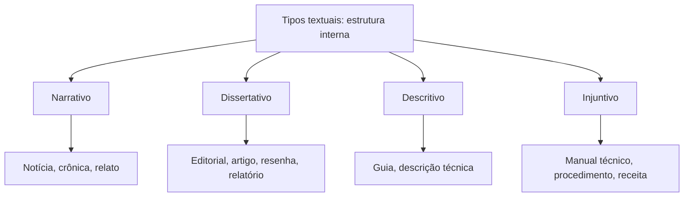

# Tipos e Gêneros Textuais

> [!info] Metadados
> **Disciplina:** Língua Portuguesa
> **Bloco:** 1.1 — Língua Portuguesa (FASE 1 — Fundamentos)
> **Tópico:** 2. Tipos e gêneros textuais
> **Subtópicos:** Tipos textuais: narrativo, dissertativo, descritivo, injuntivo · Gêneros textuais: editorial, artigo, resenha, relatório, manual técnico, e-mail profissional
> **Pré-requisitos:** Nenhum — se beneficia de: [[Compreensao-e-Interpretacao-de-Textos|Compreensão e interpretação de textos]]
> **Cargo:** Analista de TI — Perfil 3 (Desenvolvimento de Software) · DATAPREV 2026
> **Data:** 2026-08-27

---

## 1. Do que falamos quando falamos de "tipo" e "gênero" textual?

Na nota anterior, [[Compreensao-e-Interpretacao-de-Textos|Compreensão e interpretação de textos]], aprendemos que todo texto é uma unidade de comunicação: alguém **produz** (o autor), alguém **recebe** (o leitor) e existe uma **intenção** por trás — informar, convencer, alertar, instruir, emocionar. Nesta nota, vamos dar um passo adiante e perguntar: **de que maneiras os textos se organizam** para cumprir esses objetivos, e **que formatos sociais** eles assumem no nosso dia a dia.

Pense numa ferramenta de trabalho: um mesmo problema pode ser resolvido de jeitos diferentes. E, do mesmo modo, um mesmo conteúdo pode ser "embrulhado" de formas diferentes. Para entender isso com clareza, a Linguística (o estudo científico da linguagem) criou duas ferramentas de análise que **se usam juntas, mas que são coisas diferentes**:

- o **tipo textual** — a "estrutura interna" do texto, *como ele está organizado* para cumprir seu objetivo;
- o **gênero textual** — o "formato social" do texto, o modelo pronto que usamos em situações concretas de comunicação, com função, contexto e convenções próprias.

> [!important] A distinção que vai valer pontos
> **Tipo** responde à pergunta *"como o texto está estruturado por dentro?"*.
> **Gênero** responde à pergunta *"que modelo pronto de texto é este, na vida real?"*.
>
> Confundir esses dois conceitos é, provavelmente, o erro mais comum neste tópico — e ele volta em praticamente todas as pegadinhas que veremos adiante. Guarde essa dupla de perguntas agora; ela será sua bússola.

Para o cargo de **Analista de TI — Perfil 3 (Desenvolvimento de Software)**, dominar essa distinção não é luxo. O profissional escreve e lê, todos os dias, **relatórios** de incidentes, **manuais técnicos**, **e-mails** profissionais, documentações de sistema. Cada um desses é um gênero com formato próprio — e saber reconhecer qual é qual (e para que serve) melhora tanto a prova quanto o trabalho real.

Vamos construir cada conceito do zero: primeiro os **tipos** (a estrutura interna), depois os **gêneros** (os formatos sociais), e, ao final, como a banca explora essa relação.

---

## 2. Tipos textuais: a estrutura interna do texto

Comecemos pelo **tipo textual**. Imagine que todo texto tem uma "espinha dorsal": um jeito de se organizar que responde ao objetivo de quem escreve. Essa espinha dorsal é o tipo textual.

> [!note] Definição de tipo textual
> **Tipo textual** é a **estrutura interna** do texto — o modo como ele se organiza para cumprir seu objetivo. É uma categoria que descreve **como** as palavras, as frases e as ideias se arranjam, independentemente do assunto ou do formato específico.

Aqui reside um ponto que muita gente esquece: o tipo não depende do **conteúdo** (do assunto), mas da **forma de organização**. Uma história sobre uma formiga e uma história sobre um servidor que caiu podem ser **ambas narrativas** — porque ambas *narram um fato*, com começo, meio e fim. O assunto é diferente; o tipo é o mesmo.

Os quatro tipos clássicos são:

1. **Narrativo** — conta uma história ou um fato.
2. **Dissertativo** — expõe e/ou defende ideias (em duas modalidades: expositivo e argumentativo).
3. **Descritivo** — caracteriza pessoas, objetos, lugares, processos.
4. **Injuntivo** — orienta, instrui, manda fazer.

Vamos estudar cada um com calma, antes de compará-los.

---

### 2.1 Tipo narrativo: contar uma história

Você já contou, alguma vez, "o que aconteceu" numa reunião? Se sim, você já produziu um texto narrativo sem saber. O **narrativo** é o tipo cuja finalidade é **contar uma história ou relatar um fato que se desenvolve no tempo**: algo aconteceu, e você narra essa sequência de acontecimentos.

> [!example] Exemplo de texto narrativo
> "Às 9h, o sistema começou a apresentar lentidão. Por volta das 9h20, a equipe de monitoramento detectou a alta no consumo de memória. Às 10h, o administrador reiniciou o serviço e o desempenho voltou ao normal."

Perceba que existe uma **sequência temporal**: primeiro isto, depois aquilo, por fim aquilo outro. É essa sequência que define o narrativo.

Para compreender um texto narrativo, você pode localizar cinco "unidades de compreensão" — não é teoria literária profunda, é apenas o mapa do que procurar:

- o **narrador** — quem conta a história (não confunda com o autor real; é a "voz" que narra);
- o **enredo** (ou trama) — a sequência de acontecimentos;
- os **personagens** — os envolvidos na história (pessoas, animais, até sistemas);
- o **tempo** — quando os fatos acontecem;
- o **espaço** — onde acontecem.

> [!tip] Pista de reconhecimento
> Nas narrativas, é natural o **predomínio de verbos de ação** ("iniciou", "detectou", "reiniciou" — no exemplo acima). Frases que indicam acontecimentos e sua ordem são o "sinal verde" do narrativo. Não precisamos de gramática formal: basta perceber que as palavras apontam para **ações que se sucedem no tempo**.

Onde o narrativo aparece no dia a dia? Em notícias de jornal que relatam um acontecimento, em crônicas, em contos, em depoimentos, na descrição de um incidente de TI. No universo profissional, o **relato de um problema** (o que aconteceu, em que ordem) é, em sua essência, um texto narrativo.

---

### 2.2 Tipo dissertativo: expor e defender ideias

O **dissertativo** é, talvez, o tipo mais cobrado em concursos — e o mais presente em textos de opinião. Sua finalidade é **expor e/ou defender ideias** sobre um tema. Ele organiza as ideias de forma **lógica**, não em sequência temporal como o narrativo, mas sim em **raciocínio ordenado**: apresenta-se um assunto, desenvolve-se com explicações ou argumentos, e chega-se a uma conclusão.

Quando falamos do dissertativo, precisamos abrir um parêntese importante: ele tem **duas modalidades** que a banca adora confundir.

**Modalidade 1 — Dissertativo-expositivo (ou expositivo):**
Aqui o objetivo é **informar, explicar, esclarecer** — sem tomar partido. O autor apresenta o assunto de forma **neutra**, como um professor explicando a matéria ou um manual apresentando um conceito. Não há uma posição a defender; há um conhecimento a transmitir.

> [!example] Exemplo dissertativo-expositivo
> "A memória RAM é um tipo de armazenamento temporário usado pelo computador para manter os dados das tarefas em execução. Quando o computador é desligado, o conteúdo da memória RAM é perdido."

O texto **explica** o que é a memória RAM. Não diz "a memória RAM é ótima" nem "é ruim" — apenas esclarece. Predomina a **linguagem impessoal** (não há "eu acho"), própria de quem informa.

**Modalidade 2 — Dissertativo-argumentativo (ou argumentativo):**
Aqui o objetivo é **convencer** o leitor. O autor **defende um ponto de vista** (a tese) e apresenta **argumentos** para sustentá-lo. A diferença é decisiva: enquanto o expositivo informa neutramente, o argumentativo **toma posição** e tenta fazer você concordar.

> [!example] Exemplo dissertativo-argumentativo
> "A adoção do home office deve ser ampliada nas empresas públicas, pois reduz custos de infraestrutura, aumenta a produtividade e melhora a qualidade de vida dos servidores. Por isso, é hora de investir nesse modelo."

Aqui o autor **defende** algo (que o home office deve ser ampliado) com **argumentos** (reduz custos, aumenta produtividade, melhora qualidade de vida) e uma **conclusão** ("é hora de investir"). Compare com o exemplo expositivo: no expositivo, informamos; no argumentativo, defendemos.

> [!warning] Pegadinha clássica: expositivo × argumentativo
> **A armadilha:** a questão apresenta um texto que *explica* um assunto (expositivo) e a alternativa o chama de *argumentativo* — ou apresenta um texto que *defende* uma posição e a alternativa o reduz a *meramente informativo*.
>
> **O raciocínio errado:** achar que todo texto que fala de um tema está "argumentando". Não está: argumentar é **defender uma tese com argumentos**, não apenas falar sobre o assunto.
>
> **Como se proteger:** faça o teste do **leitor imaginário** (que já conhecemos na nota de interpretação): após ler, pergunte-se *"o autor quer que eu saiba algo"* (expositivo) *"ou que eu mude de ideia e concorde com ele"* (argumentativo). Se há tese defendida + argumentos + posição clara, é argumentativo; se há só explicação neutra, é expositivo.

A organização típica de um dissertativo costuma seguir três blocos — **introdução → desenvolvimento → conclusão**. Não vamos entrar em técnica de redação (isso é outro tópico da ementa); basta reconhecer o padrão: primeiro apresenta-se o tema, depois desenvolve-se com ideias, por fim conclui-se. É a "sequência lógica" marcante do dissertativo, diferente da "sequência temporal" do narrativo.

Onde o dissertativo aparece? No editorial e no artigo de opinião (que estudaremos), em textos de jornalismo opinativo, em explicações didáticas, em defesas de ponto de vista. Um texto expositivo didático explica; um argumentativo convence.

---

### 2.3 Tipo descritivo: o retrato por palavras

O **descritivo** tem por finalidade **caracterizar**: descrever como algo é — uma pessoa, um objeto, um lugar, um processo. Ele é o "retrato em palavras": em vez de contar o que *acontece* (narrativo) ou de *defender* ideias (dissertativo), ele **mostra como as coisas são**, detalhando características, aspectos e aparências.

> [!example] Exemplo de texto descritivo
> "O ambiente de trabalho é uma sala ampla e bem iluminada, com longas mesas brancas, cadeiras ergonômicas e paredes cobertas de monitores. Na extremidade, uma janela de vidro revela a vista para o vale."

Repare: o texto **pinta o cenário** — ampla, bem iluminada, mesas brancas, cadeiras ergonômicas, janela de vidro. Ele não conta uma história que aconteceu ali; ele **descreve como o lugar é**.

> [!tip] Pista de reconhecimento
> O descritivo valoriza o **detalhe**: cores, formas, dimensões, sensações. A pergunta que o guia é *"como é?"*. Se o texto responde a "como é" (e não a "o que aconteceu" ou "o que eu defendo"), você está diante de um trecho descritivo.

> [!warning] Pegadinha clássica: descritivo × narrativo
> **A armadilha:** textos que misturam os dois — uma narrativa que *descreve* ambientes e personagens enquanto conta a história.
>
> **O raciocínio errado:** como há detalhes e "pintura de cenário", o candidato marca "descritivo" sem perceber que a função dominante é contar fatos; ou o inverso, marca "narrativo" ignorando os trechos de descrição.
>
> **Como se proteger:** pergunte qual é a função **predominante**. Se o texto está, no conjunto, *contando o que aconteceu*, é narrativo (mesmo com trechos descritivos). Se o texto está, no conjunto, *descrevendo como algo é*, é descritivo (mesmo com um ou outro acontecimento). Lembre-se da regra que vem a seguir: um texto pode **misturar tipos**; o que interessa é a **predominância**.

Onde o descritivo aparece? Em guias turísticos, em anúncios imobiliários, em relatos de viagem, na caracterização de personagens, na descrição de um produto técnico ("o aparelho é leve, com tela de 15 polegadas..."). No TI, a **descrição de uma especificação ou de um componente** costuma ser predominantemente descritiva.

---

### 2.4 Tipo injuntivo: orientar, instruir, mandar fazer

O **injuntivo** tem por finalidade **orientar, instruir ou mandar fazer algo**. Ele comanda o leitor a executar uma ação. Sua marca é o **imperativo** — não no sentido gramatical formal, mas no sentido de *ordem/instrução*: o texto diz o *que fazer*, o *passo a passo*, as *instruções* a seguir.

> [!example] Exemplo de texto injuntivo
> "Para instalar o programa, primeiro faça o download do instalador. Em seguida, clique duas vezes no arquivo e siga as instruções da tela. Ao final, reinicie o computador."

O texto **manda fazer**: "faça o download", "clique", "siga", "reinicie". A função não é contar nem descrever nem convencer — é **comandar uma ação**.

> [!tip] Pista de reconhecimento
> O injuntivo se reconhece pelos verbos que **ordenam ações** ("faça", "clique", "siga", "abra", "confira") e pela estrutura de **instruções** ("primeiro...", "em seguida...", "ao final..."). Quando o texto está ensinando você a *fazer* algo, provavelmente é injuntivo.

Onde o injuntivo aparece? Em **receitas** ("bata os ovos, acrescente a farinha"), em **manuais de instrução**, em **regras** e **regulamentos**, em **procedimentos** de segurança, em **bulas** ("tome um comprimido a cada 8 horas"). Para o Analista de TI, essa relação é direta: **manuais técnicos** e **procedimentos operacionais** são, em sua essência, predominantemente injuntivos — eles dizem como fazer cada etapa.

> [!important] Ancoragem profissional
> Quando você lê "para autenticar, informe seu usuário e senha, e em seguida selecione 'login'", esse comando é injuntivo. O manual técnico que orienta o uso de um sistema instrui o leitor, passo a passo. Reconhecer o injuntivo é reconhecer a forma como boa parte da documentação de TI é escrita.

---

### 2.5 Os quatro tipos em comparação

Vamos colocar os quatro lado a lado. Esta tabela é o "mapa" que você consultará no dia da prova:

| Tipo textual | Objetivo principal | Estrutura típica | Exemplo de gênero que o materializa | Pista de reconhecimento |
|---|---|---|---|---|
| **Narrativo** | Contar um fato/história | Sequência temporal (começo, meio, fim) | Notícia, crônica, relato de incidente | Verbos de ação; acontecimentos em ordem |
| **Dissertativo (expositivo)** | Informar/explicar, de forma neutra | Introdução → desenvolvimento → conclusão (lógica) | Texto didático, verbete, texto que explica um conceito | Linguagem impessoal; explica sem tomar partido |
| **Dissertativo (argumentativo)** | Convencer/defender tese | Tese + argumentos + conclusão | Editorial, artigo de opinião | Posição clara, defesa de ponto de vista, argumentos |
| **Descritivo** | Caracterizar (pessoas, objetos, lugares, processos) | Detalhamento de características ("como é") | Guia, anúncio, descrição técnica, retrato | Detalhes, cores, formas, sensações; responde a "como é" |
| **Injuntivo** | Orientar/instruir/mandar fazer | Instruções, passos, ordens | Receita, manual técnico, procedimento | Verbos que ordenam ("faça", "clique", "abra"); passo a passo |

> [!warning] A regra de ouro: predominância ≠ exclusividade
> Um texto **raramente** é "100% puro" de um único tipo. Uma notícia narra os fatos, mas descreve os envolvidos e até explica um conceito. Um manual técnico é injuntivo, mas também descreve componentes. O que a prova cobra é o **tipo predominante** — aquele que comanda a função central do texto como um todo.
>
> Ou seja: **predominância ≠ exclusividade**. Ao ser perguntado pelo tipo predominante, não elimine um tipo só porque ele aparece em *algum* trecho; pergunte qual é a função dominante no conjunto.

---

## 3. Gêneros textuais: os formatos sociais do texto

Se o tipo é a "estrutura interna", o **gênero textual** é o "formato social": os modelos de texto que a nossa sociedade criou e consagrou para situações específicas de comunicação. Cada gênero tem **função, contexto de uso e convenções próprias**.

> [!note] Definição de gênero textual
> **Gênero textual** é um **modelo de texto** reconhecido e usado num contexto social específico, com finalidade, proposta e características próprias. São os "formatos prontos" que reconhecemos no dia a dia: uma notícia, um e-mail, um relatório, uma receita, um editorial, uma bula.

Pense nos gêneros como **ferramentas**. Numa caixa de ferramentas, o martelo serve para uma coisa, a chave de fenda para outra. Do mesmo modo, o editorial serve para opinar institucionalmente, o relatório para registrar resultados, o manual técnico para orientar o uso. Cada um tem sua função — e reconhecemos qual é qual pelo **formato** e pelo **contexto**.

> [!tip] A relação tipo × gênero — o nó que desata tudo
> A pergunta que vale ouro é: **qual é a relação entre tipo e gênero?** A resposta é simples de memorizar e poderosa na prova:
>
> - **Um mesmo tipo pode aparecer em vários gêneros.** O tipo *narrativo*, por exemplo, aparece na notícia, na crônica, no conto, no relato. O tipo *dissertativo-argumentativo* aparece no editorial, no artigo, na resenha.
> - **Um gênero pode combinar vários tipos.** Um relatório é predominantemente dissertativo-expositivo, mas traz trechos descritivos. Um manual técnico é injuntivo, mas inclui descrições.
>
> Em resumo: o **tipo** é abstrato (a estrutura); o **gênero** é concreto (o modelo real na vida). Duas receitas são dois gêneros iguais (receita), materializados pelo mesmo tipo predominante (injuntivo). Já um editorial e um artigo são gêneros diferentes, mas ambos predominam *dissertativo-argumentativo*.

Vejamos um fluxo simples para fixar essa relação:

> [!example] Aplicando a relação
> - **Receita** = gênero; tipo predominante: **injuntivo** (manda fazer: "bata, asse, sirva").
> - **Notícia** = gênero; tipo predominante: **narrativo**, com trechos descritivos (relata o fato, mas descreve o local e as pessoas).
> - **Relatório** = gênero; tipo predominante: **dissertativo-expositivo**, com trechos descritivos.
> - **Editorial** = gênero; tipo predominante: **dissertativo-argumentativo**.

---

### 3.1 Editorial

O **editorial** é um texto **opinativo institucional**: ele expõe a **posição do veículo** (jornal, revista, site de notícias) sobre um tema relevante. Sua característica central é **não ser assinado** — porque não é a opinião de um jornalista específico, e sim da empresa de mídia como um todo.

- **Finalidade:** opinar sobre um assunto da atualidade, expressando a posição do veículo.
- **Contexto de uso:** geralmente no início da seção de opinião de jornais e revistas.
- **Características típicas:** não é assinado; trata de temas de relevância pública; defende uma posição com argumentos.
- **Tipo textual predominante:** **dissertativo-argumentativo**.

> [!example] Exemplo de editorial (fictício, para compreensão)
> "O país precisa, com urgência, de uma política pública de inclusão digital. Sem acesso à internet de qualidade, milhões de cidadãos ficam à margem dos serviços essenciais. Por isso, este jornal defende a ampliação dos investimentos em infraestrutura de conectividade."

Repare: o texto diz "**este jornal defende**" — é a posição do veículo, não de um autor individual. Essa é a assinatura invisível do editorial.

> [!warning] Pegadinha: editorial × artigo de opinião
> **A armadilha:** confundir os dois, pois ambos são dissertativo-argumentativos.
>
> **O raciocínio errado:** "os dois opinam, então são a mesma coisa".
>
> **Como se proteger:** a diferença está em **quem fala** e **como se identifica**:
> - **Editorial** = posição do **veículo**, **não assinado**.
> - **Artigo de opinião** = posição do **autor**, **assinado**.
>
> Guarde: *editorial não tem assinatura; artigo tem.* Essa é uma das oposições mais diretas que as bancas de concurso, de modo geral, costumam explorar.

---

### 3.2 Artigo (de opinião / científico)

O **artigo** é um texto **assinado** que **expõe ou defende ideias** sobre um assunto. Diferente do editorial (que fala pela empresa de mídia), o artigo fala **pelo autor**, que se identifica ao final ou no início.

Existem dois usos principais da palavra "artigo" que você precisa distinguir em nível básico:

- **Artigo de opinião:** texto publicado em jornal, revista ou portal, em que o autor (especialista, colunista, convidado) defende seu ponto de vista sobre um tema de interesse geral. É do campo do jornalismo opinativo.
- **Artigo científico:** texto produzido no meio acadêmico para **comunicar resultados de pesquisa** a uma comunidade de especialistas. Não vamos entrar em metodologia acadêmica; basta reter o básico: o artigo científico apresenta um estudo, suas bases e suas conclusões, para ser avaliado pela comunidade científica.

- **Finalidade:** expor e/ou defender ideias (opinião) ou comunicar resultados de estudo (científico).
- **Contexto de uso:** jornais, revistas, portais (opinião); revistas científicas, congressos (científico).
- **Características típicas:** é **assinado**; expõe e defende posições; no científico, tem estrutura acadêmica própria.
- **Tipo textual predominante:** **dissertativo** (argumentativo na opinião; expositivo-argumentativo no científico).

> [!example] Exemplo de artigo de opinião (fictício)
> "Como engenheiro de software há mais de dez anos, defendo que investir em testes automatizados é a melhor forma de reduzir custos a longo prazo. Embora exija investimento inicial, a prática evita retrabalho e desperdício, o que, no fim, beneficia toda a organização."

Note a assinatura implícita: "como engenheiro de software", "defendo" — há um **autor** falando por si, com sua experiência e seu ponto de vista. Diferente do editorial, aqui há uma voz individual.

> [!note] Artigo de opinião × artigo científico (o essencial)
> Não é preciso dominar metodologia acadêmica. Guarde apenas o nível conceitual que o edital cobra:
> - **Artigo de opinião** = autor expõe/defende posição para o público geral; linguagem acessível; opinião em primeiro plano.
> - **Artigo científico** = autor comunica resultados de pesquisa a especialistas; linguagem técnica; busca rigor e impessoalidade.

---

### 3.3 Resenha

A **resenha** é um texto que **apresenta e avalia criticamente** uma obra (livro, filme, artigo, peça, exposição). Ela faz duas coisas ao mesmo tempo:

1. **resume** a obra — apresenta seu conteúdo, ideias principais, enredo ou argumentos;
2. **avalia** a obra — emite um julgamento crítico, apontando qualidades, defeitos, relevância.

É justamente essa **avaliação crítica** que separa a resenha do **resumo**.

- **Finalidade:** informar sobre a obra **e** opinar criticamente sobre ela (recomendar ou não, avaliar).
- **Contexto de uso:** jornais, revistas, blogs, plataformas de avaliação, ambiente acadêmico.
- **Características típicas:** mistura apresentação (expositiva) com julgamento (argumentativo); identifica a obra.
- **Tipo textual predominante:** **dissertativo** — mistura **expositivo** (no resumo da obra) com **argumentativo** (na avaliação crítica).

> [!example] Exemplo de resenha (fictício)
> "O livro 'Clean Code', de Robert Martin, apresenta princípios para escrever código legível e de fácil manutenção. Em capítulos densos, o autor detalha boas práticas como nomes significativos e funções pequenas. A obra é leitura obrigatória para iniciantes, embora o excesso de exemplos torne alguns capítulos cansativos."

Veja as duas camadas: o trecho "apresenta princípios... detalha boas práticas" **resume** (expositivo); o trecho "é leitura obrigatória, embora... cansativos" **avalia** (argumentativo). A resenha une as duas.

> [!warning] Pegadinha: resenha × resumo
> **A armadilha:** confundir resenha com resumo, tratando os dois como sinônimos.
>
> **O raciocínio errado:** "ambos falam da obra".
>
> **Como se proteger:** a palavra decisiva é **"crítica"** — a **avaliação** do autor.
> - **Resumo** = só **apresenta/relata** o conteúdo da obra, sem julgamento.
> - **Resenha** = **apresenta** (resumo) **+ avalia** (julgamento, opinião).
>
> Se o texto emite juízo ("obrigatória", "cansativos", "excelente"), é resenha; se apenas relata o que a obra diz, é resumo. Essa distinção cai com frequência.

---

### 3.4 Relatório

O **relatório** é um texto que **registra atividades, resultados, dados ou acontecimentos**, com o objetivo de **informar** de forma organizada. É um dos gêneros mais comuns no mundo profissional e público — e muito presente na rotina de um Analista de TI, que precisa registrar incidentes, andamentos de projetos e resultados de testes.

- **Finalidade:** registrar e comunicar atividades, resultados ou dados de forma organizada.
- **Contexto de uso:** empresas, órgãos públicos, instituições de ensino, envio a superiores ou órgãos de controle.
- **Características típicas:** estrutura simples e previsível — em geral apresenta **objetivo, desenvolvimento e conclusão**; linguagem objetiva e organizada; volta-se a fatos e resultados.
- **Tipo textual predominante:** **dissertativo-expositivo**, com trechos **descritivos**.

> [!example] Exemplo de relatório (fictício)
> "Relatório de manutenção — 26/08/2026. Objetivo: corrigir a lentidão do sistema de folha. Desenvolvimento: identificada a causa na base de dados, aplicada a correção e realizado novo teste de desempenho. Conclusão: o tempo de resposta voltou ao normal, sem novos incidentes registrados."

Note a estrutura: **objetivo → desenvolvimento → conclusão**. Essa organização previsível é a marca do relatório. Ele informa o que aconteceu (trecho narrativo-oblíquo), mas a função dominante é **registrar e informar de forma organizada** — por isso se classifica como dissertativo-expositivo com trechos descritivos, sem precisarmos nos aprofundar em formatação.

> [!note] Não confunda com a redação de prova
> Não vamos trabalhar aqui formatação formal de relatório (modelos de capa, numeração de seções, etc.). Para o edital, basta reconhecer o gênero: quem registra atividades e resultados de forma organizada, em torno de objetivo e conclusão, está produzindo um relatório.

---

### 3.5 Manual técnico

O **manual técnico** é um documento de **orientação sobre o uso de um produto, sistema ou procedimento**. Ele ensina o leitor a operar algo — um equipamento, um software, um processo. É o gênero **injuntivo por excelência**, pois trabalha com instruções e passos.

- **Finalidade:** orientar o uso ou a execução de procedimentos.
- **Contexto de uso:** acompanha produtos e sistemas; muito comum em empresas de tecnologia.
- **Características típicas:** instruções passo a passo, linguagem clara e direcionada ao usuário, organização por etapas ou funções.
- **Tipo textual predominante:** **injuntivo**, com trechos **descritivos** (descrição das funções dos componentes).

Para o cargo de Analista de TI, o manual técnico é o gênero mais "caseiro" possível: é assim que se documenta o uso de sistemas, se orienta o usuário e se registra procedimentos operacionais.

> [!example] Exemplo de manual técnico (fictício)
> "Para resetar a senha: 1) acesse a tela de login; 2) clique em 'esqueci minha senha'; 3) informe seu e-mail corporativo; 4) abra a mensagem de confirmação e clique no link de redefinição; 5) defina a nova senha."

Passo a passo claro, com comandos "clique", "informe", "acesse", "defina" — injuntivo na essência. Se o manual também descrever o que cada botão faz ("o botão 'salvar' grava as alterações no banco"), esses trechos serão descritivos, a serviço da orientação.

> [!important] Infraestrutura argumentativa
> Guarde o par: **manual técnico ↔ injuntivo** e **relatório ↔ dissertativo-expositivo**. São dois gêneros de TI com tipos predominantes diferentes e funções opostas: o manual *ensina a fazer* (injuntivo); o relatório *registra o que foi feito* (expositivo-descritivo). Essa oposição é ótima "isca" de prova.

---

### 3.6 E-mail profissional

O **e-mail profissional** é um gênero cotidiano do mundo corporativo. Como todo e-mail, ele se destina à comunicação entre pessoas — mas, no contexto profissional, exige **adequação**: clareza, objetividade, tom adequado e estrutura mínima.

- **Finalidade:** variada — **informar**, **solicitar**, **encaminhar**, **agendar**, **negociar**. A finalidade depende da situação específica, e é isso que a prova testa: ler o *contexto* para identificar a função do e-mail.
- **Contexto de uso:** ambiente de trabalho, comunicação oficial e corporativa.
- **Características típicas:** possui **assunto** (objeto), **saudação** inicial, **corpo** (a mensagem) e **despedida**; busca clareza, objetividade e tom adequado ao destinatário.
- **Tipo textual predominante:** **depende da finalidade** — um e-mail que informa é dissertativo-expositivo; um que solicita pode ser predominantemente injuntivo na parte do pedido; um que relata um incidente tem trecho narrativo. O e-mail é um gênero **flexível**, que pode combinar vários tipos.

> [!example] Exemplo de e-mail profissional
> "Assunto: Solicitação de acesso ao ambiente de homologação
>
> Prezado(a) suporte,
> Solicito a liberação do meu acesso ao ambiente de homologação, necessário para a validação da nova funcionalidade. Caso precise de alguma informação adicional, fico à disposição.
>
> Atenciosamente,
> Ana Souza — Equipe de Desenvolvimento"

Veja a estrutura: **assunto** (que antecipa o tema), **saudação** ("Prezado(a)"), **corpo** (solicitação clara e objetiva) e **despedida** ("Atenciosamente", com identificação). A finalidade — solicitar — é revelada pelo contexto e pelas palavras ("solicito a liberação").

> [!note] Adequação, e não "norma culta formal"
> Neste tópico, o que a prova costuma explorar é a **adequação** do e-mail ao contexto: clareza, objetividade, tom apropriado ao destinatário, presença de assunto e saudação. Não vamos entrar em norma culta formal, concordância ou outras regras gramaticais — isso pertence a tópicos posteriores da ementa. Aqui, interessa reconhecer o gênero e sua função.

---

### 3.7 Os gêneros em resumo

Para fechar este subtópico, a tabela de consulta rápida:

| Gênero textual | Tipo predominante | Finalidade | Onde aparece |
|---|---|---|---|
| **Editorial** | Dissertativo-argumentativo | Opinam pela posição do veículo | Jornais, revistas, portais (seção de opinião) |
| **Artigo (opinião/científico)** | Dissertativo | Expor/defender ideias (opinião) ou comunicar pesquisa (científico), assinado | Jornais, revistas, periódicos científicos |
| **Resenha** | Dissertativo (expositivo + argumentativo) | Apresentar e avaliar criticamente uma obra | Jornais, revistas, blogs, ambiente acadêmico |
| **Relatório** | Dissertativo-expositivo (+ trechos descritivos) | Registrar atividades e resultados | Empresas, órgãos públicos, escolas |
| **Manual técnico** | Injuntivo (+ trechos descritivos) | Orientar uso/procedimentos | Empresas de tecnologia, documentação de sistemas |
| **E-mail profissional** | Flexível (depende da finalidade) | Informar, solicitar, encaminhar, agendar | Ambiente corporativo diário |

---

## 4. Estratégia de prova: decifrando os enunciados

Agora que o conteúdo está no lugar, vamos ao que derruba candidato: **ler o enunciado**. As bancas de concurso, de modo geral, são generosas em sinalizar exatamente o que querem, se você souber decodificar as palavras-chave.

### 4.1 Palavras-chave que dizem o que a questão pede

| Expressão no enunciado | O que ela pede |
|---|---|
| "O texto pertence ao gênero..." | Atenção ao **formato social**: editorial, artigo, resenha, relatório, manual, e-mail |
| "Predomina o tipo textual..." / "Trata-se de um texto predominantemente..." | Atenção à **estrutura interna**: narrativo, dissertativo, descritivo, injuntivo (→ mas cuidado, o próximo item mostra uma pegadinha) |
| "Trata-se de um texto predominantemente dissertativo-argumentativo" | Já especifica o tipo **e a modalidade** (expositivo ou argumentativo) — leia o texto para conferir |
| "A finalidade do gênero é..." | Identifique a **função** do gênero no contexto (informar, opinar, orientar, registrar...) |
| "Qual a função comunicativa deste texto?" | O objetivo que o texto cumpre (parente próximo da intenção comunicativa da nota anterior) |
| "Sobre a tipologia textual, é correto afirmar..." | Conceito: o que é tipo, o que é gênero, e a relação entre eles |

### 4.2 As pegadinhas no padrão "armadilha → raciocínio errado → proteção"

> [!warning] Pegadinha 1 — trocar tipo por gênero (e vice-versa)
> **A armadilha:** a questão mostra um editorial e pergunta "qual é o **gênero**" — a alternativa certa é "editorial"; mas candidatos marcam "dissertativo-argumentativo" (que é o **tipo**). Ou o inverso: perguntam o **tipo** e markam um **gênero** ("editorial", "relatório").
>
> **O raciocínio errado:** não separar os dois conceitos, tratando "texto" como uma coisa só.
>
> **Como se proteger:** ao ler o enunciado, circule a palavra-chave. Perguntou **gênero**? Procure o nome do modelo real (editorial, artigo, resenha, relatório, manual, e-mail). Perguntou **tipo**? Procure a estrutura (narrativo, dissertativo, descritivo, injuntivo). Se a questão trouxer "editorial" e "dissertativo-argumentativo" como alternativas, a resposta depende **só do que ela pergunta**.

> [!warning] Pegadinha 2 — expositivo × argumentativo
> **A armadilha:** um texto que *explica* um conceito (expositivo) é rotulado como argumentativo, ou um texto que *defende* tese é chamado de expositivo.
>
> **O raciocínio errado:** achar que todo texto que discorre sobre um tema está "argumentando".
>
> **Como se proteger:** teste a **presença de tese e argumentos**. Se o autor toma posição, defende e quer convencer → argumentativo. Se apenas informa/explica, de forma neutra → expositivo. A pergunta-guia: *"o autor quer me fazer saber, ou me fazer concordar?"*

> [!warning] Pegadinha 3 — descritivo × narrativo em textos mistos
> **A armadilha:** um texto narrativo com muitas descrições (ou uma descrição com um acontecimento) confunde.
>
> **O raciocínio errado:** julgar pelo trecho que mais "chama atenção", não pela função dominante.
>
> **Como se proteger:** lembre sempre da regra **predominância ≠ exclusividade**. Pergunte qual é a função do texto **como um todo**: se está contando o que aconteceu, narrativo (ainda que descreva); se está mostrando como algo é, descritivo.

> [!warning] Pegadinha 4 — resenha × resumo
> **A armadilha:** um texto que resume uma obra mas o candidato responde "resenha" sem ver se há avaliação crítica (ou o contrário).
>
> **O raciocínio errado:** "os dois falam da obra".
>
> **Como se proteger:** procure o **julgamento**. A presença de avaliação ("excelente", "cansativo", "recomendo") indica **resenha**; a ausência de juízo indica **resumo**.

> [!warning] Pegadinha 5 — editorial × artigo de opinião
> **A armadilha:** confundir os dois, pois ambos são dissertativo-argumentativos.
>
> **O raciocínio errado:** "os dois opinam".
>
> **Como se proteger:** verifique a **autoria**. Não assinado, falando em nome do veículo → **editorial**. Assinado, falando em nome do autor → **artigo de opinião**. A presença/ausência de assinatura é a pista decisiva.

> [!note] Estratégia geral de eliminação
> Diante de qualquer questão de tipo/gênero, faça o seguinte em sequência:
> 1. **Leia o texto inteiro** (não apenas o primeiro parágrafo).
> 2. **Identifique a pergunta** — é sobre *tipo* (estrutura) ou sobre *gênero* (formato)?
> 3. **Descubra a finalidade** do texto: informar, opinar, orientar, registrar, contar?
> 4. **Determine o tipo predominante** pela função dominante.
> 5. **Confira as exceções** à regra que discutimos (expositivo × argumentativo, editorial × artigo, resenha × resumo, descritivo × narrativo).
> 6. Elimine as alternativas que misturam os dois níveis (tipo e gênero), pois a resposta certa precisa respeitar **o nível perguntado**.

---

## 5. Revisão rápida

Antes de encerrar, o essencial em modo de conferência:

| Conceito | O que é | A pergunta que responde |
|---|---|---|
| **Tipo textual** | Estrutura interna do texto | "Como o texto está organizado?" |
| **Gênero textual** | Formato social do texto | "Que modelo pronto é este?" |
| Narrativo / Dissertativo / Descritivo / Injuntivo | Os quatro tipos | "O texto conta, expõe/defende, descreve ou orienta?" |
| Editorial, artigo, resenha, relatório, manual, e-mail | Gêneros cobrados | "Qual é o contexto e a função?" |

> [!tip] As três ideias que resumem a nota
> **1.** **Tipo ≠ gênero:** tipo é a estrutura interna; gênero é o formato social. Não troque um pelo outro na hora de marcar.
> **2.** **Predominância ≠ exclusividade:** o texto mistura tipos; o que vale é a função dominante.
> **3.** **Dois pares que não podem ser confundidos:** expositivo × argumentativo (dissertativo) e editorial × artigo de opinião (autoria). Some a eles resenha × resumo e descritivo × narrativo, e você desarmou quase todas as pegadinhas do tópico.

Quem domina esses três pontos — e treina lendo o enunciado antes das alternativas — está preparado para a grande maioria das questões de tipos e gêneros textuais, tanto na prova quanto na leitura atenta que o trabalho de Analista de TI exige.
