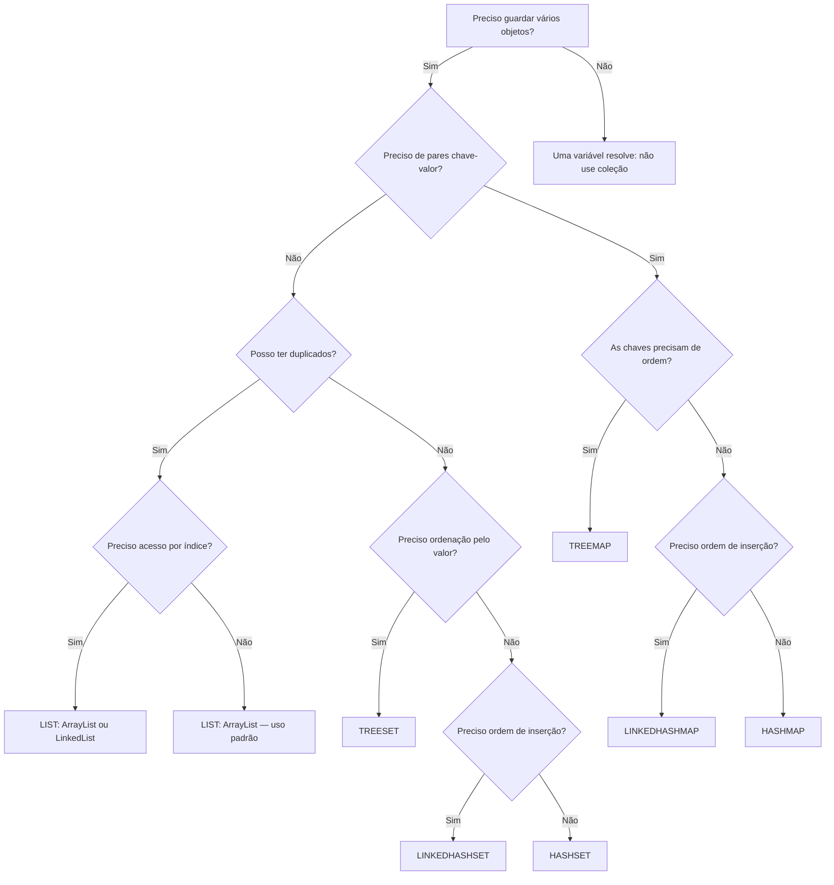

# Coleções Java

> [!info] Metadados
> **Disciplina:** Desenvolvimento de Sistemas
> **Bloco:** 4.1 — Desenvolvimento de Sistemas (FASE 4 — Núcleo de Desenvolvimento)
> **Tópico:** 1. Java — Fundamentos da Linguagem — Coleções
> **Subtópicos:** Hierarquia da interface Collection · List (ArrayList, LinkedList) · Set (HashSet, LinkedHashSet, TreeSet) · Map (HashMap, LinkedHashMap, TreeMap) · Map não é Collection
> **Pré-requisitos:** [[Sintaxe-Essencial-de-Java|Sintaxe Essencial de Java]]; [[Tipos-Primitivos-e-Wrappers|Tipos Primitivos e Wrappers]]
> **Cargo:** Analista de TI — Perfil 3 (Desenvolvimento de Software) · DATAPREV 2026
> **Data:** 2026-09-09

---

## 1. Por que estudar coleções?

Esta subnota aprofunda a seção **Coleções Java** do índice do tópico [[Java-Fundamentos-da-Linguagem]], transformando o resumo da nota-mãe na matéria completa: hierarquia, implementações, operações, percurso e pegadinhas de prova.

Na [[Sintaxe-Essencial-de-Java|sintaxe essencial]], você aprendeu a declarar variáveis, decidir caminhos com `if`, repetir com `for`/`while` e definir uma classe como molde — inclusive a classe `Beneficiario`, com nome, CPF e renda. Em [[Tipos-Primitivos-e-Wrappers|tipos primitivos e wrappers]], você viu por que os **wrappers** existem: as coleções do Java **só armazenam objetos, nunca primitivos** — por isso `List<Integer>` compila e `List<int>` não.

Agora surge a pergunta que organiza esta nota: uma variável guarda **um** valor; uma classe descreve **um** tipo de objeto. Mas um sistema de benefícios não lida com um beneficiário — lida com **milhões**, carregados de um banco relacional. Onde eles ficam em memória enquanto o programa roda? A resposta é o **framework de coleções**: estruturas prontas para **agrupar, guardar, buscar e percorrer objetos**.

Pense na ponte com o que você já domina:

- Do [[Raciocinio-Matematico-Aplicado|Raciocínio Lógico Matemático]] vem a noção de **conjunto** — elementos únicos, sem repetição. No Java, isso é a interface `Set` com precisão quase literal.
- Do [[SQL-DDL-e-DML|SQL]] vem a disciplina de **dados organizados**: a `List` é como uma tabela com ordem e linhas repetíveis; o `Map` é como uma tabela de **chave → valor** (pense no `SELECT` que devolve `cpf → nome`); a operação `contains` faz o papel de um `WHERE` de existência, e `size` o de um `COUNT(*)`.

No contexto DATAPREV, as coleções são a tradução direta do domínio para a memória:

- **`List`** → a fila de beneficiários de um lote de processamento, onde a ordem de chegada importa e um mesmo nome pode aparecer mais de uma vez;
- **`Set`** → o conjunto de CPFs já processados no dia, onde a **unicidade** é a regra de negócio (ninguém pode ser processado duas vezes);
- **`Map`** → a tabela de margens consignáveis por órgão concedente (`INSS` → 30%, `BANCO` → 5%), onde você busca o percentual **pela chave**, sem varrer a estrutura inteira.

> [!question] Pergunta socrática
> Se você precisa garantir que um CPF não seja cadastrado duas vezes em uma lista, usar `List` resolveria? Resolveria — mas você teria que **verificar manualmente** com `contains` antes de cada `add`. Não seria mais simples escolher uma estrutura que **proíba a duplicação sozinha**? É exatamente essa a função do `Set` — e a escolha da estrutura certa é metade da solução em Java.

---

## 2. A hierarquia do framework: `Collection`, e o `Map` à parte

O Java organiza as coleções em um pequeno conjunto de interfaces. No topo da hierarquia está a interface **`Collection`** — a raiz que agrupa "coisas em quantidade" — e dela derivam **duas** grandes famílias. A terceira família, o **`Map`**, é diferente: ela **não herda de `Collection`** e tem sua própria raiz. Guarde essa árvore:

```
Iterable
└── Collection          (agrupa objetos; operações add, remove, contains, size)
    ├── List            (ordem indexada; permite duplicados)
    ├── Set             (sem duplicados)
    └── Queue/Deque     (filas — fora do escopo desta nota)

Map<K,V>                (raiz própria — NÃO é Collection)
├── HashMap
├── LinkedHashMap
└── TreeMap
```

Por que a separação existe? Porque um `Map` não agrupa **elementos**, agrupa **pares chave → valor** — e a "coleção" de chaves, dentro do mapa, comporta-se como um `Set` (chaves únicas). A arquitetura reflete essa diferença: `Map` **não estende `Collection`** — é uma interface raiz própria do framework de coleções, que convive com `Collection` como um primo, não como um filho.

A tabela comparativa das três famílias é o coração teórico do assunto — e o que a FGV mais repete:

| Interface | Ordem | Duplicados | Acesso | Implementações típicas |
|---|---|---|---|---|
| `List` | **sim** (indexada, mantém ordem de inserção) | **permite** | por **índice** | `ArrayList`, `LinkedList` |
| `Set` | **não garante** (no `HashSet`) | **não permite** | por **valor** | `HashSet`, `LinkedHashSet`, `TreeSet` |
| `Map` | depende da implementação | chaves **únicas**; valores podem repetir | por **chave** | `HashMap`, `LinkedHashMap`, `TreeMap` |

> [!warning] PEGADINHA — Map NÃO é Collection
> Esta é a pegadinha número um da matéria: **`Map` não herda de `Collection`**. Ele é uma interface raiz própria do framework de coleções. Uma questão que afirme "todas as coleções Java implementam `Collection`" está errada — o `Map` é a exceção. E a pergunta "qual estrutura não admite duplicados?" tem resposta dupla e sutil: o **`Set`** não admite elementos duplicados; o **`Map`** não admite **chaves** duplicadas (mas admite valores repetidos). São duas regras diferentes, e a banca mistura as duas de propósito.

---

## 3. A família `List`: ordem indexada e duplicados permitidos

A **`List`** é a coleção mais intuitiva: uma sequência **ordenada** de elementos, onde cada posição tem um **índice** (0, 1, 2, ...) e onde **duplicados são permitidos**. "Ordenada" aqui não significa "classificada" — significa que a ordem em que você insere é a ordem em que os elementos ficam guardados. É a diferença entre uma *fila ordenada por chegada* e uma *lista classificada por valor*: o `ArrayList` é a fila; o `TreeSet` (que veremos adiante) é a lista classificada.

Pense em um lote de benefícios. O sistema recebe uma relação de beneficiários e precisa processá-los **na ordem em que foram recebidos**, podendo haver o mesmo beneficiário mais de uma vez no lote (um pedido de revisão, por exemplo). Essa é a semântica perfeita de uma `List`:

```java
import java.util.ArrayList;
import java.util.List;

public class LoteBeneficios {
    public static void main(String[] args) {
        List<String> beneficiarios = new ArrayList<>();

        // add: adiciona ao final
        beneficiarios.add("Ana Souza");
        beneficiarios.add("Bruno Lima");
        beneficiarios.add("Ana Souza");   // permitido! duplicado na List

        System.out.println(beneficiarios.size());   // 3 — size conta tudo

        // get: acesso direto por índice
        System.out.println(beneficiarios.get(0));   // "Ana Souza"

        // contains: verificação de existência
        System.out.println(beneficiarios.contains("Bruno Lima"));   // true

        // remove: remove por índice (retorna o elemento removido)
        String removido = beneficiarios.remove(1);   // "Bruno Lima"
        System.out.println(removido);

        // Percorrer com índice — funciona só na List
        for (int i = 0; i < beneficiarios.size(); i++) {
            System.out.println(i + ": " + beneficiarios.get(i));
        }
    }
}
```

Repare nas operações centrais, que a prova cobra com constância: **`add`** insere, **`get`** busca por índice, **`remove`** retira (por índice ou por objeto), **`contains`** pergunta se existe e **`size`** conta. A pergunta clássica: "qual interface permite acesso direto por índice?" → `List`. E mais: "qual permite elementos duplicados?" → também `List`. São as duas assinaturas da família.

### 3.1 `ArrayList` × `LinkedList`: o mesmo contrato, internals diferentes

As duas implementações principais da `List` entregam o **mesmo contrato** (ambas têm `add`, `get`, `remove`, permitem duplicados e mantêm ordem) — mas **por dentro** são estruturas completamente diferentes, e é essa diferença interna que decide o custo de cada operação.

O **`ArrayList`** é um **array dinâmico**: um bloco contíguo de memória que cresce automaticamente quando fica cheio. Como o array é contíguo, **acessar qualquer posição é imediato**: `get(5000)` não percorre nada, vai direto ao endereço — custo **constante**. A contrapartida: **inserir ou remover no meio** exige deslocar todos os elementos seguintes para abrir (ou fechar) espaço — custo **linear**. Inserir no **final** (o caso mais comum) é barato, pois basta anexar.

O **`LinkedList`** é uma corrente de **nós**: cada elemento guarda o valor e a referência para o próximo (e para o anterior, no caso da lista duplamente encadeada). **Acessar por índice é caro**: para chegar ao elemento 5000, o programa precisa **caminhar nó por nó** — custo linear. A vantagem está nas **extremidades**: inserir ou remover no **início** ou no **fim** é rápido, porque basta ajustar as referências dos nós vizinhos, sem deslocar nada.

| Operação | `ArrayList` (array dinâmico) | `LinkedList` (nós encadeados) |
|---|---|---|
| `get(posição)` | **rápido** — acesso direto ao array | **lento** — percorre nó a nó |
| `add` no final | rápido (anexa; raramente realoca) | rápido (ajusta o último nó) |
| `add` no início/meio | **lento** — desloca elementos | rápido (ajusta referências) |
| `remove` no meio | **lento** — desloca elementos | depende — precisa achar o nó |

> [!note] Como a banca traduz isso
> A FGV não pede análise de complexidade assintótica em profundidade — mas cobra a **comparação direta**: "o `ArrayList` possui acesso aleatório mais eficiente que o `LinkedList`" → verdadeiro; "o `LinkedList` é mais eficiente para inserções/remoções no início da lista" → verdadeiro. Na dúvida, pense na imagem: array = estante contígua (acho o livro pelo número da prateleira); lista encadeada = corrente de elos (só alcanço o elo 5000 contando um a um).

Na prática, o `ArrayList` é a escolha padrão em ~99% dos casos; o `LinkedList` só brilha em cenários específicos de inserção/remoção intensa nas pontas. A prova quer que você saiba **por que** — não que decore.

---

## 4. A família `Set`: sem duplicados

A **`Set`** é a tradução Java do conjunto matemático do [[Raciocinio-Matematico-Aplicado|RLM]]: **não admite elementos repetidos**. Se você tenta adicionar um elemento que já existe, o `add` simplesmente **ignora** a duplicata (e devolve `false` — detalhe que a banca adora). Não há índice; não faz sentido perguntar "qual é o terceiro elemento?", porque conjunto não tem posição — a busca é **por valor**.

O uso clássico no contexto DATAPREV: registrar os **CPFs já processados** para garantir que ninguém receba o mesmo benefício duas vezes na leva do dia.

```java
import java.util.HashSet;
import java.util.Set;

public class CpfProcessados {
    public static void main(String[] args) {
        Set<String> cpfs = new HashSet<>();

        boolean primeiraVez = cpfs.add("123.456.789-00");
        boolean segundaVez  = cpfs.add("123.456.789-00");  // false! duplicata ignorada

        System.out.println(primeiraVez);   // true
        System.out.println(segundaVez);    // false — o retorno do add denuncia a duplicata
        System.out.println(cpfs.size());   // 1 — só existe um

        System.out.println(cpfs.contains("123.456.789-00"));   // true — busca por valor
    }
}
```

O detalhe que separa quem sabe de quem decora: **o `add` de um `Set` retorna `boolean`** — `true` se o elemento foi realmente adicionado, `false` se já existia. Em uma `List`, o `add` não retorna nada de útil (em `ArrayList`, retorna sempre `true`). Para conferir duplicação, o `Set` entrega a resposta na própria operação.

### 4.1 `HashSet` × `LinkedHashSet` × `TreeSet`: a ordenação decide

As três implementações principais do `Set` diferem em **uma** característica central: a ordem em que os elementos aparecem.

O **`HashSet`** é a implementação padrão. Usa uma tabela de espalhamento (hash) para guardar os elementos — por isso busca e inserção são muito rápidas. Mas **não garante nenhuma ordem** de iteração: os elementos podem sair em uma sequência que parece aleatória. "Não garante ordem" não é o mesmo que "ordena de trás para frente" — é simplesmente "não se compromete".

O **`LinkedHashSet`** acrescenta ao `HashSet` uma lista encadeada que **mantém a ordem de inserção**: os elementos aparecem na mesma ordem em que foram adicionados. É o meio-termo: velocidade do hash + ordem previsível.

O **`TreeSet`** é uma árvore balanceada que mantém os elementos **sempre ordenados** pelo valor — usando o método `compareTo` do próprio elemento (o que existe em classes que implementam a interface `Comparable`; você verá o mecanismo em detalhe no tópico 2 ([[Paradigma-Orientado-a-Objetos|POO]]); aqui basta registrar: **`TreeSet` ordena via `compareTo`**). A contrapartida da ordenação: inserir e buscar é um pouco mais lento que no `HashSet`.

| Implementação | Ordem de iteração | Base interna | Custo típico |
|---|---|---|---|
| `HashSet` | **nenhuma garantida** | tabela hash | o mais rápido |
| `LinkedHashSet` | **ordem de inserção** | hash + lista encadeada | rápido |
| `TreeSet` | **ordem natural do valor** (`compareTo`) | árvore (árvore rubro-negra) | ordena sempre; um pouco mais lento |

```java
import java.util.HashSet;
import java.util.LinkedHashSet;
import java.util.Set;
import java.util.TreeSet;

public class ConjuntosNaPratica {
    public static void main(String[] args) {
        Set<String> hash  = new HashSet<>();
        Set<String> linked = new LinkedHashSet<>();
        Set<String> tree  = new TreeSet<>();

        for (String nome : new String[]{"Carlos", "Ana", "Bruno"}) {
            hash.add(nome);
            linked.add(nome);
            tree.add(nome);
        }

        System.out.println(hash);    // ordem não garantida (ex.: [Bruno, Ana, Carlos])
        System.out.println(linked);  // ordem de inserção: [Carlos, Ana, Bruno]
        System.out.println(tree);    // ordem alfabética: [Ana, Bruno, Carlos]
    }
}
```

> [!tip] Regra prática de escolha
> Precisa de velocidade e a ordem não importa? → `HashSet`. Precisa da ordem de inserção? → `LinkedHashSet`. Precisa dos elementos sempre ordenados pelo valor? → `TreeSet`. A pergunta da prova quase sempre aponta para **uma** dessas três necessidades — leia o enunciado atrás da palavra "ordem".

---

## 5. A família `Map`: chave → valor

O **`Map`** não guarda elementos soltos: guarda **pares chave → valor**. A metáfora perfeita é o dicionário (ou o índice remissivo de um livro): você procura **pela chave** e recebe **o valor** associado. As **chaves são únicas** (não pode haver duas chaves iguais), mas os **valores podem repetir** — dois órgãos diferentes podem ter a mesma margem percentual, sem problema.

O contexto DATAPREV aqui é imediato: a tabela de **margens consignáveis por órgão**. A chave é o órgão (`"INSS"`, `"BANCO"`, `"SERPRO"`); o valor é o percentual.

```java
import java.util.Map;
import java.util.HashMap;

public class MargensConsignacao {
    public static void main(String[] args) {
        Map<String, Double> margens = new HashMap<>();

        // put: associa chave a valor (insere ou sobrescreve)
        margens.put("INSS", 0.30);
        margens.put("BANCO", 0.05);
        margens.put("SERPRO", 0.05);   // mesmo valor, chave diferente: ok!

        // get: busca pelo valor associado à chave
        System.out.println(margens.get("INSS"));    // 0.30
        System.out.println(margens.get("MEC"));     // null — chave ausente

        // put com chave repetida SOBRESCREVE o valor anterior
        margens.put("INSS", 0.35);
        System.out.println(margens.get("INSS"));    // 0.35 — o antigo 0.30 foi substituído

        // containsKey: existe a chave? (diferente de containsValue)
        System.out.println(margens.containsKey("BANCO"));   // true
        System.out.println(margens.containsValue(0.05));    // true — há um valor 0.05

        System.out.println(margens.size());   // 3
    }
}
```

Duas pegadinhas frequentes aparecem nesse exemplo: (1) `get` com chave inexistente devolve **`null`** — não lança exceção, e não devolve "zero"; (2) `put` com chave **que já existe** não adiciona um segundo par — **sobrescreve** o valor. E atenção à distinção entre `containsKey` (procura na chave) e `containsValue` (procura no valor): são operações de custo muito diferente, e a banca já as colocou lado a lado.

### 5.1 `HashMap` × `LinkedHashMap` × `TreeMap`: o mesmo trio de ordem

A lógica do `Set` se repete no `Map`, mas agora a ordenação diz respeito às **chaves**:

- O **`HashMap`** usa tabela hash: rápido, **sem ordem garantida** de iteração. Aceita `null` como chave e como valor.
- O **`LinkedHashMap`** mantém a **ordem de inserção das chaves** (hash + lista encadeada).
- O **`TreeMap`** mantém as **chaves sempre ordenadas** via `compareTo` (ordem natural da chave). Não aceita chave `null` — e você verá por quê na seção de pegadinhas.

| Implementação | Ordem de iteração (das chaves) | Chave `null`? | Valor `null`? |
|---|---|---|---|
| `HashMap` | nenhuma garantida | **aceita** | aceita |
| `LinkedHashMap` | ordem de inserção | aceita | aceita |
| `TreeMap` | ordem natural da chave (`compareTo`) | **NÃO aceita** (lança `NullPointerException`) | aceita |

> [!question] Percebeu o padrão?
> `HashSet`/`HashMap`, `LinkedHashSet`/`LinkedHashMap`, `TreeSet`/`TreeMap` — a cada implementação de `Set` corresponde uma de `Map` com o **mesmo comportamento de ordem**. Se você entender o trio do `Set`, o trio do `Map` vem de graça: muda apenas o foco (elemento → chave). A prova explora exatamente esse espelhamento.

---

## 6. Operações típicas e como percorrer coleções

Toda a teoria de coleções só tem valor na hora de **percorrer** a estrutura. Há três formas canônicas, e cada uma tem sua pegadinha.

O **`for` com índice** só funciona com `List` — e é a única forma de saber a posição do elemento durante a iteração:

```java
List<String> nomes = new ArrayList<>();
nomes.add("Ana");
nomes.add("Bruno");

for (int i = 0; i < nomes.size(); i++) {
    System.out.println(i + " - " + nomes.get(i));
}
```

O **`for-each`** (enhanced for) funciona em **qualquer** coleção — `List`, `Set` e também nas chaves/valores do `Map`. É a forma mais segura e mais usada:

```java
for (String nome : nomes) {
    System.out.println(nome);
}
```

O `for-each` tem uma restrição clássica que a banca adora: **você não pode remover elementos da coleção durante a iteração** — isso lança `ConcurrentModificationException` (a menos que use explicitamente o `Iterator`, cujo método `remove()` é o recurso adequado). O `for` com índice também permite remoção, mas com cuidado para não pular elementos; na prática, o mais seguro para alterar durante a iteração é o `Iterator`.

O **`Map`** não é diretamente iterável com `for-each` — você percorre as **chaves** (`keySet()`), os **valores** (`values()`) ou os **pares completos** (`entrySet()`), que é o mais comum:

```java
Map<String, Double> margens = new HashMap<>();
margens.put("INSS", 0.30);
margens.put("BANCO", 0.05);

// keySet: percorre as chaves
for (String chave : margens.keySet()) {
    System.out.println(chave);
}

// entrySet: percorre os pares chave -> valor (a forma mais usada)
for (Map.Entry<String, Double> entrada : margens.entrySet()) {
    System.out.println(entrada.getKey() + " -> " + entrada.getValue());
}
```

> [!warning] PEGADINHA — a pegada do `entrySet`
> O `Map.Entry` é uma **entrada** do mapa: `getKey()` devolve a chave e `getValue()` devolve o valor do **par atual**. A pegadinha clássica é escrever `map.getKey()` ou `map.getValue()` — **`Map` não tem `getKey` nem `getValue`**; essas operações pertencem ao `Map.Entry`, que é o tipo de cada elemento retornado por `entrySet()`. Leia o tipo da variável do `for-each`: se é `Map.Entry<K,V>`, use os métodos da entrada.

---

## 7. As pegadinhas de `null` nas coleções

O mundo dos wrappers deixou um aviso: objetos podem ser `null`; primitivos, não. Nas coleções, o tratamento de `null` **depende da implementação** — e é um dos campos minados favoritos da prova.

```java
import java.util.*;

public class NullNasColecoes {
    public static void main(String[] args) {
        // List: aceita null sem cerimônia
        List<String> lista = new ArrayList<>();
        lista.add(null);
        System.out.println(lista.size());                       // 1

        // HashSet: aceita UM null (duplicata de null é ignorada)
        Set<String> hashSet = new HashSet<>();
        hashSet.add(null);
        hashSet.add(null);                                      // ignorado
        System.out.println(hashSet.size());                     // 1

        // TreeSet: NÃO aceita null — lança NullPointerException no add
        Set<String> treeSet = new TreeSet<>();
        // treeSet.add(null);  // NPE! o TreeSet precisa comparar com compareTo

        // HashMap: aceita null como chave e como valor
        Map<String, Double> hashMap = new HashMap<>();
        hashMap.put(null, 0.30);
        hashMap.put("INSS", null);
        System.out.println(hashMap.size());                     // 2

        // TreeMap: NÃO aceita null como CHAVE (mas aceita como valor)
        Map<String, Double> treeMap = new TreeMap<>();
        // treeMap.put(null, 0.30);  // NPE! ordem natural exige comparação
        treeMap.put("INSS", null);                              // ok — valor null permitido
    }
}
```

A lógica por trás: o `TreeSet` e o `TreeMap` **ordenam usando `compareTo`** — e como comparar com `null`? Não dá. Por isso a inserção de `null` em estrutura ordenada dispara `NullPointerException` imediatamente. Já as estruturas baseadas em hash simplesmente calculam o local do `null` sem comparação, e aceitam.

> [!warning] PEGADINHA — `null` no unboxing dentro de coleção
> A combinação mais cruel: `List<Integer>` aceita `null` tranquilamente; mas se você tentar **desembrulhar** esse `null` em um `int`, o unboxing lança `NullPointerException`:
>
> ```java
> List<Integer> numeros = new ArrayList<>();
> numeros.add(null);
> int x = numeros.get(0);   // NPE!
> ```
>
> É a ponte com a subnota de wrappers: a coleção guarda o objeto `null`, mas o `int` não pode ser `null`. A banca constrói a questão em dois andares — primeiro você precisa lembrar que coleção aceita `null`; depois, que o unboxing explode.

---

## 8. Fluxograma: qual estrutura escolher?

Diante de uma questão de prova (ou de um problema real), este percurso mental organiza a decisão:



> [!note] Como usar o fluxograma na prova
> As duas perguntas que abrem a decisão são as mais cobradas: **(1)** a estrutura guarda **elementos** ou **pares chave → valor**? (isso separa `List`/`Set` do `Map`); **(2)** se guarda elementos, **permite duplicados**? (isso separa `List` do `Set`). A ordem chega depois: `ArrayList` não ordena, `TreeSet`/`TreeMap` ordenam sempre, `LinkedHash*` preserva a ordem de inserção. Responda as duas primeiras perguntas e você já eliminou metade das alternativas.

---

## 9. Como a FGV cobra coleções

As **palavras-chave** que denunciam o que a questão quer: `Collection`, `List`, `Set`, `Map`, `ArrayList`, `LinkedList`, `HashSet`, `TreeSet`, `HashMap`, **duplicados**, **ordem**, **índice**, **chave**. Elas aparecem sempre em pares opostos: "permite duplicados?" / "não admite duplicados?", "mantém ordem?" / "não garante ordem?", "acesso por índice?" / "acesso por chave?".

O padrão de cobrança da FGV, na prática:

| Palavra-chave no enunciado | O que ela sinaliza |
|---|---|
| "duplicados" | A fronteira `List` (permite) × `Set` (proíbe) |
| "índice" / "posição" | A assinatura da `List` — `get(i)` |
| "ordem de inserção" | Aponta para `LinkedHashSet`/`LinkedHashMap`/`ArrayList` |
| "ordenados" / "ordenação" | Aponta para `TreeSet`/`TreeMap` — via `compareTo` |
| "chave" | A assinatura do `Map` — `put`/`get` por chave |
| "Collection" | Cuidado com `Map` — ele **não** é `Collection` |
| "null" | As restrições de `TreeSet`/`TreeMap` e o unboxing |

Veja as pegadinhas no padrão "armadilha → raciocínio errado → proteção":

> [!warning] Pegadinha 1 — "qual estrutura não admite duplicados?"
> **A armadilha:** as alternativas apresentam `ArrayList`, `LinkedList`, `HashSet` e `HashMap` — e o candidato marca `HashMap` "porque chave não repete".
> **O raciocínio errado:** "Map não deixa repetir, então é ele a resposta."
> **Como se proteger:** a pergunta fala de **elementos duplicados** — o `Map` guarda **chaves** únicas, mas suas **chaves não são elementos** de uma coleção comum (ele nem é `Collection`). A resposta clássica é o **`Set`** (`HashSet`), que rejeita elementos repetidos. Quando a pergunta falar em "chaves únicas", aí sim o `Map`; quando falar em "elementos duplicados", o `Set`.

> [!warning] Pegadinha 2 — "qual mantém a ordem por índice?"
> **A armadilha:** a alternativa descreve o `TreeSet` como "mantém ordem" — e o candidato confunde *ordenar* com *indexar*.
> **O raciocínio errado:** "toda coleção que mantém ordem serve; `TreeSet` ordena, então serve."
> **Como se proteger:** **ordem por índice** é a assinatura da **`List`** — posições 0, 1, 2... com `get(posição)`. O `TreeSet` ordena **pelo valor** (via `compareTo`), mas **não tem índice**: não existe "terceiro elemento do TreeSet". "Indexada" e "ordenada por valor" são conceitos distintos — a prova troca os dois termos o tempo todo. `ArrayList` indexa; `TreeSet` ordena; `LinkedHashSet` preserva a ordem de inserção; nenhum dos três faz a mesma coisa.

> [!warning] Pegadinha 3 — `null` no `TreeSet`/`TreeMap`
> **A armadilha:** uma questão afirma que "o `TreeSet` aceita `null` como os demais `Set`".
> **O raciocínio errado:** "toda coleção armazena objetos, e objetos podem ser `null`."
> **Como se proteger:** o `TreeSet` (e a **chave** do `TreeMap`) **não aceita `null`** — inserir dispara `NullPointerException`, porque a ordenação exige comparar com `compareTo`, e não existe comparação com `null`. O `HashSet`/`HashMap` aceitam. Essa diferença entre hash e árvore é exatamente o tipo de exceção que a FGV testa.

---

## 10. Questões-modelo na pegada FGV

> [!example] Questão-modelo 1 — FGV (autorais)
> Em Java, a interface que **não admite elementos duplicados** e cujas implementações `HashSet`, `LinkedHashSet` e `TreeSet` diferem principalmente quanto à **ordem de iteração** é:
> (A) `List`
> (B) `Set`
> (C) `Map`
> (D) `Queue`
> (E) `Collection`
>
> **Gabarito: B.**
> **Comentário:** o `Set` é a família que proíbe duplicados — o `add` de um elemento repetido é ignorado e retorna `false`. As três implementações citadas no enunciado são todas `Set`, e a diferença central entre elas é a ordem: `HashSet` não garante ordem, `LinkedHashSet` preserva a ordem de inserção e `TreeSet` ordena pelo valor (via `compareTo`). A alternativa C tenta atrair quem confunde a unicidade das **chaves** do `Map` com a unicidade de **elementos** do `Set`; a alternativa A, quem ignora que a `List` permite duplicados; a E, quem esquece que `Collection` é a interface raiz, não uma família concreta — e que o `Map` nem herda dela.

> [!example] Questão-modelo 2 — FGV (autorais)
> Considere o código Java abaixo:
> ```java
> List<String> nomes = new ArrayList<>();
> nomes.add("Ana");
> nomes.add("Bruno");
> nomes.add("Ana");
> System.out.println(nomes.size());
> System.out.println(nomes.get(2));
> ```
> A saída exibida é, respectivamente:
> (A) 2 e "Ana"
> (B) 2 e "Bruno"
> (C) 3 e "Ana"
> (D) 3 e "Bruno"
> (E) Erro em tempo de execução
>
> **Gabarito: C.**
> **Comentário:** a `List` **permite duplicados** e mantém a **ordem de inserção**. O `add` de "Ana" pela segunda vez não é ignorado — a lista fica `["Ana", "Bruno", "Ana"]`, com `size()` igual a 3. O `get(2)` retorna o elemento da posição de índice 2 (a terceira posição), que é "Ana". A pegadinha está em aplicar mentalmente a regra do `Set` (duplicados ignorados) a uma `List` — e também em esquecer que o índice começa em 0: quem marcou "Bruno" contou a partir de 1.

> [!example] Questão-modelo 3 — FGV (autorais)
> Sobre o framework de coleções do Java, a afirmação **correta** é:
> (A) `Map` herda de `Collection`, pois ambas as interfaces agrupam objetos.
> (B) `TreeMap` aceita `null` como chave, pois valores `null` são permitidos em toda estrutura de mapa.
> (C) `HashMap` e `LinkedHashMap` ordenam as chaves pela ordem natural, via `compareTo`.
> (D) `Map` não herda de `Collection`; suas chaves são únicas e a implementação `TreeMap` ordena as chaves via `compareTo`.
> (E) Em um `Map`, `put` com chave repetida lança exceção, pois chaves duplicadas são proibidas.
>
> **Gabarito: D.**
> **Comentário:** a alternativa D condensa as três verdades mais cobradas: `Map` **não é** `Collection`; as **chaves** são únicas (os valores podem repetir); e `TreeMap` ordena as chaves pelo `compareTo`. A alternativa A inverte a hierarquia (pegadinha central da matéria). A B troca chave por valor: `TreeMap` **não aceita chave `null`**, embora aceite valor `null`. A C atribui a `HashMap`/`LinkedHashMap` a ordenação que é privilégio do `TreeMap` — o `HashMap` não garante ordem, e o `LinkedHashMap` preserva a de inserção, não a natural. A E inventa uma exceção: `put` com chave repetida **sobrescreve** o valor; não lança nada.

---

## 11. Revisão rápida

| Estrutura | Ordem | Duplicados | Acesso | Pegadinha que mais derruba |
|---|---|---|---|---|
| `List` / `ArrayList` | sim — **indexada** | **permite** | por **índice** (`get(i)`) | aplicar a regra do `Set` a uma `List` |
| `LinkedList` | sim — indexada | permite | por índice, mas **lento** (percorre nós) | esquecer que `get` é caro na lista encadeada |
| `Set` / `HashSet` | **não garante** | **não permite** | por valor | duplicata não lança erro — só é ignorada |
| `LinkedHashSet` | ordem de **inserção** | não permite | por valor | confundir com `TreeSet` (ordenação) |
| `TreeSet` | **ordenada** (valor, `compareTo`) | não permite | por valor | **não aceita `null`** — NPE no `add` |
| `Map` / `HashMap` | não garante | chaves **únicas**; valores repetem | por **chave** (`get`) | **`Map` não é `Collection`** |
| `LinkedHashMap` | ordem de inserção das chaves | chaves únicas | por chave | confundir com `TreeMap` |
| `TreeMap` | **ordenada** pelas chaves (`compareTo`) | chaves únicas | por chave | **chave `null` dispara NPE** |

> [!tip] As três ideias que resumem a nota
> **1.** **Duas perguntas decidem tudo:** a estrutura guarda **elementos** ou **pares chave → valor**? (`Map` à parte — não é `Collection`.) E, se guarda elementos, **permite duplicados**? (`List` permite; `Set` proíbe.)
> **2.** **A ordem tem três sabores:** `List` **indexa** (posições), `LinkedHashSet`/`LinkedHashMap` **preservam a inserção**, `TreeSet`/`TreeMap` **ordenam pelo valor** — e "ordenar" não é "indexar".
> **3.** **O `null` tem regras próprias:** `HashSet`/`HashMap` aceitam; `TreeSet`/`TreeMap` rejeitam `null` (na chave, no caso do `TreeMap`) porque a ordenação exige `compareTo`; e `null` desembrulhado em primitivo explode com `NullPointerException`.

> [!warning] O erro mais comum em prova
> Afirmar que **`Map` é `Collection`** (há provas disso!) ou tratar "ordem de inserção" (`LinkedHashSet`) como "ordenação" (`TreeSet`). Na dúvida, volte às duas perguntas do fluxograma: quem guarda pares é `Map`; quem proíbe duplicado é `Set`; quem indexa é `List`.

---

## 12. Próximos passos

Você agora sabe escolher a estrutura certa, usar as operações típicas, percorrer coleções e escapar das pegadinhas de `null`. Mas o framework de coleções esbarra o tempo todo em comportamentos anormais em tempo de execução — o `add` retorna `false`, o `get` devolve `null`, a iteração com remoção explode com `ConcurrentModificationException`. Como o Java trata esses imprevistos? Com o mecanismo de **exceções**, o próximo degrau da ementa: [[Tratamento-de-Excecoes]].

Depois de exceções, o subtópico final do tópico Java — [[Generics]] — explica o detalhe que apareceu em todos os exemplos: o **`<...>`** ao lado do tipo, o mecanismo que garante em tempo de compilação que a sua `List<Beneficiario>` só receba beneficiários. E, então, a classe deixa de ser apenas o molde que você usou aqui — ela se torna o coração do design no tópico 2, [[Paradigma-Orientado-a-Objetos|Paradigma Orientado a Objetos]].