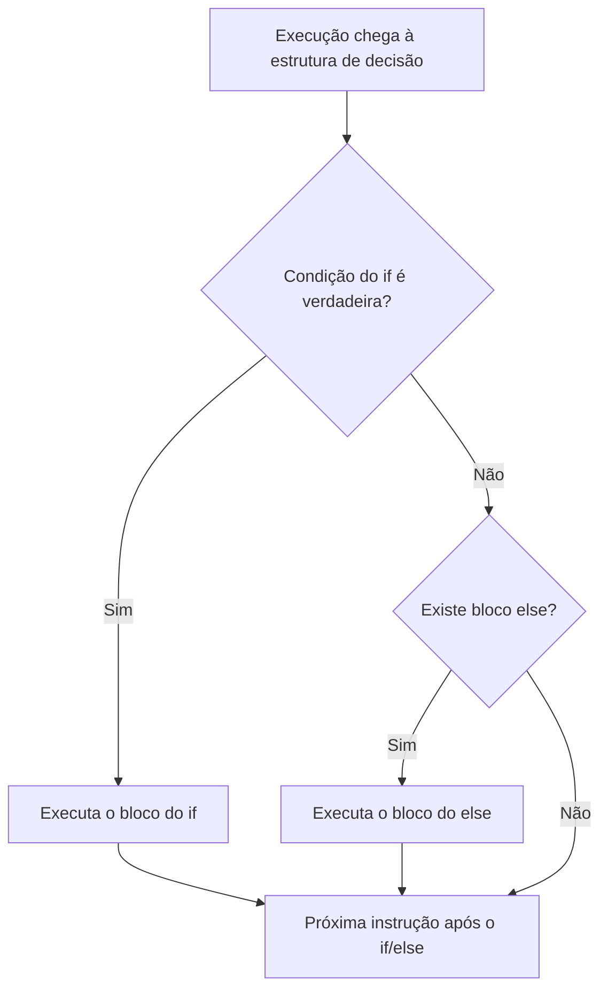

---
tags:
  - java
  - controle-de-fluxo
  - condicional
  - repeticao
  - dataprev
prerequisitos:
  - "[[Sintaxe-Essencial-de-Java]]"
  - "[[Logica-Sentencial]]"
  - "[[Raciocinio-Matematico-Aplicado]]"
---

# Controle de Fluxo e Repetição em Java

> [!info] Ementa
> **Vestibular FGV** → Seção 2: Desenvolvimento de Sistemas → Fundamentos da Linguagem Java
> - **Tópico 5**: Controle de fluxo: if, else, switch, case, break, for, while, do-while

---

## 1. Decisão e repetição: por que existem?

Um programa que executa instruções em linha reta, da primeira à última, raramente resolve um problema real. Você precisa de **decisão** (qual caminho seguir?) e **repetição** (quantas vezes repetir?). No SQL, você já conhece a ferramenta de decisão linha a linha:

```sql
SELECT * FROM beneficiario
WHERE idade >= 18 AND renda_mensal > 0;
```

O `WHERE` **filtra linhas**: para cada linha do conjunto, a condição é avaliada como verdadeira ou falsa, e só passam as verdadeiras — com `AND`/`OR`/`NOT` funcionando exatamente como na tabela-verdade. No Java, a mesma proposição lógica aparece em cinco estruturas: o `if/else` decide um caminho; o `switch/case` escolhe entre valores exatos; o `for` repete um número conhecido de vezes; o `while` repete enquanto a condição valer; e o `do-while` repete pelo menos uma vez, testando a condição no final. A diferença é o **contexto**: no SQL você percorre linhas de tabela; no Java, você decide o fluxo do próprio programa — mas a lógica é idêntica.

> [!tip] A ponte entre SQL e Java
> Pense no `WHERE` do SQL como um `if` que roda automaticamente para cada linha da tabela. No Java, você controla explicitamente quando e quantas vezes a condição é testada. É a mesma lógica de tabela-verdade, mas aplicada a fluxo de execução, não a filtragem de dados.

---

## 2. Estruturas de decisão

### 2.1 `if/else` — decidir um caminho

```java
if (idade >= 18 && rendaMensal > 0) {
    System.out.println("Beneficiário apto");
} else {
    System.out.println("Verificar elegibilidade");
}
```

Se a condição for `true`, executa o bloco do `if`; se for `false`, executa o bloco do `else` (quando existir). É o `se... então... senão...` do RLM: a condição é uma **proposição** avaliada em um único ponto do tempo. Uma cadeia `if/else if/else` testa várias condições em ordem — e a **primeira verdadeira vence**: as demais são ignoradas, mesmo que também fossem verdadeiras.

```java
// Exemplo DATAPREV: verificação de elegibilidade
if (idade >= 65) {
    System.out.println("Aposentadoria por idade");
} else if (idade >= 60 && tempoServico >= 35) {
    System.out.println("Aposentadoria por tempo de serviço");
} else {
    System.out.println("Não atende aos critérios");
}
```

Observe: se o beneficiário tem 66 anos, o primeiro `if` é `true` e o bloco é executado. As condições seguintes **não são avaliadas**, mesmo que também fossem verdadeiras. Isso é eficiente e evita resultados conflitantes.

### 2.2 `switch/case` — escolher entre valores exatos

Enquanto o `if/else` testa **condições arbitrárias** (`idade >= 65`, `renda > 0`), o `switch` testa se uma variável é **igual a valores específicos** — como um menu de opções. É mais legível quando há muitas alternativas:

```java
int opcao = scanner.nextInt();

switch (opcao) {
    case 1:
        System.out.println("Consultar benefício");
        break;
    case 2:
        System.out.println("Cadastrar novo beneficiário");
        break;
    case 3:
        System.out.println("Gerar relatório");
        break;
    default:
        System.out.println("Opção inválida");
        break;
}
```

Cada `case` compara o valor da variável com o literal após `case`. Se houver correspondência, executa a partir dali até encontrar um `break` (ou o fim do bloco). Sem `break`, a execução **continua caindo** nos cases seguintes — isso se chama *fall-through* e é fonte clássica de erro:

```java
// ERRO: sem break, todos os cases seguintes são executados
switch (opcao) {
    case 1:
        System.out.println("Consultar");
        // ← sem break! Continua para o case 2...
    case 2:
        System.out.println("Cadastrar");
        // ← sem break! Continua para o case 3...
    case 3:
        System.out.println("Relatório");
        break;
}
// Se opcao == 1, imprime: Consultar, Cadastrar E Relatório!
```

> [!tip] `switch` × `if/else if/else`
> | Critério | `switch` | `if/else if` |
> |---|---|---|
> | Tipo de teste | Igualdade com **valores fixos** | Qualquer condição booleana |
> | Legibilidade | Melhor para 3+ alternativas com o mesmo variável | Melhor para comparações com intervalos ou lógica complexa |
> | Performance | Pode ser otimizado pelo compilador (tabela de salto) | Avaliação sequencial |
> | Tipos aceitos | `int`, `char`, `String` (Java 7+), `enum` | Qualquer `boolean` |
>
> **Regra prática:** se todas as condições testam a **mesma variável** contra **valores exatos**, use `switch`. Se envolvem comparações, intervalos ou lógica combinada, use `if/else`.

> [!warning] PEGADINHA — fall-through e break
> A FGV cobra `switch` **sem `break`** e pergunta qual é a saída. O candidato que não sabe que a execução "cai" para o próximo case erra. **Sempre pergunte: "tem break no final de cada case?"** Se não tem, o código executa **todos** os cases seguintes até encontrar um `break` ou o fim do `switch`.

**Exemplo DATAPREV:** Cálculo de alíquota conforme faixa de renda:

```java
int faixa = 3; // 1 = baixa, 2 = média, 3 = alta
double aliquota;

switch (faixa) {
    case 1:
        aliquota = 0.0;      // isento
        break;
    case 2:
        aliquota = 0.15;     // 15%
        break;
    case 3:
        aliquota = 0.275;    // 27,5%
        break;
    default:
        aliquota = -1;       // erro: faixa desconhecida
        break;
}
```

O `default` funciona como o `else` do `switch` — captura qualquer valor que não correspondeu a nenhum `case`. É opcional, mas sua ausência pode causar bugs silenciosos.

---

## 3. Estruturas de repetição

### 3.1 `for` — repetir com contador

O `for` é usado quando **o número de repetições é conhecido**. Sua cabeça tem três partes separadas por `;`:

```java
// (1) inicialização ; (2) condição ; (3) atualização
for (int i = 0; i < 10; i++) {
    System.out.println("Tentativa " + i);
}
```

Três partes comandam a repetição: **inicialização** (`int i = 0`) — cria o contador e roda uma única vez; **condição** (`i < 10`) — avaliada **antes de cada volta**; se falsa, o laço termina; **atualização** (`i++`) — roda ao **final de cada volta**. A sequência real de execução é: inicializa → testa → executa o corpo → atualiza → testa → ... até a condição falhar. No exemplo, `i` assume `0, 1, 2, ..., 9` — dez repetições, porque `i < 10` falha quando `i` chega a `10`.

> [!tip] Passo a passo do `for`
> Vamos rastrear `for (int i = 0; i < 3; i++)`:
> 1. **Inicialização**: `i = 0` (roda uma vez)
> 2. **Teste**: `0 < 3`? → `true` → entra no corpo
> 3. **Corpo**: executa as instruções
> 4. **Atualização**: `i++` → `i` vira `1`
> 5. **Teste**: `1 < 3`? → `true` → entra no corpo
> 6. **Corpo**: executa as instruções
> 7. **Atualização**: `i++` → `i` vira `2`
> 8. **Teste**: `2 < 3`? → `true` → entra no corpo
> 9. **Corpo**: executa as instruções
> 10. **Atualização**: `i++` → `i` vira `3`
> 11. **Teste**: `3 < 3`? → `false` → laço termina
>
> Resultado: 3 execuções do corpo (com `i` valendo 0, 1, 2).

> [!warning] PEGADINHA — o erro de "um a mais / um a menos"
> `for (int i = 0; i <= 10; i++)` executa **11** vezes (0 a 10), não 10. O `<=` é o detalhe que muda a contagem. Em prova, conte as voltas **examinando a condição**, não de cabeça: `i < 10` → 10 voltas; `i <= 10` → 11 voltas.

**Exemplo DATAPREV com `for`:** Processar 100 benefícios em lote:

```java
for (int i = 1; i <= 100; i++) {
    System.out.println("Processando benefício " + i);
    // Aqui iria a lógica de cálculo do benefício
}
```

Note que o contador começa em 1 (para facilitar a leitura) e vai até 100. A condição é `i <= 100` porque queremos incluir o 100.

### 3.2 `while` — repetir enquanto a condição valer

O `while` serve quando **não se sabe de antemão quantas vezes** a repetição vai ocorrer — o fim depende de uma condição que muda durante a execução:

```java
int filaDePendencias = 3;          // 3 benefícios pendentes na fila
while (filaDePendencias > 0) {
    System.out.println("Processando benefício...");
    filaDePendencias--;            // sem esta linha, loop infinito!
}
```

A condição é avaliada **antes de cada volta**: se já começar falsa (`filaDePendencias` igual a 0), o corpo **nem executa uma vez**. E a atualização tem que vir de dentro do corpo — se a variável da condição nunca muda, o laço é **infinito** e o programa nunca termina; na prova, "a execução continuará indefinidamente" é a consequência correta.

> [!tip] Comparação `for` × `while`
> | Situação | Use `for` | Use `while` |
> |---|---|---|
> | Número de repetições **conhecido** antes de começar | `for (int i=0; i<10; i++)` | — |
> | Fim depende de **condição** que muda durante execução | — | `while (filaDePendencias > 0)` |
> | Contador **automático** | Sim (parte da sintaxe) | Não (precisa atualizar manualmente) |
> | Risco de **loop infinito** | Menor (contador está na cabeça) | Maior (atualização esquecida no corpo) |
>
> Na prática, ambos podem resolver o mesmo problema — mas a escolha correta indica clareza de raciocínio. A FGV cobra essa distinção: "use `for` quando souber quantas vezes; use `while` quando depender de condição".

**Exemplo DATAPREV com `while`:** Ler registros enquanto houver dados:

```java
int registrosRestantes = totalRegistros;
while (registrosRestantes > 0) {
    // Processa um registro
    System.out.println("Registrando...");
    registrosRestantes--;
}
```

**Cuidado:** se esquecer `registrosRestantes--`, o laço nunca termina. O programa trava, consome recursos e a banca descreve isso como "execução continuará indefinidamente".

### 3.3 `do-while` — executar pelo menos uma vez

A diferença entre `while` e `do-while` é **quando a condição é testada**: no `while`, antes de cada volta (pode executar **zero** vezes); no `do-while`, **depois** de cada volta (executa **pelo menos uma** vez).

```java
int opcao;
do {
    System.out.println("1 - Consultar benefício");
    System.out.println("2 - Sair");
    opcao = scanner.nextInt();
} while (opcao != 2);
```

O corpo roda primeiro, **depois** a condição é avaliada. Se o usuário digitar `5`, `0` ou qualquer valor inválido, o menu aparece novamente — o programa nunca ignora a primeira tentativa.

> [!tip] Quando usar `do-while` vs `while`
> | Situação | Use `while` | Use `do-while` |
> |---|---|---|
> | O corpo pode **não executar** vez nenhuma | `while (registros > 0)` | — |
> | O corpo **precisa rodar pelo menos uma** vez | — | Validação de entrada, menu interativo |
> | Condição depende de **dados que o corpo coleta** | Risco de variável não inicializada | Seguro: dados coletados antes do teste |
>
> **Exemplo DATAPREV:** Validação de CNIS — o sistema precisa ler o número pelo menos uma vez para saber se é válido:
> ```java
> String cnis;
> do {
>     System.out.print("Informe o CNIS: ");
>     cnis = scanner.nextLine();
> } while (cnis.length() != 11);
> ```

> [!warning] PEGADINHA — `do-while` com ponto e vírgula
> A sintaxe termina com `;` depois da condição: `} while (condição);`. Esquecer esse `;` é erro de compilação. A FGV adora testar isso indiretamente — "o código compila?" sempre com `do-while` na alternativa.

### 3.4 `for` e `while` são equivalentes

Qualquer `for` pode ser reescrito como `while` — e vice-versa. São a mesma coisa por dentro, só muda a **organização** do código:

```java
// Esses dois blocos fazem EXATAMENTE a mesma coisa:

// Com for:
for (int i = 0; i < 3; i++) {
    System.out.println(i);
}

// Com while:
int i = 0;          // inicialização
while (i < 3) {     // condição
    System.out.println(i);
    i++;             // atualização
}
```

O `for` apenas **reúne as três partes** (inicialização, condição, atualização) em uma única linha na cabeça do laço. O compilador Java traduz ambos para a mesma instrução de máquina.

> [!tip] `for` × `while` — a diferença é **intenção**, não funcionalidade
> | Aspecto | `for` | `while` |
> |---|---|---|
> | Onde ficam as peças | Tudo na cabeça: `for(init; cond; update)` | Espalhadas: init antes, cond no `while`, update no corpo |
> | Leitura | "Repita N vezes" | "Repita enquanto acontecer X" |
> | Erros comuns | Menos (contador visível) | Mais (esquece o update → loop infinito) |
> | Uso idiomático | Contagem, iteração sobre coleções | Condição depende de leitura, rede, banco de dados |
>
> **Analogia — ir ao supermercado:**
> - **`for`** = "Vou comprar **exatamente 5 itens**" — você sabe o número antes de sair de casa
> - **`while`** = "Vou comprar **enquanto tiver dinheiro**" — só descobre quando acabou
>
> Os dois resultam em uma ida ao supermercado. A diferença é o que você **sabe antes de começar**.

> [!warning] PEGADINHA — "o código compila?"
> Em prova, se aparecer um `for` reescrito como `while` (ou vice-versa), não fique em dúvida: **ambos produzem o mesmo efeito**. A banca pode tentar confundir perguntando se um é "mais eficiente" que o outro — não é. A escolha é de **legibilidade**, não de desempenho.

---

## 4. Resumo visual

O fluxograma abaixo resume o jogo de decisão — o caminho percorrido depende da condição, exatamente como nas proposições do [[Logica-Sentencial|RLM]]:



---

## 5. Como a FGV cobra controle de fluxo

> [!tip] Estratégia de resolução
> A banca adora criar código com `for`, `while`, `do-while` ou `switch` e perguntar: **"Qual é a saída?"** ou **"Quantas vezes o laço executa?"**. Para resolver:
> 1. **Anote a variável de controle** e seu valor inicial
> 2. **Rastreie cada iteração**: teste → corpo → atualização
> 3. **Pare quando a condição falhar**
> 4. **Conte** quantas vezes o corpo foi executado
>
> Não decore padrões — simule passo a passo no rascunho.

---

## Referências

- [[Sintaxe-Essencial-de-Java]]
- [[Logica-Sentencial]]
- [[Raciocinio-Matematico-Aplicado]]
