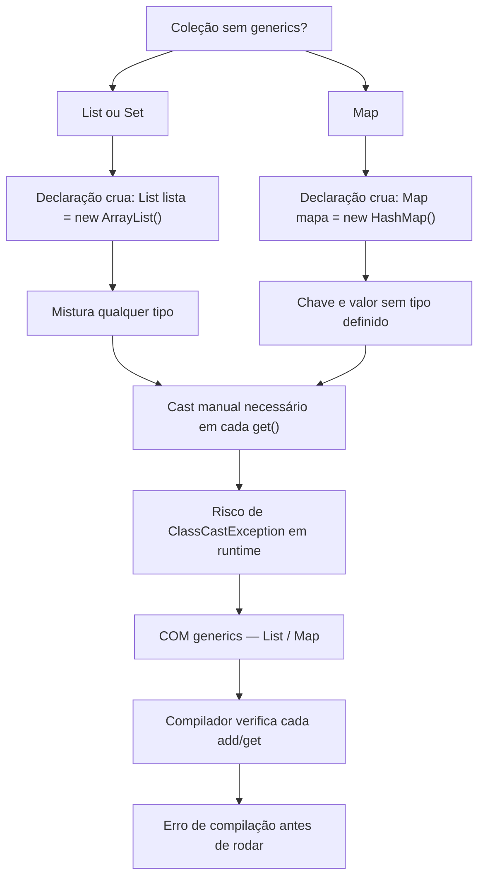

# Generics — Tipos Parametrizados em Java

> [!info] Metadados
> **Disciplina:** Desenvolvimento de Sistemas
> **Bloco:** 4.1 — Desenvolvimento de Sistemas (FASE 4 — Núcleo de Desenvolvimento)
> **Tópico:** 1. Java — Fundamentos da Linguagem — Generics
> **Subtópicos:** Tipos parametrizados · Segurança de tipos em tempo de compilação · Eliminação de casts · Diamond operator (`<>`) · Classes e métodos genéricos (menção)
> **Pré-requisitos:** [[Colecoes-Java|Coleções Java]]; [[Tipos-Primitivos-e-Wrappers|Tipos Primitivos e Wrappers]]
> **Cargo:** Analista de TI — Perfil 3 (Desenvolvimento de Software) · DATAPREV 2026
> **Data:** 2026-09-09

---

## 1. Por que estudar Generics?

Na [[Colecoes-Java|nota de Coleções]], você aprendeu a armazenar e manipular conjuntos de dados usando `List`, `Set` e `Map`. Mas imagine a seguinte situação: você precisa criar uma lista para armazenar CPFs de beneficiários do INSS. Sem generics, qualquer coisa pode entrar nessa lista — uma String, um Integer, um objeto qualquer — e o compilador não reclama. O erro só aparece quando o programa já está rodando, e aí é tarde demais.

É exatamente para resolver esse problema que os **generics** existem. Eles permitem que você declare, no momento em que cria a lista, **qual tipo de dado** ela deve aceitar. Se alguém tentar colocar o tipo errado, o compilador barra na hora — antes de o programa rodar.

Pense assim: sem generics, uma coleção é uma caixa onde cabe qualquer coisa. Com generics, a caixa ganha uma etiqueta — "somente Strings", "somente objetos `Beneficiario`" — e o compilador age como um porteiro que verifica a etiqueta antes de deixar algo entrar. Se a etiqueta diz `String` e alguém tenta colocar um `Integer`, há erro de compilação, não erro em tempo de execução.

Essa proteção se conecta diretamente com o conceito de [[Tipos-Primitivos-e-Wrappers|autoboxing]] que você já estudou: o compilador só consegue agir como porteiro se souber qual tipo esperar — e generics é justamente a forma de dizer isso.

---

## 2. O problema: coleções sem generics

Antes do Java 5 (2004), todas as coleções trabalhavam com o tipo `Object`. Qualquer objeto podia ser adicionado a qualquer lista, e o compilador não tinha como saber o que havia dentro dela. O código compilava sem problemas, mas podia explodir em runtime.

Veja um exemplo que ilustra o problema com clareza:

```java
import java.util.ArrayList;
import java.util.List;

public class ProblemaSemGenerics {
    public static void main(String[] args) {
        // Lista "crua" — sem generics
        List lista = new ArrayList();

        // Adiciona diferentes tipos sem problema de compilação
        lista.add("Maria");
        lista.add("12345678901");  // CPF como String
        lista.add(42);             // Integer — o compilador não reclama!

        // Para recuperar, preciso fazer CAST manual
        String nome = (String) lista.get(0);  // funciona
        String cpf  = (String) lista.get(1);  // funciona

        // Mas e se alguém esquecer que o 3º elemento é Integer?
        String x = (String) lista.get(2);     // ClassCastException em runtime!
    }
}
```

O que acontece aqui? O compilador não sabe que `lista` deveria conter apenas Strings. Ele aceita o `42` sem reclamar. Só quando tentamos fazer o cast `(String)` em cima de um `Integer` é que o programa **lança `ClassCastException`** — ou seja, o erro ocorre durante a execução, não na compilação.

> [!warning] Pegadinha clássica em prova
> **A armadilha:** afirmar que `List` sem generics causa erro de compilação ao misturar tipos.
> **O raciocínio errado:** "se o compilador permite `lista.add(42)` numa lista de Strings, logo o erro é de compilação."
> **Como se proteger:** o erro de compilação **não acontece** quando se misturam tipos em lista crua — o compilador não tem como saber o que deveria estar lá. O erro é de **runtime** (`ClassCastException`). É justamente isso que generics resolve: transfere a verificação do runtime para o **tempo de compilação**.

---

## 3. A solução: coleções com generics

Quando você adiciona o tipo parametrizado entre `< >` na declaração da lista, está dizendo ao compilador: "essa lista só aceita este tipo". O compilador passa a verificar cada `add()` e cada `get()`.

```java
import java.util.ArrayList;
import java.util.List;

public class ComGenerics {
    public static void main(String[] args) {
        // Lista genérica — só aceita Strings
        List<String> nomes = new ArrayList<>();

        nomes.add("Maria");
        nomes.add("João");

        // nomes.add(42);  // ERRO DE COMPILAÇÃO! O compilador barra na hora.

        // Recupera SEM cast — o tipo já é conhecido
        String primeiro = nomes.get(0);  // Maria
        String segundo  = nomes.get(1);  // João
    }
}
```

Duas coisas importantes aconteceram aqui. Primeiro, a linha `nomes.add(42)` **não compila** — o compilador sabe que a lista é de Strings e não deixa um Integer entrar. Segundo, ao fazer `nomes.get(0)`, o resultado já é tratado como `String` automaticamente: **não há necessidade de cast manual**. Isso é a **eliminação de casts** — um dos benefícios práticos dos generics.

> [!question] O que muda entre `List` e `List<String>`?
> `List` é a interface. `List<String>` é a mesma interface, mas **parametrizada** — o `<String>` é o **tipo parametrizado**, o parâmetro de tipo. O compilador substitui as menções a `String` durante a verificação do código — e a segurança toda acontece nesse momento, em **compilação**. O que ocorre com essa informação de tipo em runtime é tema da seção 8.

---

## 4. Generics e coleções: a combinação do dia a dia

Generics são usados com constância nas coleções. Veja os padrões mais comuns que aparecem em código real e em provas:

```java
// Lista de Strings — mais simples
List<String> cidades = new ArrayList<>();
cidades.add("Brasília");
cidades.add("Rio de Janeiro");

// Lista de objetos de domínio — pensando na DATAPREV
List<Beneficiario> beneficiarios = new ArrayList<>();
beneficiarios.add(new Beneficiario("Maria", "123.456.789-00"));
beneficiarios.add(new Beneficiario("João", "987.654.321-00"));
// beneficiarios.add("texto");  // ERRO — não é Beneficiario

// Map: chave String, valor Double (margem por banco, por exemplo)
Map<String, Double> margens = new HashMap<>();
margens.put("Banco do Brasil", 15.5);
margens.put("Caixa Econômica", 12.3);
// margens.put("Banco X", "15,5");  // ERRO — valor deve ser Double

// Set de Integers — sem duplicatas
Set<Integer> ids = new HashSet<>();
ids.add(101);
ids.add(102);
// ids.add(102);  // compilou, mas não adiciona duplicata
```

Repare como o padrão é sempre o mesmo: **`Interface<Tipo>`**. O tipo vai entre `< >` e pode ser qualquer classe ou interface — `String`, `Integer`, `Beneficiario`, `Double`. Para tipos primitivos como `int`, `double`, `boolean`, não é possível usar diretamente: o compilador exige a versão **wrapper** — `Integer`, `Double`, `Boolean`. Isso é uma ponte direta com o conceito de [[Tipos-Primitivos-e-Wrappers|autoboxing]]: o Java converte automaticamente entre primitivo e wrapper, mas generics só aceitam o wrapper.

> [!warning] Não existe `List<int>`!
> **A armadilha:** a questão propõe `List<int>` ou `Map<int, String>` como código válido.
> **O raciocínio errado:** "primitivos funcionam em generics igual em qualquer outro lugar."
> **Como se proteger:** generics aceitam apenas tipos por referência (classes), não tipos primitivos. A alternativa correta é `List<Integer>`. O autoboxing cuida da conversão automática entre `int` e `Integer` quando necessário.

O fluxograma abaixo resume a decisão de quando usar generics e o que eles protegem:



---

## 5. Diamond operator `<>` — inferência de tipo

Desde o Java 7, você não precisa repetir o tipo à direita da atribuição. O compilador **infere** o tipo a partir do lado esquerdo. Veja a evolução:

```java
// Java 5/6 — redundante, mas válido
List<String> nomes = new ArrayList<String>();

// Java 7+ — diamond operator <>
List<String> nomes = new ArrayList<>();
```

O `<>` se chama **diamond operator** (operador diamante). Ele não muda nada em termos de funcionamento — o tipo continua sendo `String`. A única diferença é a **legibilidade**: você escreve o tipo uma vez, e o compilador repete para você.

```java
// Funciona para qualquer coleção genérica
Map<String, List<Integer>> dados = new HashMap<>();
//        ↑ tipo inferido: List<Integer>

Set<Double> valores = new HashSet<>();
//    ↑ tipo inferido: Double
```

> [!tip] Na prova, fique atento ao operador diamante
> A banca pode apresentar código com `<>` e perguntar qual o tipo inferido. A regra é simples: **o tipo à esquerda da atribuição é o tipo dentro do diamond**:
>
> ```java
> Map<String, List<Integer>> dados = new HashMap<>();
> ```
>
> No exemplo, o `<>` equivale a `<String, List<Integer>>`. Sempre olhe para a declaração da variável.

> [!warning] `<>` é Java 7+
> Se a questão mencionar Java 5 ou 6 e usar diamond operator, o código não compila nessa versão. Essa é uma pegadinha sutil: a banca testa se você sabe **em que versão** o `<>` foi introduzido.

---

## 6. Classes e métodos genéricos

Até agora, vimos generics aplicados a coleções — `List<String>`, `Map<String, Double>`. Mas generics são um recurso da linguagem que vai além das coleções. Você pode criar suas **próprias classes e métodos** que trabalham com tipos parametrizados.

### 6.1 Classe genérica

Uma classe genérica define um **parâmetro de tipo** (geralmente representado por uma letra maiúscula, como `T`, `E`, `K`, `V`) que é substituído por um tipo concreto no momento em que a classe é usada.

```java
// Uma caixa que guarda qualquer tipo de objeto
public class Caixa<T> {
    private T conteudo;

    public void guardar(T item) {
        this.conteudo = item;
    }

    public T pegar() {
        return this.conteudo;
    }
}
```

O `T` é um **parâmetro de tipo**. Ele não é um tipo específico — é um "placeholder", um espaço reservado. Quando você usa a classe, esse `T` é substituído pelo tipo real:

```java
Caixa<String> caixaTexto = new Caixa<>();
caixaTexto.guardar("Meu documento");
String texto = caixaTexto.pegar();   // tipo seguro: String

Caixa<Integer> caixaNumero = new Caixa<>();
caixaNumero.guardar(42);
Integer numero = caixaNumero.pegar();  // tipo seguro: Integer
```

Uma mesma classe `Caixa` serve para String e para Integer — sem duplicar código, sem casts, com segurança de tipos. É exatamente a ideia de **escrever uma vez, usar com qualquer tipo**.

> [!note] Vocabulário de objeto — uma ponte com o tópico 2
> `new Caixa<>()` **cria um objeto** a partir da classe; `this.conteudo` refere-se ao **campo da própria instância** (a `Caixa` que está sendo usada). São usos mínimos do vocabulário de instanciação — o conceito (objeto, construtor, `this`) é do [[Paradigma-Orientado-a-Objetos|tópico 2]].

> [!question] Por que a letra `T` e não `X` ou `Z`?
> O Java adota convenções para os nomes dos parâmetros de tipo: **`T`** = Type (tipo), **`E`** = Element (elemento), **`K`** = Key (chave), **`V`** = Value (valor). Não existe regra rígida — você pode usar qualquer letra — mas seguir a convenção melhora a legibilidade. Em provas, as letras `T`, `E`, `K` e `V` aparecem frequentemente.

### 6.2 Método genérico

Um método genérico declara seu **próprio** parâmetro de tipo, independentemente da classe. O parâmetro de tipo aparece **antes do tipo de retorno** na assinatura do método.

```java
public class Utilidades {

    // Método genérico: funciona com qualquer tipo
    public static <T> T primeiroElemento(T[] array) {
        if (array != null && array.length > 0) {
            return array[0];
        }
        return null;
    }
}
```

Observe a sintaxe: `<T>` aparece **antes** do tipo de retorno `T`. Isso diz ao compilador: "T é um parâmetro de tipo definido por este método". Veja como ele é usado:

```java
String[] nomes = {"Ana", "Bia", "Carlos"};
String primeiro = Utilidades.primeiroElemento(nomes);  // Ana — tipo inferido

Integer[] numeros = {10, 20, 30};
Integer primeiroNum = Utilidades.primeiroElemento(numeros);  // 10 — tipo inferido
```

O compilador **infere** o tipo `T` a partir do argumento passado. Se você passa `String[]`, o `T` vira `String`. Se passa `Integer[]`, vira `Integer`. Seguro e sem cast.

> [!note] Métodos genéricos são frequentes nas APIs do Java
> Collections.sort(List<T>), Collections.max(Collection<T>), List.of(T...) — todos são exemplos de métodos genéricos do JDK. Entender a sintaxe `<T>` antes do retorno ajuda a ler qualquer API Java com confiança.

### 6.3 Wildcards — conceito de passagem

Em situações mais avançadas, você pode se deparar com o curinga `?` nos generics. Por exemplo:

```java
public static void imprimirLista(List<?> lista) {
    for (Object item : lista) {
        System.out.println(item);
    }
}
```

O `?` é o **wildcard** (curinga). Ele diz: "aceito qualquer tipo". O método `imprimirLista` aceita `List<String>`, `List<Integer>`, `List<Beneficiario>` — qualquer lista.

> [!note] Wildcards e o escopo desta nota
> Wildcards avançados (`? extends T` para covariância, `? super T` para contravariância) são temas do ecossistema de POO e de uso em APIs de bibliotecas. No contexto desta ementa, basta saber que `?` existe e significa "qualquer tipo". Se uma prova mencionar `List<?>`, saiba que se trata de uma lista que aceita qualquer tipo de objeto — sem precisar se aprofundar em covariância ou contravariância.

---

## 7. Segurança de tipos: compilação vs. execução

O ponto central dos generics é onde acontece a verificação. Vamos comparar lado a lado para fixar:

| Aspecto | Sem generics | Com generics |
|---|---|---|
| **Onde o erro é detectado** | Em runtime (execução) | Em compilação |
| **Tipo de erro** | `ClassCastException` | Erro de compilação ("incompatible types") |
| **Cast manual** | Necessário em todo `get()` | Eliminado |
| **Mistura de tipos** | Permitida pelo compilador | Bloqueada pelo compilador |
| **Debug** | Difícil — erro em produção | Fácil — erro antes de rodar |

Pense no compilador Java como um revisor que lê seu código antes de deixá-lo rodar. Sem generics, o compilador não tem informações suficientes para revisar — ele vê uma `List` e aceita qualquer coisa. Com generics, o compilador recebe uma instrução precisa: "essa lista só aceita `Beneficiario`". Qualquer desvio gera alerta imediato.

Essa mudança de **quando** o erro é detectado — runtime para compilação — é a essência do benefício dos generics. Em um sistema como o da DATAPREV, onde listas de beneficiários, mapas de cálculos e registros de benefícios circulam pelo código, ter essa verificação em compilação é a diferença entre um bug descoberto pelo desenvolvedor e um bug descoberto pelo usuário final.

---

## 8. Type erasure — menção de passagem

Um detalhe técnico que pode surgir em provas: em tempo de execução, a JVM **remove** a informação de tipo dos generics. Isso se chama **type erasure** (apagamento de tipo). Significa que, para a máquina virtual, `List<String>` e `List` são a mesma coisa.

Por que isso existe? Por compatibilidade. Quando o Java 5 introduziu generics, era necessário que o novo código pudesse interagir com código antigo (escrito antes de generics). O type erasure garante que uma `List<String>` possa ser passada para um método que espera uma `List` antiga — sem quebrar o código já existente.

Em provas, o type erasure pode aparecer em questões que perguntam sobre comportamento em runtime. O ponto essencial é: **toda a verificação de tipo dos generics acontece em compilação**. Em runtime, o Java trabalha como se generics não existissem — mas o código já está correto porque o compilador garantiu isso. A pegadinha típica desse ponto está na seção 9.2 (Pegadinha 4).

---

## 9. Como a FGV cobra este tópico

### 9.1 Palavras-chave e expressões de referência

| Palavra-chave / Expressão | O que sinaliza |
|---|---|
| **Generics / tipo parametrizado** | Questão sobre o conceito ou uso básico |
| **Segurança de tipos em tempo de compilação** | Vantagem central dos generics |
| **Cast / ClassCastException** | O problema que generics elimina |
| **Diamond operator / `<>`** | Java 7+, inferência de tipo |
| **`List<T>` / `Map<K,V>`** | Sintaxe de uso com coleções |
| **`List<int>` / tipos primitivos** | Pegadinha: não existe, precisa de wrapper |
| **Type erasure** | Comportamento em runtime vs. compilação |
| **Classe / método genérico** | `Caixa<T>`, `<T> tipo metodo()` |

### 9.2 O padrão "armadilha → raciocínio errado → proteção"

> [!warning] Pegadinha 1 — ClassCastException em lista sem generics
> **A armadilha:** código com `List lista = new ArrayList();` que adiciona String e Integer, e depois faz `(String) lista.get(1)` — a pergunta é "o que acontece?".
> **O raciocínio errado:** "compila normalmente e imprime o valor." ou "erro de compilação."
> **Como se proteger:** o compilador não verifica tipos em lista crua. O cast `(String)` em cima de um `Integer` gera **`ClassCastException` em runtime**. A resposta correta é sempre "erro em tempo de execução" ou "ClassCastException".

> [!warning] Pegadinha 2 — `List<int>` não existe
> **A armadilha:** a questão apresenta `List<int>` ou `ArrayList<double>` como código válido.
> **O raciocínio errado:** "int é um tipo, então funciona."
> **Como se proteger:** generics trabalham apenas com **tipos por referência**. Use `List<Integer>` e `ArrayList<Double>`. O autoboxing cuida da conversão.

> [!warning] Pegadinha 3 — diamond operator e versão do Java
> **A armadilha:** código com `<>` sendo executado em Java 5.
> **O raciocínio errado:** "diamond operator é tão antigo quanto generics."
> **Como se proteger:** o `<>` foi introduzido no **Java 7**. Em Java 5 ou 6, o código `new ArrayList<>()` não compila — é necessário repetir o tipo: `new ArrayList<String>()`.

> [!warning] Pegadinha 4 — type erasure e runtime
> **A armadilha:** "em runtime, `List<String>` é diferente de `List<Integer>`."
> **O raciocínio errado:** "a sintaxe é diferente, logo o tipo é diferente na JVM."
> **Como se proteger:** **type erasure** remove a informação de tipo em runtime. Para a JVM, ambos são `List`. A segurança toda está na compilação.

> [!note] Método de eliminação em três passos
> **(1)** Pergunte **onde o erro ocorre**: compilação ou runtime? Sem generics, misturar tipos só explode em execução; com generics, o compilador barra antes. **(2)** Pergunte **o que o código usa**: existe `<Tipo>` na declaração? Existe `< >` na instanciação? Existe primitivo dentro de `< >`? **(3)** Pergunte **qual versão do Java**: se a questão menciona Java 5/6, `<>` não existe. Essas três perguntas resolvem a maioria das questões de generics.

---

## 10. Questões-modelo

> [!example] Questão 1
> Considere o trecho de código abaixo:
> ```java
> List lista = new ArrayList();
> lista.add("texto");
> lista.add(123);
> String s = (String) lista.get(1);
> ```
> Qual é o resultado da execução desse código?
>
> **(A)** Compila e imprime `123`.
> **(B)** Erro de compilação na linha `lista.add(123)`.
> **(C)** Erro de compilação na linha `(String) lista.get(1)`.
> **(D)** Exceção `ClassCastException` em tempo de execução.
> **(E)** Compila e imprime `texto`.

> [!note] Gabarito e comentário — Questão 1
> **Resposta: (D)**
> A lista não possui generics (`List` crua). O compilador aceita qualquer tipo: tanto `"texto"` quanto `123` entram sem erro. O erro não é de compilação (elimina B e C). Ao executar `(String) lista.get(1)`, o Java tenta converter um `Integer` para `String` — isso gera `ClassCastException`. O cast `(String)` não está na compilação, e sim em runtime. Não imprime nada porque a exceção interrompe a execução (elimina A e E). A armadilha está em confundir erro de compilação com exceção em execução.

> [!example] Questão 2
> Qual das alternativas abaixo apresenta a **principal vantagem** do uso de generics em Java?
>
> **(A)** Elimina a necessidade de importar pacotes como `java.util`.
> **(B)** Permite que uma lista aceite qualquer tipo de dado sem restrição.
> **(C)** Garante que erros de tipo sejam detectados em tempo de compilação, evitando exceções em runtime.
> **(D)** Aumenta a velocidade de execução do programa por serem verificados apenas em compilação.
> **(E)** Substitui totalmente os tipos primitivos por tipos wrapper.

> [!note] Gabarito e comentário — Questão 2
> **Resposta: (C)**
> A principal vantagem dos generics é a **segurança de tipos em tempo de compilação**. Com generics, o compilador verifica se o tipo está correto antes do programa rodar, eliminando a necessidade de casts manuais e prevenindo `ClassCastException`. A alternativa (A) é irrelevante — generics não têm relação com importação. (B) descreve o oposto: generics restringem o tipo, não liberam. (D) é falso — generics não afetam performance (type erasure inclusive apaga o tipo em runtime). (E) confunde generics com autoboxing — são conceitos distintos, embora complementares.

> [!example] Questão 3
> Qual das opções abaixo contém erro de compilação?
>
> **(A)** `List<String> nomes = new ArrayList<>();`
> **(B)** `Map<String, Double> precos = new HashMap<>();`
> **(C)** `List<int> numeros = new ArrayList<>();`
> **(D)** `Set<Integer> ids = new HashSet<>();`
> **(E)** `Caixa<String> caixa = new Caixa<>();` (considerando classe `Caixa<T>` definida)

> [!note] Gabarito e comentário — Questão 3
> **Resposta: (C)**
> `List<int>` não é válido — generics aceitam apenas tipos por referência. O correto seria `List<Integer>`. As alternativas (A), (B), (D) e (E) seguem a sintaxe correta de generics com tipos wrapper ou classes. A armadilha está em reconhecer que `int` não pode ser usado diretamente como tipo parametrizado.

---

## 11. Revisão rápida

| Conceito | Ponto-chave | Erro mais comum em prova |
|---|---|---|
| **O que são generics** | Tipos parametrizados — definem o tipo que uma coleção aceita | Confundir com polimorfismo |
| **Sem generics** | Lista crua aceita qualquer `Object`; cast manual necessário | Achar que causa erro de compilação (é runtime) |
| **Com generics** | Compilador verifica tipos; cast eliminado | Achar que funciona em runtime (é compilação) |
| **Diamond `<>`** | Inferência de tipo; Java 7+ | Achar que é Java 5+ |
| **`List<int>`** | Não existe — usar `List<Integer>` | Esquecer que generics não aceitam primitivos |
| **Classe genérica** | `Caixa<T>` — `T` é parâmetro de tipo | Confundir `T` com tipo concreto |
| **Método genérico** | `<T> antes do retorno` — método define seu próprio tipo | Confundir com tipo da classe |
| **Type erasure** | Em runtime, `List<String>` == `List` | Achar que tipo persiste em runtime |
| **Wildcards** | `?` aceita qualquer tipo | Aprofundar além da ementa |

> [!tip] Resumo em uma frase
> Generics movem a verificação de tipo do **runtime** (exceção perigosa) para a **compilação** (erro seguro), e o diamond operator `<>` torna a escrita mais limpa sem mudar o funcionamento.

---

## 12. Próximos passos

Este é o **último subtópico do tópico 1** — Java Fundamentos da Linguagem. Você agora domina a [[Sintaxe-Essencial-de-Java|sintaxe essencial]], os [[Tipos-Primitivos-e-Wrappers|tipos primitivos e wrappers]], as [[Colecoes-Java|coleções]] e os generics — a base sólida para programar em Java.

O próximo passo natural é entrar no [[Paradigma-Orientado-a-Objetos|tópico 2 — Paradigma Orientado a Objetos]], onde você verá como encapsulamento, herança e polimorfismo se combinam com tudo que estudou até aqui. Os generics, aliás, são reaproveitados constantemente em POO — classes genéricas e wildcards serão aprofundados no contexto de hierarquias e interfaces.

Consulte sempre o [[Java-Fundamentos-da-Linguagem|índice do tópico 1]] para navegar entre as subnotas e revisar qualquer fundamento antes de avançar.
