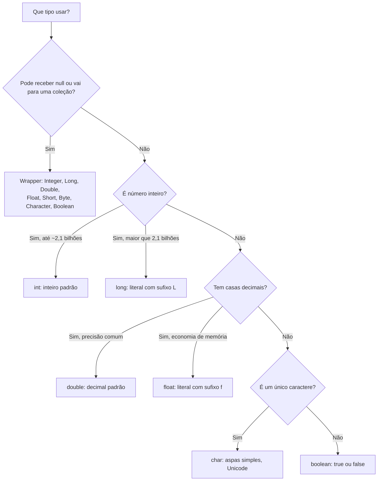

# Tipos Primitivos e Wrappers

> [!info] Metadados
> **Disciplina:** Desenvolvimento de Sistemas
> **Bloco:** 4.1 — Desenvolvimento de Sistemas (FASE 4 — Núcleo de Desenvolvimento)
> **Tópico:** 1. Java — Fundamentos da Linguagem — Tipos primitivos e wrappers
> **Subtópicos:** Os 8 tipos primitivos (byte, short, int, long, float, double, char, boolean) · Wrappers (Integer, Long, Double, Float, Short, Byte, Character, Boolean) · Autoboxing e unboxing
> **Pré-requisitos:** [[Sintaxe-Essencial-de-Java|Sintaxe Essencial de Java]]
> **Cargo:** Analista de TI — Perfil 3 (Desenvolvimento de Software) · DATAPREV 2026
> **Data:** 2026-09-09

---

Esta subnota desenvolve o subtópico **Tipos primitivos e wrappers** do índice [[Java-Fundamentos-da-Linguagem|Java — Fundamentos da Linguagem]]. Nela, os tipos de dados de Java deixam de ser uma tabela decorada e passam a ser uma **engrenagem** que você precisa entender para declarar variáveis, guardar valores e — pouco adiante — alimentar [[Colecoes-Java|coleções]].

## 1. Por que estudar tipos primitivos e wrappers?

Na subnota anterior, [[Sintaxe-Essencial-de-Java|Sintaxe Essencial de Java]], você aprendeu a **declarar variáveis**: o tipo vem antes do nome, e valores como `idade`, `salario` e `ativo` ganharam tipos na declaração. Agora a pergunta muda de "como se escreve?" para "**o que cada tipo significa de verdade?**" — e é aqui que mora uma das pegadinhas mais frequentes do edital.

Pense no seu cotidiano de sistemas da DATAPREV. Um benefício precisa guardar:

- a **idade** do beneficiário (um inteiro, geralmente pequeno — `int`);
- o **salário** com centavos (um decimal — `double`);
- o **CPF** como número (11 dígitos — isso já *não* cabe em `int`!);
- a **UF** de um endereço (um único caractere — `char`);
- a **flag** "beneficiário ativo?" (verdadeiro ou falso — `boolean`).

Se você declarar um `int` para guardar `12345678901`, o código **não compila** — o número tem 11 dígitos e o `int` só comporta até cerca de 2,1 bilhões. Essa escolha de tipo não é detalhe burocrático: é decisão de engenharia, e é exatamente o que a banca testa.

O Java organiza seus tipos em **dois mundos** que não se misturam sozinhos:

- os **primitivos** — valores puros, guardados diretamente na memória, rápidos, **sem métodos**;
- os **wrappers** — classes que "embrulham" cada primitivo em um **objeto**, com métodos e com a capacidade de representar a **ausência de valor** (`null`).

> [!question] Pergunta orientadora
> Se a variável `int` guarda apenas o número e nada mais, como um sistema representa "idade ainda não informada"? E como uma lista só de números inteiros pode ser guardada dentro de uma [[Colecoes-Java|coleção]] que aceita apenas objetos? É para responder a essas duas perguntas que existem os wrappers — e a prova explora justamente o descompasso entre os dois mundos.

---

## 2. Os 8 tipos primitivos

Um **tipo primitivo** é um tipo embutido na própria linguagem: o Java reserva um espaço fixo de memória e guarda o **valor puro**, sem nenhum comportamento associado. Por isso, `int` não tem métodos — você não escreve `idade.toString()` (isso só funciona com o wrapper `Integer`). São **oito tipos**, organizados em quatro famílias: inteiros, ponto flutuante, caractere e lógico.

| Tipo | Família | Tamanho | Faixa típica | Observação |
|---|---|---|---|---|
| `byte` | inteiro | 8 bits | −128 a 127 | o menor inteiro; 1 byte |
| `short` | inteiro | 16 bits | −32.768 a 32.767 | 2 bytes |
| `int` | inteiro | 32 bits | $−2^{31}$ a $2^{31}−1$ | **o inteiro padrão** |
| `long` | inteiro | 64 bits | $−2^{63}$ a $2^{63}−1$ | literal exige sufixo `L` |
| `float` | ponto flutuante | 32 bits | precisão simples (~7 dígitos) | literal exige sufixo `f` |
| `double` | ponto flutuante | 64 bits | precisão dupla (~15 dígitos) | **o decimal padrão** |
| `char` | caractere | 16 bits | 0 a $2^{16}−1$ | caractere Unicode; aspas **simples** |
| `boolean` | lógico | — | `true`/`false` | **não** é 0/1 |

Guarde desde já dois reflexos: o **`int` é o inteiro padrão** (todo literal inteiro nasce como `int`) e o **`double` é o decimal padrão** (todo literal com vírgula nasce como `double`). O resto da tabela é detalhe de faixa — que, em prova, decide a compilação.

### 2.1 A família dos inteiros: byte, short, int, long

A família inteira serve para contagens, identificadores, quantidades. A diferença entre os quatro membros é apenas **quantos bits** cada um ocupa — e, portanto, **qual a maior faixa** que ele alcança. Escolher `byte` para a idade de um beneficiário economiza memória; escolher `long` para o CPF é obrigação.

```java
byte anosDeServico = 12;          // cabe em byte (máximo 127)
short anoNascimento = 1994;       // 2 bytes: até 32.767
int idBeneficio = 452318;         // o inteiro padrão: 32 bits
long cpfNumerico = 12345678901L;  // 11 dígitos: precisa do sufixo L
// byte erro = 200;               // NÃO compila: 200 não cabe em byte
```

Repare no detalhe fino: atribuir `12` a uma variável `byte` **compila** porque `12` é uma constante que cabe na faixa do tipo; já atribuir `200` **não compila**, porque `200` estoura a faixa. O compilador não "adapta" o valor: ou o literal cabe no tipo declarado, ou você precisa de um cast (seção 4).

> [!note] O sufixo `L` pode ser minúsculo, mas não deveria
> Em Java, `l` minúsculo é aceito, mas se confunde com o dígito `1` na leitura do código; por convenção (e para não errar em prova de interpretação), use sempre **`L` maiúsculo**:
>
> ```java
> long cpf = 12345678901l;   // compila, porém prefira L maiúsculo
> long pequeno = 10;         // 10 cabe em int e é promovido: sem sufixo, compila
> ```
>
> A pegadinha inversa também existe: um `long` recebe um literal pequeno **sem sufixo** automaticamente, porque `10` cabe em `int` e o Java faz a promoção.

### 2.2 Ponto flutuante: float e double

Valores com casas decimais vivem em **ponto flutuante**. O `double` é o padrão dos literais decimais; o `float` é a versão "econômica", com menos dígitos de precisão. A regra de ouro: **um literal decimal é `double` até que você diga o contrário com o sufixo `f`.**

```java
double salario = 4250.75;    // literal decimal é double por padrão
float taxa = 0.05f;          // sufixo f: avisa que é float
// float taxaErrada = 0.05;  // NÃO compila: 0.05 é double e não cabe em float
```

> [!warning] PEGADINHA — literal decimal não vira `float` sozinho
> **A armadilha:** a alternativa diz que "o literal `0.5` é convertido automaticamente para `float`".
>
> ```java
> float x = 0.5;   // NÃO compila: 0.5 nasce double
> ```
>
> **O raciocínio errado:** "como `0.5` cabe em `float`, o Java converte sozinho."
> **Como se proteger:** literais decimais nascem como **`double` (64 bits)**. Atribuir `double` a `float` é um **estreitamento** (narrowing) — o Java não faz estreitamento automaticamente. Ou você escreve o sufixo `f` (`0.5f`), ou usa cast (`(float) 0.5`). O mesmo raciocínio vale para o `long` com `L`: um literal inteiro grande demais para `int` exige o sufixo, porque todo literal inteiro nasce como `int`.

Um aviso que a FGV adora: ponto flutuante binário tem **imprecisão inerente**. `0.1 + 0.2` não é exatamente `0.3` — é `0.30000000000000004`. Por isso valores monetários em sistemas bancários/previdência **não** devem ser somados como `double` puro; em prova, a cobrança costuma ser só conceitual: reconhecer que comparar `0.1 + 0.2` com `0.3` resulta em **`false`** (eles não são iguais em binário).

### 2.3 O caractere: char

O `char` guarda **um único caractere Unicode em 16 bits**, escrito entre aspas **simples** — nunca aspas duplas (aspas duplas criam `String`, que é uma **classe**, não um primitivo). Detalhe que derruba candidato: `char` é **sem sinal** — a faixa vai de 0 a 65.535, ou seja, **não existe `char` negativo**.

```java
char uf = 'P';                    // aspas simples
char simbolo = '\u0041';          // 'A' em notação Unicode (escape \u)
char quebraDeLinha = '\n';        // escape clássico
// char erro = 'PA';              // NÃO compila: só UM caractere
// String nome = "Ana";           // String é classe, não primitivo
```

### 2.4 O lógico: boolean

O `boolean` só aceita `true` ou `false`. A pegadinha cultural vem de C, onde `1` e `0` funcionam como verdadeiro/falso: **em Java, `if (1)` nem compila** — a condição do `if` exige uma expressão `boolean` de verdade.

```java
boolean ativo = true;
boolean podeConsignar = (idade >= 18) && (rendaMensal > 0);
// if (1) { }     // NÃO compila: 1 não é boolean, diferente de C
```

### 2.5 O comportamento padrão dos literais

Um **literal** é o valor escrito no código. E cada literal **nasce com um tipo** — esse é o ponto de partida de metade das questões de tipos:

| O que você escreve | Tipo do literal | Observação |
|---|---|---|
| `10`, `-5` | `int` | inteiro padrão |
| `10L`, `10l` | `long` | sufixo obrigatório para valores acima de $2^{31}-1$ |
| `0.5`, `3.14` | `double` | decimal padrão |
| `0.5f`, `0.5F` | `float` | sufixo `f` obrigatório |
| `'A'`, `'\n'` | `char` | aspas simples |
| `true`, `false` | `boolean` | |

Java ainda permite notações alternativas e separadores, que já caíram em prova:

```java
int dezMilhoes = 10_000_000;      // underscore: só para facilitar leitura (Java 7+)
int hexa = 0xFF;                  // hexadecimal: 255
int binario = 0b1010;             // binário: 10
long cincoBilhoes = 5_000_000_000L; // sem o L, 5 bilhões NÃO cabe em int
```

> [!tip] Regra prática para qualquer literal
> Pergunte antes de compilar: **"que tipo esse literal nasceu?"** Se nasceu `double` e o alvo é `float`, ou nasceu `int` e o alvo é `long` com valor acima da faixa, o sufixo é obrigatório. O compilador é rígido: ele não "arredonda" a decisão por você.

---

## 3. Wrappers: o primitivo em forma de objeto

Os **wrappers** (do inglês "embrulho") são classes que envolvem cada primitivo como um objeto. Observe a tabela — e repare que **dois nomes fogem à regra de grafia**: `Integer` (não `Int`) e `Character` (não `Char`) — pegadinha de memória garantida.

| Primitivo | Wrapper | Observação |
|---|---|---|
| `byte` | `Byte` | |
| `short` | `Short` | |
| `int` | `Integer` | **exceção de grafia** (não é `Int`) |
| `long` | `Long` | |
| `float` | `Float` | |
| `double` | `Double` | |
| `char` | `Character` | **exceção de grafia** (não é `Char`) |
| `boolean` | `Boolean` | |

Por que os wrappers existem? Duas razões práticas:

1. **As coleções do Java só armazenam objetos.** `List`, `Set` e `Map` trabalham com referências — você **não** pode escrever `List<int>`, mas pode escrever `List<Integer>`. O wrapper é a ponte que permite guardar números dentro de coleções.
2. **Wrappers aceitam `null`.** Um `Integer` pode representar "sem valor ainda" (`null`), enquanto um `int` precisa ter sempre um número. No mundo de sistemas, "renda ainda não informada" é uma informação legítima — e só o wrapper consegue representá-la.

### 3.1 Autoboxing e unboxing

Esse vai e vem entre os dois mundos tem nome: **autoboxing** é a conversão **automática** de primitivo → wrapper; **unboxing** é a conversão **automática** de wrapper → primitivo. "Automática" significa que você não escreve nada a mais — o compilador faz o trabalho.

```java
Integer n = 10;      // autoboxing: o int 10 é embrulhado em um Integer
int m = n;           // unboxing: o Integer é desembrulhado em um int
```

O mesmo acontece **dentro das coleções** — o ponto exato em que os dois mundos se encontram:

```java
List<Integer> numeros = new ArrayList<>();   // NÃO existe List<int>
numeros.add(5);                              // autoboxing: int 5 vira Integer
int primeiro = numeros.get(0);               // unboxing: Integer vira int
```

Na linha `numeros.add(5)`, o `int 5` é embrulhado antes de entrar na lista; na linha `numeros.get(0)`, o `Integer` de volta é desembrulhado para caber no `int primeiro`. O programador não vê nada disso — mas a prova quer exatamente que você nomeie o que acontece em cada etapa.

> [!question] Pergunta socrática
> O que acontece na expressão abaixo?
>
> ```java
> Integer a = 10;
> double d = a + 0.5;
> ```
>
> O `a` é desembrulhado (unboxing) para `int`; na soma com `0.5` (um `double`), o `int` é promovido a `double`; o resultado é `10.5`. Três conversões automáticas na mesma linha — e todas são comportamentos padrão do Java, sem nenhuma sintaxe extra.

Quando escolher cada mundo? Na prática, **primitivos para cálculo e variáveis locais** (rápidos, sem custo de objeto); **wrappers para coleções e para representar ausência de valor**. O fluxograma abaixo organiza a decisão:



---

## 4. Promoção e estreitamento (casting)

Quando tipos diferentes se encontram numa expressão ou atribuição, o Java precisa decidir: **promover** (alargar) ou **estreitar** (reduzir).

A **promoção** (widening) é automática e segura: um `int` cabe dentro de um `long`, um `long` cabe dentro de um `double` (com perda eventual de precisão, mas sem erro). A ordem natural de alargamento é:

```text
byte → short → int → long → float → double
char → int → long → float → double
```

O **estreitamento** (narrowing) é o caminho inverso — e **nunca** é automático: colocar um `double` dentro de um `int` exige **cast**, a conversão explícita escrita entre parênteses. O Java aceita, mas o programador assume o risco de **perder dados**.

```java
int a = 7;
int b = 2;
double r = a / b;     // 3.0 — e não 3.5! A divisão int/int acontece como int
double r2 = a / 2.0;  // 3.5 — basta um operando double para a divisão virar double

double d = 9.7;
int i = (int) d;      // 9 — o cast TRUNCA a parte decimal, não arredonda

long l = 12345678901L;
int j = (int) l;      // compila, mas perde os bits altos — valor incorreto
char letra = (char) 65;   // 'A'
// boolean b2 = (boolean) 1;   // NÃO compila: boolean não aceita cast de número
```

> [!warning] PEGADINHA — o cast trunca, não arredonda
> **A armadilha:** `int i = (int) 9.9;` — a alternativa afirma que `i` vale `10`, "porque 9,9 arredonda para 10".
> **O raciocínio errado:** "cast de `double` para `int` arredonda o valor."
> **Como se proteger:** o cast em Java **despreza a parte fracionária** — `(int) 9.9` é `9` e `(int) -2.7` é `-2` (trunca em direção a zero). Se a banca perguntar o valor, a resposta é a parte inteira, nunca o arredondamento. Outra armadilha irmã: `double r = 7 / 2;` vale `3.0`, porque a divisão já aconteceu entre inteiros — para obter `3.5`, um dos operandos precisa ser decimal (`7 / 2.0`) ou o resultado precisa receber cast antes de dividir (`(double) 7 / 2`).

---

## 5. Comparando wrappers: == vs equals()

Esta é, disparado, a pegadinha mais clássica de wrappers. Com **primitivos**, **==** compara **valores**: `5 == 5` é `true`, sempre. Com **wrappers**, **==** compara **referências** — ou seja, pergunta "os dois apontam para o **mesmo objeto**?", e não "os valores são iguais?". Para comparar **valores** de wrappers, a ferramenta certa é o método `equals()`.

O pulo do gato: por performance, o Java mantém um **cache de `Integer` entre −128 e 127**. Quando você faz autoboxing dentro dessa faixa, o Java **reutiliza o mesmo objeto**; fora dela, cria um objeto novo a cada conversão. O resultado é uma assimetria aparentemente "injusta":

```java
Integer a = 100;       // autoboxing dentro do cache (-128..127)
Integer b = 100;
System.out.println(a == b);        // true  — mesmo objeto do cache

Integer c = 200;       // autoboxing FORA do cache
Integer d = 200;
System.out.println(c == d);        // false — objetos diferentes!
System.out.println(c.equals(d));   // true  — compara o valor: 200 == 200
```

Na primeira comparação, `a` e `b` apontam para o **mesmo** objeto do cache e **==** retorna `true`. Na segunda, `c` e `d` são objetos distintos e **==** retorna `false` — mesmo os valores sendo iguais. O mesmo cache existe para `Byte`, `Short`, `Long` e `Character` (0 a 127), e `Boolean` tem `TRUE`/`FALSE` fixos.

> [!warning] PEGADINHA — **==** com wrappers e o cache de Integer
> **A armadilha:** o código compara `Integer c = 200; Integer d = 200;` com **==** e a alternativa afirma que devolve `true`, "porque os valores são iguais".
> **O raciocínio errado:** "**==** sempre compara valores."
> **Como se proteger:** com wrappers, **==** compara **referência**. O resultado só é `true` quando os dois caem no **cache de −128 a 127**. Regra de prova: **wrapper contra wrapper → use `equals()`**. E uma exceção que confirma a regra: quando um dos lados é **primitivo** (`Integer x = 200; x == 200`), o Java faz **unboxing** de `x` e a comparação passa a ser de valores — `true`.

---

## 6. A pegadinha do `null` no unboxing

Se os wrappers são objetos, eles podem ser `null` — e é aí que o unboxing vira uma bomba-relógio. O unboxing exige um valor de verdade dentro do wrapper; se o wrapper está `null`, o Java tenta desembrulhar **nada** e dispara a famosa **`NullPointerException`** (NPE) em tempo de execução.

```java
Integer n = null;
int m = n;        // NullPointerException — unboxing de um null
```

Para piorar, o mesmo acontece **dentro de uma coleção**, que é o cenário mais realista do dia a dia:

```java
List<Integer> valores = new ArrayList<>();
valores.add(10);
valores.add(null);      // permitido: null representa "ausência de valor"
int total = valores.get(0) + valores.get(1);  // NPE: get(1) devolve null;
                                               // a soma faz unboxing de null
```

A assimetria que a banca explora: **primitivo não aceita `null`** — `int x = null;` nem compila; **wrapper aceita `null`** — compila perfeito, mas pode explodir no unboxing. A NPE é uma exceção **não verificada** (unchecked), tema que você vai aprofundar em [[Tratamento-de-Excecoes]]; aqui basta saber que ela ocorre em **tempo de execução**, não na compilação.

> [!warning] PEGADINHA — `null` no unboxing
> **A armadilha:** o código `Integer n = null; int m = n;` — a alternativa diz que "o código compila e `m` recebe 0".
> **O raciocínio errado:** "o Java converte `null` em zero, como um valor padrão."
> **Como se proteger:** `null` **não** vira zero. Primitivo zero é o valor padrão de um `int` não inicializado; `null` é a ausência de referência. No unboxing de `null`, o Java lança **NPE**. Antes de desembrulhar um wrapper vindo de coleção (ou de um banco), o código defensivo pergunta `if (valor != null)` — e é esse o padrão que se espera de um analista da DATAPREV.

---

## 7. Como a FGV cobra

A banca cobra este assunto com **afirmações curtas** sobre comportamento de código. Reconhecer a palavra-chave do enunciado já aponta para o conceito testado:

| Palavra-chave no enunciado | O que ela sinaliza |
|---|---|
| "tipo primitivo" | valor puro, sem métodos, **não aceita `null`** |
| "wrapper" | objeto que embrulha o primitivo; aceita `null`; usado em coleções |
| "autoboxing" | conversão automática primitivo → wrapper |
| "unboxing" | conversão automática wrapper → primitivo |
| "sufixo `L`" / "sufixo `f`" | literal precisa do sufixo para caber no tipo |
| "cast" / "estreitamento" | conversão manual; pode truncar ou perder dados |
| "cache" / "−128 a 127" | **==** entre `Integer` na faixa do cache |
| "equals" | comparação de **valor** entre wrappers |
| "null" perto de wrapper | possível `NullPointerException` no unboxing |

> [!warning] Armadilha 1 — o literal não muda de tipo sozinho
> **A armadilha:** `float x = 0.5;` e `long y = 123456789012345;` são apresentadas como código válido.
> **O raciocínio errado:** "o compilador converte o literal para o tipo declarado."
> **Como se proteger:** o literal **nasce** com um tipo: decimal nasce `double`; inteiro nasce `int`. Para `float`, o sufixo `f` é obrigatório; para `long` com valor acima de $2^{31}-1$, o sufixo `L` é obrigatório. Sem eles, **erro de compilação**.

> [!warning] Armadilha 2 — **==** com wrapper não é **==** com primitivo
> **A armadilha:** `Integer a = 127; Integer b = 127;` → `true`, mas `Integer c = 200; Integer d = 200;` → `false`. A alternativa generaliza o primeiro resultado.
> **O raciocínio errado:** "se deu `true` uma vez, **==** compara valores."
> **Como se proteger:** o cache de `Integer` vai de **−128 a 127**. Dentro da faixa, autoboxing reutiliza objetos; fora, cria novos. Para valor, use `equals()`.

> [!warning] Armadilha 3 — `null` não vira zero
> **A armadilha:** `Integer n = null; int m = n;` — a alternativa afirma que `m` recebe `0`.
> **O raciocínio errado:** "valor padrão de inteiro é zero, então `null` vira zero."
> **Como se proteger:** o **valor padrão** de um `int` (sem inicialização) é `0`; o valor de uma **referência** é `null`. Desembrulhar `null` lança **NPE em tempo de execução** — nunca vira `0`.

---

## 8. Questões-modelo (pegada FGV)

> [!example] Questão 1 — Literais e compilação
> Considere o trecho de código Java:
> ```java
> public class Teste {
>     public static void main(String[] args) {
>         float taxa = 0.05;
>         long cpf = 12345678901;
>     }
> }
> ```
> Sobre a compilação desse código, é correto afirmar que:
> **A)** o código compila sem erros.
> **B)** apenas a linha do `float` apresenta erro de compilação.
> **C)** apenas a linha do `long` apresenta erro de compilação.
> **D)** as duas linhas apresentam erro de compilação.
> **E)** o código compila, mas lança exceção em tempo de execução.
>
> **Gabarito comentado:** alternativa **D**. O literal `0.05` nasce como `double` (64 bits) e não pode ser estreitado para `float` sem o sufixo `f` ou cast — erro na primeira linha. O literal `12345678901` tem 11 dígitos, acima de $2^{31}-1$ (≈ 2,1 bilhões): como nasce `int`, estoura a faixa — erro na segunda linha. Para corrigir: `float taxa = 0.05f;` e `long cpf = 12345678901L;`. As alternativas A, B e C caem por achar que apenas um dos lados falha; a E introduz uma exceção que não ocorre, pois o erro é de **compilação**, não de execução.

> [!example] Questão 2 — **==**, `equals()` e o cache de Integer
> Considere o trecho:
> ```java
> Integer a = 100;
> Integer b = 100;
> Integer c = 200;
> Integer d = 200;
> System.out.println(a == b);
> System.out.println(c == d);
> System.out.println(c.equals(d));
> ```
> A saída impressa, na ordem, é:
> **A)** `true`, `true`, `true`
> **B)** `true`, `false`, `true`
> **C)** `false`, `false`, `true`
> **D)** `true`, `false`, `false`
> **E)** `false`, `true`, `true`
>
> **Gabarito comentado:** alternativa **B**. Com autoboxing, `100` cai no **cache de Integer (−128 a 127)**: `a` e `b` referenciam o **mesmo objeto**, logo `a == b` é `true`. `200` está fora do cache: `c` e `d` são **objetos distintos**, logo `c == d` é `false` — ainda que os valores sejam iguais. O `equals()` compara **valor**, logo `c.equals(d)` é `true`. A alternativa A erra ao tratar **==** como comparação de valor; a D erra no `equals()`.

> [!example] Questão 3 — `null` dentro de coleção e unboxing
> Considere o trecho:
> ```java
> List<Integer> lista = new ArrayList<>();
> lista.add(10);
> lista.add(null);
> int resultado = lista.get(0) + lista.get(1);
> ```
> Sobre a execução desse código, é correto afirmar que:
> **A)** o código não compila, porque `null` não pode ser adicionado a uma `List<Integer>`.
> **B)** o código compila e `resultado` recebe `10`.
> **C)** o código compila, `lista.get(1)` devolve `0` e `resultado` recebe `10`.
> **D)** o código compila, mas a última linha lança `NullPointerException`.
> **E)** o código compila, mas lança `ClassCastException` ao adicionar `null`.
>
> **Gabarito comentado:** alternativa **D**. `null` é aceito em coleções, porque o elemento é uma **referência** — o código compila (elimina A, B e C que dizem o contrário ou transformam `null` em `0`). Na última linha, `lista.get(1)` devolve `null` e o operador `+` faz **unboxing** desse `Integer` nulo, disparando **NPE** em tempo de execução. Não há `ClassCastException` (E), porque nenhuma conversão de tipo explícita está envolvida. É exatamente o cenário do "campo não preenchido vindo de um banco".

---

## 9. Revisão rápida

| Ponto-chave | Como lembrar | O erro que mais derruba |
|---|---|---|
| São **8 primitivos** | `byte, short, int, long, float, double, char, boolean` | esquecer que `String` **não** é primitivo |
| Literal inteiro nasce `int` | `long` com valor grande precisa de `L` | achar que o compilador converte sozinho |
| Literal decimal nasce `double` | `float` precisa de `f` | `float x = 0.5;` não compila |
| `int` é o inteiro padrão | para quase tudo use `int` | usar `long` sem necessidade (ou esquecer `L` no CPF) |
| `double` é o decimal padrão | para quase tudo use `double` | confundir `float` com padrão |
| `char` é Unicode de 16 bits, aspas simples | `'A'`, `'\n'`, `'\u0041'` | confundir `char` com `String` (aspas duplas) |
| `boolean` só `true`/`false` | `if (1)` não compila | tratar como 0/1 (hábito de C) |
| Coleções só guardam objetos | `List<Integer>`, nunca `List<int>` | tentar criar coleção de primitivo |
| **Autoboxing** | primitivo → wrapper (automático) | achar que a conversão é manual |
| **Unboxing** | wrapper → primitivo (automático) | esquecer que `null` no unboxing lança NPE |
| **==** com wrapper compara **referência** | use `equals()` para valor | comparar `Integer` com **==** e errar fora do cache |
| Cache de `Integer`: **−128 a 127** | dentro: mesmo objeto; fora: objetos novos | generalizar o resultado de `127` para `200` |
| Cast **trunca**, não arredonda | `(int) 9.9` é `9` | responder `10` para `(int) 9.9` |

> [!tip] As três ideias que resumem a nota
> **1.** **Primitivo é valor; wrapper é objeto.** Valor nasce com tipo fixo (`int` ou `double` por padrão) e não aceita `null`; objeto aceita `null`, tem métodos e é o que as coleções armazenam.
> **2.** **Autoboxing e unboxing são automáticos — e por isso perigosos.** O compilador embrulha e desembrulha sozinho; desembrulhar `null` é NPE; comparar com **==** é comparar referência.
> **3.** **O literal manda em tudo.** Se o literal nasceu `double` e o alvo é `float`, ou nasceu `int` e o valor passa de $2^{31}-1$, o sufixo (`f`/`L`) decide entre compilar e não compilar.

---

## 10. Próximos passos

Você agora domina os dois mundos de tipos e a ponte entre eles. Esse conhecimento é o **combustível** da próxima subnota: as [[Colecoes-Java|coleções Java]] (`List`, `Set`, `Map`) só armazenam objetos — e é exatamente por isso que os wrappers existem. Quando a coleção devolver um valor, você já sabe o que acontece no unboxing e o risco do `null`.

No caminho, outras duas subnotas vão completar o quadro: [[Tratamento-de-Excecoes|Tratamento de Exceções]] detalha a `NullPointerException` que você viu aqui, e [[Generics]] explica por que se escreve `List<Integer>` (e não `List<int>`). Para revisar o contexto completo do tópico, volte ao índice: [[Java-Fundamentos-da-Linguagem|Java — Fundamentos da Linguagem]].