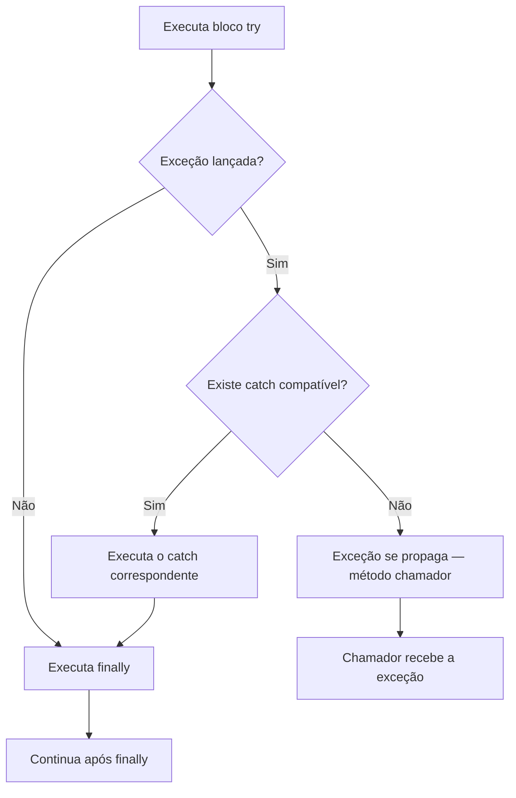

# Tratamento de Exceções

> [!info] Metadados
> **Disciplina:** Desenvolvimento de Sistemas
> **Bloco:** 4.1 — Desenvolvimento de Sistemas (FASE 4 — Núcleo de Desenvolvimento)
> **Tópico:** 1. Java — Fundamentos da Linguagem — Tratamento de exceções
> **Subtópicos:** Hierarquia (Throwable, Error, Exception, RuntimeException) · Checked vs unchecked · try/catch/finally · throws vs throw · Multi-catch e try-with-resources
> **Pré-requisitos:** [[Sintaxe-Essencial-de-Java|Sintaxe Essencial de Java]]; [[Colecoes-Java|Coleções Java]]
> **Cargo:** Analista de TI — Perfil 3 (Desenvolvimento de Software) · DATAPREV 2026
> **Data:** 2026-09-09

---

## 1. Por que estudar tratamento de exceções?

Imagine um sistema na DATAPREV que processa benefícios do INSS. Ele lê um arquivo de dados do segurado, consulta um banco de dados Oracle via JDBC e valida o valor do benefício antes de gravá-lo. Em cada uma dessas operações algo pode dar errado: o arquivo pode não existir (`FileNotFoundException`), a conexão com o banco pode cair (`SQLException`), o valor informado pode ser negativo (`IllegalArgumentException`). Se o programa não souber lidar com essas situações, ele simplesmente **para de funcionar** — e um sistema que para no meio do processamento de benefícios é um problema sério.

É exatamente por isso que o Java investe em um mecanismo robusto de **exceções**: objetos que representam situações anormais durante a execução, encaminhados a quem pode decidir o que fazer com elas. Dominar esse mecanismo é essencial para escrever código resiliente — e é uma das cobranças mais frequentes da FGV em provas de Java. Você já viu [[Sintaxe-Essencial-de-Java|sintaxe básica]] e [[Colecoes-Java|coleções]]; agora vamos estudar como o programa reage quando algo dá errado.

> [!question] Por que o Java não simplesmente ignora erros?
> Em linguagens como C, um erro de memória pode corromper dados silenciosamente. O Java escolheu outro caminho: **lançar exceções** que obrigam o programador a pensar no que fazer quando algo falha. Isso torna o código mais previsível — mas também exige que você entenda a hierarquia, os tipos e as regras de captura.

---

## 2. A hierarquia de exceções

No Java, todas as exceções e erros herdam de uma classe chamada `Throwable`. A partir dela, a hierarquia se divide em dois ramos principais que você **precisa memorizar**:

```
Throwable
├── Error              (problemas graves da JVM — NÃO tratamos)
│      ├── OutOfMemoryError
│      ├── StackOverflowError
│      └── VirtualMachineError
└── Exception          (situações anormais que o programador PODE tratar)
       ├── RuntimeException  (UNCHECKED — não é obrigatório tratar/declarar)
       │      ├── NullPointerException
       │      ├── ArithmeticException
       │      ├── IndexOutOfBoundsException
       │      ├── IllegalArgumentException
       │      └── ClassCastException
       └── (demais — CHECKED — obrigatório tratar OU declarar com throws)
             ├── IOException
             ├── SQLException
             ├── ClassNotFoundException
             └── FileNotFoundException
```

Essa árvore não é só visual: ela define **o que você pode e o que deve ignorar**. Vamos entender cada ramo.

### 2.1 Error — falhas da JVM, não se trata

A classe `Error` representa problemas que o programador **não tem controle** e que, em geral, indicam uma falha grave da máquina virtual. `OutOfMemoryError` (a JVM ficou sem memória), `StackOverflowError` (pilha de chamadas estourou por recursão infinita) — esses são exemplos clássicos. Se você receber um `Error`, o programa provavelmente não tem como se recuperar de forma confiável. Por isso, a recomendação é: **não tente capturar `Error` com try/catch**.

> [!warning] PEGADINHA — Error não é Exception
> A banca adora trocar `Error` por `Exception` em alternativas. Lembre: `Error` é filho direto de `Throwable`, **não** de `Exception`. São coisas distintas. `Error` = falha de infraestrutura/JVM. `Exception` = situação anormal que o programador pode tratar.

### 2.2 Checked vs. unchecked — a distinção mais cobrada

Dentro de `Exception`, temos duas categorias que definem se o compilador **obriga** você a fazer algo:

**Exceções verificadas (checked)** — são todas as subclasses de `Exception` que **não** são subclasses de `RuntimeException`. O compilador **exige** que você faça uma de duas coisas: (a) envolver o código com `try/catch`, ou (b) declarar a exceção com `throws` na assinatura do método. Exemplos: `IOException`, `SQLException`, `ClassNotFoundException`, `FileNotFoundException`.

**Exceções não verificadas (unchecked / RuntimeException)** — são as subclasses de `RuntimeException`. O compilador **não obriga** a tratá-las nem a declará-las. Elas costumam indicar bugs de programação — `NullPointerException` (acesso a referência nula), `ArithmeticException` (divisão por zero), `IndexOutOfBoundsException` (índice fora do intervalo), `IllegalArgumentException` (argumento inválido).

> [!tip] Como lembrar na prova
> Se a exceção é **filha de RuntimeException**, é **unchecked** — o compilador não reclama. Se é filha de `Exception` (e não de `RuntimeException`), é **checked** — o compilador exige `try/catch` ou `throws`. Essa regra é absoluta.

```java
// CHECKED — o compilador exige tratamento
import java.io.*;

FileReader arquivo;
try {
    arquivo = new FileReader("dados.txt");   // FileNotFoundException (checked)
} catch (FileNotFoundException e) {
    System.out.println("Arquivo não encontrado: " + e.getMessage());
}

// UNCHECKED — o compilador não exige nada (mas pode falhar em runtime)
int a = 10, b = 0;
int r = a / b;   // ArithmeticException em tempo de execução
```

> [!question] Por que o Java distingue checked de unchecked?
> Checked existem para obrigar o programador a **pensar antecipadamente** em falhas previsíveis (arquivo ausente, rede indisponível, banco fora). Unchecked representam erros de programação que devem ser **corrigidos no código**, não tratados em runtime. A lógica é: se o erro é previsível, o compilador garante que você não se esqueça de tratá-lo.

---

## 3. try, catch e finally — papéis e ordem

A mecânica central do tratamento de exceções combina três blocos. Cada um tem uma responsabilidade distinta e bem definida.

### 3.1 O bloco try

O `try` **envolve o código que pode lançar exceção**. Não há nada de especial na execução: o programa entra no `try` e executa as instruções normalmente. O que muda é que, **se** uma exceção for lançada dentro dele, o fluxo é interrompido imediatamente e o Java procura um `catch` compatível.

```java
try {
    Connection conexao = DriverManager.getConnection(url, user, pass);
    Statement stmt = conexao.createStatement();
    ResultSet rs = stmt.executeQuery("SELECT * FROM beneficios");
    // processa resultados...
} catch (SQLException e) {
    // só entra aqui SE uma SQLException for lançada
}
```

### 3.2 O bloco catch

O `catch` **captura e trata** a exceção. Cada `catch` lida com um **tipo específico** de exceção. Se a exceção lançada for do tipo declarado no `catch` (ou de um subtipo dele), o bloco é executado. Caso contrário, a exceção se propaga para quem chamou o método.

A regra de ouro: **o catch mais específico deve vir primeiro**. Por quê? Porque `FileNotFoundException` é subtipo de `IOException`. Se você colocar `catch (IOException e)` antes de `catch (FileNotFoundException e)`, o compilador **reclama** — o segundo catch seria inalcançável, já que toda `FileNotFoundException` já seria capturada pelo primeiro.

```java
// ORDEM CORRETA — específico antes do genérico
try {
    FileInputStream fis = new FileInputStream("arquivo.txt");
} catch (FileNotFoundException e) {
    System.out.println("Arquivo não encontrado");
} catch (IOException e) {
    System.out.println("Erro genérico de leitura");
}

// ORDEM ERRADA — compilador rejeita
try {
    FileInputStream fis = new FileInputStream("arquivo.txt");
} catch (IOException e) {           // captura TUDO que é IOException
    System.out.println("Erro de leitura");
} catch (FileNotFoundException e) { // INALCANÇÁVEL — nunca será executado
    System.out.println("Arquivo não encontrado");
}
```

> [!warning] PEGADINHA — catch genérico antes do específico
> Essa é uma das questões mais clássicas da FGV. O compilador Java **não permite** que um `catch` de tipo mais amplo apareça antes de um mais restrito, pois o segundo seria inalcançável. Se a questão mostrar esse padrão e perguntar "compila?", a resposta é **não**.

### 3.3 O bloco finally

O `finally` é o bloco que **sempre executa** — tendo exceção ou não, tendo `return` ou não. Ele existe para liberar recursos que precisam ser fechados independentemente do resultado: conexões com banco de dados, arquivos abertos, sockets.

```java
Connection conexao = null;
try {
    conexao = DriverManager.getConnection(url, user, pass);
    // processa...
} catch (SQLException e) {
    logErro(e);
} finally {
    // SEMPRE executa: fecha a conexão
    if (conexao != null) {
        try {
            conexao.close();
        } catch (SQLException e) {
            // log do erro ao fechar
        }
    }
}
```

> [!warning] PEGADINHA — finally SEMPRE executa (quase sempre)
> O `finally` executa mesmo quando há `return` no `try` ou no `catch`. As **únicas** situações em que ele não roda são:
> 1. `System.exit()` é chamado antes do finally.
> 2. A JVM sofre uma falha fatal (crash).
> 3. O thread entra em loop infinito dentro do `try` ou `catch`.
>
> Em qualquer outra situação — incluindo `return`, exceção lançada e não capturada — o `finally` roda. Essa é uma das afirmações mais cobradas em prova.

> [!warning] PEGADINHA — return dentro de finally sobrescreve
> Se você coloca `return` dentro do `finally`, ele **sobrescreve** qualquer retorno anterior do `try` ou `catch`. Isso pode causar comportamento inesperado:
>
> ```java
> public static int exemplo() {
>     try {
>         return 1;      // valor "guardado" para retorno
>     } finally {
>         return 2;      // SOBRESCREVE — o método retorna 2
>     }
> }
> ```
>
> O método retorna **2**, não 1. O `finally` executa **depois** do `try` ter "preparado" o retorno, e o `return` dentro dele substitui o valor anterior. A banca adora perguntar qual é o retorno de trechos como esse. Dica: **nunca coloque `return` dentro de `finally`** — é uma prática que gera confusão e bugs difíceis de rastrear.

### 3.4 Fluxo completo: com e sem exceção

O diagrama a seguir mostra como o Java decide o caminho do fluxo quando uma exceção é (ou não) lançada dentro do `try`:



O ponto central: **se não houver catch compatível**, a exceção **não é silenciada** — ela se propaga para o método que chamou o método atual, e assim por diante, até que alguém a trate ou até que o programa encerre com uma mensagem de erro. Esse mecanismo de propagação é o que conecta `try/catch` com `throws`.

---

## 4. Propagação de exceções: de quem é a responsabilidade?

Quando uma exceção checked é lançada dentro de um método e **não** há `try/catch` local, o Java exige que o método **declare** essa possibilidade na assinatura com `throws`. Isso transfere a responsabilidade de tratamento para quem chamou o método.

Pense assim: se a `conectarAoBanco()` pode falhar com `SQLException`, quem chama esse método precisa saber disso e decidir o que fazer. O `throws` é um aviso: "este método pode lançar essa exceção — cuide disso".

```java
// Método que DECLARA que pode lançar SQLException
public void salvarBeneficio(Beneficio b) throws SQLException {
    Connection conn = DriverManager.getConnection(url, user, pass);
    // ...
    // Se SQLException ocorrer, ela se PROPAGA para quem chamou
}

// Quem chamou PODE tratar:
public void processar() {
    try {
        salvarBeneficio(beneficio);
    } catch (SQLException e) {
        System.out.println("Erro ao salvar: " + e.getMessage());
    }
}
```

Se `processar()` também não tratar, o `throws` precisa subir para a assinatura de `processar()` também, e assim por diante, até que alguém faça o `try/catch` ou até que o método `main` receba a exceção (que, por fim, imprime a pilha de chamadas e encerra).

> [!question] Quando usar throws e quando usar try/catch?
> Se você **pode resolver** o problema no método atual (logar, fechar recurso, retornar valor padrão), use `try/catch`. Se **não faz sentido** resolver ali — talvez o método seja genérico e a decisão dependa do contexto — declare com `throws` e deixe o chamador decidir. Na prática, `main` quase sempre usa `throws Exception` para delegar tudo, enquanto os métodos intermediários tratam seletivamente.

---

## 5. throws vs. throw — a diferença que separa tipos de questão

Essa é uma das confusões mais comuns — e a banca sabe disso.

| | `throw` | `throws` |
|---|---|---|
| **O que faz** | **Lança de fato** um objeto de exceção | **Declara** que o método pode lançar exceção |
| **Onde aparece** | **Dentro** do corpo do método | Na **assinatura** do método (após parênteses) |
| **Acompanha** | Um objeto: `throw new ...` | Um ou mais tipos: `throws IOException, SQLException` |
| **Efeito** | Interrompe o fluxo e transfere controle ao catch | Avisa ao compilador e ao chamador que pode haver exceção |

```java
public double calcularBeneficio(double valor) throws IllegalArgumentException {
    //   ^^^^^^ throws — declara na ASSINATURA

    if (valor < 0) {
        throw new IllegalArgumentException("Valor não pode ser negativo");
        // ^^^^ throw — LANÇA de fato o objeto
    }
    return valor * 1.1;
}
```

> [!warning] PEGADINHA — não confunda throw com throws
> **`throw`** (sem "s") é um comando: cria e lança uma exceção. **`throws`** (com "s") é uma declaração na assinatura: informa que o método pode lançar. Se a questão trocar um pelo outro, a alternativa está errada — verifique sempre se a palavra está correta no contexto apresentado.

Uma distinção sutil mas importante: `throws` na assinatura é **obrigatório** apenas para exceções **checked**. Para `RuntimeException` e suas subclasses (unchecked), você pode usar `throws` se quiser, mas o compilador não exige. Já para `throw` (lançamento de fato), ele aceita qualquer tipo de `Throwable` — checked ou unchecked.

---

## 6. Multi-catch — Java 7 e além

A partir do Java 7, é possível capturar **mais de um tipo de exceção** em um único `catch`, separando os tipos com o operador `|` (pipe). Isso elimina a necessidade de criar múltiplos blocos `catch` com código duplicado:

```java
// ANTES do Java 7 — código duplicado
try {
    FileReader fr = new FileReader("arquivo.txt");
    BufferedReader br = new BufferedReader(fr);
    String linha = br.readLine();
    // processa linha
} catch (FileNotFoundException e) {
    System.out.println("Arquivo não encontrado");
    logErro(e);
} catch (IOException e) {
    System.out.println("Erro de leitura");
    logErro(e);
}

// A PARTIR do Java 7 — multi-catch (tipos SEM relação de herança)
try {
    FileReader fr = new FileReader("arquivo.txt");
    BufferedReader br = new BufferedReader(fr);
    int idade = Integer.parseInt(br.readLine());   // pode lançar IOException e NumberFormatException
    // processa idade
} catch (IOException | NumberFormatException e) {
    System.out.println("Erro ao acessar ou interpretar arquivo");
    logErro(e);
}
```

Note que, dentro do multi-catch, a variável `e` é **efetivamente final** — você não pode atribuir um novo valor a ela dentro do bloco. Isso porque o Java precisa garantir que não há ambiguidade sobre qual exceção está sendo tratada.

> [!note] Multi-catch e a regra de ordem
> No multi-catch, as alternativas separadas por `|` devem ser **incompatíveis entre si**: é **erro de compilação** declarar tipos em que um seja subclasse do outro — `FileNotFoundException | IOException` não compila, porque `FileNotFoundException` já é uma `IOException` (o compilador acusa: "alternatives in a multi-catch statement cannot be related by subclassing"). A regra do "específico primeiro" vale para **`catch` separados**; no multi-catch, use apenas tipos sem relação de herança — como `IOException | NumberFormatException` (exemplo acima) ou `IOException | SQLException`.

---

## 7. Try-with-resources — fechamento automático (Java 7+)

Um dos problemas mais comuns no tratamento de exceções é **esquecer de fechar recursos** — conexões com banco de dados, streams de arquivo, sockets. O Java 7 introduziu o **try-with-resources**, que fecha automaticamente qualquer objeto que implemente a interface `AutoCloseable` (ou sua subinterface `Closeable`).

```java
// ANTES do Java 7 — verborrágico e propenso a erro
BufferedReader br = null;
try {
    br = new BufferedReader(new FileReader("arquivo.txt"));
    String linha = br.readLine();
    System.out.println(linha);
} catch (IOException e) {
    e.printStackTrace();
} finally {
    if (br != null) {
        try {
            br.close();   // pode lançar IOException!
        } catch (IOException e) {
            e.printStackTrace();
        }
    }
}

// COM try-with-resources — limpo e seguro
try (BufferedReader br = new BufferedReader(new FileReader("arquivo.txt"))) {
    String linha = br.readLine();
    System.out.println(linha);
} catch (IOException e) {
    e.printStackTrace();
}
// br é fechado automaticamente — mesmo se exceção for lançada
```

O recurso declarado entre parênteses após o `try` é chamado de **resource specification**. Ao final do bloco (tanto em caso normal quanto em caso de exceção), o Java invoca automaticamente o método `close()` do recurso. Se `close()` lançar uma exceção, ela é **suprimida** (mas acessível via `getSuppressed()`).

> [!tip] Try-with-resources e JDBC — muito cobrado
> Em contexto de banco de dados (muito relevante para a DATAPREV), o try-with-resources fecha `Connection`, `Statement` e `ResultSet` automaticamente. Múltiplos recursos podem ser declarados separados por ponto-e-vírgula:
>
> ```java
> try (Connection conn = DriverManager.getConnection(url, user, pass);
>      Statement stmt = conn.createStatement();
>      ResultSet rs = stmt.executeQuery("SELECT * FROM segurados")) {
>
>     while (rs.next()) {
>         System.out.println(rs.getString("nome"));
>     }
> } catch (SQLException e) {
>     e.printStackTrace();
> }
> // conn, stmt e rs são fechados automaticamente, na ordem inversa
> ```
>
> Essa prática elimina o risco de vazamento de recursos e reduz drasticamente a quantidade de código. A FGV adora comparar o código com try-with-resources versus o código sem ele.

---

## 8. Como a FGV cobra tratamento de exceções

A banca explora o tema por vários ângulos. Veja as palavras-chave e os padrões de cobrança:

| Palavra-chave no enunciado | O que está sendo testado |
|---|---|
| `Throwable`, `Error`, `Exception` | Hierarquia — saber que Error ≠ Exception |
| `RuntimeException`, `checked`, `unchecked` | Classificação — compilador exige tratamento ou não |
| `try`, `catch`, `finally` | Papéis e comportamento de cada bloco |
| `throws`, `throw` | Declaração na assinatura vs. lançamento efetivo |
| `SQLException`, `IOException` | Exceções checked comuns (banco de dados, arquivos) |
| `NullPointerException`, `ArithmeticException` | Exceções unchecked (bugs de programação) |
| `FileNotFoundException` | Checked que é subtipo de IOException — catch na ordem |
| `return` dentro de `finally` | Sobrescreve retorno do try/catch |
| `try-with-resources` | Fechamento automático de AutoCloseable |

### Padrões de pegadinha

> [!warning] Padrão 1 — "Toda exceção precisa ser tratada com try/catch"
> **Falso.** Exceções unchecked (RuntimeException e subclasses) **não** exigem try/catch nem throws. O compilador só obriga para checked. Se a questão afirmar que é "obrigatório tratar" uma NullPointerException, está errado — é boa prática tratar, mas o compilador não exige.

> [!warning] Padrão 2 — finally não executa quando há return no try
> **Falso.** O finally executa **mesmo** com `return` no try. A única exceção real é `System.exit()`. Se a questão disser "o finally é ignorado porque o try retorna", marque como falso.

> [!warning] Padrão 3 — Error pode ser capturado com try/catch
> Embora tecnicamente o compilador permita capturar subclasses de Error, a recomendação é **não fazer** — erros representam falhas de infraestrutura que o programa não deve tentar recuperar. Em prova, se a alternativa sugerir "tratar OutOfMemoryError com try/catch como boa prática", está incorreto.

> [!warning] Padrão 4 — throws é opcional para checked exceptions
> **Falso.** Se um método lança uma exceção checked e não a trata internamente, ele **precisa** declarar `throws` na assinatura. Sem isso, o compilador rejeita o código.

> [!warning] Padrão 5 — catch genérico (Exception) captura tudo, inclusive Error
> **Falso.** `catch (Exception e)` captura todas as subclasses de `Exception`, mas **não** captura `Error` nem `Throwable`. Para capturar tudo, seria necessário `catch (Throwable t)` — mas isso incluiria `Error`, o que não se deve fazer.

---

## 9. Questões-modelo

### Questão 1 — Comportamento do finally com return

Qual é a saída impressa e o valor retornado pelo método?

```java
public static int metodo() {
    int x = 10;
    try {
        x = 20;
        return x;
    } finally {
        x = 30;
        System.out.print(x + " ");
    }
}
```

**(A)** 20 — o return no try finaliza antes do finally.
**(B)** 30 — o finally altera o valor de x e imprime 30.
**(C)** O finally executa e imprime 30; o método retorna 20.
**(D)** 30 30 — o finally muda x e o return retorna o novo valor.
**(E)** Erro de compilação.

> [!tip] Gabarito e comentário
> **Resposta: (C)**
> O `return x` no try **prepara** o valor 20 para retorno. Depois, o `finally` executa: `x` vira 30 e `System.out.print(30 + " ")` imprime **30**. Mas o valor que o método retorna é aquele que foi "preparado" antes do finally — ou seja, **20**. O finally não altera o valor de retorno, a menos que ele próprio contenha um `return` (que aqui não tem). Por isso a saída é **30** (impresso pelo finally) e o valor retornado é **20**. Se a questão perguntar apenas a saída impressa, é 30. Se perguntar o valor retornado, é 20. Essa distinção é crucial: **o finally executa, mas não sobrescreve o return sem que ele próprio faça um return novo**.

### Questão 2 — Qual exceção é checked?

Qual das alternativas abaixo é uma exceção **checked**?

**(A)** `NullPointerException`
**(B)** `ArithmeticException`
**(C)** `ClassNotFoundException`
**(D)** `IndexOutOfBoundsException`
**(E)** `ClassCastException`

> [!tip] Gabarito e comentário
> **Resposta: (C)**
> `ClassNotFoundException` é filha de `Exception` (e não de `RuntimeException`), portanto é **checked**. As demais — `NullPointerException`, `ArithmeticException`, `IndexOutOfBoundsException`, `ClassCastException` — são subclasses de `RuntimeException`, logo são **unchecked**. O truque é lembrar a hierarquia: se herda de `RuntimeException`, o compilador não obriga tratamento.

### Questão 3 — O que `throws` faz?

Analise o trecho:

```java
public void salvar(Dados dados) throws IOException {
    // corpo do método
}
```

Qual afirmação é **correta**?

**(A)** O método `salvar` lança uma IOException dentro de seu corpo.
**(B)** O método `salvar` declara que pode lançar IOException, delegando o tratamento ao chamador.
**(C)** O método `salvar` captura todas as IOExceptions que ocorrerem.
**(D)** O método `salvar` impede que IOExceptions sejam propagadas.
**(E)** O método `salvar` converte exceções checked em unchecked.

> [!tip] Gabarito e comentário
> **Resposta: (B)**
> `throws` na assinatura **declara** que o método pode lançar a exceção — é um aviso ao chamador. Ele **não** lança (isso seria `throw`), não captura e não converte. O chamador de `salvar()` é quem deve decidir se trata com `try/catch` ou se propaga adiante com seu próprio `throws`. Essa é a mecânica de **propagação de exceções**.

---

## 10. Revisão rápida

| Conceito | Resumo | Erro mais comum em prova |
|---|---|---|
| **Throwable** | Pai de todas as exceções e erros | Confundir com Exception |
| **Error** | Falha da JVM — não se trata | Achar que Error é tratável |
| **Exception (checked)** | Obrigatório try/catch ou throws | Achar que compilador ignora |
| **RuntimeException (unchecked)** | Não obrigatório tratar | Achar que toda exceção precisa de try/catch |
| **try** | Envolve código que pode lançar | — |
| **catch** | Captura e trata — específico primeiro | Colocar genérico antes do específico |
| **finally** | Sempre executa | Achar que return no try cancela finally |
| **return no finally** | Sobrescreve retorno anterior | Não perceber que o valor muda |
| **throw** | Lança de fato um objeto de exceção | Confundir com throws |
| **throws** | Declara na assinatura que pode lançar | Confundir com throw |
| **Multi-catch** | Captura múltiplos tipos em um catch | Colocar tipos que são subtipos entre si |
| **try-with-resources** | Fecha automaticamente AutoCloseable | Não reconhecer que close() é automático |

> [!note] As duas ideias que resumem a nota
> **1. A hierarquia define o comportamento:** se a exceção é filho de `RuntimeException` (unchecked), o compilador não exige tratamento; se é filha de `Exception` e não de `RuntimeException` (checked), o compilador exige `try/catch` ou `throws`. `Error` nem deveria ser tratado. Essa árvore é a base de tudo.
> **2. O fluxo é previsível:** `try` envolve, `catch` captura, `finally` limpa — e `throws` delega. Entender como esses blocos interagem (inclusive com `return` e com a propagação para o chamador) é a chave para resolver qualquer questão da FGV sobre o tema.

---

## 11. Próximos passos

Com o tratamento de exceções dominado, você tem a base para avançar para [[Generics|Generics]], que introduz tipos parametrizados e que, de certa forma, complementa a flexibilidade do tratamento de exceções ao permitir código mais reutilizável e type-safe. Também será útil no contexto de [[Paradigma-Orientado-a-Objetos|POO]], onde exceções se tornam classes personalizadas e a hierarquia `Throwable` será vista sob a óptica de herança e polimorfismo.
