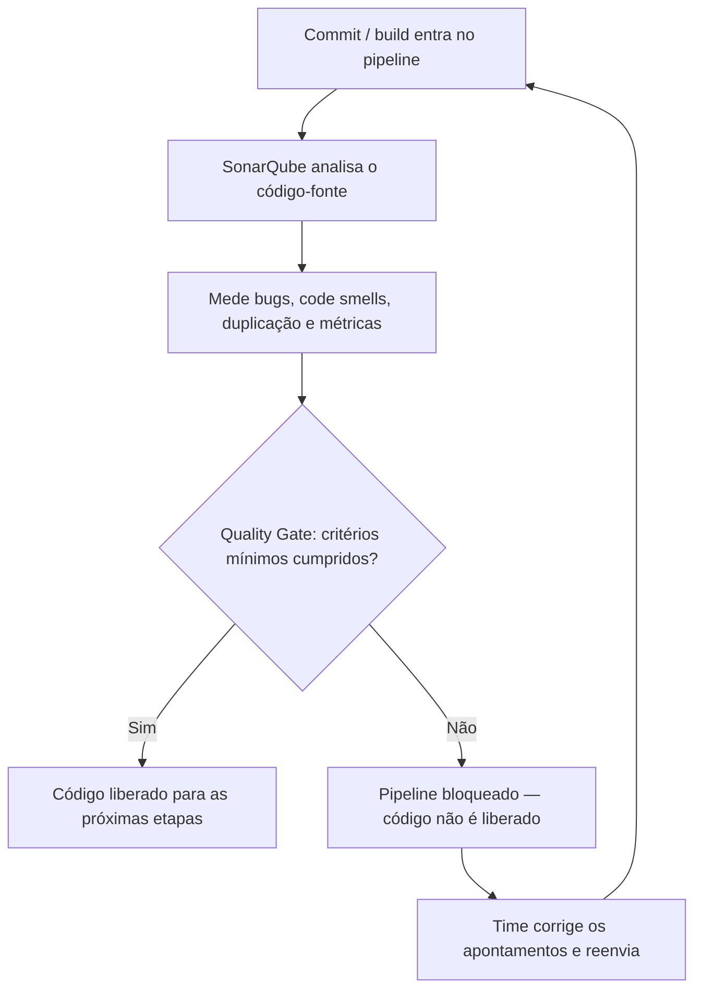

# Análise Estática de Código e SonarQube

> [!info] Metadados
> **Disciplina:** Desenvolvimento de Sistemas
> **Bloco:** 4.1 — Desenvolvimento de Sistemas (FASE 4 — Núcleo de Desenvolvimento)
> **Tópico:** 2. Paradigma Orientado a Objetos — Análise Estática de Código e SonarQube
> **Subtópicos:** Análise estática de código e SonarQube (code smells, bugs, duplicação, quality gate)
> **Pré-requisitos:** [[Clean-Code]] (nomes, funções, comentários — os princípios que a análise estática automatiza) e [[Quatro-Pilares-do-POO]] (encapsulamento, boas práticas)
> **Cargo:** Analista de TI — Perfil 3 (Desenvolvimento de Software) · DATAPREV 2026
> **Data:** 2026-09-17

---

## 1. Por que estudar análise estática?

Esta subnota aprofunda a subseção 5.4 do tópico [[Paradigma-Orientado-a-Objetos]]: transforma o resumo da nota-mãe sobre **análise estática de código e SonarQube** na matéria completa — o que é, o que detecta, como o quality gate funciona e como a FGV costuma cobrar.

Lembre-se de onde você veio. Em [[Clean-Code]], você aprendeu que nomes devem revelar a intenção, funções devem fazer uma coisa só e comentários devem explicar o *porquê*. Em [[Quatro-Pilares-do-POO]], você viu que encapsulamento é proteger o estado e centralizar regras — a manutenibilidade em forma de código. Há, porém, um problema prático em todos esses princípios: eles são **manuais**. Dependem de cada programador lembrar da regra, saber aplicá-la e ter disciplina para aplicá-la todos os dias.

Agora pense no contexto real da DATAPREV. Os sistemas da seguridade social — o CNIS, os sistemas de benefícios, a consignação, a folha de pagamento — são **críticos** e **enormes**: times grandes, dezenas de milhares (frequentemente milhões) de linhas de código, muitos colaboradores trabalhando no mesmo repositório. Nesse cenário, um bug em um cálculo de benefício não é um inconveniente técnico: é o sustento de um cidadão. A qualidade do software não pode depender apenas da disciplina individual de quem escreveu cada linha — porque, em um projeto grande, sempre haverá a linha escrita às pressas, o copiar-e-colar apressado e a função que "funciona, mas ninguém entende".

A revisão manual de código ajuda, mas não escala: um revisor humano não consegue ler com atenção cada trecho de um projeto com milhões de linhas, em todos os commits, todos os dias. É exatamente aí que entram as **ferramentas de análise estática**: programas que examinam o código-fonte **automaticamente**, procurando justamente os desvios que o Clean Code condena.

> [!question] Pergunta orientadora
> Se a qualidade depende da memória, da técnica e da boa vontade de cada programador, o que acontece quando o projeto tem dezenas de milhares de linhas e dezenas de colaboradores modificando o mesmo repositório? Como garantir que as regras do Clean Code sejam cumpridas em cada commit, sem depender exclusivamente da revisão humana? A resposta é a análise estática automatizada — e é ela que organiza esta nota.

---

## 2. Análise estática vs. análise dinâmica

A diferença fundamental entre os dois tipos de análise é **uma só**: o momento em que o código é examinado.

A **análise estática** examina o código **sem executá-lo**: ela lê o código-fonte e procura problemas estruturais, padrões ruins e violações de convenções — antes mesmo de o programa compilar ou rodar. A **análise dinâmica** examina o software **durante a execução**: ela roda o programa e observa o comportamento em tempo real — consumo de memória, erros em tempo de execução, comportamento inesperado em cenários reais.

A nota-fonte usa uma analogia que cai bem em qualquer prova: **assim como um corretor ortográfico verifica um texto sem precisar publicá-lo, um analisador estático verifica o código sem precisar compilá-lo ou rodá-lo**. Ele lê a estrutura, os padrões e as convenções e aponta desvios. O editor de texto não precisa imprimir o documento para acusar o erro de digitação; o SonarQube não precisa rodar o sistema para acusar a função longa demais.

Quando o código viola uma regra — uma classe com mais de mil linhas, uma função que faz cinco coisas, um nome de variável incompreensível como `x` ou `d` — a ferramenta gera um alerta **classificado por severidade**: alguns são apenas avisos estéticos, outros indicam bugs prováveis.

> [!warning] PEGADINHA — análise estática vs. análise dinâmica
> Essa é a armadilha conceitual mais recorrente do tópico. O SonarQube é uma ferramenta de **análise estática**: ele **não precisa rodar o programa** para encontrar problemas. A frase "SonarQube roda o programa para encontrar bugs" é **FALSA** — isso seria análise dinâmica. A banca adora inverter os conceitos: "SonarQube é uma ferramenta de análise dinâmica" também é **falso**. Na dúvida, pergunte-se: *a ferramenta examina a fonte sem executar (estática) ou observa o programa rodando (dinâmica)?* O SonarQube faz a primeira.

---

## 3. O que o SonarQube detecta

O edital menciona especificamente o **SonarQube**. Ele é uma plataforma *open source* de **análise estática contínua** da qualidade do código. "Contínua" significa que a análise não é um evento único: o SonarQube se integra ao fluxo de desenvolvimento (repositório Git, pipeline de CI/CD) e, **a cada commit ou build**, analisa o código e gera um relatório com quatro grandes grupos de achados — exatamente a terminologia que a FGV espera que você conheça:

- **Bugs** potenciais detectados no fluxo lógico;
- **Code smells** — trechos que funcionam mas violam boas práticas;
- **Duplicação de código** — trechos idênticos ou muito similares repetidos em vários arquivos;
- **Métricas de qualidade** — cobertura de testes, complexidade ciclomática, linhas de código.

### 3.1 Bugs potenciais

Bugs potenciais são **erros de lógica que podem se concretizar** em determinadas circunstâncias: uma condição que nunca é verdadeira, uma variável usada antes de ser inicializada, uma comparação de *strings* feita com `==` em vez de `equals`, um possível acesso nulo. O nome é "potenciais" porque a análise estática não executa o programa: ela identifica **padrões que historicamente produzem defeitos**. É um alerta precoce — o problema é apontado antes de chegar ao usuário final.

### 3.2 Code smells

O **code smell** é o conceito que mais conecta este subtópico ao [[Clean-Code]]. Um code smell é um **sinal de que algo está mal no código** — mas atenção ao detalhe: o trecho **funciona**. Um nome de variável genérico (`x`, `d`, `aux`), uma função de 200 linhas, uma classe com complexidade excessiva: tudo isso roda, entrega o resultado esperado, mas **viola boas práticas** e torna o código difícil de entender, testar e manter. O code smell não é o bug; é o *cheiro* de que o bug (ou a manutenção cara) está a caminho.

### 3.3 Duplicação de código

A **duplicação** detecta trechos idênticos ou muito similares repetidos em vários arquivos (ou dentro do mesmo arquivo) — o resultado clássico do copiar-e-colar. O problema não é estético: se a regra duplicada precisa mudar, cada cópia é um ponto de manutenção; se o programador esquece uma delas, o sistema fica inconsistente. O SonarQube calcula o **percentual de código duplicado** do projeto — e esse percentual, como veremos, pode virar um critério de aprovação.

### 3.4 Métricas de qualidade

Além dos problemas, o SonarQube mede a saúde do código:

- **Cobertura de testes:** o percentual do código que é exercitado por testes automatizados. Quanto maior, menor a chance de um bug escapar;
- **Complexidade ciclomática:** uma medida da quantidade de caminhos de decisão de uma função (quanto mais `if`, `for`, `case`, mais caminhos, mais difícil testar e entender). Quanto maior a complexidade, maior o risco;
- **Linhas de código:** a dimensão bruta — uma classe de 5 mil linhas é um alerta independente do que ela faz.

### 3.5 O Clean Code materializado em regras automatizadas

Esta é a ideia que amarra o subtópico ao que você já estudou: **o SonarQube materializa o Clean Code em regras automatizadas**. Quando a nota de Clean Code diz que "funções devem fazer uma coisa só", o SonarQube traduz isso em uma **regra** que aponta funções com múltiplas responsabilidades. Quando diz que "nomes devem ser significativos", o SonarQube alerta sobre variáveis com nomes genéricos como `x`, `d` ou `aux`. Ele detecta automaticamente nomes que não revelam intenção, funções com complexidade alta demais, comentários desnecessários que apenas repetem o código e código duplicado:

```java
// Code smell: o nome 'd' não revela a intenção
int d = calcularDiasDesdeUltimaContribuicao();

// Code smell: comentário desnecessário — repete exatamente o que o código já diz
int x = 0;      // seta x para zero

// Code smell: função longa que faz mais de uma coisa
public void processarBeneficio(Beneficiario b) {
    if (b.getCpf() == null) throw new IllegalArgumentException();
    double valor = b.getRendaMensal() * 0.30;
    String msg = "Seu benefício é " + formatar(valor);
    enviarEmail(b.getEmail(), msg);
}
```

Em resumo: Clean Code é o *conjunto de princípios*; o SonarQube é o *mecanismo* que verifica, de forma automática e contínua, se esses princípios estão sendo seguidos na prática. Um time que defende Clean Code mas não usa análise estática depende apenas da disciplina individual — e a história mostra que isso não escala. O SonarQube é o "fiscal" que garante o cumprimento das regras mesmo em projetos grandes, com muitos colaboradores.

---

## 4. Quality Gate

De que adianta o SonarQube detectar milhares de problemas se ninguém age sobre eles? É aqui que entra o **Quality Gate** (portão de qualidade): uma funcionalidade central do SonarQube.

O Quality Gate é **uma regra configurável que define o limite mínimo aceitável de qualidade** para que o código seja aceito. Ele funciona como um portão mesmo: o código só "passa" se atender aos critérios. Exemplos típicos de critérios:

- **nenhum bug novo** (novos bugs detectados zeram a aprovação);
- no máximo **3% de duplicação**;
- cobertura de testes mínima de **80%**;
- zero *code smells* novos ou zero vulnerabilidades novas, conforme a configuração do time.

Se o código não passa no Quality Gate, o **pipeline de entrega pode ser bloqueado** — ou seja, o código **não é liberado** enquanto não atender aos critérios de qualidade. Repare no que isso significa na prática: a decisão de "liberar ou não" deixa de ser uma opinião e vira um **critério objetivo**, medido a cada análise.

O percurso mental (e o percurso real no pipeline) é uma sequência de decisões:



Leia o fluxograma de cima para baixo na hora da prova: tudo começa na **análise estática do código-fonte**; o resultado alimenta o **Quality Gate**; e o portão, não a opinião de uma pessoa, decide se o código **segue ou volta**. A pergunta que a banca gosta de fazer é sobre quem decide — e a resposta é sempre a regra configurada.

> [!question] O que acontece com um código que passa no gate mas tem 4% de duplicação?
> Se o critério configurado é "no máximo 3% de duplicação", o portão **reprova** o código — mesmo que ele funcione e mesmo que o programador considere a duplicação inofensiva. O Quality Gate não negocia: ele aplica o limite configurado. É essa rigidez objetiva que transforma qualidade em **governança**, e não em boa intenção.

> [!tip] Quality Gate
> Uma funcionalidade central do SonarQube é o **Quality Gate** (portão de qualidade): uma regra configurável que define o *limite mínimo aceitável* de qualidade para que o código seja aceito. Por exemplo: "nenhum bug novo", "no máximo 3% de duplicação", "cobertura mínima de 80%". Se o código não passa no Quality Gate, o *pipeline* de entrega pode ser bloqueado — ou seja, o código **não é liberado** enquanto não atender aos critérios de qualidade. É uma forma de **governança de qualidade** no desenvolvimento. No fluxo de entrega contínua (CI/CD — integração e entrega contínuas, tema aprofundado em [[DevOps-e-Controle-de-Versao]]), o Quality Gate é o ponto em que a análise estática vira **decisão**: o portão avalia o resultado de cada commit e decide se aquele código está apto a seguir para as etapas seguintes.

---

## 5. Como a FGV cobra

As **palavras-chave do edital** que devem disparar imediatamente o conteúdo desta nota: *análise estática*, *code smell*, *qualidade de código*, *quality gate*, *SonarQube*, *bugs*, *duplicação*, *cobertura de testes*, *complexidade ciclomática*.

O padrão de cobrança da FGV é de **asserções verdadeiras ou falsas** e de **definições**: a banca apresenta uma frase e você precisa dizer se ela descreve corretamente o conceito — ou qual alternativa define corretamente um termo. A estratégia é a mesma de sempre: identificar o conceito pela *assinatura* da definição. Veja as pegadinhas mais frequentes no padrão "armadilha → raciocínio errado → proteção":

> [!warning] Pegadinha 1 — "o SonarQube executa o programa"
> **A armadilha:** a alternativa afirma que "o SonarQube é uma ferramenta de análise dinâmica que executa o programa para encontrar bugs".
> **O raciocínio errado:** "como ele encontra bugs, ele deve rodar o programa de alguma forma."
> **Como se proteger:** o SonarQube encontra bugs **sem executar nada** — lê o código-fonte e identifica padrões de erro. Executar o programa para observar o comportamento é **análise dinâmica**, e ela pertence a outras ferramentas. Se a frase diz "roda o programa", "em tempo de execução" ou "executa o código", não é o SonarQube.

> [!warning] Pegadinha 2 — "code smell é um bug"
> **A armadilha:** a alternativa define code smell como "um defeito que impede o programa de funcionar corretamente".
> **O raciocínio errado:** "tudo que a ferramenta aponta é problema grave, então code smell é bug."
> **Como se proteger:** o **code smell funciona** — ele é um *sinal* de que algo está mal no código (nomes ruins, funções longas, complexidade excessiva), mas o trecho entrega o resultado esperado. O bug é um erro de lógica que pode quebrar o comportamento; o code smell é a violação de boas práticas que torna o código difícil de manter e propenso a bugs futuros. Alternativa que mistura os dois está errada.

> [!warning] Pegadinha 3 — "quality gate é o relatório"
> **A armadilha:** a alternativa define Quality Gate como "o relatório gerado pelo SonarQube ao final da análise".
> **O raciocínio errado:** "como o SonarQube gera um relatório, o relatório é o portão."
> **Como se proteger:** o **relatório** lista os achados (bugs, code smells, duplicação, métricas); o **Quality Gate** é a *regra configurável que decide se o código passa ou não* com base nesses achados. Um é diagnóstico; o outro é critério de aprovação. O relatório informa; o portão bloqueia ou libera.

---

## 6. Questões-modelo na pegada FGV

> [!example] Questão-modelo 1 — FGV (autorais)
> A respeito de análise estática e análise dinâmica de código, a afirmação **correta** é:
> (A) O SonarQube é uma ferramenta de análise dinâmica, pois precisa executar o programa para identificar bugs potenciais.
> (B) A análise estática examina o código-fonte sem executá-lo, procurando code smells, bugs potenciais, duplicação de código e violações de boas práticas.
> (C) A análise estática só pode ser aplicada depois que o programa entra em produção, pois exige a observação do comportamento real.
> (D) Code smells são defeitos que impedem o programa de funcionar e, por isso, devem ser tratados com a mesma urgência de um bug crítico.
> (E) A duplicação de código é ignorada pela análise estática, pois trechos repetidos não afetam a manutenibilidade do sistema.
>
> **Gabarito: B.**
> **Comentário:** a alternativa B condensa a definição exata da análise estática — examinar a fonte **sem executar** — e os tipos de achado que o SonarQube gera. A alternativa A inverte os conceitos: o SonarQube é **estático**, não precisa rodar o programa. A C confunde estática com dinâmica, que é a que observa o comportamento em tempo real. A D transforma code smell em bug: o code smell **funciona**, só viola boas práticas. A E nega o óbvio: a duplicação é um dos principais alvos da análise estática — e até vira critério de quality gate.

> [!example] Questão-modelo 2 — FGV (autorais)
> No SonarQube, o **Quality Gate** (portão de qualidade) é:
> (A) O relatório detalhado que lista os code smells e bugs encontrados na análise de um projeto.
> (B) A ferramenta que executa os testes automatizados e mede a cobertura de código.
> (C) Uma regra configurável que define limites mínimos de qualidade — como ausência de bugs novos, percentual máximo de duplicação e cobertura mínima de testes — e pode bloquear a liberação do código quando os critérios não são cumpridos.
> (D) Um padrão de projeto que organiza as classes de um sistema em camadas de responsabilidade.
> (E) O processo de revisão manual realizado por um desenvolvedor sênior antes de cada commit.
>
> **Gabarito: C.**
> **Comentário:** o Quality Gate é a **regra** (o "portão") que estabelece o limite mínimo aceitável — por exemplo, nenhum bug novo, no máximo 3% de duplicação e cobertura mínima de 80% — e, se o código não passa, o pipeline de entrega **pode ser bloqueado**: o código não é liberado. A alternativa A descreve o **relatório**, que informa mas não decide. A B mistura com a função de executar testes — o SonarQube *mede* cobertura usando os resultados dos testes, mas não é ele que os executa. A D troca o assunto para padrões de projeto (outro tópico da ementa). A E descreve a revisão manual — exatamente o que a automação vem complementar, não o que o portão é.

---

## 7. Revisão rápida

| Conceito | Definição essencial | Pegadinha que mais derruba |
|---|---|---|
| **Análise estática** | examina o código-fonte **sem executá-lo** | afirmar que ela roda o programa |
| **Análise dinâmica** | observa o software **durante a execução** | confundir com o SonarQube |
| **SonarQube** | plataforma *open source* de análise estática contínua | "executa o programa para achar bugs" — falso |
| **Bug potencial** | erro de lógica detectado pelo padrão do código | tratar como bug já confirmado em execução |
| **Code smell** | trecho que **funciona** mas viola boas práticas | transformá-lo em bug que impede o funcionamento |
| **Duplicação de código** | trechos idênticos ou similares em vários arquivos | ignorar seu impacto na manutenção |
| **Cobertura de testes** | percentual do código exercitado por testes | confundir com execução do SonarQube |
| **Complexidade ciclomática** | medida de caminhos de decisão de uma função | achar que mede linhas de código |
| **Quality Gate** | regra configurável com limites mínimos de qualidade | confundir com o relatório de análise |

> [!tip] As três ideias que resumem a nota
> **1.** **A análise estática é um exame sem execução:** ela lê a fonte, como o corretor ortográfico lê o texto — e o SonarQube é a ferramenta desse tipo citada pelo edital.
> **2.** **Code smell não é bug:** o trecho funciona, mas viola boas práticas; a duplicação, os nomes ruins e as funções longas são alvos automáticos da ferramenta.
> **3.** **O Quality Gate decide:** é o portão configurável ("nenhum bug novo, duplicação máxima de 3%, cobertura mínima de 80%") que pode bloquear a liberação do código — a análise estática virando governança.

> [!warning] O erro mais comum em prova
> Inverter **estática e dinâmica** e reduzir o **Quality Gate** ao relatório. Na dúvida, pergunte-se: *a ferramenta examina a fonte sem rodar nada (estática) ou observa o programa em execução (dinâmica)?* E: *o portão informa ou decide?* Decidir é a função do Quality Gate.

---

## 8. Próximos passos

Você fechou o ciclo do [[Clean-Code]] com a sua aplicação prática: se os princípios são as *regras*, a análise estática é o *fiscal automático* que verifica o cumprimento delas em projetos grandes, sem depender da disciplina individual. Guarde este par na cabeça: o SonarQube é o Clean Code transformado em regras que podem **bloquear a entrega** — e é por isso que ele aparece no edital.

No fluxo de entrega de software, essa análise estática acontece dentro do processo de **integração e entrega contínuas (CI/CD)**, tema do tópico de [[DevOps-e-Controle-de-Versao]]: a cada integração de código, o SonarQube analisa, o Quality Gate avalia e o pipeline decide se o código segue ou volta. Aqui, basta o gancho — o aprofundamento fica para o tópico dedicado.

Este subtópico encerra a parte de **qualidade de código** do tópico [[Paradigma-Orientado-a-Objetos]]. O vocabulário construído — code smells, qualidade de código, quality gate, cobertura de testes — continua sendo usado nos tópicos seguintes da ementa. Se precisar reforçar alguma passagem desta nota, volte ao índice do tópico: [[Paradigma-Orientado-a-Objetos]].