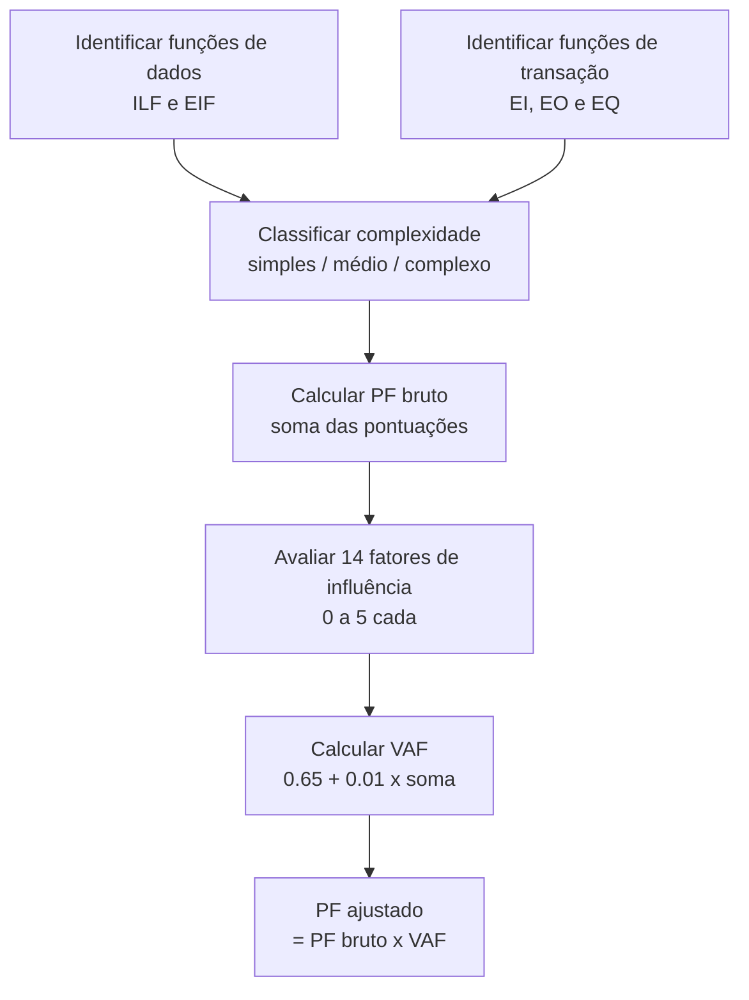

# Estimativas

> [!info] Metadados
> **Disciplina:** Metodologias e Engenharia de Software
> **Bloco:** 4.2 — Metodologias e Engenharia de Software (FASE 4 — Núcleo de Desenvolvimento)
> **Tópico:** 4. Estimativas
> **Subtópicos:** Pontos de Função (APF): contagem de transações, funções de dados, conversão para PF · Story Points: estimativa relativa, Planning Poker, fibonacci · Relação entre APF e Story Points (conceito)
> **Pré-requisitos:** [[Desenvolvimento-de-Sistemas]] (tipos de sistema, CRUD, APIs) e [[Banco-de-Dados|Banco de Dados]] (modelagem, funções de dados)
> **Cargo:** Analista de TI — Perfil 3 (Desenvolvimento de Software) · DATAPREV 2026
> **Data:** 2026-08-31

---

## 1. Por que estudar estimativas?

Um projeto de software sem estimativa é como uma viagem sem mapa: você pode até chegar ao destino, mas não saberá quanto tempo, dinheiro e esforço vai gastar. As **estimativas** são o processo de **avaliar o tamanho e o esforço** de um projeto de software antes (ou durante) o desenvolvimento.

Para a DATAPREV, que licita e contrata desenvolvimento de sistemas com base em **estimativas formais**, dominar estimativas é essencial. E, para o concurso, **Pontos de Função (APF)** é **muito mais cobrado** que Story Points em concursos públicos — a banca adora questões que exigem conhecer os tipos de funções, o cálculo de PF e o fator de ajuste.

> [!question] Pergunta orientadora
> Imagine que o INSS quer desenvolver um novo módulo de cálculo de aposentadoria. Quanto isso vai custar? Depende do *tamanho* do sistema — não em linhas de código (que variam conforme a linguagem), mas em *funcionalidades* que o usuário enxerga. O **APF (Análise de Pontos de Função)** mede exatamente isso: o tamanho funcional do software do ponto de vista do usuário, independentemente da tecnologia. É o que vamos estudar primeiro.

---

## 2. APF (Análise de Pontos de Função) — o padrão de concursos

O **APF** (ou **FPA — Function Point Analysis**) é um método para medir o **tamanho funcional** de um sistema de software a partir da perspectiva do **usuário** — ou seja, mede *o que o sistema faz* (funcionalidades visíveis), não *como é implementado* (código, linguagem, tecnologia).

> [!important] APF é independente de tecnologia
> Essa é a frase mais importante deste tópico. O **APF mede funcionalidade, não código**. Dois sistemas — um em Java e outro em Python — que implementam as **mesmas funcionalidades** devem ter o **mesmo número de Pontos de Função**. Essa independência é o que torna o APF útil para comparar projetos, estimar esforço e definir contratos.

### 2.1 As cinco funções de dados

O APF identifica **cinco tipos de funções** divididas em dois grupos:

**Grupo 1 — Funções de Dados — Data Function Types (ILF, EIF):**

| Função | Sigla | O que é | Exemplo |
|---|---|---|---|
| **ILF** (Internal Logical File) | ILF | **Arquivo lógico interno** — dados mantidos e atualizados pelo sistema | Tabela de beneficiários no banco de dados do sistema |
| **EIF** (External Interface File) | EIF | **Arquivo lógico externo** — dados vindos de outro sistema, usados (mas não mantidos) pelo sistema atual | Consulta de dados do INSS via API externa |

**Grupo 2 — Funções de Transação — Transactional Function Types (EI, EO, EQ):**

| Função | Sigla | O que é | Exemplo |
|---|---|---|---|
| **EI** (External Input) | EI | **Entrada externa** — dados que entram no sistema e **atualizam** um ILF (CRUD: Create e Update) | Cadastrar um novo beneficiário (atualiza o ILF "beneficiários") |
| **EO** (External Output) | EO | **Saída externa** — dados que **saem** do sistema com **lógica derivada** (cálculos, agregações) | Relatório de benefícios pagos com cálculo de totais |
| **EQ** (External Inquiry) | EQ | **Consulta externa** — dados que **saem** do sistema com **recebida simples** (sem lógica derivada) | Consultar o status de um benefício (sem cálculo adicional) |

> [!warning] PEGADINHA — EO vs. EQ
> Essa é a distinção mais cobrada e mais confundida. A diferença entre **EO** e **EQ** é se há **lógica derivada** (processamento adicional) na saída: se o sistema **calcula, agrega, cruza ou transforma** dados antes de mostrar → é **EO**; se apenas **recupera e exibe** dados existentes sem processamento adicional → é **EQ**. A banca adora criar cenários onde parece que é EQ mas na verdade é EO (ou vice-versa). Pergunte sempre: *há processamento/cálculo além da simples recuperação?*

> [!warning] PEGADINHA — EI vs. EO
> Outra confusão clássica: **EI** é uma **entrada** que **atualiza** um ILF (dados entram e modificam o sistema). **EO** é uma **saída** com lógica derivada (dados saem do sistema). A banca troca: "uma entrada externa é uma saída externa" — claro que não. A chave: **EI = dados entram e atualizam** · **EO = dados saem com processamento**.

### 2.2 Complexidade e Pontuação

Cada uma das cinco funções é classificada em um nível de **complexidade** (simples, médio ou complexo), e recebe uma **pontuação**:

| Função | Simples | Média | Complexa |
|---|---|---|---|
| **ILF** | 7 | 10 | 15 |
| **EIF** | 5 | 7 | 10 |
| **EI** | 3 | 4 | 6 |
| **EO** | 4 | 5 | 7 |
| **EQ** | 3 | 4 | 6 |

> [!note] A pontuação reflete o impacto funcional
> Um ILF complexo (15 pontos) impacta mais o tamanho do sistema que um EI simples (3 pontos) — porque manter dados internos é mais complexo do que aceitar uma entrada simples. A complexidade é determinada por **fatores** como número de campos, tipos de dados e relacionamentos.

### 2.3 Conversão para Pontos de Função (PF)

O cálculo é direto:

$$
\text{PF bruto} = \sum (\text{pontuação de cada função})
$$

Ou seja: some a pontuação de todas as funções identificadas (ILFs, EIFs, EIs, EOs, EQs) com suas complexidades.

Exemplo simplificado:

| Função | Qtd. | Complexidade | Pontos |
|---|---|---|---|
| ILF | 2 | 1 médio, 1 complexo | 10 + 15 = 25 |
| EIF | 1 | médio | 7 |
| EI | 3 | 1 simples, 2 médios | 3 + 4 + 4 = 11 |
| EO | 2 | 1 médio, 1 complexo | 5 + 7 = 12 |
| EQ | 4 | 2 simples, 2 médios | 3 + 3 + 4 + 4 = 14 |
| **Total** | | | **69 PF bruto** |

### 2.4 Fator de Ajuste (VAF / GSC)

O **PF bruto** não é o resultado final. O APF inclui um **Fator de Ajuste** baseado em **14 fatores de influência técnica** (GSC — General System Characteristic, ou VAF — Value Adjustment Factor). Esses fatores capturam aspectos **qualitativos** do sistema:

| Fator de Influência | Exemplo |
|---|---|
| Telecomunicação | o sistema se comunica via rede? |
| Processamento distribuído | roda em múltiplos servidores? |
| Performance | há requisitos de tempo de resposta? |
| Uso elevado de configuração | muitas configurações internas? |
| Taxa de transação elevada | muitas operações por hora? |
| Entrada de dados online | o usuário digita dados diretamente? |
| Eficiência de operação | interface amigável e produtiva? |
| Atualização de dados online | dados são atualizados em tempo real? |
| Processamento complexo | regras de negócio complexas? |
| Reusabilidade | o código é reutilizável? |
| Facilidade de instalação | é fácil de instalar? |
| Facilidade de operação | é fácil de usar? |
| Múltiplos locais | roda em vários ambientes? |
| Facilidade de alteração | é fácil de modificar? |

Cada fator recebe uma nota de **0 a 5** (de "nenhuma influência" a "influência forte"). A soma total gera o **VAF**:

$$
\text{VAF} = 0.65 + 0.01 \times \sum_{i=1}^{14} F_i
$$

onde $F_i$ é a nota (0 a 5) de cada fator. O VAF varia de **0.65** (todos os fatores = 0) a **1.35** (todos = 5).

O PF ajustado é:

$$
\text{PF ajustado} = \text{PF bruto} \times \text{VAF}
$$

> [!question] Por que o fator de ajuste existe?
> Dois sistemas com o **mesmo PF bruto** podem ter complexidades técnicas muito diferentes: um roda em rede local sem requisitos de performance; outro precisa de processamento distribuído, alta performance e múltiplos locais. O **fator de ajuste** captura essa diferença técnica, ajustando o tamanho funcional para a realidade do sistema.

> [!warning] PEGADINHA — o fator de ajuste pode aumentar ou diminuir o PF
> Como o VAF varia de 0.65 a 1.35, ele pode **reduzir** o PF bruto (se os fatores de influência são baixos — VAF < 1.0) ou **aumentá-lo** (se os fatores são altos — VAF > 1.0). A banca pode dizer que "o fator de ajuste sempre aumenta o PF" — **falso**. Se todos os fatores recebem nota 0, o VAF é 0.65 e o PF bruto é *reduzido*.

### 2.5 Resumo do fluxo de contagem APF

---

## 3. Story Points — estimativa ágil

Enquanto o APF mede o **tamanho funcional** (para contratos e planejamento de longo prazo), os **Story Points** são usados em **metodologias ágeis** (Scrum) para estimar o **esforço relativo** de cada User Story.

### 3.1 O que são Story Points

**Story Points** são uma **unidade abstrata e relativa** que representa o **esforço, risco e complexidade** de implementar uma User Story. Diferente do APF (que tem fórmula e escala definida), os Story Points são **relativos**: uma story com 5 pontos é "metade" do esforço de uma com 10 pontos — mas **não há conversão direta** para horas ou dias.

> [!important] Story Points não têm unidade de tempo
> Essa é a pegadinha mais cobrada. **1 Story Point ≠ X horas**. Story Points medem **esforço relativo** — uma story com 3 pontos é mais complexa que uma com 2, mas menos que uma com 5. A conversão para tempo depende da **velocidade (velocity)** do time, que varia. A banca adora dizer "1 story point equivale a 4 horas de trabalho" — **falso**.

### 3.2 Escala de Fibonacci

Os Story Points são tipicamente estimados usando a **escala de Fibonacci**: 1, 2, 3, 5, 8, 13, 21... (às vezes com valores intermediários como 0, ½, 1, 2, 3, 5, 8, 13).

Por que Fibonacci? Porque à medida que as stories ficam maiores, a **incerteza aumenta** — e a escala de Fibonacci reflete isso: a distância entre 8 e 13 é maior que entre 2 e 3, sinalizando que a estimativa é menos precisa para stories maiores.

> [!note] Planning Poker
> O **Planning Poker** é uma técnica de estimativa em que cada membro do Dev Team, simultaneamente, revela sua estimativa de Story Points para uma story. Se houver divergência grande, os membros discutem os motivos e estimam novamente. O objetivo é alcançar um **consenso** sobre a complexidade relativa.

### 3.3 Velocity (Velocidade)

A **velocity** é a **soma dos Story Points** concluídos em uma sprint. Ela é calculada **a posteriori** (depois que a sprint termina) e serve como base para estimar sprints futuras:

| Sprint | Story Points concluídos |
|---|---|
| Sprint 1 | 21 |
| Sprint 2 | 26 |
| Sprint 3 | 24 |
| **Média** | **~24 pontos/sprint** |

Se o Product Backlog tem 120 Story Points restantes e a velocity média é 24, o time precisa de aproximadamente **5 sprints** para entregar tudo.

---

## 4. Relação entre APF e Story Points

APF e Story Points medem **coisas diferentes** e são usados em **contextos diferentes**, mas estão relacionados:

| Critério | APF | Story Points |
|---|---|---|
| **O que mede** | **tamanho funcional** do sistema | **esforço relativo** de uma User Story |
| **Quando é usado** | planejamento inicial, contratos, estimativas de longo prazo | durante o desenvolvimento ágil, sprint a sprint |
| **Precisão** | mais **objetivo** (fórmula, fatores) | mais **subjetivo** (percepção do time) |
| **Base** | funcionalidades visíveis ao usuário | complexidade, esforço, risco |
| **Escala** | PF (pontos de função) | pontos da escala de Fibonacci |
| **Quem define** | analista de APF (especialista) | o Dev Team (coletivamente) |

> [!question] Posso usar APF em um projeto Scrum?
> Sim, e muitos projetos combinam os dois: o **APF** é usado no **início** do projeto para estimar o tamanho total (para contratos, orçamento, escopo), e os **Story Points** são usados **durante** o desenvolvimento para estimar o esforço de cada sprint. A relação entre eles é indireta: um projeto com muitos PF tende a ter muitas User Stories e, consequentemente, mais sprints.

---

## 5. Como a FGV cobra este tópico

**APF é o tema mais cobrado** em concursos públicos quando o edital inclui estimativas de software. A banca adora:

- Pedir a **classificação** de uma funcionalidade como ILF, EIF, EI, EO ou EQ;
- Pedir a **pontuação** de uma função (sabe a tabela?);
- Criar cenários para confundir **EO com EQ** (lógica derivada vs. consulta simples);
- Testar se o candidato sabe que **APF é independente de tecnologia**;
- Perguntar sobre o **fator de ajuste** (14 fatores, VAF, PF bruto × VAF).

Story Points são cobrados com foco em:
- **Natureza relativa** (não têm unidade de tempo);
- **Fibonacci** como escala;
- **Planning Poker** como técnica;
- **Velocity** como métrica histórica.

> [!warning] PEGADINHA — as armadilhas mais rentáveis
> (1) **EO vs. EQ:** lógica derivada (EO) vs. simples recuperação (EQ). (2) **APF independente de tecnologia** — o mesmo sistema em Java e Python tem o mesmo PF. (3) **Story Points não são horas** — são relativos e a velocity é calculada a posteriori. (4) **Fator de ajuste pode reduzir ou aumentar o PF** (VAF de 0.65 a 1.35). (5) **ILF = dados internos mantidos pelo sistema; EIF = dados externos consultados** — não troque.

---

## 6. Resumo e pontos-chave

> [!tip] Checklist de revisão
> - [ ] **APF:** mede tamanho funcional do ponto de vista do usuário; independente de tecnologia
> - [ ] **5 funções:** ILF (interno mantido), EIF (externo consultado), EI (entrada que atualiza), EO (saída com lógica), EQ (saída sem lógica)
> - [ ] **Complexidade:** simples, médio, complexo → pontuações diferentes por função
> - [ ] **PF bruto:** soma das pontuações de todas as funções
> - [ ] **Fator de ajuste (VAF):** 14 fatores de influência (0 a 5 cada); VAF = 0.65 + 0.01 × soma
> - [ ] **PF ajustado** = PF bruto × VAF
> - [ ] **Story Points:** unidade **relativa** (esforço, complexidade, risco); **Fibonacci**; **Planning Poker**; **velocity** = soma de pontos por sprint
> - [ ] **APF** (planejamento, contratos) ≠ **Story Points** (desenvolvimento ágil)

> [!warning] O erro mais comum em prova
> Confundir **EO com EQ** (há lógica derivada? → EO; é simples consulta? → EQ). E achar que **Story Points têm unidade de tempo** (não têm — são relativos). Na questão, pergunte: *estamos medindo tamanho funcional (APF) ou esforço relativo (Story Points)?* e *há processamento/cálculo na saída? (EO) ou é simples recuperação? (EQ)*.

---

## 7. Próximos passos

Você agora domina as duas grandes abordagens de estimativa: **APF** (formal, técnico, muito cobrado) e **Story Points** (ágil, relativo). No próximo tópico — e último deste Bloco 4.2 — vamos estudar a **Engenharia de Requisitos**: como **descobrir, documentar, gerenciar e validar** o que o sistema precisa fazer. É o elo entre o usuário e o desenvolvedor — e o ponto de partida de qualquer estimativa.
