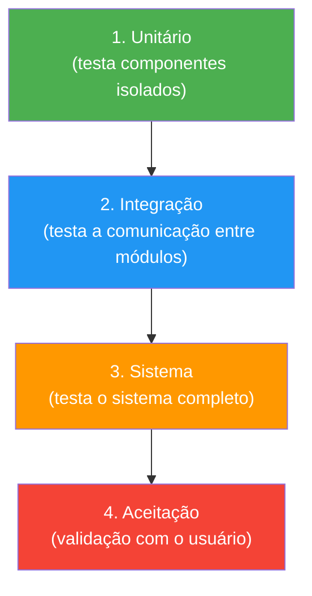

# Fundamentos de Teste

> [!info] Metadados
> **Disciplina:** Testes de Software
> **Bloco:** 4.3 — Testes de Software (FASE 4 — Núcleo de Desenvolvimento)
> **Tópico:** 1. Fundamentos de Teste
> **Subtópicos:** Níveis de teste (unitário, integração, sistema, aceitação) · Tipos de teste (funcionais, não-funcionais, estruturais, regressão) · Estratégias de teste (caixa-branca, caixa-preta, cinza)
> **Pré-requisitos:** [[Desenvolvimento-de-Sistemas|Desenvolvimento de Sistemas]] (programação, ciclo de vida do código) e [[Metodologias-Ageis|Metodologias Ágeis]] (TDD mencionado no XP, contexto de sprints)
> **Cargo:** Analista de TI — Perfil 3 (Desenvolvimento de Software) · DATAPREV 2026
> **Data:** 2026-08-31

---

## 1. Por que estudar fundamentos de teste?

Você já sabe escrever código em [[Java-e-Ecossistema-JVM|Java]], usar [[Frameworks-Java|Spring]], versionar com [[DevOps-e-Controle-de-Versao|Git]] e organizar o trabalho com [[Metodologias-Ageis|Scrum]]. Mas há uma pergunta que falta responder: **como ter certeza de que o código que você escreveu realmente funciona — e que não quebrou algo que já estava funcionando?**

Essa é a essência dos **testes de software**. E no contexto da DATAPREV — empresa que mantém os sistemas de cálculo de benefícios previdenciários, consignações e pagamentos da seguridade social — a resposta é visceral: **um bug em um sistema de benefício pode significar um idoso recebendo valor errado na aposentadoria**. Testes não são "boa prática": são **necessidade operacional**.

> [!question] Pergunta orientadora
> Se você implementa uma nova regra de cálculo de aposentadoria (Bloco 4.2 — Engenharia de Requisitos) e ela passa nos testes unitários, mas não nos testes de integração com o banco de dados, o defeito pode só aparecer em produção — quando milhares de beneficiários já foram afetados. Onde exatamente você deveria ter testado? Essa pergunta é o coração do tópico de **níveis de teste**.

Este tópico é a **base conceitual** de todo o Bloco 4.3. Antes de aprender ferramentas (JUnit, Mockito, Selenium — que veremos no [[Testes-Automatizados|tópico 3]]), é preciso entender **o que são testes, como se classificam e por que existem diferentes abordagens**.

---

## 2. Terminologia: defeito, erro e falha

A FGV adora cobrar a distinção entre três termos que parecem sinônimos mas **não são**:

| Termo | O que é | Quando ocorre |
|---|---|---|
| **Erro (error/mistake)** | Um **engano humano** — o desenvolvedor escreveu código incorreto | Durante o **desenvolvimento** (antes do código existir) |
| **Defeito (defect/fault/bug)** | Uma **imperfeição no código ou no documento** causada pelo erro humano | No **código/fonte** — existe mesmo sem ser executado |
| **Falha (failure)** | O **comportamento observado** quando o software com defeito é executado em determinada entrada | Durante a **execução** do software |

> [!important] A cadeia é: Erro → Defeito → Falha
> O **erro** (humano) **causa** o **defeito** (no código) que, quando ativado por uma entrada específica, **causa** a **falha** (comportamento errado observável). Você só **vê** a falha — o defeito pode estar escondido no código, e o erro já passou. A banca pergunta: "O que é um defeito?" Resposta: uma condição no código que pode causar falha — **não é a própria falha**.

> [!question] Por que isso importa na prova?
> Porque a banca troca os termos. "Um defeito é o comportamento errado do software" — **falso**. O defeito é a *causa* no código; a falha é o *comportamento errado*. Se você confunde, erra a questão.

---

## 3. Níveis de teste: a pirâmide

Os **níveis de teste** indicam **quando e em que abstração** o teste é executado. Existem **quatro níveis**, que seguem uma progressão da menor para a maior abstração:

### 3.1 Teste unitário

**Testa componentes individuais** (uma classe, um método, uma função) **de forma isolada**, sem dependências externas (banco de dados, rede, outros módulos).

- **Quem executa:** o desenvolvedor
- **Quando:** durante o desenvolvimento (fase de codificação)
- **Foco:** cada unidade de código funciona isoladamente?
- **Exemplo em DATAPREV:** testar se o método `calcularValorBeneficio(30, 1500.00)` retorna o valor correto, sem consultar o banco.

> [!tip] Teste unitário é a base da pirâmide
> Na pirâmide de testes, os unitários são **mais numerosos, mais rápidos e mais baratos** — porque testam unidades isoladas. Quando você viu o TDD no [[Metodologias-Ageis|XP]], o ciclo Red-Green-Refactor trabalha **exatamente com testes unitários**.

### 3.2 Teste de integração

**Testa a interação entre dois ou mais componentes/módulos** que individualmente funcionam, mas podem falhar ao se comunicar.

- **Quem executa:** desenvolvedor ou equipe de QA
- **Quando:** após os testes unitários
- **Foco:** os módulos se comunicam corretamente? Os dados fluem entre eles?
- **Exemplo em DATAPREV:** testar se o módulo de cálculo de benefício se comunica corretamente com o repositório JPA que acessa o banco de dados Oracle da DATAPREV.

> [!question] Por que um módulo pode funcionar isoladamente e falhar na integração?
> Porque a interface entre os módulos pode estar incorreta: tipos de dados incompatíveis, formatos de dados diferentes, timeout de conexão, configuração errada de injeção de dependência. O teste de integração pega **exatamente esses problemas de "costura" entre componentes**.

### 3.3 Teste de sistema

**Testa o sistema completo** (todos os módulos integrados) como um todo, validando se ele atende aos **requisitos funcionais**.

- **Quem executa:** equipe de QA/testes
- **Quando:** após a integração dos módulos
- **Foco:** o sistema, como um todo, faz o que foi especificado?
- **Exemplo em DATAPREV:** executar o fluxo completo de "solicitação de benefício → cálculo → aprovação → pagamento" no sistema de benefícios.

### 3.4 Teste de aceitação

**Valida se o sistema atende às expectativas do usuário/stakeholder** — é o "teste do mundo real".

- **Quem executa:** usuário final ou Product Owner
- **Quando:** antes da entrega/liberação (ou durante sprints no ágil)
- **Foco:** o sistema atende ao que o negócio precisa?
- **Exemplo em DATAPREV:** um servidor do INSS testa se a nova regra de cálculo de aposentadoria realmente produz os valores esperados para casos reais.

> [!warning] PEGADINHA — nível ≠ tipo
> **Níveis de teste** (unitário, integração, sistema, aceitação) indicam **o que está sendo testado** (abstração). **Tipos de teste** (funcional, não-funcional, etc.) indicam **o que se quer validar** (funcionalidade, desempenho, etc.). São dimensões **independentes**: você pode ter um teste funcional de integração, ou um teste de desempenho de sistema. A banca troca os termos — fique atento.

---

## 4. Tipos de teste: o que se quer validar

Enquanto os **níveis** dizem *onde* testar (unidade, módulo, sistema), os **tipos** dizem *o quê* testar.

### 4.1 Testes funcionais

Validam se o **comportamento do software** está correto em relação aos **requisitos funcionais** — ou seja, se o sistema *faz o que deveria fazer*.

- Verificam: regras de negócio, cálculos, fluxos, validações de entrada
- Pergunta-chave: **o sistema produz o resultado esperado para cada entrada?**

> Exemplo em DATAPREV: validar que o cálculo de tempo de contribuição considera corretamente períodos de trabalho urbano e rural.

### 4.2 Testes não-funcionais

Validam **como** o software opera, não **o que** ele faz. Cobrem atributos de qualidade como desempenho, segurança, usabilidade, portabilidade.

| Atributo | O que valida | Exemplo DATAPREV |
|---|---|---|
| **Desempenho** | tempo de resposta, throughput | O portal de benefícios responde em menos de 3s com 10.000 usuários simultâneos |
| **Segurança** | vulnerabilidades, autenticação | Um usuário não consegue acessar dados de outro beneficiário |
| **Usabilidade** | facilidade de uso | O formulário de solicitação é intuitivo para servidores |
| **Confiabilidade** | disponibilidade, tolerância a falhas | O sistema de pagamento não cai durante o feriado de Natal |

### 4.3 Testes estruturais (de caixa-branca)

Validam a **estrutura interna** do código — caminhos executados, branches, cobertura de código. São os testes que perguntam: **o código foi percorrido completamente?**

- Verificam: branches (if/else), loops, caminhos
- Ferramentas: JaCoCo (cobertura de código — veremos no [[Testes-Automatizados|tópico 3]])
- Relacionam-se com a estratégia de **caixa-branca** (ver seção 5)

### 4.4 Testes de regressão

**Re-executam testes anteriores** após uma mudança no código para garantir que nada quebrou.

- Pergunta-chave: **a nova funcionalidade quebrou alguma funcionalidade existente?**
- Essenciais em ambientes ágeis com sprints contínuas — quando você muda o código toda sprint, precisa garantir que o que já funcionava continua funcionando.

> [!question] Por que testes de regressão são críticos na DATAPREV?
> Porque os sistemas de benefícios são **legados longos** — existem há décadas, com milhares de regras de negócio entrelaçadas. Uma mudança na regra de aposentadoria pode quebrar o cálculo de pensão. Os testes de regressão são o "seguro" contra esse tipo de problema.

---

## 5. Estratégias de teste: como olhar para o código

A estratégia de teste define **de que perspectiva** o teste é projetado. São três abordagens principais:

### 5.1 Caixa-preta (black-box)

O tester **não conhece a estrutura interna** do código. Ele só conhece as **entradas e saídas esperadas** — testa o comportamento, não a implementação.

- **Quem usa:** geralmente QA/testadores (e usuários no teste de aceitação)
- **Foco:** o software faz o que deveria fazer, independente de como foi implementado?
- **Análogo a:** testar um eletrodoméstico — você aperta os botões e vê o resultado, sem abrir a máquina.

### 5.2 Caixa-branca (white-box)

O tester **conhece a estrutura interna** do código — condicionais, loops, caminhos. Ele verifica se todos os caminhos foram percorridos.

- **Quem usa:** geralmente desenvolvedores
- **Foco:** o código foi percorrido completamente? Todos os branches foram ativados?
- **Análogo a:** abrir o eletrodoméstico e verificar cada circuito.

### 5.3 Caixa-cinza (gray-box)

Combina os dois: o tester tem **conhecimento parcial** da estrutura interna, mas testa também pelo comportamento. É a abordagem mais comum na prática.

- **Quem usa:** QA com conhecimento técnico
- **Foco:** testar comportamento (preta) usando conhecimento da estrutura (branca) para projetar testes mais eficientes.

> [!warning] PEGADINHA — caixa-preta ≠ teste manual
> A banca adora associar "caixa-preta" com "teste manual" e "caixa-branca" com "teste automatizado". **Isso é falso.** Um teste automatizado de Selenium que abre o navegador e clica em botões é **caixa-preta** (não conhece o código) e **automatizado**. Um desenvolvedor pode fazer teste manual de caixa-branca (revisar o código manualmente). As dimensões são **independentes**: estratégia (preta/branca) ≠ execução (manual/automatizada).

---

## 6. Princípios fundamentais de teste (Kaner, Feiler)

Existem **sete princípios clássicos** de teste que a banca cobra em conjunto:

| # | Princípio | Significado |
|---|---|---|
| 1 | **Exaustividade é impossível** | Não dá para testar todas as combinações de entrada. Priorize com base em risco. |
| 2 | **Testes mostram presença de defeitos, não ausência** | Passar em todos os testes **não prova** que não há defeitos — apenas que nenhum foi encontrado. |
| 3 | **Teste precoce** | Quanto antes encontrar o defeito, mais barato é corrigir. Testar desde a fase de requisitos. |
| 4 | **Agrupamento de defeitos** | A maioria dos defeitos se concentra em poucos módulos (regra de Pareto: 80/20). |
| 5 | **Paradoxo do pesticida** | Se você repete os mesmos testes sempre, eles eventualmente param de encontrar novos defeitos — como pragas que se tornam resistentes ao pesticida. Precisa **variar** os testes. |
| 6 | **Teste depende do contexto** | Testar um sistema bancário é diferente de testar um app de Delivery. Prioridades e abordagens mudam. |
| 7 | **Falácia dos "todos os defeitos corrigidos"** | Não existe isso de "sistema sem defeitos". Sempre haverá mais defeitos — a questão é prioridade e risco. |

> [!warning] PEGADINHA — paradoxo do pesticida
> A banca descreve o cenário: "Um time de teste executa os mesmos 100 testes todos os dias e nenhum novo defeito é encontrado há meses." O que isso indica? Não que o sistema está sem defeitos — mas que os testes ficaram **obsoletos**. É preciso **criar novos testes, com novos cenários**, para descobrir defeitos que os testes antigos não cobrem. Esse é o **paradoxo do pesticida**.

---

## 7. Casos de teste e cenários

Antes de executar qualquer teste, é preciso **projetá-lo**. Dois conceitos fundamentais:

### 7.1 Cenário de teste (test scenario)

Uma **descrição de alto nível** do que será testado — uma funcionalidade, um fluxo, uma funcionalidade do sistema.

> Exemplo: "Cenário: Solicitar novo benefício previdenciário com todos os dados obrigatórios."

### 7.2 Caso de teste (test case)

Uma **descrição detalhada e específica** de um teste, com:

| Elemento | Descrição |
|---|---|
| **ID** | Identificador único do caso de teste |
| **Descrição/Objetivo** | O que se pretende validar |
| **Pré-condições** | O que precisa ser verdade antes de executar |
| **Entradas (dados de teste)** | Valores específicos usados no teste |
| **Passos** | Sequência de ações a executar |
| **Resultado esperado** | O que deve acontecer se o código estiver correto |
| **Resultado real** | O que realmente aconteceu (preenchido após execução) |
| **Status** | Passou / Falhou / Bloqueado |

> [!question] Caso de teste ≠ cenário de teste
> O **cenário** é o "quê" (uma visão ampla); o **caso de teste** é o "como" (passos detalhados com dados e resultado esperado). Um cenário pode gerar **vários** casos de teste (por exemplo: cenário "solicitar benefício" gera casos com dados válidos, dados inválidos, campos obrigatórios faltando, etc.).

> [!warning] PEGADINHA — caso de teste ≠ plano de teste
> O **caso de teste** é a especificação de um único teste. O **plano de teste** é o documento que organiza **todos** os testes: escopo, estratégia, cronograma, recursos, critérios de entrada/saída. São níveis completamente diferentes — o plano é o "gerente"; o caso é o "soldado". Veremos o plano de teste no [[Gestao-do-Ciclo-de-Vida-de-Testes|tópico 4]].

---

## 8. Relação com o ciclo de desenvolvimento

Os níveis de teste não existem no vazio — eles se encaixam em **fases do ciclo de vida do software**:

| Fase do ciclo | Teste predominante | Quem executa |
|---|---|---|
| Requisitos | Revisão de requisitos (teste estático) | Analistas, PO |
| Design | Revisão de design (teste estático) | Arquitetos, devs |
| Codificação | **Teste unitário** | Desenvolvedor |
| Integração | **Teste de integração** | Dev/QA |
| Validação do sistema | **Teste de sistema** | QA |
| Aceitação | **Teste de aceitação** | Usuário/PO |
| Manutenção | **Teste de regressão** | Dev/QA |

> [!note] Testes estáticos vs. dinâmicos
> A banca cobra essa distinção: **testes estáticos** não executam o código — são **revisões** (revisão de código, revisão de requisitos, inspeções). **Testes dinâmicos** **executam** o código e observam o comportamento. A maioria do que estudamos aqui são testes dinâmicos — mas não esqueça dos estáticos, que são importantes e baratos.

---

## 9. Como a FGV cobra fundamentos de teste

- **Níveis de teste** são o alvo mais frequente: a questão descreve um cenário e pergunta "em que nível de teste esse teste se encaixa?"
- **Defeito vs. erro vs. falha** é uma distinção clássica — memorize a cadeia.
- **Princípios de teste** aparecem em questões conceituais (especialmente "paradoxo do pesticida" e "testes mostram presença, não ausência").
- **Caixa-preta vs. caixa-branca** cai em conjunção com estratégias — e a pegadinha é trocar com "manual vs. automatizado".
- **Severidade vs. prioridade** (introduzido aqui como preview, detalhado no [[Gestao-do-Ciclo-de-Vida-de-Testes|tópico 4]]): severidade é o impacto do defeito; prioridade é a urgência de corrigi-lo.

> [!warning] PEGADINHA — as cinco armadilhas mais rentáveis
> (1) **Defeito ≠ falha** — defeito é a condição no código; falha é o comportamento errado observado. (2) **Nível ≠ tipo** — nível (unitário/integração) é *onde*; tipo (funcional/não-funcional) é *o quê*. (3) **Caixa-preta ≠ manual** — caixa-preta é sobre conhecimento do código; manual é sobre quem executa. (4) **Teste não prova ausência de defeito** — apenas que nenhum foi encontrado até agora. (5) **Paradoxo do pesticida** — mesmos testes param de encontrar defeitos; é preciso variar.

---

## 10. Resumo e pontos-chave

> [!tip] Checklist de revisão
> - [ ] **Defeito** = condição no código · **Falha** = comportamento errado observado · **Erro** = engano humano
> - [ ] **Níveis:** unitário (classe/método) → integração (módulos comunicando) → sistema (sistema completo) → aceitação (usuário valida)
> - [ ] **Tipos:** funcional (faz o que deve), não-funcional (como opera), estrutural/codificação (caminhos do código), regressão (não quebrou o que já funcionava)
> - [ ] **Estratégias:** caixa-preta (só entradas/saídas), caixa-branca (conhece o código), cinza (mista)
> - [ ] **Princípios:** exaustividade impossível · testes mostram presença, não ausência · teste precoce · agrupamento de defeitos · paradoxo do pesticida · dependência do contexto
> - [ ] **Cenário** = descrição ampla · **Caso de teste** = passos detalhados com dados e resultado esperado
> - [ ] **Testes estáticos** (revisão, inspeção) ≠ **testes dinâmicos** (executam o código)
> - [ ] **Nível ≠ tipo** — dimensões independentes

> [!question] Revise mentalmente
> Se o desenvolvedor escreve um teste que verifica se o método `calcularBeneficio()` retorna o valor correto, e esse teste é executado isoladamente (sem banco, sem rede) — que nível e tipo de teste é esse? *(Resposta: nível unitário, tipo funcional — e a estratégia pode ser caixa-branca se o desenvolvedor conhece o código, ou caixa-preta se só conhece a especificação.)*

---

## 11. Próximos passos

Agora que você domina os fundamentos conceituais — níveis, tipos, estratégias e princípios — vamos ver como esses conceitos se aplicam no **método ágil**: o **TDD** (cujo ciclo Red-Green-Refactor você já viu no XP, no [[Metodologias-Ageis|Bloco 4.2]]) será aprofundado, e conheceremos o **BDD** como uma extensão do TDD para a linguagem de negócio.
