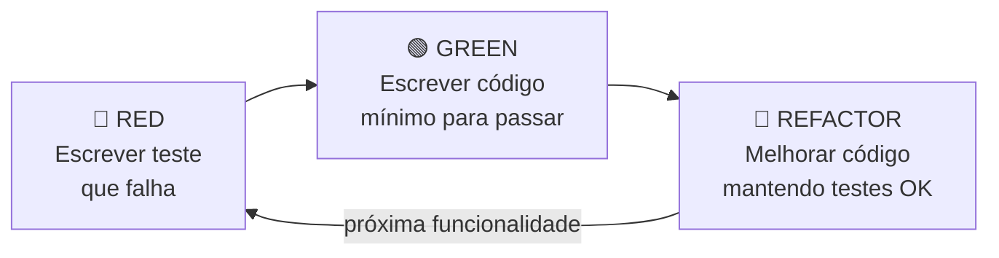

# Testes Ágeis

> [!info] Metadados
> **Disciplina:** Testes de Software
> **Bloco:** 4.3 — Testes de Software (FASE 4 — Núcleo de Desenvolvimento)
> **Tópico:** 2. Testes Ágeis
> **Subtópicos:** TDD (Test-Driven Development — ciclo Red-Green-Refactor detalhado) · BDD (Behavior-Driven Development — Cucumber, Gherkin, conceito) · Testes em sprints: definição de pronto (DoD)
> **Pré-requisitos:** [[Metodologias-Ageis|Metodologias Ágeis]] (TDD mencionado no XP, ciclo de sprints, Scrum) · [[Fundamentos-de-Teste|Fundamentos de Teste]] (níveis, tipos, estratégias de teste)
> **Cargo:** Analista de TI — Perfil 3 (Desenvolvimento de Software) · DATAPREV 2026
> **Data:** 2026-08-31

---

## 1. Por que estudar testes ágeis?

No [[Metodologias-Ageis|Bloco 4.2]], quando estudamos **XP (Extreme Programming)**, apresentamos o **TDD** como uma de suas práticas centrais — e fizemos uma promessa: *"aproveitaremos o ciclo Red-Green-Refactor no Bloco 4.3."* **Chegou a hora de cumprir essa promessa.**

Nos métodos ágeis, os testes não são uma fase que vem "depois da codificação" — eles **precedem** a codificação (TDD) ou são **co-escritos com as especificações** (BDD). Essa inversão é radical em relação ao modelo tradicional (onde se codifica primeiro e se testa depois), e é uma das razões pelas quais o ágil produz software com mais qualidade: o teste é pensado **antes** do código existir.

> [!question] Pergunta orientadora
> Se no [[Fundamentos-de-Teste|Bloco 4.3 anterior]] vimos que "testar precoce é mais barato" — qual seria a forma **mais precoce** possível de testar? Testar **antes mesmo de escrever o código**. É exatamente isso que o TDD propõe.

Este tópico se apoia em dois pilares que você já domina:

- **Scrum** ([[Metodologias-Ageis]]): as sprints, o Product Backlog, a DoD — o contexto onde os testes ágeis acontecem.
- **Fundamentos de teste** ([[Fundamentos-de-Teste]]): níveis, tipos e estratégias — que estruturam **o que** estamos testando.

---

## 2. TDD (Test-Driven Development) — o ciclo Red-Green-Refactor

### 2.1 O que é TDD?

**TDD (Test-Driven Development)** é uma prática de desenvolvimento em que o desenvolvedor escreve um **teste automatizado ANTES de escrever o código de produção**. O ciclo é curto e iterativo:



O nome "Red-Green-Refactor" vem das cores do teste:

1. **🔴 RED (Vermelho):** Você escreve um teste que **falha** (a funcionalidade ainda não existe). A barra de testes fica vermelha.
2. **🟢 GREEN (Verde):** Você escreve o **mínimo de código possível** para que o teste **passe**. A barra fica verde.
3. **🔵 REFACTOR (Refatorar):** Você **melhora a estrutura** do código (elimina duplicação, renomeia, simplifica) sem alterar o comportamento — os testes continuam passando.

### 2.2 Por que começar pelo teste que falha?

> [!question] Por que não escrever o código primeiro e o teste depois?
> Porque quando você escreve o código **sabendo** o que deve retornar, existe uma tendência natural inconsciente de escrever código que funciona **para aquele teste específico** — mas que pode ter caminhos não testados, bordas não cobertas. Ao escrever o teste **antes**, você define o **contrato** do código: "isso é o que eu espero que aconteça." O código depois é apenas a implementação desse contrato.

### 2.3 Exemplo detalhado: TDD em Java com JUnit

Vamos simular um cenário da DATAPREV: o desenvolvedor precisa criar um método que valida se um segurado tem **tempo mínimo de contribuição** para aposentadoria (exigência mínima: 15 anos).

**Etapa 1 — 🔴 RED: Escrever o teste (que falha)**

```java
import org.junit.jupiter.api.Test;
import static org.junit.jupiter.api.Assertions.*;

class ValidadorAposentadoriaTest {

    @Test
    void deveRetornarTrueQuandoTempoContribuicaoMaiorOuIgual15() {
        ValidadorAposentadoria validador = new ValidadorAposentadoria();
        assertTrue(validador.podeSeAposentar(15));
        assertTrue(validador.podeSeAposentar(30));
    }

    @Test
    void deveRetornarFalseQuandoTempoContribuicaoMenor15() {
        ValidadorAposentadoria validador = new ValidadorAposentadoria();
        assertFalse(validador.podeSeAposentar(10));
        assertFalse(validador.podeSeAposentar(0));
    }
}
```

O teste **não compila** — a classe `ValidadorAposentadoria` nem existe. O método `podeSeAposentar` não existe. A barra de testes está **vermelha**.

**Etapa 2 — 🟢 GREEN: Código mínimo para passar**

```java
public class ValidadorAposentadoria {

    public boolean podeSeAposentar(int anosContribuicao) {
        return anosContribuicao >= 15;
    }
}
```

Agora os testes **passam**. A barra fica **verde**. O código é mínimo — sem validação de null, sem constantes, sem excesso de abstração. É o "mínimo para o teste passar."

**Etapa 3 — 🔵 REFACTOR: Melhorar o código**

```java
public class ValidadorAposentadoria {

    private static final int TEMPO_MINIMO_CONTRIBUICAO = 15;

    public boolean podeSeAposentar(int anosContribuicao) {
        if (anosContribuicao < 0) {
            throw new IllegalArgumentException("Anos de contribuição não pode ser negativo");
        }
        return anosContribuicao >= TEMPO_MINIMO_CONTRIBUICAO;
    }
}
```

O código continua passando nos testes — mas agora tem uma **constante** (não mais "mágica 15"), uma **validação de entrada** e uma **exceção descritiva**. O comportamento externo não mudou; a **estrutura interna** melhorou.

> [!important] A regra de ouro do TDD
> **Nunca pule uma etapa.** Se você está no Verde e quer melhorar o código — Refatore primeiro. Se você quer adicionar funcionalidade — escreva um novo teste que falhe (novo Vermelho). Nunca mude o código de produção sem um teste que justifique a mudança. É essa disciplina que gera a qualidade.

### 2.4 TDD na prática: quem faz o quê?

| Aspecto | Quem faz | Quando |
|---|---|---|
| Escrever o teste (Red) | Desenvolvedor | **Antes** de escrever o código |
| Escrever código mínimo (Green) | Desenvolvedor | **Imediatamente** após o teste falhar |
| Refatorar (Refactor) | Desenvolvedor | **Sempre que** o código está verde e precisa de melhoria |
| Revisar os testes | Outro dev (Pair Programming) | Durante code review |

> [!warning] PEGADINHA — TDD "teste primeiro" vs. "teste depois"
> A banca pergunta: "No TDD, os testes são escritos antes ou depois do código?" **Antes.** Essa é a definição fundamental. Se os testes são escritos **depois**, não é TDD — é apenas "desenvolvimento com testes automatizados." O "Driven" (guiado por teste) implica que o **teste guia** o desenvolvimento, não que acompanha.

---

## 3. BDD (Behavior-Driven Development) — testes em linguagem de negócio

### 3.1 O que é BDD?

**BDD (Behavior-Driven Development)** é uma extensão do TDD que escreve os testes em **linguagem natural compreensível por todos** — desenvolvedores, analistas, Product Owners, stakeholders. A ideia é que **o comportamento do sistema** seja especificado em termos de **negócio**, não de código.

Enquanto o TDD foca no **desenvolvedor escrevendo testes em código** (Java, JUnit), o BDD introduz uma **camada de especificação** em linguagem natural que depois se **conecta** ao código de teste.

### 3.2 Given-When-Then (GWT)

O padrão central do BDD é a estrutura **Given-When-Then**:

| Parte | O que significa | Exemplo |
|---|---|---|
| **Given** (Dado) | O **contexto inicial** — o estado do sistema antes da ação | Dado que o segurado possui 16 anos de contribuição |
| **When** (Quando) | A **ação** que ocorre | Quando ele solicita a aposentadoria |
| **Then** (Então) | O **resultado esperado** | Então a solicitação deve ser aprovada |

Uma especificação BDD ficaria assim:

```gherkin
Funcionalidade: Validação de Aposentadoria

  Cenário: Segurado com tempo suficiente
    Dado que o segurado possui 16 anos de contribuição
    Quando ele solicita a aposentadoria
    Então a solicitação deve ser aprovada

  Cenário: Segurado com tempo insuficiente
    Dado que o segurado possui 10 anos de contribuição
    Quando ele solicita a aposentadoria
    Então a solicitação deve ser rejeitada
```

> [!note] Linguagem Gherkin
> O formato acima se chama **Gherkin** — uma linguagem de especificação que usa **português estruturado** (ou inglês) com as palavras-chave `Dado/Quando/Então` (`Given/When/Then`). É a sintaxe usada pelo **Cucumber**, a ferramenta mais associada ao BDD.

### 3.3 Cucumber — o conceito

O **Cucumber** é uma ferramenta que **executa** especificações escritas em Gherkin e as **conecta** a código de teste. O fluxo é:

1. O analista/PO escreve a especificação em **Gherkin** (`.feature`);
2. O desenvolvedor cria **"step definitions"** (definições de passo) em código (Java, por exemplo);
3. O Cucumber **casa** os passos Gherkin com o código correspondente;
4. A especificação viva se torna um **teste executável**.

> [!question] BDD vs. TDD — qual a diferença?
> O **TDD** é uma prática do **desenvolvedor**: ele escreve testes em código (JUnit) que guiam a implementação. O **BDD** é uma prática de **colaboração**: ele escreve **especificações em linguagem natural** (Gherkin/Cucumber) que descrevem o comportamento do sistema, e essas especificações se conectam a testes executáveis. O TDD responde "o código está correto?"; o BDD responde "o sistema se comporta como o negócio espera?".

> [!warning] PEGADINHA — BDD é sobre comportamento, não sobre código
> A banca pode dizer que "BDD é uma forma de escrever testes unitários." **Não necessariamente.** O BDD pode testar qualquer nível (unitário, integração, aceitação) — o que o define é a **linguagem de especificação** (Gherkin), não o nível de teste. O foco é **comportamento observável** do sistema, não a estrutura interna.

---

## 4. Testes em sprints: a Definição de Pronto (DoD)

### 4.1 O que é DoD?

No [[Metodologias-Ageis|Scrum]], o incremento de software produzido em cada sprint deve atender a uma **Definição de Pronto (DoD — Definition of Done)** — uma lista de critérios que **tudo** que é entregue deve cumprir. A DoD é o "checklist de qualidade" da sprint.

Uma DoD típica pode incluir:

- [ ] Código revisado por outro desenvolvedor (code review)
- [ ] Todos os testes unitários passando
- [ ] Testes de integração passando
- [ ] Cobertura de código mínima atingida (ex: 80%)
- [ ] Sem bugs conhecidos de severidade alta
- [ ] Documentação atualizada
- [ ] Funcionalidade validada pelo Product Owner

### 4.2 DoD e a relação com testes

A DoD é onde os **testes se encontram com o Scrum** — ela define **quando** um item de backlog pode ser considerado "feito":

> [!question] O que acontece se o Product Owner pede para liberar um item sem os testes passando?
> Resposta: **não pode ser considerado "feito"** (Done). A DoD é um **acordo do time** — não pode ser ignorada por conveniência. Se o item não cumpre a DoD, ele volta para o Sprint Backlog ou para o Product Backlog. A DoD protege a qualidade do incremento.

### 4.3 DoD ≠ Backlog

> [!warning] PEGADINHA — DoD ≠ Backlog
> O **Product Backlog** é a lista de **o que fazer** (requisitos, funcionalidades). A **DoD** é a lista de **critérios de qualidade** que todo item deve atingir para ser considerado pronto. São conceitos completamente diferentes: o backlog é sobre *conteúdo*; a DoD é sobre *qualidade*.

---

## 5. Pirâmide de testes — o conceito

A **pirâmide de testes** é uma heurística para dimensionar a **quantidade de testes** em cada nível:

```
        /\          ← Poucos testes E2E (Aceitação/Sistema)
       /  \            lentos e caros
      /    \
     /------\      ← Quantidade moderada de testes de Integração
    /        \
   /----------\   ← Muitos testes Unitários
  /            \      rápidos e baratos
 /______________\
```

| Nível | Quantidade | Velocidade | Custo | Exemplo |
|---|---|---|---|---|
| **Unitário** | Muitos | Muito rápido | Muito baixo | JUnit testando métodos isolados |
| **Integração** | Moderados | Moderado | Moderado | Testando comunicação com banco de dados |
| **E2E/Aceitação** | Poucos | Lento | Alto | Selenium abrindo navegador |

> [!important] Por que a pirâmide tem essa forma?
> Porque testes unitários são **rápidos, baratos e específicos** — você pode ter centenas deles rodando em segundos. Testes E2E (ponto da pirâmide) são **lentos, frágeis e caros** — cada um abre um navegador, simula interações reais. Se você inverter a pirâmide (muitos E2E, poucos unitários), o suite de testes fica lento e frágil — e o time para de rodá-lo. A forma ideal é: **muita base unitária, integração moderada, E2E no pontinho**.

---

## 6. Como a FGV cobra testes ágeis

- **TDD em conjunto com Scrum/XP**: a banca descreve uma prática XP e pergunta qual etapa do ciclo o desenvolvedor está. Memorize: Red → Green → Refactor.
- **BDD é conceitual**: não espera código Cucumber complexo — espera que você saiba o que é Gherkin e qual a diferença entre BDD e TDD.
- **DoD**: aparece em questões sobre Scrum que misturam com testes — "o incremento é considerado pronto quando atinge a DoD."
- **Pirâmide de testes**: a banca descreve um cenário com muitos testes E2E e poucos unitários e pergunta qual o problema.

> [!warning] PEGADINHA — as cinco armadilhas mais rentáveis
> (1) **TDD é "teste antes"** — se o teste vem depois, não é TDD. (2) **BDD ≠ TDD** — BDD é sobre comportamento/linguagem de negócio; TDD é sobre código/guia de implementação. (3) **DoD ≠ backlog** — DoD é critério de qualidade; backlog é lista de funcionalidades. (4) **Pirâmide invertida é problema** — muitos E2E e poucos unitários = lento e frágil. (5) **Gherkin não é código** — é especificação em linguagem natural que se conecta a código via Cucumber.

---

## 7. Resumo e pontos-chave

> [!tip] Checklist de revisão
> - [ ] **TDD ciclo:** 🔴 Red (teste falha) → 🟢 Green (código mínimo passa) → 🔵 Refactor (melhora sem quebrar)
> - [ ] **TDD:** teste é escrito **antes** do código — o teste guia a implementação
> - [ ] **BDD:** especificação em linguagem natural (**Gherkin**: Given/When/Then) conectada a código via **Cucumber**
> - [ ] **BDD vs TDD:** BDD = comportamento/negócio · TDD = código/implementação — complementares
> - [ ] **DoD (Definition of Done):** critérios de qualidade que todo item de backlog deve atingir para ser "feito"
> - [ ] **DoD ≠ Product Backlog** — DoD é qualidade; backlog é conteúdo
> - [ ] **Pirâmide de testes:** muitos unitários (base), integração (meio), poucos E2E (topo)
> - [ ] **TDD praticado no XP** ([[Metodologias-Ageis]]) — agora aprofundado com o ciclo Red-Green-Refactor

> [!question] Revise mentalmente
> Um Product Owner quer liberar uma funcionalidade sem que os testes de integração tenham sido executados. A DoD do time exige testes de integração passando. O que o Scrum Master deve fazer? *(Resposta: o item não pode ser considerado "Done" — ele volta ao Sprint Backlog. O SM protege a qualidade e garante que a DoD seja cumprida, sem ceder*)
>
> **Alternativa correta:** o Scrum Master deve lembrar o PO de que a DoD não pode ser descumprida — o item volta ao backlog. O Scrum Master é o **guardião do processo**, não um facilitador que cede à pressão.

---

## 8. Próximos passos

Você agora domina como os testes se integram ao ágil (TDD, BDD, DoD). No próximo tópico, vamos aprender as **ferramentas concretas** que colocam esses conceitos em prática: [[Testes-Automatizados|JUnit, Mockito e Selenium]] — onde veremos como escrever testes unitários em Java, como isolar dependências com mocks, e como testar interfaces web automatizadamente.
