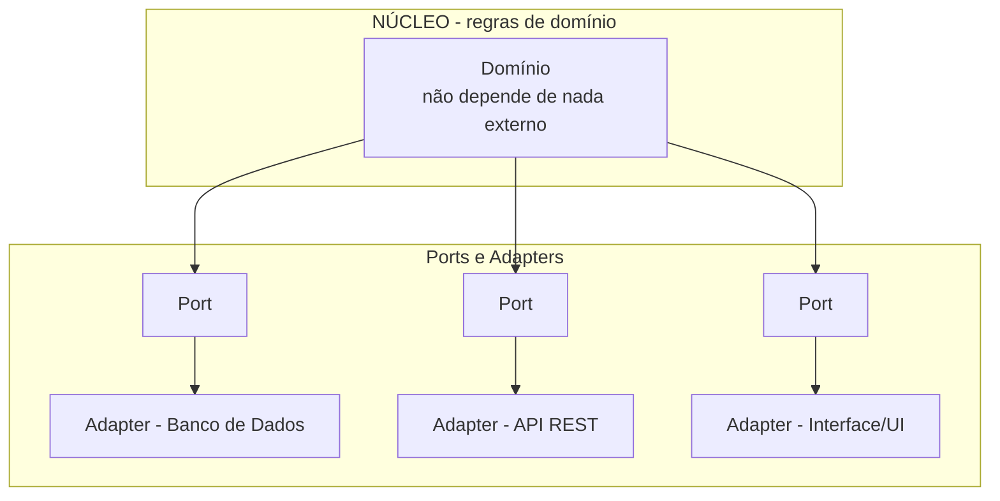
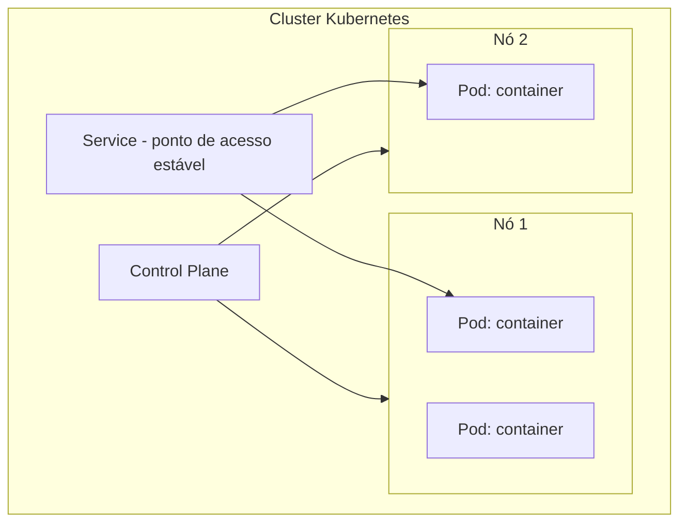

# Arquitetura de Software Avançada

> [!info] Metadados
> **Disciplina:** Arquitetura Avançada, Segurança e Inovação
> **Bloco:** 5.3 — Arquitetura Avançada, Segurança e Inovação (FASE 5 — Frontend e Interfaces)
> **Tópico:** 4. Arquitetura de Software Avançada
> **Subtópicos:** Arquitetura Hexagonal (Ports and Adapters) · Microsserviços (princípios, desafios, comunicação síncrona/assíncrona) · Containers — Docker · Orquestração — Kubernetes · Service Mesh
> **Pré-requisitos:** [[Padroes-de-Projeto-e-Arquitetura]] (SOA, API RESTful, mensageria), [[Design-de-Software-Avancado]] (DDD, event-driven), [[DevOps-e-Controle-de-Versao]] (Docker conceito básico, CI/CD)
> **Cargo:** Analista de TI — Perfil 3: Desenvolvimento de Software
> **Data:** 2026-08-31

## 1. Por que estudar arquitetura de software avançada?

Chegamos à "casca" do sistema: a **estrutura** que organiza as partes de uma aplicação — e, sobretudo, do ambiente de **muitos serviços**. Você já domina como *modelar* o domínio (Tópico 3), como *comunicar* sistemas (4.1) e como *proteger* a comunicação (Tópico 1). Agora veremos **onde** cada peça vive e **como** elas se encaixam e escalam.

A pergunta orientadora:

> [!question]
> Um sistema cresceu: hoje são dezenas de módulos, equipes diferentes, picos de acesso. Manter tudo **em um único bloco** (monólito) fica inviável? Separar em **microsserviços** resolve tudo de graça? E se cada serviço rodar em um **container**, como eles se descobrem e conversam em escala?

Este tópico responde organizando a arquitetura em camadas: **Hexagonal** (isolar o domínio das tecnologias), **microsserviços** (quebrar em serviços), **Docker** (empacotar/executar) e **Kubernetes** (orquestrar/escalar), com **Service Mesh** para a comunicação entre serviços.

## 2. Arquitetura Hexagonal (Ports and Adapters)

> [!important] A ementa destaca
> A **Arquitetura Hexagonal** é **frequentemente cobrada em concursos** — e o ponto que a banca quer saber é a **separação entre o núcleo e os adaptadores**. Entenda bem essa fronteira.

### 2.1 O núcleo no centro, isolado das tecnologias

A **Arquitetura Hexagonal** (também chamada de **Ports and Adapters**) organiza o software colocando o **núcleo de domínio** (as regras de negócio) **no centro**, **isolado** das tecnologias externas como banco de dados, interface do usuário, APIs e serviços externos.

O nome "hexagonal" vem da representação visual: o domínio ocupa o centro e **não depende de nada externo**. As tecnologias estão na **borda**, e a comunicação entre o núcleo e o mundo exterior acontece por meio de **interfaces** (os **ports**) e de **implementações concretas** (os **adapters**).

### 2.2 Ports e Adapters

- **Ports (portas)** são **interfaces** que o **núcleo define** para interagir com o mundo externo. O núcleo "não sabe" quem implementa — só conhece a **interface**.
- **Adapters (adaptadores)** são as **implementações concretas** dessas interfaces, que conectam o núcleo a uma **tecnologia específica** (um adapter de banco PostgreSQL, um adapter de API REST, etc.).

> [!warning] PEGADINHA — núcleo vs. adaptadores
> A diferença central: o **núcleo** contém **regras de negócio** e **não depende** de tecnologia (banco, framework, UI). Os **adaptadores** são as **implementações concretas** que conectam o núcleo às tecnologias. Afirmar que "o banco de dados fica no núcleo" é **falso** — o banco está na **borda**, acessado por um **adapter** via um **port**. Essa fronteira é o coração da cobrança.

### 2.3 Benefícios

- **Testabilidade**: como o núcleo não depende de tecnologias, é fácil testá-lo com **adaptadores falsos** (mock) — você já viu o papel de mocks em [[Testes-Automatizados]].
- **Independência de tecnologia**: trocar de banco ou de framework **não toca o núcleo** — basta trocar o **adapter**.
- **Foco no negócio**: as regras de domínio ficam protegidas e expressas na linguagem do negócio (conectando ao DDD do Tópico 3).

## 3. Microsserviços

### 3.1 O que são e princípios

**Microsserviços** é um **estilo arquitetural** em que uma aplicação é construída como um conjunto de **serviços pequenos, independentes e autônomos**, cada um focado em **uma capacidade de negócio**.

Princípios:

- **Pequenos e focados**: cada serviço faz **uma coisa** bem;
- **Independentes**: desenvolvidos, implantados e escalados **de forma autônoma**;
- **Cada um com seu próprio banco de dados** (banco de dados por serviço — *database per service*);
- **Deploy independente**: um serviço pode ser atualizado **sem** reimplantar os demais;
- **Escalabilidade**: é possível escalar **apenas** o serviço sob demanda, não o sistema inteiro.

> [!example] Contexto DATAPREV
> Em um sistema de benefícios, poderiam existir serviços separados: "atendimento", "cálculo de benefício", "notificação". O serviço de cálculo pode escalar nos picos sem afetar os demais, e cada um mantém **seu próprio banco** — o que é tanto um benefício (independência) quanto uma dificuldade (transações entre serviços, que veremos no Tópico 5).

### 3.2 Desafios

A contrapartida dos benefícios — e a banca adora essa "segunda cara":

- **Complexidade de rede**: cada chamada entre serviços é uma ida pela rede (latência, falhas);
- **Consistência**: com bancos separados, garantir consistência entre serviços é difícil (tópico de Transações Distribuídas, na sequência);
- **Observabilidade**: com muitos serviços, rastrear uma requisição completa e investigar problemas exige **logs/métricas/tracing** distribuídos;
- **Deploy**: orquestrar o deploy de muitos serviços é complexo (daí ferramentas como Kubernetes e pipelines de CI/CD).

### 3.3 Comunicação síncrona vs. assíncrona

Os serviços conversam de duas formas principais:

| Comunicação | Síncrona | Assíncrona |
|---|---|---|
| Modelo | **Chamada direta que espera resposta** | **Mensagem via broker, sem espera** |
| Exemplo | **REST** (HTTP request/response) | **RabbitMQ, Kafka** (fila/tópico) |
| Acoplamento | temporal (quem chama espera) | desacoplado (produtor não espera) |
| Base (4.1) | Web Services / APIs RESTful | **Mensageria** (fila, tópico, broker) |

- **Síncrona (ex.: REST)**: o serviço A **chama** o serviço B via HTTP e **espera a resposta**. Simples, mas acopla temporariamente e sofre com lentidão/indisponibilidade.
- **Assíncrona (ex.: RabbitMQ, Kafka)**: o serviço A **publica** uma mensagem em um **broker** e **segue em frente**; o serviço B a **processa** quando puder. Você já viu a base disso na **mensageria** do [[Padroes-de-Projeto-e-Arquitetura]] (fila = um consumidor; tópico/pub-sub = vários).

> [!warning] PEGADINHA — microsserviço ≠ SOA
> **Microsserviços e SOA estão relacionados, mas não são a mesma coisa.** SOA (Service-Oriented Architecture, do 4.1) foi a abordagem anterior, muitas vezes baseada em **barramento de serviços (ESB)** e serviços maiores. **Microsserviços** são uma **evolução/especialização** de SOA: serviços **menores**, cada um com **seu banco**, deploy independente, e **menos ênfase** em barramento central (comunicação direta ou via broker leve). Afirmar que "microsserviços são exatamente SOA" ou "SOA e microsserviços são a mesma coisa" é **redução** — são relacionados, mas é uma **evolução/especialização**, não sinônimos.

> [!warning] PEGADINHA — microsserviços ≠ "sempre a melhor escolha"
> Separação em microsserviços **não resolve tudo de graça** e **não é sempre a melhor opção**. Traz benefícios (escala, independência) mas também **custos** (complexidade de rede, consistência, observabilidade, deploy). Para aplicações pequenas/médias, o **monólito** pode ser mais adequado. A banca testa o equilíbrio: "microsserviços eliminam todos os problemas de um monólito" → **falso**.

## 4. Containers — Docker

> [!important] A ementa destaca
> Docker e Kubernetes são cobrados **de forma conceitual**. O essencial: saber o que é um **container vs. VM** e o **papel** de cada peça — não é preciso dominar YAML ou comandos detalhados.

### 4.1 Conceitos fundamentais

- **Image (imagem)**: um **modelo imutável e executável** com o código e suas dependências (uma "fotografia" do ambiente). É **imutável** — não muda após criada; criam-se containers a partir dela.
- **Container**: uma **instância executável** criada a partir de uma imagem. Toda imagem gera **muitos containers** (execuções) sem se alterar.
- **Volumes**: mecanismo de **persistência** de dados — os dados dentro de um container se perdem quando ele termina; **volumes** guardam dados fora do ciclo de vida do container.
- **Networks**: **isolamento de rede** entre containers — cada rede isola e controla a comunicação.

> [!example] Analogia
> A **imagem** é como o **molde** (ou o "DVD do sistema"); o **container** é como a **execução** de um VM pelo molde (ou a "instância rodando"). Você usa o mesmo molde para criar várias execuções. E se quiser guardar dados além do ciclo de vida da execução, usa um **volume**.

### 4.2 Container vs. VM (a pegadinha clássica)

> [!warning] PEGADINHA — container vs. VM
> Essa é a **pegadinha clássica** que a ementa destaca. Um **container** **compartilha o kernel do sistema operacional do host**, sendo **leve** e rápido de iniciar — não carrega um SO completo por container. Uma **VM (máquina virtual)** tem **seu próprio kernel** e roda sobre um **hypervisor**, sendo mais pesada, com maior isolamento. A banca pode afirmar que "cada container tem seu próprio kernel" → **falso**. O container **compartilha o kernel do host**; a **VM** é que tem kernel próprio sob hypervisor.

| | Container (Docker) | VM (Máquina Virtual) |
|---|---|---|
| Kernel | **Compartilha o kernel do host** | **Próprio kernel** |
| Camada | Sobre o SO/container runtime | Sobre **hypervisor** |
| Peso | **Leve**, rápido | Pesado, mais lento |
| Isolamento | Menor (compartilha kernel) | Maior |
| Uso | Empacotar/deployar aplicações | Isolar SOs completos |

### 4.3 Dockerfile e Docker Hub (conceito)

- **Dockerfile**: um **arquivo de instruções** que **define como construir a imagem** (quais dependências, qual comando de execução). É a "receita" da imagem.
- **Docker Hub**: um **registro/repositório central** de imagens, de onde você **publica e baixa** imagens prontas.

> [!note] Você já viu Docker no 4.1
> O [[DevOps-e-Controle-de-Versao]] apresentou Docker como **conceito básico** de containerização. Aqui aprofundamos as **peças** (images, containers, volumes, networks) e a distinção container vs. VM. Para a prova, siga conceitual: entenda o **papel** de cada peça, sem se prender a comandos.

## 5. Orquestração — Kubernetes

Com dezenas de containers rodando, alguém precisa **gerenciá-los**: criar, escalar, reiniciar, fazer atualizações sem downtime. Isso é a **orquestração**, e o **Kubernetes (K8s)** é o orquestrador padrão de fato.

### 5.1 Conceitos de base

- **Cluster**: o **conjunto de máquinas** (nós) gerenciadas em conjunto pelo Kubernetes.
- **Control plane** (plano de controle): a "cabeça" do cluster, que **toma decisões** — agenda pods, monitora, gerencia o estado desejado.
- **Escala**: a capacidade de adicionar/remover réplicas (instâncias) conforme a demanda, **automaticamente** ou sob demanda.

### 5.2 As três peças centrais da ementa

- **Pod**: a **unidade mínima de deployment** (implantação) — pode conter **1 ou mais containers** que compartilham recursos. É sobre containers que o Kubernetes programa e escala.
- **Service**: uma **abstração de rede/descoberta** — um endereço **estável** que permite acessar um conjunto de pods, ainda que os pods específicos mudem (por isso, "descoberta de serviço").
- **Deployment**: declara o **estado desejado** de réplicas e gerencia a atualização — permite **rolling updates** (atualização gradual sem derrubar o serviço) e **rollback**.

> [!warning] PEGADINHA — pod vs. container
> **Pod ≠ container.** Um **pod** é a **unidade mínima de scheduling/deploy** no Kubernetes e pode conter **um ou mais containers** (normalmente um). O **container** é a instância do Docker (da imagem). É comum a banca confundir: "o pod é sempre um único container" → **falso**; o pod é a unidade mínima e pode agrupar **1+** containers.

## 6. Service Mesh (conceito)

O **Service Mesh** é uma **camada de infraestrutura dedicada** para lidar com a **comunicação entre serviços** em uma arquitetura de microsserviços. Em vez de cada serviço implementar lógica de rede (retry, observabilidade, segurança de comunicação), essa lógica é tratada por uma **infraestrutura transversal**.

A técnica mais comum é o **proxy sidecar**: um **proxy individual** que acompanha **cada serviço** (fica "ao lado", ou *sidecar*), interceptando e gerenciando o tráfego de rede dele. Ferramentas: **Istio**, **Linkerd**.

O que o service mesh ajuda a tratar (conceitualmente):

- **Retry** (tentativas de nova chamada em falhas);
- **Circuit breaking** (interrupção de chamadas a um serviço que está falhando, para evitar sobrecarga);
- **Observabilidade de rede** (métricas, logs, rastreamento da comunicação);
- **Comunicação segura** entre serviços (p.ex., via mTLS — menção de conceito).

> [!warning] Distinção leve — Service Mesh ≠ API Gateway
> O **API Gateway** (que você viu no Spring Cloud, 4.1) é um **ponto de entrada único** para o mundo externo (roteamento de requisições externas, autenticação na borda). O **Service Mesh** (sidecar) gerencia a **comunicação *interna* entre serviços**, serviço a serviço. São camadas **diferentes**: gateway na **borda** externa; service mesh **entre** os serviços, internamente. Não os confunda como a mesma coisa.

> [!note] Não aprofundar mTLS aqui
> A ementa cita que o service mesh lida com **comunicação segura** (como mTLS) — mas o **aprofundamento de mTLS/autenticação** é da **Fase 6 — Segurança e Governança**. Neste Tópico 4, basta citar o service mesh como a **camada de infraestrutura** para comunicação **segura e observável** entre serviços. Não avance em detalhes de mTLS.

## 7. Palavras-chave e como a FGV cobra

- **Palavras-chave:** *Hexagonal, Ports and Adapters, núcleo, port, adapter, microsserviços, database per service, deploy independente, escalabilidade, comunicação síncrona/assíncrona, REST, RabbitMQ, Kafka, Docker, image, container, volume, network, VM, hypervisor, kernel, Kubernetes, cluster, control plane, pod, service, deployment, rolling update, service mesh, sidecar, Istio, Linkerd, circuit breaking.*

**Formas de cobrança típicas:**

1. **Hexagonal** — separação **núcleo** (regras de domínio) vs. **adaptadores** (tecnologias); banco na borda via adapter, não no núcleo.
2. **Container vs. VM** — container **compartilha o kernel do host**; VM tem **próprio kernel** e roda sobre **hypervisor**. Pegadinha clássica.
3. **Image vs. container** — imagem imutável (molde) vs. instância executável.
4. **Pod vs. container** — pod é unidade mínima de deploy e pode ter **1+** containers.
5. **Microsserviço ≠ SOA** — evolução/especialização, não sinônimo.
6. **Service Mesh ≠ API Gateway** — comunicação interna (sidecar) vs. borda externa.
7. **Síncrona vs. assíncrona** — REST (espera) vs. mensageria/broker (não espera).

## 8. Próximos passos

Com a arquitetura avançada dominada — Hexagonal (núcleo × adaptadores), microsserviços, Docker, Kubernetes e Service Mesh — o desafio que surge é: *se os serviços têm bancos separados, como garantir consistência de dados entre eles?* É exatamente a pergunta do **Tópico 5 — Transações Distribuídas** (CAP, 2PC, Saga, eventual consistency). Ao concluir o Bloco 5.3, você encaminha para a **Fase 6 — Segurança e Governança** (sem antecipar conteúdo de mTLS/autenticação, que será aprofundado lá).
