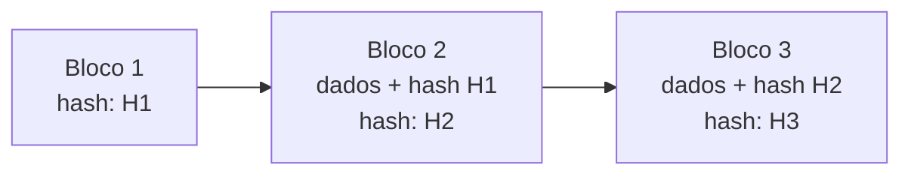

# Blockchain

> [!info] Metadados
> **Disciplina:** Arquitetura Avançada, Segurança e Inovação
> **Bloco:** 5.3 — Arquitetura Avançada, Segurança e Inovação (FASE 5 — Frontend e Interfaces)
> **Tópico:** 2. Blockchain
> **Subtópicos:** Conceito (ledger distribuído, mineração, consenso) · Criptomoedas (Bitcoin, Ethereum) · Smart contracts · Aplicações além das criptomoedas
> **Pré-requisitos:** [[Transacoes-e-ACID]] (atomicidade/consistência de dados), [[Padroes-de-Projeto-e-Arquitetura]] (integração e distribuição entre sistemas), [[LGPD-Lei-Geral-de-Protecao-de-Dados]] (identidade e dados pessoais)
> **Cargo:** Analista de TI — Perfil 3: Desenvolvimento de Software
> **Data:** 2026-08-31

## 1. Por que estudar blockchain?

Nas notas anteriores você aprendeu como **dois** sistemas conversam com segurança. Agora vamos elevar o nível: e se **muitos** participantes, que **não confiam uns nos outros**, precisarem compartilhar o **mesmo registro de verdade** sem depender de um único servidor central que comanda tudo?

A resposta desse problema — chamado de **problema do consenso distribuído** — é a **blockchain**. No contexto DATAPREV e do governo, isso interessa diretamente: registros públicos (cartórios, receita), rastreabilidade e identidade digital são candidatos naturais a essa tecnologia, porque o setor público lida o tempo todo com **transparência, imutabilidade e auditoria**.

> [!question]
> Um registro público precisa ser confiável. Mas confiar em **quem**? Se muitos órgãos compartilham dados, um único servidor central seria "dono" da verdade — e se ele falhar ou for corrompido? Como fazer todos os participantes chegarem a um mesmo estado sem um chefe único?

> [!warning] PEGADINHA — blockchain ≠ criptomoeda
> A **blockchain é a tecnologia**; a **criptomoeda é uma aplicação** dessa tecnologia (a mais famosa, mas não a única). Quando a FGV pergunta sobre "blockchain", não está necessariamente falando de Bitcoins. Não confunda o **registro distribuído** com o **ativo financeiro** que corre sobre ele.

## 2. Conceito — o ledger distribuído

A blockchain é um **ledger distribuído** (*distributed ledger*): um **registro compartilhado** de transações que é **duplicado e sincronizado** entre vários participantes, sem depender de uma autoridade central.

> [!note] Observação da ementa
> A ementa recomenda tratar blockchain de forma **conceitual**, sem aprofundar implementação (não detalhar criptografia de bloco, nem a matemática da prova de trabalho). O alvo da prova é entender o **papel** de cada peça, não recriar o algoritmo.

### 2.1 Bloco + hash + encadeamento

O nome "blockchain" (cadeia de blocos) é literal:

- Cada **bloco** contém um **conjunto de transações**;
- Cada bloco possui um **hash** (uma impressão digital) de seu conteúdo;
- Cada bloco **referencia o hash do bloco anterior**, formando uma **cadeia**.

Por que o encadeamento por hash importa? Porque, se alguém **alterar** um bloco antigo, o hash daquele bloco muda — e não vai mais **bater** com o hash que o bloco seguinte guardava. A adulteração **quebra a cadeia** e fica visível para todos. É isso que fundamenta a **imutabilidade**.

> [!warning] PEGADINHA — imutabilidade vs. edição
> "Imutável" não significa "impossível de editar tecnicamente". Significa que **alterar um registro já validado é altíssimo custo e detectável**: exige refazer a prova de trabalho de um bloco e, para células grandes, de todos os seguintes (remineração), o que torna a alteração impraticável em redes saudáveis. Além disso, a alteração rompe a cadeia de confiança visível aos participantes. A banca gosta de textos do tipo "a blockchain é imutável, logo ninguém pode tecnicamente modificar um bloco" — **falso**; a imutabilidade é uma **garantia prática e econômica**, não uma impossibilidade física.

### 2.2 Mineração — como os blocos entram na cadeia

Quando novas transações são propostas, elas precisam ser **validadas e agrupadas** em um bloco antes de entrarem na cadeia. Esse processo de validação é chamado de **mineração**.

Na **prova de trabalho** (*Proof of Work*, PoW), usada pelo Bitcoin, mineradores **competem** para resolver um **desafio computacional difícil de calcular mas fácil de verificar** (essencialmente, encontrar um valor que faça o hash do bloco começar com um número de zeros). Quem resolve **primeiro** propõe o bloco; os demais participantes **verificam** a solução (fácil) e concordam em adotá-lo. Como recompensa, o minerador recebe criptomoeda nova e taxas.

> [!note] PoW não é o único consenso
> Há outros algoritmos de consenso. A **prova de participação** (*Proof of Stake*, PoS) troca o gasto de **energia/computação** pela **quantidade de ativos "apostados"** (*staked*): quem tem mais participação tem mais chance de validar o bloco (e risco de perder a aposta se validar algo inválido). O **Ethereum** migrou de PoW para PoS.

### 2.3 Consenso vs. mineração

Este é um dos pontos mais importantes — e um dos mais confundidos:

> [!warning] PEGADINHA — consenso ≠ mineração
> A **mineração é apenas um dos mecanismos** usados para alcançar **consenso**. **Consenso** é o objetivo mais amplo: fazer todos os participantes **concordarem com o mesmo estado** (mesmos blocos, mesma ordem) mesmo sem confiança mútua. PoW é um **exemplo** de mecanismo de consenso; PoS é **outro**. A banca pode afirmar que "consenso e mineração são a mesma coisa" — **falso**. Mineração (PoW) é um mecanismo; consenso é o conceito-umbrella.

### 2.4 Descentralização

Na blockchain não há um servidor central "dono" do registro. A **cópia do ledger** roda em **vários nós** (computadores) ao mesmo tempo. Isso traz:

- **Resiliência/resistência a censura** — não há um ponto único de falha;
- **Transparência** — o histórico é visível e auditável;
- **Imutabilidade** — alterar exige dominar a maioria do poder de validação (o famoso "ataque de 51%").

## 3. Criptomoedas (conceito)

As **criptomoedas** são moedas digitais que usam blockchain para registrar **transações** sem um banco central. As duas mais importantes para a prova:

| | Bitcoin | Ethereum |
|---|---|---|
| Papel | **Primeira** criptomoeda (2009) | Plataforma de **contratos inteligentes** |
| Consenso | **PoW** (prova de trabalho) | PoW → migrou para **PoS** |
| Principal inovação | Dinheiro digital descentralizado | Execução de **código** na blockchain (smart contracts) |
| Moeda nativa | BTC | ETH (ether) |

### 3.1 Transações e carteiras

Uma **transação** na blockchain transfere valor de uma "conta" (endereço) para outra e precisa ser validada e incluída em um bloco. O controle dos fundos é feito por **carteiras** (*wallets*), que guardam **chaves privadas** — quem tem a chave privada tem o poder de **assinar** transações em nome do endereço.

> [!important] Chave privada = poder de assinar
> Na criptomoeda, a **chave privada** é o segredo que autoriza gastar/transferir. Quem a possui controla os ativos daquele endereço. Perdeu a chave → perdeu o acesso (não existe "recuperar senha" em um central). Esse conceito conecta com o que você já viu sobre chave pública/privada em [[Seguranca-de-Comunicacoes]].

## 4. Smart contracts

Um **contrato inteligente** (*smart contract*) é um **programa que roda na blockchain** e se **executa automaticamente** quando condições predefinidas são satisfeitas, sem a necessidade de um intermediário.

Um exemplo: um contrato que, ao receber o pagamento, **automaticamente** libera um arquivo digital. As regras estão **no código**, e o código roda na rede descentralizada — então ninguém pode simplesmente "mudar as regras" no meio do caminho ou fingir que não recebeu.

> [!note] Smart contract não é um "documento jurídico"
> Para a prova, guarde a ideia: smart contract é **código autoexecutável registrado e executado na blockchain** (forte em Ethereum), que automatiza acordos sem intermediário. Não é um contrato em papel nem uma "IA". É **programa** — determinístico e imutável após a publicação.

## 5. Aplicações além das criptomoedas

Aqui está o coração do interesse para o **setor público**. A blockchain é uma tecnologia de **registro confiável**, e isso serve a muito mais que dinheiro digital:

- **Supply chain (cadeia de suprimentos)**: rastrear a **origem e o percurso** de um produto (ex.: medicamento do fabricante à farmácia), garantindo procedência e evitando fraudes.
- **Identidade digital**: registros de identidade **descentralizados** e verificáveis, dando ao cidadão controle sobre seus dados.
- **Rastreabilidade e registros públicos**: cartórios, registros de imóveis, certidões — um histórico **imutável e auditável** de atos.
- **Votação**: registro de votos com rastreabilidade e auditoria transparente.

> [!tip] Blockchain no contexto governo/DATAPREV
> O `Meu INSS`, a Receita e os cartórios lidam com registros que precisam ser **integridade-preservados e auditáveis**. Quando a FGV contextualiza, o interesse é esse: blockchain como infraestrutura de **confiança e rastreabilidade** para registros públicos — e não "minerar bitcoin com servidores do governo". Sempre que ler "blockchain no governo", pense em **imutabilidade + transparência + auditoria de registros**, não em especulação financeira.

## 6. Palavras-chave e como a FGV cobra

- **Palavras-chave:** *ledger distribuído, bloco, hash, cadeia de blocos, mineração, prova de trabalho (PoW), prova de participação (PoS), consenso, descentralização, imutabilidade, criptomoeda, Bitcoin, Ethereum, carteira, chave privada, smart contract, supply chain, identidade digital, rastreabilidade.*

**Formas de cobrança típicas:**

1. **Blockchain ≠ Bitcoin** — blockchain é tecnologia; Bitcoin é uma aplicação.
2. **Consenso ≠ mineração** — mineração (PoW) é um mecanismo de consenso, não sinônimo.
3. **PoW vs. PoS** — energia/computação vs. participação/ativos.
4. **Imutabilidade** — garantia prática/econômica, não impossibilidade física de edição.
5. **Hash que encadeia** — por que alterar um bloco quebra a cadeia (deteção).
6. **Smart contract** — código autoexecutável na blockchain, não um contrato em papel.
7. **Aplicações além de cripto** — supply chain, identidade, cartório, votação (contexto governo).

## 7. Próximos passos

Com o conceito de blockchain dominado, você avança para o **Tópico 3 — Design de Software Avançado**, onde entraremos em **DDD** (entidades, value objects, agregados) e em **Event-Driven Architecture** (event sourcing e CQRS). Ao concluir o Bloco 5.3, você chega à **Fase 6 — Segurança e Governança**, onde a relação entre dados, identidade e confiança será retomada sob a ótica da segurança e da governança (sem antecipar esse conteúdo agora).
