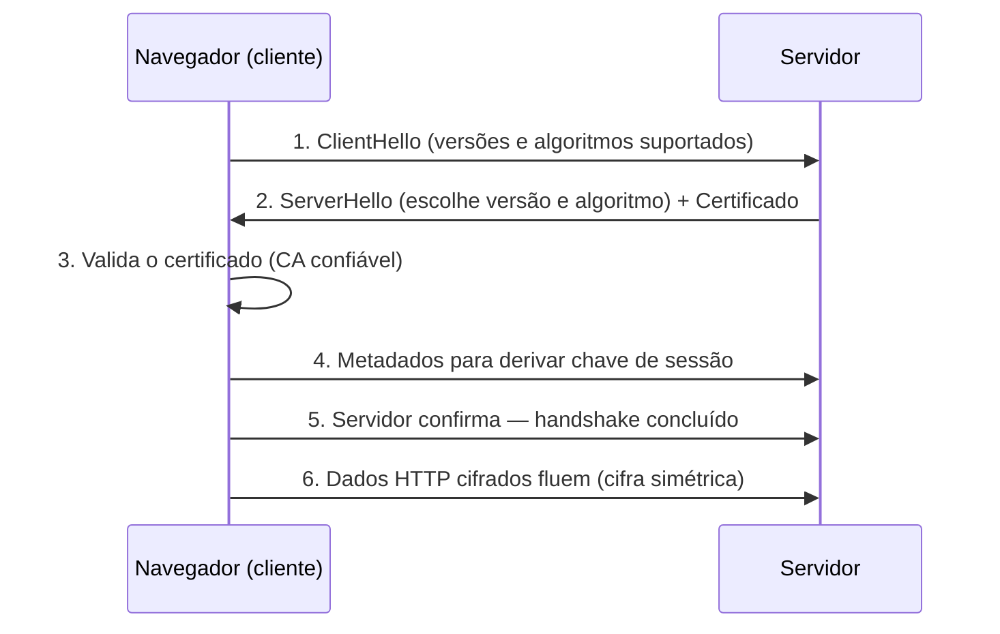
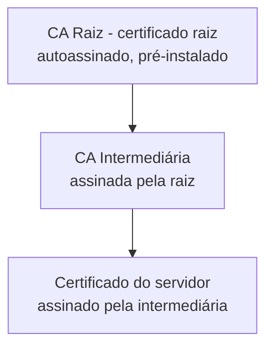

# Segurança de Comunicações

> [!info] Metadados
> **Disciplina:** Arquitetura Avançada, Segurança e Inovação
> **Bloco:** 5.3 — Arquitetura Avançada, Segurança e Inovação (FASE 5 — Frontend e Interfaces)
> **Tópico:** 1. Segurança de Comunicações
> **Subtópicos:** HTTPS (funcionamento, certificados digitais) · SSL/TLS (handshake, cifragem, integridade) · Certificados (CA, cadeia de confiança)
> **Pré-requisitos:** [[Arquiteturas-de-Apresentacao]] (HTTPS citado como pilar da PWA), [[Padroes-de-Projeto-e-Arquitetura]] (APIs RESTful, integração entre sistemas), [[LGPD-Lei-Geral-de-Protecao-de-Dados]] e [[Marco-Civil-da-Internet]] (base jurídica de proteção de dados e privacidade)
> **Cargo:** Analista de TI — Perfil 3: Desenvolvimento de Software
> **Data:** 2026-08-31

## 1. Por que estudar segurança de comunicações?

Você já percorreu toda a Fase 5: viu o frontend, as interfaces e, no Bloco 5.1, descobriu que uma PWA **exige HTTPS** para funcionar — o Service Worker só opera em contexto seguro. Aquela menção ficou como uma promessa de aprofundamento. Este é o momento de cumpri-la.

Mas a razão mais profunda vem de trás: na Fase 1 você estudou a **LGPD**, o **Marco Civil da Internet** e o embasamento legal de proteção de dados. Aquele estudo respondeu *que* a proteção é exigida — confidencialidade, privacidade, segurança dos dados. Neste tópico você responde ao **como**: *como* dois sistemas conversam pela internet sem que um terceiro leia, altere ou se passe por eles?

Pense no contexto DATAPREV: um cidadão acessa um serviço público pelo navegador e preenche dados pessoais. Esse tráfego atravessa dezenas de redes até chegar ao servidor. Se essa comunicação não estiver **protegida**, qualquer ponto intermediário pode ler o que está sendo trafegado. Entender **HTTPS**, **SSL/TLS** e **certificados** é entender o mecanismo técnico que sustenta essa proteção.

> [!warning] PEGADINHA — HTTPS não é "criptografia de dados em repouso"
> Aqui vamos falar de segurança **em trânsito** (dados viajando entre emissor e receptor). Criptografia de dados **armazenados** (em repouso) é outro assunto. Quando a FGV fala de HTTPS/TLS, a pergunta é sobre a **comunicação**, não sobre o disco. Guarde isso — é um dos erros mais comuns.

## 2. HTTPS — o HTTP sobre uma camada segura

Comecemos pelo básico que você já domina da Fase 4: o **HTTP** é o protocolo de comunicação da web. O navegador envia uma requisição (GET, POST...) e o servidor responde. A palavra "protocolo" aqui importa: HTTP define as regras desse diálogo — verbos, cabeçalhos, *status codes*, recursos.

Agora, uma pergunta orientadora:

> [!question]
> Se o HTTP já funciona e transporta o conteúdo, por que precisamos de algo a mais? O que falta exatamente no HTTP "puro"?

O HTTP **nativo** trafega os dados **em texto claro** (*plaintext*). Qualquer roteador, provedor ou atacante no caminho pode **ler** o conteúdo (falta de confidencialidade), **alterá-lo** no meio do caminho (falta de integridade) e até **se passar pelo servidor** (falta de autenticação). Para aplicações que trafegam dados pessoais, isso é inaceitável.

A solução é o **HTTPS** — que não é um protocolo novo, e sim o **HTTP rodando sobre o TLS**. O "S" vem de *Secure*: significa que, antes de o HTTP começar a falar, uma **camada de segurança** (o TLS) já estabeleceu as bases.

### 2.1 HTTPS vs. HTTP

| Característica | HTTP | HTTPS |
|---|---|---|
| Protocolo base | HTTP sobre TCP | HTTP sobre **TLS** sobre TCP |
| Porta padrão | 80 | **443** |
| Conteúdo | texto claro | **cifrado** |
| Autenticação do servidor | não | sim (via **certificado**) |
| Integridade | não garantida | garantida (via MAC) |
| Uso indicado | dados não sensíveis | dados pessoais, autenticação, pagamentos |

Repare na **porta**. O HTTPS usa por padrão a porta **443**, enquanto o HTTP usa a **80**. É um detalhe simples que a banca explora: "A porta padrão do HTTPS é a 80" → **falso**; é a **443**.

> [!tip] A banca gosta de misturar "porta" com "camada"
> Uma pegadinha recorrente inverte as camadas: dizer que "HTTPS é o HTTP via SSH" ou "HTTPS é HTTP com chave simétrica fixa por padrão" são afirmações falsas. Guarde a fórmula fixa: **HTTPS = HTTP + TLS**. E a porta = **443**.

### 2.2 Como o navegador e o servidor estabelecem uma sessão segura

Para que o HTTP cifrado funcione, navegador e servidor precisam concordar antes em três coisas:

1. **Quem é o servidor** (ele precisa provar sua identidade);
2. **Que algoritmo** de cifragem será usado;
3. **Que chave** será usada para cifrar os dados — a chave chamada de **chave de sessão**.

Esse acordo é feito no **handshake TLS**, detalhado a seguir. Depois do handshake, os dados HTTP fluem cifrados dentro de um **túnel seguro**.

> [!important] O certificado como base de confiança
> No HTTPS, o navegador não "acredita" no servidor porque ele diz quem é. Ele **verifica um certificado digital** emitido por uma autoridade confiável. Sem isso, qualquer um poderia se passar pelo banco ou pelo serviço público. É essa verificação que transforma uma conexão comum em uma conexão **confiável**. O certificado é, portanto, a **âncora da confiança** no HTTPS.

## 3. SSL/TLS — o mecanismo por trás do cadeado

O **TLS** (*Transport Layer Security*) é o protocolo que fornece a segurança. Você verá também a sigla **SSL** (*Secure Sockets Layer*) — e aqui mora uma das maiores pegadinhas do assunto.

### 3.1 SSL → TLS: evolução (não são a mesma versão)

> [!warning] PEGADINHA — SSL e TLS
> **SSL é antigo e descontinuado; TLS é o sucessor atual.** O SSL 2.0 e 3.0 têm vulnerabilidades graves (como o famoso ataque POODLE) e foram abandonados. Hoje usamos **TLS** (nas versões 1.2 e 1.3). Ninguém deveria dizer que "o protocolo usa SSL atualmente" no sentido técnico estrito — o correto é **TLS**. A FGV cobra exatamente isso: afirmar que "o SSL é a versão mais recente e segura do TLS" é **falso** — é o contrário. O TLS é o **sucessor** do SSL. O termo "SSL" sobreviveu no vocabulário cotidiano (por tradição), mas tecnicamente adotamos TLS.

### 3.2 O handshake TLS — o aperto de mãos inicial

O handshake é o processo de **negociação** inicial. Vamos seguir os passos principais de forma simplificada (o essencial para a prova):

Passo a passo:

1. **ClientHello**: o navegador envia uma mensagem informando quais **versões de TLS** e quais **algoritmos de cifragem** (chamados de *cipher suites*) ele suporta.

2. **ServerHello + Certificado**: o servidor escolhe a versão e o algoritmo a usar, responde, e envia seu **certificado digital** (para provar quem é) e, se necessário em fluxos mais avançados, pede que o cliente também se autentique.

3. **Validação do certificado**: o navegador verifica se o certificado foi emitido por uma **CA confiável** e se ainda é **válido** (não expirou, não foi revogado, cobre o domínio). Mais adiante veremos essa cadeia de confiança.

4. **Derivação da chave de sessão**: cliente e servidor, usando a criptografia de chave pública (assimétrica) — e em TLS 1.3 usando a troca de chaves Diffie-Hellman Ephemeral — geram a **mesma chave de sessão** sem que ela jamais precise ser trafegada em claro.

5. **Confirmação**: o handshake termina e ambos passam a cifrar com a chave de sessão acordada.

6. **Dados cifrados**: o HTTP agora flui dentro do túnel protegido.

### 3.3 Cifragem: simétrica para os dados, assimétrica para a negociação

Esta é a distinção central do TLS — e a banca adora testá-la. Perceba que **dois tipos de criptografia** trabalham juntos, cada um com um papel:

- **Criptografia simétrica**: usa **uma única chave** (a **chave de sessão**) tanto para cifrar quanto para decifrar. É **rápida** e ideal para grandes volumes de dados — por isso protege os **dados em trânsito** (a fase 6 do handshake).

- **Criptografia assimétrica** (ou de **chave pública**): usa **um par de chaves** — uma pública (que se divulga) e uma privada (secreta). É **lenta**, mas resolve o problema de **distribuir a chave de sessão** com segurança — por isso é usada na **negociação** inicial.

> [!question]
> Se a cifragem simétrica é rápida mas exige que as duas partes tenham a **mesma chave**, como transmitir essa chave com segurança sem que um intruso a capture no meio do caminho? Lembra que transmiti-la em claro seria fatal?

Exatamente: é aí que entra a **assimétrica**. A chave de sessão é **negociada/derivada** por meio da criptografia de chave pública, e nunca viaja "em claro" pela rede. Depois do acordo, os dados de verdade (grandes volumes) usam a **simétrica**, que é rápida.

> [!warning] PEGADINHA — simétrica vs. assimétrica no TLS
> A FGV pode afirmar que "no TLS os dados de aplicação são cifrados com criptografia assimétrica" — **falso**. Os **dados em trânsito** usam **cifra simétrica** (rápida). A **assimétrica** entra na **negociação da chave de sessão**. Não confunda o papel de cada uma.

### 3.4 Integridade — garantindo que nada foi alterado

Cifrar impede a **leitura**; mas e se um atacante **alterar** os dados cifrados? Para isso existe a **integridade**. O TLS adiciona a cada mensagem um **MAC** (*Message Authentication Code*) — um tipo de hash calculado com a chave de sessão. Ao receber, o receptor recalcula o MAC; se bater, o dado não foi adulterado; se não bater, a mensagem é descartada.

Assim, o TLS entrega três garantias que conectam diretamente com o que você estudou na LGPD e na segurança (tríade CID — que será aprofundada na Fase 6):

- **Confidencialidade** — via cifragem (simétrica);
- **Integridade** — via MAC/hash;
- **Autenticidade** (da origem, e principalmente do servidor) — via certificado.

### 3.5 Sigilo de encaminhamento perfeito (conceito, opcional)

> [!note] Sigilo de encaminhamento perfeito (PFS)
> Trata-se de um **conceito**: a garantia de que, mesmo que a chave privada do servidor seja comprometida **no futuro**, as sessões **passadas** continuam seguras — porque a chave de sessão de cada sessão é **efêmera** (gerada de forma independente, via troca de chaves como Diffie-Hellman Ephemeral) e não pode ser recalculada a partir da chave privada. Não aprofunde a matemática; para a prova, guarde a ideia: *cada sessão tem uma chave própria de curta duração para que comprometer uma não comprometa as anteriores*.

## 4. Certificados digitais — a âncora da confiança

Um certificado digital é, essencialmente, um **documento eletrônico** que **associa uma chave pública a uma identidade** (por exemplo, um domínio ou uma organização) e é **assinado por uma autoridade confiável**. Ele é o que permite ao navegador confiar que está falando com o servidor certo.

### 4.1 CA e a cadeia de confiança

Quem "assina" os certificados é a **CA** — **Autoridade Certificadora** (*Certificate Authority*). Uma CA é uma entidade **confiável** que emite certificados. Os navegadores já vêm com uma lista de **CAs raiz confiáveis** embutida.

A confiança não é direta: forma-se uma **cadeia de confiança** (ou *chain of trust*):

- A **CA raiz** é o topo; seu certificado é **autoassinado** e vem instalado no navegador/sistema.
- A **CA intermediária** é assinada pela raiz e assina os certificados dos servidores (prática comum para isolar a raiz).
- O **servidor** apresenta seu certificado, assinado pela intermediária.

O navegador **percorre a cadeia de volta**: confia na raiz → confia na intermediária (por causa da assinatura da raiz) → confia no servidor (por causa da assinatura da intermediária). Se algum elo falhar (assinatura inválida, expirado, revogado), o navegador **não confia** e mostra o aviso de segurança.

> [!important] Chave privada vs. pública no certificado
> O certificado contém a **chave pública** do servidor (para cifrar/verificar) e a **assinatura** da CA (feita com a **chave privada** da CA). A **chave privada** do próprio servidor nunca sai dele — é secreta. Essa distinção pública/privada é um alvo clássico de questão.

### 4.2 Validação e tipos de certificados

Ao validar um certificado, o navegador verifica:

1. A **assinatura** da CA na cadeia de confiança;
2. A **validade temporal** — o certificado tem um período de validade (expiração);
3. A **cobertura do domínio** — o certificado deve ser emitido para o domínio acessado (ex.: `dataprev.gov.br`);
4. Se **não foi revogado**.

Há diferentes **tipos** de certificados da web, conforme o nível de validação:

| Tipo | Validação | Indicação | Nível de confiança |
|---|---|---|---|
| **DV** (Domain Validation) | Apenas prova que o requerente **controla o domínio** | sites comuns | baixo |
| **OV** (Organization Validation) | Além do domínio, valida a **organização** | empresas | médio |
| **EV** (Extended Validation) | Validação **rigorosa** da identidade legal da organização | bancos, pagamentos | alto |

O **DV** é o mais comum e barato; o **EV** é o que antigamente exibia o cadeado com o nome da empresa na barra de endereço. Para a prova, guarde que **DV = domínio** e **EV = validação estendida (mais rigorosa)**.

### 4.3 Expiração e revogação (conceito, opcional)

Todo certificado tem uma **data de expiração**. Um certificado vencido é **inválido**.

Mas às vezes é preciso invalidar um certificado **antes** do vencimento (ex.: chave privada comprometida). Para isso existem mecanismos de **revogação**:

- **CRL** (*Certificate Revocation List*): uma **lista de certificados revogados** publicada pela CA;
- **OCSP** (*Online Certificate Status Protocol*): uma **consulta online** ao status de um certificado específico.

> [!note] Profundidade opcional
> A ementa trata CRL/OCSP como **conceito opcional**. Basta saber que são mecanismos para declarar um certificado **inválido antes do vencimento** — CRL = lista; OCSP = verificação online. Não é preciso detalhar implementação.

## 5. Ponte com os pré-requisitos

Este tópico **cumpre a promessa** feita em [[Arquiteturas-de-Apresentacao]], onde o **HTTPS** apareceu apenas como um dos **pilares da PWA** (o Service Worker exige contexto seguro). Agora você entende *por que* o HTTPS era obrigatório: sem TLS + certificado, o Service Worker operaria em contexto não confiável, vulnerável a interceptação.

Também conecta com a **Fase 1**: a **LGPD** e o **Marco Civil** exigem proteção de dados pessoais (finalidade, segurança, prevenção). O HTTPS/TLS é um dos **mecanismos técnicos** que materializam essa exigência na prática — cifrando o tráfego que transporta esses dados.

> [!warning] Pegadinha final — não avance para o que é da Fase 6
> Este tópico é **específico do Bloco 5.3** e trata apenas de **segurança de comunicações** (HTTPS, TLS, certificados). **Autenticação de usuário (OAuth2, JWT, SSO), OWASP, gestão de riscos, ISO 27001 e a tríade CID** são assuntos da **Fase 6 — Segurança e Governança**. Quando você chegar lá, retomará esta base técnica e a ampliará. Por ora, domine o mecanismo de comunicação segura.

## 6. Palavras-chave e como a FGV cobra

- **Palavras-chave:** *HTTPS, porta 443, TLS, SSL, handshake, ClientHello/ServerHello, chave de sessão, cifra simétrica, criptografia assimétrica, integridade, MAC, certificado digital, CA, cadeia de confiança, raiz, intermediária, validação, DV, EV, expiração, revogação (CRL/OCSP), sigilo de encaminhamento perfeito.*

**Formas de cobrança típicas:**

1. **SSL vs. TLS** — qual é o protocolo atual/sucessor (pegadinha de "versão mais recente").
2. **Simétrica vs. assimétrica no TLS** — qual cifra os dados (simétrica) vs. qual negocia a chave (assimétrica).
3. **Porta** — HTTPS = 443 (não 80).
4. **HTTPS ≠ HTTP** — HTTPS é HTTP **sobre TLS**, com confidencialidade, integridade e autenticação do servidor.
5. **HTTPS ≠ criptografia de dados em repouso** — é segurança **em trânsito**.
6. **Cadeia de confiança** — raiz → intermediária → servidor; validação percorre de volta.
7. **DV vs. EV** — nível de validação (controle de domínio vs. identidade da organização).

## 7. Próximos passos

Com a comunicação segura dominada, você segue para o Tópico 2 deste mesmo bloco, a **Blockchain**. Ao concluir o Bloco 5.3, você encerra a Fase 5 e avança para a **Fase 6 — Segurança e Governança**, onde a base técnica aqui construída (comunicação segura, certificados) será retomada e ampliada com autenticação (OAuth2/JWT/SSO), OWASP Top 10 e normas como a ISO 27001 — sem antecipar esse conteúdo agora.
