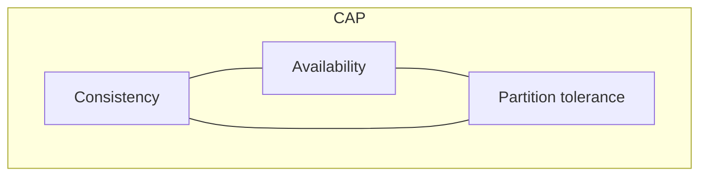
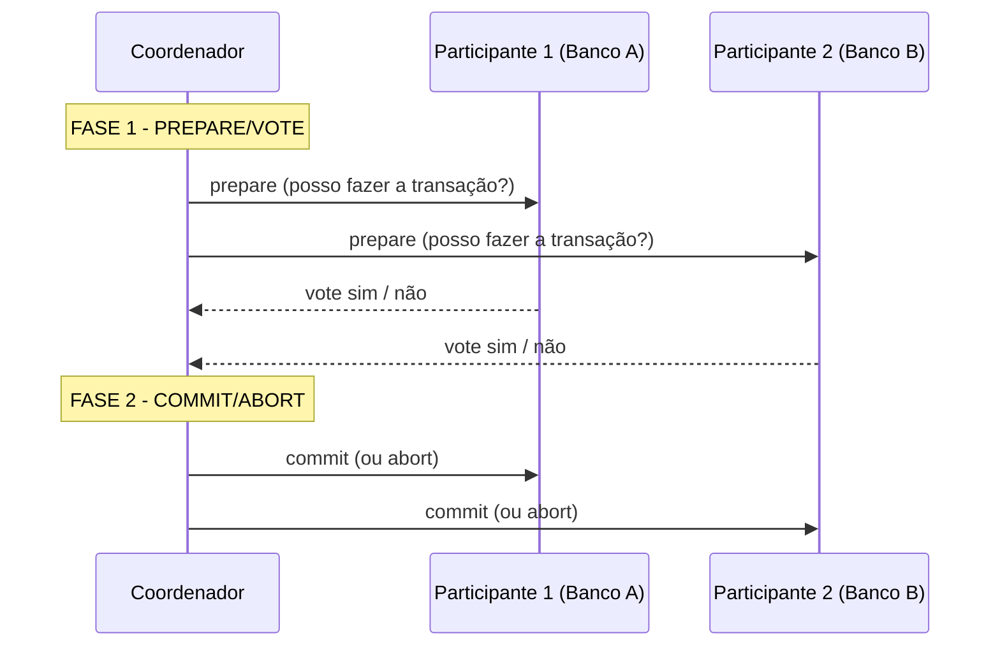

# Transações Distribuídas

> [!info] Metadados
> **Disciplina:** Arquitetura Avançada, Segurança e Inovação
> **Bloco:** 5.3 — Arquitetura Avançada, Segurança e Inovação (FASE 5 — Frontend e Interfaces)
> **Tópico:** 5. Transações Distribuídas
> **Subtópicos:** CAP Theorem · Two-Phase Commit (2PC) · Saga Pattern · Eventual consistency em microsserviços
> **Pré-requisitos:** [[Transacoes-e-ACID]] (propriedades ACID e níveis de isolamento), [[Arquitetura-de-Software-Avancada]] (microsserviços, database per service), [[NoSQL]] (eventual consistency)
> **Cargo:** Analista de TI — Perfil 3: Desenvolvimento de Software
> **Data:** 2026-08-31

## 1. Por que estudar transações distribuídas?

No Banco de Dados (Bloco 3.1) você aprendeu o **ACID**: **Atomicidade**, **Consistência**, **Isolamento**, **Durabilidade** — as garantias de uma transação dentro de **um único banco**. Ali a ementa deixou uma **promessa explícita**: fazer a ponte entre **ACID** e **transações distribuídas** quando chegássemos à arquitetura avançada. Este é o momento dessa ponte.

Por que a ponte importa? No Tópico 4 você viu que microsserviços seguem o princípio do **"cada um com seu próprio banco de dados"** (*database per service*). Ora, se cada serviço tem **seu próprio banco**, então uma operação de negócio que atravessa vários serviços **atravessa vários bancos**. E aí surge um problema que o ACID (de um único banco) **não cobre**:

> [!question]
> Um benefício precisa ser concedido: há débito num banco, crédito em outro, registro num terceiro. Num único banco, o `COMMIT`/`ROLLBACK` garante atomicidade. Mas como garantir **atomicidade** quando a transação se espalha por **vários bancos independentes**? O comando "COMMIT" de um banco "não sabe" o que acontece no outro.

Este tópico responde: **CAP**, **2PC**, **Saga** e **eventual consistency**.

## 2. CAP Theorem — o teorema da partição

O **Teorema CAP** (C = *Consistency*, A = *Availability*, P = *Partition tolerance*) é a base para entender os limites de um **sistema distribuído**.

### 2.1 As três propriedades

- **Consistency (C)**: toda **leitura** retorna a **escrita mais recente** (todos os nós veem o mesmo estado a qualquer momento);
- **Availability (A)**: toda requisição recebe **uma resposta** (mesmo que o dado não seja o mais recente); o sistema **continua respondendo**;
- **Partition tolerance (P)**: o sistema **continua operando** mesmo quando há **falha/partição de rede** (nós ficam sem se comunicar).

### 2.2 A leitura correta do teorema

Sob **partição de rede**, é **impossível** garantir **simultaneamente** os três — o sistema precisa **escolher dois**. A leitura precisa é: **em caso de partição (P), você opta entre C ou A**.

| Escolha | Prioriza | O que acontece sob partição |
|---|---|---|
| **CA** | Consistência + Disponibilidade | Sistemas **sem partição** de rede (na prática, raro em distribuídos);
| **CP** | Consistência + Tolerância a partição | Prefere **não responder** (indisponível) a dar dado desatualizado;
| **AP** | Disponibilidade + Tolerância a partição | Prefere **responder** com dado possivelmente desatualizado; corrige depois.

> [!warning] PEGADINHA — CAP não é "escolha 2 de 3 sempre"
> O teorema CAP **não** diz que você "escolhe sempre 2 de 3" em qualquer situação. A impossibilidade de ter os três ocorre **apenas sob partição de rede**. Em um sistema **sem partição**, é possível ter C e A juntos. A afirmação correta: **quando há partição (P), é preciso escolher entre C e A**. A banca adora a versão simplista errada — "o sistema sempre escolhe 2 de 3" → **incompleta/falsa**. Lembre: a escolha é **condicionada à partição**: *CP* ou *AP* são os cenários realistas em sistemas distribuídos.

> [!note] Conexão prática
> No mundo real, bancos distribuídos frequentemente escolhem **CP** (priorizam consistência, aceitando indisponibilidade durante partição) ou **AP** (priorizam disponibilidade, aceitando consistência eventual). Entender essa escolha depende do **requisito do negócio** — e esse raciocínio é o que a FGV busca.

## 3. Two-Phase Commit (2PC)

O **2PC** é um **protocolo clássico** para tentar garantir **atomicidade** distribuída — ou seja, "tudo ou nada" **entre vários participantes**, estendendo a ideia de atomicidade do ACID a um cenário multi-banco.

### 3.1 Coordenador e participantes

O 2PC envolve um **coordenador** e vários **participantes** (os bancos/serviços envolvidos). O processo tem **duas fases**:

**Fase 1 — Prepare/Vote:** o **coordenador** pergunta a **cada participante** se ele está **pronto** para commit (se consegue garantir o sucesso e reter o estado). Cada participante responde **"vote sim"** ou **"vote não"**.

**Fase 2 — Commit/Abort:** se **todos** votaram *sim*, o coordenador ordena `COMMIT` para todos. Se **qualquer um** votou *não*, o coordenador ordena `ABORT` para todos.

### 3.2 O problema do bloqueio

O 2PC **garante afinidade** (ou todos committam, ou todos abortam) — mas ao custo de **bloqueio**: durante a Fase 1, os participantes precisam **segurar recursos** (locks, estados intermediários) esperando a decisão do coordenador. Se o **coordenador falhar nesse intervalo**, os participantes ficam **bloqueados esperando** uma decisão que nunca vem.

> [!warning] PEGADINHA — 2PC vs. Saga (o trade-off central)
> O **2PC garante atomicidade forte, mas bloqueia** (segura recursos e sofre se o coordenador cair) — escala mal e reduz disponibilidade. A **Saga** (a seguir) **abandona a atomicidade forte** em troca de **disponibilidade**, usando compensações. A banca explora exatamente esse **trade-off**: 2PC = consistência forte + bloqueio; Saga = disponibilidade + consistência relaxada (eventual). Não confunda as duas: **2PC bloqueia; Saga compensa**.

> [!example] Analogia
> O 2PC é como um **leilão de grupo**: o organizador (coordenador) pergunta a todos "vocês garantem?" (fase 1) e, se todos garantirem, manda "fechado" (fase 2). Mas enquanto ninguém respondeu, **os itens ficam reservados (bloqueados)**, e se o organizador sumir, ninguém sabe o que fazer.

## 4. Saga Pattern

A **Saga** é um padrão para **transações distribuídas de longa duração** que **não usa atomicidade forte** — em vez de uma transação única, ela é decomposta em uma **sequência de transações locais**, cada uma em um serviço, **encadeadas por eventos**.

### 4.1 Orquestração vs. coreografia

Há duas formas de coordenar uma saga:

- **Orquestração**: um **orquestrador central** (um serviço que "comanda") define a ordem das transações e decide cada próximo passo;
- **Coreografia**: **não há coordenador central** — cada serviço, ao terminar sua parte, **emite um evento** que dispara o próximo serviço (você já viu a base disso em **domain events** no DDD e em **mensageria/pub-sub**).

### 4.2 Compensações — o trabalho reverso

Como não há "rollback" global, quando um passo **falha**, executa-se uma **compensação** (transação de desfazimento) dos passos já concluídos.

> [!example]
> Uma viagem que exige **reservar voo** + **reservar hotel** + **cobrar cartão**. Orquestrador que comanda: reserva voo, reserva hotel, cobra. Se **reservar hotel** falhar, dispara a **compensação** "cancelar o voo" (reversível) e aborta — sem nunca chegar à cobrança. Cada passo tem **sua própria transação local** (que pode respeitar ACID localmente), e o conjunto é coerente via **compensação**, não via commit/abort global.

> [!warning] PEGADINHA — Saga vs. 2PC: consistência forte vs. disponibilidade
> A **Saga compromete a consistência forte** (o estado pode transitar por estágios intermediários inconsistentes) **em troca de disponibilidade e escalabilidade** (nenhum recurso fica bloqueado; cada passo é uma transação local). Enquanto o **2PC** preserva atomicidade forte mas **bloqueia**. Não existe "solução perfeita": a escolha depende do requisito de negócio. A banca testa: "Saga garante atomicidade forte como o 2PC" → **falso**.

## 5. Eventual consistency

### 5.1 O que é

Se você não tem atomicidade forte (Saga) nem commit global (2PC), o sistema fica, por um tempo, com **nós em estados diferentes**, que vão **convergindo** até um estado consistente. Isso é a **consistência eventual** (*eventual consistency*): **eventualmente**, após as propagações terminarem, todos os nós chegam ao **mesmo estado**.

> [!warning] PEGADINHA — eventual ≠ inconsistência permanente
> **Consistência eventual não é inconsistência permanente.** Significa que, **em algum momento futuro**, o sistema **converge** para um estado consistente — não que ele fique inconsistente para sempre. A banca pode afirmar que "consistência eventual deixa os dados permanentemente inconsistentes" → **falso**.

### 5.2 BASE vs. ACID (a pegadinha clássica)

O acrônimo **BASE** descreve a abordagem alternativa ao **ACID** em sistemas distribuídos:

- **B** — *Basically Available* (basicamente disponível): o sistema prioriza **responder**;
- **S** — *Soft state* (estado flexível): o estado pode **mudar ao longo do tempo** (não é "congelado" como no isolamento forte);
- **E** — *Eventually consistent* (consistência eventual): converge **eventualmente**.

> [!warning] PEGADINHA — BASE vs. ACID
> **BASE é o "oposto conceitual" do ACID** em sistemas distribuídos: enquanto o **ACID** prioriza **consistência forte** (atomicidade, isolamento, durabilidade — do Banco de Dados, 3.1), o **BASE** prioriza **disponibilidade** e **consistência eventual**. A confusão clássica é trocar as letras ou a filosofia de cada uma. Guarde a essência: **ACID = consistência forte; BASE = disponibilidade + consistência eventual.** Não confunda também: **Saga/BASE** dividem a mesma filosofia de **ceder consistência por disponibilidade** — mas BASE é um modelo geral, e Saga é um padrão concreto de transações.

| | ACID | BASE |
|---|---|---|
| Filosofia | **Consistência forte** | **Disponibilidade + consistência eventual** |
| Foco | Banco único, integridade imediata | Sistemas distribuídos, escalabilidade |
| Isolamento/atomicidade | Fortes | Relaxados |
| Uso típico | Transações bancárias, dados críticos | Microsserviços, sistemas de alto volume |

### 5.3 Complementa o ACID, não o nega

É importante ver a relação como **complementar**, não antagonista puro:

- O **ACID** governa a consistência **dentro de um banco/serviço** (transação local);
- O **BASE/eventual** governa a consistência **entre serviços/bancos** no nível distribuído.

Cada **transação local** dentro de uma Saga **pode e deve** respeitar ACID. É no **nível da composição** entre serviços que a **consistência eventual** entra. Essa distinção de **nível** (dentro vs. entre) é exatamente o que a ementa pede que você faça.

> [!note] Ponte com a Fase 3
> Na [[Transacoes-e-ACID]], você viu consistência forte dentro de um banco, e no [[NoSQL]], a menção de "eventual vs. strong consistency" em bancos distribuídos. Aqui essas pontas se **unem**: agora você entende **por que** sistemas distribuídos abrem mão da consistência forte — é uma consequência do **CAP** e da arquitetura de microsserviços.

## 6. Palavras-chave e como a FGV cobra

- **Palavras-chave:** *CAP, Consistency, Availability, Partition tolerance, CP, AP, 2PC, coordenador, participantes, prepare/vote, commit/abort, bloqueio, Saga, orquestração, coreografia, compensação, eventual consistency, BASE, Basically Available, Soft state, Eventually consistent, ACID.*

**Formas de cobrança típicas:**

1. **CAP** — só "2 de 3" **sob partição**; em sistemas sem partição dá para ter C+A. Não é "escolher sempre".
2. **2PC** — garante **atomicidade** mas **bloqueia** recursos; sofre se o coordenador falhar.
3. **Saga vs. 2PC** — Saga **cede consistência forte por disponibilidade**; compensa; não bloqueia.
4. **Eventual ≠ permanente** — converge eventualmente, não fica inconsistente para sempre.
5. **BASE vs. ACID** — ACID = consistência forte; BASE = disponibilidade + consistência eventual. Pegadinha de trocar letras/filosofia.
6. **Orquestração vs. coreografia** — coordenador central vs. eventos encadeados sem chefe.
7. **Ponte com ACID** — ACID dentro do banco; BASE/eventual entre serviços; níveis diferentes.

## 7. Próximos passos

Com as transações distribuídas dominadas — **CAP**, **2PC**, **Saga** e **eventual consistency (BASE)** — você fechou a **ponte com o ACID** prometida no [[Transacoes-e-ACID]]: entende agora como garantir coerência tanto **dentro** de um banco (ACID) quanto **entre** serviços distribuídos (CAP/Saga/BASE). Isso encerra o **Bloco 5.3** e, com ele, **toda a Fase 5**.

A próxima frente é a **Fase 6 — Segurança e Governança**, que retomará a base técnica aqui construída (comunicação segura, microsserviços, dados) e a ampliará com autenticação (OAuth2/JWT/SSO), OWASP Top 10 e normas como ISO 27001 — **sem antecipar** esse conteúdo agora. Concentre-se em consolidar este bloco: revise HTTPS/TLS, blockchain, DDD, Hexagonal/microsserviços/containers e transações distribuídas, pois eles são a fundação da Fase 6.
