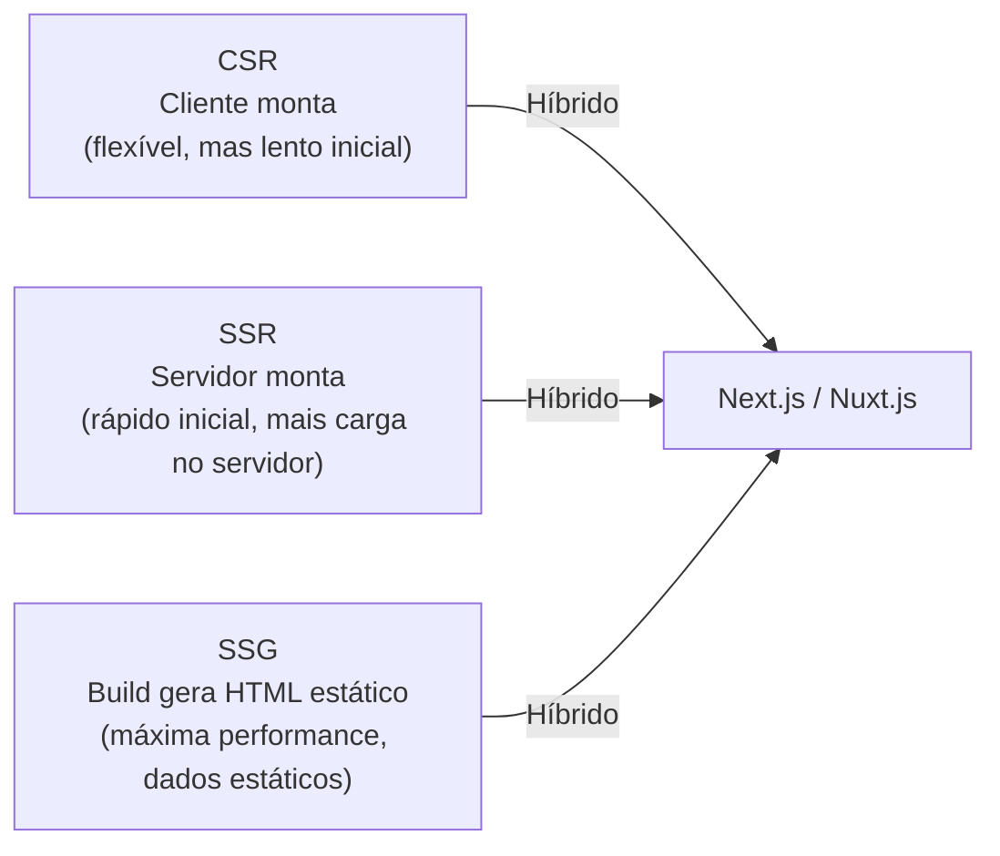

# Arquiteturas de Apresentação

> [!info] Metadados
> **Disciplina:** Tecnologias e Práticas Frontend Web
> **Bloco:** 5.1 — Tecnologias e Práticas Frontend Web (FASE 5 — Frontend e Interfaces)
> **Tópico:** 3. Arquiteturas de Apresentação
> **Subtópicos:** SPA (Single Page Application): conceito, vantagens e limitações · PWA (Progressive Web App): service workers, manifest, offline capability · SSR (Server-Side Rendering) vs. CSR (Client-Side Rendering): conceito
> **Pré-requisitos:** [[Fundamentos-Web|Fundamentos Web]] (HTML, CSS, Ajax/fetch) · [[Frameworks-Frontend|Frameworks Frontend]] (Vue, Angular, React) · [[JavaScript]] (assincronia, Promises, fetch API)
> **Cargo:** Analista de TI — Perfil 3 (Desenvolvimento de Software) · DATAPREV 2026
> **Data:** 2026-08-31

---

## 1. Por que estudar arquiteturas de apresentação?

No tópico anterior, você conheceu os **frameworks frontend** — Vue, Angular e React — e entendeu como eles organizam a interface em componentes reutilizáveis. Mas uma pergunta ficou no ar: *como uma dessas aplicações chega ao usuário?* Ela é entregue como uma página HTML estática? O servidor monta tudo? O navegador monta? E se o usuário perder a conexão com a internet — a aplicação para de funcionar?

Essas perguntas dizem respeito à **arquitetura de apresentação** — o modelo de como a aplicação frontend é **construída, entregue e executada** no navegador. Três conceitos dominam este debate:

- **SPA (Single Page Application):** a aplicação inteira roda em **uma única página HTML** que é atualizada dinamicamente;
- **PWA (Progressive Web App):** uma aplicação web que se comporta como **app nativo** — funcional offline, instalável, com notificações;
- **SSR vs. CSR:** quem **renderiza** o HTML — o **servidor** ou o **navegador**?

Para a DATAPREV, esses conceitos são relevantes porque o **Meu INSS** e outros portais públicos precisam funcionar para milhões de usuários, em conexões variadas (desde 4G até Wi-Fi lento), em dispositivos diversos (desktop, celular antigo, tablet). A escolha da arquitetura de apresentação impacta **performance, SEO, acessibilidade e experiência do usuário** — todos critérios críticos em sistemas governamentais.

> [!question] Pergunta orientadora
> Imagine que você acessa o Meu INSS pelo celular, no ônibus, e a conexão cai por 30 segundos. Se a aplicação for uma SPA tradicional, o que acontece? E se ela for uma PWA? E se ela usar SSR — o conteúdo já estaria "pintado" na tela quando a conexão voltasse? Cada arquitetura responde de forma diferente a esse cenário, e entender **por quê** é o objetivo deste tópico.

---

## 2. SPA — Single Page Application

### 2.1 O que é uma SPA

Uma **SPA (Single Page Application)** é uma aplicação web que carrega **uma única página HTML** e, a partir daí, toda a navegação e atualização de conteúdo é feita **dinamicamente via JavaScript**, sem recarregar a página inteira.

Na prática: o navegador baixa **um único arquivo `index.html`** (junto com CSS e JavaScript), e quando o usuário navega para outra "página" (ex.: de "Consulta" para "Requerimento"), o JavaScript **substitui apenas a parte da tela que mudou** — sem pedir uma nova página ao servidor.

> [!important] O que acontece nos bastidores de uma SPA
> Quando você clica em um link dentro de uma SPA, o navegador **não envia uma nova requisição GET ao servidor para buscar um novo HTML**. Em vez disso, o JavaScript intercepta o clique, busca os dados necessários via **fetch/Ajax** (que você estudou no [[Fundamentos-Web]]), e renderiza o novo componente na tela. É por isso que a transição parece instantânea — não há carregamento de página inteira.

### 2.2 Vantagens da SPA

| Vantagem | Explicação |
|---|---|
| **Fluidez na navegação** | Transições instantâneas — sem "tela branca" entre páginas |
| **Menor uso de banda** | Após o carregamento inicial, o navegador recebe apenas **dados** (JSON), não páginas HTML inteiras |
| **Experiência nativa** | A aplicação se comporta como um app — ideal para celulares |
| **Desacoplamento frontend/backend** | O frontend consome APIs REST; o backend só fornece dados |

### 2.3 Limitações da SPA

| Limitação | Explicação |
|---|---|
| **SEO (Search Engine Optimization)** | O mecanismo de busca recebe um HTML praticamente vazio — o conteúdo é gerado por JS, e robôs de busca (nem todos) executam JavaScript |
| **Tempo de carregamento inicial** | O primeiro carregamento pode ser lento — todo o JavaScript da aplicação é baixado antes de qualquer conteúdo aparecer |
| **Dependência de JavaScript** | Se o JS falhar ou estiver desabilitado, a aplicação não funciona (não há conteúdo fallback no HTML) |
| **Memória e performance** | SPAs grandes podem consumir muita memória do navegador com o tempo |

> [!warning] PEGADINHA — SPA não significa "sem servidor"
> A banca pode afirmar: "Em uma SPA, não há comunicação com o servidor" — **falso**. A SPA carrega uma vez o HTML + JS, mas depois **comunica constantemente** com o servidor via Ajax/fetch para buscar dados (JSON). O que não acontece é o **recarregamento da página inteira** — a comunicação existe, mas é silenciosa (em segundo plano).

### 2.4 Exemplo de fluxo SPA vs. MPA


A diferença essencial: na MPA (modelo tradicional), **o servidor entrega o HTML completo** a cada navegação. Na SPA, **o JavaScript controla a navegação** e busca apenas os dados que precisa.

> [!note] SPA e os frameworks do tópico anterior
> Os frameworks que você estudou no [[Frameworks-Frontend]] — Angular, Vue e React — são todos **naturalmente orientados a SPAs**. Eles renderizam componentes no navegador e atualizam a interface via JavaScript. O Angular tem seu próprio mecanismo de roteamento (Angular Router); o Vue usa Vue Router; o React usa React Router. Todos facilitam a criação de SPAs.

---

## 3. PWA — Progressive Web App

### 3.1 O que é uma PWA

Uma **PWA (Progressive Web App)** é uma aplicação web que utiliza tecnologias específicas para se comportar como um **aplicativo nativo** — podendo funcionar **offline**, ser **instalada** na tela inicial do celular, e enviar **notificações push**. A palavra "progressiva" significa que a aplicação funciona melhor quanto mais recursos o navegador/dispositivo suporta.

> [!important] PWA ≠ App Nativo
> Uma PWA **não é um aplicativo nativo**. Ela continua sendo uma aplicação web (HTML, CSS, JavaScript) — mas com **camadas extras** que a habilitam a funcionar como nativa. Ela **não é baixada pela Google Play Store ou App Store** (embora possa ser instalada pelo navegador). A banca testa essa distinção: "PWA é um aplicativo nativo" → **falso**.

### 3.2 Os três pilares da PWA

Uma PWA se sustenta sobre três pilares tecnológicos:

**1. Service Worker**

O **Service Worker** é um script JavaScript que roda em **segundo plano**, **separado da página web**, e atua como um **proxy de rede**. Ele intercepta as requisições do navegador e pode:

- **Armazenar em cache** as respostas (arquivos CSS, JS, imagens) para uso posterior;
- **Servir conteúdo do cache** quando o usuário estiver **offline**;
- **Interceptar requisições** e decidir se busca na rede ou no cache.

```
┌───────────────┐     ┌────────────────┐     ┌───────────┐
│   Navegador   │────▶│ Service Worker │────▶│  Servidor │
│  (página web) │     │   (proxy)      │     │  (rede)   │
└───────────────┘     └────────────────┘     └───────────┘
                            │
                            ▼
                     ┌────────────┐
                     │   Cache    │
                     │ (offline)  │
                     └────────────┘
```

> [!note] Service Worker: conceito neste bloco
> O edital pede PWA como conceito — não aprofunde na API de Service Workers (regist, intercept, Cache API). Basta entender o **papel**: o Service Worker é um intermediário que habilita **cache offline** e **interceptação de requisições**. O aprofundamento em implementação não é cobrado.

**2. Web App Manifest (`manifest.json`)**

O **manifest** é um arquivo JSON que fornece **metadados** ao navegador sobre a aplicação — nome, ícone, cores, URL de início. É ele que permite a **instalação na tela inicial** (o "Adicionar à tela inicial" nos celulares).

```json
{
    "name": "Meu INSS",
    "short_name": "INSS",
    "start_url": "/",
    "display": "standalone",
    "background_color": "#ffffff",
    "theme_color": "#0056b3",
    "icons": [
        { "src": "/icon-192.png", "sizes": "192x192", "type": "image/png" },
        { "src": "/icon-512.png", "sizes": "512x512", "type": "image/png" }
    ]
}
```

O campo `"display": "standalone"` faz com que, ao ser instalada, a aplicação apareça **sem a barra de endereço do navegador** — como um app nativo.

**3. HTTPS**

A maioria dos navegadores exige que PWAs rodem sobre **HTTPS** (conexão segura) para funcionar — especialmente o Service Worker, que requer um contexto seguro para evitar ataques de interceptação.

### 3.3 Vantagens e limitações da PWA

| Vantagem | Limitação |
|---|---|
| Funciona **offline** (com conteúdo em cache) | Funcionalidade offline depende do que foi cacheado |
| **Instalável** na tela inicial | Não substitui apps nativos para todas as funcionalidades |
| **Atualização automática** (sem loja de apps) | Nem todos os navegadores suportam todos os recursos |
| Funciona em **qualquer dispositivo** com navegador moderno | Acesso limitado a hardware do dispositivo (câmera, GPS dependem de APIs) |

> [!tip] PWA no contexto governamental
> As PWAs são especialmente relevantes para governos: o **Meu INSS** poderia (e parcialmente já funciona como) uma PWA, permitindo que cidadãos em áreas com conectividade instável consultem informações básicas mesmo offline. A "progressividade" é chave: a aplicação funciona melhor conforme o dispositivo e o navegador suportam mais recursos — sem quebrar para quem tem um dispositivo antigo.

---

## 4. SSR vs. CSR — quem renderiza?

### 4.1 A questão fundamental

Quando alguém acessa uma página web, o navegador precisa exibir **HTML renderizado** (o conteúdo "pintado" na tela). A pergunta arquitetural é: **quem monta esse HTML?**

- **CSR (Client-Side Rendering):** o **navegador (cliente)** recebe um HTML vazio/mínimo e monta o conteúdo usando **JavaScript** — o JavaScript baixa, executa, e "pinta" a tela. É o modelo padrão das **SPAs**.
- **SSR (Server-Side Rendering):** o **servidor** monta o HTML **completo e pronto** e envia ao navegador — que exibe imediatamente, sem precisar executar JavaScript para ver o conteúdo.

> [!question] Pergunta orientadora
> Pense no Meu INSS: quando o cidadão digita o URL e pressiona Enter, ele quer ver o conteúdo o **mais rápido possível**. Em CSR, ele vê uma tela branca enquanto o JavaScript carrega e executa (pode levar 2-5 segundos em conexão lenta). Em SSR, ele vê o conteúdo quase imediatamente, porque o servidor já enviou o HTML pronto. Mas em SSR, cada navegação pede uma nova requisição ao servidor — como na MPA tradicional. Há um meio-termo?

### 4.2 CSR — Client-Side Rendering

```
┌──────────────┐                    ┌──────────────┐
│   Servidor   │                    │  Navegador   │
│              │   1. Envia HTML    │              │
│  HTML vazio  │ ─────────────────▶ │  (vazio)     │
│  + JS bundle │                    │              │
│              │   2. JS executa    │              │
│              │ ◀─── fetch API ──▶ │  JS monta o  │
│  API (JSON)  │   3. Dados JSON    │  conteúdo    │
└──────────────┘                    └──────────────┘
```

**Fluxo CSR:**
1. Navegador solicita a página ao servidor;
2. Servidor retorna HTML vazio + bundle de JavaScript;
3. Navegador baixa e executa o JavaScript;
4. JavaScript busca dados via Ajax/fetch e monta o conteúdo na tela.

**Quando usar CSR:** quando o SEO não é prioridade (aplicações internas, dashboards, sistemas corporativos), ou quando a experiência de navegação fluidez é mais importante que a velocidade do primeiro carregamento.

### 4.3 SSR — Server-Side Rendering

```
┌──────────────┐                    ┌──────────────┐
│   Servidor   │                    │  Navegador   │
│              │   1. Monta HTML    │              │
│  Executa     │ ─────────────────▶ │  Exibe HTML  │
│  JS no       │   com conteúdo    │  IMEDIATAMENTE│
│  servidor    │                    │              │
└──────────────┘                    └──────────────┘
```

**Fluxo SSR:**
1. Navegador solicita a página ao servidor;
2. Servidor **executa o JavaScript** (ou gera HTML estático) e monta o HTML completo;
3. Navegador recebe HTML pronto e **exibe imediatamente** (First Contentful Paint rápido);
4. Em segundo plano, o JavaScript "hidrata" a página (torna-a interativa).

**Quando usar SSR:** quando **SEO é crítico** (portais públicos que precisam ser indexados pelo Google), quando o **primeiro carregamento deve ser rápido**, ou quando a aplicação precisa funcionar sem JavaScript (fallback).

### 4.4 Híbrido: SSR + CSR na prática

Na prática, frameworks modernos oferecem **renderização híbrida** — combinando SSR e CSR:

| Framework | Solução híbrida | Conceito |
|---|---|---|
| **Next.js** (React) | SSR + CSR + SSG | Renderiza no servidor **e** no cliente conforme necessário |
| **Nuxt.js** (Vue) | SSR + CSR + SSG | Equivalente Vue ao Next.js |
| **Angular Universal** | SSR para Angular | Adiciona SSR a aplicações Angular |

O **SSG (Static Site Generation)** é um terceiro modelo: o HTML é gerado **durante o build** (compilação) e servido como arquivo estático — é o mais rápido possível, mas não atualiza dados dinâmicos em tempo real.



> [!warning] PEGADINHA — SSR ≠ MPA
> Uma armadilha comum: confundir **SSR com MPA (Multi-Page Application)**. SSR é sobre **quem renderiza** (o servidor monta o HTML); MPA é sobre **quantas páginas** a aplicação tem (vários HTMLs distintos). Uma SPA pode usar SSR — e muitos frameworks modernos fazem exatamente isso. SSR é uma **técnica de renderização**; SPA é uma **arquitetura de aplicação**. Elas se combinam.

> [!warning] PEGADINHA — CSR ≠ SPA
> Da mesma forma: CSR é o modelo de renderização (o cliente monta); SPA é a arquitetura (uma página). Uma SPA **geralmente** usa CSR — mas pode usar SSR. A banca troca: "CSR é uma arquitetura" → não, é um modelo de renderização. "SPA é uma técnica de renderização" → não, é uma arquitetura.

---

## 5. Quadro comparativo: SPA vs. PWA vs. SSR/CSR

| Conceito | O que é | Foco | Não confundir com |
|---|---|---|---|
| **SPA** | Arquitetura: uma única página, JS controla a navegação | Estrutura da aplicação | MPA (múltiplas páginas) |
| **PWA** | Tecnologia: web que funciona como app nativo (offline, instalável) | Capacidades da aplicação | App nativo |
| **CSR** | Renderização: o navegador monta o HTML via JavaScript | Quem renderiza | SSR |
| **SSR** | Renderização: o servidor monta o HTML e envia pronto | Quem renderiza | CSR |

> [!tip] Como memorizar
> - **SPA** = "uma página" → é sobre a **estrutura** (quantas páginas)
> - **PWA** = "app web" → é sobre as **capacidades** (offline, instalável)
> - **CSR/SSR** = "quem pinta" → é sobre a **renderização** (servidor vs. cliente)

---

## 6. Conexão com os blocos anteriores

Este tópico se conecta com vários conteúdos que você já domina:

- **[[Fundamentos-Web|Ajax/fetch]]:** toda SPA depende de requisições assíncronas para buscar dados do backend — é o `fetch()` que você estudou no [[Fundamentos-Web]] que torna a SPA possível.
- **[[Frameworks-Frontend|Vue, Angular, React]]:** os frameworks frontend são **naturalmente orientados a SPAs**. Cada um tem seu sistema de roteamento (Vue Router, Angular Router, React Router) que permite navegação sem recarregar a página.
- **[[JavaScript|async/await]]:** a comunicação em segundo plano das SPAs é feita com Promises e async/await — os conceitos que você dominou no Bloco 4.1.
- **[[Padroes-de-Projeto-e-Arquitetura|APIs RESTful]]:** as SPAs consomem dados de APIs REST — verbos HTTP, status codes, JSON. É exatamente o padrão que você estudou.
- **[[Testes-Automatizados|Selenium]]:** o Selenium testa a interface web final — independentemente de a aplicação ser SPA, MPA, CSR ou SSR. O Selenium interage com o **DOM renderizado**, que é o resultado final de qualquer arquitetura.

---

## 7. Como a FGV cobra este tópico

- **SPA vs. MPA:** SPA = uma página, JS controla; MPA = múltiplas páginas, servidor controla. A banca descreve um cenário e pede para classificar.
- **Vantagens/limitações da SPA:** SEO ruim (primeira carga vazio), carregamento inicial lento, fluidez de navegação, menor uso de banda após carga.
- **PWA ≠ App Nativo:** PWA é web com camadas extras (Service Worker + manifest + HTTPS); não é app de loja.
- **Service Worker:** script em segundo plano que intercepta rede e habilita offline — não confundir com "popup" ou "WebSocket".
- **CSR vs. SSR:** CSR = navegador monta; SSR = servidor monta. CSR é mais lento no primeiro carregamento; SSR é melhor para SEO e first paint.
- **SSR ≠ MPA:** SSR é técnica de renderização; MPA é arquitetura de múltiplas páginas. Podem coexistir.
- **SPA ≠ CSR:** SPA é arquitetura (uma página); CSR é renderização (cliente monta). Geralmente combinadas, mas não são a mesma coisa.

> [!warning] PEGADINHA — as três armadilhas mais rentáveis
> (1) **SPA ≠ PWA.** SPA = arquitetura de uma página; PWA = web com capacidades nativas (offline, instalável). Podem ser combinadas, mas são conceitos diferentes. (2) **CSR ≠ SPA.** CSR = quem renderiza (cliente); SPA = estrutura (uma página). Uma SPA pode usar SSR (Next.js/Nuxt.js). (3) **SSR não significa MPA.** SSR é uma técnica de renderização que pode ser aplicada a SPAs híbridas — e os frameworks modernos fazem exatamente isso.

---

## 8. Resumo e pontos-chave

> [!tip] Checklist de revisão
> - [ ] **SPA:** uma única página HTML; JS controla navegação via fetch/Ajax; vantagens = fluidez, banda; limitações = SEO, primeiro carregamento, dependência de JS
> - [ ] **SPA ≠ MPA:** SPA = uma página · MPA = múltiplas páginas (servidor retorna HTML a cada navegação)
> - [ ] **PWA:** web com capacidades nativas; três pilares: **Service Worker** (cache offline, proxy de rede), **manifest.json** (instalável, metadados), **HTTPS** (segurança)
> - [ ] **PWA ≠ app nativo:** continua sendo web — com camadas extras
> - [ ] **Service Worker:** script em segundo plano que intercepta requisições e habilita cache offline — não é popup nem WebSocket
> - [ ] **CSR:** navegador monta o HTML via JS (modelo padrão de SPAs)
> - [ ] **SSR:** servidor monta o HTML completo e envia pronto ao navegador
> - [ ] **SSR ≠ MPA:** SSR é técnica de renderização; MPA é arquitetura de múltiplas páginas
> - [ ] **SSR ≠ CSR:** um é servidor, outro é cliente quem renderiza
> - [ ] **Híbrido:** Next.js (React), Nuxt.js (Vue), Angular Universal combinam SSR + CSR
> - [ ] **First Contentful Paint:** SSR exibe conteúdo mais rápido; CSR pode ter "tela branca" inicial

> [!warning] O erro mais comum em prova
> Confundir SPA, PWA e SSR/CSR como se fossem a mesma coisa — eles são conceitos de **camadas diferentes**: SPA é **arquitetura** (quantas páginas), PWA é **tecnologia** (capacidades nativas), CSR/SSR é **renderização** (quem monta o HTML). Na questão, pergunte: *estamos falando da estrutura (SPA vs. MPA)? Das capacidades (PWA)? Ou de quem monta o conteúdo (CSR vs. SSR)?*

---

## 9. Próximos passos

Você agora domina as três arquiteturas de apresentação: **SPA** (uma página, JS controla), **PWA** (web como app nativo, com Service Workers e manifest), e a distinção entre **SSR** e **CSR** (quem renderiza o HTML). Com isso, você fecha o Bloco 5.1 — Tecnologias e Práticas Frontend Web.

O próximo bloco dentro da Fase 5 é o **Bloco 5.2 — UX e Gestão de Conteúdo**, que aprofundará os conceitos de UX que você viu brevemente aqui (heurísticas de Nielsen, usabilidade), e trará temas novos: **acessibilidade WCAG**, **pesquisa com usuários**, **CMS (Content Management System)**, e **SEO básico**. Você terá a base de fundamentos web deste bloco para compreender como esses temas se conectam com a implementação frontend.

> [!note] Conexão com a Fase 6 — Segurança
> As arquiteturas de apresentação se conectam com a **Fase 6 — Segurança e Governança** em vários pontos: HTTPS (obrigatório para PWAs) se estuda em segurança de comunicações; OWASP Top 10 vulnerabilidades como XSS e CSRF atingem diretamente SPAs; e a autenticação (OAuth2, JWT) impacta como o frontend gerencia tokens e sessões. Essas conexões serão exploradas quando você chegar à Fase 6.
