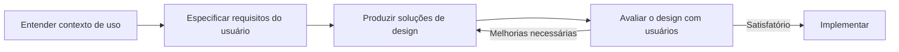

# Conceitos de UX (User Experience)

> [!info] Metadados
> **Disciplina:** UX e Gestão de Conteúdo
> **Bloco:** 5.2 — UX e Gestão de Conteúdo (FASE 5 — Frontend e Interfaces)
> **Tópico:** 1. Conceitos de UX (User Experience)
> **Subtópicos:** Design Centrado no Usuário (DCU/UCD) · Heurísticas de Nielsen · Pesquisa com usuários (entrevistas, testes de usabilidade, A/B testing) · Wireframes, protótipos, mockups · Acessibilidade (WCAG, leitores de tela, e-MAG, legislação de inclusão digital)
> **Pré-requisitos:** [[Fundamentos-Web]] (HTML5 semântico, acessibilidade básica, Heurísticas de Nielsen)
> **Conexões temáticas:** [[LGPD-Lei-Geral-de-Protecao-de-Dados|LGPD e Legislação]] (inclusão digital e proteção de dados em portais públicos) · [[Testes-Automatizados]] (testes de usabilidade como teste de aceitação da experiência)
> **Cargo:** Analista de TI — Perfil 3 (Desenvolvimento de Software) · DATAPREV 2026
> **Data:** 2026-08-31

---

## 1. Por que estudar UX neste momento?

No Bloco 5.1 você construiu as **fundações do frontend** na nota [[Fundamentos-Web]]: aprendeu HTML5 semântico, CSS3, responsividade, o `fetch` para comunicação assíncrona e, no fim, abriu uma porta sobre **UX e as Heurísticas de Nielsen**. Aquela nota tinha um propósito deliberado: apresentar as 10 heurísticas **apenas em nível de fundamento** — reconhecer o nome, a essência e o exemplo mais imediato. A nota deixou registrada uma **promessa pedagógica** de que o aprofundamento viria aqui, neste Bloco 5.2.

Esta é a hora de cumprir essa promessa. Mas antes de avançar, precisamos lembrar **por que** isso importa para a DATAPREV.

Pense no cidadão que acessa o **Meu INSS** ou um serviço do **portal gov.br** para requerer um benefício. Ele não é um usuário técnico: muitas vezes tem **baixa alfabetização digital**, usa um celular modesto, tem dificuldade visual, ou depende exclusivamente do teclado para navegar. E o Estado tem — literalmente — o **dever legal** de torná-lo atendido. Um sistema que só "funciona" para quem tem visão perfeita e familiaridade com tecnologia **exclui** milhões de brasileiros de direitos fundamentais.

> [!question] Pergunta orientadora
> Se o backend garante que os dados estejam corretos e o frontend garante que a página renderize, o que garante que **uma pessoa com deficiência visual** consiga preencher o formulário de requerimento do benefício? E o que garante que um idoso **não desista no meio** por não entender o que está na tela?

A resposta a essas duas perguntas é o objeto deste bloco: **UX (experiência do usuário)** em sua acepção mais ampla — que inclui usabilidade, pesquisa com usuários, prototipação e, sobretudo, **acessibilidade**. O Bloco 5.2 existe para você sair de "a página renderiza" e chegar em "a **pessoa** consegue usar".

Este tópico se apoia no que você já viu em [[Fundamentos-Web]] (semântica HTML, `alt`, `aria-label`, as 10 heurísticas) e também dialoga com a [[LGPD-Lei-Geral-de-Protecao-de-Dados|LGPD]], pois o tratamento de dados pessoais dos usuários em portais públicos é regulado. Se o conceito de teste com usuários te lembrar algo dos [[Testes-Automatizados]], é porque existe uma ponte real: testes de usabilidade são, no fundo, uma forma de **teste de aceitação** — não do código, mas da experiência.

---

## 2. Design Centrado no Usuário (DCU/UCD)

### 2.1 O que é e qual a questão central

O **Design Centrado no Usuário (DCU)** — em inglês **UCD, User-Centered Design** — é uma **abordagem de projeto** que coloca o **usuário real** no centro de todas as decisões de design. Não é um estilo visual, nem uma ferramenta; é uma **filosofia e um processo**.

A pergunta central do DCU é:

> "Este sistema resolve o problema **do usuário** como **ele** pensa, fala e age — ou como nós, desenvolvedores, achamos que ele se comporta?"

> [!warning] PEGADINHA — DCU não é "fazer o que o usuário pede"
> DCU **não** significa "entregar literalmente tudo o que o usuário pede", nem "o usuário é quem desenha a interface". Significa **projetar a partir das necessidades, contextos e comportamentos reais do usuário** — usando pesquisa, testes e iteração. Um pedido do usuário pode representar um sintoma ("quero um botão maior") que esconde a causa real ("tenho dificuldade de enxergar e ativar elementos pequenos"). O DCU investiga a causa antes de implementar o sintoma.

### 2.2 Os três princípios do DCU

O DCU repousa sobre três pilares que a FGV costuma pedir para identificar:

| Princípio | Essência |
|---|---|
| **Centrado no usuário** | As necessidades do usuário orientam cada decisão; o produto existe para ele, não para o time que o constrói |
| **Iterativo** | O design é refeito em ciclos contínuos de projetar → avaliar → melhorar, com o usuário participando em cada ciclo |
| **Multidisciplinar** | O time reúne perfis diversos: designers, desenvolvedores, especialistas de conteúdo, pesquisadores, pessoas com conhecimento de negócio |

> [!note] Por que "multidisciplinar"?
> Um portal como o gov.br não é desenhado só por programadores. Um **especialista em conteúdo** decide como a informação é redigida e organizada; um **designer de interação** decide os fluxos; um **especialista em acessibilidade** garante conformidade com o WCAG. O DCU obtém melhores resultados quando há essa pluralidade de olhares — porque cada olhar enxerga um risco que os outros não veem.

### 2.3 O processo do DCU

O processo clássico (derivado da norma ISO 9241-210, que define a **interação humano-computador** centrada no humano) é **circular**, não linear. Ele costuma ser descrito assim:

1. **Entender o contexto de uso** — quem são os usuários, em que ambiente (celular, tablet, escritório, em casa), com que limitações, para que tarefa?
2. **Especificar os requisitos do usuário** — transformar o contexto em requisitos concretos ("o usuário deve conseguir requerer um benefício em até X passos").
3. **Produzir soluções de design** — criar wireframes, protótipos, mockups (que veremos adiante).
4. **Avaliar o design** — testar com usuários reais, aplicar heurísticas, coletar feedback.
5. **Repetir** — voltar ao passo 3 e refinar até atingir qualidade.

> [!question] Pergunta orientadora
> Perceba a seta que **volta** da avaliação para o design. Por que o DCU insiste em ser iterativo, e não sequencial? Porque a **avaliação com usuários reais quase sempre revela lacunas** que a especificação inicial não previu — e ignorá-las é justamente o erro que o DCU procura evitar. Na DATAPREV, um protótipo testado cedo com cidadãos idosos evita retrabalho enorme após a implementação.

---

## 3. Heurísticas de Nielsen — aprofundamento

### 3.1 Cumprindo a promessa do 5.1

Em [[Fundamentos-Web]] você estudou as **10 Heurísticas de Nielsen** como um checklist conceitual. Agora vamos aprofundar de duas formas que a FGV valoriza: **(1)** entender a aplicação de cada heurística em um **contexto real de portal público**, e **(2)** entender **para que servem** — a avaliação heurística — e como ela se distingue do teste com usuários.

Antes, uma consolidação. As 10 heurísticas, formuladas por **Jakob Nielsen**, são princípios de **usabilidade** que avaliam se uma interface é fácil de usar, **sem a necessidade de envolver usuários**. Essa última parte é decisiva — vamos explorá-la na seção 3.3.

### 3.2 As 10 heurísticas aplicadas ao contexto gov.br

| # | Heurística | Essência | Aplicação num portal público |
|---|---|---|---|
| 1 | **Status do sistema** | O sistema sempre informa o que está acontecendo | Ao aguardar o resultado da consulta, o portal mostra um indicador de "carregando" e, ao terminar, confirma "consulta concluída" |
| 2 | **Linguagem do mundo real** | Usar a linguagem do usuário, não jargão técnico | Dizer "Consulta de benefícios" em vez de "GET /api/v1/beneficios" ou "agendamento" em vez de "match de datas" |
| 3 | **Controle e liberdade do usuário** | Permitir desfazer ações e sair facilmente | Presença clara de "Voltar", "Cancelar" e "Sair" em qualquer etapa do fluxo de requerimento |
| 4 | **Consistência e padrões** | Mesmos elementos, mesmos comportamentos | Botão "Salvar" sempre no mesmo local; ícone de ajuda sempre no mesmo formato em todas as páginas |
| 5 | **Prevenção de erros** | Evitar o erro antes que ocorra | Impedir o envio do formulário enquanto o CPF for inválido; confirmar dados antes de uma ação irreversível |
| 6 | **Reconhecimento em vez de memória** | Mostrar opções, não exigir que o usuário lembre | Exibir a lista de benefícios disponíveis para seleção, em vez de pedir o código de cada um |
| 7 | **Flexibilidade e eficiência de uso** | Atalhos para avançados, simplicidade para iniciantes | Busca simples (uma caixa) e busca avançada (filtros) lado a lado |
| 8 | **Estética e design minimalista** | Mostrar apenas o necessário | Primeira tela do requerimento com só os campos essenciais; informações secundárias em etapas seguintes |
| 9 | **Ajudar a reconhecer, diagnosticar e recuperar de erros** | Mensagens de erro claras e acionáveis | "CPF inválido — digite apenas números" em vez de "Erro 400" |
| 10 | **Ajuda e documentação** | Facilitar o acesso à ajuda | Link "Precisa de ajuda?" contextual, com telefone e passo a passo |

> [!tip] Como a FGV cobra as heurísticas
> A banca apresenta um **cenário** e pergunta **qual heurística foi VIOLADA**. Duas confusões são recorrentes: **(a)** trocar a heurística 1 (status do sistema — informar o que está acontecendo) pela 5 (prevenção de erros — evitar que o erro ocorra), e **(b)** trocar a 5 pela 9 (ajudar a recuperar do erro). Regra prática: se o problema é **informar o andamento** → 1; se é **evitar que o erro aconteça** → 5; se é **mensagem de erro clara após o erro** → 9. Leia cada heurística como uma pergunta cuja resposta negativa significa violação.

### 3.3 Avaliação heurística vs. teste de usabilidade

Agora a distinção central desta seção — e uma pegadinha frequente.

A **avaliação heurística** é um método de **inspeção** em que **especialistas** — sem usuários — percorrem a interface aplicando as heurísticas como checklist, identificando violações e classificando a gravidade. É rápida, barata e feita por poucos avaliadores (Nielsen recomenda de **3 a 5** avaliadores para capturar a maioria dos problemas).

O **teste de usabilidade** é um método **empírico** em que **usuários reais** executam **tarefas** na interface enquanto observadores colhem métricas e observações. É mais caro e demorado, porém revela problemas reais de uso que a inspeção de especialistas não encontra.

> [!warning] PEGADINHA — heurística NÃO é teste com usuário
> "A avaliação heurística é realizada com a participação de usuários reais executando tarefas" — **falso**. A avaliação heurística é feita **por especialistas, SEM usuários**, como uma inspeção. O que usa usuários reais executando tarefas é o **teste de usabilidade**. Essa troca é uma das armadilhas mais rentáveis da FGV em UX.

| Característica | Avaliação heurística | Teste de usabilidade |
|---|---|---|
| Quem participa | Especialistas (3–5) | Usuários reais |
| Método | Inspeção com checklist de heurísticas | Execução de tarefas + observação |
| Custo / tempo | Baixo / rápido | Alto / demorado |
| O que revela | Violações de princípios de usabilidade | Problemas reais de uso, percepções e emoções |

> [!note] Quando usar cada um
> Na prática de um projeto de portal, a **avaliação heurística** costuma vir primeiro, como triagem barata, e o **teste de usabilidade** vem depois, para validar com o público real. Eles se **complementam** — não são concorrentes. Uma questão que pergunte "em qual ciclo do DCU uso a heurística?" → na **avaliação do design**, antes de gastar com usuários.

---

## 4. Pesquisa com usuários

Se o DCU é "centrado no usuário", precisamos de métodos para **conhecer e testar** com usuários. Esta seção cobre os três grupos que a ementa exige: **entrevistas**, **testes de usabilidade** e **A/B testing**.

### 4.1 Entrevistas

**Entrevistas** são conversas **dirigidas** para coletar informações qualitativas de usuários — necessidades, frustrações, contexto, expectativas. Elas são classificadas pelo **grau de estruturação**:

| Tipo | Estrutura | Característica | Quando usar |
|---|---|---|---|
| **Estruturada** | Roteiro fixo, mesmas perguntas para todos | Respostas comparáveis, pouco espaço para explorar | Quando se quer comparar respostas entre grupos |
| **Semiestruturada** | Roteiro guia, mas com liberdade para aprofundar | Equilíbrio entre foco e descoberta | O mais comum na prática; permite seguir um assunto inesperado mas relevante |
| **Não estruturada** | Roteiro mínimo, conversa aberta | Exploração profunda, sem direcionar o entrevistado | Quando o entendimento do problema é muito inicial |

> [!question] Pergunta orientadora
> Se você precisa descobrir **por que** os usuários abandonam o preenchimento de um requerimento no meio, qual tipo de entrevista escolheria? A entrevista **semiestruturada** costuma ser ideal: você parte de perguntas-guia (foco), mas pode explorar respostas reveladoras ("o que te fez desistir?") que não estavam no roteiro.

> [!warning] PEGADINHA — estrutura × objetivo
> A banca pode inverter: dizer que a entrevista **estruturada** é melhor para "explorar em profundidade um tema" — **falso**. Exploração profunda é a **não estruturada**, e em parte a semiestruturada. A **estruturada** é a mais rígida: padronizada, comparável, mas pouco exploratória.

### 4.2 Testes de usabilidade

O **teste de usabilidade** faz usuários reais executarem **tarefas** específicas na interface, enquanto se observa o que acontece. Existem duas grandes classificações:

**Pela presença do moderador:**
- **Moderado:** um mediador acompanha, guia, faz perguntas e observa reações em tempo real.
- **Não moderado:** o usuário executa as tarefas sozinho, em uma ferramenta que grava a tela e as respostas (mais barato e escalável).

**Pelo local:**
- **Presencial:** usuário e moderador no mesmo ambiente (rico em observação de linguagem corporal).
- **Remoto:** tudo acontece à distância, via ferramentas de vídeo (alcance a usuários em qualquer lugar).

> [!question] Pergunta orientadora
> Por que o teste de usabilidade exige que o usuário execute **tarefas**, e não apenas "navegue livremente"? Porque uma tarefa define um **objetivo mensurável** — e só com um objetivo definido conseguimos medir se o usuário o alcançou, em quanto tempo e com quantos erros.

**Métricas principais do teste de usabilidade:**

| Métrica | O que mede |
|---|---|
| **Taxa de sucesso** | % de usuários que completam a tarefa com êxito |
| **Tempo na tarefa** | Quanto tempo o usuário leva para completar |
| **Erros** | Quantidade e tipo de erros cometidos |
| **Satisfação** | Percepção subjetiva do usuário (geralmente via questionários como o **SUS**) |

> [!note] SUS — System Usability Scale
> O **SUS** é um questionário padronizado de **10 perguntas** que gera um **escore de 0 a 100**, medindo a **percepção de usabilidade** a partir das respostas dos usuários após o teste. A FGV pode cobrar o SUS como: um instrumento que mede a **satisfação/percepção de usabilidade** — não é a mesma coisa que "taxa de sucesso" (que é objetiva e medida pela execução da tarefa, e não por questionário).

### 4.3 A/B testing

O **A/B testing** (ou teste A/B, teste de variantes, split test) é um método para comparar **duas versões de uma mesma interface** — a versão **A** (atual/controle) e a versão **B** (variação) — apresentadas aleatoriamente a grupos de usuários, em busca de qual **atinge melhor um objetivo de negócio** (ex.: mais cliques no botão, mais conclusão de cadastro).

> [!warning] PEGADINHA — A/B testing NÃO é teste de usabilidade
> O **A/B testing** compara **variantes para uma decisão** (qual botão converte mais?), medindo **dados quantitativos** em grande escala, geralmente **sem investigar o "porquê"**. O **teste de usabilidade** investiga **como** e **por que** os usuários interagem, em pequena escala, qualitativamente. Trocar um pelo outro é pegadinha clássica. Se a questão menciona "comparar duas versões para decidir qual produz mais cliques" → **A/B testing**; se menciona "observar usuários realizando tarefas para identificar dificuldades" → **teste de usabilidade**.

> [!note] A/B testing usa usuários, mas não é heurística nem entrevista
> Repare que o A/B testing **envolve usuários reais** (por isso "é teste com usuários sobre decisões"), mas **não é** avaliação heurística (especialista), nem entrevista, nem teste de usabilidade em profundidade. É um experimento controlado voltado a decisões de design baseadas em dados.

---

## 5. Wireframes, protótipos e mockups

### 5.1 Distinguindo os três — a pegadinha mais clássica do bloco

Ao longo do DCU, criamos **representações do design**. Três termos descrevem essas representações — e a FGV adora testar se você os confunde:

| Artefato | Fidelidade | Interativo? | O que representa |
|---|---|---|---|
| **Wireframe** | Baixa | Não | **Esqueleto**: estrutura, hierarquia e disposição dos elementos, sem cores, fontes ou imagens finais |
| **Mockup** | Média–alta (visual) | Não | **Estático**: aparência visual final — cores, tipografia, imagens — mas **não funciona** |
| **Protótipo** | Alta (funcional) | **Sim** | **Interativo e testável**: o usuário pode clicar, navegar e executar fluxos |

**Wireframe** = esqueleto/baixa fidelidade. Mostra **onde** cada coisa fica e com que hierarquia, mas "feio" de propósito — sem polir o visual, para que ninguém se distraia com estética antes de validar a estrutura.

**Mockup** = estático/média–alta fidelidade visual. É uma **"foto"** do produto final: cores, logos, tipografia. Porém, **não é clicável** — não existe comportamento de navegação.

**Protótipo** = interativo/alta fidelidade, **testável**. Usuários podem executar tarefas reais nele. É a ponte entre design e implementação.

> [!warning] PEGADINHA clássica — wireframe × mockup × protótipo
> A questão mais rentável da banca sobre este tópico descreve um artefato e pergunta qual é. Armadilhas típicas: dizer que "o **mockup** é interativo e usado em testes de usabilidade" — **falso** (interativo e testável é o **protótipo**; o mockup é **estático**). Dizer que o "**wireframe** apresenta cores e tipografia finais" — **falso** (wireframe é **baixa fidelidade**, sem polimento visual). Memorize o trio: **wireframe = esqueleto · mockup = estático bonito · protótipo = funciona**.

### 5.2 Alta vs. baixa fidelidade

A **fidelidade** diz o quanto o artefato se aproxima do produto final:

- **Baixa fidelidade:** rápida e barata de produzir (rascunhos, wireframes em papel ou digital). Serve para validar **estrutura e fluxo** cedo, sem gastar tempo com detalhes.
- **Média–alta fidelidade:** visual mais refinado; melhor para validar **aspectos visuais e de marca**.
- **Alta fidelidade (funcional):** próxima do produto real; ideal para **teste de usabilidade** com tarefas reais.

> [!question] Pergunta orientadora
> Em qual etapa você usaria um wireframe de baixa fidelidade e em qual um protótipo de alta fidelidade? O **wireframe** no início, para validar estrutura com stakeholders rapidamente; o **protótipo interativo** mais adiante, para o **teste de usabilidade** — pois só um artefato funcional permite ao usuário executar as tarefas que medimos (taxa de sucesso, tempo).

---

## 6. Acessibilidade

### 6.1 Por que acessibilidade é obrigatória (e não opcional)

Acessibilidade web é a capacidade de **toda pessoa** — inclusive com deficiências visuais, motoras, auditivas e cognitivas — usar a interface. No setor público, acessibilidade não é cortesia: é **obrigação legal**. Pense nas duas frentes que você já estudou:

- O **frontend** ([[Fundamentos-Web]]) já ensinou a base: HTML semântico, `alt` em imagens, `aria-label`, navegação por teclado, `lang="pt-BR"`.
- A **legislação** (Fase 1) estabelece o dever de inclusão digital.

O direito de acesso a serviços públicos por pessoas com deficiência está ancorado na **Lei 13.146/2015 — Estatuto da Pessoa com Deficiência**, que garante o acesso à informação e à tecnologia como direitos. A **Lei 12.527/2011 (LAI)** assegura o acesso à informação pública — que, para ser efetivo, precisa ser acessível. Já o **Decreto 7.724/2012** regulamenta a LAI e reforça deveres de transparência dos órgãos. Ou seja: um portal que impede uma pessoa cega de acessar um serviço não viola apenas uma "boa prática" — viola **direito legal**.

> [!note] Onde essa conexão com legislação se reforça
> As diretrizes de acessibilidade no governo brasileiro nascem da obrigação legal de incluir. É daí que surge o **e-MAG (Modelo de Acessibilidade em Governo Eletrônico)**, o padrão brasileiro — que exploramos na seção 6.4 — e que dialoga com a [[LGPD-Lei-Geral-de-Protecao-de-Dados|LGPD]] e com a [[Lei-de-Acesso-a-Informacao-LAI|LAI]] no que diz respeito a oferecer informação acessível a todos.

### 6.2 WCAG e os princípios POUR

A referência internacional de acessibilidade é a **WCAG** — **Web Content Accessibility Guidelines**, do W3C. Sua estrutura é organizada em **4 princípios**, memorizados pela sigla **POUR**:

| Princípio (POUR) | Significado — a pergunta que responde |
|---|---|
| **P**ercebível (Perceivable) | A informação está disponível aos sentidos? (ex.: toda imagem tem texto alternativo, há contraste suficiente) |
| **O**perável (Operable) | A interface pode ser operada por todos? (ex.: é possível usar apenas com o teclado; tempo suficiente para ler) |
| **C**ompreensível (Understandable) | A informação e o funcionamento são claros? (ex.: linguagem simples, previsibilidade, rótulos claros) |
| **R**obusto (Robust) | O conteúdo funciona em diversos agentes de usuário e tecnologias assistivas? (ex.: validade do código, atributos ARIA corretos, compatibilidade com leitores de tela) |

> [!tip] Como a FGV cobra o POUR
> A banca pode descrever uma situação e perguntar **a qual princípio WCAG ela se refere**. Exemplos: "imagem sem texto alternativo" → viola **Percebível**; "não dá para navegar só com o teclado" → viola **Operável**; "mensagens de erro em linguagem confusa" → viola **Compreensível**; "código que quebra no leitor de tela" → viola **Robusto**. Associe cada situação à pergunta do princípio.

**Níveis de conformidade WCAG:** os critérios de sucesso — requisitos testáveis dentro de cada princípio — são classificados em três **níveis**:

| Nível | Significado | Exemplo típico |
|---|---|---|
| **A** | Conformidade mínima; itens essenciais | Todo conteúdo não textual tem texto alternativo |
| **AA** | Conformidade intermediária (a mais adotada por órgãos) | Contraste de texto; navegação via teclado; rótulos claros |
| **AAA** | Conformidade máxima; níveis mais rigorosos | Requisitos raros e difíceis de cumprir integralmente |

> [!note] Qual nível os órgãos públicos almejam?
> Na prática e na cobrança de prova, o nível **AA** é o mais citado como meta para portais públicos. A maioria dos sites governamentais busca atingir AAA em itens específicos, mas o AA é o padrão operacional mais comum de conformidade.

### 6.3 Ferramentas e técnicas de suporte

**Leitores de tela** são softwares que convertem o conteúdo visual em fala (ou braille), permitindo que pessoas cegas ou com baixa visão usem o computador. Os mais citados: **NVDA** (gratuito, de código aberto) e **JAWS** (comercial, muito usado no mercado). Também existem **VoiceOver** (Apple) e **TalkBack** (Android).

Para funcionarem, os leitores dependem de uma **estrutura semântica correta** — exatamente o que você aprendeu no [[Fundamentos-Web]]: headings (`h1`, `h2`...) bem ordenados, `<label>` associado aos campos, `alt` descritivo, e **ARIA** quando a semântica HTML não basta.

**Navegação por teclado:** todos os elementos interativos (links, botões, campos) devem ser alcançáveis e ativáveis pela tecla `Tab` e `Enter/Espaço`, com um **foco visível** — a borda/contorno que mostra onde o usuário está.

**Contraste:** o texto deve ter contraste suficiente em relação ao fundo para ser legível (percebível). Não usar cor como **único** meio de comunicar informação — porque quem não distingue as cores não recebe a mensagem.

**ALT e ARIA (básico):**
- **`alt`** em `` descreve o conteúdo/função da imagem para leitores de tela.
- **ARIA** (Accessible Rich Internet Applications) são **atributos e roles** que "estendem" o HTML quando a semântica nativa não existe — ex.: `role`, `aria-label`, `aria-describedby`, `aria-live` (para anunciar mudanças dinâmicas).

> [!warning] PEGADINHA — acessibilidade não é só "fazer funcionar para um navegador"
> A acessibilidade não se resume a inserir `alt` em toda imagem. Ela é **sistêmica**: semântica, contraste, teclado, leitores de tela, tempo de leitura, robustez. E — atenção — **ARIA não substitui o HTML semântico**: usa-se ARIA quando o HTML nativo não resolve; jamais se deve usar ARIA para "consertar" uma tag incorreta. A banca adora dizer que "ARIA é a solução preferida e substitui o HTML semântico" — **falso**, o **HTML semântico é a primeira escolha**.

### 6.4 e-MAG e a legislação de inclusão digital

O **e-MAG — Modelo de Acessibilidade em Governo Eletrônico** — é o **padrão brasileiro** de acessibilidade para os sítios e portais do **governo eletrônico**. Ele é **alinhado ao WCAG**, adaptando as diretrizes internacionais à realidade e à legislação brasileira. Enquanto a WCAG é a referência internacional, o **e-MAG** é o que os órgãos públicos brasileiros devem **concretamente atender** — e é isso que a FGV cobra no contexto governamental.

O padrão divide suas recomendações em várias **seções** (marcação, comportamento, conteúdo, apresentação/design, multimídia, formulários), cada uma com recomendações específicas — sempre derivadas dos princípios de acessibilidade.

> [!question] Pergunta orientadora
> Por que o Brasil precisa de um padrão próprio (e-MAG) se já existe o WCAG internacional? Porque as diretrizes internacionais precisam de **tradução e adaptação** à legislação nacional, aos sistemas e ao contexto dos órgãos públicos brasileiros. O e-MAG não é um padrão concorrente do WCAG — é uma **aplicação brasileira alinhada a ele**.

**Conexão legal — entidades obrigadas:**

- **Lei 13.146/2015 (Estatuto da Pessoa com Deficiência):** garante à pessoa com deficiência o direito de acessar informação, comunicação e **serviços públicos** sem barreiras.
- **Decreto 7.724/2012:** regulamenta a **LAI** e reforça a obrigatoriedade de os **órgãos e entidades da administração pública** disponibilizarem suas informações em sítios **acessíveis**.
- **e-MAG e o Decreto 5.296/2004:** preveem que os **sítios e portais governamentais** sejam acessíveis a pessoas com deficiência.

> [!note] Acesso a serviços públicos é direito
> O fio condutor que a FGV espera que você perceba: **acessibilidade não é um detalhe de frontend, é uma garantia de direito**. Quando o portal gov.br é acessível, ele cumpre simultaneamente o dever de **inclusão** (Estatuto da PCD), de **transparência** (LAI) e de **serviço público efetivo** (governo digital). Não é à toa que acessibilidade aparece tanto em UX quanto em legislação.

---

## 7. Como a FGV cobra este tópico

- **DCU:** identificar os princípios (centrado no usuário, iterativo, multidisciplinar) e o caráter processual/circular. Pegadinha: DCU ≠ "entregar o que o usuário pede", e o usuário é **objeto** do design, não o desenhista.
- **Heurísticas de Nielsen:** reconhecer **qual heurística foi violada** em um cenário — foco especial nas confusões 1/5/9, e a regra de leitura "heurística como pergunta".
- **Avaliação heurística vs. teste de usabilidade:** método de **especialistas sem usuários** vs. método **com usuários reais executando tarefas** — trocar os dois é armadilha.
- **Entrevistas:** estruturada (rígida, comparável) vs. semiestruturada (guia + liberdade) vs. não estruturada (exploração profunda).
- **Teste de usabilidade:** moderado/não moderado, presencial/remoto; métricas — **taxa de sucesso, tempo na tarefa, erros, satisfação (SUS)**.
- **A/B testing:** comparar duas variantes para decisão — **não é** teste de usabilidade nem baseado em especialista.
- **Wireframe/mockup/protótipo:** esqueleto / estático bonito / interativo testável — a distinção de fidelidade e de interatividade.
- **Acessibilidade:** POUR (Percebível, Operável, Compreensível, Robusto), níveis A/AA/AAA, leitores de tela (NVDA, JAWS), e-MAG (padrão brasileiro alinhado ao WCAG), conexão com a legislação de inclusão digital.

> [!warning] PEGADINHA — o "resumo" que a banca arma
> (1) **"Avaliação heurística usa usuários reais"** → falsa (é com especialistas, sem usuários). (2) **"Mockup é interativo e testável"** → falsa (interativo é o protótipo). (3) **"A/B testing é o mesmo que teste de usabilidade"** → falsa (compara variantes para decisão; usabilidade investiga o uso em profundidade). (4) **"ARIA substitui o HTML semântico"** → falsa (o semântico vem primeiro). Grave essas quatro.

---

## 8. Resumo e pontos-chave

> [!tip] Checklist de revisão
> - [ ] **DCU/UCD:** centrado no usuário, **iterativo**, **multidisciplinar** — processo circular (contexto → requisitos → design → avaliação → repetir)
> - [ ] **Heurísticas de Nielsen:** 10 princípios de **usabilidade** usados na **avaliação heurística** (inspeção de especialistas, sem usuários)
> - [ ] **Teste de usabilidade:** com **usuários reais** executando tarefas — moderado/não moderado, presencial/remoto
> - [ ] **Métricas:** taxa de sucesso, tempo na tarefa, erros, satisfação (**SUS** — questionário de percepção)
> - [ ] **A/B testing:** compara duas variantes para uma decisão, baseado em dados — *não* é teste de usabilidade em profundidade
> - [ ] **Entrevistas:** estruturada (rígida/comparável) · semiestruturada (guia + exploração) · não estruturada (profunda)
> - [ ] **Wireframe = esqueleto (baixa fidelidade, não interativo)** · **Mockup = estático (média–alta fidelidade visual, não interativo)** · **Protótipo = interativo e testável (alta fidelidade)**
> - [ ] **WCAG / POUR:** Percebível, Operável, Compreensível, Robusto; níveis **A, AA, AAA** (AA é o padrão operacional dos órgãos)
> - [ ] **Leitores de tela:** NVDA e JAWS; navegação por teclado com foco visível; contraste; `alt`/`aria`
> - [ ] **e-MAG:** padrão brasileiro de acessibilidade, **alinhado ao WCAG**, para portais do governo eletrônico
> - [ ] **Legislação:** Estatuto da Pessoa com Deficiência (13.146/2015), Decreto 7.724 (LAI), Decreto 5.296 — acesso a serviços públicos é **direito**

---

## 9. Próximos passos

Você agora compreende a **experiência do usuário** como um processo centrado no humano: pesquisa, prototipação, avaliação e acessibilidade. Mas um portal como gov.br não é só **interface** — é também **conteúdo organizado**. Milhões de informações e serviços precisam ser estruturados, classificados, publicados e mantidos.

É essa camada que o próximo tópico do bloco aborda: a **Gestão de Conteúdo e CMS** — arquitetura da informação (taxonomia, ontologia, folksonomia), tipos de portais, sistemas de gestão de conteúdo (tradicional, headless, decoupled), workflow editorial e SEO. A pergunta que ele responde: *"depois que desenhamos uma ótima experiência, como organizamos, publicamos e mantemos todo o conteúdo que ela vai mostrar?"* Siga para [[Gestao-de-Conteudo-e-CMS]].
