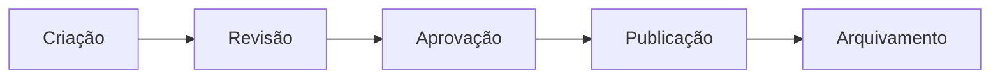

# Gestão de Conteúdo e CMS

> [!info] Metadados
> **Disciplina:** UX e Gestão de Conteúdo
> **Bloco:** 5.2 — UX e Gestão de Conteúdo (FASE 5 — Frontend e Interfaces)
> **Tópico:** 2. Gestão de Conteúdo e CMS
> **Subtópicos:** Arquitetura da informação (AI) · Portais · CMS (Content Management System) · Workflow editorial · SEO básico
> **Pré-requisitos:** [[Conceitos-de-UX]] (experiência do usuário) · [[Fundamentos-Web]] (API, frontend, semântica HTML)
> **Conexões temáticas:** [[Testes-Automatizados]] (garantia de qualidade e aceitação) · [[Padroes-de-Projeto-e-Arquitetura]] (APIs RESTful no contexto headless)
> **Cargo:** Analista de TI — Perfil 3 (Desenvolvimento de Software) · DATAPREV 2026
> **Data:** 2026-08-31

---

## 1. Por que estudar gestão de conteúdo e CMS?

No tópico anterior, [[Conceitos-de-UX]], você aprendeu a desenhar uma boa **experiência** — pesquisa, prototipação, usabilidade e acessibilidade. Mas há um detalhe que todo sistema real precisa enfrentar: **a interface não vive de design, vive de conteúdo**. O que o cidadão do Meu INSS ou do portal gov.br procura, no fundo, é **informação e serviço** — e essa informação precisa estar organizada, publicada e mantida.

Por que isso é crítico para a DATAPREV? Porque os **portais de serviços públicos** (gov.br, Meu INSS) consolidam **milhões de páginas** de conteúdo: notícias, orientações, formulários, transparência, normativos, serviços. Sem uma **organização inteligente da informação** e sem um **sistema de gestão de conteúdo (CMS)** robusto, seria impossível: (1) manter tudo atualizado, (2) garantir **acessibilidade** e **padronização** nos sítios, (3) permitir que **áreas de negócio** publiquem sem precisar de programador, e (4) tornar o conteúdo **encontrável** pelos cidadãos e pelos buscadores.

> [!question] Pergunta orientadora
> Se uma equipe de TI tivesse que escrever código HTML e publicar, manualmente e um a um, cada notícia e cada formulário de um órgão público, quanto tempo levaria? E quem cuidaria do conteúdo — os especialistas de negócio ou os programadores? A resposta a essas duas perguntas explica **por que** o CMS existe.

Este tópico fecha o Bloco 5.2 conectando **UX**, **frontend** e **conteúdo**. O termo **API** que você já domina (em [[Padroes-de-Projeto-e-Arquitetura|APIs RESTful]] e no `fetch` do [[Fundamentos-Web]]) reaparece aqui com força — porque o **CMS headless** entrega conteúdo justamente por API. E, em conexão com o tópico de testes, lembre-se: **publicar conteúdo errado** é um defeito que pode ser capturado nos fluxos de revisão — uma forma de garantia de qualidade editorial.

---

## 2. Arquitetura da Informação (AI)

### 2.1 O conceito

**Arquitetura da Informação (AI)** é a disciplina que se ocupa de **organizar, estruturar e rotular** a informação de modo que os usuários a encontrem e a compreendam facilmente. Quando você define **como** as páginas de um portal se agrupam em menus, **quais termos** aparecem nos rótulos e **qual caminho** o usuário percorre, está fazendo arquitetura da informação.

> [!question] Pergunta orientadora
> Em um portal governamental com milhares de páginas, um usuário precisa encontrar "como tirar a segunda via do extrato". Onde essa informação deve estar? Em que menu? Com que nome? Quem decide isso? É a **arquitetura da informação** que responde — e ela é pré-requisito para uma boa UX, pois de nada adianta uma página bonita se ninguém a encontra.

A arquitetura da informação se apoia em três modos de organização que a FGV exige distinguir com precisão: **taxonomia**, **ontologia** e **folksonomia**.

### 2.2 Taxonomia vs. ontologia vs. folksonomia — a pegadinha central

Estes três termos descrevem **formas diferentes de classificar e organizar** a informação. Confundi-los é a armadilha mais frequente deste tópico.

| Termo | Definição | Característica-chave | Exemplo |
|---|---|---|---|
| **Taxonomia** | Classificação **hierárquica e controlada** | Vocabulário **controlado**, estrutura em árvore, criada por especialistas | Menu de um portal: "Cidadão → Benefícios → Aposentadoria → Requerimento" |
| **Ontologia** | **Modelo formal** de conceitos e das **relações** entre eles | Semântica e relações explícitas (não só hierarquia) | "Benefício" **está relacionado a** "Segurado"; "Aposentadoria" **é um tipo de** "Benefício" |
| **Folksonomia** | Classificação **colaborativa** via tags/etiquetas | Feita pelos **próprios usuários**, sem controle central | Hashtags (#previdencia, #meuinss), marcadores de e-mail, tags em redes sociais |

> [!warning] PEGADINHA — diferenciando os três
> A banca adora trocar os papéis. Memorize as **três palavras-chave**: **taxonomia** = termos **hierarquia + controlada** (especialista define); **ontologia** = termos **semântica + relações formais entre conceitos** (não é só árvore, é o "mapa" de relações e significados); **folksonomia** = termos **colaborativa + tags + usuários** (não controlada). Armadilhas típicas: dizer que a "folksonomia é criada por especialistas em uma hierarquia" — **falsa** (é colaborativa via tags). Dizer que "a taxonomia modela relações semânticas formais" — isso é **ontologia**.

> [!note] Da taxonomia à ontologia — evolução do formalismo
> Pense numa progressão: a **taxonomia** organiza (agrupa em árvore), a **ontologia** **explica as relações e o significado** dos conceitos (semântica). A ontologia é mais "rica" porque inclui não só "o que é" mas "como se relaciona". A **folksonomia** é o oposto da taxonomia em controle: enquanto a taxonomia é centralizada e controlada, a folksonomia é **descentralizada e espontânea**, criada pela colaboração dos usuários.

### 2.3 Como a AI se conecta com UX e banco de dados

A arquitetura da informação não é usada só em menus. Ela dialoga com **metadados** — dados que descrevem outros dados (title, autor, data, categoria). Em um contexto de portal, metadados bem definidos permitem busca, filtro e reuso de conteúdo. Se você estudou [[Fundamentos-e-Modelagem|modelagem de dados]] na Fase 3, verá a conexão: assim como um banco relacional organiza registros com esquemas e chaves, um vocabulário controlado organiza o conteúdo do portal. A taxonomia pode, inclusive, sustentar a **categorização** que alimenta menus e buscas.

> [!tip] Como a FGV cobra a AI
> A banca costuma descrever um cenário e perguntar qual técnica organiza a informação. "Menu hierárquico definido pela redação do portal" → **taxonomia**. "Sistema que descreve que benefício está relacionado a segurado e define essas relações formalmente" → **ontologia**. "Usuários marcam conteúdos com tags livres (#dica, #novo)" → **folksonomia**. Atenção à palavra **"relaciona"** (ontologia) e **"usuários/tags"** (folksonomia).

---

## 3. Portais

### 3.1 Conceito e tipos

Um **portal** é um **ponto de acesso unificado** a informações e serviços, tipicamente organizados em torno de um público e de uma finalidade. Diferente de um site simples (que costuma apresentar poucas páginas estáticas), o portal **agrega** múltiplas fontes de conteúdo e funcionalidades em uma única porta de entrada.

| Tipo de portal | Finalidade | Exemplo |
|---|---|---|
| **Portal corporativo** | Integrar informação interna de uma organização para seus colaboradores | Intranet de uma empresa, portal do funcionário |
| **Portal de serviços públicos / gov.br** | Centralizar acesso dos cidadãos a serviços e informações do governo | gov.br, Meu INSS |
| **Portal institucional** | Apresentar a organização ao público — missão, estrutura, notícias, contato | Site institucional de um ministério |
| **Portal transacional** | Permitir que o usuário **execute** transações (requerer, pagar, agendar) | Portal onde se requer um benefício ou se agenda um atendimento |

> [!question] Pergunta orientadora
> Qual a diferença entre um portal **institucional** e um **transacional**? O institucional **informa** (apresenta a organização); o transacional **executa um serviço** (o usuário realiza uma ação). Um portal pode combinar os dois — o gov.br faz isso: tem páginas institucionais (informação) e áreas transacionais (serviços). A FGV pode pedir para classificar o portal conforme a função predominante.

> [!note] A estratégia gov.br
> O **gov.br** é o exemplo brasileiro de **portal de serviços públicos** que unifica o acesso do cidadão a dezenas de serviços federais em um só lugar. A DATAPREV, como empresa de tecnologia da seguridade social, opera portais e serviços digitais ligados à **previdência e assistência social** — o **Meu INSS** é o caso mais claro: um portal que integra informação, consulta e transação de benefícios.

### 3.2 Gestão editorial em portais

Um portal governamental não publica conteúdo por acaso. Existe uma **gestão editorial**: o conjunto de processos, papéis e padrões que decide **quem produz, quem revisa, quem publica** e **de que forma** o conteúdo é publicado.

Componentes da gestão editorial:

- **Produção:** autores redigem o conteúdo (notícia, orientação, formulário) com base em fontes oficiais.
- **Curadoria:** seleção e priorização do que vale publicar, conforme a relevância para o cidadão e o alinhamento à política de conteúdo.
- **Revisão:** verificação de correção (técnica, jurídica, de linguagem) antes da publicação.
- **Padrões de publicação:** regras de formato, tom de voz, acessibilidade, SEO e identidade visual — para que todo conteúdo siga um padrão consistente (o que reforça a heurística de **consistência e padrões** que você viu no [[Conceitos-de-UX|Bloco 5.2 — UX]]).

> [!warning] PEGADINHA — curadoria vs. produção
> **Curadoria não é escrever o conteúdo** — é **selecionar, priorizar e organizar** o que merece ser publicado, garantindo relevância e qualidade. Confundir curadoria com produção (escrever) é uma pegadinha comum. Quem **escreve** é o autor/produtor; quem **seleciona e prioriza** é o curador.

> [!question] Pergunta orientadora
> Por que um portal público precisa de **padrões de publicação** tão rígidos? Porque a consistência gera confiança e previsibilidade: o cidadão sabe onde achar as coisas, como a linguagem será, e os buscadores (e leitores de tela) encontram o conteúdo de forma uniforme. Padrão de publicação liga gestão editorial à **acessibilidade** e ao **SEO**.

---

## 4. CMS — Content Management System

### 4.1 O conceito

**CMS (Content Management System)** — em português, **sistema de gestão de conteúdo** — é um software que permite **criar, editar, gerenciar e publicar conteúdo** em um site/portal **sem a necessidade de escrever código**. Ele separa o **conteúdo** da **manutenção técnica**: um especialista de negócio (não programador) consegue criar e publicar uma notícia por uma interface amigável.

> [!question] Pergunta orientadora
> Como uma equipe de comunicação de um ministério publica um comunicado importante em minutos, sem chamar um desenvolvedor para escrever HTML? Pelo CMS: a interface de edição é simples, o conteúdo é salvo em um banco de dados, e o sistema gera (ou entrega) as páginas automaticamente. O CMS libera o conteúdo do código — e é exatamente por isso que portais públicos o adotam em massa.

**Por que portais públicos usam CMS (e por que DATAPREV):**

- **Padronização:** todos os sítios seguem o mesmo layout, identidade e acessibilidade (essencial para os **sítios governamentais** que devem atender ao e-MAG/WCAG).
- **Divulgação ágil de serviços:** áreas de negócio publicam e atualizam conteúdo sem depender de fila de TI.
- **Acessibilidade dos sítios:** o CMS pode aplicar automaticamente padrões de acessibilidade (menus, `alt`, estrutura semântica) de forma consistente.
- **Governança e auditabilidade:** rastrear quem criou, revisou e publicou (nos conecta ao **workflow editorial**, abaixo).

### 4.2 Os tipos de CMS — a pegadinha principal

A classificação mais cobrada distingue os CMS conforme **onde a apresentação (frontend) vive** em relação ao **back end de conteúdo**.

| Tipo | Como funciona | Apresentação | Exemplo |
|---|---|---|---|
| **Tradicional** (acoplado) | Conteúdo **e** apresentação estão **juntos**; o CMS gera as páginas prontas | Acoplada ao CMS | **WordPress** (clássico), Joomla, Drupal (quando usado de forma tradicional) |
| **Headless** | O CMS guarda o conteúdo no **back end** e o entrega **via API**; a interface é construída separadamente e consome essa API | Totalmente separada (a UI é um frontend próprio, ex. SPA) | **Strapi**, **Contentful** |
| **Decoupled** | Conteúdo separado do frontend, **mas** a apresentação ainda é **gerenciada pelo CMS** | Separada do back end, porém o CMS ainda serve a apresentação | Um CMS decoupled oferece "backend de conteúdo" + "camada de entrega de apresentação" |

> [!warning] PEGADINHA — headless vs. decoupled vs. tradicional
> A diferença central: no **tradicional**, conteúdo e apresentação estão **acoplados (juntos)** — o CMS renderiza a página final. No **headless**, o CMS é **apenas o back end de conteúdo**, entregue **via API**, e a interface é um **frontend totalmente separado** (sem apresentação gerenciada pelo CMS). No **decoupled**, o conteúdo está separado do frontend, **mas** o CMS ainda gerencia a apresentação das páginas — é um "meio-termo". Armadilha: dizer que o "headless entrega HTML pronto para o navegador" — **falsa** (o headless entrega dados via API, e a UI quem monta é o frontend à parte).

> [!note] O headless e a conexão com o frontend/API
> O **CMS headless** só faz sentido porque existe um **frontend** capaz de consumir API — exatamente o que você estudou no [[Fundamentos-Web]] (o `fetch`, as [[Padroes-de-Projeto-e-Arquitetura|APIs RESTful e JSON]]). Nesse modelo, o frontend (uma SPA, por exemplo) busca o conteúdo no back end do CMS via API e o exibe. Isso permite **reuso de conteúdo em múltiplas interfaces** (web, app, etc.) e **liberdade total de apresentação** — mas exige mais trabalho de frontend do que o CMS tradicional.

### 4.3 Ferramentas

| Ferramenta | Tipo / modelo | Observação |
|---|---|---|
| **WordPress** | Tradicional (acoplado) | O mais popular; pode ser usado de forma headless pela API REST, mas nasce tradicional |
| **Joomla** | Tradicional | CMS tradicional extensível |
| **Drupal** | Tradicional (com forte uso em governo) | **Muito utilizado em sítios governamentais**; robusto e padronizável (o portal gov.br e muitos sítios públicos já usaram base Drupal) |
| **Strapi** | **Headless** | CMS headless open source, entrega conteúdo via API |
| **Contentful** | **Headless** | CMS headless comercial, conteúdo entregue via API |

> [!tip] Como a FGV cobra CMS
> A banca costuma distinguir os modelos (tradicional × headless × decoupled) e as ferramentas mais representativas. Associação-chave: **WordPress/Joomla/Drupal** = tradicional · **Strapi/Contentful** = **headless** · **Drupal** também é forte no contexto **governamental**. Pegadinha frequente: marcar o **Contentful** como CMS "tradicional" — **errado**, é **headless** (entrega via API, sem apresentação acoplada).

> [!note] Por que padrão governamental importa
> O **Drupal** se destaca no setor público por sua robustez, segurança e capacidade de **padronização e acessibilidade** em escala — características que atendem às exigências legais dos sítios governamentais (e-MAG). Quando a questão envolve "CMS para portal governamental", o **Drupal** é uma associação forte.

> [!tip] PEGADINHA — Drupal também é headless/decoupled
> Assim como o WordPress, o **Drupal nasce como CMS tradicional**, mas é amplamente utilizado em **portais governamentais em modo headless ou decoupled** (por meio de APIs como a JSON:API). Na prova, "Drupal = somente tradicional" é uma **simplificação perigosa**: a associação clássica é **Drupal = governo**, e o modo de entrega (tradicional, headless ou decoupled) depende de **como** é configurado — não da ferramenta em si.

---

## 5. Workflow editorial

### 5.1 O ciclo de vida do conteúdo

O **workflow editorial** é o **fluxo de trabalho** pelo qual o conteúdo passa desde a ideia inicial até o arquivamento. Ele garante **controle de qualidade, governança e rastreabilidade** — cada conteúdo tem um "caminho" e responsáveis em cada etapa.

O ciclo típico:

| Etapa | O que acontece |
|---|---|
| **Criação** | O autor redige o conteúdo no CMS |
| **Revisão** | Um revisor verifica correção, clareza, conformidade com políticas |
| **Aprovação** | Um editor/aprovador dá o aval final (pode envolver hierarquia) |
| **Publicação** | O conteúdo fica visível ao público no portal |
| **Arquivamento** | Quando desatualizado, o conteúdo é despublicado/arquivado (não soma ao acervo público) |

### 5.2 Papéis no workflow

Cada etapa pode ter responsáveis distintos — a **separação de papéis** é um controle importante (e uma pegadinha):

| Papel | Responsabilidade |
|---|---|
| **Autor** | Cria/escreve o conteúdo |
| **Revisor** | Verifica correção e clareza (não é quem escreveu) |
| **Editor** | Decide o que entra, aprova e gerencia a curadoria |
| **Administrador** | Gerencia o CMS, usuários, permissões e configurações |

> [!warning] PEGADINHA — confundir papéis
> **Editor ≠ autor** e **revisor ≠ autor**. O **autor** escreve; o **revisor** confere; o **editor** aprova e seleciona; o **administrador** cuida da infraestrutura/permissões. A banca pode dizer que "o autor é quem aprova a publicação" — ofensa à separação de papéis. Em ambientes de governança (e em portais públicos sérios), **quem escreve não deve ser o único aprovador**, para garantir qualidade e prevenir conteúdo indevido.

### 5.3 Versionamento e política de conteúdo

- **Versionamento:** o CMS guarda **histórico das versões** de cada conteúdo — quem alterou, quando e o quê. Permite comparar, recuperar versões anteriores e auditar. Isso conecta com o controle de versão que você já conhece no mundo de código (Git, no bloco de [[DevOps-e-Controle-de-Versao|DevOps]]).
- **Política de conteúdo:** o **conjunto de regras** que orienta o que publicar, com que linguagem, periodicidade e responsabilidade — o "contrato" editorial do portal.

> [!note] Workflow e qualidade
> O workflow editorial é, no fundo, um **mecanismo de garantia de qualidade de conteúdo** — análogo ao ciclo de **testes de aceitação** que você viu nos [[Testes-Automatizados]] e nos [[Fundamentos-de-Teste|níveis de teste]]: antes de "publicar em produção", o conteúdo passa por validação. Um erro de conteúdo publicado é um defeito que o workflow procura evitar antes de ir ao ar.

---

## 6. SEO básico

### 6.1 O que é SEO e por que órgãos públicos precisam

**SEO (Search Engine Optimization)** é o conjunto de práticas para **melhorar o posicionamento** de um site/página nos **resultados de busca** (Google, Bing). No contexto de portais públicos, o SEO tem uma missão social e legal: **fazer os cidadãos encontrarem os serviços** que procuram.

> [!question] Pergunta orientadora
> Um cidadão digita "como requerer aposentadoria" no Google. O resultado que aparecer no topo pode ser o portal oficial ou um site terceiro com informações erradas e tentando vender serviços. Como garantir que **o canal oficial e acessível** apareça primeiro? Com **SEO** — porque a informação certa, publicada no lugar oficial e bem otimizada, tende a rankear melhor e a proteger o cidadão de desinformação.

### 6.2 SEO on-page vs. off-page

| Tipo | O que envolve | Foco |
|---|---|---|
| **On-page** (na página) | Elementos **dentro do próprio site**: meta tags, headings, conteúdo, estrutura de URLs, sitemap, robots.txt | Otimização do próprio conteúdo e código |
| **Off-page** (fora da página) | Fatores **externos** ao site: backlinks (links de outros sites), reputação e autoridade | Como o site é percebido pela web externa |

> [!tip] A palavra-chave para distinguir
> **On-page** = controles que você **faz dentro do site** (código e conteúdo). **Off-page** = fatores que dependem de **terceiros/externo** (links que apontam para o site). A FGV testa se você sabe que **backlinks e autoridade externa são off-page**, enquanto **meta tags e headings são on-page**.

### 6.3 Elementos on-page essenciais

| Elemento | Função |
|---|---|
| **`title`** (meta) | O título da página, exibido nos resultados de busca |
| **`meta description`** | Descrição breve mostrada no resultado de busca; influencia o clique |
| **Headings semânticos** (`h1`, `h2`...) | Estrutura do conteúdo; ajudam buscadores e **acessibilidade** (leitores de tela) |
| **URLs amigáveis** | URLs legíveis e descritivas (ex.: `/cidadao/beneficios/aposentadoria` em vez de `/p=123?cat=9`) |
| **`sitemap.xml`** | Arquivo que lista as páginas do site para os buscadores indexarem |
| **`robots.txt`** | Arquivo que instrui os buscadores sobre o que podem ou não indexar |
| **Conteúdo** | Texto relevante, com palavras-chave naturais, de qualidade — o "recheio" que o buscador avalia |

> [!warning] PEGADINHA — sitemap.xml vs. robots.txt
> **`sitemap.xml`** **aponta** ao buscador quais páginas existem (facilita a **indexação**). **`robots.txt`** **instrui** o buscador sobre o que **pode ou não** ser rastreado (**controle de rastreamento**). A banca adora trocar: "o `robots.txt` lista todas as páginas para indexar" → **falso** (isso é o sitemap; o robots.txt é uma **diretiva**, não um mapa).

### 6.4 SEO e conteúdo governamental

No governo, o SEO anda junto da **arquitetura da informação** e da **acessibilidade**: um conteúdo bem estruturado (headings semânticos), com **URLs amigáveis** e **rótulos claros**, tende a ser tanto mais **encontrável** quanto mais **acessível**. A otimização não é "trapaça tecnológica" — é garantir que a informação **oficial, correta e acessível** seja a que o cidadão encontra primeiro.

> [!question] Pergunta orientadora
> Como headings semânticos servem ao mesmo tempo SEO e acessibilidade? Os buscadores usam os headings para ***entender a estrutura* e ranquear o conteúdo**, e os **leitores de tela** usam os headings para ***navegar*** a página para pessoas cegas. Ou seja, aquilo que melhora o SEO também melhora a acessibilidade — no governo, essas duas preocupações confluem. É a mesma ideia de **arquitetura da informação**: organizar para **encontrar** é organizar para **incluir**.

---

## 7. Como a FGV cobra este tópico

- **Arquitetura da informação:** distinguir **taxonomia** (hierarquia controlada), **ontologia** (relações semânticas formais) e **folksonomia** (tags colaborativas dos usuários).
- **Portais:** classificar por finalidade (corporativo, serviços públicos/gov.br, institucional, transacional) e entender a **gestão editorial** (produção, curadoria, revisão, padrões, publicação).
- **CMS:** diferenciar **tradicional** (acoplado), **headless** (só back end de conteúdo, entrega via API) e **decoupled** (separado, mas com apresentação gerenciada pelo CMS). Associar ferramentas (WordPress/Joomla/tradicional · Strapi/Contentful/headless · Drupal/gov).
- **Workflow editorial:** ciclo criação → revisão → aprovação → publicação → arquivamento; papéis (autor, revisor, editor, administrador); **versionamento** e **política de conteúdo**.
- **SEO:** **on-page** vs. **off-page**; meta `title`/`description`, headings, URLs amigáveis, `sitemap.xml` vs. `robots.txt`.

> [!warning] PEGADINHA — o "resumo" que a banca arma
> (1) **taxonomia ≠ folksonomia**: hierarquia controlada vs. tags colaborativas. (2) **headless ≠ tradicional**: headless entrega via API, sem apresentação acoplada; não gera HTML pronto. (3) **sitemap.xml vs. robots.txt**: mapa de páginas vs. diretiva de rastreamento. (4) **curadoria ≠ produção**: selecionar/priorizar vs. escrever. (5) **revisor/editor ≠ autor**: separação de papéis no workflow. Grave essas cinco.

---

## 8. Resumo e pontos-chave

> [!tip] Checklist de revisão
> - [ ] **Arquitetura da informação:** organizar, estruturar e rotular para o usuário encontrar
> - [ ] **Taxonomia:** hierárquica e **controlada** (especialista) · **Ontologia:** modela **conceitos e relações** (semântica) · **Folksonomia:** **colaborativa via tags** (usuários)
> - [ ] **Portais:** corporativo · serviços públicos/gov.br · institucional · transacional
> - [ ] **Gestão editorial:** produção · curadoria · revisão · padrões de publicação
> - [ ] **CMS:** criar/editar/publicar sem código; separa **conteúdo** da manutenção técnica
> - [ ] **Tradicional = acoplado** · **Headless = back end de conteúdo via API (UI separada)** · **Decoupled = separado mas apresentação gerenciada pelo CMS**
> - [ ] **Ferramentas:** WordPress/Joomla (tradicional) · Strapi/Contentful (headless) · Drupal (governo)
> - [ ] **Workflow editorial:** criação → revisão → aprovação → publicação → arquivamento
> - [ ] **Papéis:** autor (escreve) · revisor (confere) · editor (aprova/curadoria) · administrador (permissões/plataforma)
> - [ ] **Versionamento** e **política de conteúdo**: história das versões e regras editoriais
> - [ ] **SEO on-page** (dentro do site: meta tags, headings, URLs, sitemap, robots) vs. **off-page** (externo: backlinks)
> - [ ] **`sitemap.xml` = mapa de indexação** · **`robots.txt` = diretiva de rastreamento**

---

## 9. Próximos passos

Você fechou o **Bloco 5.2 — UX e Gestão de Conteúdo**: da **experiência do usuário** ([[Conceitos-de-UX]]) à **organização e publicação do conteúdo** (este tópico). Agora você entende o portal público como um todo: uma interface **usável e acessível**, sustentada por **conteúdo bem estruturado** e entregue por um **CMS** com **workflow editorial**.

O caminho da Fase 5 continua na próxima etapa — o **Bloco 5.3 (Arquitetura Avançada, Segurança e Inovação)** — que elevará o nível de abstração para **arquitetura de software, segurança de comunicações e tecnologias emergentes**. Lembre-se de revisar os fundamentos de [[Fundamentos-Web|frontend]] e os [[Padroes-de-Projeto-e-Arquitetura|padrões e APIs]], pois a arquitetura avançada parte deles. Neste momento, porém, celebre: você domina toda a camada de **interfaces e experiência** do desenvolvimento de software.
