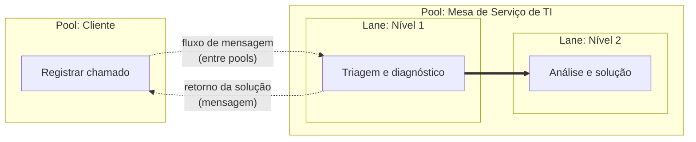
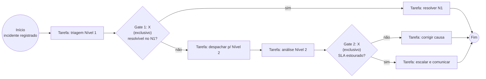

# BPMN (Business Process Model and Notation)

> [!info] Metadados
> **Disciplina:** Gestão e Governança de TI
> **Bloco:** 6.2 — Gestão e Governança de TI (FASE 6 — Segurança e Governança)
> **Tópico:** 4. BPMN (Business Process Model and Notation)
> **Subtópicos:** Conceito e padrão OMG — ponte entre negócio e TI · Elementos básicos: objetos de fluxo, de conexão, swimlanes e artefatos · Eventos (início, intermediário, fim e gatilhos) · Atividades: tarefa × subprocesso · Gateways (exclusivo, paralelo, inclusivo, baseado em eventos) · Fluxo de sequência × fluxo de mensagem · Pools e lanes · BPMN × UML · Leitura prática de diagramas
> **Pré-requisitos:** [[ITIL-v4]] (práticas de serviço; gestão de incidentes) · [[COBIT-2019]] (governança e gestão) · [[Gerenciamento-de-Projetos]] (visão de processos e entregas) · [[Metodologias-Ageis]] (organização do trabalho em fluxos) · [[Fundamentos-de-Seguranca]] (incidentes de segurança gerenciados como processos)
> **Cargo:** Analista de TI — Perfil 3: Desenvolvimento de Software
> **Data:** 2026-09-01

## 1. Por que estudar BPMN?

Você chegou à reta final da Fase 6. Já conversou com o [[Gerenciamento-de-Projetos|Gerenciamento de Projetos]] (de onde vêm as entregas), com o [[ITIL-v4|ITIL v4]] (que organiza a gestão de serviços de TI) e com o [[COBIT-2019|COBIT 2019]] (que governa tudo isso). Faltava uma peça essencial: a **linguagem** usada para *descrever* os processos que essas boas práticas gerenciam. Essa linguagem é o **BPMN**.

A ementa é direta a ponto de virar aviso: *"BPMN é prático — saber ler e interpretar diagramas de processo."* Ou seja: menos decoreba, mais **alfabetização visual**. A FGV vai apresentar símbolos e fluxos e perguntar o que significam — ou o que está errado num diagrama. Se você dominar o significado de cada figura, tudo o mais é consequência.

No contexto DATAPREV isso é palpável. A empresa executa processos gigantes de negócio — análise e **concessão de benefícios**, atualização de cadastro, pagamento de folhas. Processos assim precisam ser **documentados de forma padronizada** para que analistas de negócio, desenvolvedores, auditores e a própria estatal entendam o mesmo desenho. É ali que entram a notação BPMN e também a automação: um processo bem modelado pode virar **RPA** (que você já viu na [[RPA|Fase 4]]), orquestração de serviços ou regras de negócio executadas por software.

> [!question]
> Pense: como você explicaria a um auditor externo, em um único desenho, o caminho que um pedido de benefício percorre dentro da DATAPREV — quem recebe, quem analisa, onde há decisões, onde o tempo de resposta travaria? Se cada departamento usasse desenhos próprios, o entendimento viraria caos. A padronização da **notação** é o que torna esses desenhos comparáveis e inequívocos.

Este tópico é também o fecho do Bloco 6.2 — depois dele, a Fase 6 termina e o ciclo de estudo se completa. Vale a pena entendê-lo com profundidade de prova.

## 2. O que é BPMN e para que serve

**BPMN** (*Business Process Model and Notation*) é um **padrão de modelagem de processos de negócio** mantido pela **OMG** (*Object Management Group* — a mesma organização que padroniza a UML). O próprio nome já carrega as duas metades do conceito:

- **Model** — descreve o *processo de negócio*: quem faz o quê, em que ordem, sob quais condições;
- **Notation** — define um *conjunto gráfico padronizado* de símbolos para representar esse modelo.

O objetivo central do BPMN é criar uma notação **compreensível tanto para o analista de negócio** (que enxerga o processo como operação) **quanto para o desenvolvedor** (que precisa transformar o processo em sistema ou automação). Por isso a expressão clássica: BPMN é a **ponte entre a visão de negócio e a implementação técnica**. Não é uma linguagem de programação e não prescreve plataforma: é a representação gráfica padronizada do fluxo, à qual qualquer tecnologia pode ser acoplada depois.

> [!tip] Palavra-chave para associar
> BPMN = **Model + Notation**, padrão da **OMG**, que serve de **ponte entre negócio e TI**. Se a questão falar em "notação padronizada para processos de negócio" ou "entendimento comum entre analistas e desenvolvedores", a resposta é **BPMN**.

## 3. Elementos básicos: os quatro grupos da notação

Todo diagrama BPMN é construído a partir de **quatro grupos de elementos**. Memorizá-los é montar o esqueleto da prova:

| Grupo | Elementos | Papel no processo |
|---|---|---|
| Objetos de fluxo (*flow objects*) | **eventos, atividades, gateways** | Dizem *o que acontece* (o coração do diagrama) |
| Objetos de conexão (*connecting objects*) | **fluxo de sequência, fluxo de mensagem, associação** | Ligam e ordenam os objetos de fluxo |
| Swimlanes (piscinas/faixas) | **pool (piscina) e lane (faixa)** | Dizem *quem* executa cada parte |
| Artefatos (*artifacts*) | **objeto de dados, anotação, grupo** | Acrescentam informação complementar |

Nos próximos tópicos, cada grupo é dissecado. Antes, uma nota de método: quando a questão mostrar um diagrama, a ordem de leitura é 1º identificar os *objetos de fluxo*, 2º seguir os *objetos de conexão* na direção das setas, e 3º localizar *swimlanes* e *artefatos* para entender o contexto.

## 4. Eventos: os círculos que marcam o tempo do processo

Um **evento** é algo que *acontece* durante o processo e é representado por um **círculo**. A posição do evento — e, principalmente, a **borda** do círculo — diz em que momento da vida do processo ele ocorre:

| Posição | Borda do círculo | Significado |
|---|---|---|
| **Evento de início** | borda **fina (única)** | Dispara o início do processo |
| **Evento intermediário** | **borda dupla** | Ocorre enquanto o processo está em andamento |
| **Evento de fim** | **borda grossa (espessa)** | Encerra o processo |

Além da posição, o evento pode carregar um **gatilho** (o que o dispara), representado por um símbolo no centro do círculo. Os mais cobrados em prova:

- **Mensagem** — um **envelope** (chegada ou envio de uma mensagem);
- **Temporizador** — um **relógio** (espera até uma data/hora ou decurso de prazo);
- **Condicional** — dispara quando uma condição se torna verdadeira;
- **Erro** — dispara em caso de falha (comum em fim intermediário de tratamento de exceção);
- **Sinal, cancelamento, link** — casos mais específicos (menção de prova: basta reconhecê-los como gatilhos).

> [!warning] PEGADINHA — a borda é quem define a posição
> A banca descreve um "círculo com **borda dupla** contendo um **relógio**" e pergunta o tipo. A resposta exige **duas leituras combinadas**: a **borda dupla** diz que é **intermediário**; o **relógio** diz que o gatilho é **temporizador**. Erro típico: responder apenas "evento de tempo" sem citar a posição, ou confundir borda fina com fim. Guarde o trio: **fina = início, dupla = intermediário, grossa = fim**.

## 5. Atividades: tarefa × subprocesso (o "+" é a pegadinha)

Uma **atividade** representa um trabalho executado no processo e é desenhada como **retângulo de cantos arredondados**. A distinção mais cobrada divide as atividades em dois níveis de detalhe:

| Símbolo | O que é | Como identificar |
|---|---|---|
| **Tarefa (task)** | Atividade **atômica e unitária** — uma ação simples, não decomposta no diagrama atual | Retângulo arredondado **sem marcação** (ou com pequenos ícones de tipo: enviar/receber mensagem, usuário, script, serviço, manual) |
| **Subprocesso** | Atividade **composta** — possui um fluxo interno próprio, detalhado em outro nível | Retângulo arredondado com um **"+" no centro inferior**; ou representação **expandida**, com o fluxo interno desenhado dentro da própria caixa |

Um **subprocesso colapsado** esconde o fluxo interno (visto no "+" ou em um ícone de "seta/detalhe"); a **expansão** mostra o fluxo interno visível dentro de um retângulo maior. Para a prova, o essencial é o reconhecimento visual.

> [!question]
> Quando modelar uma atividade como tarefa e quando como subprocesso? A resposta é de **nível de detalhamento**: se aquele passo é único e indivisível para quem lê, é uma **tarefa**; se o passo merece ter seu próprio fluxo detalhado (com eventos e decisões internos), é um **subprocesso**. O mesmo trabalho pode ser tarefa num diagrama de visão geral e subprocesso num diagrama detalhado — depende da perspectiva.

> [!warning] PEGADINHA — o "+" denuncia o subprocesso
> A FGV costuma colar um retângulo arredondado com "+" no centro inferior e chamá-lo de "tarefa". **Falso**: a presença do "**+**" indica **subprocesso** (atividade composta). Tarefa é a atividade **atômica**, sem "+". Leia o retângulo inteiro: canto arredondado sozinho não basta — o marcador interno define.

## 6. Gateways: os losangos da decisão

Um **gateway** controla divergências e convergências de fluxo — decide como os caminhos se bifurcam ou se reúnem. É representado por um **losango (diamante)** e o símbolo interno revela a lógica:

| Gateway | Símbolo | Lógica | Quantos caminhos seguem |
|---|---|---|---|
| **Exclusivo (XOR)** | "**X**" (pode também aparecer **sem marcação** — losango vazio) | Uma **única** condição vence, uma só alternativa | **1** |
| **Paralelo (AND)** | "**+**" (ou o losango com pequena faixa de fundo escurecida) | **Todos** os caminhos de saída são acionados, **sem esperar decisão** | **Todos** |
| **Inclusivo (OR)** | **círculo** ("O") no centro | Cada condição independente: **um ou mais** caminhos podem ser acionados | **1 ou mais** |
| **Baseado em eventos** | Losango com **borda dupla** (ou formato poligonal com eventos de saída) | O fluxo segue pelo caminho do **primeiro evento a ocorrer** | **1** (decidido pelo evento) |

> [!warning] PEGADINHA — o trio X, O, +
> A pegadinha campeã da FGV é trocar os significados: "gateway **inclusivo** significa que **todos** os caminhos são executados" — **falso**, todos é o **paralelo**. E "gateway **paralelo** escolhe **um** caminho com base numa condição" — **falso**, um caminho é o **exclusivo**. Guarde por sinais: **X = exclusão (um só)** · **O/círculo = opcional (um ou mais)** · **+ = tudo junto (paralelo)**. Um excelente mnemônico: o paralelo é o único que **acrescenta** (sinal de soma), o exclusivo **exclui** o resto, o inclusivo **inclui** o que for válido.

> [!note] Convergência
> Gateways também **convergem** fluxos (reúnem caminhos). Um paralelo que converge **espera todos** os caminhos chegarem; um exclusivo que converge continua quando o **primeiro** que chegar passar. A mesma lógica das bifurcações vale para as junções — e isso também é cobrado em interpretação de diagrama.

## 7. Objetos de conexão: sequência, mensagem e associação

Os *connecting objects* ligam os elementos. A distinção entre **fluxo de sequência** e **fluxo de mensagem** é uma das mais importantes da prova, porque define até onde um fluxo pode "andar".

| Objeto de conexão | Aparência gráfica | O que liga |
|---|---|---|
| **Fluxo de sequência** | **Seta de linha contínua (cheia)** com ponta preenchida | A **ordem das atividades dentro do mesmo processo** — nunca cruza a fronteira de um pool |
| **Fluxo de mensagem** | **Linha tracejada**, com **círculo vazio** na origem e ponta de seta | A **comunicação entre participantes (pools) diferentes** |
| **Associação** | **Linha pontilhada** (sem seta dirigida ou com ponta pequena) | Liga **artefatos/anotações** a atividades (ex.: "documento X é usado nesta tarefa") |

> [!question]
> Duas atividades em *pools diferentes* precisam se comunicar. Que objeto de conexão usa? Fluxo de **mensagem**. E duas atividades na *mesma pool* (mesmo processo)? Fluxo de **sequência**. Por que a regra existe? Porque cada pool representa um **participante autônomo** — a ordem interna de um não manda na ordem do outro; entre eles só há **troca de mensagens**.

> [!warning] PEGADINHA — sequência não cruza pool
> "O fluxo de sequência liga atividades em pools diferentes" — **falso**. Sequência só existe dentro do mesmo processo (pool); quem conecta participantes distintos é o **fluxo de mensagem** (linha tracejada com círculo vazio na origem). Essa inversão é cobrada com frequência, inclusive em questões de "corrija o diagrama": o erro clássico é desenhar uma seta cheia atravessando dois pools.

## 8. Pools e lanes: *quem* faz o quê

**Pools (piscinas)** e **lanes (faixas)** são as *swimlanes* — a estrutura de responsabilidade do diagrama.

- **Pool**: retângulo grande que representa um **participante do processo** (uma organização, um sistema ou um processo completo). Cada pool contém o fluxo de seu próprio processo.
- **Lane**: subdivisão **dentro** da pool, organizada por **papel, função, departamento ou sistema**. Separadas por linhas, podem ser **horizontais ou verticais**. As lanes mostram qual papel executa cada atividade — melhorando a leitura de responsabilidades (o mesmo gesto que o ITIL v4 descreve em *fluxos de valor e de serviço*).

A comunicação **entre pools** se dá por **fluxo de mensagem**; a comunicação **entre lanes** do mesmo pool é **fluxo de sequência** (fazem parte do mesmo processo).

> [!note] Sobre o desenho acima
> Este fluxograma é uma **aproximação didática** do BPMN em mermaid (que não implementa BPMN literalmente). A leitura a fazer é a correspondência: **caixa grande = pool**, **subdivisões internas = lanes**, **seta cheia espessa = fluxo de sequência**, **seta pontilhada com bolinha na origem = fluxo de mensagem**. Note que a flecha cheia só existe **dentro** da pool da Mesa de Serviço (de Nível 1 para Nível 2); entre o Cliente e a Mesa só há mensagens pontilhadas.

> [!tip] Pequena regra de ouro
> "Pool" é uma unidade de **participante/processo**; "lane" é uma unidade de **papel/departamento dentro do pool**. Palavras-chave associadas: **horizontal/vertical** = orientação das lanes; **mensagem** = fronteira entre pools; **sequência** = interior da pool.

## 9. BPMN × UML: finalidades diferentes, mesma família

A ementa pede esta comparação **explicitamente**. BPMN e UML são **ambos padrões da OMG**, mas respondem a problemas diferentes — a pegadinha clássica é inverter esse par.

| Critério | **BPMN** | **UML** |
|---|---|---|
| Foco | **Processos de negócio** e fluxos de trabalho (perspectiva de operação/processo) | **Modelagem de software e sistemas**, orientada a objetos |
| O que modela | Eventos, atividades, gateways, participantes (quem-quando-como) | Classes, objetos, casos de uso, componentes, mensagens (estrutura e comportamento do sistema) |
| Público-alvo | Analistas de negócio + desenvolvedores | Desenvolvedores e arquitetos de software |
| Diagrama principal | **Business Process Diagram (diagrama de processo de negócio)** — um único tipo central | **14 tipos** de diagrama: **estruturais** (classes, componentes, objetos, implantação...) e **comportamentais** (casos de uso, sequência, atividades, máquina de estados...) |
| Pergunta que responde | *Como o processo de negócio acontece?* | *Como o sistema de software é estruturado e se comporta?* |

Uma ressalva importante para não errar: dentro da UML existe o **diagrama de atividades**, que também desenha fluxos com decisões e lembra BPMN. Mas a finalidade é outra — ele descreve o **fluxo de controle de atividades de um sistema/software**, sem a noção de participantes e processos de negócio que o BPMN carrega (pools, mensagens entre organizações). E os **casos de uso** da UML descrevem *funcionalidades/requisitos* do sistema, não o fluxo do processo de negócio — relação que a banca adora explorar.

> [!warning] PEGADINHA — o par invertido
> Afirmativas que a FGV usa para derrubar: "BPMN é uma linguagem para modelar **software orientado a objeto**" — **falso**, isso é **UML**. "UML é o padrão para **processos de negócio**" — **falso**, isso é **BPMN**. "O equivalente do BPMN na UML é o **diagrama de classes**" — **falso**, o mais próximo em forma é o **diagrama de atividades** (e mesmo ele tem finalidade distinta: sistema, não negócio). Associe: **BPMN = negócio / processo / fluxo de trabalho**; **UML = sistema / software / objetos**.

## 10. Leitura prática: um processo de gestão de incidentes

Vamos aplicar tudo numa leitura guiada, no espírito da cobrança: *interpretar o diagrama*. O exemplo é a **gestão de incidentes** do ITIL v4 — um incidente chega, é triado, resolvido ou escalado, e encerrado quando o usuário confirma a solução.

Leitura passo a passo, com a correspondência BPMN:

1. **Círculo de borda fina** — evento de **início**: o processo dispara quando o incidente é registrado.
2. **Retângulo arredondado sem "+"** — **tarefa**: "triagem Nível 1" é uma atividade atômica.
3. **Losango com X** — **gateway exclusivo**: o caminho é **UM SÓ**. As setas de saída carregam os rótulos **"sim"** e **"não"** como condições. Não há possibilidade de os dois caminhos ocorrerem — exclusão mútua.
4. Ao "não", o fluxo segue para **outra tarefa** (despacho ao Nível 2), depois uma **análise** e um **segundo gateway exclusivo** que decide sobre o prazo (SLA). Nesse ponto perceba que o modelo permite descrever *política de escalada* — algo típico de incidentes de TI e de incidentes de **segurança** (a gestão de incidentes de segurança usa a mesma prática de serviço — ressaltada na observação pedagógica da ementa).
5. Cada ramo **converge** no círculo de **borda grossa** — evento de **fim**: o processo termina em qualquer um dos caminhos.

> [!tip] Como ler qualquer diagrama BPMN em 5 passos
> 1. **Ache o início** (círculo de borda fina) e siga a seta contínua.
> 2. **Nomeie cada atividade**: retângulo com "+" = subprocesso (tem fluxo interno); sem "+" = tarefa.
> 3. **Atravesse gateways com atenção**: X = um caminho; O = um ou mais; + = todos; os rótulos nas setas são as condições.
> 4. **Respeite as swimlanes**: mudou de pool → é mensagem (tracejada), não sequência; mudou de lane → continua sequência.
> 5. **Confirme o fim**: círculo de borda grossa. Todo caminho "aberto" num diagrama mal desenhado é sinal de fluxo incompleto — a banca explora isso.

## 11. Palavras-chave e como a FGV cobra

- **Palavras-chave:** *BPMN, OMG, ponte negócio-TI, Model and Notation, processo de negócio, fluxo de trabalho, flow objects (eventos, atividades, gateways), connecting objects (fluxo de sequência, fluxo de mensagem, associação), swimlanes (pool, lane), artefatos, evento de início/intermediário/fim, gatilho (mensagem, temporizador, condicional, erro), tarefa, subprocesso, gateway exclusivo (X/XOR), paralelo (AND), inclusivo (OR), baseado em eventos, Business Process Diagram, UML, diagrama de atividades, casos de uso.*

**Formas de cobrança típicas:**

1. **Cálculo de símbolo** — dado um símbolo descrito (ex.: "círculo de borda dupla com envelope"), identificar evento **intermediário de mensagem**. A leitura é dupla: borda (posição) + ícone (gatilho).
2. **Interpretação de fluxo** — dado um diagrama, perguntar qual caminho é tomado num gateway, ou qual atividade vem depois da decisão. Basta seguir a seta certa; não deixe o texto da questão "consertar" o diagrama.
3. **Sequência × mensagem** — identificar o objeto de conexão correto para cruzar pools, ou apontar o erro no diagrama (seta cheia atravessando pools = inválida).
4. **BPMN × UML** — inverter as finalidades (negócio × sistema) ou apontar o diagrama UML "equivalente" errado.
5. **Tarefa × subprocesso** — reconhecer o "+" e o significado (atividade composta).

> [!warning] PEGADINHA — leitura do diagrama é lei
> Na questão com diagrama, responda **pelo desenho**, não pelo que "faria sentido" no mundo real. Se o gateway exclusivo mostra um rótulo "aprovar" e outro "reprovar", os dois são mutuamente exclusivos — mesmo que no texto do enunciado pareça que dá para aprovar e reprovar ao mesmo tempo. O BPMN **manda**; o contexto apenas contextualiza.

## 12. Próximos passos

Com o BPMN, o **Bloco 6.2 se encerra** — e com ele a **Fase 6**. Você fechou o ciclo: a **governança** (COBIT 2019), a **gestão de serviços** (ITIL v4), a **gestão de projetos** e agora a **modelagem de processos** (BPMN), que é a ferramenta visual para representar o que ITIL e COBIT dirigem — inclusive os *fluxos de valor e de serviço* e a *gestão de incidentes*. Isso se conecta diretamente ao Bloco 6.1: um incidente de segurança da informação segue o mesmo fluxo de incidente que você modelou no BPMN (o elo Segurança ↔ ITIL que a ementa aponta como pegadinha comum).

Sugestão de revisão integrada para fechar o estudo: retome o processo que você modelou aqui e pergunte-se — *onde entrariam um gateway paralelo? onde um evento temporizador de SLA? o que muda se eu acrescentar uma lane de auditoria? onde esse fluxo viraria um robô de RPA? e onde o COBIT exigiria um objetivo de gestão para autorizá-lo?* Se você consegue responder essas perguntas cruzando as fases 4, 6.1 e 6.2, o mapa mental do concurso está completo. Bom descanso — e boa revisão final!