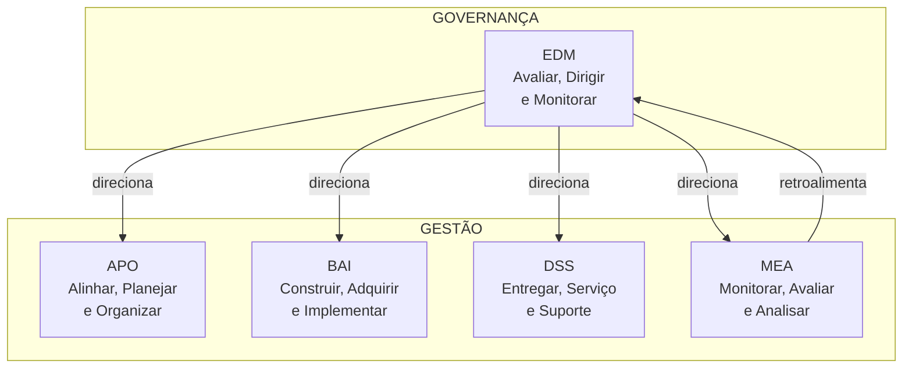

# COBIT 2019 — Framework de Governança e Gestão de TI

> [!info] Metadados
> **Disciplina:** Gestão e Governança de TI
> **Bloco:** 6.2 — Gestão e Governança de TI (FASE 6 — Segurança e Governança)
> **Tópico:** 3. COBIT 2019
> **Subtópicos:** Framework de governança e gestão de TI · Governança vs. gestão (distinção central) · Objetivos de governança e gestão (domínios EDM, APO, BAI, DSS, MEA) · Princípios orientadores (atendendo às necessidades das partes interessadas) · Fatores de design e componentes do sistema de governança · Capacidade e maturidade · Relação com ITIL v4
> **Pré-requisitos:** [[ITIL-v4]] (gestão de serviços — comparação com governança) · [[Gerenciamento-de-Projetos]] (visão de projetos/alinhamento ao negócio) · [[Fundamentos-de-Seguranca]] (governança de segurança) · visão panorâmica de todos os módulos anteriores
> **Cargo:** Analista de TI — Perfil 3: Desenvolvimento de Software
> **Data:** 2026-09-01

---

## 1. Por que estudar COBIT 2019?

Você já aprendeu a **escrever código** (Fases 3 e 4), a **organizar o trabalho** (metodologias ágeis) e a **proteger a informação** (segurança). Mas quem define **para onde a TI deve ir**, **como alinhar os investimentos de TI aos objetivos do negócio**, e **se a TI está entregando valor**? Essas perguntas estão além do alcance de um desenvolvedor individual — elas pertencem ao universo da **governança e da gestão de TI**.

É aí que entra o **COBIT 2019**, o framework mais reconhecido internacionalmente para governança e gestão de tecnologia da informação. Na DATAPREV, uma empresa pública que administra sistemas críticos da seguridade social, a governança de TI não é acessório — é obrigação institucional. Cada investimento em tecnologia, cada decisão sobre qual sistema modernizar, cada regra de segurança segue uma lógica de governança que o COBIT formaliza.

> [!question] Pergunta orientadora
> Quando a DATAPREV decide migrar um sistema legado para a nuvem, quem **avalia os riscos e define a direção**? E quem **planeja e executa a migração** na prática? A resposta envolve duas funções distintas — **governança** e **gestão** — e confundir uma com a outra é a pegadinha mais cobrada neste tópico.

---

## 2. O que é o COBIT?

**COBIT** significa ***Control Objectives for Information and Related Technologies*** (Objetivos de Controle para Tecnologia da Informação e Tecnologias Relacionadas). É um framework criado e mantido pela **ISACA** (*Information Systems Audit and Control Association*) que fornece um modelo abrangente para a **governança e a gestão de TI** nas organizações.

A ideia central é simples: o COBIT oferece um **conjunto estruturado de processos, práticas e métricas** que permite às organizações garantir que sua TI esteja **alinhada ao negócio**, gere **valor** para as partes interessadas e mantenha os **riscos** sob controle. Não é um guia de implementação técnica — é um **framework de referência**, ou seja, um mapa que organiza o que precisa ser feito sem prescrever *exatamente como* fazer em cada contexto.

> [!tip] Palavra-chave para associar
> Quando a banca disser "framework de governança e gestão de TI", "alinhamento TI-negócio", "ISACA" ou "controles de TI", está falando de **COBIT**. Quando disser "gestão de serviços", "entrega de valor ao cliente de TI" ou "práticas operacionais de TI", está falando de **ITIL**. São complementares, mas não são a mesma coisa.

---

## 3. Governança vs. Gestão — A distinção que a FGV mais cobra

Esta é, sem dúvida, a pegadinha mais clássica e recorrente do COBIT em provas da FGV. **Governança** e **gestão** são funções **distintas**, **complementares** e **de níveis hierárquicos diferentes**. A banca adora inverter os papéis.

### 3.1 Governança de TI

A **governança de TI** é responsabilidade do **conselho de administração, da alta direção e dos executivos**. Ela avalia, dirige e monitora a utilização da TI para garantir que:

- A TI **está alinhada** aos objetivos estratégicos do negócio;
- Os **riscos** de TI são gerenciados adequadamente;
- Os **recursos** de TI são usados de forma responsável;
- Os **benefícios** esperados dos investimentos em TI são efetivamente entregues.

Em uma frase: governança responde à pergunta **"para onde ir?"** e **"estamos indo na direção certa?"**. É **estratégica**, retrospectiva e avaliativa.

### 3.2 Gestão de TI

A **gestão de TI** é responsabilidade dos **gestores e profissionais de TI** (CIO, diretores, gerentes de TI). Ela planeja, constrói, executa e monitora as atividades de TI em **alinhamento com a direção** definida pela governança.

Em uma frase: gestão responde à pergunta **"como chegar lá?"**. É **operacional e tática**, proativa e executiva.

### 3.3 Tabela comparativa

| Aspecto | Governança de TI | Gestão de TI |
|---|---|---|
| **Responsáveis** | Conselho, alta direção, executivos | Gestores e profissionais de TI |
| **Função central** | Avaliar, dirigir e monitorar | Planejar, construir, executar e monitorar |
| **Pergunta-chave** | *"Para onde ir? Estamos no caminho certo?"* | *"Como chegar lá? O plano está sendo executado?"* |
| **Nível** | Estratégico | Tático-operacional |
| **Ações típicas** | Definir políticas, aprovar investimentos, monitorar resultados | Gerenciar projetos, operar sistemas, entregar serviços |
| **Perspectiva** | Retrospectiva/avaliativa | Proativa/executiva |

> [!warning] PEGADINHA — Inverter governança e gestão
> A armadilha mais lucrativa da FGV: afirmar que "a **gestão** de TI avalia e dirige os investimentos enquanto a **governança** executa os projetos" — **está invertido**. A governança **avalia e dirige** (topo); a gestão **executa e opera** (base). Outra variação: "a governança é responsabilidade do CIO" — **incorreto**; a governança é responsabilidade do **conselho/alta direção**. O CIO participa da **gestão**. Quando a questão mencionar "conselho de administração" ou "direção estratégica", a resposta é **governança**.

---

## 4. Evolução do COBIT — de COBIT 5 ao COBIT 2019

O COBIT não surgiu completo. Ele evoluiu ao longo de décadas, acompanhando a crescente importância estratégica da TI:

- **COBIT 4.1** (2007): foco em auditoria e controles de TI;
- **COBIT 5** (2012): abordagem ampliada para **governança e gestão**, com cinco princípios orientadores e separação clara entre governança e gestão;
- **COBIT 2019** (2018): evolução do COBIT 5 com **maior granularidade** — introduz os **fatores de design** do sistema de governança e os **componentes do sistema de governança**, permitindo que o framework seja adaptado de forma mais precisa ao contexto de cada organização.

O COBIT 2019 **mantém** a separação fundamental entre governança e gestão herdada do COBIT 5, e **expande** o modelo com mais flexibilidade. Para a prova, domine a ideia geral do COBIT 2019 como framework atual, sem necessidade de decorar cada versão intermediária.

---

## 5. Princípios orientadores do COBIT

O COBIT é orientado por **princípios** que guiam sua aplicação. O COBIT 5 estabeleceu cinco princípios, e o COBIT 2019 os mantém como base. A ementa do concurso destaca explicitamente o primeiro deles:

### 5.1 Os cinco princípios orientadores

1. **Atender às necessidades das partes interessadas** *(destacado na ementa)* — O framework deve equilibrar as necessidades de **todas** as partes interessadas (acionistas, reguladores, clientes, colaboradores, parceiros). Não existe governança eficaz se atende apenas ao acionista e ignora o regulador, ou vice-versa.

2. **Cobrir a empresa de ponta a ponta** — A governança de TI não se limita ao departamento de TI; ela abrange **toda a organização** e todos os processos que envolvem informação e tecnologia.

3. **Aplicar um único framework integrado** — O COBIT deve ser o referencial **único e integrado**, evitando a proliferação de frameworks desconectados que criam redundância e conflito.

4. **Possibilitar uma abordagem holística** — A governança não pode ser fragmentada; ela deve considerar **processos, informações, tecnologia, pessoas, estruturas e culturas** de forma integrada.

5. **Separar governança de gestão** — Funções distintas com papéis, responsabilidades e processos diferentes (como vimos na seção 3).

> [!question] Por que a ementa destaca "atendendo às necessidades das partes interessadas"?
> Porque este princípio é o **ponto de entrada filosófico** do COBIT: ele parte da premissa de que TI existe para **servir** à organização e suas partes interessadas — não para ser um fim em si mesmo. Na DATAPREV, isso significa que a governança de TI deve considerar não apenas a eficiência operacional, mas também o impacto nos **cidadãos beneficiários**, nos **órgãos reguladores** (INSS, MDS) e nos **próprios servidores** que usam os sistemas. Uma governança focada apenas em custos e ignorando o serviço público estaria violando este princípio.

---

## 6. Objetivos de governança e de gestão — o modelo de domínios

Esta é a espinha dorsal do COBIT para fins de prova. O framework organiza seus objetivos em **domínios**, separando claramente o que é governança do que é gestão.

### 6.1 O domínio de governança: EDM

O domínio **EDM** (*Evaluate, Direct and Monitor* — Avaliar, Dirigir e Monitorar) é o **único domínio de governança**. Ele contém os objetivos que definem a direção estratégica da TI e avaliam se ela está atendendo aos objetivos do negócio.

### 6.2 Os domínios de gestão

Há **quatro domínios de gestão**, cada um com um conjunto de processos que planejam, construem, executam e monitoram as atividades de TI:

| Domínio | Sigla | Nome completo | Foco |
|---|---|---|---|
| **Alinhar, Planejar e Organizar** | APO | Align, Plan and Organize | Estratégia de TI, arquitetura, portfólio, recursos, riscos |
| **Construir, Adquirir e Implementar** | BAI | Build, Acquire and Implement | Projetos, soluções, mudanças, arquitetura de dados |
| **Entregar, Serviço e Suporte** | DSS | Deliver, Service and Support | Operações de TI, segurança, continuidade, suporte |
| **Monitorar, Avaliar e Analisar** | MEA | Monitor, Evaluate and Analyze | Monitorar desempenho, conformidade, auditoria interna |

### 6.3 Objetivos — governança vs. gestão

O COBIT 2019 define **40 objetivos no total**: **5 objetivos de governança** (domínio EDM) e **35 objetivos de gestão** distribuídos entre os domínios APO, BAI, DSS e MEA. Cada objetivo descreve um **resultado** que a organização deseja alcançar, e cada um é suportado por processos específicos.

> [!tip] Para a prova
> Não é necessário memorizar os 40 objetivos individualmente. Domine a **estrutura**: 1 domínio de governança (EDM) + 4 domínios de gestão (APO, BAI, DSS, MEA). Saiba identificar qual domínio pertence a governança e qual pertence à gestão. E lembre-se: os objetivos de governança **direcionam** os objetivos de gestão — não ao contrário.

---

## 7. Fatores de design e componentes do sistema de governança

O COBIT 2019 introduziu dois conceitos que permitem **personalizar** a aplicação do framework ao contexto de cada organização.

### 7.1 Fatores de design

Os **fatores de design** são as **condições e influências** que determinam *como* o sistema de governança deve ser configurado. Eles incluem:

- **Estratégia da empresa** (crescimento, fusão, estabilidade);
- **Tamanho da empresa** (grandes corporações vs. PMEs);
- **Perfil de risco** (setor regulado vs. não regulado);
- **Requisitos de conformidade** (LGPD, marcos regulatórios setoriais);
- **Papel da TI** (TI como suporte, parceira ou transformadora);
- **Suscetibilidade a ameaças** (cibersegurança, fraude);
- **Complexidade dos processos de TI**;
- **Maturidade e confiabilidade** dos dados.

> [!note] No contexto DATAPREV
> A DATAPREV se encaixa em vários fatores relevantes: **empresa pública de grande porte**, **setor altamente regulado** (seguridade social, LGPD, marcos regulatórios do governo federal), **TI crítica para a operação** (sistemas de benefícios não podem parar), e **crescente ameaça cibernética** (dados de milhões de cidadãos). Esses fatores influenciam diretamente como a governança de TI da empresa deve ser estruturada.

### 7.2 Componentes do sistema de governança

Os **componentes** são os elementos que formam o "sistema" de governança. O COBIT 2019 define sete componentes:

1. **Processos** — atividades estruturadas que produzem resultados;
2. **Estruturas organizacionais** — papéis e órgãos de governança (comitês, conselhos);
3. **Princípios, políticas e frameworks** — diretrizes e regras que orientam o comportamento;
4. **Informação** — dados necessários para a governança funcionar (métricas, indicadores);
5. **Cultura, ética e comportamento** — os valores e atitudes das pessoas;
6. **Pessoas, habilidades e competências** — o capital humano envolvido;
7. **Serviços, infraestrutura e aplicações** — a base tecnológica que suporta a governança.

> [!question] Por que sete componentes e não apenas processos?
> Porque a governança não é apenas "fazer coisas certas" (processos) — ela depende de **estrutura** (quem decide), **informação** (com base em quê), **pessoas** (quem executa), **cultura** (como se comportam) e **tecnologia** (com que ferramentas). A banca pode perguntar qual componente *não* faz parte do sistema, ou listar um componente inexistente para confundir.

---

## 8. Capacidade e maturidade

O COBIT também fornece um modelo para avaliar **quão bem** os processos de governança e gestão estão sendo executados. Existem dois conceitos relacionados, mas distintos:

| Conceito | O que mede | Modelo |
|---|---|---|
| **Maturidade** | Até que ponto um processo é adotado de forma **consistente e documentada** | Escala de 0 (incompleto) a 5 (otimizado) |
| **Capacidade** | Nível de habilidade de um processo em gerenciar e entregar resultados esperados | Níveis de 0 a 5 (inspirados no CMMI) |

Na prática, a maturidade e a capacidade são frequentemente tratadas de forma semelhante no contexto do COBIT. Para a prova, basta saber que o COBIT oferece um **modelo de avaliação de maturidade/capacidade** que permite à organização medir onde está e planejar para onde quer chegar.

---

## 9. Relação com ITIL v4

A ementa pede explicitamente a relação entre COBIT e ITIL. Essa relação é frequentemente mal compreendida — e é uma mina de pegadinhas.

### 9.1 O que cada um faz

| Aspecto | COBIT 2019 | ITIL v4 |
|---|---|---|
| **Foco** | **Governança e gestão** de TI (estratégia, alinhamento, controle) | **Gestão de serviços** de TI (entrega e operação de serviços) |
| **Pergunta principal** | *"A TI está gerando valor e atendendo ao negócio?"* | *"Como entregar e operar serviços de TI de forma eficiente?"* |
| **Âmbito** | **Toda a TI** — estratégia, operação, segurança, pessoas, processos | **Serviços de TI** — como desenhar, entregar, melhorar e operar |
| **Posição na organização** | **No topo** — orienta e direciona | **Na base operacional** — implementa e opera |
| **Exemplos** | Definir política de investimento, avaliar riscos, auditar processos | Gerenciar incidentes, problemas, mudanças, continuidade |

### 9.2 Como se complementam

COBIT e ITIL não concorrem — **complementam**. O COBIT atua como o **"guarda-chuva" estratégico** que define a direção e avalia resultados; o ITIL fornece as **práticas operacionais** para entregar serviços de TI alinhados a essa direção. Na prática:

1. O COBIT define **que** a organização precisa gerenciar seus serviços de TI;
2. O ITIL detalha **como** gerenciar esses serviços (incidentes, problemas, mudanças, etc.);
3. O COBIT pode usar as práticas do ITIL como **referência** para o domínio DSS (Entregar, Serviço e Suporte).

> [!warning] PEGADINHA — ITIL é governança e COBIT é gestão (ou vice-versa)
> A banca adora afirmar que "o ITIL é um framework de governança" — **falso**. ITIL é um framework de **gestão de serviços**. COBIT é o framework de **governança e gestão** de TI. Outra variação: "COBIT substitui o ITIL" — também **falso**; eles operam em **níveis diferentes** e são **complementares**. Eles se posicionam assim: COBIT no topo (estratégia/governança), ITIL na base (operações/serviços).

> [!note] No contexto DATAPREV
> A DATAPREV, como fornecedora de serviços de TI para órgãos governamentais, provavelmente utiliza **ITIL** para gerenciar seus incidentes, mudanças e continuidade de serviço no dia a dia, enquanto o **COBIT** estrutura a governança institucional — definindo políticas, avaliando conformidade e reportando resultados ao conselho e aos órgãos de controle (CGU, TCU).

---

## 10. Conexão com ISO 27001 e Segurança da Informação

Você já estudou a [[Fundamentos-de-Seguranca|ISO 27001 e a ISO 27002]] como normas de segurança da informação. O COBIT se conecta a essas normas de forma natural:

- O domínio **DSS** do COBIT inclui objetivos específicos de **gestão de segurança da informação**, que se alinham ao SGSI (Sistema de Gestão da Segurança da Informação) da ISO 27001;
- O COBIT fornece a **estrutura de governança** dentro da qual o SGSI opera — ou seja, o COBIT diz "você precisa ter governança de segurança" e a ISO 27001 detalha "como implementar essa governança";
- Em auditorias, o COBIT e a ISO 27001 frequentemente trabalham **juntos**: o COBIT estrutura a governança global, a ISO 27001 foca na segurança.

Essa conexão se encaixa com a [[Gestao-de-Riscos|Gestão de Riscos]] que você estudou e com a [[Seguranca-no-Desenvolvimento|Segurança no Desenvolvimento]] — são camadas complementares de um mesmo edifício de governança.

---

## 11. Resumo e pontos-chave

> [!tip] Checklist de revisão
> - [ ] **COBIT** = *Control Objectives for Information and Related Technologies*; framework da **ISACA** para **governança e gestão** de TI
> - [ ] **Governança ≠ Gestão**: governança = avaliar/dirigir/monitorar (estratégico, conselho/alta direção); gestão = planejar/executar/operar (tático-operacional, gestores de TI)
> - [ ] **Princípio destaque**: "atender às necessidades das partes interessadas" (ementa)
> - [ ] **5 princípios orientadores**: partes interessadas, ponta a ponta, framework integrado, holístico, separar governança de gestão
> - [ ] **Domínios**: EDM (governança) + APO, BAI, DSS, MEA (gestão) = 6 domínios, 40 objetivos
> - [ ] **Fatores de design**: condições que personalizam o sistema (estratégia, porte, risco, conformidade)
> - [ ] **7 componentes do sistema de governança**: processos, estruturas, políticas, informação, cultura, pessoas, tecnologia
> - [ ] **COBIT × ITIL**: COBIT = guarda-chuva estratégico (governança); ITIL = gestão de serviços (operações). Complementares, não concorrentes
> - [ ] **COBIT × ISO 27001**: COBIT estrutura a governança; ISO 27001 detalha o SGSI de segurança

---

## 12. Palavras-chave e como a FGV cobra

- **Palavras-chave:** *COBIT 2019, ISACA, governança de TI, gestão de TI, governança vs. gestão, EDM, APO, BAI, DSS, MEA, objetivos de governança, objetivos de gestão, partes interessadas, fatores de design, componentes do sistema de governança, maturidade, capacidade, ITIL, relação COBIT-ITIL, ISO 27001.*

**Formas de cobrança típicas:**

1. **Governança vs. gestão** — a banca descreve uma atividade e pede para identificar se é de governança ou de gestão. Saiba que avaliar, dirigir e monitorar = governança; planejar, construir, executar = gestão.
2. **Princípio "partes interessadas"** — pode ser cobrado direto: qual princípio o COBIT adota para equilibrar necessidades? Ou pode ser uma frase que testa se você entende que governança não é apenas para acionistas.
3. **Domínios EDM vs. APO/BAI/DSS/MEA** — identificar qual é de governança e qual é de gestão; ou qual domínio cobre determinada atividade (ex.: "gestão de incidentes" → DSS; "estratégia de TI" → APO).
4. **COBIT × ITIL** — qual é de governança, qual é de gestão de serviços; se substituem ou complementam; a relação de "topo" (COBIT) e "base operacional" (ITIL).
5. **Fatores de design e componentes** — listar componentes corretos; identificar fator de design errado.

> [!warning] PEGADINHA — as cinco armadilhas mais rentáveis
> (1) **Inverter governança e gestão** — governança avalia/dirige (estratégico, conselho); gestão executa/opera (operacional). (2) **Dizer que ITIL é governança** — ITIL é gestão de serviços, não governança. (3) **Trocar EDM por APO como domínio de governança** — EDM é o único domínio de governança. (4) **Atribuir governança ao CIO** — governança é do conselho/alta direção. (5) **Confundir maturidade com capacidade** — maturidade = consistência de adoção; capacidade = habilidade de entregar resultados. Embora frequentemente tratadas como sinônimas, os conceitos são distintos na teoria.

---

## 13. Próximos passos

Você agora domina o **framework de governança e gestão de TI** (COBIT) e sua relação com [[Fundamentos-de-Seguranca|segurança da informação]] e com o [[ITIL-v4|ITIL v4]]. O próximo tópico do Bloco 6.2 é [[BPMN|BPMN (Business Process Model and Notation)]] — a notação padrão para **modelagem de processos de negócio**. Enquanto o COBIT define *o que* precisa ser governado e gerido, o BPMN permite *visualizar e documentar* os processos que implementam essa governança. É a ponte entre a estratégia (COBIT) e a operação (processos concretos).
