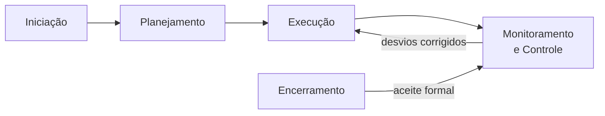

# Gerenciamento de Projetos

> [!info] Metadados
> **Disciplina:** Gestão e Governança de TI
> **Bloco:** 6.2 — Gestão e Governança de TI (FASE 6 — Segurança e Governança)
> **Tópico:** 1. Gerenciamento de Projetos
> **Subtópicos:** Tradicional (Waterfall/cascata) — fases sequenciais, WBS/EAP, cronograma · Híbrido — combinação de ágil e tradicional · Ágil — Scrum e Kanban como gestão de projetos · Métricas EVM — CPI, SPI, conceito básico de Valor Agregado
> **Pré-requisitos:** [[Metodologias-Ageis]] (Scrum/Kanban — fundamentos de gestão iterativa), [[Fundamentos-de-Seguranca]] (governança de segurança como contexto de projeto), [[DevOps-e-Controle-de-Versao]] (CI/CD como parte da execução de projetos de software)
> **Cargo:** Analista de TI — Perfil 3: Desenvolvimento de Software
> **Data:** 2026-09-01

---

## 1. Por que estudar gerenciamento de projetos?

Na Fase 4, você aprendeu *como* o código é escrito (PO, SM, TDD, CI/CD). Na Fase 6, a perspectiva muda: quem decide **o quê** construir, **em que ordem**, **com quanto** orçamento e **para quando** entregar? Essas são perguntas de **gerenciamento de projetos** — a disciplina que organiza o trabalho desde a ideia até o encerramento formal.

A DATAPREV é um caso emblemático. Ela desenvolve e mantém sistemas que processam **benefícios de milhões de cidadãos** — cada sistema é um projeto com prazo regulatório, orçamento definido, múltiplos stakeholders (INSS, MDS, Controladoria-Geral da União) e riscos que vão de atraso técnico a mudanças legislativas. Governar esses projetos não é opcional — é questão de sobrevivência institucional e cumprimento de obrigação legal.

> [!question] Pergunta orientadora
> Se o INSS solicita uma nova funcionalidade urgente em um sistema de benefícios, mas o orçamento do ano já está comprometido — o que acontece? Em um projeto bem gerenciado, há um processo de **controle de mudanças**, uma análise de impacto e uma decisão documentada. Em um projeto sem gestão, alguém improvisa e depois ninguém sabe por que estourou o orçamento. É exatamente isso que este tópico ensina: como **estruturar, planejar, executar, monitorar e encerrar** projetos de forma disciplinada.

Antes de mergulhar nos modelos, vale uma distinção que a FGV adora cobrar.

---

## 2. Projeto vs. Operação — a diferença fundamental

Um **projeto** é um esforço **temporário** (tem início e fim definidos) para criar um **produto, serviço ou resultado único** (não repetitivo). Uma **operação** é uma atividade **contínua e repetitiva** que mantém o negócio funcionando.

| Característica | Projeto | Operação |
|---|---|---|
| **Duração** | Temporária (início e fim definidos) | Contínua (sem fim definido) |
| **Produto** | Único (novo ou transformado) | Repetitivo |
| **Exemplo DATAPREV** | Desenvolver um novo sistema de cálculo de BPC | Manter o sistema de folha de pagamento rodando diariamente |

> [!warning] PEGADINHA — "Projeto é qualquer trabalho"
> A banca pode afirmar que "todas as atividades de TI são projetos". **Falso.** Manter um servidor ligado, rodar relatórios periódicos, dar suporte técnico — são **operações**, não projetos. Projeto implica **temporariedade** e **unicidade**. Essa distinção é o primeiro filtro que a FGV usa para eliminar alternativas incorretas.

A questão prática que se segue é: como você **organiza e controla** esse projeto? É aí que entram as abordagens de gerenciamento.

---

## 3. PMBOK — a referência do gerenciamento de projetos

O **PMBOK** (*Project Management Body of Knowledge*), publicado pelo **PMI** (*Project Management Institute*), é o guia de referência internacional. Ele define **cinco grupos de processos** e **dez áreas de conhecimento** (PMBOK 6ª edição; a 7ª é mais orientada a princípios, mas a 6ª ainda é a mais cobrada em concursos).

### 3.1 Os cinco grupos de processos

Os grupos representam as **fases lógicas** do ciclo de vida de qualquer projeto:

| Grupo | O que acontece | Pergunta-chave |
|---|---|---|
| **Iniciação** | Definir o projeto, obter autorização formal (Termo de Abertura) | *Por que fazer?* |
| **Planejamento** | Definir escopo, cronograma, custo, riscos, comunicação | *Como, quando, com quê?* |
| **Execução** | Coordenação de pessoas e recursos para realizar o plano | *Fazendo agora* |
| **Monitoramento e Controle** | Acompanhar, medir e corrigir desvios | *Está indo como planejado?* |
| **Encerramento** | Formalizar aceite, documentar lições aprendidas, fechar contratos | *Concluído e formalizado* |



> [!important] Monitoramento e Controle acontece durante todo o projeto
> Uma pegadinha clássica: a banca mostra os cinco grupos como fases sequenciais (iniciação → planejamento → execução → encerramento) e **esconde** o monitoramento/controle. Na prática, o monitoramento/controle ocorre **paralelamente** à execução — ele vigia se o projeto está dentro do que foi planejado e dispara correções quando não está.

### 3.2 Áreas de conhecimento (visão panorâmica)

O PMBOK 6ª edição define **dez áreas**: Gestão de Integração, Escopo, Cronograma, Custo, Qualidade, Recursos, Comunicações, Riscos, Aquisições e Stakeholders. Para a prova, não é necessário decorar as dez — mas você precisa saber que o PMBOK estrutura o gerenciamento por **áreas temáticas**, e que a ementa deste bloco aborda os conceitos nucleares (escopo, cronograma, custo) por meio do Waterfall e das métricas EVM.

---

## 4. Triângulo e Hexágono de Restrições

O **triângulo de restrições** é o modelo mais clássico: todo projeto equilibra três limites simultâneos — **escopo**, **tempo (prazo)** e **custo (orçamento)**. Alterar um afeta necessariamente os outros.

> [!question]
> Se o prazo é reduzido pela metade, o que acontece com escopo e custo? Para manter a qualidade, seria necessário **aumentar** recursos (custo) ou **reduzir** o escopo. Essa relação de trade-off é o cerne do gerenciamento.

A versão estendida — o **hexágono de restrições** — acrescenta **qualidade**, **risco** e **recursos** ao triângulo. Toda mudança de escopo/tempo/custo impacta também a qualidade, os riscos assumidos e a disponibilidade de recursos.

> [!tip] Para a prova
> Se a questão menciona apenas "escopo, tempo e custo", é o triângulo clássico. Se inclui qualidade, risco e recursos, é o hexágono. A lógica é a mesma: trade-off entre restrições. A FGV adora testar se o candidato entende que **nenhuma restrição é isolada**.

---

## 5. Tradicional (Waterfall / Cascata) — fases sequenciais completas

O modelo **Waterfall** (cascata) organiza o projeto em **fases sequenciais e completas**: cada fase só começa quando a anterior terminou 100%. O trabalho é **linear** — não há volta atrás sem retrabalho significativo.

### 5.1 As fases típicas do Waterfall

```text
Requisitos → Análise → Design → Implementação → Testes → Implantação → Manutenção
```

Cada fase gera **documentos de saída** que são **entrada** da próxima fase. O modelo é intuitivo, amplamente documentado e adequado quando os requisitos são **estáveis e bem compreendidos** desde o início.

### 5.2 WBS (Work Breakdown Structure) — Estrutura Analítica do Projeto

A **WBS** (no PMBOK brasileiro, chamada de **EAP — Estrutura Analítica do Projeto**) é a decomposição **hierárquica** do trabalho total do projeto em **pacotes menores e gerenciáveis**.

> [!question]
> Imagine construir um sistema de gestão de benefícios. O projeto inteiro é enorme — como dividi-lo? A WBS parte do **entregável principal** e vai desmembrando: Sistema → Módulo de Entrada → Tela de Recepção → Ficha de Cadastro. Cada nível de decomposição é mais específico e mais fácil de estimar, planejar e controlar.

A WBS é essencial porque:
- Torna o escopo **visível e mensurável**;
- É a base para estimativas de custo e prazo;
- É o insumo para o **cronograma**;
- Permite atribuir **responsabilidade** por pacote de trabalho.

> [!warning] PEGADINHA — WBS decomposição por entregáveis, não por fases
> A banca pode afirmar que "a WBS organiza o projeto por fases sequenciais". **Errado.** A WBS decompõe por **entregáveis** (produtos/resultados), não por fases do ciclo de vida. Decomposição por fases é o cronograma — a WBS é a decomposição do *escopo* em partes menores.

### 5.3 Cronograma — Gantt e Caminho Crítico (CPM)

O **cronograma** é o instrumento que organiza as atividades no **tempo**. Duas ferramentas clássicas:

**Diagrama de Gantt:**
- Barras horizontais representando atividades ao longo do tempo;
- Visual, intuitivo, mostra sobreposição e dependências;
- Não mostra explicitamente o impacto de atrasos (a menos que tenha redundância).

**Caminho Crítico (CPM — Critical Path Method):**
- Identifica a **sequência de atividades com menor folga** (zero);
- Qualquer atraso em atividades do caminho crítico **atrasa o projeto inteiro**;
- É a ferramenta que diz "qual atividade **não pode atrasar**"?

> [!tip] Folga (slack)
> Uma atividade tem **folga** quando pode atrasar sem afetar a data de término do projeto. O caminho crítico é justamente a sequência de atividades **sem folga**. Na prova, se a questão pergunta "quais atividades são críticas?", é aquela com folga zero.

---

## 6. Ágil como gestão de projetos

Você já estudou [[Metodologias-Ageis]] em profundidade (Scrum, Kanban, XP). Agora vamos reenxergar esses frameworks **sob a lente da gestão de projetos** — não como práticas de código, mas como **modelos de organização do trabalho**.

### 6.1 Scrum como modelo de gestão

O Scrum é um **framework iterativo e incremental**. Em vez de planejar tudo no início (como o Waterfall), ele divide o projeto em **sprints** (ciclos curtos de 1-4 semanas), cada uma produzindo um **incremento funcional**.

No contexto de gestão de projetos:
- O **Product Backlog** é o **escopo total** do projeto (vivo, adaptativo);
- Cada **Sprint Planning** é um mini-planejamento;
- O **Sprint Review** é o controle de qualidade do ciclo;
- A **Sprint Retrospective** é o aprendizado organizacional.

> [!question] Por que o Scrum é mais adequado quando o escopo muda?
> Porque o planejamento é **repetido a cada sprint**. Se o INSS muda uma regra de benefício no meio do projeto, o time incorpora isso no próximo ciclo — sem refazer um plano de 12 meses. No Waterfall, essa mudança exigiria refazer toda a análise e o design, gerando atraso e retrabalho.

### 6.2 Kanban como modelo de gestão

O Kanban é um sistema de **fluxo contínuo** — sem sprints, sem ciclos fixos. Ele gerencia projetos por meio de:
- **Tabuleiro visual** (colunas = estágios do fluxo);
- **WIP limits** (limite de trabalho em progresso por coluna);
- **Métricas de fluxo**: lead time (tempo total de entrega) e cycle time (tempo dentro do processo).

Na gestão de projetos, o Kanban é útil quando o trabalho é **contínuo e imprevisível** — como manutenção corretiva de sistemas DATAPREV, onde as demandas chegam sem aviso e precisam ser absorvidas no fluxo.

### 6.3 Ágil × Cascata — quando usar cada um

| Critério | Waterfall (Tradicional) | Ágil (Scrum/Kanban) |
|---|---|---|
| **Requisitos** | Estáveis e bem definidos desde o início | Dinâmicos, sujeitos a mudanças |
| **Entrega** | Uma entrega final (big-bang) | Entregas incrementais e frequentes |
| **Planejamento** | Detalhado no início | Adaptativo, a cada iteração |
| **Risco** | Descoberto tarde (nos testes) | Descoberto cedo (em cada sprint) |
| **Feedback do cliente** | No final do projeto | Ao longo de todo o projeto |
| **Custo de mudança** | Alto (retrabalho de fases anteriores) | Baixo (mudanças absorvidas no próximo ciclo) |

---

## 7. Híbrido — quando combinar é melhor que escolher

Na prática, muitos projetos **não são 100% Waterfall nem 100% ágeis**. O modelo **híbrido** combina elementos de ambos, adaptando-se à realidade do projeto.

> [!question]
> Por que não basta ser ágil em tudo? Porque existem projetos com requisitos regulatórios **estáveis** (leis que não mudam) e fases de infraestrutura que exigem planejamento formal — misturar Waterfall nessas fases com Scrum no desenvolvimento pode ser a escolha mais eficiente.

### 7.1 Padrões comuns de combinação

| Padrão | Quando se aplica | Exemplo DATAPREV |
|---|---|---|
| **Fases iniciais tradicionais + desenvolvimento ágil** | Requisitos claros na análise; desenvolvimento iterativo | Definir regras de negócio com o INSS (Waterfall) e construir o sistema em sprints (Scrum) |
| **Waterfall para entregas de infraestrutura; ágil para aplicação** | Infraestrutura exige planejamento rígido; aplicação é flexível | Montar ambiente de cloud (Waterfall); desenvolver módulos de app (Scrum) |
| **Scrum com marcos formais (stage-gates)** | Projeto exige aprovações formais por fase | Sprint review com aprovação formal da Controladoria a cada entrega significativa |

> [!important] O híbrido não é "fazer tudo pela metade"
> O híbrido é uma **decisão consciente**: em que fases a rigidez do Waterfall é necessária, e em que fases a adaptabilidade do ágil é vantajosa. A banca testa se o candidato entende que o híbrido **não é confusão** — é uma escolha fundamentada.

---

## 8. Métricas EVM — Valor Agregado (Earned Value Management)

O **EVM** (*Earned Value Management*) é uma técnica de controle que combina três dimensões — **escopo, custo e prazo** — em um único framework de medição. Ele responde à pergunta mais difícil do gerenciamento: **"estamos bem ou mal, e em quanto?"** — com dados, não com sensação.

> [!question] Por que EVM e não apenas comparar planejado × real?
> Porque comparar "gastei X vs planejei Y" ignora **quanto do trabalho foi efetivamente concluído**. O EVM introduz uma terceira variável — o valor do trabalho realizado — e a combinação das três dá uma visão precisa.

### 8.1 Os três valores básicos

| Sigla | Nome | O que representa |
|---|---|---|
| **PV** | Planned Value (Valor Planejado) | Quanto do trabalho **deveria** estar concluído até agora (segundo o plano) |
| **EV** | Earned Value (Valor Agregado) | Quanto do trabalho **foi efetivamente** concluído (em valor monetário) |
| **AC** | Actual Cost (Custo Real) | Quanto **foi gasto** de fato até agora |

**Exemplo numérico simplificado:**

Imagine um projeto com orçamento total de R$ 100.000, duração de 10 meses. No mês 5:
- **PV = R$ 50.000** (metade do orçamento deveria ter sido consumida, segundo o plano);
- **EV = R$ 40.000** (o trabalho concluído equivale a R$ 40.000 do valor total);
- **AC = R$ 45.000** (foi gasto R$ 45.000 até agora).

### 8.2 As métricas de desempenho

A partir desses três valores, calculam-se os **índices de desempenho** e as **variações**:

| Métrica | Fórmula | O que indica | Interpretação |
|---|---|---|---|
| **CPI** (Cost Performance Index) | EV / AC | Eficiência de custo | > 1 = abaixo do orçamento (bom); < 1 = estourou (ruim) |
| **SPI** (Schedule Performance Index) | EV / PV | Eficiência de prazo | > 1 = adiantado (bom); < 1 = atrasado (ruim) |
| **CV** (Cost Variance) | EV − AC | Desvio de custo | > 0 = economia; < 0 = estouro |
| **SV** (Schedule Variance) | EV − PV | Desvio de prazo | > 0 = adiantado; < 0 = atrasado |

**Continuando o exemplo:**
- CPI = 40.000 / 45.000 = **0,89** → abaixo de 1, ou seja, **estourou o orçamento** (gastou mais do que produziu);
- SPI = 40.000 / 50.000 = **0,80** → abaixo de 1, ou seja, **atrasado** (produziu menos do que deveria);
- CV = 40.000 − 45.000 = **−5.000** (prejuízo de R$ 5.000);
- SV = 40.000 − 50.000 = **−10.000** (atraso equivalente a R$ 10.000 de trabalho).

> [!warning] PEGADINHA CLÁSSICA — inverter CPI e SPI
> Esta é a armadilha mais lucrativa da FGV em EVM:
> - **CPI** é sobre **CUSTO** (C de Cost, C de CPI) → fórmula **EV/AC**;
> - **SPI** é sobre **PRAZO/CRONOGRAMA** (S de Schedule, S de SPI) → fórmula **EV/PV**.
>
> A banca adora inverter: "SPI mede eficiência de custo" — **errado**, é de prazo. Ou "CPI usa EV/PV" — **errado**, é EV/AC. Uma dica mnemotécnica: **C**PI → **C**usto → **C**ompara EV com AC (*Actual Cost*). **S**PI → **S**chedule → **S**e compara EV com PV (*Planned Value*).

> [!warning] PEGADINHA — "> 1 é bom para CPI e SPI"
> Nos dois índices (CPI e SPI), **> 1 = bom** (abaixo do orçamento ou adiantado) e **< 1 = ruim** (estouro ou atraso). A banca pode trocar a regra para confundir: "SPI > 1 indica atraso" — **errado**. Guarde: para CPI e SPI, **maior que 1 é sempre positivo**.

> [!tip] Regra de ouro para a prova
> Se a questão pede "qual é a eficiência de custo?", calcule **CPI = EV/AC**. Se pede "eficiência de prazo", calcule **SPI = EV/PV**. Se perguntar "o projeto está atrasado?", verifique se **SPI < 1**. Se perguntar "estourou o orçamento?", verifique se **CPI < 1**.

### 8.3 Exemplo contextualizado na DATAPREV

Imagine que a DATAPREV está desenvolvendo um novo módulo de cálculo de benefício previdenciário. No mês 3 de um projeto de 12 meses, com orçamento de R$ 800.000:
- PV = R$ 200.000 (25% do orçamento deveria ter sido consumido);
- EV = R$ 180.000 (o trabalho concluído equivale a R$ 180.000);
- AC = R$ 220.000 (foi gasto R$ 220.000).

Resultados:
- CPI = 180.000 / 220.000 = **0,82** (estouro de custo — cada real gasto produziu apenas 82 centavos de valor);
- SPI = 180.000 / 200.000 = **0,90** (leve atraso — produziu 90% do que deveria até agora);
- CV = 180.000 − 220.000 = **−40.000** (R$ 40.000 acima do planejado);
- SV = 180.000 − 200.000 = **−20.000** (R$ 20.000 de atraso em valor de trabalho).

Interpretando: o projeto está **atrasado e com estouro de orçamento**. Um gestor de projetos DATAPREV usaria esses dados para justificar uma **revisão de escopo** ou **renegociação de prazo** com o INSS — com números, não com impressões.

---

## 9. Tabela-resumo: modelos de gerenciamento

| Aspecto | Waterfall (Tradicional) | Ágil (Scrum/Kanban) | Híbrido |
|---|---|---|---|
| **Estrutura** | Fases sequenciais e completas | Iterações curtas ou fluxo contínuo | Combinação consciente |
| **Planejamento** | Detalhado e antecipado | Adaptativo, repetido | Parcialmente detalhado, parcialmente adaptativo |
| **Escopo** | Definido no início, controlado por mudança formal | Evolui a cada iteração | Depende da fase |
| **Ferramenta-chave** | WBS/EAP, Gantt, CPM | Backlog, tabuleiro, WIP limits | Ambas, conforme a fase |
| **Indicadores** | EVM (CPI/SPI) | Velocity, lead time, cycle time | Conforme o modelo adotado |
| **Risco de mudança** | Alto custo de retrabalho | Baixo custo (absorvido no próximo ciclo) | Intermediário |
| **Mais adequado quando** | Requisitos estáveis, contratos formais, regulação rígida | Requisitos dinâmicos, inovação, entrega contínua | Regulação rígida no início + desenvolvimento iterativo |

---

## 10. Conexões com o que você já viu

Este tópico amarra fios de várias fases:

- [[Metodologias-Ageis|Metodologias Ágeis]] (Fase 4): Scrum e Kanban foram estudados como *frameworks de desenvolvimento*; agora você os reenxerga como *modelos de gestão de projetos*. O Product Backlog é o escopo; o Sprint Planning é o planejamento; o incremento é a entrega.
- [[Fundamentos-de-Seguranca|Segurança da Informação]] (Fase 6.1): a governança de segurança define como projetos de TI devem lidar com riscos de segurança — e o EVM pode ser usado para monitorar o custo de mitigação de riscos.
- [[DevOps-e-Controle-de-Versao|DevOps]] (Fase 4.1): CI/CD é uma prática que se encaixa perfeitamente no ciclo ágil — a entrega contínua é o resultado prático de um projeto bem gerenciado em Scrum.
- [[Gestao-de-Riscos]] (Bloco 6.1): gestão de riscos de projeto e gestão de riscos de segurança se complementam — a avaliação de riscos é transversal ao gerenciamento de projetos, à ITIL e ao COBIT.

---

## 11. Palavras-chave e como a FGV cobra

- **Palavras-chave:** *projeto (temporário, único, entregável), operação, PMBOK, PMI, grupos de processos (iniciação, planejamento, execução, monitoramento/controle, encerramento), WBS/EAP, caminho crítico (CPM), Gantt, Waterfall (cascata), ágil, Scrum (como gestão), Kanban (como gestão), híbrido, triângulo de restrições, hexágono de restrições, EVM, PV (Planned Value), EV (Earned Value), AC (Actual Cost), CPI (Cost Performance Index), SPI (Schedule Performance Index), CV (Cost Variance), SV (Schedule Variance).*

**Formas de cobrança típicas:**

1. **Projeto vs. operação** — identificar se a situação descrita é um projeto (temporário, único) ou uma operação (contínua, repetitiva).
2. **Ciclos do PMBOK** — reconhecer os cinco grupos de processos e identificar em qual o projeto está; a banca adora esconder o monitoramento/controle como fase paralela.
3. **WBS vs. cronograma** — WBS organiza por *entregáveis*; cronograma organiza por *tempo*; não confundir.
4. **Caminho crítico** — atividade com folga zero; qualquer atraso nela atrasa o projeto inteiro.
5. **Ágil × Waterfall × híbrido** — qual modelo se adequa a cada cenário (requisitos estáveis = waterfall; requisitos dinâmicos = ágil; híbrido = ambos conforme a fase).
6. **EVM (CPI/SPI)** — fórmulas exatas, interpretação (> 1 = bom), e a armadilha de inverter CPI por SPI.

> [!warning] As cinco armadilhas mais rentáveis
> (1) **Projeto ≠ operação** — temporário e único é projeto; contínuo e repetitivo é operação. (2) **Monitoramento e controle não é uma fase que vem depois da execução** — é paralelo. (3) **WBS decompõe por entregáveis**, não por fases. (4) **CPI usa EV/AC** (custo); **SPI usa EV/PV** (prazo) — nunca inverter. (5) **> 1 é bom** para CPI e SPI — a banca pode trocar a regra.

---

## 12. Próximos passos

Você agora domina os fundamentos do gerenciamento de projetos — os modelos tradicional, ágil e híbrido, as ferramentas de planejamento e controle, e as métricas EVM. No próximo tópico do Bloco 6.2, avançamos para o [[ITIL-v4|ITIL v4]] — o framework que detalha como os *serviços de TI* são estrategicamente gerenciados ao longo do seu ciclo de vida. A conexão é direta: os projetos que você estudou aqui *entregam* os serviços que o ITIL gerencia depois.

Após o ITIL, o [[COBIT-2019|COBIT 2019]] fechará o tripé de governança, posicionando-se como o framework que conecta governança corporativa à gestão de TI — sustentando tudo o que você estudou neste tópico com uma estrutura normativa reconhecida globalmente.
