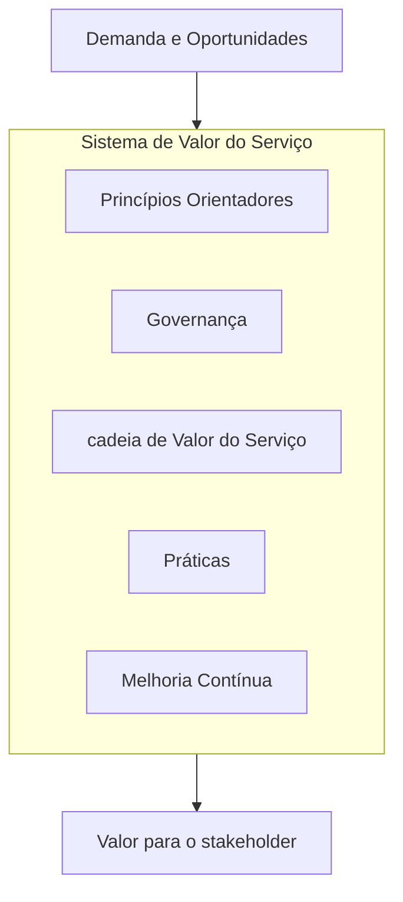

# ITIL v4

> [!info] Metadados
> **Disciplina:** Gestão e Governança de TI
> **Bloco:** 6.2 — Gestão e Governança de TI (FASE 6 — Segurança e Governança)
> **Tópico:** 2. ITIL v4
> **Subtópicos:** Conceito de serviço de TI · Dimensões da gestão de serviços (organização e pessoas, informação e tecnologia, parceiros e suprimentos, valor e fluxos de serviço) · Práticas: gestão de incidentes, gestão de problemas, gestão de mudanças, gestão de serviço de segurança · Ciclo de vida do serviço: estratégia, desenho, transição, operação, melhoria contínua · Sistema de Valor do Serviço (SVS) · Princípios orientadores
> **Pré-requisitos:** [[Metodologias-Ageis]] (processos ágeis e ciclos de entrega), [[Fundamentos-de-Seguranca]] (tríade CID, gestão de incidentes de segurança, ISO 27001/27002), [[Gerenciamento-de-Projetos]] (projetos entregam os serviços que o ITIL gerencia), Visão panorâmica dos módulos anteriores (Redes, Banco de Dados, Desenvolvimento, Segurança)
> **Cargo:** Analista de TI — Perfil 3: Desenvolvimento de Software
> **Data:** 2026-09-01

## 1. Por que estudar ITIL v4?

Na Fase 6, o Bloco 6.1 abriu com os fundamentos da segurança da informação — a tríade CID, as normas ISO e a ideia de que segurança exige **gestão estruturada**. O [[Fundamentos-de-Seguranca|Bloco 6.1]] mostrou que políticas, normas e procedimentos formam uma hierarquia. Mas quem define **como** os serviços de TI são planejados, entregues, operados e melhorados continuamente? É aqui que entra a **ITIL**.

A ITIL (*Information Technology Infrastructure Library*) é o framework **mais cobrado** pela FGV neste bloco — a própria ementa registra essa ênfase. Ela responde a uma pergunta concreta: como uma organização como a **DATAPREV** — que mantém dezenas de sistemas críticos da seguridade social, atendendo milhões de cidadãos — garante que seus serviços de TI funcionem, sejam previsíveis e melhorem ao longo do tempo?

> [!question]
> Pense: um sistema de consulta de benefícios cai às 8h da manhã, no horário de pico. O que acontece? Usuários ligam para o suporte, os técnicos precisam restaurar o serviço rapidamente, depois alguém precisa entender *por que* caiu e como evitar que caia de novo. Esse ciclo — detectar, restaurar, analisar, prevenir — não é improvisação: é um **processo gerido**. A ITIL dá o nome e a estrutura para cada etapa desse ciclo.

Este tópico se conecta com as [[Metodologias-Ageis|metodologias ágeis]] que você já estudou (ciclos curtos, entrega contínua) e com a [[Fundamentos-de-Seguranca|segurança da informação]] (gestão de incidentes, serviço de segurança). A ementa também menciona que a conexão ITIL × Segurança é uma **pegadinha comum** — vamos detalhar.

---

## 2. O que é ITIL?

A ITIL é um conjunto de **melhores práticas** para a **gestão de serviços de TI** (ITSM — *IT Service Management*). Ela não é um padrão certificável (como as ISO), nem um framework rígido — é um **guia de referência** que organiza como uma organização deve planejar, entregar, operar e melhorar seus serviços de tecnologia.

### 2.1 Evolução: v3 → v4

A ITIL passou por várias versões. Para a prova, a transição v3 → v4 é essencial:

| Aspecto | ITIL v3 (2011) | ITIL v4 (2019) |
|---|---|---|
| **Estrutura central** | Ciclo de vida do serviço em **5 fases** | **Sistema de Valor do Serviço (SVS)** |
| **Unidades** | Processos (26 processos) | **Práticas** (34 práticas) |
| **Visão** | Fases sequenciais/iterativas do ciclo de vida | Ecossistema de componentes interdependentes |
| **Foco** | Gestão de processos | Criação de valor, cultura, princípios orientadores |
| **Dimensões** | 4 Ps (People, Process, Products, Partners) | 4 Dimensões (organização e pessoas, informação e tecnologia, parceiros e suprimentos, valor e fluxos de serviço) |

> [!important] A ementa mistura terminologia v3 e v4
> A ementa do concurso menciona **"ciclo de vida do serviço"** (conceito da v3: estratégia, desenho, transição, operação, melhoria contínua) **E** também **"práticas"** e **"dimensões"** (conceitos da v4). Isso significa que a prova pode usar terminologia **híbrida** — você precisa dominar **ambas** as versões. A ITIL v4 não abandonou o ciclo de vida; ela o absorveu dentro do SVS. Mas a banca pode cobrar o ciclo de vida das fases da v3 como se fosse v4. Dominar os dois é a estratégia mais segura.

### 2.2 Por que a ITIL v4 é diferente?

Enquanto a v3 descrevia o ciclo de vida em **fases sequenciais** (Estratégia → Desenho → Transição → Operação → Melhoria), a v4 adotou uma visão de **sistema**: o valor não emerge de fases, mas da interação entre **princípios orientadores, governança, cadeia de valor, práticas e melhoria contínua** — todos operando simultaneamente.

> [!question]
> A v3 desenhava o ciclo de vida como uma sequência lógica. A v4 diz: na prática, essas atividades acontecem **ao mesmo tempo**, em paralelo, interdependentes. Qual visão é mais fiel à realidade de uma empresa como a DATAPREV, onde a estratégia, a operação e a melhoria acontecem simultaneamente em dezenas de sistemas? A v4. Mas a v3 ainda aparece em provas — fique atento ao formato da questão.

---

## 3. Conceito de serviço de TI

Antes de entender a ITIL, é preciso entender o que ela gestiona. Um **serviço de TI** é um meio de **entregar valor ao cliente** ao facilitar os resultados que ele deseja alcançar, sem que ele arque com custos e riscos específicos.

> [!question]
> Quando um servidor de e-mail da DATAPREV funciona, o usuário do INSS não precisa se preocupar com infraestrutura, rede, backup ou segurança dos dados — ele apenas usa o serviço. O serviço de TI **oculta a complexidade** e entrega o resultado (e-mail funcionando). Isso é **entregar valor facilitando resultados sem custos/riscos adicionais** para o usuário.

### 3.1 Utilidade e Garantia — os dois componentes do valor

O valor de um serviço de TI é composto por dois elementos:

| Componente | Significado | Exemplo |
|---|---|---|
| **Utilidade** (*fitness for purpose*) | A **funcionalidade** oferecida pelo serviço — o que ele faz pelo usuário | O sistema de benefícios calcula, armazena e consulta dados corretamente |
| **Garantia** (*fitness for use*) | A **confiança** de que o serviço funcionará conforme esperado — disponibilidade, capacidade, continuidade, segurança | O sistema está disponível 24/7, suporta milhares de acessos simultâneos e protege os dados |

> [!warning] PEGADINHA — utilidade vs. garantia
> A banca adora trocar os conceitos: "a **utilidade** é a garantia de disponibilidade" — **errado**; utilidade é funcionalidade (o que o serviço faz). "A **garantia** é a funcionalidade oferecida" — **errado**; garantia é a confiança de que vai funcionar (disponibilidade, capacidade, segurança). Guarde: **utilidade = funcionalidade**; **garantia = confiabilidade**. Um serviço pode ter alta funcionalidade (utilidade) mas cair sempre (baixa garantia) — e vice-versa. Para gerar valor, precisa de **ambos**.

---

## 4. As 4 dimensões da gestão de serviços

A ITIL v4 identifica **4 dimensões** que devem ser consideradas para que um serviço de TI funcione adequadamente. Na v3, essas eram os "4 Ps" (*People, Process, Products, Partners*). Na v4, foram renomeadas e redefinidas:

| Dimensão | O que cobre | Exemplo DATAPREV |
|---|---|---|
| **Organizações e pessoas** | Estrutura organizacional, papéis, competências, cultura, treinamento | Equipe de operações, equipe de desenvolvimento, gestores de segurança, CISO |
| **Informação e tecnologia** | Sistemas, redes, bancos de dados, ferramentas, dados gerenciados | SAP, sistemas do INSS, banco de dados de benefícios, infraestrutura em nuvem |
| **Parceiros e suprimentos** | Fornecedores, contratos, parceiros estratégicos, prestadores de serviço | Empresas de hospedagem, fornecedores de licenças, auditorias externas |
| **Valor e fluxos de serviço** | Processos, fluxos de trabalho, cadeia de valor, como o valor é entregue ao cliente | Processo de atendimento de benefícios, fluxo de aprovação de mudanças |

> [!tip] Mapeamento v3 → v4
> Os "4 Ps" da v3 ainda aparecem em muitas questões: **P**eople (→ Organizações e pessoas), **P**rocess (→ Valor e fluxos de serviço), **P**roducts/Technology (→ Informação e tecnologia), **P**artners (→ Parceiros e suprimentos). Se a questão usar a terminologia da v3, você consegue mapear para a v4.

---

## 5. Sistema de Valor do Serviço (SVS)

O **SVS** (*Service Value System*) é a espinha dorsal da ITIL v4. Ele descreve **como a organização cria valor** ao transformar demandas e oportunidades em resultados para o cliente.

O SVS é composto por cinco componentes:

1. **Princípios orientadores** — sete princípios que guiam as decisões e ações da organização (focar no valor; começar de onde você está; progredir iterativamente com feedback; colaborar e promover visibilidade; pensar e trabalhar holisticamente; manter-se simples e prático; otimizar e automatizar).
2. **Governança** — estrutura de direção e controle que garante que tudo esteja alinhado com os objetivos estratégicos.
3. **Cadeia de valor do serviço** — conjunto de atividades interconectadas que criam valor (planejar, melhorar, engajar, projetar e transicionar, obter/construir, entregar e suportar).
4. **Práticas** — 34 práticas de gestão organizadas em três categorias: práticas gerais, práticas de serviço e práticas técnicas.
5. **Melhoria contínua** — ciclo permanente de melhoria que permeia todos os outros componentes.

> [!note] A cadeia de valor vs. o ciclo de vida
> Na v3, o ciclo de vida era composto por 5 fases sequenciais. Na v4, a **cadeia de valor** substituiu esse modelo por atividades que podem ser executadas em qualquer ordem, simultaneamente, dependendo da necessidade. A ementa menciona o "ciclo de vida" (v3) — se a questão usar esse termo, entenda que se refere às fases: **Estratégia → Desenho → Transição → Operação → Melhoria contínua**.

---

## 6. Práticas de gestão — o coração da cobrança

A ementa foca em **quatro práticas** específicas. Elas são o mais cobrado dentro de ITIL v4 pela FGV. Vamos a cada uma com profundidade.

### 6.1 Gestão de incidentes

A **gestão de incidentes** tem um objetivo claro: **restaurar o serviço normal o mais rápido possível** ao menor custo. Um *incidente* é qualquer interrupção não planejada ou redução na qualidade de um serviço de TI.

> [!question]
> O sistema de consulta de benefícios do INSS cai. Usuários não conseguem acessar. A equipe de suporte recebe o chamado e trabalha para restaurar o acesso. Isso é gestão de incidentes. O foco é **velocidade**: quanto mais rápido o serviço voltar, menor o impacto no negócio.

Princípios-chave da gestão de incidentes:
- O incidente é registrado, classificado e direcionado para a equipe adequada;
- O **objetivo não é descobrir a causa raiz** — é restaurar o serviço (essa é a gestão de problemas);
- Um incidente pode ser resolvido com uma **solução de contorno** (*workaround*) sem que a causa raiz seja eliminada;
- Após a restauração, o incidente é registrado para análise posterior.

### 6.2 Gestão de problemas

A **gestão de problemas** investiga a **causa raiz** de incidentes recorrentes ou potenciais. Enquanto a gestão de incidentes é **reativa e rápida**, a gestão de problemas é **analítica e preventiva**.

> [!warning] PEGADINHA CLÁSSICA — Incidente vs. Problema
> A diferença entre incidente e problema é uma das **mais cobradas** pela FGV em ITIL. A banca adora trocar os conceitos ou descrever um cenário e pedir para identificar se se trata de gestão de incidentes ou de problemas.
>
> - **Incidente** = interrupção ou degradação de um serviço que já está rodando. Ação: **restaurar** o serviço o mais rápido possível.
> - **Problema** = a causa de um ou mais incidentes (ou a causa potencial de incidentes futuros). Ação: **investigar e eliminar** a causa raiz.
>
> Exemplo: o sistema cai toda segunda-feira às 8h. Cada queda é um **incidente**. O fato de ser toda segunda-feira às 8h é um **problema** que precisa ser investigado (sobrecarga? job agendado mal configurado?). A gestão de problemas busca eliminar a causa para que os incidentes parem de acontecer.

| Aspecto | Gestão de incidentes | Gestão de problemas |
|---|---|---|
| **Objetivo** | Restaurar o serviço rapidamente | Descobrir e eliminar a causa raiz |
| **Foco** | Velocidade e disponibilidade | Análise e prevenção |
| **Ação típica** | Solução de contorno (*workaround*) | Correção definitiva (*known error* + solução permanente) |
| **Reatividade** | Reativa (incidente já aconteceu) | Reativa ou proativa (pode prevenir incidentes futuros) |
| **Registro** | Incidente registrado | Problema registrado → pode gerar mudança |

> [!tip] "Incidentes causam problemas" ou "problemas causam incidentes"?
> **Problemas causam incidentes** — não o contrário. Um problema (ex.: falha de design no banco de dados) gera múltiplos incidentes (quedas recorrentes). A banca pode inverter essa relação para confundir. Lembre-se: o problema é a **causa**, o incidente é o **sintoma**.

### 6.3 Gestão de mudanças

A **gestão de mudanças** (ou *Enablement and Direction*, na v4) controla o ciclo de vida de todas as mudanças, garantindo que elas sejam feitas de forma **padrão, minimizando riscos e impactos** nos serviços existentes.

> [!question]
> Se a gestão de problemas descobriu que a causa das quedas recorrentes é uma configuração do banco de dados, como essa correção é aplicada? Não é "ligar e arrumar" — é uma **mudança** que precisa ser avaliada, aprovada, testada e implantada controladamente. É a gestão de mudanças que garante isso.

Princípios-chave:
- Toda mudança passa por uma **avaliação de risco** antes de ser aprovada;
- Existem categorias de mudança: **padrão** (pré-aprovada, baixo risco), **normal** (precisa de avaliação e aprovação), **urgente** (fora do processo normal, por razões de segurança ou continuidade);
- A mudança é registrada, avaliada, aprovada, testada e implantada — e depois revisada;
- Uma mudança mal gerenciada pode **causar** incidentes — por isso a gestão de mudanças existe.

### 6.4 Gestão de serviço de segurança da informação

A **gestão de serviço de segurança da informação** (*Information Security Management*) integra a segurança aos serviços de TI, garantindo que a **confidencialidade, integridade e disponibilidade** (a tríade CID) sejam mantidas em todos os serviços.

> [!important] Conexão direta com [[Fundamentos-de-Seguranca]]
> A gestão de serviço de segurança da ITIL é o **braço operacional** da segurança da informação que você estudou no [[Fundamentos-de-Seguranca|Bloco 6.1]]. Lá você viu a tríade CID como conceito; aqui ela se materializa como uma **prática de gestão** dentro do framework de serviço. A ISO 27001 (SGSI) e a ITIL v4 são **complementares**: a ISO define *o quê* exigir em segurança; a ITIL define *como* integrar isso à operação do serviço.

Princípios-chave:
- A segurança não é "camada extra" — ela é **integrada** ao ciclo de vida do serviço;
- Cada prática de gestão (incidentes, problemas, mudanças) tem um **componente de segurança**;
- A gestão de serviço de segurança garante que mudanças não introduzam vulnerabilidades e que incidentes de segurança sejam tratados pelo processo de gestão de incidentes.

> [!warning] PEGADINHA — Incidente de TI vs. Incidente de Segurança
> A ementa aponta que a conexão entre gestão de incidentes de TI e gestão de incidentes de segurança é uma **pegadinha comum**. Na ITIL, a **gestão de incidentes** (prática de serviço) já abrange incidentes de segurança — eles são tratados como qualquer outro incidente, com os mesmos processos (registro, classificação, restauração). O que muda é que um incidente de segurança (ex.: tentativa de invasão, vazamento de dados) pode ter **impactos adicionais** na confidencialidade e integridade (além da disponibilidade). Não existe um "processo separado" para incidentes de segurança na ITIL — é a **mesma gestão de incidentes**, com a devida atenção aos impactos de segurança.
>
> Se a questão perguntar "qual prática da ITIL trata incidentes de segurança?", a resposta é **gestão de incidentes** (complementada pela gestão de serviço de segurança, que garante que o tratamento considere a tríade CID).

---

## 7. Ciclo de vida do serviço (herança v3)

Embora a ITIL v4 substitua o ciclo de vida pelo SVS, a ementa menciona explicitamente as **5 fases** — portanto, é obrigatório dominá-las:

| Fase | O que acontece | Exemplo |
|---|---|---|
| **Estratégia** | Define **o quê** a organização deve oferecer e **por quê**; alinhamento com o negócio | Definir que a DATAPREV vai oferecer um novo serviço de consulta unificada de benefícios |
| **Desenho** | **Projeta** o serviço (arquitetura, processos, métricas, segurança) | Projetar a arquitetura do novo sistema, definir SLAs, desenhar a segurança |
| **Transição** | **Implanta** o serviço (testes, validação, migração, gestão de mudanças) | Testar em homologação, aprovar mudanças, migrar dados, ir para produção |
| **Operação** | **Opera** o serviço no dia a dia (gestão de incidentes, problemas, requisições) | Monitorar, atender chamados, resolver incidentes, gerenciar mudanças rotineiras |
| **Melhoria contínua** | **Aprimora** o serviço ao longo do tempo, identificando oportunidades e implementando melhorias | Analisar métricas de incidentes, propor otimizações, adaptar a demandas mudando |

> [!note] A ementa cobra o ciclo de vida como v3
> Se a questão mencionar "ciclo de vida do serviço" e listar as cinco fases, está usando terminologia da v3. Responda com base nessas fases. Se a questão mencionar "práticas", "dimensões" ou "SVS", está na v4. A chave é identificar **qual terminologia a questão usa** e responder no vocabulário correspondente.

---

## 8. Melhoria contínua

A melhoria contínua é um dos pilares da ITIL — tanto na v3 quanto na v4. O modelo de melhoria contínua da ITIL segue uma sequência estruturada:

1. **Definir a visão** — o que a organização quer alcançar
2. **Onde estamos?** — avaliação do estado atual
3. **Onde queremos chegar?** — metas e objetivos específicos
4. **Como chegar?** — plano de ação com etapas concretas
5. **Agir** — implementar as mudanças
6. **Verificar** — medir se os resultados foram alcançados
7. **Integrar** — incorporar as melhorias ao processo contínuo

> [!question]
> Esse modelo lembra algo que você já viu? O **PDCA** (*Plan–Do–Check–Act*) da [[Fundamentos-de-Seguranca|ISO 27001]] segue uma lógica similar: planejar, fazer, verificar e agir. A melhoria contínua da ITIL e o PDCA da ISO são **complementares** — ambos sustentam a ideia de que a gestão não é um evento único, mas um **ciclo permanente**. A FGV adora explorar essa conexão entre frameworks.

---

## 9. Os 7 princípios orientadores da ITIL v4

Os princípios orientadores são diretrizes universais que guiam decisões em qualquer contexto. Os sete são:

1. **Focar no valor** — tudo que a organização faz deve gerar valor para o stakeholder
2. **Onde estamos agora** — começar avaliando a situação atual (não pular para soluções)
3. **Progredir iterativamente com feedback** — avançar em ciclos curtos, coletando feedback
4. **Colaborar e promover visibilidade** — trabalho conjunto e transparência
5. **Pensar e trabalhar holisticamente** — enxergar o todo, não apenas partes isoladas
6. **Simples e prático** — evitar complexidade desnecessária
7. **Otimizar e automatizar** — primeiro otimizar o processo, depois automatizar

> [!tip] Conexão com ágil
> Note que os princípios 3, 4 e 5 dialogam diretamente com as [[Metodologias-Ageis|metodologias ágeis]]: iteração com feedback (Sprint), colaboração (Manifesto Ágil) e visão holística. A ITIL v4 incorporou aprendizados do ágil de forma explícita.

---

## 10. Conexões com o restante da ementa

Este tópico amarra fios de várias fases:

- **[[Fundamentos-de-Seguranca|Segurança da Informação]]** (Bloco 6.1): a tríade CID se materializa na gestão de serviço de segurança da ITIL; a ISO 27001/27002 e o PDCA são complementares ao SVS e à melhoria contínua.
- **[[Metodologias-Ageis|Metodologias Ágeis]]** (Bloco 4.2): os princípios orientadores da ITIL v4 dialogam com o Manifesto Ágil; a ideia de ciclos curtos e feedback ecoa o Scrum.
- **[[DevOps-e-Controle-de-Versao|DevOps]]** (Bloco 4.1): a integração contínua e a entrega contínua são práticas que complementam a gestão de mudanças e a transição de serviços.
- **[[Gestao-de-Riscos|Gestão de Riscos]]** (Bloco 6.1): a avaliação de risco é parte fundamental da gestão de mudanças; continuidade de serviço é tema compartilhado.

---

## 11. Palavras-chave e como a FGV cobra

- **Palavras-chave:** *serviço de TI, ITIL, ITSM, SVS, ciclo de vida, utilidade (fitness for purpose), garantia (fitness for use), 4 dimensões, gestão de incidentes, gestão de problemas, gestão de mudanças, gestão de serviço de segurança, cadeia de valor, práticas, princípios orientadores, melhoria contínua, PDCA, v3 vs. v4, workaround, known error.*

**Formas de cobrança típicas:**

1. **Incidente vs. Problema** — a banca descreve um cenário e pede para classificar: se o serviço caiu e precisa ser restaurado → incidente; se alguém investiga *por que* caiu recorrentemente → problema. A relação é: **problemas causam incidentes**.
2. **Utilidade vs. Garantia** — questão conceitual pedindo qual é funcionalidade e qual é confiabilidade. Trocar uma pela outra é a pegadinha mais comum.
3. **Terminologia v3 vs. v4** — a questão pode usar "ciclo de vida" (v3), "SVS" (v4), "4 Ps" (v3) ou "4 dimensões" (v4). Identificar a versão ajuda a escolher a resposta correta.
4. **Gestão de mudanças: categorias** — padrão (pré-aprovada), normal (avaliação), urgente (fora do processo). A banca descreve um cenário e pede para classificar a mudança.
5. **ITIL × Segurança** — a gestão de serviço de segurança integra CID aos serviços; incidentes de segurança são tratados pela gestão de incidentes (prática de serviço). Não existe "processo separado" para incidentes de segurança na ITIL.
6. **Princípios orientadores** — a banca pode listar princípios e pedir qual NÃO faz parte dos sete.

> [!warning] PEGADINHA — as cinco armadilhas mais rentáveis
> 1. **Incidente ≠ Problema** — incidente é sintoma (restaurar); problema é causa (investigar). Trocar os dois é a pegadinha #1.
> 2. **Utilidade ≠ Garantia** — utilidade é funcionalidade; garantia é confiabilidade. A banca troca.
> 3. **ITIL v3 ≠ ITIL v4** — se a questão usa "ciclo de vida", está na v3; se usa "SVS" e "práticas", está na v4. Misturar terminologia é intencional da banca.
> 4. **Gestão de mudanças não é "fazer qualquer mudança"** — é um processo controlado com avaliação de risco e aprovação.
> 5. **Incidentes de segurança não têm "processo separado"** — são tratados pela gestão de incidentes, com atenção especial aos impactos de CID.

---

## 12. Próximos passos

Domina a ITIL v4? Agora avance para o **Tópico 3 — [[COBIT-2019|COBIT 2019]]**, onde você aprenderá o framework de **governança e gestão de TI**. Enquanto a ITIL foca na **gestão de serviços** (como entregar e operar serviços com qualidade), o COBIT foca na **governança** (como direcionar e controlar a TI alinhada aos objetivos do negócio). A relação entre ITIL e COBIT é uma das mais cobradas: ITIL = serviço; COBIT = governança. Os dois se complementam — e a FGV adora testar essa distinção.
