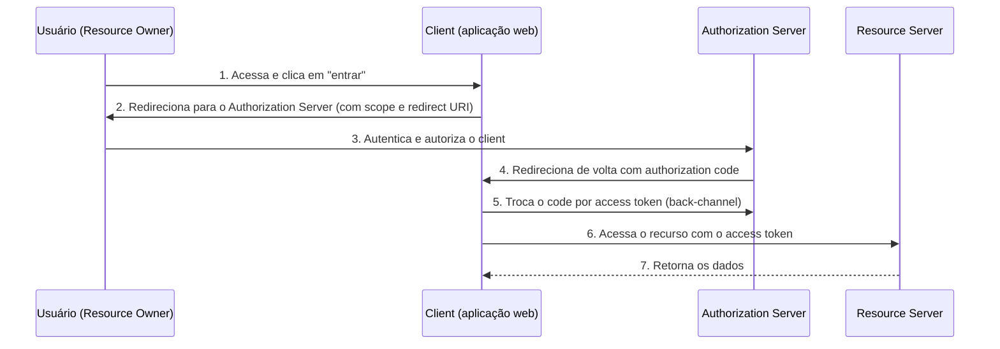

# Autenticação e Autorização

> [!info] Metadados
> **Disciplina:** Segurança da Informação
> **Bloco:** 6.1 — Segurança da Informação (FASE 6 — Segurança e Governança)
> **Tópico:** 2. Autenticação e Autorização
> **Subtópicos:** OAuth2 (fluxos: Authorization Code, Client Credentials, PKCE, implicit) · SSO (conceito, SAML, OpenID Connect) · JWT (estrutura, validade, refresh tokens) · MFA (conceito, fatores, OTP/TOTP)
> **Pré-requisitos:** [[Fundamentos-de-Seguranca]] (confidencialidade e integridade como pilares do acesso), [[Seguranca-de-Comunicacoes]] (HTTPS/TLS, certificados, mTLS), [[Frameworks-Java]] (Spring Security/autenticação de APIs), [[Padroes-de-Projeto-e-Arquitetura]] (APIs RESTful e integração entre sistemas)
> **Cargo:** Analista de TI — Perfil 3: Desenvolvimento de Software
> **Data:** 2026-08-31

## 1. Por que estudar autenticação e autorização?

No tópico anterior você estabeleceu a tríade CID: a confidencialidade garante que só quem tem permissão acessa os dados. Mas surge uma pergunta imediata: **como um servidor sabe *quem* está pedindo, e se essa pessoa tem *permissão* para obter o que pediu?** São duas perguntas — *quem você é* (autenticação) e *o que você pode fazer* (autorização) — e a FGV cobra fortemente essa distinção em vários protocolos.

Pense no universo DATAPREV: um cidadão quer consultar seu benefício em um portal. O sistema precisa (1) **autenticar** que é realmente o cidadão (não outra pessoa com seus dados), e (2) **autorizar** que aquele cidadão acesse *apenas seus próprios* dados — e não os da vizinha. E, quando o portal consulta uma API do INSS em nome do cidadão, não é o usuário digitar senha de novo: é o sistema "se apresentando" autorizado. É exatamente esse cenário que **OAuth2**, **OpenID Connect**, **JWT** e **SSO** resolvem.

Na Fase 4, o [[Frameworks-Java|Bloco 4.1]] apresentou **Spring Security** quando você estudou APIs RESTful. Na Fase 5, o [[Seguranca-de-Comunicacoes|Bloco 5.3]] mencionou **OAuth2**, **JWT** e o recíproco **mTLS** como temas que seriam aprofundados na Fase 6. Este tópico cumpre essas duas promessas.

> [!warning] PEGADINHA CENTRAL — Autenticação × Autorização
> **Autenticação** responde *"quem é você?"* (comprova a identidade: login e senha, certificado, biometria). **Autorização** responde *"o que você pode fazer?"* (define permissões sobre recursos: ler, escrever, executar). A pegadinha clássica é dizer que "ter um token OAuth2 **autentica** o usuário" — OAuth2 **autoriza**, não autentica (quem fornece identidade é o OpenID Connect).

## 2. OAuth2 — delegação de autorização

### 2.1 A ideia central

**OAuth2** é um **protocolo de delegação de autorização**. A palavra **delegação** é crucial. Ele permite que um aplicativo (cliente) acesse recursos em nome de um usuário **sem** obter a senha desse usuário. Em vez disso, o sistema solicita a um **servidor de autorização** uma permissão que será representada por um **token**.

> [!question]
> Você usa "Entrar com Google" em um site. Por que seria ruim o site pedir sua senha do Google? Porque você entregaria a um terceiro a chave de acesso a *tudo* da sua conta Google. Como resolver? Deixando você conceder ao site uma **permissão limitada e revogável**, sem revelar a senha — é a delegação do OAuth2.

A base jurídica/conceitual: OAuth2 separa **identidade** (quem você é) da **autorização** (o que um aplicativo pode fazer). Isso conecta com o **princípio do menor privilégio** — um tema de segurança que você também vê na gestão de acesso.

### 2.2 Os papéis (atores) do OAuth2

| Papel | O que é | Exemplo |
|---|---|---|
| **Resource Owner** (dono do recurso) | O usuário que possui os dados/recursos | O cidadão dono do benefício |
| **Client** (cliente) | O aplicativo que quer acessar os recursos *em nome* do dono | O portal web ou app mobile |
| **Authorization Server** (servidor de autorização) | Emite tokens de acesso após autenticar/autorizar | Serviço central de identidade do gov.br |
| **Resource Server** (servidor de recursos) | Hospeda e protege os recursos; valida o token | API do INSS que serve o benefício |

> [!tip] Os quatro atores são cobrados
> Memorie a assinatura de cada papel: quem *possui* (Resource Owner), quem *pede* (Client), quem *emite* (Authorization Server), quem *protege/serve* (Resource Server). A FGV mistura essas definições; identificá-los é meio caminho para acertar a questão.

### 2.3 Conceito de scopes (escopos)

Um **scope** delimita **o quê** um token autoriza: perguntas como "leitura do benefício", "atualização do nome". São como *permissões granuladas*. Um token só carrega as permissões *granted*. Isso materializa o **menor privilégio**: o aplicativo pede apenas o que precisa (ex.: scope de leitura, não de exclusão).

### 2.4 Os fluxos (grants) do OAuth2 — o foco da prova

A ementa é taxativa: **OAuth2 é cobrado com foco nos fluxos — entender Authorization Code vs. Client Credentials.** Vamos a cada um.

#### Authorization Code (Authorization Code Grant)
É o fluxo **mais comum e mais seguro** para aplicações **web** com *back-end*, quando há interação com o usuário. Passos resumidos:

1. O usuário acessa o **client** (site) e clica em "entrar".
2. O client **redireciona** o usuário ao **authorization server**, indicando o **scope** desejado e o **redirect URI**.
3. O usuário se **autentica** no servidor de autorização e **autoriza** o client.
4. O servidor redireciona de volta ao client com um **authorization code** (um código de curta duração).
5. O client troca esse **code** por um **access token** (chamada de *back-channel*, de servidor para servidor, não passa pelo navegador).
6. O client usa o **access token** para acessar o resource server.



> [!warning] PEGADINHA — Por que o "code" existe
> O `authorization code` existe para que o **access token nunca passe pelo navegador** do usuário. Se o token fosse entregue direto no redirect (URL), ele vazaria no histórico/log e em cabeçalhos referrer. A troca `code → token` ocorre em **canal de servidor para servidor (back-channel)**. Quando a FGV pergunta "quem obtém o access token no authorization code", a resposta é o **client (server-side)**, não o navegador.

#### Authorization Code + PKCE
**PKCE** (*Proof Key for Code Exchange*, pronuncia-se "pixie") é um reforço usado principalmente por **aplicações mobile e SPA (frontend sem back-end seguro)**, que não conseguem guardar um segredo de client. O client gera um *code verifier* e envia um *code challenge* no pedido inicial; na troca do code, envia o *verifier*, que o servidor confere. Impossibilita que um atacante que intercepte o code o utilize (porque não tem o verifier). Ementa pede o conceito: **PKCE = proteção no fluxo Authorization Code, para clients públicos (mobile/SPA)**.

#### Client Credentials (Client Credentials Grant)
Fluxo **sem usuário intermediário** — **máquina a máquina** (M2M). Aqui o **client é o próprio resource owner**: não há usuário interagindo.

- Cenário: um serviço *backend* (ex.: serviço de folha) precisa acessar outra API (ex.: API de cadastro) **por conta própria**, em nome da organização, não de um cidadão.
- O client envia suas **credenciais** (*client id* + *client secret*) diretamente ao authorization server e recebe um **access token**.
- Não há redirect, não há autorização de usuário.

| Fluxo | Há usuário? | Uso típico | Segurança adicional |
|---|---|---|---|
| **Authorization Code** | Sim | Aplicação web com back-end | + PKCE para mobile/SPA |
| **Client Credentials** | Não (M2M) | Serviço acessando outra API | Usa client secret |
| **Implicit** (legado) | Sim | (desencorajado) token direto no URI | — |

> [!warning] PEGADINHA — Authorization Code × Client Credentials
> A ementa pede explicitamente essa diferenciação. Autorização **com interação do usuário** (web/mobile, `code` → `token`) = **Authorization Code**. Autorização **máquina a máquina, sem usuário** (backend → backend) = **Client Credentials**. A banca adora trocar esses papéis: "o fluxo de serviços que se comunicam entre si sem usuário é o Authorization Code" → **falso**; é o **Client Credentials**.

#### Implicit Grant (conceito — legado e desencorajado)
No fluxo **implicit** (legado), o access token era retornado **diretamente no redirecionamento** do navegador (sem troca de code). Era inseguro (token exposto na URL) e foi **desencorajado/descontinuado em favor do Authorization Code + PKCE**. Para a prova: saber que o implicit retornava o token direto na URI e hoje é **evitado**.

### 2.5 Refresh tokens

Os **access tokens** têm **curta validade** (por segurança — se vazarem, valem pouco tempo). Quando o token expira, o client não precisa refazer todo o fluxo com o usuário: ele usa um **refresh token**, um token de **maior duração**, para obter **novos access tokens** junto ao authorization server. O refresh token **não** é enviado ao resource server — ele só é negociado entre client e authorization server.

> [!tip] Access vs. refresh
> **Access token**: curto, enviado a cada requisição ao resource server, carrega autorização. **Refresh token**: longo, só trocado com o authorization server, renovado quando o access expira. Não confunda os papeis nem quem os recebe.

## 3. JWT — o formato do token de acesso

### 3.1 O que é e por que chama "JSON Web Token"

**JWT** é um **padrão (RFC 7519)** para transmitir **claims** (declarações) de forma **compacta e auto-contida** entre partes. "Auto-contido" significa que **TODAS as informações necessárias para validar estão dentro do próprio token** — o servidor não precisa consultar um banco de sessão a cada requisição. É isso que torna os JWT **stateless** (sem estado no servidor).

> [!question]
> Em um sistema com sessão tradicional, o servidor guarda o estado da sessão num banco/na memória. A cada requisição, ele consulta esse estado. Por que isso pode ser um gargalo em microsserviços — onde cada requisição pode cair num réplica diferente? A resposta é: precisaria de um estado **compartilhado**. O JWT resolve ao carregar tudo no próprio token: qualquer instância do serviço valida o JWT sozinha, sem consultar ninguém. É isso que o torna **stateless** e ideal para APIs distribuídas (você viu microsserviços no [[Arquitetura-de-Software-Avancada|Bloco 5.3]]).

### 3.2 Estrutura: header.payload.signature

Um JWT é formado por **três partes** separadas por ponto (`.`), cada uma codificada em **Base64Url**:

```text
HEADER.PAYLOAD.SIGNATURE
```

- **Header**: metadados — o **tipo** (`JWT`) e o **algoritmo de assinatura** usado (ex.: `HS256` = HMAC-SHA256; `RS256` = RSA-SHA256).
- **Payload**: as **claims** — declarações como quem é o sujeito, escopos, e datas de validade. É a "carga útil".
- **Signature**: a **assinatura** (hash da junção header.payload com uma chave), que garante que o token **não foi alterado** e confere quem emitiu.

#### As claims de tempo — exp, nbf, iat
- **`exp`** (expiration): data/hora **expira** o token (não aceitar depois disso).
- **`nbf`** (not before): o token **não é válido antes** dessa data.
- **`iat`** (issued at): quando o token **foi emitido**.

A **validade** do token é determinada por essas claims numéricas de tempo (timestamp). A banca cobra essas três: `exp` (expira), `nbf` (não antes de), `iat` (emitido em).

### 3.3 A pegadinha: JWT é assinado, mas NÃO é criptografado

Esta é uma das pegadinhas mais importantes do bloco inteiro.

> [!warning] PEGADINHA — JWT não é criptografia
> Um JWT **por padrão é apenas ASSINADO, não CIPHRGADO**. As partes header e payload são codificadas em **Base64Url**, que **não é criptografia** — qualquer um pode **decodificar** e **ler** o payload. A assinatura só garante **integridade e autenticidade** (ninguém alterou; veio do emisor), NÃO confidencialidade. Se os dados precisarem ser **confidenciais** (ninguém deve ler), usa-se **JWE** (*JSON Web Encryption*) — que criptografa o payload. A banca pergunta: "o payload do JWT é legível?" → **sim**, porque Base64Url é reversível; a assinatura impede alteração, não leitura.

Vamos conectar com o TLS do [[Seguranca-de-Comunicacoes|Bloco 5.3]]: da mesma forma que o TLS separa **cifragem** (confidencialidade) de **MAC** (integridade), o JWT separa **assinatura** (integridade/autenticidade) e criptografia (confidencialidade, via JWE). São conceitos distintos que a banca ama misturar.

#### HMAC vs. RSA
- **HMAC** (ex.: `HS256`): assinatura **simétrica** — a **mesma chave** secreta assina e verifica. Simples, mas a chave precisa ser compartilhada com quem valida.
- **RSA** (ex.: `RS256`): assinatura **assimétrica** — o servidor assina com a **chave privada**, e qualquer parte valida com a **chave pública**. Não há compartilhamento de segredo.

## 4. SSO (Single Sign-On) — uma autenticação, vários sistemas

**SSO** (*Single Sign-On*) é a **experiência** de o usuário **autenticar uma única vez** e acessar **múltiplos sistemas relacionados** sem voltar a se autenticar. No governo, isso é o "login único gov.br": entra uma vez e acessa vários serviços públicos. É um **objetivo**, não um protocolo específico — de modo a materializá-lo há protocolos como **SAML** e **OpenID Connect**.

> [!warning] PEGADINHA — SSO não é "OAuth2 puro"
> OAuth2 **não é SSO por si só**: ele é um protocolo de *autorização*, não fornece identidade. O **SSO** (uma única autenticação para vários sistemas) é realizado por mecanismos que fornecem **identidade** — como o **OpenID Connect** (que constrói uma camada de identidade sobre o OAuth2) e o **SAML**. Não confunda: OAuth2 autoriza; SSO/identidade vem do OIDC ou SAML.

### 4.1 SAML — protocolo antigo, baseado em XML

**SAML** (*Security Assertion Markup Language*) é um protocolo/framework **baseado em XML** para troca de informações de **autenticação e autorização** entre partes:

- **Identity Provider (IdP)**: a parte que **autentica** o usuário e emite as **assertions** (declarações de identidade/atributos).
- **Service Provider (SP)**: o sistema que **consuma** essas assertions para conceder acesso.

A troca usa **documentos XML / assertions**, tipicamente sobre **HTTP-Redirect** ou **SOAP**. É orientado a **web corporativa/enterprise**, usado historicamente em ambientes de empresas e governo. Para a prova: SAML = **XML + assertions + IdP/SP**.

### 4.2 OpenID Connect (OIDC) — identidade sobre OAuth2

**OpenID Connect (OIDC)** é uma **camada de identidade construída SOBRE o OAuth2**. Ele adiciona ao OAuth2 um **ID Token** (geralmente um JWT) que contém **informações sobre o usuário autenticado**. Enquanto o OAuth2 dá um *access token* de autorização, o OIDC acrescenta a **identificação** do usuário.

- Voltado a aplicações **modernas** (web, mobile, APIs).
- Usa **JSON** (não XML) e o **JWT** como formato do ID Token.
- Define papéis (RP = Relying Party, OP = OpenID Provider) análogos aos do OAuth2.

> [!warning] PEGADINHA — OAuth2 vs. OIDC
> **OAuth2 = autorização** (dá acesso a recursos). **OpenID Connect = autenticação** (comprova identidade do usuário e entrega um ID Token). A banca inverte: "OAuth2 é um protocolo de autenticação" → **falso**; é de **autorização**. "O OpenID Connect é um protocolo de autorização" → **falso**; é de **autenticação** (embora o costrua sobre OAuth2). Essa inversão é clássica.

### 4.3 SAML vs. OIDC

| Aspecto | SAML | OpenID Connect |
|---|---|---|
| Formato | **XML** (assertions) | **JSON** (JWT/ID Token) |
| Base | Protocolo autônomo | Camada **sobre OAuth2** |
| Geração | Mais antigo (enterprise/web) | Mais moderno (web, mobile, APIs) |
| Entrega da identidade | Assertions SAML | **ID Token** (JWT) |
| Uso | Governo/empresas (legado) | Apps modernos, consumo, mobile |

> [!warning] PEGADINHA — tríade final
> "SAML usa JSON", "OIDC usa XML" → ambas **falsas** (é o contrário). SAML = XML; OIDC = JSON. Essa associação formato × protocolo é alvo clássico. Guarde: **SAML → XML** ; **OIDC → JSON**. E o casamento: **OAuth2 → autorização/token de acesso**; **OIDC → autenticação/ID token**; **SAML → identidade/assertion em XML**.

## 5. MFA — Multi-Factor Authentication

### 5.1 O conceito e os três fatores

**MFA** (Multi-Factor Authentication / autenticação multi-fator) exige **mais de um fator** de autenticação para confirmar a identidade. Os fatores se dividem em **três categorias**:

| Fator | Base | Exemplos |
|---|---|---|
| **Algo que você SABE** | conhecimento | senha, PIN |
| **Algo que você TEM** | posse | smartphone (OTP), token físico, cartão |
| **Algo que você É** | biometria | impressão digital, reconhecimento facial |

**2FA** (autenticação de dois fatores) é apenas um **caso particular** de MFA: usa **dois fatores de categorias DIFERENTES** (ex.: senha + código do celular). Dois pontos da *mesma* categoria (ex.: duas senhas) **não** são 2FA.

> [!question]
> Por que usar dois fatores de categorias distintas? Porque, se um fator vazar (sua senha), o atacante ainda precisa do outro (seu celular). Fatores de categorias diferentes multiplicam a dificuldade — por isso "senha + PIN" (ambos conhecimento) não é 2FA real.

O contexto DATAPREV importa: portais de acesso a benefícios e sistemas públicos adotam MFA porque dados previdenciários são sensíveis e alvo de fraude. Isso conecta diretamente com a segurança exigida pela LGPD.

### 5.2 OTP e TOTP — o fator de posse no celular

- **OTP** (*One-Time Password*): senha de **uso único**, válida por pouco tempo.
- **TOTP** (*Time-based One-Time Password*): variante em que a senha é gerada a partir do **tempo** (muda a cada alguns segundos/minutos). É o que você vê em apps autenticadores no celular — ou o **QR code** escaneado ao configurar o app.
- O **QR code** no MFA é o meio de "vincular" o app (que guarda o fator de posse) à conta do usuário, transferindo o *segredo* de configuração.

> [!tip] SIGA e o QR code
> O **QR code** no cadastro do MFA serve para **configurar o autenticador** no seu dispositivo (transferir o segredo para o app gerar os OTPs) — não é a senha em si. A banca cobra o papel do QR como mecanismo de **provisionamento** do fator de posse.

## 6. Conexões com o que você já viu

- **[[Seguranca-de-Comunicacoes|Bloco 5.3]] (HTTPS/TLS)**: os tokens e senhas do OAuth2 **nunca trafegam em claro**; o protocolo exige que as trocas ocorram sobre **HTTPS** (confidencialidade + integridade em trânsito). E o **mTLS** mencionado no 5.3 é uma forma de **autenticação mútua** de máquinas.
- **[[Frameworks-Java|Bloco 4.1]] (Spring Security)**: o que você viu de filtros, autenticação e autorização em APIs RESTful Java é, na prática, a implementação desses protocolos/conceitos (configurar fluxo OAuth2, validar JWT na API, etc.).
- **[[Fundamentos-de-Seguranca|Tópico 1]]**: autenticação/autorização são **mecanismos da confidencialidade** — controlam *quem* (autenticação) pode *o quê* (autorização), o que sustenta a tríade CID.
- **QR code / MFA** conecta com a experiência dos **portais** e **UX** que você viu nas fases de frontend.

## 7. Palavras-chave e como a FGV cobra

- **Palavras-chave:** *autenticação × autorização, delegação, OAuth2, Authorization Code, Client Credentials, implicit, PKCE, scope, tokens, access token, refresh token, Resource Owner, Client, Authorization Server, Resource Server, SSO, SAML, assertion, IdP, SP, OpenID Connect, ID Token, JWT, header/payload/signature, Base64Url, exp, nbf, iat, stateless, HMAC, RSA, JWE, MFA, 2FA, fatores, OTP, TOTP, QR code.*

**Formas de cobrança típicas:**

1. **Fluxos do OAuth2** — distinguir Authorization Code (com usuário, code→token) de Client Credentials (M2M, sem usuário). *Ênfase explícita da ementa.*
2. **OAuth2 vs. OpenID Connect** — autorização vs. autenticação.
3. **JWT não é criptografado** — payload legível (Base64Url), assinatura garante integridade, não confidencialidade; JWE quando precisa de cifra.
4. **SAML vs. OIDC** — XML vs. JSON; assertions vs. ID Token.
5. **SSO** — não é OAuth2 sozinho; depende de identidade (OIDC/SAML).
6. **MFA/2FA** — três categorias de fatores; 2FA exige categorias distintas.
7. **Claims de validade** — exp (expira), nbf (não antes), iat (emitido).

## 8. Próximos passos

Com autenticação e autorização dominadas, você entende o "quem pode acessar o quê". O próximo passo é o **Tópico 3 — Gestão de Riscos**: nem toda ameaça merece o mesmo esforço de proteção, e é a análise de risco que decide *onde* aplicar os controles que você acabou de estudar. Depois, o **Tópico 4** mostra como embutir tudo isso no **ciclo de desenvolvimento** (SDL, OWASP, SAST/DAST). Ao concluir o Bloco 6.1, conectaremos com a **governança** do 6.2 (ainda a estudar).