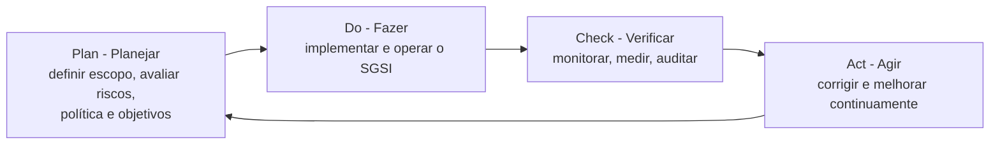

# Fundamentos de Segurança da Informação

> [!info] Metadados
> **Disciplina:** Segurança da Informação
> **Bloco:** 6.1 — Segurança da Informação (FASE 6 — Segurança e Governança)
> **Tópico:** 1. Fundamentos de Segurança da Informação
> **Subtópicos:** Tríade CID (Confidencialidade, Integridade, Disponibilidade) · Políticas e procedimentos de segurança · Normas ISO 27001 e ISO 27002 (SGSI, controles)
> **Pré-requisitos:** [[Seguranca-de-Comunicacoes]] (HTTPS/TLS — base técnica de confidencialidade e integridade em trânsito), [[LGPD-Lei-Geral-de-Protecao-de-Dados|LGPD]] (base jurídica que exige segurança no tratamento de dados), [[Padroes-de-Projeto-e-Arquitetura]] (APIs e integração que demandam segurança)
> **Cargo:** Analista de TI — Perfil 3: Desenvolvimento de Software
> **Data:** 2026-08-31

## 1. Por que estudar fundamentos de segurança da informação?

Na Fase 5, o Bloco 5.3 encerrou com uma promessa: explicar que o **HTTPS/TLS** que você estudou em [[Seguranca-de-Comunicacoes]] contava com a tríade CID e a ISO 27001 para a Fase 6. Chegamos até aqui. Antes de qualquer fluxo de autenticação, de qualquer teste de vulnerabilidade, existe uma camada de **fundamentos** que organiza tudo o que vem depois. Dominá-los é dominar a "gramática" da segurança.

O contexto DATAPREV torna isso concreto e urgente. A DATAPREV é a empresa de tecnologia da seguridade social: gere sistemas que armazenam dados de **dezenas de milhões de cidadãos brasileiros** — benefícios, folha de pagamento, cadastros. Cada dado desse universo está sob a custódia de sistemas cuja falha de segurança pode expor a vida financeira de uma pessoa inteira. A **LGPD**, que você estudou na [[LGPD-Lei-Geral-de-Protecao-de-Dados|Fase 1]], transformou essa responsabilidade em **obrigação jurídica**: o tratamento de dados pessoais só é legítimo se adotar **medidas de segurança, técnicas e administrativas** aptas a proteger esses dados.

> [!question]
> Pense: se a lei exige segurança, mas não diz *exatamente* que algoritmo usar ou qual certificado instalar, como uma organização mostra que está cumprindo? É aqui que entram dois conceitos-chave deste tópico: a **tríade CID** (o *que* proteger) e as **normas ISO** (o *como* demonstrar que se protege).

Este é, portanto, o alicerce conceitual e normativo do bloco inteiro — o ponto de partida do qual flui autenticação, gestão de riscos e o desenvolvimento seguro que você verá nos tópicos seguintes.

## 2. O que é segurança da informação? (e o que NÃO é)

Comecemos com uma distinção que a FGV explora. **Segurança da informação** é o conjunto de práticas e medidas que protege a **informação** em qualquer forma — digital, impressa, falada, transmitida — independentemente do meio que a armazena ou transporta. Já **segurança de computadores** (ou segurança cibernética) é uma **parte** dessa área, focada especificamente em sistemas computacionais, redes e dispositivos.

Por que isso importa para a prova? Porque uma questão pode afirmar que "segurança da informação" e "segurança de computadores / cibersegurança" são **a mesma coisa** — e isso é **falso**. A segurança da informação é o guarda-chuva maior; a cibersegurança está contida nela.

> [!tip] Palavra-chave para associar
> Quando a banca disser "proteção da informação em **todas as suas formas e meios** (papel, digital, humano)", está falando de **segurança da informação**. Quando disser "proteção de **sistemas, redes e dispositivos**", está falando de **cibersegurança** (subset).

Se a segurança da informação é proteger a informação, a pergunta natural é: proteger contra o quê? E para quê? É precisamente nesse ponto que entra a **tríade CID**.

## 3. A Tríade CID — Confidencialidade, Integridade e Disponibilidade

Você viu a sigla mencionada em [[Seguranca-de-Comunicacoes]]. Agora vamos à profundidade que a prova exige. A tríade CID (*CIA triad*, em inglês) é o modelo que define os **três pilares fundamentais** da segurança da informação:

| Pilar | Significado | Exemplo de violação |
|---|---|---|
| **Confidencialidade** | A informação **só é acessível** a quem tem **autorização** para vê-la | Um hacker lê um CPF armazenado no banco de dados (vazamento) |
| **Integridade** | A informação só pode ser **modificada** por quem tem autorização; ela permanece **correta, precisa e íntegra** | Um atacante altera o valor de um benefício no meio do caminho |
| **Disponibilidade** | A informação e seus recursos estão **acessíveis sempre que os legítimos usuários precisarem** | Um ataque de **DDoS** derruba o sistema de consulta de benefícios |

Vamos pensar em cada uma dentro do mundo DATAPREV.

> [!question]
> Quando você acessa o portal de benefícios com seu login, o que você espera? Que ninguém **veja** (confidencialidade — você não quer que outros leiam seus dados), que o valor do benefício **seja o correto** (integridade — ninguém adulterou), e que o site **esteja no ar** quando você precisa (disponibilidade). Tudo isso, simultaneamente. Parece simples, mas cada pilar exige técnicas distintas e, às vezes, conflitantes.

### 3.1 Como cada pilar se materializa tecnicamente

- **Confidencialidade** → **criptografia** (cifrar em trânsito e em repouso), **controle de acesso**, **autorização**. No [[Seguranca-de-Comunicacoes|Bloco 5.3]], o HTTPS cifra o tráfego — é uma realização concreta de confidencialidade em trânsito.
- **Integridade** → **hash / assinaturas digitais / MAC**, controles de versionamento, prevenção de alterações indevidas. No TLS, o **MAC** (que você viu no handshake) garante que a mensagem não foi adulterada.
- **Disponibilidade** → **redundância**, **backup**, **planos de contingência** (que serão detalhados na [[Gestao-de-Riscos|Gestão de Riscos]], Tópico 3), proteção contra DDoS.

### 3.2 Autenticidade e não repúdio — complementos comuns

A ementa pede a tríade clássica, mas você precisa estar ciente dos termos **autenticidade** (garantia de que a informação veio da fonte legítima) e **não repúdio** (garantia de que quem enviou não pode negar o envio). Alguns autores ampliam a tríade para **CIDA** ou pentagramas. Para a **prova**, siga a ementa: CID é o núcleo exigido.

> [!warning] PEGADINHA — Tríade CID "aumentada"
> A banca gosta de trocar um dos três pilares por outro termo que parece natural. Ex.: afirmar que a tríade é "Confidencialidade, **Autenticidade** e Disponibilidade" — **errado**. O segundo pilar é **Integridade** (não Autenticidade, não Não-repúdio). Guarde a ordem e os três termos exatos: **Confidencialidade, Integridade, Disponibilidade**. Uma das pegadinhas mais frequentes da FGV em segurança.

> [!notice] Confidencialidade × Independência de assunto
> Não confunda **confidencialidade** com **privacidade**. Privacidade é um conceito jurídico (LGPD, direito do titular); confidencialidade é um objetivo técnico de segurança (quem tem acesso). Eles se relacionam (a LGPD exige confidencialidade dos dados pessoais), mas são conceitos de naturezas diferentes.

## 4. Políticas e procedimentos de segurança

Segurança não é só tecnologia — é, sobretudo, **organização e comportamento**. Um sistema com a melhor criptografia do mundo pode ser quebrado por um funcionário que anota a senha num post-it. Por isso, a segurança se estrutura com documentos e papéis definidos.

### 4.1 Política, norma, procedimento, diretriz — o que é cada um

Esta é uma distinção clássica de prova. Os documentos de segurança existem **em uma hierarquia**, do mais estratégico ao mais operacional:

| Documento | Nível | O que define | Pergunta que responde |
|---|---|---|---|
| **Política** | Estratégico (topo) | **Intenções e diretrizes gerais**, declarações de alto nível aprovadas pela alta direção | *Por quê e o quê?* |
| **Norma** | Tático | **Regras obrigatórias**, padrões a cumprir | *Qual regra seguir?* |
| **Procedimento** | Operacional | **Passo a passo** das atividades | *Como fazer na prática?* |
| **Diretriz (guideline)** | Orientativo | **Recomendação**, sugestão de boas práticas (não obrigatória) | *Como seria o ideal?* |

> [!warning] PEGADINHA — Política × Procedimento × Norma
> A FGV costuma inverter os papéis: "o **procedimento** define as intenções estratégicas da organização" — **errado**; isso é a **política**. Ou: "a **norma** é um documento orientativo e opcional" — **errado**; norma é **obrigatória**, o que é **recomendado** (optativo) é a **diretriz**. Guarde: estratégico = política; obrigatório = norma; passo a passo = procedimento; recomendado = diretriz.

### 4.2 A Política de Segurança da Informação (PSI)

A **PSI** (Safety Policy) é o documento-mestre de qualquer organização, incluindo órgãos públicos. Ela nasce da alta direção, expressa o **compromisso** com a segurança e define as **diretrizes gerais** (quem pode acessar o quê, como dados sensíveis devem ser tratados, responsabilidades). Ela é, normalmente, registrada nos órgãos públicos, e a **LGPD** reforça sua exigência: sem política que materialize medidas de segurança, a organização não demonstra conformidade com o dever de *segurança* e *prevenção* dos princípios da LGPD.

Sem a PSI, as demais camadas (normas, procedimentos, ferramentas) ficam sem direção — é a política que **dá a moldura** para tudo.

### 4.3 Classificação da informação

Nem toda informação merece o mesmo nível de proteção. A **classificação da informação** é o processo de rotular os dados segundo sua **sensibilidade e impacto** caso vazem ou sejam alterados. Classificar é o pré-requisito para saber **quem** pode acessar e **que proteção** aplicar.

Você já viu uma modalidade disso na **LAI** ([[Lei-de-Acesso-a-Information-LAI|Bloco 1.3]]): classificação de documentos públicos como *reservado*, *secreto* e *altamente secreto*. No âmbito corporativo de TI, é comum um esquema próprio (ex.: *público, interno, confidencial, restrito*). O conceito-chave para a prova: **a classificação vem ANTES da definição das proteções** — não faz sentido proteger um dado se você não sabe o quanto ele é sensível.

> [!question]
> Por que classificar os dados é pré-requisito para aplicar a tríade CID? Porque a intensidade da confidencialidade, integridade e disponibilidade exigidas **varia conforme a sensibilidade**. Um dado "público" exige disponibilidade alta mas pouca confidencialidade; um dado "restrito" exige confidencialidade máxima. Sem classificação, você protege demais o trivial e protege de menos o crítico.

### 4.4 Papéis e organização da segurança

A segurança também tem **governança própria** (não confunda com o *governança de TI* do Bloco 6.2). Papéis típicos:

- **CISO** (*Chief Information Security Officer*) — o executivo responsável pela segurança da informação na organização;
- **Equipe de resposta a incidentes (CSIRT)** — time que atua quando um incidente de segurança acontece;
- **Comitê de segurança** — colegiado que aprova políticas e prioriza investimentos;
- **Gestor de segurança** — operacionaliza as políticas no dia a dia.

### 4.5 Conscientização e treinamento

O **fator humano** é, historicamente, o elo mais fraco da segurança. Por isso, treinamento e campanhas de **conscientização** (que a gente chama de *awareness*) são parte essencial de qualquer programa. É o que ensina, por exemplo, a reconhecer um **phishing** ou a não usar a mesma senha em vários sistemas. No contexto público, isso se conecta à exigência da LGPD de capacitar quem trata dados.

> [!tip] No contexto DATAPREV / governo
> A **estratégia nacional de segurança cibernética** e as **normas complementares** de segurança (como o Decreto de segurança cibernética e o arcabouço do Gabinete de Segurança Institucional — GSI) organizam a gestão de segurança em órgãos públicos. Para a prova, o essencial é a **ideia**: o governo estrutura a segurança cibernética por meio de **normas complementares** e **estratégia nacional**, além de exigir que estatais como a DATAPREV implementem SGSI alinhado às normas ISO.

## 5. Normas ISO 27001 e ISO 27002 — a diferença que a FGV adora

Aqui está um dos pontos mais cobrados e mais confundidos do tópico. Existe um par de normas que a banca usa como "pêndulo": a **ISO/IEC 27001** e a **ISO/IEC 27002**. Não são a mesma coisa, e a diferença é estrutural.

> [!question]
> Se você fosse contratado para "certificar a segurança" de uma organização, que norma você usaria? E, se quisesse apenas um **guia de boas práticas** listando controles, qual consultaria? A resposta está na natureza de cada norma.

### 5.1 ISO 27001 — a norma certificável do SGSI

A **ISO/IEC 27001** especifica os **requisitos** para estabelecer, implementar, manter e melhorar continuamente um **SGSI** — **Sistema de Gestão da Segurança da Informação**. Três características estruturais:

1. **É uma norma de gestão**: preocupa-se com o *processo* de gestão da segurança, não com uma lista fixa de controles obrigatórios.
2. **É certificável**: uma organização pode obter **certificação** independente (por um organismo acreditado) de que seu SGSI está em conformidade com a norma.
3. **Usa o ciclo PDCA** (Plan-Do-Check-Act / Planejar-Fazer-Verificar-Agir): a norma estrutura a gestão como um **ciclo contínuo** de melhoria.

O **Anexo A** da ISO 27001 apresenta uma **lista de controles** (objetivos e controles de referência) — mas é importante notar: a 27001 **não detalha** a aplicação de cada controle; ela apenas os **lista/referencia** e exige que a organização selecione, dentro de uma análise de riscos, os controles aplicáveis (com justificativa).

### 5.2 ISO 27002 — o código de práticas (guia de controles)

A **ISO/IEC 27002** é o **código de práticas** para **controles de segurança da informação**. Ela:

1. **Detalha** cada controle (objetivo do controle, diretrizes de implementação), explicando *como* aplicar.
2. **Não é certificável**: não se "certifica" uma organização na ISO 27002.
3. Serve de **guia de apoio** para selecionar e implementar os controles que a ISO 27001 referencia em seu Anexo A.

### 5.3 A relação e a pegadinha

A relação pode ser resumida assim: **a ISO 27001 diz *o que* exige (requisitos do SGSI, e lista controles no Anexo A); a ISO 27002 explica *como* implementar esses controles.** Uma detalha o outro.

| Aspecto | ISO 27001 | ISO 27002 |
|---|---|---|
| Natureza | Requisitos / norma de **gestão** (SGSI) | Código de **práticas / controles** |
| Certificável? | **Sim** | **Não** |
| Foco | Estabelecer/operar/gerir um **SGSI** | **Implementar controles** de segurança |
| Extra detalha controles? | Não (apenas lista no Anexo A) | **Sim** (guia de implementação) |
| Relação | Referencia controles do Anexo A | Detalha esses controles |

> [!warning] PEGADINHA CLÁSSICA — ISO 27001 vs. ISO 27002
> A FGV costuma afirmar que "a ISO 27002 é a norma **certificável**" — **falso**; a certificável é a **27001**. Ou que "a ISO 27001 detalha a implementação dos controles" — **falso**; quem detalha é a **27002**. Ou ainda que "a 27001 é apenas um guia de boas práticas" — **falso**; isso é a **27002**, enquanto a 27001 é uma norma de **gestão/requisitos** centrada no **SGSI**. Quando aparecer a palavra **SGSI** ou **certificação**, a resposta é **27001**. Quando aparecer **controles** ou **boas práticas de implementação**, é **27002**.

### 5.4 O ciclo PDCA e a melhoria contínua

O SGSI da ISO 27001 vive num ciclo de melhoria contínua. O **PDCA** (*Plan–Do–Check–Act*) descreve bem esse fluxo:

> [!tip] Como a FGV cobra (estrutural)
> A ementa destaca que ISO 27001/27002 é **mais estrutural** — sabe o que é, qual é certificável, qual é o SGSI, qual detalha controles, e os domínios que a 27002 abrange. Não espere questão prática de implementação; espere questão conceitual de diferenciação.

### 5.5 Ligação com a LGPD

Por que estudar ISO numa disciplina que tem a LGPD? Porque a **LGPD não prescreve tecnologia**: ela impõe *princípios* (finalidade, **segurança**, **prevenção**, responsabilização) e *deveres* (medidas de segurança). Para **demonstrar** conformidade — e se defender perante a **ANPD** ([[LGPD-Lei-Geral-de-Protecao-de-Dados|Autoridade Nacional de Proteção de Dados]]) — a organização adota padrões reconhecidos como a **ISO 27001/27002**. Numa auditoria, ter um SGSI certificado é uma forte **evidência** de que a organização cumpre o dever de segurança imposto pela LGPD. Essa ponte LGPD → ISO é uma das "correntes" da ementa (LGPD → Segurança da Informação → Governança).

> [!note] No contexto do setor público
> A **norma complementar nº 14** do GSI (que trata de gestão de segurança da informação no poder executivo federal) orienta a adoção de SGSI e controles das normas ISO no âmbito do governo — mais um reforço de por que a DATAPREV, como estatal federal, vive sob esse arcabouço. Para a prova, basta saber que o setor público brasileiro adota o **referencial ISO** como base de sua gestão de segurança.

## 6. Conexões com o que você já viu

Este tópico amarra fios de fases anteriores:

- **Confidencialidade e integridade em trânsito** foram materializadas pelo **HTTPS/TLS** de [[Seguranca-de-Comunicacoes|Bloco 5.3]]: o TLS cifra (confidencialidade) e valida com MAC (integridade). Agora você enxerga esses mecanismos como **realizações da tríade CID**.
- **A LGPD** da [[LGPD-Lei-Geral-de-Protecao-de-Dados|Fase 1]] é o **porquê jurídico**; as **ISO 27001/27002** são o **como normativo**; a tríade CID é o **o quê técnico**.
- A **classificação da informação** ecoa a **LAI** (classificação de documentos públicos) que você viu na Fase 1.

E promete conexões para dentro do próprio bloco: os controles que a ISO 27002 detalha (controle de acesso, gestão de incidentes) serão retomados nos próximos tópicos de autenticação e gestão de riscos.

## 7. Palavras-chave e como a FGV cobra

- **Palavras-chave:** *segurança da informação ≠ segurança de computadores, tríade CID (Confidencialidade, Integridade, Disponibilidade), autenticidade, não-repúdio, política, norma, procedimento, diretriz, PSI, classificação da informação, CISO, CSIRT, conscientização, ISO 27001, ISO 27002, SGSI, PDCA, Anexo A, certificação, controle, código de práticas, LGPD, ANPD.*

**Formas de cobrança típicas:**

1. **Tríade completa** — não trocar Integridade por Autenticidade; memorizar os três termos na ordem.
2. **27001 vs. 27002** — certificável/SGSI/requisitos = 27001; controles/boas práticas/guia = 27002.
3. **Política vs. norma vs. procedimento** — estratégico vs. obrigatório vs. passo a passo; diretriz = recomendação.
4. **Segurança da informação vs. cibersegurança** — abrangência (guarda-chuva vs. subset).
5. **Classificação** como pré-requisito para as proteções.

## 8. Próximos passos

Domina os fundamentos? Então avance para o **Tópico 2 — Autenticação e Autorização**, onde você aplicará confidencialidade e integridade no acesso de usuários (OAuth2, JWT, SSO, MFA). Ao terminar o Bloco 6.1, o elo com a **governança** (Bloco 6.2 — Gestão e Governança de TI, ainda a estudar) se tornará claro, pois a gestão de riscos e o SGSI aqui iniciados são a ponte entre a segurança técnica e a estratégia organizacional.