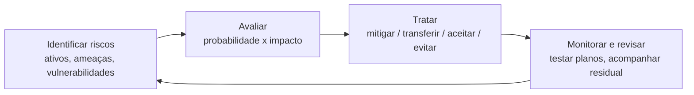

# Gestão de Riscos

> [!info] Metadados
> **Disciplina:** Segurança da Informação
> **Bloco:** 6.1 — Segurança da Informação (FASE 6 — Segurança e Governança)
> **Tópico:** 3. Gestão de Riscos
> **Subtópicos:** Identificação e avaliação de riscos · Matriz de risco (probabilidade × impacto) · Planos de contingência e recuperação
> **Pré-requisitos:** [[Fundamentos-de-Seguranca]] (tríade CID, ISO 27001/27002, SGSI), [[Autenticacao-e-Autorizacao]] (controles de acesso), [[Seguranca-de-Comunicacoes]] (segurança em trânsito), [[LGPD-Lei-Geral-de-Protecao-de-Dados|LGPD]] (dever de segurança e responsabilização)
> **Cargo:** Analista de TI — Perfil 3: Desenvolvimento de Software
> **Data:** 2026-08-31

## 1. Por que estudar gestão de riscos?

Nas duas notas anteriores você construiu dois pilares da segurança: a **tríade CID** e as **normas ISO** ([[Fundamentos-de-Seguranca|Tópico 1]]) e os **mecanismos de acesso** — autenticação e autorização ([[Autenticacao-e-Autorizacao|Tópico 2]]). Mas surge uma pergunta incômoda: **proteger contra o quê, exatamente, e com quanta intensidade?**

A realidade é que os recursos de segurança são finitos. Uma organização não pode comprar o controle mais caro possível para cada ameaça imaginável. A **gestão de riscos** é a disciplina que responde a essa pergunta de forma **racional e priorizada**: ela identifica o que pode dar errado, avalia a chance e o dano, e decide **onde** aplicar os controles que você já estudou — e onde é razoável **aceitar** o risco ou **transferi-lo**.

Repare na ponta do fio que ficou pendente na [[Fundamentos-de-Seguranca|nota 1]]: a **ISO 27001** exige que a organização estabeleça um **SGSI** e, dentro dele, realize uma **análise de riscos** para selecionar os controles do **Anexo A** que são aplicáveis. Em outras palavras: **o risco é o ponto de partida da ISO 27001.** Sem gestão de riscos, o SGSI não tem como decidir o que proteger primeiro. Foi exatamente isso que aquela nota prometeu — e é o que este tópico entrega.

> [!question]
> Se você tivesse um orçamento limitado e precisasse escolher entre criptografar os backups e trocar as fechaduras do prédio, como decidiria? Sem um método, a escolha vira "achismo". A gestão de riscos transforma o "achismo" em **decisão baseada em evidência** — e é isso que a banca espera que você entenda.

### Gestão de riscos não é "fazer tudo"

Há uma pegadinha conceitual frequente: **gestão de riscos não significa eliminar todos os riscos.** Significa **entender** e **gerir** o risco em um nível **aceitável** para a organização. Alguns riscos serão **mitigados** (reduzidos), outros **transferidos**, outros **aceitos** conscientemente. Eliminar 100% dos riscos é, na prática, impossível e economicamente inviável.

> [!warning] PEGADINHA — Riscos e controles
> A banca pode afirmar que "a gestão de riscos busca eliminar todos os riscos da organização" — **falso**. O objetivo é reduzir o risco a um **nível aceitável** (o *risco residual*), não zerá-lo. A distinção entre **mitigar**, **transferir**, **aceitar** e **evitar** um risco será o coração das questões deste tópico.

---

## 2. O que é risco? E o que são ameaça, vulnerabilidade e impacto?

Antes de gerenciar, é preciso definir **o que é risco**. Em segurança da informação, **risco** é a **possibilidade** de um evento indesejado ocorrer e causar **impacto** sobre a confidencialidade, a integridade ou a disponibilidade da informação. Para entender o risco, você precisa de três ingredientes que a banca adora misturar:

| Termo | O que é | Pergunta que responde |
|---|---|---|
| **Ameaça** | Fator externo capaz de explorar uma fragilidade e causar dano | Quem/o que pode causar dano? |
| **Vulnerabilidade** | Fragilidade interna que a ameaça pode explorar | Onde está a brecha? |
| **Impacto** | Consequência/dano caso o evento se concretize | Quanto custa o dano? |

O **risco** é o resultado dessa combinação: sem ameaça, sem vulnerabilidade ou sem impacto, não há risco relevante. Uma **ameaça** que não encontra **vulnerabilidade** não consegue se concretizar; uma **vulnerabilidade** que nenhuma **ameaça** explora não gera risco prático; e um evento que não causa **impacto** material não merece prioridade.

> [!question]
> Um sistema legado tem uma brecha conhecida, mas está **desconectado da internet** e sem acesso externo. Há vulnerabilidade? Há. Há ameaça? Se nenhuma ameaça consegue alcançá-lo, a exploração é improvável — e o **risco resultante** é baixo. Repare: **vulnerabilidade ≠ risco**. A banca cobra exatamente essa separação.

### A FGV e a tríade CID no risco

Como o risco incide sobre a **informação**, o impacto do risco deve ser pensado à luz da **tríade CID** que você estudou na nota 1. Um risco pode comprometer a **confidencialidade** (vazamento de dados), a **integridade** (dados adulterados) ou a **disponibilidade** (sistema fora do ar). Conectar o risco aos pilares da tríade ajuda a classificar o que está em jogo.

> [!tip] Palavra-chave para associar
> Quando a banca perguntar "o que é **risco**", a resposta envolve a combinação de **ameaça + vulnerabilidade + impacto** (evento indesejado com consequência). Quando perguntar por **vulnerabilidade**, está falando da **fragilidade interna**; por **ameaça**, do **agente ou fator externo**.

---

## 3. Identificação de riscos

A **identificação** é a primeira etapa do processo: levantar **quais** riscos podem afetar a organização e seus ativos de informação. É um exercício de **inventário** — não se prioriza ainda; primeiro se **descobre**.

### 3.1 Ativo, ativo crítico e valor

Para identificar riscos, antes é preciso saber **o que proteger**: o **ativo**. Um **ativo** é qualquer coisa que tenha **valor** para a organização — um banco de dados, um servidor, uma aplicação, um documento físico, mas também as pessoas e a própria reputação. Nem todo ativo vale o mesmo esforço: os **ativos críticos** são aqueles cuja perda ou indisponibilidade causaria o maior impacto (ex.: a base de benefícios da DATAPREV). A identificação de riscos começa, portanto, por **listar os ativos e atribuir-lhes valor**.

### 3.2 Fontes de informação para identificar riscos

Como se descobre um risco? Com métodos e fontes:

- **Análise de ameaças** — cenários de ataque, dados de incidentes anteriores, inteligência de ameaças.
- **Análise de vulnerabilidades** — varreduras, testes, auditorias, revisão de configurações.
- **Registros históricos** — incidentes passados da própria organização ou do setor.
- **Normas e referências** — a ISO 27005 (gestão de riscos de segurança da informação) e catálogos de controle (como o Anexo A da ISO 27001 e a ISO 27002) ajudam a *sistematizar* a busca por riscos.
- **Opinião de especialistas e workshops** com as áreas envolvidas.

> [!note] Concilie com o que já estudou
> A **ISO 27005** trata especificamente de **gestão de riscos de segurança da informação**. Não é preciso memorizar seus anexos; para a prova, o importante é saber que **ela existe como referência metodológica do processo de risco**, complementar à ISO 27001 e à ISO 27002 que você já estudou.

---

## 4. Avaliação de riscos: probabilidade e impacto

Identificado o risco, vem a **avaliação**: entender a **grandeza** de cada risco para permitir **priorização**. A avaliação cruza dois eixos fundamentais — e são exatamente os que a ementa cobra:

1. **Probabilidade (ou possibilidade):** a chance de o evento indesejado se concretizar.
2. **Impacto:** a extensão do dano caso ele se concretize.

O **nível de risco** é, conceitualmente, o produto desses dois fatores:

$$
\text{Risco} = \text{Probabilidade} \times \text{Impacto}
$$

> [!question]
> Imagine dois riscos. O primeiro tem chance **alta** de acontecer, mas o impacto é **baixo** (ex.: um e-mail de phishing genérico cai no spam e não rouba crédito). O segundo tem chance **baixa** de acontecer, mas o impacto é **altíssimo** (ex.: vazamento completo da base de benefícios). Qual merece mais atenção? A resposta **não é automática** — e é por isso que existem métodos de classificação, como a **matriz de risco**.

### 4.1 A Matriz de Risco (probabilidade × impacto)

A **matriz de risco** é a ferramenta que **organiza** essa avaliação visualmente. Ela é uma tabela com **probabilidade** em um eixo e **impacto** no outro, geralmente dividida em níveis (baixo, médio, alto — ou de 1 a 5). A célula onde **probabilidade** e **impacto** se cruzam indica o **nível do risco** (baixo, médio, alto, extremo). Assim, a matriz transforma a avaliação subjetiva em uma **classificação comunicável**.

> [!example] Exemplo de matriz 3×3
>
> | Probabilidade x Impacto | Baixo | Médio | Alto |
> |---|---|---|---|
> | **Alta** | Médio | Alto | **Extremo** |
> | **Média** | Baixo | Médio | Alto |
> | **Baixa** | Baixo | Baixo | Médio |
>
> Leia a tabela: um risco de probabilidade **alta** e impacto **alto** cai na célula **extremo** — precisa de ação imediata de **mitigação**. Um risco de probabilidade **baixa** e impacto **baixo** cai em **baixo** — pode ser **aceito** e apenas monitorado.

A matriz não é a única resposta à pergunta "o que fazer". Ela alimenta a **decisão de tratamento**. Valores monetários, custos de mitigação e apetite ao risco também entram na decisão — mas, para a prova, a matriz é a ferramenta que organiza probabilidade e impacto e revela qual risco é **prioridade**.

> [!warning] PEGADINHA — Probabilidade × Impacto
> A banca costuma inverter o eixo ou pedir o conceito correto. Lembre: a **matriz de risco** cruza **probabilidade (ou possibilidade)** com **impacto**. Ela não é feita para "eliminar riscos" nem para "listar controles"; sua função é **classificar e priorizar** riscos a partir desses dois eixos. O nível de risco mais alto (probabilidade alta + impacto alto) é o que exige **ação prioritária**.

### 4.2 Risco inerente vs. risco residual

Há uma distinção que a FGV explora com frequência. Antes de qualquer controle, o risco existe em seu estado **bruto** — esse é o **risco inerente** (ou risco **bruto/inicial**). Depois de aplicar controles de mitigação, sobra o **risco residual** — o risco que **permanece** após os controles. O **tratamento** do risco (mitigação etc.) atua exatamente sobre essa diferença.

> [!question]
> Se você criptografa um banco de dados, o risco de leitura indevida **desaparece**? Não de todo — você reduziu a probabilidade ou o impacto, mas ainda restam riscos como a perda das chaves de criptografia. O que sobrou é o **risco residual**, e ele deve ser **aceito ou monitorado** pela gestão.

---

## 5. Tratamento de riscos: o que fazer com cada risco

Após **avaliar**, a organização decide o **tratamento** de cada risco. A banca cobra quatro estratégias clássicas — memorize-as e a diferença entre elas:

| Estratégia | O que faz | Exemplo |
|---|---|---|
| **Mitigar** (reduzir) | Diminuir a probabilidade ou o impacto | Aplicar **controles** (criptografia, backups, firewall, autenticação) |
| **Transferir** | Deslocar o risco para outra parte | **Seguro** de cibersegurança; terceirizar com responsabilidade contratual |
| **Aceitar** | Reconhecer o risco e conviver com ele (conscientemente) | Assumir um risco **baixo** e apenas monitorá-lo |
| **Evitar** | Eliminar a atividade que gera o risco | **Descontinuar** um sistema de alto risco que não compensa proteger |

> [!important] As quatro formas de tratar o risco
> **Mitigar, transferir, aceitar e evitar** são as respostas clássicas. A pegadinha mais comum é **confundir transferir com mitigar** — transferir não reduz a probabilidade nem o impacto; desloca a **responsabilidade/consequência** (ex.: seguro). E **aceitar** não é "ignorar"; é uma **decisão documentada** de conviver com o risco, normalmente de baixo nível.

**Risco residual e apetite ao risco:** a organização define quanto risco está disposta a assumir — o **apetite ao risco** (ou tolerância). O tratamento busca trazer o risco até o nível **aceitável** definido pela gestão. O **risco residual** é, portanto, o que sobra depois do tratamento, e deve ser **formalmente aceito** pela direção quando estiver dentro da tolerância.

> [!tip] Palavra-chave
> - **Mitigar** → aplicar **controles** / reduzir.
> - **Transferir** → **seguro** / deslocar responsabilidade.
> - **Aceitar** → **decisão documentada** de conviver, risco baixo.
> - **Evitar** → **eliminar** a atividade / descontinuar.

---

## 6. Plano de contingência e recuperação — o que fazer quando tudo falha

Nem todos os riscos podem ser reduzidos a zero. Para os riscos que **se concretizam mesmo assim**, a organização precisa estar preparada para **responder** e **se recuperar**. É aí que entram os planos de contingência e recuperação — a face **operacional** da gestão de riscos, voltada à **disponibilidade** e à continuidade do negócio.

A nota de [[Fundamentos-de-Seguranca|fundamentos]] mencionou planos de contingência ligados à **disponibilidade** (pilar da tríade CID). Este é o momento de aprofundá-los.

### 6.1 Conceitos que a banca reformula

A FGV gosta de usar termos próximos e cobrar a diferença. Três conceitos aparecem com frequência:

- **Plano de contingência:** o **conjunto de procedimentos** para **continuar operando** (total ou parcialmente) quando ocorre uma **interrupção** — mesmo que em modo reduzido. Foco em **continuar funcionando**.
- **Plano de recuperação (de desastres):** o procedimento para **restaurar** os sistemas e dados ao **estado normal** após o incidente. Foco em **voltar ao normal**.
- **Plano de continuidade de negócio (BCP — *Business Continuity Plan*):** o plano **maior** que garante a continuidade das **operações do negócio** como um todo, cobrindo pessoas, processos e tecnologia.

> [!warning] PEGADINHA — Contingência vs. recuperação
> **Contingência** = continuar **operando** durante o incidente (modo contingencial / reduzido). **Recuperação** = **restaurar** ao estado normal depois. A banca troca os dois termos: dizer que "contingência restaura os dados ao estado original" é **errado** (isso é recuperação); dizer que "recuperação mantém o sistema operando durante a falha" também é **errado** (isso é contingência).

### 6.2 Métricas de recuperação: RTO e RPO

Dois indicadores sustentam os planos de recuperação — e são cobrados com frequência:

| Sigla | Significado | Pergunta que responde |
|---|---|---|
| **RTO** (*Recovery Time Objective*) | Tempo máximo aceitável para **restaurar** o serviço após a interrupção | Em quanto tempo preciso estar de volta? |
| **RPO** (*Recovery Point Objective*) | Retroatividade máxima aceitável de dados perdidos/permitidos | Quanto de dado posso **perder**? |

> [!question]
> Se o RPO é de **2 horas**, quanta informação posso aceitar perder? No máximo as **2 horas** mais recentes de dados — pois só consigo garantir a recuperação até o último backup (de 2 horas atrás). Se o RTO é de **4 horas**, o sistema precisa estar **no ar** em até 4 horas após a falha. Entender esses dois números é meio caminho para acertar a questão.

> [!tip] Palavra-chave para associar
> **RTO** = **tempo** de volta ao ar (rompe com "O" de objetivo de tempo). **RPO** = **pontos** de backup / quanto **dado** posso perder (rompe com "P" de ponto). Grave: RTO é **tempo**, RPO é **dados**.

### 6.3 Backup: a base da recuperação

A **recuperação** depende de **backups** (cópias de segurança). Conceitos essenciais que a banca cobra:

- **Backup completo:** cópia de **todos** os dados — base da cadeia.
- **Backup incremental:** copia apenas as **mudanças desde o último** backup (completo ou incremental). Mais rápido e econômico, mas a recuperação depende da **cadeia** de backups.
- **Backup diferencial:** copia as mudanças desde o **último backup completo**. Cresce mais que o incremental, mas a recuperação precisa de **apenas dois** arquivos (o último completo + o diferencial).

> [!question]
> Por que fazer backups **off-site** (em local remoto) ou em nuvem? Se um incêndio ou um ataque de **ransomware** compromete o local principal, o backup que estivesse **no mesmo prédio** seria perdido junto. A **redundância geográfica** protege contra desastres físicos — novamente, uma decisão orientada por **risco** (disponibilidade e integridade).

### 6.4 Testar o plano

Um plano que nunca é **testado** não é um plano de verdade — é uma **intenção**. A gestão de riscos prevê **testes e exercícios** periódicos de contingência/recuperação para garantir que os procedimentos funcionam e que as equipes sabem executá-los. Questões conceituais podem cobrar essa ideia: **o plano deve ser revisto e testado regularmente**, não arquivado.

---

## 7. O processo completo em um fluxo

A gestão de riscos é um **ciclo**, não um evento único. O fluxo abaixo resume o caminho que você percorreu nesta nota:

O ciclo se **realimenta**: novos ativos, novas ameaças e mudanças no negócio geram novos riscos, e o processo recomeça. É por isso que a gestão de riscos é **contínua** — conectando-se à ideia de **melhoria contínua** do SGSI da ISO 27001 que você estudou na nota 1.

---

## 8. Palavras-chave e como a FGV cobra

- **Palavras-chave:** *risco, ameaça, vulnerabilidade, impacto, ativo, ativo crítico, identificação, avaliação, probabilidade, possibilidade, matriz de risco, nível de risco, risco inerente, risco residual, mitigar, transferir, aceitar, evitar, apetite ao risco, tolerância, plano de contingência, plano de recuperação, BCP (continuidade de negócio), RTO, RPO, backup completo/incremental/diferencial, off-site, teste do plano, ISO 27005.*

**Formas de cobrança típicas:**

1. **Definição de risco** — combinação de **ameaça + vulnerabilidade + impacto**; não confundir vulnerabilidade com risco.
2. **Matriz de risco** — cruza **probabilidade × impacto** para **classificar/priorizar**; nível mais alto exige ação prioritária.
3. **Risco inerente × residual** — antes dos controles × o que sobra após os controles.
4. **Tratamento** — diferenciar **mitigar, transferir, aceitar, evitar** (a "transferir ≠ mitigar" é a mais cobrada).
5. **Contingência × recuperação** — continuar operando × restaurar o estado normal.
6. **RTO × RPO** — tempo de retorno × perda de dados aceita.
7. **Backup** — completo, incremental, diferencial; e a importância do off-site e do teste.

---

## 9. Próximos passos

Com a gestão de riscos dominada, você entende **como** a organização decide onde proteger e o que fazer para voltar a operar. O próximo passo é o **Tópico 4 — Segurança no Desenvolvimento**: como embutir segurança no ciclo de vida do software (SDL, OWASP Top 10, SAST/DAST e gestão de dependências), construindo sobre a base de riscos desta nota. Ao concluir o Bloco 6.1, conectaremos esses conceitos com a **governança** do Bloco 6.2 (ainda a estudar), para a qual a gestão de riscos e o SGSI aqui iniciados são justamente a ponte — como a [[Fundamentos-de-Seguranca|nota 1]] já prenunciava.
