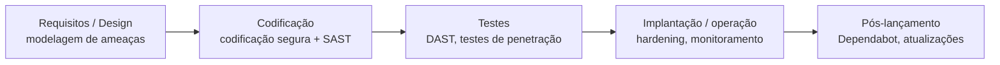

# Segurança no Desenvolvimento

> [!info] Metadados
> **Disciplina:** Segurança da Informação
> **Bloco:** 6.1 — Segurança da Informação (FASE 6 — Segurança e Governança)
> **Tópico:** 4. Segurança no Desenvolvimento
> **Subtópicos:** SDL (Security Development Lifecycle) · OWASP Top 10 · SAST (análise estática) · DAST (análise dinâmica) · Dependabot e gestão de dependências vulneráveis
> **Pré-requisitos:** [[Fundamentos-de-Seguranca]] (tríade CID, controles), [[Autenticacao-e-Autorizacao]] (autenticação/autorização, Broken Auth), [[Gestao-de-Riscos]] (ameaças, vulnerabilidades, tratamento), [[Desenvolvimento-de-Sistemas]] (ciclo de vida do software), [[Metodologias-Ageis]] (integração da segurança no ciclo)
> **Cargo:** Analista de TI — Perfil 3: Desenvolvimento de Software
> **Data:** 2026-08-31

## 1. Por que estudar segurança no desenvolvimento?

Até aqui, você estudou a segurança do ponto de vista da **operação** e da **decisão**: a tríade CID e as normas ISO ([[Fundamentos-de-Seguranca|Tópico 1]]), os mecanismos de acesso ([[Autenticacao-e-Autorizacao|Tópico 2]]) e a forma de **priorizar** onde proteger ([[Gestao-de-Riscos|Tópico 3]]). Mas há um momento em que a segurança pode ser incorporada ainda mais **cedo**, no próprio **código** que produzimos — e é exatamente aí que as vulnerabilidades nascem.

Releia a promessa que ficou no fim da nota de Gestão de Riscos: a **Segurança no Desenvolvimento** mostra **como embutir segurança no ciclo de vida do software**. A ideia central é simples e poderosa: **é mais barato e mais seguro corrigir uma falha durante o desenvolvimento do que depois que o sistema está em produção.** Uma vulnerabilidade descoberta em produção pode custar um vazamento de dados, uma indisponibilidade ou uma multa da LGPD. Encontrada ainda no código, custa uma correção pontual.

> [!question]
> Quando é mais fácil corrigir um erro de validação de entrada que permite um ataque de injeção: antes de o sistema virar público, ou depois de milhões de usuários usarem um formulário que aceita comandos maliciosos? A resposta óbvia — antes — é o *porquê* de existir uma disciplina inteira dedicada a **integrar segurança ao processo de desenvolvimento**.

Em um cargo de **Analista de TI — Desenvolvimento de Software**, esse tema é central: o profissional que escreve código precisa conhecer os riscos que seu código cria e as ferramentas que ajudam a encontrá-los. A banca cobra isso de forma **conceitual e prática** — e a ementa destaca que este é um dos **alvos clássicos** do Módulo II.

### Segurança não é um "departamento"

Há uma pegadinha de mentalidade frequente: achar que segurança é responsabilidade apenas da equipe de segurança. A abordagem moderna é a da **segurança como responsabilidade compartilhada**, integrada ao trabalho de quem desenvolve. É isso que o **SDL** — que você verá a seguir — tenta institucionalizar dentro do processo.

---

## 2. SDL — Security Development Lifecycle

O **SDL** (*Security Development Lifecycle*, ou **Ciclo de Vida de Desenvolvimento Seguro**) é uma abordagem que **insere atividades de segurança em todas as fases** do processo de desenvolvimento de software — do planejamento ao pós-lançamento. Em vez de tratar a segurança como uma etapa final ou como algo externo, o SDL a **distribui ao longo do ciclo**.

### 2.1 A ideia de "shift-left"

O SDL materializa o princípio de **deslocar a segurança para a esquerda** (*shift-left*): aplicar preocupações de segurança **o mais cedo possível** no ciclo, em vez de deixá-las para o fim. Trata-se de uma mudança de mentalidade: **prevenir** e **detectar cedo** é mais eficaz do que corrigir tarde.

> [!tip] Palavra-chave
> *Shift-left* = trazer a segurança (e os testes de modo geral) para as **etapas iniciais** do desenvolvimento. Quando a banca falar em "incorporar segurança desde o início do ciclo", está se referindo a essa ideia.

### 2.2 Fases e práticas típicas do SDL

Cada fase do desenvolvimento recebe práticas de segurança correspondentes. A lista abaixo é exemplificativa — o essencial para a prova é entender que **segurança acompanha cada fase**, e não um evento isolado:

| Fase do ciclo | Práticas de segurança típicas |
|---|---|
| **Requisitos / design** | Modelagem de ameaças, análise de requisitos de segurança, definir critérios de aceite seguros |
| **Codificação** | Padrões de codificação segura, revisão de código, **SAST** (análise estática), listas de linguagens/funções proibidas |
| **Testes** | Testes de segurança, **DAST** (análise dinâmica), testes de penetração, testes de fuzzing |
| **Implantação / produção** | Hardening de ambiente, monitoramento, resposta a incidentes |
| **Pós-lançamento** | Monitoramento contínuo, atualização de dependências, tratamento de vulnerabilidades descobertas |

> [!note] Conecte com o que já estudou
> O SDL **não substitui** a gestão de riscos ([[Gestao-de-Riscos|Tópico 3]]): ele a **operacionaliza** no contexto do código. A modelagem de ameaças, por exemplo, é uma forma de **identificar riscos** antes de escrever o sistema. Em vez de uma decisão posterior sobre "onde aplicar controles", o SDL traz essa decisão para dentro de cada etapa do software.

### 2.3 SDL e Metodologias Ágeis

A observação pedagógica da ementa destaca a conexão entre **SDL e Metodologias Ágeis** (que você estudou na Fase 4): em métodos ágeis, o ciclo é curto e repetitivo (sprints), então a segurança precisa ser **contínua e automatizada**, e não um "momento" no fim. Práticas como **definição de pronto (DoD)** passam a incluir critérios de segurança, e atividades de SAST/DAST entram no fluxo de **integração contínua** (CI). Não é preciso detalhar o CI/CD aqui — basta entender que a segurança ágil é **integrada e contínua**.

---

## 3. OWASP Top 10 — o alvo clássico de questões

O **OWASP** (*Open Worldwide Application Security Project* — Projeto Aberto de Segurança de Aplicações Web) é uma **comunidade** sem fins lucrativos que publica, entre outros, o famoso **OWASP Top 10**: uma **lista ranqueada dos riscos de segurança mais críticos para aplicações web**, atualizada periodicamente. Para a prova, o nome que importa é **OWASP Top 10** — e a ementa manda **memorizar as principais vulnerabilidades**.

> [!warning] PEGADINHA — O que é o OWASP Top 10
> O OWASP Top 10 **não é uma norma certificável** nem um framework de gestão (como a ISO 27001). É um **documento/referência** que **prioriza os riscos mais comuns** em aplicações web, usado como **guia de conscientização e priorização**. Não confunda com a ISO 27001/27002 (normas de gestão) nem com um "padrão de certificação".

### 3.1 As vulnerabilidades mais cobradas

Das dez, as mais presentes em provas — e as que a ementa cita explicitamente — são as seguintes. A lista usa os nomes técnicos em inglês, que a banca costuma manter:

#### A1 — Injection (Injeção)

A **injeção** ocorre quando dados fornecidos pelo usuário são interpretados como **código/comando** pela aplicação. O caso clássico é a **SQL Injection**: o atacante insere trechos de SQL em um campo de texto esperado como dado, e a aplicação os executa no banco — podendo ler, alterar ou apagar dados.

> [!question]
> Se um campo de login aceita a entrada `' OR '1'='1` e a aplicação monta a consulta juntando strings, o que acontece? A condição pode se tornar sempre verdadeira, e o atacante **entra sem saber a senha**. A defesa clássica é o **uso de parâmetros/consultas parametrizadas** (prepared statements) — nunca concatenar a entrada do usuário diretamente na query.

**Defesa chave:** *parameterized queries* / prepared statements, validação de entrada, escapamento correto.

#### A2 — XSS (Cross-Site Scripting, "scripting entre sites")

O **XSS** ocorre quando a aplicação insere **conteúdo fornecido pelo usuário** em uma página **sem sanitização**, permitindo que o atacante execute **JavaScript** no navegador de outra vítima. As consequências incluem roubo de sessão (cookies), redirecionamento, ou execução de ações em nome da vítima.

> [!tip] Palavra-chave para diferenciar
> **Injection** (incl. SQL Injection) tem relação com o **banco/comandos**; **XSS** tem relação com o **navegador da vítima** (execução de script no cliente). A FGV separa os dois: se o prejuízo acontece no **lado do servidor/banco**, pensamos em injeção; se acontece no **navegador do usuário**, pensamos em XSS.

**Defesa chave:** validação e **sanitização/escape** de saída, *Content Security Policy* (CSP).

#### A7 — Broken Authentication / Broken Access Control (Autenticação e Controle de Acesso Quebrados)

A **autenticação quebrada** (*broken authentication*) envolve falhas na gestão de **identidade e sessão**: senhas fracas, falha na expiração de sessão, ausência de proteção contra enumeração, etc. Já o **controle de acesso quebrado** (*broken access control*) ocorre quando o usuário consegue **executar ações ou acessar recursos sem a devida autorização** — por exemplo, acessar o painel administrativo alterando a URL.

> [!note] Conecte com o Tópico 2
> O Tópico 2 ([[Autenticacao-e-Autorizacao]]) estudou os mecanismos corretos (OAuth2, JWT, SSO, MFA). O OWASP, aqui, aponta o que acontece quando **esses mecanismos são mal implementados**: identidade e autorização que podem ser contornadas. A ponte é direta: saber **como fazer certo** (Tópico 2) e saber **o que pode dar errado** (Tópico 4).

#### Outras que podem aparecer

Além dessas, vale reconhecer por nome: **vazamento de dados sensíveis** (exposição de dados sem proteção/criptografia), **configuração incorreta de segurança** (*security misconfiguration* — servidores/configurações padrão inseguras), e **componentes com vulnerabilidades conhecidas** — o que conecta diretamente com a **gestão de dependências** (Dependabot) que veremos adiante.

> [!warning] PEGADINHA — memorização orientada
> A ementa pede "memorizar as 10 vulnerabilidades", mas a banca **raramente lista as dez**; costuma cobrar **as mais clássicas** (Injection, XSS, Broken Auth/Access Control) e pedir a **definição** ou o **tipo de ataque** correspondente. Não desperdice tempo decorando números/posições exatas de todas — foque em **saber identificar cada ataque pela sua descrição** e a **defesa** básica associada.

---

## 4. SAST — análise estática

O **SAST** (*Static Application Security Testing* — **Teste Estático de Segurança de Aplicações**) é a análise de segurança feita sobre o **código-fonte** (ou binário/bytecode) **sem executar** a aplicação. A ferramenta "lê" o código e procura **padrões de vulnerabilidade** (funções perigosas, concatenação de SQL, uso inseguro de memória, etc.).

> [!tip] Palavra-chave — "estático"
> **Estático** = **sem executar** o programa. O SAST analisa o **código-fonte** em busca de **padrões de risco**. Direto da palavra "Static".

O SAST é feito, tipicamente, **durante o desenvolvimento** — integrado ao ambiente de CI ou à IDE — e tem a vantagem de **encontrar falhas cedo e com baixo custo**, além de cobrir o código todo. Sua limitação é o **número de falsos positivos** e a dificuldade de detectar problemas que só aparecem **em tempo de execução**.

> [!question]
> Se você quer encontrar, no próprio código, um trecho que concatena SQL diretamente, que tipo de teste usaria? Um teste que **examina o código sem rodá-lo** — o **SAST**. Ele funciona como um "leitor minucioso" do código, caçando má conduta de programação.

---

## 5. DAST — análise dinâmica

O **DAST** (*Dynamic Application Security Testing* — **Teste Dinâmico de Segurança de Aplicações**) é a análise de segurança feita **com a aplicação em execução**, de fora para dentro, **simulando ataques** — geralmente via interface HTTP/Web. A ferramenta **interage com a aplicação como um atacante faria** e observa a resposta.

> [!tip] Palavra-chave — "dinâmico"
> **Dinâmico** = **com a aplicação rodando**. O DAST **executa a aplicação** e **ataca de fora** (caixa-preta). Direto da palavra "Dynamic".

O DAST **não precisa do código-fonte** — funciona contra a aplicação "de pé" (em ambiente de teste/qualidade ou mesmo produção, com cuidado). Ele detecta problemas que só aparecem **em execução** (ex.: exposição de informações em respostas, problemas reais de configuração). Limitações: maior custo, algumas falhas podem não ser encontradas, e pode exigir autenticação para alcançar áreas internas.

### SAST × DAST — a comparação que a FGV adora

A diferença entre SAST e DAST é uma das "pegadinhas estruturais" mais cobradas. Guarde o contraste:

| Aspecto | **SAST** (estático) | **DAST** (dinâmico) |
|---|---|---|
| Preciso do **código-fonte**? | **Sim** (analisa o código) | **Não** (ataca a aplicação em execução) |
| A aplicação está **executando**? | **Não** (sem execução) | **Sim** (em execução) |
| Perspectiva | "de dentro" / caixa-branca | "de fora" / caixa-preta |
| Quando é feito | Durante o **desenvolvimento** (CI/IDE) | Em ambiente **executável** (testes/QA-produção) |
| Tipo de falha que acha | Padrões no código | Problemas de comportamento/execução |

> [!warning] PEGADINHA — SAST vs. DAST
> **SAST = estático = sem executar = usa o código-fonte.** **DAST = dinâmico = executa = ataca de fora (caixa-preta), sem precisar do código.** A pegadinha típica é inverter: dizer que "o DAST analisa o código-fonte sem executar" — **falso** (isso é SAST); ou que "o SAST ataca a aplicação em execução" — **falso** (isso é DAST). Associe **S**tático → **S**ource(code); **D**inâmico → **D**eploy/execução.

---

## 6. Dependabot e gestão de dependências vulneráveis

Aplicações modernas usam muitas **bibliotecas/frameworks prontos** (dependências). O problema: uma dependência pode conter uma **vulnerabilidade conhecida** — e, se a aplicação a usa, fica **exposta** sem que ninguém tenha "escrito" a falha. A **gestão de dependências vulneráveis** é a prática de **monitorar, identificar e atualizar** essas bibliotecas para fechar brechas conhecidas.

O **Dependabot** é uma **ferramenta de automação** (integrada ao ecossistema do **GitHub**) que **monitora as dependências** de um projeto e **avisa/abre solicitações automáticas de atualização** quando detecta uma dependência com **vulnerabilidade conhecida** ou versão desatualizada. Na prática, ele ajuda a manter as bibliotecas **atualizadas** e reduzir o risco proveniente de componentes externos.

> [!note] Conecte com o OWASP
> A entrada "componentes com vulnerabilidades conhecidas" do OWASP Top 10 é exatamente o problema que o Dependabot combate. A conexão é direta: **o OWASP aponta o risco; o Dependabot é uma das ferramentas que ajudam a tratá-lo** — uma forma de **mitigação** (no sentido do Tópico 3).

### 6.1 Dependabot × SAST × DAST

Não confunda os três — a banca pode misturá-los:

| Ferramenta/abordagem | Foco |
|---|---|
| **SAST** | Vulnerabilidades **no código que você escreveu** (estático, sem executar) |
| **DAST** | Vulnerabilidades **na aplicação em execução** (dinâmico, caixa-preta) |
| **Dependabot** | Vulnerabilidades **nas dependências/bibliotecas externas** que você usa (gestão de versões) |

> [!tip] Palavra-chave para resumir
> - **SAST** → código próprio, **sem** executar.
> - **DAST** → aplicação **em execução**, ataque de fora.
> - **Dependabot** → **bibliotecas externas**, atualização automática de versões vulneráveis.

---

## 7. Juntando tudo: segurança implementada no ciclo

Quando você combina o que estudou, a Segurança no Desenvolvimento se organiza como um processo contínuo que acompanha o software da concepção ao pós-lançamento:

**Resumo da integração:** o **SDL** organiza o processo; o **OWASP Top 10** mostra *o que* pode dar errado; o **SAST** e o **DAST** ajudam a *encontrar* as falhas (estática e dinamicamente); o **Dependabot** cuida das *dependências externas*. Tudo isso, somado à **gestão de riscos** ([[Gestao-de-Riscos|Tópico 3]]), opera sob a **tríade CID** ([[Fundamentos-de-Seguranca|Tópico 1]]).

---

## 8. Palavras-chave e como a FGV cobra

- **Palavras-chave:** *SDL (Security Development Lifecycle), shift-left, segurança no ciclo de vida, modelagem de ameaças, OWASP Top 10, Injection (SQL Injection), XSS (Cross-Site Scripting), Broken Authentication, Broken Access Control, vazamento de dados sensíveis, security misconfiguration, componentes vulneráveis, SAST (análise estática, sem executar), DAST (análise dinâmica, em execução), caixa-preta, código-fonte, Dependabot, dependências vulneráveis, gestão de dependências, CI (integração contínua).*

**Formas de cobrança típicas:**

1. **SDL** — segurança **distribuída ao longo do ciclo de vida**, *shift-left* (antecipar a segurança).
2. **OWASP Top 10** — o que é (referência de **riscos**, não norma certificável) e reconhecer os **ataques**: Injection, XSS, Broken Auth/Access Control.
3. **Injection × XSS** — servidor/banco (SQL Injection) × navegador/vítima (XSS).
4. **SAST × DAST** — estático/sem executar/código-fonte × dinâmico/em execução/caixa-preta. A comparação mais "clássica" do tópico.
5. **Dependabot** — foco em **dependências externas** vulneráveis e **atualização automática**.
6. **Conexões** — SDL com Metodologias Ágeis; componentes vulneráveis (OWASP) com Dependabot; Broken Auth com Autenticação (Tópico 2).

---

## 9. Próximos passos

Com a Segurança no Desenvolvimento, você fechou o **Bloco 6.1 — Segurança da Informação**, amarrando segurança de fundamentos ([[Fundamentos-de-Seguranca|Tópico 1]]), acesso ([[Autenticacao-e-Autorizacao|Tópico 2]]), decisão ([[Gestao-de-Riscos|Tópico 3]]) e código (este tópico). O próximo passo é o **Bloco 6.2 — Gestão e Governança de TI** (ainda a estudar): o nível estratégico que organiza tudo isso — gerenciamento de projetos, ITIL, COBIT e BPMN — para o qual a segurança aqui construída é um dos alicerces. Como prometeram as notas 1 e 3, é essa a ponte entre a segurança técnica e a estratégia organizacional.
